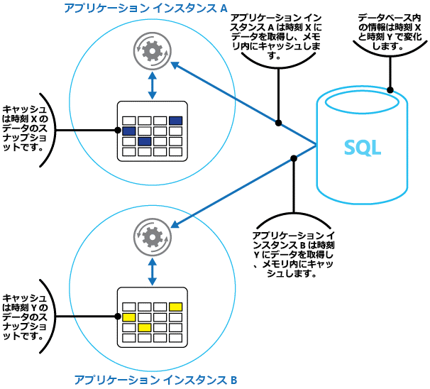
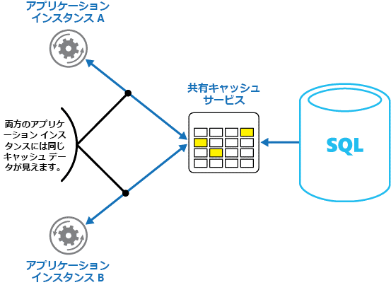
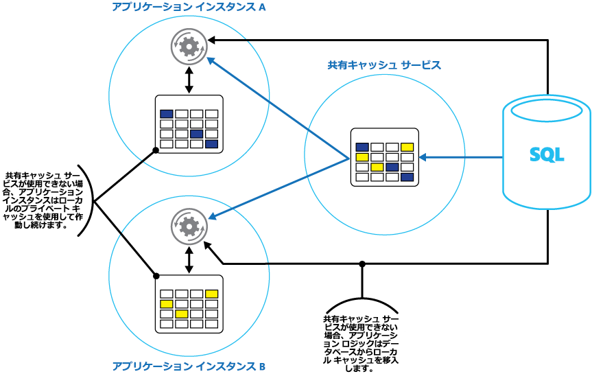

# <a name="caching"></a><span data-ttu-id="42cf9-103">キャッシュ</span><span class="sxs-lookup"><span data-stu-id="42cf9-103">Caching</span></span>

<span data-ttu-id="42cf9-104">キャッシュは、システムのパフォーマンスとスケーラビリティを改善することを目的とする一般的な手法です。</span><span class="sxs-lookup"><span data-stu-id="42cf9-104">Caching is a common technique that aims to improve the performance and scalability of a system.</span></span> <span data-ttu-id="42cf9-105">キャッシュは、アプリケーションに近い場所にある高速ストレージに、アクセス頻度が高いデータを一時的にコピーして、この目的を達成しています。</span><span class="sxs-lookup"><span data-stu-id="42cf9-105">It does this by temporarily copying frequently accessed data to fast storage that's located close to the application.</span></span> <span data-ttu-id="42cf9-106">この高速データ ストレージを元のソースよりもアプリケーションに近い場所に配置すると、キャッシュにより、データがよりすばやく提供され、クライアント アプリケーションの応答時間を大幅に改善できます。</span><span class="sxs-lookup"><span data-stu-id="42cf9-106">If this fast data storage is located closer to the application than the original source, then caching can significantly improve response times for client applications by serving data more quickly.</span></span>

<span data-ttu-id="42cf9-107">キャッシュが最も効果的なのは、クライアント インスタンスが同じデータを繰り返し読み取る場合です。元のデータ ストアが次のすべての条件に該当する場合は、特に効果的です。その条件は次のとおりです。</span><span class="sxs-lookup"><span data-stu-id="42cf9-107">Caching is most effective when a client instance repeatedly reads the same data, especially if all the following conditions apply to the original data store:</span></span>

* <span data-ttu-id="42cf9-108">比較的静的である。</span><span class="sxs-lookup"><span data-stu-id="42cf9-108">It remains relatively static.</span></span>
* <span data-ttu-id="42cf9-109">キャッシュの速度に比べて遅い。</span><span class="sxs-lookup"><span data-stu-id="42cf9-109">It's slow compared to the speed of the cache.</span></span>
* <span data-ttu-id="42cf9-110">高レベルの競合が発生する可能性がある。</span><span class="sxs-lookup"><span data-stu-id="42cf9-110">It's subject to a high level of contention.</span></span>
* <span data-ttu-id="42cf9-111">ネットワークの待機時間によってアクセスが低速になることがほとんどない。</span><span class="sxs-lookup"><span data-stu-id="42cf9-111">It's far away when network latency can cause access to be slow.</span></span>

## <a name="caching-in-distributed-applications"></a><span data-ttu-id="42cf9-112">分散アプリケーションでのキャッシュ</span><span class="sxs-lookup"><span data-stu-id="42cf9-112">Caching in distributed applications</span></span>
<span data-ttu-id="42cf9-113">データをキャッシュする場合、分散アプリケーションでは通常、次の戦略のどちらか、または両方を実装します。</span><span class="sxs-lookup"><span data-stu-id="42cf9-113">Distributed applications typically implement either or both of the following strategies when caching data:</span></span>

* <span data-ttu-id="42cf9-114">プライベート キャッシュを使用する (アプリケーションまたはサービスのインスタンスが実行されているコンピューター上でデータがローカルに保持されている場合)。</span><span class="sxs-lookup"><span data-stu-id="42cf9-114">Using a private cache, where data is held locally on the computer that's running an instance of an application or service.</span></span>
* <span data-ttu-id="42cf9-115">共有キャッシュ (複数のプロセスやマシンがアクセス可能な共通ソースとして機能します) を使用する。</span><span class="sxs-lookup"><span data-stu-id="42cf9-115">Using a shared cache, serving as a common source which can be accessed by multiple processes and/or machines.</span></span>

<span data-ttu-id="42cf9-116">いずれの場合でも、クライアント側、サーバー側、またはその両方でキャッシュを実行できます。</span><span class="sxs-lookup"><span data-stu-id="42cf9-116">In both cases, caching can be performed client-side and/or server-side.</span></span> <span data-ttu-id="42cf9-117">クライアント側キャッシュは、システムのユーザー インターフェイスを提供するプロセスによって実行されます。たとえば、Web ブラウザーやデスクトップ アプリケーションなどのプロセスです。</span><span class="sxs-lookup"><span data-stu-id="42cf9-117">Client-side caching is done by the process that provides the user interface for a system, such as a web browser or desktop application.</span></span>
<span data-ttu-id="42cf9-118">サーバー側キャッシュは、リモートで実行されるビジネス サービスを提供するプロセスによって実行されます。</span><span class="sxs-lookup"><span data-stu-id="42cf9-118">Server-side caching is done by the process that provides the business services that are running remotely.</span></span>

### <a name="private-caching"></a><span data-ttu-id="42cf9-119">プライベート キャッシュ</span><span class="sxs-lookup"><span data-stu-id="42cf9-119">Private caching</span></span>
<span data-ttu-id="42cf9-120">最も基本的な種類のキャッシュはメモリ内ストアです。</span><span class="sxs-lookup"><span data-stu-id="42cf9-120">The most basic type of cache is an in-memory store.</span></span> <span data-ttu-id="42cf9-121">単一プロセスのアドレス空間に保持され、そのプロセス内で実行されるコードから直接アクセスされます。</span><span class="sxs-lookup"><span data-stu-id="42cf9-121">It's held in the address space of a single process and accessed directly by the code that runs in that process.</span></span> <span data-ttu-id="42cf9-122">この種類のキャッシュには、非常に高速にアクセスできます。</span><span class="sxs-lookup"><span data-stu-id="42cf9-122">This type of cache is very quick to access.</span></span> <span data-ttu-id="42cf9-123">また、通常、プロセスをホストするマシンで利用可能なメモリの量によってキャッシュのサイズは制限されるため、少量の静的データを保存する場合にとても効果的な手段でもあります。</span><span class="sxs-lookup"><span data-stu-id="42cf9-123">It can also provide an extremely effective means for storing modest amounts of static data, since the size of a cache is typically constrained by the volume of memory that's available on the machine hosting the process.</span></span>

<span data-ttu-id="42cf9-124">メモリ内で物理的に可能な量よりも多くの情報をキャッシュする必要がある場合は、キャッシュされたデータをローカル ファイル システムに書き込むことができます。</span><span class="sxs-lookup"><span data-stu-id="42cf9-124">If you need to cache more information than is physically possible in memory, you can write cached data to the local file system.</span></span> <span data-ttu-id="42cf9-125">こうしたデータへのアクセスは、メモリ内に保持されたデータへのアクセスよりも遅くなりますが、ネットワーク経由でデータを取得するよりも早く、信頼性も高まります。</span><span class="sxs-lookup"><span data-stu-id="42cf9-125">This will be slower to access than data that's held in-memory, but should still be faster and more reliable than retrieving data across a network.</span></span>

<span data-ttu-id="42cf9-126">このモデルを使用するアプリケーションの複数のインスタンスを同時に実行する場合、各アプリケーション インスタンスは、それ自身のデータのコピーを保持する独立したキャッシュを持ちます。</span><span class="sxs-lookup"><span data-stu-id="42cf9-126">If you have multiple instances of an application that uses this model running concurrently, each application instance has its own independent cache holding its own copy of the data.</span></span>

<span data-ttu-id="42cf9-127">キャッシュは、過去のある時点における元のデータのスナップショットであると考えてください。</span><span class="sxs-lookup"><span data-stu-id="42cf9-127">Think of a cache as a snapshot of the original data at some point in the past.</span></span> <span data-ttu-id="42cf9-128">このデータが静的ではない場合、それぞれのアプリケーション インスタンスが、自身のキャッシュにある異なるバージョンのデータを保持する可能性があります。</span><span class="sxs-lookup"><span data-stu-id="42cf9-128">If this data is not static, it is likely that different application instances hold different versions of the data in their caches.</span></span> <span data-ttu-id="42cf9-129">したがって、これらのインスタンスで同じクエリを実行しても、図 1 に示すように異なる結果が返される可能性があります。</span><span class="sxs-lookup"><span data-stu-id="42cf9-129">Therefore, the same query performed by these instances can return different results, as shown in Figure 1.</span></span>



<span data-ttu-id="42cf9-131">*図 1: アプリケーションの複数のインスタンスにおけるメモリ内キャッシュの使用*</span><span class="sxs-lookup"><span data-stu-id="42cf9-131">*Figure 1: Using an in-memory cache in different instances of an application*</span></span>

### <a name="shared-caching"></a><span data-ttu-id="42cf9-132">Shared Caching</span><span class="sxs-lookup"><span data-stu-id="42cf9-132">Shared caching</span></span>
<span data-ttu-id="42cf9-133">共有キャッシュを使用すると、メモリ内キャッシュで起きる可能性があるような、キャッシュごとにデータが異なるかもしれないという不安を和らげることができます。</span><span class="sxs-lookup"><span data-stu-id="42cf9-133">Using a shared cache can help alleviate concerns that data might differ in each cache, which can occur with in-memory caching.</span></span> <span data-ttu-id="42cf9-134">Shared Caching を使用すると、複数のアプリケーション インスタンスから見えるキャッシュ データのビューは同じになります。</span><span class="sxs-lookup"><span data-stu-id="42cf9-134">Shared caching ensures that different application instances see the same view of cached data.</span></span> <span data-ttu-id="42cf9-135">この処理は、図 2 のように、別の場所 (通常は別のサービスの一部としてホストされている場所) にあるキャッシュを特定することで実行されています。</span><span class="sxs-lookup"><span data-stu-id="42cf9-135">It does this by locating the cache in a separate location, typically hosted as part of a separate service, as shown in Figure 2.</span></span>



<span data-ttu-id="42cf9-137">*図 2: 共有キャッシュの使用*</span><span class="sxs-lookup"><span data-stu-id="42cf9-137">*Figure 2: Using a shared cache*</span></span>

<span data-ttu-id="42cf9-138">Shared Caching を使用する方法の重要な利点は、スケーラビリティがあることです。</span><span class="sxs-lookup"><span data-stu-id="42cf9-138">An important benefit of the shared caching approach is the scalability it provides.</span></span> <span data-ttu-id="42cf9-139">多くの共有キャッシュ サービスは、サーバーのクラスターを使用して実装され、クラスター全体にわたってデータを透過的に配布するソフトウェアを使用します。</span><span class="sxs-lookup"><span data-stu-id="42cf9-139">Many shared cache services are implemented by using a cluster of servers, and utilize software that distributes the data across the cluster in a transparent manner.</span></span> <span data-ttu-id="42cf9-140">アプリケーション インスタンスからは、キャッシュ サービスに対して要求が送信されるだけです。</span><span class="sxs-lookup"><span data-stu-id="42cf9-140">An application instance simply sends a request to the cache service.</span></span>
<span data-ttu-id="42cf9-141">クラスター内のキャッシュ データの場所を特定するのは、基になるインフラストラクチャの役割です。</span><span class="sxs-lookup"><span data-stu-id="42cf9-141">The underlying infrastructure is responsible for determining the location of the cached data in the cluster.</span></span> <span data-ttu-id="42cf9-142">サーバーの数を増やすことで、キャッシュを簡単に拡張できます。</span><span class="sxs-lookup"><span data-stu-id="42cf9-142">You can easily scale the cache by adding more servers.</span></span>

<span data-ttu-id="42cf9-143">Shared Caching を使用する方法の主な欠点が 2 つあります。</span><span class="sxs-lookup"><span data-stu-id="42cf9-143">There are two main disadvantages of the shared caching approach:</span></span>

* <span data-ttu-id="42cf9-144">各アプリケーション インスタンスのローカルにキャッシュが保持されないので、キャッシュのアクセス速度は遅くなります。</span><span class="sxs-lookup"><span data-stu-id="42cf9-144">The cache is slower to access because it is no longer held locally to each application instance.</span></span>
* <span data-ttu-id="42cf9-145">個別のキャッシュ サービスを実装する要件がある場合、ソリューションはさらに複雑になる可能性があります。</span><span class="sxs-lookup"><span data-stu-id="42cf9-145">The requirement to implement a separate cache service might add complexity to the solution.</span></span>

## <a name="considerations-for-using-caching"></a><span data-ttu-id="42cf9-146">キャッシュの使用に関する注意点</span><span class="sxs-lookup"><span data-stu-id="42cf9-146">Considerations for using caching</span></span>
<span data-ttu-id="42cf9-147">次のセクションでは、キャッシュの設計と使用に関する注意点を詳細に説明します。</span><span class="sxs-lookup"><span data-stu-id="42cf9-147">The following sections describe in more detail the considerations for designing and using a cache.</span></span>

### <a name="decide-when-to-cache-data"></a><span data-ttu-id="42cf9-148">データをキャッシュするタイミングを決める</span><span class="sxs-lookup"><span data-stu-id="42cf9-148">Decide when to cache data</span></span>
<span data-ttu-id="42cf9-149">キャッシュによって、パフォーマンス、スケーラビリティ、および可用性が大幅に向上します。</span><span class="sxs-lookup"><span data-stu-id="42cf9-149">Caching can dramatically improve performance, scalability, and availability.</span></span> <span data-ttu-id="42cf9-150">データが多いほど、またそのデータにアクセスする必要があるユーザー数が多いほど、キャッシュの利点は大きくなります。</span><span class="sxs-lookup"><span data-stu-id="42cf9-150">The more data that you have and the larger the number of users that need to access this data, the greater the benefits of caching become.</span></span> <span data-ttu-id="42cf9-151">これは、元のデータ ストアで大量の同時要求を処理する場合に発生する待機時間や競合が、キャッシュによって軽減されるためです。</span><span class="sxs-lookup"><span data-stu-id="42cf9-151">That's because caching reduces the latency and contention that's associated with handling large volumes of concurrent requests in the original data store.</span></span>

<span data-ttu-id="42cf9-152">たとえば、サポートされる同時接続数が制限されているデータベースがあるとします。</span><span class="sxs-lookup"><span data-stu-id="42cf9-152">For example, a database might support a limited number of concurrent connections.</span></span> <span data-ttu-id="42cf9-153">基になるデータベースではなく、共有キャッシュからデータを取得すると、接続数の上限に達している場合でも、クライアント アプリケーションからそのデータにアクセスできます。</span><span class="sxs-lookup"><span data-stu-id="42cf9-153">Retrieving data from a shared cache, however, rather than the underlying database, makes it possible for a client application to access this data even if the number of available connections is currently exhausted.</span></span> <span data-ttu-id="42cf9-154">また、データベースを利用できなくなっても、クライアント アプリケーションはキャッシュに保持されているデータを使用して継続できる可能性があります。</span><span class="sxs-lookup"><span data-stu-id="42cf9-154">Additionally, if the database becomes unavailable, client applications might be able to continue by using the data that's held in the cache.</span></span>

<span data-ttu-id="42cf9-155">読み取り頻度が高く、変更頻度が低いデータのキャッシュを検討してみてください (たとえば、書き込み操作よりも読み取り操作の割合が高いデータなどです)。</span><span class="sxs-lookup"><span data-stu-id="42cf9-155">Consider caching data that is read frequently but modified infrequently (for example, data that has a higher proportion of read operations than write operations).</span></span> <span data-ttu-id="42cf9-156">ただし、重要な情報の信頼できるストアとしてキャッシュを使用することはお勧めしません。</span><span class="sxs-lookup"><span data-stu-id="42cf9-156">However, we don't recommend that you use the cache as the authoritative store of critical information.</span></span> <span data-ttu-id="42cf9-157">アプリケーションが損失を許容できないすべての変更は、必ず永続的なデータ ストアに保存してください。</span><span class="sxs-lookup"><span data-stu-id="42cf9-157">Instead, ensure that all changes that your application cannot afford to lose are always saved to a persistent data store.</span></span> <span data-ttu-id="42cf9-158">こうすることで、キャッシュを使用できない場合でも、アプリケーションは永続的なデータ ストアを使用して処理を続行できるため、重要な情報を失うことはありません。</span><span class="sxs-lookup"><span data-stu-id="42cf9-158">This means that if the cache is unavailable, your application can still continue to operate by using the data store, and you won't lose important information.</span></span>

### <a name="determine-how-to-cache-data-effectively"></a><span data-ttu-id="42cf9-159">データを効率的にキャッシュする方法を決める</span><span class="sxs-lookup"><span data-stu-id="42cf9-159">Determine how to cache data effectively</span></span>
<span data-ttu-id="42cf9-160">キャッシュを効果的に使用する鍵は、最もキャッシュに適したデータを決定し、適切なタイミングでそのデータをキャッシュすることにあります。</span><span class="sxs-lookup"><span data-stu-id="42cf9-160">The key to using a cache effectively lies in determining the most appropriate data to cache, and caching it at the appropriate time.</span></span> <span data-ttu-id="42cf9-161">データは、アプリケーションから初めて取得されるときに必要に応じてキャッシュに追加できます。</span><span class="sxs-lookup"><span data-stu-id="42cf9-161">The data can be added to the cache on demand the first time it is retrieved by an application.</span></span> <span data-ttu-id="42cf9-162">言い換えると、アプリケーションがデータ ストアからデータを取得する必要があるのは 1 回のみで、以降のアクセスにはキャッシュを利用できるようになります。</span><span class="sxs-lookup"><span data-stu-id="42cf9-162">This means that the application needs to fetch the data only once from the data store, and that subsequent access can be satisfied by using the cache.</span></span>

<span data-ttu-id="42cf9-163">また、前もって (通常はアプリケーションの開始時に) データの一部またはすべてをキャッシュに保存することもできます (シード処理と呼ばれる方法です)。</span><span class="sxs-lookup"><span data-stu-id="42cf9-163">Alternatively, a cache can be partially or fully populated with data in advance, typically when the application starts (an approach known as seeding).</span></span> <span data-ttu-id="42cf9-164">ただし、この方法では、アプリケーションの実行開始時に、元のデータ ストアに大きな負荷が急激にかかる可能性があるため、大きなキャッシュのシード処理は実装しないことをお勧めします。</span><span class="sxs-lookup"><span data-stu-id="42cf9-164">However, it might not be advisable to implement seeding for a large cache because this approach can impose a sudden, high load on the original data store when the application starts running.</span></span>

<span data-ttu-id="42cf9-165">多くの場合、使用パターンを分析することで、キャッシュの事前作成を完全にまたは部分的のどちらで行うのか決定し、キャッシュする必要のあるデータを選択しやすくなります。</span><span class="sxs-lookup"><span data-stu-id="42cf9-165">Often an analysis of usage patterns can help you decide whether to fully or partially prepopulate a cache, and to choose the data to cache.</span></span> <span data-ttu-id="42cf9-166">たとえば、アプリケーションを定期的 (たとえば毎日) に使用する顧客に関する静的なユーザー プロファイル データでキャッシュをシード処理することは有用ですが、1 週間に 1 度だけアプリケーションを使用する顧客のプロファイル データの場合は役には立たない可能性があります。</span><span class="sxs-lookup"><span data-stu-id="42cf9-166">For example, it can be useful to seed the cache with the static user profile data for customers who use the application regularly (perhaps every day), but not for customers who use the application only once a week.</span></span>

<span data-ttu-id="42cf9-167">通常、キャッシュは、変更することのできないデータまたは変更の頻度の低いデータでは十分に機能します。</span><span class="sxs-lookup"><span data-stu-id="42cf9-167">Caching typically works well with data that is immutable or that changes infrequently.</span></span> <span data-ttu-id="42cf9-168">たとえば、e コマースアプリケーションの製品および価格情報などの参考情報や、構築するのに費用がかかる共有静的リソースなどです。</span><span class="sxs-lookup"><span data-stu-id="42cf9-168">Examples include reference information such as product and pricing information in an e-commerce application, or shared static resources that are costly to construct.</span></span> <span data-ttu-id="42cf9-169">こうしたデータの一部またはすべてをアプリケーションの起動時にキャッシュに読み込むことで、リソースに対する要求を最小限に抑えるとともに、パフォーマンスを向上させることができます。</span><span class="sxs-lookup"><span data-stu-id="42cf9-169">Some or all of this data can be loaded into the cache at application startup to minimize demand on resources and to improve performance.</span></span> <span data-ttu-id="42cf9-170">キャッシュ内の参照データを定期的に更新して最新に保つバックグラウンド プロセス、または参照データが変更されたときにキャッシュを更新するバックグラウンド プロセスを設定することが適切な場合もあります。</span><span class="sxs-lookup"><span data-stu-id="42cf9-170">It might also be appropriate to have a background process that periodically updates reference data in the cache to ensure it is up to date, or that refreshes the cache when reference data changes.</span></span>

<span data-ttu-id="42cf9-171">この注意点にはいくつかの例外がありますが、動的なデータではキャッシュはあまり有用ではありません (詳細については、この記事の「非常に動的なデータをキャッシュする」セクションを参照してください)。</span><span class="sxs-lookup"><span data-stu-id="42cf9-171">Caching is less useful for dynamic data, although there are some exceptions to this consideration (see the section Cache highly dynamic data later in this article for more information).</span></span> <span data-ttu-id="42cf9-172">元のデータが定期的に変更される場合、キャッシュされた情報がすぐに古くなるか、キャッシュを元のデータ ストアと同期させ続けるオーバーヘッドによってキャッシュの有効性が低下する可能性があります。</span><span class="sxs-lookup"><span data-stu-id="42cf9-172">When the original data changes regularly, either the cached information becomes stale very quickly or the overhead of synchronizing the cache with the original data store reduces the effectiveness of caching.</span></span>

<span data-ttu-id="42cf9-173">キャッシュにはエンティティの完全なデータを含める必要はないことに注意してください。</span><span class="sxs-lookup"><span data-stu-id="42cf9-173">Note that a cache does not have to include the complete data for an entity.</span></span> <span data-ttu-id="42cf9-174">たとえば、あるデータ項目が、名前、住所、および口座残高を持つ銀行の顧客のような複数値オブジェクトを表す場合、こうした要素の一部 (名前や住所など) は静的なままですが、他の要素 (口座残高など) はより動的な場合があります。</span><span class="sxs-lookup"><span data-stu-id="42cf9-174">For example, if a data item represents a multivalued object such as a bank customer with a name, address, and account balance, some of these elements might remain static (such as the name and address), while others (such as the account balance) might be more dynamic.</span></span> <span data-ttu-id="42cf9-175">このような場合、データの静的な部分をキャッシュし、残りの情報は必要に応じて取得 (または計算) するだけにした方が有効な可能性があります。</span><span class="sxs-lookup"><span data-stu-id="42cf9-175">In these situations, it can be useful to cache the static portions of the data and retrieve (or calculate) only the remaining information when it is required.</span></span>

<span data-ttu-id="42cf9-176">キャッシュの事前入力、オンデマンドの読み込み、またはその両方の組み合わせのどれが適しているかを判断するには、パフォーマンスのテストと使用状況の分析を行うことをお勧めします。</span><span class="sxs-lookup"><span data-stu-id="42cf9-176">We recommend that you carry out performance testing and usage analysis to determine whether pre-population or on-demand loading of the cache, or a combination of both, is appropriate.</span></span> <span data-ttu-id="42cf9-177">データの変化の頻度と使用パターンに基づいて判断する必要があります。</span><span class="sxs-lookup"><span data-stu-id="42cf9-177">The decision should be based on the volatility and usage pattern of the data.</span></span> <span data-ttu-id="42cf9-178">キャッシュの使用率とパフォーマンスの分析は、大きな負荷がかかるため拡張性を高める必要のあるアプリケーションでは特に重要です。</span><span class="sxs-lookup"><span data-stu-id="42cf9-178">Cache utilization and performance analysis is particularly important in applications that encounter heavy loads and must be highly scalable.</span></span> <span data-ttu-id="42cf9-179">たとえば、拡張性の高いシナリオでは、キャッシュをシードしてピーク時にデータ ストアへの負荷を軽減することは有効です。</span><span class="sxs-lookup"><span data-stu-id="42cf9-179">For example, in highly scalable scenarios it might make sense to seed the cache to reduce the load on the data store at peak times.</span></span>

<span data-ttu-id="42cf9-180">キャッシュを使用して、アプリケーションの実行時に計算が繰り返し行われることを防ぐこともできます。</span><span class="sxs-lookup"><span data-stu-id="42cf9-180">Caching can also be used to avoid repeating computations while the application is running.</span></span> <span data-ttu-id="42cf9-181">ある操作でデータの変換または複雑な計算を実行する場合、キャッシュ内に操作の結果を保存できます。</span><span class="sxs-lookup"><span data-stu-id="42cf9-181">If an operation transforms data or performs a complicated calculation, it can save the results of the operation in the cache.</span></span> <span data-ttu-id="42cf9-182">以降、同じ計算が必要になった場合、アプリケーションはキャッシュからその結果を取得するだけで済みます。</span><span class="sxs-lookup"><span data-stu-id="42cf9-182">If the same calculation is required afterward, the application can simply retrieve the results from the cache.</span></span>

<span data-ttu-id="42cf9-183">アプリケーションは、キャッシュ内に保存されているデータを変更できます。</span><span class="sxs-lookup"><span data-stu-id="42cf9-183">An application can modify data that's held in a cache.</span></span> <span data-ttu-id="42cf9-184">ただし、キャッシュは、あらゆるタイミングで消える可能性がある一時的なデータ ストアとして考えることをお勧めします。</span><span class="sxs-lookup"><span data-stu-id="42cf9-184">However, we recommend thinking of the cache as a transient data store that could disappear at any time.</span></span> <span data-ttu-id="42cf9-185">重要なデータはキャッシュのみに保存せず、元のデータ ストアにも情報を保存してください。</span><span class="sxs-lookup"><span data-stu-id="42cf9-185">Do not store valuable data in the cache only; make sure that you maintain the information in the original data store as well.</span></span> <span data-ttu-id="42cf9-186">こうすることで、キャッシュが利用できなくなった場合でも、データを失う可能性を最小限に抑えられます。</span><span class="sxs-lookup"><span data-stu-id="42cf9-186">This means that if the cache becomes unavailable, you minimize the chance of losing data.</span></span>

### <a name="cache-highly-dynamic-data"></a><span data-ttu-id="42cf9-187">非常に動的なデータをキャッシュする</span><span class="sxs-lookup"><span data-stu-id="42cf9-187">Cache highly dynamic data</span></span>
<span data-ttu-id="42cf9-188">変更頻度が高い情報を永続的なデータ ストアに保存すると、システムにオーバーヘッドが発生する可能性があります。</span><span class="sxs-lookup"><span data-stu-id="42cf9-188">When you store rapidly-changing information in a persistent data store, it can impose an overhead on the system.</span></span> <span data-ttu-id="42cf9-189">たとえば、状態などの測定値を継続的に報告するデバイスがあるとします。</span><span class="sxs-lookup"><span data-stu-id="42cf9-189">For example, consider a device that continually reports status or some other measurement.</span></span> <span data-ttu-id="42cf9-190">キャッシュされた情報がほとんどいつも期限切れであることを踏まえて、アプリケーションがこのデータをキャッシュしないことを選択した場合、この情報を保存およびデータ ストアから取得するときも同じ考察が行われます。</span><span class="sxs-lookup"><span data-stu-id="42cf9-190">If an application chooses not to cache this data on the basis that the cached information will nearly always be outdated, then the same consideration could be true when storing and retrieving this information from the data store.</span></span> <span data-ttu-id="42cf9-191">このデータの保存および取得にかかる時間の間に、データが変更される可能性があるのです。</span><span class="sxs-lookup"><span data-stu-id="42cf9-191">In the time it takes to save and fetch this data, it might have changed.</span></span>

<span data-ttu-id="42cf9-192">このような状況では、動的な情報を永続的なデータ ストアではなく、キャッシュに直接保存するメリットを検討してください。</span><span class="sxs-lookup"><span data-stu-id="42cf9-192">In a situation such as this, consider the benefits of storing the dynamic information directly in the cache instead of in the persistent data store.</span></span> <span data-ttu-id="42cf9-193">データが重要なものではなく、監査する必要がない場合、不定期の変更内容が失われても問題にはなりません。</span><span class="sxs-lookup"><span data-stu-id="42cf9-193">If the data is non-critical and does not require auditing, then it doesn't matter if the occasional change is lost.</span></span>

### <a name="manage-data-expiration-in-a-cache"></a><span data-ttu-id="42cf9-194">キャッシュ内のデータの有効期限を管理する</span><span class="sxs-lookup"><span data-stu-id="42cf9-194">Manage data expiration in a cache</span></span>
<span data-ttu-id="42cf9-195">ほとんどの場合は、キャッシュに保持されるデータは、元のデータ ストアに保持されているデータのコピーです。</span><span class="sxs-lookup"><span data-stu-id="42cf9-195">In most cases, data that's held in a cache is a copy of data that's held in the original data store.</span></span> <span data-ttu-id="42cf9-196">元のデータ ストアのデータがキャッシュ後に変更されると、キャッシュされたデータが古いものになります。</span><span class="sxs-lookup"><span data-stu-id="42cf9-196">The data in the original data store might change after it was cached, causing the cached data to become stale.</span></span> <span data-ttu-id="42cf9-197">多くのキャッシュ システムでは、キャッシュでデータの有効期限を設定して、データが期限切れになる期間を短縮することができます。</span><span class="sxs-lookup"><span data-stu-id="42cf9-197">Many caching systems enable you to configure the cache to expire data and reduce the period for which data may be out of date.</span></span>

<span data-ttu-id="42cf9-198">キャッシュされたデータは有効期限が切れるとキャッシュから削除され、アプリケーションは元のデータ ストアからそのデータを取得する必要があります (新しく取得した情報をキャッシュ内に戻すことができます)。</span><span class="sxs-lookup"><span data-stu-id="42cf9-198">When cached data expires, it's removed from the cache, and the application must retrieve the data from the original data store (it can put the newly-fetched information back into cache).</span></span> <span data-ttu-id="42cf9-199">キャッシュを設定するときに、既定の有効期限ポリシーを設定できます。</span><span class="sxs-lookup"><span data-stu-id="42cf9-199">You can set a default expiration policy when you configure the cache.</span></span> <span data-ttu-id="42cf9-200">多くのキャッシュ サービスでは、プログラムからキャッシュにオブジェクトを保存するときに、個々のオブジェクトの有効期限を設定することもできます。</span><span class="sxs-lookup"><span data-stu-id="42cf9-200">In many cache services, you can also stipulate the expiration period for individual objects when you store them programmatically in the cache.</span></span>
<span data-ttu-id="42cf9-201">絶対値として有効期限を指定できるキャッシュや、指定した期間内にアクセスされなかった場合にキャッシュから項目を削除するスライド式の値として有効期限を指定できるキャッシュがあります。</span><span class="sxs-lookup"><span data-stu-id="42cf9-201">Some caches enable you to specify the expiration period as an absolute value, or as a sliding value that causes the item to be removed from the cache if it is not accessed within the specified time.</span></span> <span data-ttu-id="42cf9-202">この設定は、指定したオブジェクトについてのみ、任意のキャッシュ全体の有効期限ポリシーを上書きします。</span><span class="sxs-lookup"><span data-stu-id="42cf9-202">This setting overrides any cache-wide expiration policy, but only for the specified objects.</span></span>

> [!NOTE]
> <span data-ttu-id="42cf9-203">キャッシュの有効期限とキャッシュに含まれるオブジェクトを慎重に検討してください。</span><span class="sxs-lookup"><span data-stu-id="42cf9-203">Consider the expiration period for the cache and the objects that it contains carefully.</span></span> <span data-ttu-id="42cf9-204">有効期限を短くしすぎると、オブジェクトはすぐに期限切れになり、キャッシュを使用するメリットが損なわれます。</span><span class="sxs-lookup"><span data-stu-id="42cf9-204">If you make it too short, objects will expire too quickly and you will reduce the benefits of using the cache.</span></span> <span data-ttu-id="42cf9-205">有効期限を長くしすぎると、データが古くなる危険性があります。</span><span class="sxs-lookup"><span data-stu-id="42cf9-205">If you make the period too long, you risk the data becoming stale.</span></span>
> 
> 

<span data-ttu-id="42cf9-206">データが長期間にわたって保持できるように設定されていると、キャッシュがいっぱいになる可能性もあります。</span><span class="sxs-lookup"><span data-stu-id="42cf9-206">It's also possible that the cache might fill up if data is allowed to remain resident for a long time.</span></span> <span data-ttu-id="42cf9-207">この場合、キャッシュに新規項目を追加する要求により、削除と呼ばれるプロセスで、一部の項目が強制的に削除される可能性があります。</span><span class="sxs-lookup"><span data-stu-id="42cf9-207">In this case, any requests to add new items to the cache might cause some items to be forcibly removed in a process known as eviction.</span></span> <span data-ttu-id="42cf9-208">キャッシュ サービスは、通常、最低使用頻度法 (LRU) に基づいてデータを削除しますが、一般にはこのポリシーを上書きして項目が削除されないようにすることができます。</span><span class="sxs-lookup"><span data-stu-id="42cf9-208">Cache services typically evict data on a least-recently-used (LRU) basis, but you can usually override this policy and prevent items from being evicted.</span></span> <span data-ttu-id="42cf9-209">ただし、この方法を採用すると、キャッシュの利用できるメモリ上限を超える危険性があります。</span><span class="sxs-lookup"><span data-stu-id="42cf9-209">However, if you adopt this approach, you risk exceeding the memory that's available in the cache.</span></span> <span data-ttu-id="42cf9-210">この場合、アプリケーションからキャッシュに項目を追加しようとすると、例外で失敗します。</span><span class="sxs-lookup"><span data-stu-id="42cf9-210">An application that attempts to add an item to the cache will fail with an exception.</span></span>

<span data-ttu-id="42cf9-211">キャッシュの実装方法によっては、追加の削除ポリシーを使用できます。</span><span class="sxs-lookup"><span data-stu-id="42cf9-211">Some caching implementations might provide additional eviction policies.</span></span> <span data-ttu-id="42cf9-212">削除ポリシーにはいくつの種類があります。</span><span class="sxs-lookup"><span data-stu-id="42cf9-212">There are several types of eviction policies.</span></span> <span data-ttu-id="42cf9-213">チェックの内容は次のとおりです</span><span class="sxs-lookup"><span data-stu-id="42cf9-213">These include:</span></span>

* <span data-ttu-id="42cf9-214">最近使用されたデータから削除される後入れ先出しポリシー (データが再利用されないと想定される場合に使用されます)。</span><span class="sxs-lookup"><span data-stu-id="42cf9-214">A most-recently-used policy (in the expectation that the data will not be required again).</span></span>
* <span data-ttu-id="42cf9-215">先入れ先出しポリシー (最も古いデータから削除されます)。</span><span class="sxs-lookup"><span data-stu-id="42cf9-215">A first-in-first-out policy (oldest data is evicted first).</span></span>
* <span data-ttu-id="42cf9-216">トリガーされたイベント (データの変更など) に基づく明示的な削除ポリシー。</span><span class="sxs-lookup"><span data-stu-id="42cf9-216">An explicit removal policy based on a triggered event (such as the data being modified).</span></span>

### <a name="invalidate-data-in-a-client-side-cache"></a><span data-ttu-id="42cf9-217">クライアント側キャッシュ内のデータを無効にする</span><span class="sxs-lookup"><span data-stu-id="42cf9-217">Invalidate data in a client-side cache</span></span>
<span data-ttu-id="42cf9-218">クライアント側キャッシュに保持されているデータは、一般的に、データをクライアントに提供するサービスの範囲外と見なされます。</span><span class="sxs-lookup"><span data-stu-id="42cf9-218">Data that's held in a client-side cache is generally considered to be outside the auspices of the service that provides the data to the client.</span></span> <span data-ttu-id="42cf9-219">サービスからクライアントに対して、クライアント側キャッシュの情報の追加または削除を直接強制することはできません。</span><span class="sxs-lookup"><span data-stu-id="42cf9-219">A service cannot directly force a client to add or remove information from a client-side cache.</span></span>

<span data-ttu-id="42cf9-220">つまり、適切に構成されていないキャッシュを使用しているクライアントは、古い情報を使い続ける可能性があります。</span><span class="sxs-lookup"><span data-stu-id="42cf9-220">This means that it's possible for a client that uses a poorly configured cache to continue using outdated information.</span></span> <span data-ttu-id="42cf9-221">たとえば、キャッシュの有効期限ポリシーが適切に実装されていない場合、元のデータ ストアの情報が変更されている場合でも、クライアントはローカルにキャッシュされた古い情報を使用する可能性があります。</span><span class="sxs-lookup"><span data-stu-id="42cf9-221">For example, if the expiration policies of the cache aren't properly implemented, a client might use outdated information that's cached locally when the information in the original data source has changed.</span></span>

<span data-ttu-id="42cf9-222">HTTP 接続経由でデータを提供する Web アプリケーションを作成している場合、Web クライアント (ブラウザーまたは Web プロキシなど) に対して、最新の情報を取得するように暗黙的に強制できます。</span><span class="sxs-lookup"><span data-stu-id="42cf9-222">If you are building a web application that serves data over an HTTP connection, you can implicitly force a web client (such as a browser or web proxy) to fetch the most recent information.</span></span> <span data-ttu-id="42cf9-223">この処理は、リソースの URI の変更によってリソースが更新された場合に実行できます。</span><span class="sxs-lookup"><span data-stu-id="42cf9-223">You can do this if a resource is updated by a change in the URI of that resource.</span></span> <span data-ttu-id="42cf9-224">Web クライアントは通常、クライアント側キャッシュのキーとしてリソースの URI を使用するため、URI を変更すると、Web クライアントは以前にキャッシュされたバージョンのリソースは無視して、代わりに新しいバージョンを取得します。</span><span class="sxs-lookup"><span data-stu-id="42cf9-224">Web clients typically use the URI of a resource as the key in the client-side cache, so if the URI changes, the web client ignores any previously cached versions of a resource and fetches the new version instead.</span></span>

## <a name="managing-concurrency-in-a-cache"></a><span data-ttu-id="42cf9-225">キャッシュ内での同時実行の管理</span><span class="sxs-lookup"><span data-stu-id="42cf9-225">Managing concurrency in a cache</span></span>
<span data-ttu-id="42cf9-226">多くの場合、キャッシュは、アプリケーションの複数のインスタンスで共有されるように設計されています。</span><span class="sxs-lookup"><span data-stu-id="42cf9-226">Caches are often designed to be shared by multiple instances of an application.</span></span> <span data-ttu-id="42cf9-227">各アプリケーション インスタンスは、キャッシュ内のデータを読み取り、変更できます。</span><span class="sxs-lookup"><span data-stu-id="42cf9-227">Each application instance can read and modify data in the cache.</span></span> <span data-ttu-id="42cf9-228">このため、共有データ ストアで生じるものと同じ同時実行の問題が、キャッシュにも当てはまります。</span><span class="sxs-lookup"><span data-stu-id="42cf9-228">Consequently, the same concurrency issues that arise with any shared data store also apply to a cache.</span></span> <span data-ttu-id="42cf9-229">キャッシュ内に保持されているデータをアプリケーションが変更する必要がある状況では、アプリケーションの 1 つのインスタンスによって行われた更新が、他のインスタンスによって行われた変更を上書きしないようにする必要があります。</span><span class="sxs-lookup"><span data-stu-id="42cf9-229">In a situation where an application needs to modify data that's held in the cache, you might need to ensure that updates made by one instance of the application do not overwrite the changes made by another instance.</span></span>

<span data-ttu-id="42cf9-230">データの性質と競合が発生する可能性に応じて、2 つの同時実行制御方法のいずれかを採用することができます。</span><span class="sxs-lookup"><span data-stu-id="42cf9-230">Depending on the nature of the data and the likelihood of collisions, you can adopt one of two approaches to concurrency:</span></span>

* <span data-ttu-id="42cf9-231">**オプティミスティック同時実行制御。**</span><span class="sxs-lookup"><span data-stu-id="42cf9-231">**Optimistic.**</span></span> <span data-ttu-id="42cf9-232">アプリケーションは、キャッシュ内のデータを更新する直前に、取得後にそのデータが変更されたかどうかを確認します。</span><span class="sxs-lookup"><span data-stu-id="42cf9-232">Immediately prior to updating the data, the application checks to see whether the data in the cache has changed since it was retrieved.</span></span> <span data-ttu-id="42cf9-233">データが同じままの場合、変更できます。</span><span class="sxs-lookup"><span data-stu-id="42cf9-233">If the data is still the same, the change can be made.</span></span> <span data-ttu-id="42cf9-234">同じではない場合、アプリケーションはデータを更新するかどうかを決定する必要があります</span><span class="sxs-lookup"><span data-stu-id="42cf9-234">Otherwise, the application has to decide whether to update it.</span></span> <span data-ttu-id="42cf9-235">(この決定を左右するビジネス ロジックは、アプリケーションによって異なります)。この方法は、更新が頻繁に行われる状況、または競合が発生する可能性がない状況に適しています。</span><span class="sxs-lookup"><span data-stu-id="42cf9-235">(The business logic that drives this decision will be application-specific.) This approach is suitable for situations where updates are infrequent, or where collisions are unlikely to occur.</span></span>
* <span data-ttu-id="42cf9-236">**ペシミスティック同時実行制御。**</span><span class="sxs-lookup"><span data-stu-id="42cf9-236">**Pessimistic.**</span></span> <span data-ttu-id="42cf9-237">アプリケーションは、キャッシュ内のデータを取得するときにそのデータをロックして、他のインスタンスがそのデータを変更できないようにします。</span><span class="sxs-lookup"><span data-stu-id="42cf9-237">When it retrieves the data, the application locks it in the cache to prevent another instance from changing it.</span></span> <span data-ttu-id="42cf9-238">このプロセスによって競合は起きなくなりますが、同じデータを処理する必要がある他のインスタンスもブロックされる可能性もあります。</span><span class="sxs-lookup"><span data-stu-id="42cf9-238">This process ensures that collisions cannot occur, but they can also block other instances that need to process the same data.</span></span> <span data-ttu-id="42cf9-239">ペシミスティック同時実行制御は、ソリューションのスケーラビリティに影響をあたえる可能性があるため、一時的な操作にのみ使用することをお勧めします。</span><span class="sxs-lookup"><span data-stu-id="42cf9-239">Pessimistic concurrency can affect the scalability of a solution and is recommended only for short-lived operations.</span></span> <span data-ttu-id="42cf9-240">この方法は、競合が発生する可能性が高い状況、特にアプリケーションがキャッシュ内の複数の項目を更新するため、こうした変更が矛盾なく適用されるようにする必要がある場合に適しています。</span><span class="sxs-lookup"><span data-stu-id="42cf9-240">This approach might be appropriate for situations where collisions are more likely, especially if an application updates multiple items in the cache and must ensure that these changes are applied consistently.</span></span>

### <a name="implement-high-availability-and-scalability-and-improve-performance"></a><span data-ttu-id="42cf9-241">高可用性とスケーラビリティの実装とパフォーマンスの向上</span><span class="sxs-lookup"><span data-stu-id="42cf9-241">Implement high availability and scalability, and improve performance</span></span>
<span data-ttu-id="42cf9-242">データのプライマリ リポジトリとしてキャッシュを使用しないでください。この役割は、キャッシュの入力元である元のデータ ストアのものです。</span><span class="sxs-lookup"><span data-stu-id="42cf9-242">Avoid using a cache as the primary repository of data; this is the role of the original data store from which the cache is populated.</span></span> <span data-ttu-id="42cf9-243">元のデータ ストアは、データの永続性を確保するために使用します。</span><span class="sxs-lookup"><span data-stu-id="42cf9-243">The original data store is responsible for ensuring the persistence of the data.</span></span>

<span data-ttu-id="42cf9-244">ソリューションに、共有キャッシュ サービスの可用性に関する重要な依存関係が発生しないように注意してください。</span><span class="sxs-lookup"><span data-stu-id="42cf9-244">Be careful not to introduce critical dependencies on the availability of a shared cache service into your solutions.</span></span> <span data-ttu-id="42cf9-245">共有キャッシュを提供するサービスが利用できなくなった場合でも、アプリケーションは継続的に機能する必要があります。</span><span class="sxs-lookup"><span data-stu-id="42cf9-245">An application should be able to continue functioning if the service that provides the shared cache is unavailable.</span></span> <span data-ttu-id="42cf9-246">キャッシュ サービスが再開されるまでアプリケーションが停止または失敗することは避ける必要があります。</span><span class="sxs-lookup"><span data-stu-id="42cf9-246">The application should not hang or fail while waiting for the cache service to resume.</span></span>

<span data-ttu-id="42cf9-247">そのため、アプリケーションは、キャッシュ サービスの可用性を検出し、キャッシュにアクセスできない場合に元のデータ ストアにフォール バックするようにしておく必要があります。</span><span class="sxs-lookup"><span data-stu-id="42cf9-247">Therefore, the application must be prepared to detect the availability of the cache service and fall back to the original data store if the cache is inaccessible.</span></span> <span data-ttu-id="42cf9-248">[サーキット ブレーカー パターン](http://msdn.microsoft.com/library/dn589784.aspx) が、このシナリオを処理するときに役立ちます。</span><span class="sxs-lookup"><span data-stu-id="42cf9-248">The [Circuit-Breaker pattern](http://msdn.microsoft.com/library/dn589784.aspx) is useful for handling this scenario.</span></span> <span data-ttu-id="42cf9-249">[キャッシュアサイド パターン](http://msdn.microsoft.com/library/dn589799.aspx)などの戦略に従うと、キャッシュを提供するサービスを復元でき、サービスが使用可能になると、元のデータ ストアからデータを読み取るときにキャッシュに再入力することができます。</span><span class="sxs-lookup"><span data-stu-id="42cf9-249">The service that provides the cache can be recovered, and once it becomes available, the cache can be repopulated as data is read from the original data store, following a strategy such as the [Cache-aside pattern](http://msdn.microsoft.com/library/dn589799.aspx).</span></span>

<span data-ttu-id="42cf9-250">ただし、キャッシュが一時的に利用できなくなったときに、アプリケーションが元のデータ ストアにフォール バックした場合、システムのスケーラビリティに影響が出る可能性があります。</span><span class="sxs-lookup"><span data-stu-id="42cf9-250">However, there might be a scalability impact on the system if the application falls back to the original data store when the cache is temporarily unavailable.</span></span>
<span data-ttu-id="42cf9-251">キャッシュのデータ ストアを回復している間に、元のデータ ストアがデータの要求に対応しきれず、タイムアウトや接続の失敗が発生する可能性があります。</span><span class="sxs-lookup"><span data-stu-id="42cf9-251">While the data store is being recovered, the original data store could be swamped with requests for data, resulting in timeouts and failed connections.</span></span>

<span data-ttu-id="42cf9-252">すべてのアプリケーション インスタンスがアクセスできる共有キャッシュとともに、アプリケーションの各インスタンスにローカルなプライベート キャッシュを実装することをお勧めします。</span><span class="sxs-lookup"><span data-stu-id="42cf9-252">Consider implementing a local, private cache in each instance of an application, together with the shared cache that all application instances access.</span></span> <span data-ttu-id="42cf9-253">アプリケーションは、項目を取得するときに、ローカル キャッシュ内、共有キャッシュ内、元のデータ ストア内の順に確認します。</span><span class="sxs-lookup"><span data-stu-id="42cf9-253">When the application retrieves an item, it can check first in its local cache, then in the shared cache, and finally in the original data store.</span></span> <span data-ttu-id="42cf9-254">ローカル キャッシュは、共有キャッシュのデータを使用して、または共有キャッシュが使用できない場合はデータベースのデータを使用して設定できます。</span><span class="sxs-lookup"><span data-stu-id="42cf9-254">The local cache can be populated using the data in either the shared cache, or in the database if the shared cache is unavailable.</span></span>

<span data-ttu-id="42cf9-255">この方法の場合、共有キャッシュと比較してローカル キャッシュが古くなりすぎないように、慎重に構成する必要があります。</span><span class="sxs-lookup"><span data-stu-id="42cf9-255">This approach requires careful configuration to prevent the local cache from becoming too stale with respect to the shared cache.</span></span> <span data-ttu-id="42cf9-256">ただし、共有キャッシュにアクセスできない場合、ローカル キャッシュはバッファーとして機能します。</span><span class="sxs-lookup"><span data-stu-id="42cf9-256">However, the local cache acts as a buffer if the shared cache is unreachable.</span></span> <span data-ttu-id="42cf9-257">図 3 に、この構造を示します。</span><span class="sxs-lookup"><span data-stu-id="42cf9-257">Figure 3 shows this structure.</span></span>

<span data-ttu-id="42cf9-258">
* 図 3: 共有キャッシュとローカルなプライベート キャッシュの併用*</span><span class="sxs-lookup"><span data-stu-id="42cf9-258">
*Figure 3: Using a local, private cache with a shared cache*</span></span>

<span data-ttu-id="42cf9-259">一部のキャッシュ サービスでは、有効期間が比較的長いデータを保持する大規模なキャッシュをサポートするために、キャッシュが使用できなくなった場合に自動フェールオーバーを実装する、高可用性オプションを使用できます。</span><span class="sxs-lookup"><span data-stu-id="42cf9-259">To support large caches that hold relatively long-lived data, some cache services provide a high-availability option that implements automatic failover if the cache becomes unavailable.</span></span> <span data-ttu-id="42cf9-260">通常、この方法では、プライマリ キャッシュ サーバーに格納されているキャッシュされたデータをセカンダリ キャッシュ サーバーにレプリケートして、プライマリ サーバーで障害が発生するか接続が失われた場合にセカンダリ サーバーに切り替えます。</span><span class="sxs-lookup"><span data-stu-id="42cf9-260">This approach typically involves replicating the cached data that's stored on a primary cache server to a secondary cache server, and switching to the secondary server if the primary server fails or connectivity is lost.</span></span>

<span data-ttu-id="42cf9-261">複数の送信先への書き込みに伴う待機時間を短くするために、プライマリ サーバーのキャッシュにデータが書き込まれるときに、セカンダリ サーバーへのレプリケーションが非同期的に行われる場合があります。</span><span class="sxs-lookup"><span data-stu-id="42cf9-261">To reduce the latency that's associated with writing to multiple destinations, the replication to the secondary server might occur asynchronously when data is written to the cache on the primary server.</span></span> <span data-ttu-id="42cf9-262">この方法では、障害発生時に一部のキャッシュされた情報が失われる可能性が生じますが、こうしたデータの量はキャッシュのサイズ全体と比べると小さい割合です。</span><span class="sxs-lookup"><span data-stu-id="42cf9-262">This approach leads to the possibility that some cached information might be lost in the event of a failure, but the proportion of this data should be small compared to the overall size of the cache.</span></span>

<span data-ttu-id="42cf9-263">共有キャッシュのサイズが大きい場合、キャッシュされたデータを複数のノードに分割して、競合の可能性を抑えてスケーラビリティを高めることをお勧めします。</span><span class="sxs-lookup"><span data-stu-id="42cf9-263">If a shared cache is large, it might be beneficial to partition the cached data across nodes to reduce the chances of contention and improve scalability.</span></span> <span data-ttu-id="42cf9-264">多くの共有キャッシュでは、ノードを直接追加 (および削除) し、パーティション間でデータを再調整する機能がサポートされています。</span><span class="sxs-lookup"><span data-stu-id="42cf9-264">Many shared caches support the ability to dynamically add (and remove) nodes and rebalance the data across partitions.</span></span> <span data-ttu-id="42cf9-265">この方法にはクラスタリングが使用される場合があります。クラスタリングの場合、複数ノードのコレクションがシームレスな 1 つのキャッシュとしてクライアント アプリケーションに提供されます。</span><span class="sxs-lookup"><span data-stu-id="42cf9-265">This approach might involve clustering, in which the collection of nodes is presented to client applications as a seamless, single cache.</span></span> <span data-ttu-id="42cf9-266">ただし、内部的には、負荷を均等に分散する事前定義の分散戦略に従って、データは複数のノードに分散されています。</span><span class="sxs-lookup"><span data-stu-id="42cf9-266">Internally, however, the data is dispersed between nodes following a predefined distribution strategy that balances the load evenly.</span></span> <span data-ttu-id="42cf9-267">Microsoft Web サイトの「[Data Partitioning Guidance (データのパーティション分割のガイダンス)](http://msdn.microsoft.com/library/dn589795.aspx)」ドキュメントでは、パーティション分割戦略に関する詳細が提供されています。</span><span class="sxs-lookup"><span data-stu-id="42cf9-267">The [Data partitioning guidance document](http://msdn.microsoft.com/library/dn589795.aspx) on the Microsoft website provides more information about possible partitioning strategies.</span></span>

<span data-ttu-id="42cf9-268">クラスタリングによって、キャッシュの可用性も向上できます。</span><span class="sxs-lookup"><span data-stu-id="42cf9-268">Clustering can also increase the availability of the cache.</span></span> <span data-ttu-id="42cf9-269">ノードが停止した場合でも、その他のキャッシュにはアクセスできます。</span><span class="sxs-lookup"><span data-stu-id="42cf9-269">If a node fails, the remainder of the cache is still accessible.</span></span>
<span data-ttu-id="42cf9-270">多くの場合、クラスタリングはレプリケーションとフェールオーバーと組み合わせて使用されます。</span><span class="sxs-lookup"><span data-stu-id="42cf9-270">Clustering is frequently used in conjunction with replication and failover.</span></span> <span data-ttu-id="42cf9-271">各ノードをレプリケートすることができます。また、ノードが停止した場合、レプリカをすばやくオンラインにすることができます。</span><span class="sxs-lookup"><span data-stu-id="42cf9-271">Each node can be replicated, and the replica can be quickly brought online if the node fails.</span></span>

<span data-ttu-id="42cf9-272">多くの読み取り操作および書き込み操作では、単一のデータの値またはオブジェクトが使用されます。</span><span class="sxs-lookup"><span data-stu-id="42cf9-272">Many read and write operations are likely to involve single data values or objects.</span></span> <span data-ttu-id="42cf9-273">ただし、ときには、大量のデータをすばやく保存または取得する必要がある状況も発生します。</span><span class="sxs-lookup"><span data-stu-id="42cf9-273">However, at times it might be necessary to store or retrieve large volumes of data quickly.</span></span>
<span data-ttu-id="42cf9-274">たとえば、キャッシュのシード処理では、数百から数千単位の項目をキャッシュに書き込む場合があります。</span><span class="sxs-lookup"><span data-stu-id="42cf9-274">For example, seeding a cache could involve writing hundreds or thousands of items to the cache.</span></span> <span data-ttu-id="42cf9-275">また、1 つの要求でキャッシュから関連する項目を多数取得する場合もあります。</span><span class="sxs-lookup"><span data-stu-id="42cf9-275">An application might also need to retrieve a large number of related items from the cache as part of the same request.</span></span>

<span data-ttu-id="42cf9-276">多くの大規模なキャッシュ サービスには、このような目的に対応できるバッチ操作が用意されています。</span><span class="sxs-lookup"><span data-stu-id="42cf9-276">Many large-scale caches provide batch operations for these purposes.</span></span> <span data-ttu-id="42cf9-277">この機能を利用すると、クライアント アプリケーションは大量の項目を 1 つの要求にパッケージ化し、小さな要求を多数の実行する場合に発生するオーバーヘッドを軽減することができます。</span><span class="sxs-lookup"><span data-stu-id="42cf9-277">This enables a client application to package up a large volume of items into a single request and reduces the overhead that's associated with performing a large number of small requests.</span></span>

## <a name="caching-and-eventual-consistency"></a><span data-ttu-id="42cf9-278">キャッシュおよび最終的な整合性</span><span class="sxs-lookup"><span data-stu-id="42cf9-278">Caching and eventual consistency</span></span>
<span data-ttu-id="42cf9-279">キャッシュアサイド パターンが機能するには、キャッシュを設定するアプリケーションのインスタンスから、最新かつ一貫性のあるバージョンのデータにアクセスできる必要があります。</span><span class="sxs-lookup"><span data-stu-id="42cf9-279">For the cache-aside pattern to work, the instance of the application that populates the cache must have access to the most recent and consistent version of the data.</span></span> <span data-ttu-id="42cf9-280">最終的な一貫性を実装するシステム (レプリケートされたデータ ストアなど) では、これに当てはまらない場合があります。</span><span class="sxs-lookup"><span data-stu-id="42cf9-280">In a system that implements eventual consistency (such as a replicated data store) this might not be the case.</span></span>

<span data-ttu-id="42cf9-281">アプリケーションの 1 つのインスタンスが、データ項目を変更し、その項目のキャッシュされたバージョンを無効化する可能性があります。</span><span class="sxs-lookup"><span data-stu-id="42cf9-281">One instance of an application could modify a data item and invalidate the cached version of that item.</span></span> <span data-ttu-id="42cf9-282">アプリケーションの別のインスタンスはキャッシュからこの項目を読み取ろうとする場合がありますが、この試行はキャッシュミスの原因になります。このため、このインスタンスは、データをデータ ストアから読み取ってキャッシュに追加します。</span><span class="sxs-lookup"><span data-stu-id="42cf9-282">Another instance of the application might attempt to read this item from a cache, which causes a cache-miss, so it reads the data from the data store and adds it to the cache.</span></span> <span data-ttu-id="42cf9-283">ただし、データ ストアが他のレプリカと完全には同期していない場合は、アプリケーション インスタンスは値が古いキャッシュを読み取り、設定する可能性があります。</span><span class="sxs-lookup"><span data-stu-id="42cf9-283">However, if the data store has not been fully synchronized with the other replicas, the application instance could read and populate the cache with the old value.</span></span>

<span data-ttu-id="42cf9-284">データ整合性の処理については、[データ整合性入門](http://msdn.microsoft.com/library/dn589800.aspx)を参照してください。</span><span class="sxs-lookup"><span data-stu-id="42cf9-284">For more information about handling data consistency, see the [Data consistency primer](http://msdn.microsoft.com/library/dn589800.aspx).</span></span>

### <a name="protect-cached-data"></a><span data-ttu-id="42cf9-285">キャッシュ データを保護する</span><span class="sxs-lookup"><span data-stu-id="42cf9-285">Protect cached data</span></span>
<span data-ttu-id="42cf9-286">使用するキャッシュ サービスにかかわらず、キャッシュ内に保持されているデータを不正なアクセスから守る方法を検討してください。</span><span class="sxs-lookup"><span data-stu-id="42cf9-286">Irrespective of the cache service you use, consider how to protect the data that's held in the cache from unauthorized access.</span></span> <span data-ttu-id="42cf9-287">次の 2 つの主な懸念事項があります。</span><span class="sxs-lookup"><span data-stu-id="42cf9-287">There are two main concerns:</span></span>

* <span data-ttu-id="42cf9-288">キャッシュ内のデータのプライバシー。</span><span class="sxs-lookup"><span data-stu-id="42cf9-288">The privacy of the data in the cache.</span></span>
* <span data-ttu-id="42cf9-289">キャッシュとキャッシュを使用するアプリケーションとの間を移動するデータのプライバシー。</span><span class="sxs-lookup"><span data-stu-id="42cf9-289">The privacy of data as it flows between the cache and the application that's using the cache.</span></span>

<span data-ttu-id="42cf9-290">キャッシュ内のデータを保護するには、アプリケーションが次の情報を指定することを必須とする認証メカニズムをキャッシュ サービスに実装する方法があります。</span><span class="sxs-lookup"><span data-stu-id="42cf9-290">To protect data in the cache, the cache service might implement an authentication mechanism that requires that applications specify the following:</span></span>

* <span data-ttu-id="42cf9-291">キャッシュ内のデータにアクセスできる ID。</span><span class="sxs-lookup"><span data-stu-id="42cf9-291">Which identities can access data in the cache.</span></span>
* <span data-ttu-id="42cf9-292">その ID に実行を許可する操作 (読み取りと書き込み)。</span><span class="sxs-lookup"><span data-stu-id="42cf9-292">Which operations (read and write) that these identities are allowed to perform.</span></span>

<span data-ttu-id="42cf9-293">データの読み取りおよび書き込みに伴うオーバーヘッドを抑えるために、ある ID にキャッシュへの書き込み/読み取りアクセス権が付与されると、その ID はキャッシュ内のデータを使用できるようになります。</span><span class="sxs-lookup"><span data-stu-id="42cf9-293">To reduce overhead that's associated with reading and writing data, after an identity has been granted write and/or read access to the cache, that identity can use any data in the cache.</span></span>

<span data-ttu-id="42cf9-294">キャッシュされたデータのサブセットに対するアクセスを制限する場合は、次のいずれかの処理を実行できます。</span><span class="sxs-lookup"><span data-stu-id="42cf9-294">If you need to restrict access to subsets of the cached data, you can do one of the following:</span></span>

* <span data-ttu-id="42cf9-295">(別のキャッシュ サーバーを使用して) キャッシュをパーティションに分割し、使用を許可するパーティションへのアクセス権のみを ID に付与する。</span><span class="sxs-lookup"><span data-stu-id="42cf9-295">Split the cache into partitions (by using different cache servers) and only grant access to identities for the partitions that they should be allowed to use.</span></span>
* <span data-ttu-id="42cf9-296">異なるキーを使用して各サブセット内のデータを暗号化し、各サブセットへのアクセス権を設定する必要がある ID にだけ暗号化キーを提供する。</span><span class="sxs-lookup"><span data-stu-id="42cf9-296">Encrypt the data in each subset by using different keys, and provide the encryption keys only to identities that should have access to each subset.</span></span> <span data-ttu-id="42cf9-297">この場合、クライアント アプリケーションはキャッシュ内のすべてのデータを取得することができますが、キーを持っているデータの暗号化のみを解除することができます。</span><span class="sxs-lookup"><span data-stu-id="42cf9-297">A client application might still be able to retrieve all of the data in the cache, but it will only be able to decrypt the data for which it has the keys.</span></span>

<span data-ttu-id="42cf9-298">また、キャッシュの書き込み時と読み取り時には、データを保護する必要があります。</span><span class="sxs-lookup"><span data-stu-id="42cf9-298">You must also protect the data as it flows in and out of the cache.</span></span> <span data-ttu-id="42cf9-299">保護する方法は、クライアント アプリケーションがキャッシュに接続するときに使用するネットワーク インフラストラクチャで提供されているセキュリティ機能によって異なります。</span><span class="sxs-lookup"><span data-stu-id="42cf9-299">To do this, you depend on the security features provided by the network infrastructure that client applications use to connect to the cache.</span></span> <span data-ttu-id="42cf9-300">クライアント アプリケーションをホストする同じ組織内のオンサイト サーバーを使用してキャッシュを実装する場合、ネットワークの隔離自体では追加の手順を行う必要はありません。</span><span class="sxs-lookup"><span data-stu-id="42cf9-300">If the cache is implemented using an on-site server within the same organization that hosts the client applications, then the isolation of the network itself might not require you to take  additional steps.</span></span> <span data-ttu-id="42cf9-301">キャッシュがリモートに配置され、パブリック ネットワーク (インターネットなど) 経由の TCP 接続または HTTP 接続が必要な場合、SSL の実装を検討してください。</span><span class="sxs-lookup"><span data-stu-id="42cf9-301">If the cache is located remotely and requires a TCP or HTTP connection over a public network (such as the Internet), consider implementing SSL.</span></span>

## <a name="considerations-for-implementing-caching-with-microsoft-azure"></a><span data-ttu-id="42cf9-302">Microsoft Azure でのキャッシュの実装に関する考慮事項</span><span class="sxs-lookup"><span data-stu-id="42cf9-302">Considerations for implementing caching with Microsoft Azure</span></span>

<span data-ttu-id="42cf9-303">[Azure Redis Cache](/azure/redis-cache/) は、Azure データセンターでサービスとして実行される オープン ソースの Redis Cache の実装です。</span><span class="sxs-lookup"><span data-stu-id="42cf9-303">[Azure Redis Cache](/azure/redis-cache/) is an implementation of the open source Redis cache that runs as a service in an Azure datacenter.</span></span> <span data-ttu-id="42cf9-304">Redis Cache は、Azure アプリケーションがクラウド サービスとして、Web サイトとして、または Azure 仮想マシン内に実装されているかにかかわらず、このアプリケーションからアクセスできるキャッシュ サービスを提供します。</span><span class="sxs-lookup"><span data-stu-id="42cf9-304">It provides a caching service that can be accessed from any Azure application, whether the application is implemented as a cloud service, a website, or inside an Azure virtual machine.</span></span> <span data-ttu-id="42cf9-305">キャッシュは、適切なアクセス キーを持つクライアント アプリケーションで共有できます。</span><span class="sxs-lookup"><span data-stu-id="42cf9-305">Caches can be shared by client applications that have the appropriate access key.</span></span>

<span data-ttu-id="42cf9-306">Azure Redis Cache は、可用性、スケーラビリティ、およびセキュリティを提供する高パフォーマンスのキャッシュ ソリューションです。</span><span class="sxs-lookup"><span data-stu-id="42cf9-306">Azure Redis Cache is a high-performance caching solution that provides availability, scalability and security.</span></span> <span data-ttu-id="42cf9-307">通常、Azure Redis Cache は、1 つまたは複数の専用マシン全体でサービスとして実行されます。</span><span class="sxs-lookup"><span data-stu-id="42cf9-307">It typically runs as a service spread across one or more dedicated machines.</span></span> <span data-ttu-id="42cf9-308">Azure Redis Cache は、確実に高速にアクセスできるメモリ内に可能な限り多くの情報を格納しようと試みます。</span><span class="sxs-lookup"><span data-stu-id="42cf9-308">It attempts to store as much information as it can in memory to ensure fast access.</span></span> <span data-ttu-id="42cf9-309">このアーキテクチャは低速な I/O 操作を実行する必要性を減らすことで、待機時間の短縮とスループットの増加を実現するためのものです。</span><span class="sxs-lookup"><span data-stu-id="42cf9-309">This architecture is intended to provide low latency and high throughput by reducing the need to perform slow I/O operations.</span></span>

 <span data-ttu-id="42cf9-310">Azure Redis Cache には、クライアント アプリケーションで使用されるさまざまな API の多くとの互換性があります。</span><span class="sxs-lookup"><span data-stu-id="42cf9-310">Azure Redis Cache is compatible with many of the various APIs that are used by client applications.</span></span> <span data-ttu-id="42cf9-311">オンプレミスで実行される Azure Redis Cache を既に使用している既存のアプリケーションがある場合、Azure Redis Cache を使用して簡単にクラウド内のキャッシュへと移行することができます。</span><span class="sxs-lookup"><span data-stu-id="42cf9-311">If you have existing applications that already use Azure Redis Cache running on-premises, the Azure Redis Cache provides a quick migration path to caching in the cloud.</span></span>


### <a name="features-of-redis"></a><span data-ttu-id="42cf9-312">Redis の機能</span><span class="sxs-lookup"><span data-stu-id="42cf9-312">Features of Redis</span></span>
 <span data-ttu-id="42cf9-313">Redis は単なるキャッシュ サーバーではありません。</span><span class="sxs-lookup"><span data-stu-id="42cf9-313">Redis is more than a simple cache server.</span></span> <span data-ttu-id="42cf9-314">分散型のメモリ内データベース機能があり、多くの一般的なシナリオに対応する多数のコマンドが用意されています。</span><span class="sxs-lookup"><span data-stu-id="42cf9-314">It provides a distributed in-memory database with an extensive command set that supports many common scenarios.</span></span> <span data-ttu-id="42cf9-315">詳細については、このドキュメントの「Redis のキャッシュの使用」を参照してください。</span><span class="sxs-lookup"><span data-stu-id="42cf9-315">These are described later in this document, in the section Using  Redis caching.</span></span> <span data-ttu-id="42cf9-316">このセクションでは、Redis が提供するいくつかの重要な機能の概要を示します。</span><span class="sxs-lookup"><span data-stu-id="42cf9-316">This section summarizes some of the key features that Redis provides.</span></span>

### <a name="redis-as-an-in-memory-database"></a><span data-ttu-id="42cf9-317">メモリ内データベースとしての Redis</span><span class="sxs-lookup"><span data-stu-id="42cf9-317">Redis as an in-memory database</span></span>
<span data-ttu-id="42cf9-318">Redis は読み取り操作と書き込み操作の両方をサポートしています。</span><span class="sxs-lookup"><span data-stu-id="42cf9-318">Redis supports both read and write operations.</span></span> <span data-ttu-id="42cf9-319">Redis では、書き込みはローカルのスナップショット ファイルまたは追加専用のログ ファイルに定期的に保存されるので、システム障害が発生した場合でも保護できます。</span><span class="sxs-lookup"><span data-stu-id="42cf9-319">In Redis, writes can be protected from system failure either by being stored  periodically in a local snapshot file or in an append-only log file.</span></span> <span data-ttu-id="42cf9-320">多くのキャッシュ サービスにこのような機能はありません (一時的なデータ ストアと考える必要があります)。</span><span class="sxs-lookup"><span data-stu-id="42cf9-320">This is not the case in many caches (which should be considered  transitory data stores).</span></span>

 <span data-ttu-id="42cf9-321">すべての書き込みは非同期であり、クライアントによるデータの読み取りと書き込みをブロックしません。</span><span class="sxs-lookup"><span data-stu-id="42cf9-321">All writes are asynchronous and do not block clients from reading and writing data.</span></span> <span data-ttu-id="42cf9-322">Redis の実行を開始すると、スナップショットまたはログ ファイルからデータを読み取り、そのデータを使用してメモリ内キャッシュを構築します。</span><span class="sxs-lookup"><span data-stu-id="42cf9-322">When Redis starts running, it reads the data from the snapshot or log file and uses it to construct the in-memory cache.</span></span> <span data-ttu-id="42cf9-323">詳細については、Redis Web サイトの「 [Redis Persistence](http://redis.io/topics/persistence) (Redis の永続性)」を参照してください。</span><span class="sxs-lookup"><span data-stu-id="42cf9-323">For more information, see [Redis persistence](http://redis.io/topics/persistence) on the Redis website.</span></span>

> [!NOTE]
> <span data-ttu-id="42cf9-324">Redis では、重大な障害が発生したときにすべての書き込みが保存されることは保証されませんが、最悪の場合でも数秒間のデータを失うだけです。</span><span class="sxs-lookup"><span data-stu-id="42cf9-324">Redis does not guarantee that all writes will be saved in the event of a catastrophic failure, but at worst you might lose only a few seconds worth of data.</span></span> <span data-ttu-id="42cf9-325">キャッシュは信頼できるデータ ソースとして機能するものではなく、重要なデータが適切なデータ ストアに正常に保存されるようにするのは、キャッシュを使用するアプリケーションの役割であることを忘れないでください。</span><span class="sxs-lookup"><span data-stu-id="42cf9-325">Remember that a cache is not intended to act as an authoritative data source, and it is the responsibility of the applications using the cache to ensure that critical data is saved successfully to an appropriate data store.</span></span> <span data-ttu-id="42cf9-326">詳細については、「 [キャッシュアサイド パターン](http://msdn.microsoft.com/library/dn589799.aspx)」を参照してください。</span><span class="sxs-lookup"><span data-stu-id="42cf9-326">For more information, see the [cache-aside pattern](http://msdn.microsoft.com/library/dn589799.aspx).</span></span>
> 
> 

#### <a name="redis-data-types"></a><span data-ttu-id="42cf9-327">Redis データ型</span><span class="sxs-lookup"><span data-stu-id="42cf9-327">Redis data types</span></span>
<span data-ttu-id="42cf9-328">Redis はキー値ストアであり、値には単純な型や、ハッシュ、リスト、およびセットなどの複雑なデータ構造を含めることができます。</span><span class="sxs-lookup"><span data-stu-id="42cf9-328">Redis is a key-value store, where values can contain simple types or complex data structures such as hashes, lists, and sets.</span></span> <span data-ttu-id="42cf9-329">Redis は、このようなデータ型に対する一連のアトミック操作をサポートしています。</span><span class="sxs-lookup"><span data-stu-id="42cf9-329">It supports a set of atomic operations on these data types.</span></span> <span data-ttu-id="42cf9-330">キーは永続的なものにすることも、キーとその対応する値が自動的にキャッシュから削除される制限時間を指定することもできます。</span><span class="sxs-lookup"><span data-stu-id="42cf9-330">Keys can be permanent or tagged with a limited time-to-live, at which point the key and its corresponding value are automatically removed from the cache.</span></span> <span data-ttu-id="42cf9-331">Redis のキーおよび値の詳細については、Redis Web サイトの「 [An Introduction to Redis data types and abstractions](http://redis.io/topics/data-types-intro) (Redis のデータ型と抽象化の概要)」のページを参照してください。</span><span class="sxs-lookup"><span data-stu-id="42cf9-331">For more information about Redis keys and values, visit the page [An introduction to Redis data types and abstractions](http://redis.io/topics/data-types-intro) on the Redis website.</span></span>

#### <a name="redis-replication-and-clustering"></a><span data-ttu-id="42cf9-332">Redis のレプリケーションとクラスタリング</span><span class="sxs-lookup"><span data-stu-id="42cf9-332">Redis replication and clustering</span></span>
<span data-ttu-id="42cf9-333">Redis は、可用性を確保し、スループットを維持するためにマスター/下位のレプリケーションをサポートしています。</span><span class="sxs-lookup"><span data-stu-id="42cf9-333">Redis supports master/subordinate replication to help ensure availability and maintain throughput.</span></span> <span data-ttu-id="42cf9-334">Redis マスター ノードに対する書き込み操作は、1 つ以上の下位ノードにレプリケートされます。</span><span class="sxs-lookup"><span data-stu-id="42cf9-334">Write operations to a Redis master node are replicated to one or more subordinate nodes.</span></span> <span data-ttu-id="42cf9-335">読み取り操作は、マスター ノードまたはいずれかの下位ノードに対して行うことができます。</span><span class="sxs-lookup"><span data-stu-id="42cf9-335">Read operations can be served by the master or any of the subordinates.</span></span>

<span data-ttu-id="42cf9-336">ネットワーク パーティションが発生した場合、下位ノードはデータの処理を継続してから、接続が再度確立されたときにマスターと透過的に再同期することができます。</span><span class="sxs-lookup"><span data-stu-id="42cf9-336">In the event of a network partition, subordinates can continue to serve data and then transparently resynchronize with the master when the connection is reestablished.</span></span> <span data-ttu-id="42cf9-337">詳細については、Redis Web サイトの「 [Replication](http://redis.io/topics/replication) 」(レプリケーション) ページを参照してください。</span><span class="sxs-lookup"><span data-stu-id="42cf9-337">For further details, visit the [Replication](http://redis.io/topics/replication) page on the Redis website.</span></span>

<span data-ttu-id="42cf9-338">Redis ではクラスタリングも提供されるため、サーバー間のシャードにデータを透過的に分割して、負荷を分散することができます。</span><span class="sxs-lookup"><span data-stu-id="42cf9-338">Redis also provides clustering, which enables  you to transparently partition data into shards across servers and spread the load.</span></span> <span data-ttu-id="42cf9-339">この機能によって、キャッシュのサイズの増加に合わせて新しい Redis サーバーを追加し、データを再分割することができるため、スケーラビリティが向上します。</span><span class="sxs-lookup"><span data-stu-id="42cf9-339">This feature improves scalability, because new Redis servers can be added and the data repartitioned as the size of the cache increases.</span></span>

<span data-ttu-id="42cf9-340">また、クラスター内の各サーバーは、マスター/下位のレプリケーションを使用してレプリケートすることができます。</span><span class="sxs-lookup"><span data-stu-id="42cf9-340">Furthermore, each server in the cluster can be replicated by using master/subordinate replication.</span></span> <span data-ttu-id="42cf9-341">そのため、クラスターの各ノード全体で可用性を確保できます。</span><span class="sxs-lookup"><span data-stu-id="42cf9-341">This ensures availability across each node in the cluster.</span></span> <span data-ttu-id="42cf9-342">クラスタリングとシャーディングの詳細については、Redis Web サイトの「 [Redis Cluster Tutorial](http://redis.io/topics/cluster-tutorial) (Redis クラスターのチュートリアル)」のページを参照してください。</span><span class="sxs-lookup"><span data-stu-id="42cf9-342">For more information about clustering and sharding, visit the [Redis cluster tutorial page](http://redis.io/topics/cluster-tutorial) on the Redis website.</span></span>

### <a name="redis-memory-use"></a><span data-ttu-id="42cf9-343">Redis のメモリ使用量</span><span class="sxs-lookup"><span data-stu-id="42cf9-343">Redis memory use</span></span>
<span data-ttu-id="42cf9-344">Redis キャッシュのサイズは、ホスト コンピューターで使用可能なリソースによって制限されます。</span><span class="sxs-lookup"><span data-stu-id="42cf9-344">A Redis cache has a finite size that depends on the resources available on the host computer.</span></span> <span data-ttu-id="42cf9-345">Redis サーバーを構成するときに、使用できるメモリの最大量を指定できます。</span><span class="sxs-lookup"><span data-stu-id="42cf9-345">When you configure a Redis server, you can specify the maximum amount of memory it can use.</span></span> <span data-ttu-id="42cf9-346">Redis Cache 内のキーには有効時間を構成することができます。この時間を過ぎるとキーがキャッシュから自動的に削除されます。</span><span class="sxs-lookup"><span data-stu-id="42cf9-346">You can also configure a key in a Redis cache to have an expiration time, after which it is automatically removed from the cache.</span></span> <span data-ttu-id="42cf9-347">この機能によって、古いまたは最新でなくなったデータでメモリ内キャッシュが埋め尽くされるのを防ぐことができます。</span><span class="sxs-lookup"><span data-stu-id="42cf9-347">This feature can help prevent the in-memory cache from filling with old or stale data.</span></span>

<span data-ttu-id="42cf9-348">メモリが上限に達すると、Redis は多くのポリシーに従ってキーとその値を自動的に削除します。</span><span class="sxs-lookup"><span data-stu-id="42cf9-348">As memory fills up, Redis can automatically evict keys and their values by following a number of policies.</span></span> <span data-ttu-id="42cf9-349">既定値は LRU (Least Recently Used、使われてから最も時間が経ったもの) ですが、キーのランダムな削除や、削除をすべて無効化する (この場合、キャッシュがいっぱいになるとキャッシュに項目を追加する試行は失敗します) など、他のポリシーも選択することができます。</span><span class="sxs-lookup"><span data-stu-id="42cf9-349">The default is LRU (least recently used), but you can also select other policies such as evicting keys at random or turning off eviction altogether (in which, case attempts to add items to the cache fail if it is full).</span></span> <span data-ttu-id="42cf9-350">詳細については、「 [Using Redis as an LRU Cache](http://redis.io/topics/lru-cache) (LRU キャッシュとしての Redis の使用)」を参照してください。</span><span class="sxs-lookup"><span data-stu-id="42cf9-350">The page [Using Redis as an LRU cache](http://redis.io/topics/lru-cache) provides more information.</span></span>

### <a name="redis-transactions-and-batches"></a><span data-ttu-id="42cf9-351">Redis のトランザクションとバッチ</span><span class="sxs-lookup"><span data-stu-id="42cf9-351">Redis transactions and batches</span></span>
<span data-ttu-id="42cf9-352">Redis では、クライアント アプリケーションは、キャッシュ内のデータの読み取りおよび書き込みを行う一連の操作を、アトミック トランザクションとして送信することができます。</span><span class="sxs-lookup"><span data-stu-id="42cf9-352">Redis enables a client application to submit a series of operations that read and write data in the cache as an atomic transaction.</span></span> <span data-ttu-id="42cf9-353">トランザクション内のすべてのコマンドは必ず順番に実行され、他の同時実行クライアントにより発行されたコマンドがそれらに混ざることはありません。</span><span class="sxs-lookup"><span data-stu-id="42cf9-353">All the commands in the transaction are guaranteed to run sequentially, and no commands issued by other concurrent clients will be interwoven between them.</span></span>

<span data-ttu-id="42cf9-354">ただし、これらは正確にはトランザクションではなく、リレーショナル データベースが一連の操作を実行しています。</span><span class="sxs-lookup"><span data-stu-id="42cf9-354">However, these are not true transactions as a relational database would perform them.</span></span> <span data-ttu-id="42cf9-355">トランザクション処理は 2 つの段階から構成されます。第 1 段階はコマンドがキューに保存されるとき、第 2 段階はコマンドが実行されるときです。</span><span class="sxs-lookup"><span data-stu-id="42cf9-355">Transaction processing consists of two stages--the first is when the commands are queued, and the second is when the commands are run.</span></span> <span data-ttu-id="42cf9-356">コマンド キューの段階では、トランザクションに含まれるコマンドがクライアントによって送信されます。</span><span class="sxs-lookup"><span data-stu-id="42cf9-356">During the command queuing stage, the commands that comprise the transaction are submitted by the client.</span></span> <span data-ttu-id="42cf9-357">この時点でなんらかのエラー (構文エラー、不正な数のパラメーターなど) が発生すると、Redis はトランザクション全体の処理を拒否して、廃棄します。</span><span class="sxs-lookup"><span data-stu-id="42cf9-357">If some sort of error occurs at this point (such as a syntax error, or the wrong number of parameters) then Redis refuses to process the entire transaction and discards it.</span></span>

<span data-ttu-id="42cf9-358">実行フェーズでは、Redis はシーケンス内の各キューに登録されたコマンドを実行します。</span><span class="sxs-lookup"><span data-stu-id="42cf9-358">During the run phase, Redis performs each queued command in sequence.</span></span> <span data-ttu-id="42cf9-359">このフェーズでコマンドが失敗した場合、Redis は次のキューに登録されたコマンドの実行を継続しますが、既に実行されたコマンドの影響をロール バックすることはありません。</span><span class="sxs-lookup"><span data-stu-id="42cf9-359">If a command fails during this phase, Redis continues with the next queued command and does not roll back the effects of any commands that have already been run.</span></span> <span data-ttu-id="42cf9-360">このように簡略化された形式のトランザクションにより、パフォーマンスを維持して、競合によって生じるパフォーマンスの問題を回避することができます。</span><span class="sxs-lookup"><span data-stu-id="42cf9-360">This simplified form of transaction helps to maintain performance and avoid performance problems that are caused by contention.</span></span>

<span data-ttu-id="42cf9-361">Redis は、一貫性の維持を支援するオプティミスティック同時実行制御の形式を実装しています。</span><span class="sxs-lookup"><span data-stu-id="42cf9-361">Redis does implement a form of optimistic locking to assist in maintaining consistency.</span></span> <span data-ttu-id="42cf9-362">Redis を使用したトランザクションと同時実行制御の詳細については、Reids Web サイトの「 [Transactions](http://redis.io/topics/transactions) 」(トランザクション) ページを参照してください。</span><span class="sxs-lookup"><span data-stu-id="42cf9-362">For detailed information about transactions and locking with Redis, visit the [Transactions page](http://redis.io/topics/transactions) on the Redis website.</span></span>

<span data-ttu-id="42cf9-363">Redis では、要求の非トランザクション バッチ処理もサポートされています。</span><span class="sxs-lookup"><span data-stu-id="42cf9-363">Redis also supports non-transactional batching of requests.</span></span> <span data-ttu-id="42cf9-364">Redis サーバーへのコマンドの送信にクライアントが使用する Redis プロトコルにより、クライアントは同じ要求の一部として一連の操作を送信することができます。</span><span class="sxs-lookup"><span data-stu-id="42cf9-364">The Redis protocol that clients use to send commands to a Redis server enables a client to send a series of operations as part of the same request.</span></span> <span data-ttu-id="42cf9-365">これにより、ネットワーク上でのパケットの断片化を抑えることができます。</span><span class="sxs-lookup"><span data-stu-id="42cf9-365">This can help to reduce packet fragmentation on the network.</span></span> <span data-ttu-id="42cf9-366">バッチが処理されると、各コマンドが実行されます。</span><span class="sxs-lookup"><span data-stu-id="42cf9-366">When the batch is processed, each command is performed.</span></span> <span data-ttu-id="42cf9-367">いずれかのコマンドの形式が不正である場合、それらは拒否されますが (トランザクションでは拒否されません)、残りのコマンドは実行されます。</span><span class="sxs-lookup"><span data-stu-id="42cf9-367">If any of these commands are malformed, they will be rejected (which doesn't happen with a transaction), but the remaining commands will be performed.</span></span> <span data-ttu-id="42cf9-368">また、バッチ内のコマンドが処理される順番は保証されません。</span><span class="sxs-lookup"><span data-stu-id="42cf9-368">There is also no guarantee about the order in which the commands in the batch will be processed.</span></span>

### <a name="redis-security"></a><span data-ttu-id="42cf9-369">Redis のセキュリティ</span><span class="sxs-lookup"><span data-stu-id="42cf9-369">Redis security</span></span>
<span data-ttu-id="42cf9-370">Redis ではデータへの高速アクセスを実現することのみに重点が置かれており、信頼された環境内で実行され、信頼されたクライアントのみがアクセスするように設計されています。</span><span class="sxs-lookup"><span data-stu-id="42cf9-370">Redis is focused purely on providing fast access to data, and is designed to run inside a trusted environment that can be accessed only by trusted clients.</span></span> <span data-ttu-id="42cf9-371">Redis は、パスワード認証に基づく制限付きのセキュリティ モデルをサポートしています</span><span class="sxs-lookup"><span data-stu-id="42cf9-371">Redis supports a limited security model based on password authentication.</span></span> <span data-ttu-id="42cf9-372">(認証を完全に削除することもできますが、推奨されません)。</span><span class="sxs-lookup"><span data-stu-id="42cf9-372">(It is possible to remove authentication completely, although we don't recommend this.)</span></span>

<span data-ttu-id="42cf9-373">すべての認証されたクライアントは同じグローバル パスワードを共有し、同じリソースにアクセスできます。</span><span class="sxs-lookup"><span data-stu-id="42cf9-373">All authenticated clients share the same global password and have access to the same resources.</span></span> <span data-ttu-id="42cf9-374">より包括的なサインインのセキュリティが必要な場合、Redis サーバーの前に独自のセキュリティ層を実装し、すべてのクライアント要求がその追加の層を通過するようにする必要があります。</span><span class="sxs-lookup"><span data-stu-id="42cf9-374">If you need more comprehensive sign-in security, you must implement your own security layer in front of the Redis server, and all client requests should pass through this additional layer.</span></span> <span data-ttu-id="42cf9-375">信頼されていないクライアントや認証されていないクライアントに Redis を直接公開しないでください。</span><span class="sxs-lookup"><span data-stu-id="42cf9-375">Redis should not be directly exposed to untrusted or unauthenticated clients.</span></span>

<span data-ttu-id="42cf9-376">コマンドを無効化するか、その名前を変更して (および特権のあるクライアントにだけ新しい名前を提供して)、コマンドへのアクセスを制限することができます。</span><span class="sxs-lookup"><span data-stu-id="42cf9-376">You can restrict access to commands by disabling them or renaming them (and by providing only privileged clients with the new names).</span></span>

<span data-ttu-id="42cf9-377">Redis ではデータの暗号化形式は直接的にサポートされていないため、すべてのエンコードはクライアント アプリケーションが実行する必要があります。</span><span class="sxs-lookup"><span data-stu-id="42cf9-377">Redis does not directly support any form of data encryption, so all encoding must be performed by client applications.</span></span> <span data-ttu-id="42cf9-378">また、Redis は、どのような形式のトランスポート セキュリティも提供していません。</span><span class="sxs-lookup"><span data-stu-id="42cf9-378">Additionally, Redis does not provide any form of transport security.</span></span> <span data-ttu-id="42cf9-379">データがネットワーク内を移動する際に保護する必要がある場合、SSL プロキシを実装することをお勧めします。</span><span class="sxs-lookup"><span data-stu-id="42cf9-379">If you need to protect data as it flows across the network, we recommend implementing an SSL proxy.</span></span>

<span data-ttu-id="42cf9-380">詳細については、Redis Web サイトの「 [Redis Security](http://redis.io/topics/security) (Redis のセキュリティ)」のページを参照してください。</span><span class="sxs-lookup"><span data-stu-id="42cf9-380">For more information, visit the [Redis security](http://redis.io/topics/security) page on the Redis website.</span></span>

> [!NOTE]
> <span data-ttu-id="42cf9-381">Azure Redis Cache には、クライアントが接続する独自のセキュリティ層があります。</span><span class="sxs-lookup"><span data-stu-id="42cf9-381">Azure Redis Cache provides its own security layer through which clients connect.</span></span> <span data-ttu-id="42cf9-382">基になる Redis サーバーは、パブリック ネットワークには公開されません。</span><span class="sxs-lookup"><span data-stu-id="42cf9-382">The underlying Redis servers are not exposed to the public network.</span></span>
> 
> 

### <a name="azure-redis-cache"></a><span data-ttu-id="42cf9-383">Azure Redis Cache</span><span class="sxs-lookup"><span data-stu-id="42cf9-383">Azure Redis cache</span></span>
<span data-ttu-id="42cf9-384">Azure Redis Cache は、Azure データセンターでホストされている Redis サーバーへのアクセスを提供します。</span><span class="sxs-lookup"><span data-stu-id="42cf9-384">Azure Redis Cache provides access to Redis servers that are hosted at an Azure datacenter.</span></span> <span data-ttu-id="42cf9-385">Azure Redis Cache はアクセス制御とセキュリティを提供するファサードとして機能します。</span><span class="sxs-lookup"><span data-stu-id="42cf9-385">It acts as a façade that provides access control and security.</span></span> <span data-ttu-id="42cf9-386">Azure ポータルを使用して、キャッシュをプロビジョニングすることができます。</span><span class="sxs-lookup"><span data-stu-id="42cf9-386">You can provision a cache by using the Azure  portal.</span></span>

<span data-ttu-id="42cf9-387">ポータルには、定義済みの構成が多数用意されています。</span><span class="sxs-lookup"><span data-stu-id="42cf9-387">The portal provides a number of predefined configurations.</span></span> <span data-ttu-id="42cf9-388">具体的には、SSL 通信 (プライバシー用) と、99.9% の可用性を持つ SLA とのマスター/下位のレプリケーションをサポートする専用サービスとして実行される 53 GB キャッシュから、共有ハードウェア上で実行される、レプリケーションを持たない (可用性の保証がない) 250 MB キャッシュがあります。</span><span class="sxs-lookup"><span data-stu-id="42cf9-388">These range from a 53 GB cache running as a dedicated service that supports SSL communications (for privacy) and master/subordinate replication with an SLA of 99.9% availability, down to a 250 MB cache without replication (no availability guarantees) running on shared hardware.</span></span>

<span data-ttu-id="42cf9-389">Azure ポータルを使用する場合、キャッシュの削除ポリシーを設定したり、提供されるロールにユーザーを追加することでキャッシュへのアクセスを制御したりすることができます。</span><span class="sxs-lookup"><span data-stu-id="42cf9-389">Using the Azure portal, you can also configure the eviction policy of the cache, and control access to the cache by adding users to the roles provided.</span></span>  <span data-ttu-id="42cf9-390">これらのロールには、メンバーが実行できる操作を定義されており、所有者、共同作業者、閲覧者などがあります。</span><span class="sxs-lookup"><span data-stu-id="42cf9-390">These roles, which  define the operations that members can perform, include Owner, Contributor, and Reader.</span></span> <span data-ttu-id="42cf9-391">たとえば、所有者ロールのメンバーは、キャッシュ (セキュリティを含む) とその内容を完全に制御することができ、共同作業者ロールのメンバーはキャッシュ内の情報の読み取りおよび書き込みを行うことができ、閲覧者ロールのメンバーはキャッシュからのデータの取得だけが可能です。</span><span class="sxs-lookup"><span data-stu-id="42cf9-391">For example, members of the Owner role have complete control over the cache (including security) and its contents, members of the Contributor role can read and write information in the cache, and members of the Reader role can only retrieve data from the cache.</span></span>

<span data-ttu-id="42cf9-392">ほとんどの管理タスクは Azure ポータルから実行します。</span><span class="sxs-lookup"><span data-stu-id="42cf9-392">Most administrative tasks are performed through the Azure portal.</span></span> <span data-ttu-id="42cf9-393">このため、プログラムを使用した設定の変更機能、Redis サーバーのシャットダウン機能、追加の下位ノードの設定機能、またはディスクへのデータの保存機能など、標準バージョンの Redis で使用可能な管理コマンドの多くは使用できません。</span><span class="sxs-lookup"><span data-stu-id="42cf9-393">For this reason, many of the administrative commands that are available in the standard version of Redis are not available, including the ability to modify the configuration programmatically, shut down the Redis server, configure additional subordinates, or forcibly save data to disk.</span></span>

<span data-ttu-id="42cf9-394">Azure ポータルには、キャッシュのパフォーマンスを監視できるようにする、便利なグラフィカル表示が含まれています。</span><span class="sxs-lookup"><span data-stu-id="42cf9-394">The Azure portal includes a convenient graphical display that enables you to monitor the performance of the cache.</span></span> <span data-ttu-id="42cf9-395">たとえば、確立されている接続の数、実行された要求の数、読み込みおよび書き込みの量、キャッシュ ミスに対するキャッシュ ヒットの数を確認できます。</span><span class="sxs-lookup"><span data-stu-id="42cf9-395">For example, you can view the number of connections being made, the number of requests being performed, the volume of reads and writes, and the number of cache hits versus cache misses.</span></span> <span data-ttu-id="42cf9-396">この情報を使用してキャッシュの有効性を判断し、必要に応じて、別の構成に切り替えるか、削除ポリシーを変更することができます。</span><span class="sxs-lookup"><span data-stu-id="42cf9-396">Using this information, you can determine the effectiveness of the cache and if necessary, switch to a different configuration or change the eviction policy.</span></span>

<span data-ttu-id="42cf9-397">さらに、1 つ以上の重要な指標が想定される範囲を超えた場合に管理者に電子メール メッセージを送信する、アラートを作成することもできます。</span><span class="sxs-lookup"><span data-stu-id="42cf9-397">Additionally, you can create alerts that send email messages to an administrator if one or more critical metrics fall outside of an expected range.</span></span> <span data-ttu-id="42cf9-398">たとえば、多数のキャッシュ ミスが発生し、過去 1 時間に指定した値を超えた場合、キャッシュが小さすぎるか、データが削除されるまでの時間が短すぎる可能性があるため、管理者に通知することができます。</span><span class="sxs-lookup"><span data-stu-id="42cf9-398">For example, you might want to alert an administrator if the number of cache misses exceeds a specified value in the last hour, because it means the cache might be too small or data might be being evicted too quickly.</span></span>

<span data-ttu-id="42cf9-399">また、CPU、メモリ、およびキャッシュのネットワーク使用率を監視することもできます。</span><span class="sxs-lookup"><span data-stu-id="42cf9-399">You can also monitor the CPU, memory, and network usage for the cache.</span></span>

<span data-ttu-id="42cf9-400">詳細と Azure Redis Cache の作成および設定方法を示す例については、Azure ブログの「 [Lap around Azure Redis Cache](https://azure.microsoft.com/blog/2014/06/04/lap-around-azure-redis-cache-preview/) 」(Azure Redis Cache に関する説明) ページを参照してください。</span><span class="sxs-lookup"><span data-stu-id="42cf9-400">For further information and examples showing how to create and configure an Azure Redis Cache, visit the page [Lap around Azure Redis Cache](https://azure.microsoft.com/blog/2014/06/04/lap-around-azure-redis-cache-preview/) on the Azure blog.</span></span>

## <a name="caching-session-state-and-html-output"></a><span data-ttu-id="42cf9-401">セッション状態と HTML 出力のキャッシュ</span><span class="sxs-lookup"><span data-stu-id="42cf9-401">Caching session state and HTML output</span></span>
<span data-ttu-id="42cf9-402">Azure の Web ロールを使用して実行される ASP.NET Web アプリケーションを構築する場合、セッション状態の情報と HTML 出力を Azure Redis Cache 内に保存することができます。</span><span class="sxs-lookup"><span data-stu-id="42cf9-402">If you're building ASP.NET web applications that run by using Azure web roles, you can save session state information and HTML output in an Azure Redis Cache.</span></span> <span data-ttu-id="42cf9-403">Azure Redis Cache 用のセッション状態プロバイダーを使用すると、ASP.NET Web アプリケーションの複数のインスタンス間でセッション情報を共有できます。これは、クライアント サーバーのアフィニティを使用できず、メモリ内のセッション データをキャッシュするのに適切でない Web ファームの状況で役立ちます。</span><span class="sxs-lookup"><span data-stu-id="42cf9-403">The session state provider for Azure Redis Cache enables you to share session information between different instances of an ASP.NET web application, and is very useful in web farm situations where client-server affinity is not available and caching session data in-memory would not be appropriate.</span></span>

<span data-ttu-id="42cf9-404">セッション状態プロバイダーを Azure Redis Cache と併用すると、次のようないくつかのメリットが得られます。</span><span class="sxs-lookup"><span data-stu-id="42cf9-404">Using the session state provider with Azure Redis Cache delivers several benefits, including:</span></span>

* <span data-ttu-id="42cf9-405">セッション状態を多数の ASP.NET Web アプリケーションと共有できます。</span><span class="sxs-lookup"><span data-stu-id="42cf9-405">Sharing session state with a large number of instances of ASP.NET web applications.</span></span>
* <span data-ttu-id="42cf9-406">スケーラビリティが向上します。</span><span class="sxs-lookup"><span data-stu-id="42cf9-406">Providing improved scalability.</span></span>
* <span data-ttu-id="42cf9-407">複数のリーダーと単一のライターによる、同じセッション状態データへの制御された同時アクセスをサポートします。</span><span class="sxs-lookup"><span data-stu-id="42cf9-407">Supporting controlled, concurrent access to the same session state data for multiple readers and a single writer.</span></span>
* <span data-ttu-id="42cf9-408">圧縮を使用してメモリを節約し、ネットワーク パフォーマンスを改善できます。</span><span class="sxs-lookup"><span data-stu-id="42cf9-408">Using compression to save memory and improve network performance.</span></span>

<span data-ttu-id="42cf9-409">詳細については「[Azure Redis Cache の ASP.NET セッション状態プロバイダー](/azure/redis-cache/cache-aspnet-session-state-provider/)」をご覧ください。</span><span class="sxs-lookup"><span data-stu-id="42cf9-409">For more information, see [ASP.NET session state provider for Azure Redis Cache](/azure/redis-cache/cache-aspnet-session-state-provider/).</span></span>

> [!NOTE]
> <span data-ttu-id="42cf9-410">Azure 環境の外で実行される ASP.NET アプリケーションには、Azure Redis Cache 用のセッション状態プロバイダーを使用しないでください。</span><span class="sxs-lookup"><span data-stu-id="42cf9-410">Do not use the session state provider for Azure Redis Cache with ASP.NET applications that run outside of the Azure environment.</span></span> <span data-ttu-id="42cf9-411">Azure の外部からのキャッシュへのアクセスで発生する待機時間によって、データをキャッシュするパフォーマンスの利点が失われる可能性があります。</span><span class="sxs-lookup"><span data-stu-id="42cf9-411">The latency of accessing the cache from outside of Azure can eliminate the performance benefits of caching data.</span></span>
> 
> 

<span data-ttu-id="42cf9-412">同様に、Azure Redis Cache 用の出力キャッシュ プロバイダーを使用すると、ASP.NET Web アプリケーションによって生成される HTTP 応答を削減できます。</span><span class="sxs-lookup"><span data-stu-id="42cf9-412">Similarly, the output cache provider for Azure Redis Cache enables you to save the HTTP responses generated by an ASP.NET web application.</span></span> <span data-ttu-id="42cf9-413">出力キャッシュ プロバイダーと Azure Redis Cache を使用すると、複雑な HTML 出力をレンダリングするアプリケーションの応答時間を改善できます。</span><span class="sxs-lookup"><span data-stu-id="42cf9-413">Using the output cache provider with Azure Redis Cache can improve the response times of applications that render complex HTML output.</span></span> <span data-ttu-id="42cf9-414">同様の応答を生成するアプリケーション インスタンスであれば、この HTML 出力を新たに生成するのではなく、キャッシュ内の共有出力フラグメントを利用できます。</span><span class="sxs-lookup"><span data-stu-id="42cf9-414">Application instances that generate similar responses can make use of the shared output fragments in the cache rather than generating this HTML output afresh.</span></span> <span data-ttu-id="42cf9-415">詳細については「[Azure Redis Cache の ASP.NET 出力キャッシュ プロバイダー](/azure/redis-cache/cache-aspnet-output-cache-provider/)」をご覧ください。</span><span class="sxs-lookup"><span data-stu-id="42cf9-415">For more information, see [ASP.NET output cache provider for Azure Redis Cache](/azure/redis-cache/cache-aspnet-output-cache-provider/).</span></span>

## <a name="building-a-custom-redis-cache"></a><span data-ttu-id="42cf9-416">カスタムの Redis キャッシュの構築</span><span class="sxs-lookup"><span data-stu-id="42cf9-416">Building a custom Redis cache</span></span>
<span data-ttu-id="42cf9-417">Azure Redis Cache は、基になる Redis サーバーに対するファサードとして機能します。</span><span class="sxs-lookup"><span data-stu-id="42cf9-417">Azure Redis Cache acts as a façade to the underlying Redis servers.</span></span> <span data-ttu-id="42cf9-418">現在は、構成の固定セットがサポートされていますが、Redis クラスタリング用の構成は提供されていません。</span><span class="sxs-lookup"><span data-stu-id="42cf9-418">Currently it supports a fixed set of configurations but does not provide for Redis clustering.</span></span> <span data-ttu-id="42cf9-419">Azure Redis Cache の対象ではない高度な構成 (53 GB を超えるキャッシュなど) が必要な場合は、Azure Virtual Machines を使用して独自の Redis サーバーを構築し、ホストできます。</span><span class="sxs-lookup"><span data-stu-id="42cf9-419">If you require an advanced configuration that is not covered by the Azure Redis cache (such as a cache bigger than 53 GB) you can build and host your own Redis servers by using Azure virtual machines.</span></span>

<span data-ttu-id="42cf9-420">このプロセスは、レプリケーションを実装する場合にマスター ノードと下位ノードとして機能する複数の VM を作成する必要があるため、複雑になる可能性があります。</span><span class="sxs-lookup"><span data-stu-id="42cf9-420">This is a potentially complex process because you might need to create several VMs to act as master and subordinate nodes if you want to implement replication.</span></span> <span data-ttu-id="42cf9-421">また、クラスターを作成する場合、複数のマスターと下位サーバーが必要になります。</span><span class="sxs-lookup"><span data-stu-id="42cf9-421">Furthermore, if you wish to create a cluster, then you need multiple masters and subordinate servers.</span></span> <span data-ttu-id="42cf9-422">最小限のクラスター化されたレプリケーション トポロジで、高度な可用性とスケーラビリティを提供するには、3 組のマスター/下位サーバーとして編成された 6 個以上の VM が必要です (1 つのクラスターには、少なくとも 3 個のマスター ノードを含める必要があります)。</span><span class="sxs-lookup"><span data-stu-id="42cf9-422">A minimal clustered replication topology that provides a high degree of availability and scalability comprises at least six VMs organized as three pairs of master/subordinate servers (a cluster must contain at least three master nodes).</span></span>

<span data-ttu-id="42cf9-423">待機時間を最小限に抑えるために、各マスター/下位のペアは近くに配置するようにします。</span><span class="sxs-lookup"><span data-stu-id="42cf9-423">Each master/subordinate pair should be located close together to minimize latency.</span></span> <span data-ttu-id="42cf9-424">ただし、各ペアは、必要に応じて別のリージョンにある別の Azure データセンターで実行し、最もよく使用するアプリケーションの近くにキャッシュ データを配置することができます。</span><span class="sxs-lookup"><span data-stu-id="42cf9-424">However, each set of pairs can be running in different Azure datacenters located in different regions, if you wish to locate cached data close to the applications that are most likely to use it.</span></span>  <span data-ttu-id="42cf9-425">Azure VM として実行される Redis ノードの構築と構成の例については、[Azure の CentOS Linux VM 上での Redis の実行](http://blogs.msdn.com/b/tconte/archive/2012/06/08/running-redis-on-a-centos-linux-vm-in-windows-azure.aspx)を参照してください。</span><span class="sxs-lookup"><span data-stu-id="42cf9-425">For an example of building and configuring a Redis node running as an Azure VM, see [Running Redis on a CentOS Linux VM in Azure](http://blogs.msdn.com/b/tconte/archive/2012/06/08/running-redis-on-a-centos-linux-vm-in-windows-azure.aspx).</span></span>

> [!NOTE]
> <span data-ttu-id="42cf9-426">この方法で独自の Redis キャッシュを実装する場合、サービスを監視、管理、および保護する責任があることに注意してください。</span><span class="sxs-lookup"><span data-stu-id="42cf9-426">Please note that if you implement your own Redis cache in this way, you are responsible for monitoring, managing, and securing the service.</span></span>
> 

## <a name="partitioning-a-redis-cache"></a><span data-ttu-id="42cf9-427">Redis キャッシュのパーティション分割</span><span class="sxs-lookup"><span data-stu-id="42cf9-427">Partitioning a Redis cache</span></span>
<span data-ttu-id="42cf9-428">キャッシュのパーティション分割では、複数のコンピューター間にキャッシュを分割します。</span><span class="sxs-lookup"><span data-stu-id="42cf9-428">Partitioning the cache involves splitting the cache across multiple computers.</span></span> <span data-ttu-id="42cf9-429">この構造では、1 つのキャッシュ サーバーを使用することに比べて、次のような複数の利点があります。</span><span class="sxs-lookup"><span data-stu-id="42cf9-429">This structure gives you several advantages over using a single cache server, including:</span></span>

* <span data-ttu-id="42cf9-430">1 つのサーバーに保存できるサイズよりもはるかに大きなキャッシュを作成できます。</span><span class="sxs-lookup"><span data-stu-id="42cf9-430">Creating a cache that is much bigger than can be stored on a single server.</span></span>
* <span data-ttu-id="42cf9-431">サーバー間でデータを配布することで、可用性を向上できます。</span><span class="sxs-lookup"><span data-stu-id="42cf9-431">Distributing data across servers, improving availability.</span></span> <span data-ttu-id="42cf9-432">1 つのサーバーで障害が発生するかアクセスできなくなった場合でも、使用できなくなるのはそのサーバーが保持しているデータだけであり、残りのサーバー上のデータにはアクセスできます。</span><span class="sxs-lookup"><span data-stu-id="42cf9-432">If one server fails or becomes inaccessible, the data that it holds is unavailable, but the data on the remaining servers can still be accessed.</span></span> <span data-ttu-id="42cf9-433">キャッシュ データはデータベースに保持されているデータの一時的なコピーでしかないので、キャッシュの場合は重大な問題はありません。</span><span class="sxs-lookup"><span data-stu-id="42cf9-433">For a cache, this is not crucial because the cached data is only a transient copy of the data that's held in a database.</span></span> <span data-ttu-id="42cf9-434">サーバー上のキャッシュ データがアクセスできなくなった場合、代わりに別のサーバーにキャッシュできます。</span><span class="sxs-lookup"><span data-stu-id="42cf9-434">Cached data on a server that becomes inaccessible can be cached on a different server instead.</span></span>
* <span data-ttu-id="42cf9-435">サーバー間で負荷を分散することで、パフォーマンスとスケーラビリティが向上します。</span><span class="sxs-lookup"><span data-stu-id="42cf9-435">Spreading the load across servers, thereby improving performance and scalability.</span></span>
* <span data-ttu-id="42cf9-436">位置情報データを基にアクセスしたユーザーに近づき、待機時間を短縮します。</span><span class="sxs-lookup"><span data-stu-id="42cf9-436">Geolocating data close to the users that access it, thus reducing latency.</span></span>

<span data-ttu-id="42cf9-437">キャッシュの最も一般的なパーティション分割の形態はシャーディングです。</span><span class="sxs-lookup"><span data-stu-id="42cf9-437">For a cache, the most common form of partitioning is sharding.</span></span> <span data-ttu-id="42cf9-438">この方法では、各パーティション (シャード) はそれ自体の Redis キャッシュです。</span><span class="sxs-lookup"><span data-stu-id="42cf9-438">In this strategy, each partition (or shard) is a Redis cache in its own right.</span></span> <span data-ttu-id="42cf9-439">データは、シャーディング ロジックを使用して特定のパーティションに送られます。シャーディング ロジックではさまざまな方法を使用してデータを配布できます。</span><span class="sxs-lookup"><span data-stu-id="42cf9-439">Data is directed to a specific partition by using sharding logic, which can use a variety of approaches to distribute the data.</span></span> <span data-ttu-id="42cf9-440">「[Sharding Pattern (シャーディング パターン)](http://msdn.microsoft.com/library/dn589797.aspx)」で、シャーディングの実装について詳しく説明します。</span><span class="sxs-lookup"><span data-stu-id="42cf9-440">The [Sharding pattern](http://msdn.microsoft.com/library/dn589797.aspx) provides more information about implementing sharding.</span></span>

<span data-ttu-id="42cf9-441">Redis キャッシュでパーティション分割を実装するには、次の方法のいずれかを採用します。</span><span class="sxs-lookup"><span data-stu-id="42cf9-441">To implement partitioning in a Redis cache, you can take one of the following approaches:</span></span>

* <span data-ttu-id="42cf9-442">*サーバー側でクエリをルーティングする。*</span><span class="sxs-lookup"><span data-stu-id="42cf9-442">*Server-side query routing.*</span></span> <span data-ttu-id="42cf9-443">この方法では、クライアント アプリケーションはキャッシュを構成する任意の Redis サーバー (ほとんどの場合は最も近いサーバー) に要求を送信します。</span><span class="sxs-lookup"><span data-stu-id="42cf9-443">In this technique, a client application sends a request to any of the Redis servers that comprise the cache (probably the closest server).</span></span> <span data-ttu-id="42cf9-444">各 Redis サーバーには、保持するパーティションを説明するメタデータが格納され、他のサーバーに配置されたパーティションに関する情報も含まれています。</span><span class="sxs-lookup"><span data-stu-id="42cf9-444">Each Redis server stores metadata that describes the partition that it holds, and also contains information about which partitions are located on other servers.</span></span> <span data-ttu-id="42cf9-445">Redis サーバーは、クライアント要求を調べます。</span><span class="sxs-lookup"><span data-stu-id="42cf9-445">The Redis server examines the client request.</span></span> <span data-ttu-id="42cf9-446">ローカルで解決できる場合、要求された操作が実行されます。</span><span class="sxs-lookup"><span data-stu-id="42cf9-446">If it can be resolved locally, it will perform the requested operation.</span></span> <span data-ttu-id="42cf9-447">ローカルで解決できない場合、適切なサーバーに要求が転送されます。</span><span class="sxs-lookup"><span data-stu-id="42cf9-447">Otherwise it will forward the request on to the appropriate server.</span></span> <span data-ttu-id="42cf9-448">このモデルは Redis クラスタリングによって実装されます。詳細は、Redis Web サイトの「[Redis cluster tutorial](http://redis.io/topics/cluster-tutorial)」(Redis クラスターのチュートリアル) ページに記載されています。</span><span class="sxs-lookup"><span data-stu-id="42cf9-448">This model is implemented by Redis clustering, and is described in more detail on the [Redis cluster tutorial](http://redis.io/topics/cluster-tutorial) page on the Redis website.</span></span> <span data-ttu-id="42cf9-449">Redis クラスタリングはクライアント アプリケーションにとって透過的なものであり、クライアントを再構成しなくても追加の Redis サーバーをクラスター (および再パーティション分割されたデータ) に追加できます。</span><span class="sxs-lookup"><span data-stu-id="42cf9-449">Redis clustering is transparent to client applications, and additional Redis servers can be added to the cluster (and the data re-partitioned) without requiring that you reconfigure the clients.</span></span>
* <span data-ttu-id="42cf9-450">*クライアント側でパーティション分割する。*</span><span class="sxs-lookup"><span data-stu-id="42cf9-450">*Client-side partitioning.*</span></span> <span data-ttu-id="42cf9-451">このモデルでは、要求を適切な Redis サーバーにルーティングするロジックは (ほとんどの場合はライブラリの形態で)、クライアント アプリケーションに含まれます。</span><span class="sxs-lookup"><span data-stu-id="42cf9-451">In this model, the client application contains logic (possibly in the form of a library) that routes requests to the appropriate Redis server.</span></span> <span data-ttu-id="42cf9-452">この方法は Azure Redis Cache に使用できます。</span><span class="sxs-lookup"><span data-stu-id="42cf9-452">This approach can be used with Azure Redis Cache.</span></span> <span data-ttu-id="42cf9-453">複数の Azure Redis Cache を (データ パーティションごとに 1 つ) 作成し、要求を適切なキャッシュにルーティングするクライアント側ロジックを実装します。</span><span class="sxs-lookup"><span data-stu-id="42cf9-453">Create multiple Azure Redis Caches (one for each data partition) and implement the client-side logic that routes the requests to the correct cache.</span></span> <span data-ttu-id="42cf9-454">パーティション分割の設定を変更する場合 (追加の Azure Redis Cache を作成するなど) は、クライアント アプリケーションの再構成が必要になることがあります。</span><span class="sxs-lookup"><span data-stu-id="42cf9-454">If the partitioning scheme changes (if additional Azure Redis Caches are created, for example), client applications might need to be reconfigured.</span></span>
* <span data-ttu-id="42cf9-455">*プロキシでパーティション分割する。*</span><span class="sxs-lookup"><span data-stu-id="42cf9-455">*Proxy-assisted partitioning.*</span></span> <span data-ttu-id="42cf9-456">この設定では、クライアント アプリケーションは、データのパーティション分割方法を理解し適切な Redis サーバーに要求をルーティングする中間プロキシ サービスに要求を送信します。</span><span class="sxs-lookup"><span data-stu-id="42cf9-456">In this scheme, client applications send requests to an intermediary proxy service which understands how the data is partitioned and then routes the request to the appropriate Redis server.</span></span> <span data-ttu-id="42cf9-457">この方法も Azure Redis Cache で使用できます。プロキシ サービスは、Azure クラウド サービスとして実装することができます。</span><span class="sxs-lookup"><span data-stu-id="42cf9-457">This approach can also be used with Azure Redis Cache; the proxy service can be implemented as an Azure cloud service.</span></span> <span data-ttu-id="42cf9-458">この方法では複雑さのレベルを追加してサービスを実装する必要があり、クライアント側でのパーティション分割よりも要求の実行に時間がかかる場合があります。</span><span class="sxs-lookup"><span data-stu-id="42cf9-458">This approach requires an additional level of complexity to implement the service, and requests might take longer to perform than using client-side partitioning.</span></span>

<span data-ttu-id="42cf9-459">Redis Web サイトの「 [Partitioning: how to split data among multiple Redis instances](http://redis.io/topics/partitioning) 」(パーティション分割: 複数の Redis インスタンス間でデータを分割する方法) ページに、Redis へのパーティション分割の実装に関する詳細情報が記載されています。</span><span class="sxs-lookup"><span data-stu-id="42cf9-459">The page [Partitioning: how to split data among multiple Redis instances](http://redis.io/topics/partitioning) on the Redis website provides further information about implementing partitioning with Redis.</span></span>

### <a name="implement-redis-cache-client-applications"></a><span data-ttu-id="42cf9-460">Redis キャッシュ クライアント アプリケーションを実装する</span><span class="sxs-lookup"><span data-stu-id="42cf9-460">Implement Redis cache client applications</span></span>
<span data-ttu-id="42cf9-461">Redis は、さまざまなプログラミング言語で記述されたクライアント アプリケーションをサポートします。</span><span class="sxs-lookup"><span data-stu-id="42cf9-461">Redis supports client applications written in numerous programming languages.</span></span> <span data-ttu-id="42cf9-462">.NET Framework を使用して新しいアプリケーションを作成する場合は、StackExchange.Redis クライアント ライブラリを使用する方法をお勧めします。</span><span class="sxs-lookup"><span data-stu-id="42cf9-462">If you are building new applications by using the .NET Framework, the recommended approach is to use the StackExchange.Redis client library.</span></span> <span data-ttu-id="42cf9-463">このライブラリは Redis サーバーへの接続、コマンドの送信、および応答の受信の詳細を抽象化する .NET Framework のオブジェクト モデルを提供します。</span><span class="sxs-lookup"><span data-stu-id="42cf9-463">This library provides a .NET Framework object model that abstracts the details for connecting to a Redis server, sending commands, and receiving responses.</span></span> <span data-ttu-id="42cf9-464">このライブラリは NuGet パッケージとして Visual Studio で入手できます。</span><span class="sxs-lookup"><span data-stu-id="42cf9-464">It is available in Visual Studio as a NuGet package.</span></span> <span data-ttu-id="42cf9-465">この同じライブラリを使用すると、Azure Redis Cache または VM でホストされているカスタムの Redis Cache に接続することができます。</span><span class="sxs-lookup"><span data-stu-id="42cf9-465">You can use this same library to connect to an Azure Redis Cache, or a custom Redis cache hosted on a VM.</span></span>

<span data-ttu-id="42cf9-466">Redis サーバーに接続するには、`ConnectionMultiplexer` クラスの静的な `Connect` メソッドを使用します。</span><span class="sxs-lookup"><span data-stu-id="42cf9-466">To connect to a Redis server you use the static `Connect` method of the `ConnectionMultiplexer` class.</span></span> <span data-ttu-id="42cf9-467">このメソッドで作成される接続は、クライアント アプリケーションの有効期間中は使用できるように設計されています。また、同じ接続を複数の同時スレッドで使用できます。</span><span class="sxs-lookup"><span data-stu-id="42cf9-467">The connection that this method creates is designed to be used throughout the lifetime of the client application, and the same connection can be used by multiple concurrent threads.</span></span> <span data-ttu-id="42cf9-468">Redis 操作を実行するたびに再接続と切断を繰り返さないでください。パフォーマンスが低下する可能性があります。</span><span class="sxs-lookup"><span data-stu-id="42cf9-468">Do not reconnect and disconnect each time you perform a Redis operation because this can degrade performance.</span></span>

<span data-ttu-id="42cf9-469">Redis ホストのアドレスやパスワードなどの接続パラメーターを指定できます。</span><span class="sxs-lookup"><span data-stu-id="42cf9-469">You can specify the connection parameters, such as the address of the Redis host and the password.</span></span> <span data-ttu-id="42cf9-470">Azure Redis Cache を使用している場合、このパスワードは、Microsoft Azure 管理ポータルを使用して Azure Redis Cache 用に生成されたプライマリまたはセカンダリ キーになります。</span><span class="sxs-lookup"><span data-stu-id="42cf9-470">If you are using Azure Redis Cache, the password  is either the primary or secondary key that is generated for Azure Redis Cache by using the Azure Management portal.</span></span>

<span data-ttu-id="42cf9-471">Redis サーバーに接続すると、キャッシュとして機能する Redis データベースを操作できます。</span><span class="sxs-lookup"><span data-stu-id="42cf9-471">After you have connected to the Redis server, you can obtain a handle on the Redis database that acts as the cache.</span></span> <span data-ttu-id="42cf9-472">Redis 接続では、これを行う `GetDatabase` メソッドが提供されます。</span><span class="sxs-lookup"><span data-stu-id="42cf9-472">The Redis connection provides the `GetDatabase` method to do this.</span></span> <span data-ttu-id="42cf9-473">キャッシュから項目を取得したりキャッシュにデータを格納したりするには、`StringGet` メソッドと `StringSet` メソッドを使用します。</span><span class="sxs-lookup"><span data-stu-id="42cf9-473">You can then retrieve items from the cache and store data in the cache by using the `StringGet` and `StringSet` methods.</span></span> <span data-ttu-id="42cf9-474">これらのメソッドにはパラメーターとしてキーを指定する必要があります。一致する値を持つキャッシュ内の項目 (`StringGet`) が返されるか、このキーを持つキャッシュに項目が追加されます (`StringSet`)。</span><span class="sxs-lookup"><span data-stu-id="42cf9-474">These methods expect a key as a parameter, and return the item either in the cache that has a matching value (`StringGet`) or add the item to the cache with this key (`StringSet`).</span></span>

<span data-ttu-id="42cf9-475">Redis サーバーの場所によっては、多くの操作で、要求がサーバーに転送され応答がクライアントに返されるまでの待機時間が発生する可能性があります。</span><span class="sxs-lookup"><span data-stu-id="42cf9-475">Depending on the location of the Redis server, many operations might incur some latency while a request is transmitted to the server and a response is returned to the client.</span></span> <span data-ttu-id="42cf9-476">StackExchange ライブラリには、クライアント アプリケーションの応答性を保つために公開されている、非同期バージョンのメソッドが多数あります。</span><span class="sxs-lookup"><span data-stu-id="42cf9-476">The StackExchange library provides asynchronous versions of many of the methods that it exposes to help client applications remain responsive.</span></span> <span data-ttu-id="42cf9-477">これらのメソッドは、.NET Framework の [タスクベースの非同期パターン](http://msdn.microsoft.com/library/hh873175.aspx) をサポートします。</span><span class="sxs-lookup"><span data-stu-id="42cf9-477">These methods support the [Task-based Asynchronous Pattern](http://msdn.microsoft.com/library/hh873175.aspx) in the .NET Framework.</span></span>

<span data-ttu-id="42cf9-478">次のコード スニペットは、 `RetrieveItem`というメソッドの例です。</span><span class="sxs-lookup"><span data-stu-id="42cf9-478">The following code snippet shows a method named `RetrieveItem`.</span></span> <span data-ttu-id="42cf9-479">これは、Redis と StackExchange ライブラリに基づくキャッシュアサイド パターンの実装例です。</span><span class="sxs-lookup"><span data-stu-id="42cf9-479">It illustrates an implementation of the cache-aside pattern based on Redis and the StackExchange library.</span></span> <span data-ttu-id="42cf9-480">このメソッドは、文字列のキー値を取り、`StringGetAsync` メソッド (非同期バージョンの `StringGet`) を呼び出すことによって Redis キャッシュから対応する項目を取得しようとします。</span><span class="sxs-lookup"><span data-stu-id="42cf9-480">The method takes a string key value and attempts to retrieve the corresponding item from the Redis cache by calling the `StringGetAsync` method (the asynchronous version of `StringGet`).</span></span>

<span data-ttu-id="42cf9-481">項目が見つからない場合、`GetItemFromDataSourceAsync` メソッド (ローカル メソッドであり、StackExchange ライブラリには含まれません) を使用して基になるデータ ソースから取得されます。</span><span class="sxs-lookup"><span data-stu-id="42cf9-481">If the item is not found, it is fetched from the underlying data source using the `GetItemFromDataSourceAsync` method (which is a local method and not part of the StackExchange library).</span></span> <span data-ttu-id="42cf9-482">次に、`StringSetAsync` メソッドを使用してキャッシュに追加されます。次回から、すばやく取得できるようになります。</span><span class="sxs-lookup"><span data-stu-id="42cf9-482">It's then added to the cache by using the `StringSetAsync` method so it can be retrieved more quickly next time.</span></span>

```csharp
// Connect to the Azure Redis cache
ConfigurationOptions config = new ConfigurationOptions();
config.EndPoints.Add("<your DNS name>.redis.cache.windows.net");
config.Password = "<Redis cache key from management portal>";
ConnectionMultiplexer redisHostConnection = ConnectionMultiplexer.Connect(config);
IDatabase cache = redisHostConnection.GetDatabase();
...
private async Task<string> RetrieveItem(string itemKey)
{
    // Attempt to retrieve the item from the Redis cache
    string itemValue = await cache.StringGetAsync(itemKey);

    // If the value returned is null, the item was not found in the cache
    // So retrieve the item from the data source and add it to the cache
    if (itemValue == null)
    {
        itemValue = await GetItemFromDataSourceAsync(itemKey);
        await cache.StringSetAsync(itemKey, itemValue);
    }

    // Return the item
    return itemValue;
}
```

<span data-ttu-id="42cf9-483">`StringGet` メソッドと `StringSet` メソッドは、文字列値の取得または保存に制限されていません。</span><span class="sxs-lookup"><span data-stu-id="42cf9-483">The `StringGet` and `StringSet` methods are not restricted to retrieving or storing string values.</span></span> <span data-ttu-id="42cf9-484">これらのメソッドには、バイトの配列としてシリアル化された項目を使用できます。</span><span class="sxs-lookup"><span data-stu-id="42cf9-484">They can take any item that is serialized as an array of bytes.</span></span> <span data-ttu-id="42cf9-485">.NET オブジェクトを保存する必要がある場合は、バイト ストリームとしてシリアル化し、 `StringSet` メソッドを使用してキャッシュに書き込むことができます。</span><span class="sxs-lookup"><span data-stu-id="42cf9-485">If you need to save a .NET object, you can serialize it as a byte stream and use the `StringSet` method to write it to the cache.</span></span>

<span data-ttu-id="42cf9-486">同様に、 `StringGet` メソッドを使用してキャッシュからオブジェクトを読み取り、.NET オブジェクトとして逆シリアル化できます。</span><span class="sxs-lookup"><span data-stu-id="42cf9-486">Similarly, you can read an object from the cache by using the `StringGet` method and deserializing it as a .NET object.</span></span> <span data-ttu-id="42cf9-487">次のコードに、IDatabase インターフェイスの一連の拡張メソッド (Redis 接続の `GetDatabase` メソッドは `IDatabase` オブジェクトを返します) と、これらのメソッドを使用して `BlogPost` オブジェクトを読み取りキャッシュに書き込むサンプル コードを示します。</span><span class="sxs-lookup"><span data-stu-id="42cf9-487">The following code shows a set of extension methods for the IDatabase interface (the `GetDatabase` method of a Redis connection returns an `IDatabase` object),  and some sample code that uses these methods to read and write a `BlogPost` object to the cache:</span></span>

```csharp
public static class RedisCacheExtensions
{
    public static async Task<T> GetAsync<T>(this IDatabase cache, string key)
    {
        return Deserialize<T>(await cache.StringGetAsync(key));
    }

    public static async Task<object> GetAsync(this IDatabase cache, string key)
    {
        return Deserialize<object>(await cache.StringGetAsync(key));
    }

    public static async Task SetAsync(this IDatabase cache, string key, object value)
    {
        await cache.StringSetAsync(key, Serialize(value));
    }

    static byte[] Serialize(object o)
    {
        byte[] objectDataAsStream = null;

        if (o != null)
        {
            BinaryFormatter binaryFormatter = new BinaryFormatter();
            using (MemoryStream memoryStream = new MemoryStream())
            {
                binaryFormatter.Serialize(memoryStream, o);
                objectDataAsStream = memoryStream.ToArray();
            }
        }

        return objectDataAsStream;
    }

    static T Deserialize<T>(byte[] stream)
    {
        T result = default(T);

        if (stream != null)
        {
            BinaryFormatter binaryFormatter = new BinaryFormatter();
            using (MemoryStream memoryStream = new MemoryStream(stream))
            {
                result = (T)binaryFormatter.Deserialize(memoryStream);
            }
        }

        return result;
    }
}
```

<span data-ttu-id="42cf9-488">次のコードに示す `RetrieveBlogPost` という名前のメソッドは、これらの拡張メソッドを使用してシリアル化可能な `BlogPost` オブジェクトを読み取り、キャッシュアサイド パターンに従ってキャッシュに書き込みます。</span><span class="sxs-lookup"><span data-stu-id="42cf9-488">The following code illustrates a method named `RetrieveBlogPost` that uses these extension methods to read and write a serializable `BlogPost` object to the cache following the cache-aside pattern:</span></span>

```csharp
// The BlogPost type
[Serializable]
public class BlogPost
{
    private HashSet<string> tags;

    public BlogPost(int id, string title, int score, IEnumerable<string> tags)
    {
        this.Id = id;
        this.Title = title;
        this.Score = score;
        this.tags = new HashSet<string>(tags);
    }

    public int Id { get; set; }
    public string Title { get; set; }
    public int Score { get; set; }
    public ICollection<string> Tags => this.tags;
}
...
private async Task<BlogPost> RetrieveBlogPost(string blogPostKey)
{
    BlogPost blogPost = await cache.GetAsync<BlogPost>(blogPostKey);
    if (blogPost == null)
    {
        blogPost = await GetBlogPostFromDataSourceAsync(blogPostKey);
        await cache.SetAsync(blogPostKey, blogPost);
    }

    return blogPost;
}
```

<span data-ttu-id="42cf9-489">Redis は、クライアント アプリケーションが複数の非同期要求を送信する場合のコマンド パイプライン処理をサポートします。</span><span class="sxs-lookup"><span data-stu-id="42cf9-489">Redis supports command pipelining if a client application sends multiple asynchronous requests.</span></span> <span data-ttu-id="42cf9-490">Redis は、厳密な順序でコマンドを受信して応答するのではなく、同じ接続を使用して要求を多重化できます。</span><span class="sxs-lookup"><span data-stu-id="42cf9-490">Redis can multiplex the requests using the same connection rather than receiving and responding to commands in a strict sequence.</span></span>

<span data-ttu-id="42cf9-491">この方法では、ネットワークの使用効率を高めて待機時間を短縮できます。</span><span class="sxs-lookup"><span data-stu-id="42cf9-491">This approach helps to reduce latency by making more efficient use of the network.</span></span> <span data-ttu-id="42cf9-492">次のコード スニペットに、同時に 2 人の顧客の詳細を取得する例を示します。</span><span class="sxs-lookup"><span data-stu-id="42cf9-492">The following code snippet shows an example that retrieves the details of two customers concurrently.</span></span> <span data-ttu-id="42cf9-493">このコードは、2 つの要求を送信後、結果の受信を待機する前に他の処理 (ここでは示されていません) を実行します。</span><span class="sxs-lookup"><span data-stu-id="42cf9-493">The code submits two requests and then performs some other processing (not shown) before waiting to receive the results.</span></span> <span data-ttu-id="42cf9-494">キャッシュ オブジェクトの `Wait` メソッドは、.NET Framework の `Task.Wait` メソッドに似ています。</span><span class="sxs-lookup"><span data-stu-id="42cf9-494">The `Wait` method of the cache object is similar to the .NET Framework `Task.Wait` method:</span></span>

```csharp
ConnectionMultiplexer redisHostConnection = ...;
IDatabase cache = redisHostConnection.GetDatabase();
...
var task1 = cache.StringGetAsync("customer:1");
var task2 = cache.StringGetAsync("customer:2");
...
var customer1 = cache.Wait(task1);
var customer2 = cache.Wait(task2);
```

<span data-ttu-id="42cf9-495">Azure Redis Cache を実行できるクライアント アプリケーションの構築方法の詳細については、[Azure Redis Cache ドキュメント](https://azure.microsoft.com/documentation/services/cache/)を参照してください。</span><span class="sxs-lookup"><span data-stu-id="42cf9-495">For additional information on writing client applications that can the Azure Redis Cache, see [Azure Redis Cache documentation](https://azure.microsoft.com/documentation/services/cache/).</span></span> <span data-ttu-id="42cf9-496">詳細については、[StackExchange.Redis](https://github.com/StackExchange/StackExchange.Redis/blob/master/Docs/Basics.md) も参照してください。</span><span class="sxs-lookup"><span data-stu-id="42cf9-496">More information is also available at [StackExchange.Redis](https://github.com/StackExchange/StackExchange.Redis/blob/master/Docs/Basics.md).</span></span>

<span data-ttu-id="42cf9-497">また同サイトの「 [Pipelines and multiplexers](https://stackexchange.github.io/StackExchange.Redis/PipelinesMultiplexers) (パイプラインとマルチプレクサー)」のページには、Redis と StackExchange ライブラリを使用した非同期操作とパイプライン処理が詳しく説明されています。</span><span class="sxs-lookup"><span data-stu-id="42cf9-497">The page [Pipelines and multiplexers](https://stackexchange.github.io/StackExchange.Redis/PipelinesMultiplexers) on the same website provides more information about asynchronous operations and pipelining with Redis and the StackExchange library.</span></span>  <span data-ttu-id="42cf9-498">この記事の次のセクション「Redis のキャッシュの使用」では、Redis Cache に保持されているデータに適用できる、より高度な手法の例をいくつか示します。</span><span class="sxs-lookup"><span data-stu-id="42cf9-498">The next section in this article, Using  Redis Caching, provides examples of some of the more advanced techniques that you can apply to data that's held in a Redis cache.</span></span>

## <a name="using-redis-caching"></a><span data-ttu-id="42cf9-499">Redis のキャッシュの使用</span><span class="sxs-lookup"><span data-stu-id="42cf9-499">Using Redis caching</span></span>
<span data-ttu-id="42cf9-500">キャッシュの問題に Redis を使用する最も簡単な例は、キーと値のペアです。この値は、任意のバイナリ データを含む可能性がある、任意の長さの解釈されていない文字列です </span><span class="sxs-lookup"><span data-stu-id="42cf9-500">The simplest use of Redis for caching concerns is key-value pairs where the value is an uninterpreted string of arbitrary length that can contain any binary data.</span></span> <span data-ttu-id="42cf9-501">(値は、基本的に、文字列として扱うことができるバイトの配列です)。</span><span class="sxs-lookup"><span data-stu-id="42cf9-501">(It is essentially  an array of bytes that can be treated as a string).</span></span> <span data-ttu-id="42cf9-502">このシナリオについては、この記事の「Redis Cache クライアント アプリケーションを実装する」セクションで説明しました。</span><span class="sxs-lookup"><span data-stu-id="42cf9-502">This scenario was illustrated in the section Implement Redis Cache client applications earlier in this article.</span></span>

<span data-ttu-id="42cf9-503">キーには解釈されていないデータも含まれるので、任意のバイナリ情報をキーとして使用できます。</span><span class="sxs-lookup"><span data-stu-id="42cf9-503">Note that keys also contain uninterpreted data, so you can use any binary information as the key.</span></span> <span data-ttu-id="42cf9-504">ただし、キーが長くなるほど、保存に必要な領域が多くなり、参照操作にも時間がかかるようになります。</span><span class="sxs-lookup"><span data-stu-id="42cf9-504">The longer the key is, however, the more space it will take to store, and the longer it will take to perform lookup operations.</span></span> <span data-ttu-id="42cf9-505">使いやすさと保守のしやすさを考慮して、キースペースは慎重に設計し、意味のある (しかし冗長ではない) キーを使用してください。</span><span class="sxs-lookup"><span data-stu-id="42cf9-505">For usability and ease of maintenance, design your keyspace carefully and use meaningful (but not verbose) keys.</span></span>

<span data-ttu-id="42cf9-506">たとえば ID が 100 の顧客のキーを表す場合は、単純に “100” とするのではなく、“customer:100” のような構造化されたキーを使用します。</span><span class="sxs-lookup"><span data-stu-id="42cf9-506">For example, use structured keys such as "customer:100" to represent the key for the customer with ID 100 rather than simply "100".</span></span> <span data-ttu-id="42cf9-507">このような設定にすると、さまざまなデータ型を格納する複数の値を簡単に区別することができます。</span><span class="sxs-lookup"><span data-stu-id="42cf9-507">This scheme enables you to easily distinguish between values that store different data types.</span></span> <span data-ttu-id="42cf9-508">たとえば ID が 100 の注文のキーを表すために、キー “orders:100” を使用することもできます。</span><span class="sxs-lookup"><span data-stu-id="42cf9-508">For example, you could also use the key "orders:100" to represent the key for the order with ID 100.</span></span>

<span data-ttu-id="42cf9-509">Redis のキー/値のペアの値には、1 次元のバイナリ文字列以外にも、リスト、セット (並べ替えあり、並べ替えなし)、ハッシュなどのより構造化された情報も格納できます。</span><span class="sxs-lookup"><span data-stu-id="42cf9-509">Apart from one-dimensional binary strings, a value in a Redis key-value pair can also hold more structured information, including lists, sets (sorted and unsorted), and hashes.</span></span> <span data-ttu-id="42cf9-510">Redis には、これらの型を操作できる包括的なコマンド セットが用意されています。これらのコマンドの多くは StackExchange などのクライアント ライブラリを介して .NET Framework アプリケーションで使用できます。</span><span class="sxs-lookup"><span data-stu-id="42cf9-510">Redis provides a comprehensive command set that can manipulate these types, and many of these commands are available to .NET Framework applications through a client library such as StackExchange.</span></span> <span data-ttu-id="42cf9-511">Redis Web サイトの「[An introduction to Redis data types and abstractions](http://redis.io/topics/data-types-intro)」(Redis のデータ型と抽象化の概要) ページに、これらの型と操作に使用できるコマンドのより詳細な概要が記載されています。</span><span class="sxs-lookup"><span data-stu-id="42cf9-511">The page [An introduction to Redis data types and abstractions](http://redis.io/topics/data-types-intro) on the Redis website provides a more detailed overview of these types and the commands that you can use to manipulate them.</span></span>

<span data-ttu-id="42cf9-512">このセクションでは、これらのデータ型とコマンドの一般的なユースケースをいくつか示します。</span><span class="sxs-lookup"><span data-stu-id="42cf9-512">This section summarizes some common use cases for these data types and commands.</span></span>

### <a name="perform-atomic-and-batch-operations"></a><span data-ttu-id="42cf9-513">アトミック操作とバッチ操作を実行する</span><span class="sxs-lookup"><span data-stu-id="42cf9-513">Perform atomic and batch operations</span></span>
<span data-ttu-id="42cf9-514">Redis は、文字列値を取得および設定する一連のアトミック操作をサポートします。</span><span class="sxs-lookup"><span data-stu-id="42cf9-514">Redis supports a series of atomic get-and-set operations on string values.</span></span> <span data-ttu-id="42cf9-515">これらの操作では、`GET` コマンドと `SET` コマンドを個別に使用するときに発生する可能性のある競合状態によるハザードを排除します。</span><span class="sxs-lookup"><span data-stu-id="42cf9-515">These operations remove the possible race hazards that might occur when using separate `GET` and `SET` commands.</span></span> <span data-ttu-id="42cf9-516">次の操作を使用できます。</span><span class="sxs-lookup"><span data-stu-id="42cf9-516">The operations that are available include:</span></span>

* <span data-ttu-id="42cf9-517">`INCR`、`INCRBY`、`DECR`、および `DECRBY` は、整数データ値をインクリメントおよびデクリメントするアトミック操作を実行します。</span><span class="sxs-lookup"><span data-stu-id="42cf9-517">`INCR`, `INCRBY`, `DECR`, and `DECRBY`, which perform atomic increment and decrement operations on integer numeric data values.</span></span> <span data-ttu-id="42cf9-518">StackExchange ライブラリには、これらの操作を実行し、キャッシュに格納された結果の値を返すオーバーロード バージョンの `IDatabase.StringIncrementAsync` メソッドと `IDatabase.StringDecrementAsync` メソッドがあります。</span><span class="sxs-lookup"><span data-stu-id="42cf9-518">The StackExchange library provides overloaded versions of the `IDatabase.StringIncrementAsync` and `IDatabase.StringDecrementAsync` methods to perform these operations and return the resulting value that is stored in the cache.</span></span> <span data-ttu-id="42cf9-519">次のコード スニペットに、これらのメソッドを使用する方法を示します。</span><span class="sxs-lookup"><span data-stu-id="42cf9-519">The following code snippet illustrates how to use these methods:</span></span>
  
  ```csharp
  ConnectionMultiplexer redisHostConnection = ...;
  IDatabase cache = redisHostConnection.GetDatabase();
  ...
  await cache.StringSetAsync("data:counter", 99);
  ...
  long oldValue = await cache.StringIncrementAsync("data:counter");
  // Increment by 1 (the default)
  // oldValue should be 100
  
  long newValue = await cache.StringDecrementAsync("data:counter", 50);
  // Decrement by 50
  // newValue should be 50
  ```
* <span data-ttu-id="42cf9-520">`GETSET`は、キーに関連付けられている値を取得し、新しい値に変更します。</span><span class="sxs-lookup"><span data-stu-id="42cf9-520">`GETSET`, which retrieves the value that's associated with a key and changes it to a new value.</span></span> <span data-ttu-id="42cf9-521">StackExchange ライブラリでは、この操作を `IDatabase.StringGetSetAsync` メソッドで実行できます。</span><span class="sxs-lookup"><span data-stu-id="42cf9-521">The StackExchange library makes this operation available through the `IDatabase.StringGetSetAsync` method.</span></span> <span data-ttu-id="42cf9-522">以下のコード スニペットに、このメソッドの例を示します。</span><span class="sxs-lookup"><span data-stu-id="42cf9-522">The code snippet below shows an example of this method.</span></span> <span data-ttu-id="42cf9-523">このコードは、前の例のキー "data:counter" と関連付けられている現在の値を返します。</span><span class="sxs-lookup"><span data-stu-id="42cf9-523">This code returns the current value that's associated with the key "data:counter" from the previous example.</span></span> <span data-ttu-id="42cf9-524">また、同じ操作の一環でこのキーの値はゼロにリセットされます。</span><span class="sxs-lookup"><span data-stu-id="42cf9-524">Then it resets the value for this key back to zero, all as part of the same operation:</span></span>
  
  ```csharp
  ConnectionMultiplexer redisHostConnection = ...;
  IDatabase cache = redisHostConnection.GetDatabase();
  ...
  string oldValue = await cache.StringGetSetAsync("data:counter", 0);
  ```
* <span data-ttu-id="42cf9-525">`MGET` と `MSET` は、単一の操作として、一連の文字列値を返すか変更します。</span><span class="sxs-lookup"><span data-stu-id="42cf9-525">`MGET` and `MSET`, which can return or change a set of string values as a single operation.</span></span> <span data-ttu-id="42cf9-526">`IDatabase.StringGetAsync` メソッドと `IDatabase.StringSetAsync` メソッドは、次の例のように、この機能をサポートするためにオーバーロードされます。</span><span class="sxs-lookup"><span data-stu-id="42cf9-526">The `IDatabase.StringGetAsync` and `IDatabase.StringSetAsync` methods are overloaded to support this functionality, as shown in the following example:</span></span>
  
  ```csharp
  ConnectionMultiplexer redisHostConnection = ...;
  IDatabase cache = redisHostConnection.GetDatabase();
  ...
  // Create a list of key-value pairs
  var keysAndValues =
      new List<KeyValuePair<RedisKey, RedisValue>>()
      {
          new KeyValuePair<RedisKey, RedisValue>("data:key1", "value1"),
          new KeyValuePair<RedisKey, RedisValue>("data:key99", "value2"),
          new KeyValuePair<RedisKey, RedisValue>("data:key322", "value3")
      };
  
  // Store the list of key-value pairs in the cache
  cache.StringSet(keysAndValues.ToArray());
  ...
  // Find all values that match a list of keys
  RedisKey[] keys = { "data:key1", "data:key99", "data:key322"};
  // values should contain { "value1", "value2", "value3" }
  RedisValue[] values = cache.StringGet(keys);

  ```

<span data-ttu-id="42cf9-527">この記事の「Redis のトランザクションとバッチ」セクションで説明したように、複数の操作を組み合わせて 1 つの Redis トランザクションにすることもできます。</span><span class="sxs-lookup"><span data-stu-id="42cf9-527">You can also combine multiple operations into a single Redis transaction as described in the Redis transactions and batches section earlier in this article.</span></span> <span data-ttu-id="42cf9-528">StackExchange ライブラリは、`ITransaction` インターフェイスを介してトランザクションをサポートします。</span><span class="sxs-lookup"><span data-stu-id="42cf9-528">The StackExchange library provides support for transactions through the `ITransaction` interface.</span></span>

<span data-ttu-id="42cf9-529">`IDatabase.CreateTransaction` メソッドを使用して、`ITransaction` オブジェクトを作成します。</span><span class="sxs-lookup"><span data-stu-id="42cf9-529">You create an `ITransaction` object by using the `IDatabase.CreateTransaction` method.</span></span> <span data-ttu-id="42cf9-530">`ITransaction` オブジェクトに用意されているメソッドを使用して、トランザクションに対してコマンドを実行します。</span><span class="sxs-lookup"><span data-stu-id="42cf9-530">You invoke commands to the transaction by using the methods provided by the `ITransaction` object.</span></span>

<span data-ttu-id="42cf9-531">`ITransaction` インターフェイスは、すべてのメソッドが非同期であるという点以外は `IDatabase` インターフェイスからのアクセスと同様の、メソッドのセットに対するアクセスを提供します。</span><span class="sxs-lookup"><span data-stu-id="42cf9-531">The `ITransaction` interface provides access to a set of methods that's similar to those accessed by the `IDatabase` interface, except that all the methods are asynchronous.</span></span> <span data-ttu-id="42cf9-532">つまり、 `ITransaction.Execute` メソッドが呼び出されたときにのみ実行されます。</span><span class="sxs-lookup"><span data-stu-id="42cf9-532">This means that they are only performed when the `ITransaction.Execute` method is invoked.</span></span> <span data-ttu-id="42cf9-533">`ITransaction.Execute` メソッドから返される値は、トランザクションが正常に作成されたか (true) 作成に失敗したか (false) を示します。</span><span class="sxs-lookup"><span data-stu-id="42cf9-533">The value that's returned by the `ITransaction.Execute` method indicates whether the transaction was created successfully (true) or if it failed (false).</span></span>

<span data-ttu-id="42cf9-534">次のコード スニペットに、同じトランザクションの中で 2 つのカウンターをインクリメントおよびデクリメントする例を示します。</span><span class="sxs-lookup"><span data-stu-id="42cf9-534">The following code snippet shows an example that increments and decrements two counters as part of the same transaction:</span></span>

```csharp
ConnectionMultiplexer redisHostConnection = ...;
IDatabase cache = redisHostConnection.GetDatabase();
...
ITransaction transaction = cache.CreateTransaction();
var tx1 = transaction.StringIncrementAsync("data:counter1");
var tx2 = transaction.StringDecrementAsync("data:counter2");
bool result = transaction.Execute();
Console.WriteLine("Transaction {0}", result ? "succeeded" : "failed");
Console.WriteLine("Result of increment: {0}", tx1.Result);
Console.WriteLine("Result of decrement: {0}", tx2.Result);
```

<span data-ttu-id="42cf9-535">Redis トランザクションはリレーショナル データベースのトランザクションとは異なることに注意してください。</span><span class="sxs-lookup"><span data-stu-id="42cf9-535">Remember that Redis transactions are unlike transactions in relational databases.</span></span> <span data-ttu-id="42cf9-536">`Execute` メソッドは、実行するトランザクションを構成するすべてのコマンドをキューに登録するだけです。コマンドのいずれかの形式が正しくない場合は、トランザクションは停止されます。</span><span class="sxs-lookup"><span data-stu-id="42cf9-536">The `Execute` method simply queues all the commands that comprise the transaction to be run, and if any of them is malformed then the transaction is stopped.</span></span> <span data-ttu-id="42cf9-537">すべてのコマンドが正常にキューに登録されると、各コマンドは非同期的に実行されます。</span><span class="sxs-lookup"><span data-stu-id="42cf9-537">If all the commands have been queued successfully, each command runs asynchronously.</span></span>

<span data-ttu-id="42cf9-538">いずれかのコマンドが失敗した場合にも、他のコマンドは継続して処理されます。</span><span class="sxs-lookup"><span data-stu-id="42cf9-538">If any command fails, the others still continue processing.</span></span> <span data-ttu-id="42cf9-539">コマンドが正常に完了したことを確認する必要がある場合は、上の例に示すように、対応するタスクの **Result** プロパティを使用してコマンドの結果を取得する必要があります。</span><span class="sxs-lookup"><span data-stu-id="42cf9-539">If you need to verify that a command has completed successfully, you must fetch the results of the command by using the **Result** property of the corresponding task, as shown in the example above.</span></span> <span data-ttu-id="42cf9-540">タスクが完了するまで、 **Result** プロパティの読み取りは呼び出しスレッドをブロックします。</span><span class="sxs-lookup"><span data-stu-id="42cf9-540">Reading the **Result** property will block the calling thread until the task has completed.</span></span>

<span data-ttu-id="42cf9-541">詳細については、StackExchange.Redis の Web サイトの「 [Transactions in Redis](https://stackexchange.github.io/StackExchange.Redis/Transactions) 」(Redis のトランザクション) に関するページを参照してください。</span><span class="sxs-lookup"><span data-stu-id="42cf9-541">For more information, see the [Transactions in Redis](https://stackexchange.github.io/StackExchange.Redis/Transactions) page on the StackExchange.Redis website.</span></span>

<span data-ttu-id="42cf9-542">バッチ操作を実行するには、StackExchange ライブラリの `IBatch` インターフェイスを使用します。</span><span class="sxs-lookup"><span data-stu-id="42cf9-542">When performing batch operations, you can use the `IBatch` interface of the StackExchange library.</span></span> <span data-ttu-id="42cf9-543">このインターフェイスは、すべてのメソッドが非同期であるという点以外は `IDatabase` インターフェイスからのアクセスと同様の、メソッドのセットに対するアクセスを提供します。</span><span class="sxs-lookup"><span data-stu-id="42cf9-543">This interface provides access to a set of methods similar to those accessed by the `IDatabase` interface, except that all the methods are asynchronous.</span></span>

<span data-ttu-id="42cf9-544">次の例のように、`IDatabase.CreateBatch` メソッドを使用して `IBatch` オブジェクトを作成してから、`IBatch.Execute` メソッドを使用してバッチを実行します。</span><span class="sxs-lookup"><span data-stu-id="42cf9-544">You create an `IBatch` object by using the `IDatabase.CreateBatch` method, and then run the batch by using the `IBatch.Execute` method, as shown in the following example.</span></span> <span data-ttu-id="42cf9-545">このコードでは、単純に文字列値を設定し、前の例で使用したのと同じカウンターをインクリメントおよびデクリメントして結果を表示します。</span><span class="sxs-lookup"><span data-stu-id="42cf9-545">This code simply sets a string value, increments and decrements the same counters used in the previous example, and displays the results:</span></span>

```csharp
ConnectionMultiplexer redisHostConnection = ...;
IDatabase cache = redisHostConnection.GetDatabase();
...
IBatch batch = cache.CreateBatch();
batch.StringSetAsync("data:key1", 11);
var t1 = batch.StringIncrementAsync("data:counter1");
var t2 = batch.StringDecrementAsync("data:counter2");
batch.Execute();
Console.WriteLine("{0}", t1.Result);
Console.WriteLine("{0}", t2.Result);
```

<span data-ttu-id="42cf9-546">トランザクションとは異なり、バッチ内の 1 つのコマンドの形式が不適切で失敗した場合でも、他のコマンドは実行できることがあります。</span><span class="sxs-lookup"><span data-stu-id="42cf9-546">It is important to understand that unlike a transaction, if a command in a batch fails because it is malformed, the other commands might still run.</span></span> <span data-ttu-id="42cf9-547">`IBatch.Execute` メソッドは、成功または失敗を示す値を返しません。</span><span class="sxs-lookup"><span data-stu-id="42cf9-547">The `IBatch.Execute` method does not return any indication of success or failure.</span></span>

### <a name="perform-fire-and-forget-cache-operations"></a><span data-ttu-id="42cf9-548">ファイア アンド フォーゲット キャッシュ操作を実行する</span><span class="sxs-lookup"><span data-stu-id="42cf9-548">Perform fire and forget cache operations</span></span>
<span data-ttu-id="42cf9-549">Redis は、コマンドのフラグを使用することでファイア アンド フォーゲット操作をサポートします。</span><span class="sxs-lookup"><span data-stu-id="42cf9-549">Redis supports fire and forget operations by using command flags.</span></span> <span data-ttu-id="42cf9-550">この場合は、クライアントは操作を開始するだけで、結果は考慮せず、コマンドの完了も待機しません。</span><span class="sxs-lookup"><span data-stu-id="42cf9-550">In this situation, the client simply initiates an operation but has no interest in the result and does not wait for the command to be completed.</span></span> <span data-ttu-id="42cf9-551">以下の例に、ファイア アンド フォーゲット操作として INCR コマンドを実行する方法を示します。</span><span class="sxs-lookup"><span data-stu-id="42cf9-551">The example below shows how to perform the INCR command as a fire and forget operation:</span></span>

```csharp
ConnectionMultiplexer redisHostConnection = ...;
IDatabase cache = redisHostConnection.GetDatabase();
...
await cache.StringSetAsync("data:key1", 99);
...
cache.StringIncrement("data:key1", flags: CommandFlags.FireAndForget);
```

### <a name="specify-automatically-expiring-keys"></a><span data-ttu-id="42cf9-552">自動的に期限切れになるキーを指定する</span><span class="sxs-lookup"><span data-stu-id="42cf9-552">Specify automatically expiring keys</span></span>
<span data-ttu-id="42cf9-553">Redis キャッシュに項目を格納するときに、項目をキャッシュから自動的に削除するまでのタイムアウトを指定できます。</span><span class="sxs-lookup"><span data-stu-id="42cf9-553">When you store an item in a Redis cache, you can specify a timeout after which the item will be automatically removed from the cache.</span></span> <span data-ttu-id="42cf9-554">また、 `TTL` コマンドを使用して、期限切れまでのキーの有効期間をクエリすることもできます。</span><span class="sxs-lookup"><span data-stu-id="42cf9-554">You can also query how much more time a key has before it expires by using the `TTL` command.</span></span> <span data-ttu-id="42cf9-555">このコマンドは、 `IDatabase.KeyTimeToLive` メソッドを使用することで StackExchange アプリケーションに使用できます。</span><span class="sxs-lookup"><span data-stu-id="42cf9-555">This command is available to StackExchange applications by using the `IDatabase.KeyTimeToLive` method.</span></span>

<span data-ttu-id="42cf9-556">次のコード スニペットは、キーに 20 秒の有効期限を設定して、キーの残り時間をクエリする例です。</span><span class="sxs-lookup"><span data-stu-id="42cf9-556">The following code snippet shows how to set an expiration time of 20 seconds on a key, and query the remaining lifetime of the key:</span></span>

```csharp
ConnectionMultiplexer redisHostConnection = ...;
IDatabase cache = redisHostConnection.GetDatabase();
...
// Add a key with an expiration time of 20 seconds
await cache.StringSetAsync("data:key1", 99, TimeSpan.FromSeconds(20));
...
// Query how much time a key has left to live
// If the key has already expired, the KeyTimeToLive function returns a null
TimeSpan? expiry = cache.KeyTimeToLive("data:key1");
```

<span data-ttu-id="42cf9-557">EXPIRE コマンドを使用すると有効期限を特定の日時に設定することもできます。このコマンドは、StackExchange ライブラリでは `KeyExpireAsync` メソッドとして使用できます。</span><span class="sxs-lookup"><span data-stu-id="42cf9-557">You can also set the expiration time to a specific date and time by using the EXPIRE command, which is available in the StackExchange library as the `KeyExpireAsync` method:</span></span>

```csharp
ConnectionMultiplexer redisHostConnection = ...;
IDatabase cache = redisHostConnection.GetDatabase();
...
// Add a key with an expiration date of midnight on 1st January 2015
await cache.StringSetAsync("data:key1", 99);
await cache.KeyExpireAsync("data:key1",
    new DateTime(2015, 1, 1, 0, 0, 0, DateTimeKind.Utc));
...
```

> [!TIP] 
> <span data-ttu-id="42cf9-558">DEL コマンドを使用して 項目をキャッシュから手動で削除できます。このコマンドは、StackExchange ライブラリの `IDatabase.KeyDeleteAsync` メソッドとして使用できます。</span><span class="sxs-lookup"><span data-stu-id="42cf9-558">You can manually remove an item from the cache by using the DEL command, which is available through the StackExchange library as the `IDatabase.KeyDeleteAsync` method.</span></span>

### <a name="use-tags-to-cross-correlate-cached-items"></a><span data-ttu-id="42cf9-559">タグを使用するキャッシュされた項目のクロス関連付け</span><span class="sxs-lookup"><span data-stu-id="42cf9-559">Use tags to cross-correlate cached items</span></span>
<span data-ttu-id="42cf9-560">Redis セットは、1 つのキーを共有する複数の項目のコレクションです。</span><span class="sxs-lookup"><span data-stu-id="42cf9-560">A Redis set is a collection of multiple items that share a single key.</span></span> <span data-ttu-id="42cf9-561">セットを作成するには、SADD コマンドを使用します。</span><span class="sxs-lookup"><span data-stu-id="42cf9-561">You can create a set by using the SADD command.</span></span> <span data-ttu-id="42cf9-562">セット内の項目は、SMEMBERS コマンドを使用して取得できます。</span><span class="sxs-lookup"><span data-stu-id="42cf9-562">You can retrieve the items in a set by using the SMEMBERS command.</span></span> <span data-ttu-id="42cf9-563">StackExchange ライブラリは、`IDatabase.SetAddAsync` メソッドで SADD コマンドを実装し、`IDatabase.SetMembersAsync` メソッドで SMEMBERS コマンドを実装します。</span><span class="sxs-lookup"><span data-stu-id="42cf9-563">The StackExchange library implements the SADD command with the `IDatabase.SetAddAsync` method, and the SMEMBERS command with the `IDatabase.SetMembersAsync` method.</span></span>

<span data-ttu-id="42cf9-564">SDIFF (差集合) コマンド、SINTER (積集合) コマンド、および SUNION (和集合) コマンドを使用して、既存のセットを組み合わせて新しいセットを作成することもできます。</span><span class="sxs-lookup"><span data-stu-id="42cf9-564">You can also combine existing sets to create new sets by using the SDIFF (set difference), SINTER (set intersection), and SUNION (set union) commands.</span></span> <span data-ttu-id="42cf9-565">StackExchange ライブラリは、 `IDatabase.SetCombineAsync` メソッドでこれらの操作を統合します。</span><span class="sxs-lookup"><span data-stu-id="42cf9-565">The StackExchange library unifies these operations in the `IDatabase.SetCombineAsync` method.</span></span> <span data-ttu-id="42cf9-566">このメソッドの 1 つ目のパラメーターで、実行するセット操作を指定します。</span><span class="sxs-lookup"><span data-stu-id="42cf9-566">The first parameter to this method specifies the set operation to perform.</span></span>

<span data-ttu-id="42cf9-567">次のコード スニペットに、関連する項目のコレクションをすばやく格納したり取得したりするのにセットがどれほど威力を発揮するかを示します。</span><span class="sxs-lookup"><span data-stu-id="42cf9-567">The following code snippets show how sets can be useful for quickly storing and retrieving collections of related items.</span></span> <span data-ttu-id="42cf9-568">このコードでは、この記事の「Redis Cache クライアント アプリケーションを実装する」セクションで説明した `BlogPost` 型を使用します。</span><span class="sxs-lookup"><span data-stu-id="42cf9-568">This code uses the `BlogPost` type that was described in the section Implement Redis Cache Client Applications earlier in this article.</span></span>

<span data-ttu-id="42cf9-569">`BlogPost` オブジェクトには 4 つのフィールド (ID、タイトル、順位付けスコア、タグのコレクション) が含まれています。</span><span class="sxs-lookup"><span data-stu-id="42cf9-569">A `BlogPost` object contains four fields—an ID, a title, a ranking score, and a collection of tags.</span></span> <span data-ttu-id="42cf9-570">以下の最初のコード スニペットに、 `BlogPost` オブジェクトの C# コードのリストを設定するために使用するサンプル データを示します。</span><span class="sxs-lookup"><span data-stu-id="42cf9-570">The first code snippet below shows the sample data that's used for populating a C# list of `BlogPost` objects:</span></span>

```csharp
List<string[]> tags = new List<string[]>
{
    new[] { "iot","csharp" },
    new[] { "iot","azure","csharp" },
    new[] { "csharp","git","big data" },
    new[] { "iot","git","database" },
    new[] { "database","git" },
    new[] { "csharp","database" },
    new[] { "iot" },
    new[] { "iot","database","git" },
    new[] { "azure","database","big data","git","csharp" },
    new[] { "azure" }
};

List<BlogPost> posts = new List<BlogPost>();
int blogKey = 1;
int numberOfPosts = 20;
Random random = new Random();
for (int i = 0; i < numberOfPosts; i++)
{
    blogKey++;
    posts.Add(new BlogPost(
        blogKey,                  // Blog post ID
        string.Format(CultureInfo.InvariantCulture, "Blog Post #{0}",
            blogKey),             // Blog post title
        random.Next(100, 10000),  // Ranking score
        tags[i % tags.Count]));   // Tags--assigned from a collection
                                  // in the tags list
}
```

<span data-ttu-id="42cf9-571">各 `BlogPost` オブジェクトのタグをセットとして Redis キャッシュに格納し、各セットに `BlogPost` の ID を関連付けることができます。</span><span class="sxs-lookup"><span data-stu-id="42cf9-571">You can store the tags for each `BlogPost` object as a set in a Redis cache and associate each set with the ID of the `BlogPost`.</span></span> <span data-ttu-id="42cf9-572">これにより、特定のブログの投稿に属するすべてのタグをアプリケーションですばやく検索できます。</span><span class="sxs-lookup"><span data-stu-id="42cf9-572">This enables an application to quickly find all the tags that belong to a specific blog post.</span></span> <span data-ttu-id="42cf9-573">逆引き検索を有効にして、特定のタグを共有するすべてのブログの投稿を検索するには、キーに含まれるタグ ID を参照するブログの投稿を保持する別のセットを作成します。</span><span class="sxs-lookup"><span data-stu-id="42cf9-573">To enable searching in the opposite direction and find all blog posts that share a specific tag, you can create another set that holds the blog posts referencing the tag ID in the key:</span></span>

```csharp
ConnectionMultiplexer redisHostConnection = ...;
IDatabase cache = redisHostConnection.GetDatabase();
...
// Tags are easily represented as Redis Sets
foreach (BlogPost post in posts)
{
    string redisKey = string.Format(CultureInfo.InvariantCulture,
        "blog:posts:{0}:tags", post.Id);
    // Add tags to the blog post in Redis
    await cache.SetAddAsync(
        redisKey, post.Tags.Select(s => (RedisValue)s).ToArray());

    // Now do the inverse so we can figure how which blog posts have a given tag
    foreach (var tag in post.Tags)
    {
        await cache.SetAddAsync(string.Format(CultureInfo.InvariantCulture,
            "tag:{0}:blog:posts", tag), post.Id);
    }
}
```

<span data-ttu-id="42cf9-574">これらの構造によって、多くの一般的なクエリを非常に効率よく実行することができます。</span><span class="sxs-lookup"><span data-stu-id="42cf9-574">These structures enable you to perform many common queries very efficiently.</span></span> <span data-ttu-id="42cf9-575">たとえば、次のようにすると、ブログの投稿 1 のすべてのタグを検索して表示できます。</span><span class="sxs-lookup"><span data-stu-id="42cf9-575">For example, you can find and display all of the tags for blog post 1 like this:</span></span>

```csharp
// Show the tags for blog post #1
foreach (var value in await cache.SetMembersAsync("blog:posts:1:tags"))
{
    Console.WriteLine(value);
}
```

<span data-ttu-id="42cf9-576">次のような積集合演算を実行することで、ブログの投稿 1 とブログの投稿 2 に共通するすべてのタグを検索できます。</span><span class="sxs-lookup"><span data-stu-id="42cf9-576">You can find all tags that are common to blog post 1 and blog post 2 by performing a set intersection operation, as follows:</span></span>

```csharp
// Show the tags in common for blog posts #1 and #2
foreach (var value in await cache.SetCombineAsync(SetOperation.Intersect, new RedisKey[]
    { "blog:posts:1:tags", "blog:posts:2:tags" }))
{
    Console.WriteLine(value);
}
```

<span data-ttu-id="42cf9-577">また、次のようにすると、特定のタグを含むすべてのブログの投稿を検索できます。</span><span class="sxs-lookup"><span data-stu-id="42cf9-577">And you can find all blog posts that contain a specific tag:</span></span>

```csharp
// Show the ids of the blog posts that have the tag "iot".
foreach (var value in await cache.SetMembersAsync("tag:iot:blog:posts"))
{
    Console.WriteLine(value);
}
```

### <a name="find-recently-accessed-items"></a><span data-ttu-id="42cf9-578">最近アクセスした項目を検索する</span><span class="sxs-lookup"><span data-stu-id="42cf9-578">Find recently accessed items</span></span>
<span data-ttu-id="42cf9-579">多くのアプリケーションに伴う共通のタスクに、最近アクセスした項目の検索があります。</span><span class="sxs-lookup"><span data-stu-id="42cf9-579">A common task required of many applications is to find the most recently accessed items.</span></span> <span data-ttu-id="42cf9-580">たとえば、あるブログ サイトで最近読まれたブログの投稿を表示する必要があるとしましょう。</span><span class="sxs-lookup"><span data-stu-id="42cf9-580">For example, a blogging site might want to display information about the most recently read blog posts.</span></span>

<span data-ttu-id="42cf9-581">この機能を実装するには、Redis リストを使用します。</span><span class="sxs-lookup"><span data-stu-id="42cf9-581">You can implement this functionality by using a Redis list.</span></span> <span data-ttu-id="42cf9-582">Redis リストには、同じキーを共有する複数の項目が含まれています。</span><span class="sxs-lookup"><span data-stu-id="42cf9-582">A Redis list contains multiple items that share the same key.</span></span> <span data-ttu-id="42cf9-583">リストは、両端キューとして動作します。</span><span class="sxs-lookup"><span data-stu-id="42cf9-583">The list acts as a double-ended queue.</span></span> <span data-ttu-id="42cf9-584">LPUSH (左プッシュ) コマンドと RPUSH (右プッシュ) コマンドを使用すると、リストのどちら側の終端にも項目をプッシュできます。</span><span class="sxs-lookup"><span data-stu-id="42cf9-584">You can push items to either end of the list by using the LPUSH (left push) and RPUSH (right push) commands.</span></span> <span data-ttu-id="42cf9-585">LPOP コマンドと RPOP コマンドを使用すると、リストのどちら側の終端からも項目を取得できます。</span><span class="sxs-lookup"><span data-stu-id="42cf9-585">You can retrieve items from either end of the list by using the LPOP and RPOP commands.</span></span> <span data-ttu-id="42cf9-586">LRANGE コマンドと RRANGE コマンドを使用すると、要素のセットを返すこともできます。</span><span class="sxs-lookup"><span data-stu-id="42cf9-586">You can also return a set of elements by using the LRANGE and RRANGE commands.</span></span>

<span data-ttu-id="42cf9-587">以下のコード スニペットに、StackExchange ライブラリを使用してこれらの操作を実行する方法を示します。</span><span class="sxs-lookup"><span data-stu-id="42cf9-587">The code snippets below show how you can perform these operations by using the StackExchange library.</span></span> <span data-ttu-id="42cf9-588">このコードでは、これまでの例の `BlogPost` 型を使用します。</span><span class="sxs-lookup"><span data-stu-id="42cf9-588">This code uses the `BlogPost` type from the previous examples.</span></span> <span data-ttu-id="42cf9-589">ユーザーがブログ投稿を読むと、`IDatabase.ListLeftPushAsync` メソッドによって、Redis Cache 内のキー "blog:recent_posts" と関連付けられたリストにブログ投稿のタイトルがプッシュされます。</span><span class="sxs-lookup"><span data-stu-id="42cf9-589">As a blog post is read by a user, the `IDatabase.ListLeftPushAsync` method pushes the title of the blog post onto a list that's associated with the key "blog:recent_posts" in the Redis cache.</span></span>

```csharp
ConnectionMultiplexer redisHostConnection = ...;
IDatabase cache = redisHostConnection.GetDatabase();
...
string redisKey = "blog:recent_posts";
BlogPost blogPost = ...; // Reference to the blog post that has just been read
await cache.ListLeftPushAsync(
    redisKey, blogPost.Title); // Push the blog post onto the list
```

<span data-ttu-id="42cf9-590">さらに別のブログ投稿が読まれたときにも、それらのタイトルは同じリストにプッシュされます。</span><span class="sxs-lookup"><span data-stu-id="42cf9-590">As more blog posts are read, their titles are pushed onto the same list.</span></span> <span data-ttu-id="42cf9-591">リストは、タイトルが追加された順に並べられます。</span><span class="sxs-lookup"><span data-stu-id="42cf9-591">The list is ordered by the sequence in which the titles have been added.</span></span> <span data-ttu-id="42cf9-592">最近読まれたブログ投稿は、リストの左側にあります</span><span class="sxs-lookup"><span data-stu-id="42cf9-592">The most recently read blog posts are towards the left end of the list.</span></span> <span data-ttu-id="42cf9-593">(同じブログ投稿が複数回読まれると、リストに複数のエントリが生成されます)。</span><span class="sxs-lookup"><span data-stu-id="42cf9-593">(If the same blog post is read more than once, it will have multiple entries in the list.)</span></span>

<span data-ttu-id="42cf9-594">`IDatabase.ListRange` メソッドを使用すると、最近読まれた投稿のタイトルを表示できます。</span><span class="sxs-lookup"><span data-stu-id="42cf9-594">You can display the titles of the most recently read posts by using the `IDatabase.ListRange` method.</span></span> <span data-ttu-id="42cf9-595">このメソッドは、リスト、開始位置、および終了位置を含むキーを取ります。</span><span class="sxs-lookup"><span data-stu-id="42cf9-595">This method takes the key that contains the list, a starting point, and an ending point.</span></span> <span data-ttu-id="42cf9-596">次のコードでは、リストの左端から 10 個のブログの投稿 (0 ～ 9 の項目) のタイトルを取得します。</span><span class="sxs-lookup"><span data-stu-id="42cf9-596">The following code retrieves the titles of the 10 blog posts (items from 0 to 9) at the left-most end of the list:</span></span>

```csharp
// Show latest ten posts
foreach (string postTitle in await cache.ListRangeAsync(redisKey, 0, 9))
{
    Console.WriteLine(postTitle);
}
```

<span data-ttu-id="42cf9-597">`ListRangeAsync` メソッドでは、リストから項目は削除されません。</span><span class="sxs-lookup"><span data-stu-id="42cf9-597">Note that the `ListRangeAsync` method does not remove items from the list.</span></span> <span data-ttu-id="42cf9-598">削除するには、`IDatabase.ListLeftPopAsync` メソッドと `IDatabase.ListRightPopAsync` メソッドを使用できます。</span><span class="sxs-lookup"><span data-stu-id="42cf9-598">To do this, you can use the `IDatabase.ListLeftPopAsync` and `IDatabase.ListRightPopAsync` methods.</span></span>

<span data-ttu-id="42cf9-599">リストが無制限に大きくなるのを回避するには、定期的にリストをトリミングすることで項目の数を減らします。</span><span class="sxs-lookup"><span data-stu-id="42cf9-599">To prevent the list from growing indefinitely, you can periodically cull items by trimming the list.</span></span> <span data-ttu-id="42cf9-600">次のコード スニペットは、リストの左から 5 個の項目を除き、すべての項目を削除する方法の例です。</span><span class="sxs-lookup"><span data-stu-id="42cf9-600">The code snippet below shows you how to remove all but the five left-most items from the list:</span></span>

```csharp
await cache.ListTrimAsync(redisKey, 0, 5);
```

### <a name="implement-a-leader-board"></a><span data-ttu-id="42cf9-601">スコア ボードを実装する</span><span class="sxs-lookup"><span data-stu-id="42cf9-601">Implement a leader board</span></span>
<span data-ttu-id="42cf9-602">既定では、セット内の項目は特定の順序で保持されていません。</span><span class="sxs-lookup"><span data-stu-id="42cf9-602">By default, the items in a set are not held in any specific order.</span></span> <span data-ttu-id="42cf9-603">ZADD コマンド (StackExchange ライブラリの `IDatabase.SortedSetAdd` メソッド) を使用すると、順序付けされたセットを作成することができます。</span><span class="sxs-lookup"><span data-stu-id="42cf9-603">You can create an ordered set by using the ZADD command (the `IDatabase.SortedSetAdd` method in the StackExchange library).</span></span> <span data-ttu-id="42cf9-604">項目は、コマンドのパラメーターとして指定する、スコアと呼ばれる数値を使用して並べます。</span><span class="sxs-lookup"><span data-stu-id="42cf9-604">The items are ordered by using a numeric value called a score, which is provided as a parameter to the command.</span></span>

<span data-ttu-id="42cf9-605">次のコード スニペットでは、ブログの投稿のタイトルを順序付きリストに追加します。</span><span class="sxs-lookup"><span data-stu-id="42cf9-605">The following code snippet adds the title of a blog post to an ordered list.</span></span> <span data-ttu-id="42cf9-606">この例では、各ブログの投稿にもブログの投稿の順位を含むスコア フィールドが設定されています。</span><span class="sxs-lookup"><span data-stu-id="42cf9-606">In this example, each blog post also has a score field that contains the ranking of the blog post.</span></span>

```csharp
ConnectionMultiplexer redisHostConnection = ...;
IDatabase cache = redisHostConnection.GetDatabase();
...
string redisKey = "blog:post_rankings";
BlogPost blogPost = ...; // Reference to a blog post that has just been rated
await cache.SortedSetAddAsync(redisKey, blogPost.Title, blogPost.Score);
```

<span data-ttu-id="42cf9-607">`IDatabase.SortedSetRangeByRankWithScores` メソッドを使用すると、スコアの昇順で、ブログ投稿のタイトルとスコアを取得できます。</span><span class="sxs-lookup"><span data-stu-id="42cf9-607">You can retrieve the blog post titles and scores in ascending score order by using the `IDatabase.SortedSetRangeByRankWithScores` method:</span></span>

```csharp
foreach (var post in await cache.SortedSetRangeByRankWithScoresAsync(redisKey))
{
    Console.WriteLine(post);
}
```

> [!NOTE]
> <span data-ttu-id="42cf9-608">StackExchange ライブラリには、スコアの順序でデータを返す `IDatabase.SortedSetRangeByRankAsync` メソッドもあります。ただしこのメソッドは、スコアは返しません。</span><span class="sxs-lookup"><span data-stu-id="42cf9-608">The StackExchange library also provides the `IDatabase.SortedSetRangeByRankAsync` method, which returns the data in score order, but does not return the scores.</span></span>
> 
> 

<span data-ttu-id="42cf9-609">`IDatabase.SortedSetRangeByRankWithScoresAsync` メソッドに追加のパラメーターを指定することで、スコアの降順でも項目を取得でき、返される項目の数を制限することもできます。</span><span class="sxs-lookup"><span data-stu-id="42cf9-609">You can also retrieve items in descending order of scores, and limit the number of items that are returned by providing additional parameters to the `IDatabase.SortedSetRangeByRankWithScoresAsync` method.</span></span> <span data-ttu-id="42cf9-610">次の例では、上位 10 個のブログの投稿のタイトルとスコアを表示します。</span><span class="sxs-lookup"><span data-stu-id="42cf9-610">The next example displays the titles and scores of the top 10 ranked blog posts:</span></span>

```csharp
foreach (var post in await cache.SortedSetRangeByRankWithScoresAsync(
                               redisKey, 0, 9, Order.Descending))
{
    Console.WriteLine(post);
}
```

<span data-ttu-id="42cf9-611">次の例では、`IDatabase.SortedSetRangeByScoreWithScoresAsync` メソッドを使用しています。特定のスコアの範囲に含まれる項目を返すように制限するために使用できます。</span><span class="sxs-lookup"><span data-stu-id="42cf9-611">The next example uses the `IDatabase.SortedSetRangeByScoreWithScoresAsync` method, which you can use to limit the items that are returned to those that fall within a given score range:</span></span>

```csharp
// Blog posts with scores between 5000 and 100000
foreach (var post in await cache.SortedSetRangeByScoreWithScoresAsync(
                               redisKey, 5000, 100000))
{
    Console.WriteLine(post);
}
```

### <a name="message-by-using-channels"></a><span data-ttu-id="42cf9-612">チャネルを使用するメッセージ</span><span class="sxs-lookup"><span data-stu-id="42cf9-612">Message by using channels</span></span>
<span data-ttu-id="42cf9-613">Redis サーバーは、データ キャッシュとして機能する以外にも、高パフォーマンスのパブリッシャー/サブスクライバー メカニズムを使用してメッセージング機能を提供します。</span><span class="sxs-lookup"><span data-stu-id="42cf9-613">Apart from acting as a data cache, a Redis server provides messaging through a high-performance publisher/subscriber mechanism.</span></span> <span data-ttu-id="42cf9-614">クライアント アプリケーションはチャネルにサブスクライブし、他のアプリケーションまたはサービスはチャネルにメッセージを発行できます。</span><span class="sxs-lookup"><span data-stu-id="42cf9-614">Client applications can subscribe to a channel, and other applications or services can publish messages to the channel.</span></span> <span data-ttu-id="42cf9-615">サブスクライブしているアプリケーションは、これらのメッセージを受信し、処理することができます。</span><span class="sxs-lookup"><span data-stu-id="42cf9-615">Subscribing applications will then receive these messages and can process them.</span></span>

<span data-ttu-id="42cf9-616">Redis には、チャネルにサブスクライブするために使用できるクライアント アプリケーション用の SUBSCRIBE コマンドがあります。</span><span class="sxs-lookup"><span data-stu-id="42cf9-616">Redis provides the SUBSCRIBE command for client applications to use to subscribe to channels.</span></span> <span data-ttu-id="42cf9-617">このコマンドでは、アプリケーションがメッセージを受け入れるチャネルの名前を 1 つまたは複数指定する必要があります。</span><span class="sxs-lookup"><span data-stu-id="42cf9-617">This command expects the name of one or more channels on which the application will accept messages.</span></span> <span data-ttu-id="42cf9-618">StackExchange ライブラリには `ISubscription` インターフェイスが含まれ、これにより .NET Framework アプリケーションはチャネルに対するサブスクライブと発行を行うことができます。</span><span class="sxs-lookup"><span data-stu-id="42cf9-618">The StackExchange library includes the `ISubscription` interface, which enables a .NET Framework application to subscribe and publish to channels.</span></span>

<span data-ttu-id="42cf9-619">Redis サーバーへの接続の `GetSubscriber` メソッドを使用して、`ISubscription` オブジェクトを作成します。</span><span class="sxs-lookup"><span data-stu-id="42cf9-619">You create an `ISubscription` object by using the `GetSubscriber` method of the connection to the Redis server.</span></span> <span data-ttu-id="42cf9-620">次に、このオブジェクトの `SubscribeAsync` メソッドを使用して、チャネル上のメッセージをリッスンします。</span><span class="sxs-lookup"><span data-stu-id="42cf9-620">Then you listen for messages on a channel by using the `SubscribeAsync` method of this object.</span></span> <span data-ttu-id="42cf9-621">次のコード例に、“messages:blogPosts” という名前のチャネルをサブスクライブする方法を示します。</span><span class="sxs-lookup"><span data-stu-id="42cf9-621">The following code example shows how to subscribe to a channel named "messages:blogPosts":</span></span>

```csharp
ConnectionMultiplexer redisHostConnection = ...;
ISubscriber subscriber = redisHostConnection.GetSubscriber();
...
await subscriber.SubscribeAsync("messages:blogPosts", (channel, message) => Console.WriteLine("Title is: {0}", message));
```

<span data-ttu-id="42cf9-622">`Subscribe` メソッドの最初のパラメーターは、チャネルの名前です。</span><span class="sxs-lookup"><span data-stu-id="42cf9-622">The first parameter to the `Subscribe` method is the name of the channel.</span></span> <span data-ttu-id="42cf9-623">この名前は、キャッシュ内のキーと同じ命名規則に従います。</span><span class="sxs-lookup"><span data-stu-id="42cf9-623">This name follows the same conventions that are used by keys in the cache.</span></span> <span data-ttu-id="42cf9-624">名前にはバイナリ データを含めることもできますが、比較的短く、意味のある文字列を使用して、適切なパフォーマンスと保守のしやすさ確保することをお勧めします。</span><span class="sxs-lookup"><span data-stu-id="42cf9-624">The name can contain any binary data, although it is advisable to use relatively short, meaningful strings to help ensure good performance and maintainability.</span></span>

<span data-ttu-id="42cf9-625">また、チャネルから使用される名前空間は、キーに使用される名前空間とは別である点にも注意してください。</span><span class="sxs-lookup"><span data-stu-id="42cf9-625">Note also that the namespace used by channels is separate from that used by keys.</span></span> <span data-ttu-id="42cf9-626">同じ名前のチャネルとキーを使用することはできますが、アプリケーション コードの保守が困難になる可能性があるためです。</span><span class="sxs-lookup"><span data-stu-id="42cf9-626">This means you can have channels and keys that have the same name, although this may make your application code more difficult to maintain.</span></span>

<span data-ttu-id="42cf9-627">2 番目のパラメーターは、Action デリゲートです。</span><span class="sxs-lookup"><span data-stu-id="42cf9-627">The second parameter is an Action delegate.</span></span> <span data-ttu-id="42cf9-628">このデリゲートは、チャネルに新しいメッセージが出現するたびに、非同期に実行されます。</span><span class="sxs-lookup"><span data-stu-id="42cf9-628">This delegate runs asynchronously whenever a new message appears on the channel.</span></span> <span data-ttu-id="42cf9-629">この例では、単にコンソールにメッセージを表示します (メッセージには、ブログの投稿のタイトルが含まれます)。</span><span class="sxs-lookup"><span data-stu-id="42cf9-629">This example simply displays the message on the console (the message will contain the title of a blog post).</span></span>

<span data-ttu-id="42cf9-630">チャネルに発行するには、アプリケーションで Redis PUBLISH コマンドを使用します。</span><span class="sxs-lookup"><span data-stu-id="42cf9-630">To publish to a channel, an application can use the Redis PUBLISH command.</span></span> <span data-ttu-id="42cf9-631">StackExchange ライブラリは、この操作を実行する `IServer.PublishAsync` メソッドを提供します。</span><span class="sxs-lookup"><span data-stu-id="42cf9-631">The StackExchange library provides the `IServer.PublishAsync` method to perform this operation.</span></span> <span data-ttu-id="42cf9-632">次のコード スニペットに、“messages:blogPosts” チャネルにメッセージを発行する方法を示します。</span><span class="sxs-lookup"><span data-stu-id="42cf9-632">The next code snippet shows how to publish a message to the "messages:blogPosts" channel:</span></span>

```csharp
ConnectionMultiplexer redisHostConnection = ...;
ISubscriber subscriber = redisHostConnection.GetSubscriber();
...
BlogPost blogPost = ...;
subscriber.PublishAsync("messages:blogPosts", blogPost.Title);
```

<span data-ttu-id="42cf9-633">発行/サブスクライブ メカニズムについて理解しておくべき点がいくつかあります。</span><span class="sxs-lookup"><span data-stu-id="42cf9-633">There are several points you should understand about the publish/subscribe mechanism:</span></span>

* <span data-ttu-id="42cf9-634">複数のサブスクライバーが同じチャネルにサブスクライブでき、すべてのサブスクライバーがそのチャネルに発行されたメッセージを受信します。</span><span class="sxs-lookup"><span data-stu-id="42cf9-634">Multiple subscribers can subscribe to the same channel, and they will all receive the messages that are published to that channel.</span></span>
* <span data-ttu-id="42cf9-635">サブスクライバーは、サブスクライブした後に発行されたメッセージのみを受信します。</span><span class="sxs-lookup"><span data-stu-id="42cf9-635">Subscribers only receive messages that have been published after they have subscribed.</span></span> <span data-ttu-id="42cf9-636">チャネルはバッファリングされません。メッセージが発行されると、Redis インフラストラクチャは各サブスクライバーにメッセージをプッシュし、メッセージを削除します。</span><span class="sxs-lookup"><span data-stu-id="42cf9-636">Channels are not buffered, and once a message is published, the Redis infrastructure pushes the message to each subscriber and then removes it.</span></span>
* <span data-ttu-id="42cf9-637">既定では、サブスクライバーは、送信された順序でメッセージを受信します。</span><span class="sxs-lookup"><span data-stu-id="42cf9-637">By default, messages are received by subscribers in the order in which they are sent.</span></span> <span data-ttu-id="42cf9-638">メッセージの数が多く、サブスクライバーとパブリッシャーの数も多い稼働率の高いシステムでは、メッセージの順次配信を保証すると、システムのパフォーマンスが低下する可能性があります。</span><span class="sxs-lookup"><span data-stu-id="42cf9-638">In a highly active system with a large number of messages and many subscribers and publishers, guaranteed sequential delivery of messages can slow performance of the system.</span></span> <span data-ttu-id="42cf9-639">各メッセージが独立していて順序が重要ではない場合は、Redis システムによる同時処理を有効にして、応答性を高めることができます。</span><span class="sxs-lookup"><span data-stu-id="42cf9-639">If each message is independent and the order is unimportant, you can enable concurrent processing by the Redis system, which can help to improve responsiveness.</span></span> <span data-ttu-id="42cf9-640">StackExchange クライアントでこれを実現するには、サブスクライバーで使用する接続の PreserveAsyncOrder を false に設定します。</span><span class="sxs-lookup"><span data-stu-id="42cf9-640">You can achieve this in a StackExchange client by setting the PreserveAsyncOrder of the connection used by the subscriber to false:</span></span>

```csharp
ConnectionMultiplexer redisHostConnection = ...;
redisHostConnection.PreserveAsyncOrder = false;
ISubscriber subscriber = redisHostConnection.GetSubscriber();
```

### <a name="serialization-considerations"></a><span data-ttu-id="42cf9-641">シリアル化に関する考慮事項</span><span class="sxs-lookup"><span data-stu-id="42cf9-641">Serialization considerations</span></span>

<span data-ttu-id="42cf9-642">シリアル化形式を選択した場合は、パフォーマンス、相互運用性、バージョン管理、既存のシステムとの互換性、データ圧縮、およびメモリのオーバーヘッドとのトレードオフを考慮します。</span><span class="sxs-lookup"><span data-stu-id="42cf9-642">When you choose a serialization format, consider tradeoffs between performance, interoperability, versioning, compatibility with existing systems, data compression, and memory overhead.</span></span> <span data-ttu-id="42cf9-643">パフォーマンスを評価するときは、ベンチマークがコンテキストに強く依存していることに注意してください。</span><span class="sxs-lookup"><span data-stu-id="42cf9-643">When you are evaluating performance, remember that benchmarks are highly dependent on context.</span></span> <span data-ttu-id="42cf9-644">これらは、実際のワークロードを表してない場合があり、新しいライブラリまたはバージョンが考慮されていない可能性があります。</span><span class="sxs-lookup"><span data-stu-id="42cf9-644">They may not reflect your actual workload, and may not consider newer libraries or versions.</span></span> <span data-ttu-id="42cf9-645">すべてのシナリオに対応できる単一の「最高速」シリアライザーはありません。</span><span class="sxs-lookup"><span data-stu-id="42cf9-645">There is no single "fastest" serializer for all scenarios.</span></span> 

<span data-ttu-id="42cf9-646">次のような点を検討します。</span><span class="sxs-lookup"><span data-stu-id="42cf9-646">Some options to consider include:</span></span>

- <span data-ttu-id="42cf9-647">[Protocol Buffers](https://github.com/google/protobuf) (protobuf とも呼ばれます) は、構造化データを効率的にシリアル化するために Google によって開発されたシリアル化形式です。</span><span class="sxs-lookup"><span data-stu-id="42cf9-647">[Protocol Buffers](https://github.com/google/protobuf) (also called protobuf) is a serialization format developed by Google for serializing structured data efficiently.</span></span> <span data-ttu-id="42cf9-648">メッセージの構造を定義するために厳密に型指定された定義ファイルを使用します。</span><span class="sxs-lookup"><span data-stu-id="42cf9-648">It uses strongly-typed definition files to define message structures.</span></span> <span data-ttu-id="42cf9-649">これらの定義ファイルは、メッセージのシリアル化と逆シリアル化のために言語固有コードにコンパイルされます。</span><span class="sxs-lookup"><span data-stu-id="42cf9-649">These definition files are then compiled to language-specific code for serializing and deserializing messages.</span></span> <span data-ttu-id="42cf9-650">Protobuf は、既存の RPC メカニズムで使用することも、または RPC サービスを生成することもできます。</span><span class="sxs-lookup"><span data-stu-id="42cf9-650">Protobuf can be used over existing RPC mechanisms, or it can generate an RPC service.</span></span>

- <span data-ttu-id="42cf9-651">[Apache Thrift](https://thrift.apache.org/) は、厳密に型指定されたファイルとコンパイル手順を使用する同様のアプローチを使用して、シリアル化コードと RPC サービスを生成します。</span><span class="sxs-lookup"><span data-stu-id="42cf9-651">[Apache Thrift](https://thrift.apache.org/) uses a similar approach, with strongly typed definition files and a compilation step to generate the serialization code and RPC services.</span></span>  

- <span data-ttu-id="42cf9-652">[Apache Avro](https://avro.apache.org/) は、Protocol Buffers および Thrift と同様の機能を提供しますが、コンパイル手順はありません。</span><span class="sxs-lookup"><span data-stu-id="42cf9-652">[Apache Avro](https://avro.apache.org/) provides similar functionality to Protocol Buffers and Thrift, but there is no compilation step.</span></span> <span data-ttu-id="42cf9-653">代わりに、シリアル化されたデータには、必ず、構造を記述するスキーマが含まれます。</span><span class="sxs-lookup"><span data-stu-id="42cf9-653">Instead, serialized data always includes a schema that describes the structure.</span></span> 

- <span data-ttu-id="42cf9-654">[JSON](http://json.org/) は、人間が判読できるテキスト フィールドを使用するオープン スタンダードです。</span><span class="sxs-lookup"><span data-stu-id="42cf9-654">[JSON](http://json.org/) is an open standard that uses human-readable text fields.</span></span> <span data-ttu-id="42cf9-655">このスタンダードは、幅広い種類のプラットフォームをサポートします。</span><span class="sxs-lookup"><span data-stu-id="42cf9-655">It has broad cross-platform support.</span></span> <span data-ttu-id="42cf9-656">JSON では、メッセージ スキーマは使用しません。</span><span class="sxs-lookup"><span data-stu-id="42cf9-656">JSON does not use message schemas.</span></span> <span data-ttu-id="42cf9-657">テキスト ベース形式であるため、ネットワーク上の効率があまり高くありません。</span><span class="sxs-lookup"><span data-stu-id="42cf9-657">Being a text-based format, it is not very efficient over the wire.</span></span> <span data-ttu-id="42cf9-658">ただし、場合によっては、キャッシュされた項目を HTTP 経由でクライアントに直接返すこともあり、この場合、JSON で保存することで、他の形式からの逆シリアル化を行ってから JSON のためにシリアル化するコストが節約できます。</span><span class="sxs-lookup"><span data-stu-id="42cf9-658">In some cases, however, you may be returning cached items directly to a client via HTTP, in which case storing JSON could save the cost of deserializing from another format and then serializing to JSON.</span></span>

- <span data-ttu-id="42cf9-659">[BSON](http://bsonspec.org/) は、JSON に類似した構造を使用するバイナリのシリアル化形式です。</span><span class="sxs-lookup"><span data-stu-id="42cf9-659">[BSON](http://bsonspec.org/) is a binary serialization format that uses a structure similar to JSON.</span></span> <span data-ttu-id="42cf9-660">BSON は、JSON に比較して、軽量で、簡単にスキャンでき、高速で逆シリアル化できるように設計されています。</span><span class="sxs-lookup"><span data-stu-id="42cf9-660">BSON was designed to be lightweight, easy to scan, and fast to serialize and deserialize, relative to JSON.</span></span> <span data-ttu-id="42cf9-661">ペイロードは、JSON のサイズに相当します。</span><span class="sxs-lookup"><span data-stu-id="42cf9-661">Payloads are comparable in size to JSON.</span></span> <span data-ttu-id="42cf9-662">データによっては、BSON ペイロードのサイズが、JSON ペイロードより増減する可能性があります。</span><span class="sxs-lookup"><span data-stu-id="42cf9-662">Depending on the data, a BSON payload may be smaller or larger than a JSON payload.</span></span> <span data-ttu-id="42cf9-663">BSON には、BinData (バイト配列用) および Date などの、JSON にはない追加のデータ型があります。</span><span class="sxs-lookup"><span data-stu-id="42cf9-663">BSON has some additional data types that are not available in JSON, notably BinData (for byte arrays) and Date.</span></span>

- <span data-ttu-id="42cf9-664">[MessagePack](http://msgpack.org/) は、ネットワーク経由での転送サイズを小型化するように設計されたバイナリのシリアル化形式です。</span><span class="sxs-lookup"><span data-stu-id="42cf9-664">[MessagePack](http://msgpack.org/) is a binary serialization format that is designed to be compact for transmission over the wire.</span></span> <span data-ttu-id="42cf9-665">メッセージ スキーマやメッセージ型のチェックはありません。</span><span class="sxs-lookup"><span data-stu-id="42cf9-665">There are no message schemas or message type checking.</span></span>

- <span data-ttu-id="42cf9-666">[Bond](https://microsoft.github.io/bond/) は、スキーマ化されたデータを扱うためのクロスプラットフォーム フレームワークです。</span><span class="sxs-lookup"><span data-stu-id="42cf9-666">[Bond](https://microsoft.github.io/bond/) is a cross-platform framework for working with schematized data.</span></span> <span data-ttu-id="42cf9-667">異なる言語間のシリアル化および逆シリアル化をサポートします。</span><span class="sxs-lookup"><span data-stu-id="42cf9-667">It supports cross-language serialization and deserialization.</span></span> <span data-ttu-id="42cf9-668">ここに記載されているその他のシステムとの重要な違いは、継承、型の別名およびジェネリックです。</span><span class="sxs-lookup"><span data-stu-id="42cf9-668">Notable differences from other systems listed here are support for inheritance, type aliases, and generics.</span></span> 

- <span data-ttu-id="42cf9-669">[gRPC](http://www.grpc.io/) は、Google によって開発されたオープン ソース RPC システムです。</span><span class="sxs-lookup"><span data-stu-id="42cf9-669">[gRPC](http://www.grpc.io/) is an open source RPC system developed by Google.</span></span> <span data-ttu-id="42cf9-670">既定では、定義言語および基本的なメッセージ交換形式として Protocol Buffers を使用します。</span><span class="sxs-lookup"><span data-stu-id="42cf9-670">By default, it uses Protocol Buffers as its definition language and underlying message interchange format.</span></span>

## <a name="related-patterns-and-guidance"></a><span data-ttu-id="42cf9-671">関連のあるパターンとガイダンス</span><span class="sxs-lookup"><span data-stu-id="42cf9-671">Related patterns and guidance</span></span>

<span data-ttu-id="42cf9-672">次のパターンは、アプリケーションでキャッシュを実装するときのシナリオにも関連することがあります。</span><span class="sxs-lookup"><span data-stu-id="42cf9-672">The following pattern might also be relevant to your scenario when you implement caching in your applications:</span></span>

* <span data-ttu-id="42cf9-673">[キャッシュアサイド パターン](http://msdn.microsoft.com/library/dn589799.aspx): このパターンでは、データ ストアからキャッシュにデータをオンデマンドで読み込む方法について説明します。</span><span class="sxs-lookup"><span data-stu-id="42cf9-673">[Cache-aside pattern](http://msdn.microsoft.com/library/dn589799.aspx): This pattern describes how to load data on demand into a cache from a data store.</span></span> <span data-ttu-id="42cf9-674">このパターンは、キャッシュに保持されているデータと、元のデータ ストア内のデータの一貫性の維持にも役立ちます。</span><span class="sxs-lookup"><span data-stu-id="42cf9-674">This pattern also helps to maintain consistency between data that's held in the cache and the data in the original data store.</span></span>
* <span data-ttu-id="42cf9-675">[シャーディング パターン](http://msdn.microsoft.com/library/dn589797.aspx) : このパターンは、水平方向のパーティション分割に関する情報を提供し、大量のデータを格納したりそれらのデータにアクセスしたりするときのスケーラビリティを向上させます。</span><span class="sxs-lookup"><span data-stu-id="42cf9-675">The [Sharding pattern](http://msdn.microsoft.com/library/dn589797.aspx) provides information about implementing horizontal partitioning to help improve scalability when storing and accessing large volumes of data.</span></span>

## <a name="more-information"></a><span data-ttu-id="42cf9-676">詳細情報</span><span class="sxs-lookup"><span data-stu-id="42cf9-676">More information</span></span>
* <span data-ttu-id="42cf9-677">Microsoft Web サイトの「 [MemoryCache クラス](http://msdn.microsoft.com/library/system.runtime.caching.memorycache.aspx) 」ページ</span><span class="sxs-lookup"><span data-stu-id="42cf9-677">The [MemoryCache class](http://msdn.microsoft.com/library/system.runtime.caching.memorycache.aspx) page on the Microsoft website</span></span>
* <span data-ttu-id="42cf9-678">Microsoft Web サイトの [Azure Redis Cache のドキュメント](https://azure.microsoft.com/documentation/services/cache/) に関するページ</span><span class="sxs-lookup"><span data-stu-id="42cf9-678">The [Azure Redis Cache documentation](https://azure.microsoft.com/documentation/services/cache/) page on the Microsoft website</span></span>
* <span data-ttu-id="42cf9-679">Microsoft Web サイトの「 [Azure Redis Cache に関する FAQ](/azure/redis-cache/cache-faq) 」ページ</span><span class="sxs-lookup"><span data-stu-id="42cf9-679">The [Azure Redis Cache FAQ](/azure/redis-cache/cache-faq) page on the Microsoft website</span></span>
* <span data-ttu-id="42cf9-680">Microsoft Web サイトの「 [Azure In-Role Cache の構成モデル](http://msdn.microsoft.com/library/windowsazure/hh914149.aspx) 」ページ</span><span class="sxs-lookup"><span data-stu-id="42cf9-680">The [Configuration model](http://msdn.microsoft.com/library/windowsazure/hh914149.aspx) page on the Microsoft website</span></span>
* <span data-ttu-id="42cf9-681">Microsoft Web サイトの「 [タスク ベースの非同期パターン](http://msdn.microsoft.com/library/hh873175.aspx) 」ページ</span><span class="sxs-lookup"><span data-stu-id="42cf9-681">The [Task-based Asynchronous Pattern](http://msdn.microsoft.com/library/hh873175.aspx) page on the Microsoft website</span></span>
* <span data-ttu-id="42cf9-682">StackExchange.Redis の GitHub のリポジトリにある「 [Pipelines and Multiplexers](https://stackexchange.github.io/StackExchange.Redis/PipelinesMultiplexers) (パイプラインとマルチプレクサー)」のページ</span><span class="sxs-lookup"><span data-stu-id="42cf9-682">The [Pipelines and multiplexers](https://stackexchange.github.io/StackExchange.Redis/PipelinesMultiplexers) page on the StackExchange.Redis GitHub repo</span></span>
* <span data-ttu-id="42cf9-683">Redis Web サイトの「 [Redis Persistence](http://redis.io/topics/persistence) (Redis の永続性)」のページ</span><span class="sxs-lookup"><span data-stu-id="42cf9-683">The [Redis persistence](http://redis.io/topics/persistence) page on the Redis website</span></span>
* <span data-ttu-id="42cf9-684">Redis Web サイトの「 [Replication](http://redis.io/topics/replication) (レプリケーション)」のページ</span><span class="sxs-lookup"><span data-stu-id="42cf9-684">The [Replication page](http://redis.io/topics/replication) on the Redis website</span></span>
* <span data-ttu-id="42cf9-685">Redis Web サイトの「 [Redis Cluster Tutorial](http://redis.io/topics/cluster-tutorial) (Redis クラスターのチュートリアル)」のページ</span><span class="sxs-lookup"><span data-stu-id="42cf9-685">The [Redis cluster tutorial](http://redis.io/topics/cluster-tutorial) page on the Redis website</span></span>
* <span data-ttu-id="42cf9-686">Redis Web サイトの「 [Partitioning: how to split data among multiple Redis instances](http://redis.io/topics/partitioning) (パーティション分割: 複数の Redis インスタンス間でデータを分割する方法)」のページ</span><span class="sxs-lookup"><span data-stu-id="42cf9-686">The [Partitioning: how to split data among multiple Redis instances](http://redis.io/topics/partitioning) page on the Redis website</span></span>
* <span data-ttu-id="42cf9-687">Redis Web サイトの「 [Using Redis as an LRU Cache (LRU キャッシュとしての Redis の使用)](http://redis.io/topics/lru-cache) 」ページ</span><span class="sxs-lookup"><span data-stu-id="42cf9-687">The [Using Redis as an LRU Cache](http://redis.io/topics/lru-cache) page on the Redis website</span></span>
* <span data-ttu-id="42cf9-688">Redis Web サイトの「 [Transactions (トランザクション)](http://redis.io/topics/transactions) 」ページ</span><span class="sxs-lookup"><span data-stu-id="42cf9-688">The [Transactions](http://redis.io/topics/transactions) page on the Redis website</span></span>
* <span data-ttu-id="42cf9-689">Redis Web サイトの「 [Redis Security](http://redis.io/topics/security) (Redis のセキュリティ)」のページ</span><span class="sxs-lookup"><span data-stu-id="42cf9-689">The [Redis security](http://redis.io/topics/security) page on the Redis website</span></span>
* <span data-ttu-id="42cf9-690">Azure のブログの「 [Lap around Azure Redis Cache (Azure Redis Cache に関する説明)](https://azure.microsoft.com/blog/2014/06/04/lap-around-azure-redis-cache-preview/) 」ページ</span><span class="sxs-lookup"><span data-stu-id="42cf9-690">The [Lap around Azure Redis Cache](https://azure.microsoft.com/blog/2014/06/04/lap-around-azure-redis-cache-preview/) page on the Azure blog</span></span>
* <span data-ttu-id="42cf9-691">Microsoft Web サイトの「 [Running Redis on a CentOS Linux VM in Azure (Azure の CentOS Linux VM 上での Redis の実行)](http://blogs.msdn.com/b/tconte/archive/2012/06/08/running-redis-on-a-centos-linux-vm-in-windows-azure.aspx) 」ページ</span><span class="sxs-lookup"><span data-stu-id="42cf9-691">The [Running Redis on a CentOS Linux VM in Azure](http://blogs.msdn.com/b/tconte/archive/2012/06/08/running-redis-on-a-centos-linux-vm-in-windows-azure.aspx) page on the Microsoft website</span></span>
* <span data-ttu-id="42cf9-692">Microsoft Web サイトの「 [ASP.NET Session State Provider for Azure Redis Cache (Azure Redis Cache 用の ASP.NET セッション状態プロバイダー)](/azure/redis-cache/cache-aspnet-session-state-provider) 」ページ</span><span class="sxs-lookup"><span data-stu-id="42cf9-692">The [ASP.NET session state provider for Azure Redis Cache](/azure/redis-cache/cache-aspnet-session-state-provider) page on the Microsoft website</span></span>
* <span data-ttu-id="42cf9-693">Microsoft Web サイトの「 [ASP.NET Output Cache Provider for Azure Redis Cache (Azure Redis Cache 用の ASP.NET 出力キャッシュ プロバイダー)](/azure/redis-cache/cache-aspnet-output-cache-provider) 」ページ</span><span class="sxs-lookup"><span data-stu-id="42cf9-693">The [ASP.NET output cache provider for Azure Redis Cache](/azure/redis-cache/cache-aspnet-output-cache-provider) page on the Microsoft website</span></span>
* <span data-ttu-id="42cf9-694">Redis Web サイトの「 [An Introduction to Redis data types and abstractions (Redis のデータ型と抽象化の概要)](http://redis.io/topics/data-types-intro) 」ページ</span><span class="sxs-lookup"><span data-stu-id="42cf9-694">The [An Introduction to Redis data types and abstractions](http://redis.io/topics/data-types-intro) page on the Redis website</span></span>
* <span data-ttu-id="42cf9-695">StackExchange.Redis の Web サイトの「 [Basic Usage](https://stackexchange.github.io/StackExchange.Redis/Basics) (基本的な使用法)」のページ</span><span class="sxs-lookup"><span data-stu-id="42cf9-695">The [Basic usage](https://stackexchange.github.io/StackExchange.Redis/Basics) page on the StackExchange.Redis website</span></span>
* <span data-ttu-id="42cf9-696">StackExchange.Redis リポジトリの「 [Transactions in Redis](https://stackexchange.github.io/StackExchange.Redis/Transactions) (Redis のトランザクション)」のページ</span><span class="sxs-lookup"><span data-stu-id="42cf9-696">The [Transactions in Redis](https://stackexchange.github.io/StackExchange.Redis/Transactions) page on the StackExchange.Redis repo</span></span>
* <span data-ttu-id="42cf9-697">Microsoft Web サイトの「 [Data Partitioning Guidance](http://msdn.microsoft.com/library/dn589795.aspx) (データのパーティション分割のガイダンス)」</span><span class="sxs-lookup"><span data-stu-id="42cf9-697">The [Data partitioning guide](http://msdn.microsoft.com/library/dn589795.aspx) on the Microsoft website</span></span>

