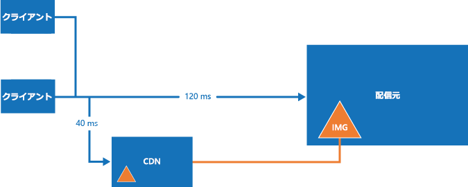

# <a name="content-delivery-network"></a><span data-ttu-id="1317f-103">Content Delivery Network</span><span class="sxs-lookup"><span data-stu-id="1317f-103">Content Delivery Network</span></span>
[!INCLUDE [header](../_includes/header.md)]

<span data-ttu-id="1317f-104">Microsoft Azure [Content Delivery Network (CDN)](/azure/cdn/cdn-overview) は、Azure または他の任意の場所でホストされている高帯域幅コンテンツを配信するためのグローバル ソリューションを開発者に提供します。</span><span class="sxs-lookup"><span data-stu-id="1317f-104">The Microsoft Azure [Content Delivery Network (CDN)](/azure/cdn/cdn-overview) offers developers a global solution for delivering high-bandwidth content that is hosted in Azure or any other location.</span></span> <span data-ttu-id="1317f-105">CDN を使用すると、Azure BLOB ストレージ、Web アプリケーション、仮想マシン、アプリケーション フォルダー、またはその他の HTTP/HTTPS の場所から読み込んだ一般公開されているオブジェクトをキャッシュすることができます。</span><span class="sxs-lookup"><span data-stu-id="1317f-105">Using the CDN, you can cache publicly available objects loaded from Azure blob storage, a web application, virtual machine, application folder, or other HTTP/HTTPS location.</span></span> <span data-ttu-id="1317f-106">CDN のキャッシュを戦略的な場所に配置することで、ユーザーへのコンテンツ配信に最大限の帯域幅を提供することができます。</span><span class="sxs-lookup"><span data-stu-id="1317f-106">The CDN cache can be held at strategic locations to provide maximum bandwidth for delivering content to users.</span></span> <span data-ttu-id="1317f-107">CDN は、通常、イメージ、スタイル シート、ドキュメント、ファイル、クライアント側スクリプトでは、HTML ページなどの静的コンテンツの配信に使用されます。</span><span class="sxs-lookup"><span data-stu-id="1317f-107">The CDN is typically used for delivering static content such as images, style sheets, documents, files, client-side scripts, and HTML pages.</span></span>

<span data-ttu-id="1317f-108">PDF レポートまたは指定の入力に基づくグラフなどの動的なコンテンツを提供するためのキャッシュとして CDN を使用することもできます。複数の異なるユーザーによって同じ入力値が指定された場合、結果は同じになる必要があります。</span><span class="sxs-lookup"><span data-stu-id="1317f-108">You can also use the CDN as a cache for serving dynamic content, such as a PDF report or graph based on specified inputs; if the same input values are provided by different users the result should be the same.</span></span>

<span data-ttu-id="1317f-109">CDN を使用する主な利点は、アプリケーションがホストされているデータセンターに対してユーザー位置する地理的な場所に関係なく、コンテンツをユーザーに短い待ち時間で高速配信できることです。</span><span class="sxs-lookup"><span data-stu-id="1317f-109">The major advantages of using the CDN are lower latency and faster delivery of content to users irrespective of their geographical location in relation to the datacenter where the application is hosted.</span></span>  



<span data-ttu-id="1317f-111">CDN を使用すると、アプリケーションはコンテンツにアクセスおよびコンテンツを配信するのに必要な処理から解放されるため、アプリケーションでの負荷の軽減にも有効です。</span><span class="sxs-lookup"><span data-stu-id="1317f-111">Using the CDN should also help to reduce the load on application because it is relieved of the processing required to access and deliver the content.</span></span> <span data-ttu-id="1317f-112">負荷が軽減されることで、アプリケーションのパフォーマンスとスケーラビリティが向上します。また、一定レベルのパフォーマンスと可用性を達成するために必要な処理リソースが削減されるので、ホスト用のコストも最小限に抑えられます。</span><span class="sxs-lookup"><span data-stu-id="1317f-112">This reduction in load can help to increase the performance and scalability of the application, as well as minimizing hosting costs by reducing the processing resources required to achieve a specific level of performance and availability.</span></span>

## <a name="how-and-why-a-cdn-is-used"></a><span data-ttu-id="1317f-113">CDN の使用方法と使用する理由</span><span class="sxs-lookup"><span data-stu-id="1317f-113">How and why a CDN is used</span></span>
<span data-ttu-id="1317f-114">CDN の一般的な用途は次のとおりです。</span><span class="sxs-lookup"><span data-stu-id="1317f-114">Typical uses for a CDN include:</span></span>  

* <span data-ttu-id="1317f-115">クライアント アプリケーション用の静的リソースの配信 (多くの場合、Web サイトから)。</span><span class="sxs-lookup"><span data-stu-id="1317f-115">Delivering static resources for client applications, often from a website.</span></span> <span data-ttu-id="1317f-116">静的リソースとは、たとえば、イメージ、スタイル シート、ドキュメント、ファイル、クライアント側スクリプト、HTML ページ、HTML フラグメントなど、個々の要求に応じてサーバー側が変更する必要がないコンテンツです。</span><span class="sxs-lookup"><span data-stu-id="1317f-116">These resources can be images, style sheets, documents, files, client-side scripts, HTML pages, HTML fragments, or any other content that the server does not need to modify for each request.</span></span> <span data-ttu-id="1317f-117">アプリケーションでは、実行時にアイテムを作成し、CDN から使用できるようにすることもできますが (たとえば、最新ニュースの見出し一覧を作成するなど)、個々の要求に応じて実行することはありません。</span><span class="sxs-lookup"><span data-stu-id="1317f-117">The application can create items at runtime and make them available to the CDN (for example, by creating a list of current news headlines), but it does not do so for each request.</span></span>
* <span data-ttu-id="1317f-118">静的な共有パブリック コンテンツを携帯電話やタブレット コンピューターなどのデバイスに配信する。</span><span class="sxs-lookup"><span data-stu-id="1317f-118">Delivering public static and shared content to devices such as mobile phones and tablet computers.</span></span> <span data-ttu-id="1317f-119">アプリケーション自体は、さまざまなデバイス上で実行されているクライアントに API を提供する Web サービスです。</span><span class="sxs-lookup"><span data-stu-id="1317f-119">The application itself is a web service that offers an API to clients running on the various devices.</span></span> <span data-ttu-id="1317f-120">CDN は、クライアント UI の生成などの目的で、クライアントが使用する静的データセットを配信することもできます (Web サービスを介して)。</span><span class="sxs-lookup"><span data-stu-id="1317f-120">The CDN can also deliver static datasets (via the web service) for the clients to use, perhaps to generate the client UI.</span></span> <span data-ttu-id="1317f-121">たとえば、JSON または XML ドキュメントの配信に CDN を使用することができます。</span><span class="sxs-lookup"><span data-stu-id="1317f-121">For example, the CDN could be used to distribute JSON or XML documents.</span></span>
* <span data-ttu-id="1317f-122">専用のコンピューティング リソースを使用することなく、静的パブリック コンテンツのみで構成されている Web サイト全体をクライアントに提供。</span><span class="sxs-lookup"><span data-stu-id="1317f-122">Serving entire websites that consist of only public static content to clients, without requiring any dedicated compute resources.</span></span>
* <span data-ttu-id="1317f-123">オンデマンドでビデオ ファイルをクライアントにストリーミング。</span><span class="sxs-lookup"><span data-stu-id="1317f-123">Streaming video files to the client on demand.</span></span> <span data-ttu-id="1317f-124">ビデオの場合、CDN 接続を提供するデータセンターは世界各国にあるため、短い待機時間、信頼性の高い接続という利点があります。</span><span class="sxs-lookup"><span data-stu-id="1317f-124">Video benefits from the low latency and reliable connectivity available from the globally located datacenters that offer CDN connections.</span></span> <span data-ttu-id="1317f-125">Microsoft Azure Media Services (AMS) は、CDN に直接コンテンツを配信し、そこからさらに配信するために Azure CDN と統合されています。</span><span class="sxs-lookup"><span data-stu-id="1317f-125">Microsoft Azure Media Services (AMS) integrates with Azure CDN to deliver content directly to the CDN for further distribution.</span></span> <span data-ttu-id="1317f-126">詳しくは、「[ストリーミング エンドポイントの概要](/azure/media-services/media-services-streaming-endpoints-overview)」をご覧ください。</span><span class="sxs-lookup"><span data-stu-id="1317f-126">For more information, see [Streaming endpoints overview](/azure/media-services/media-services-streaming-endpoints-overview).</span></span>
* <span data-ttu-id="1317f-127">ユーザーのエクスペリエンスを全般的に改善 (特に、アプリケーションをホストしているデータセンターから離れた場所で利用しているユーザー)。</span><span class="sxs-lookup"><span data-stu-id="1317f-127">Generally improving the experience for users, especially those located far from the datacenter hosting the application.</span></span> <span data-ttu-id="1317f-128">そのようなユーザーの場合、他の方法では、待機時間が長くなる場合があります。</span><span class="sxs-lookup"><span data-stu-id="1317f-128">These users might otherwise suffer higher latency.</span></span> <span data-ttu-id="1317f-129">多くの場合、Web アプリケーションに含まれるコンテンツのうち、大部分は静的コンテンツです。CDN を使用することで、パフォーマンスと全体的なユーザー エクスペリエンスを維持することができます。また、アプリケーションを複数のデータセンターにデプロイする必要がなくなります。</span><span class="sxs-lookup"><span data-stu-id="1317f-129">A large proportion of the total size of the content in a web application is often static, and using the CDN can help to maintain performance and overall user experience while eliminating the requirement to deploy the application to multiple data centers.</span></span>
* <span data-ttu-id="1317f-130">IoT (モノのインターネット) ソリューションをサポートするアプリケーションでの負荷の増大に対処する。</span><span class="sxs-lookup"><span data-stu-id="1317f-130">Handling the growing load on applications that support IoT (Internet of Things) solutions.</span></span> <span data-ttu-id="1317f-131">関係するデバイスやアプライアンスが多数あり、アプリケーションでブロードキャスト メッセージを処理し、各デバイスへのファームウェア更新プログラムの配布を直接管理する必要がある場合、そのアプリケーションはすぐに処理できなくなります。</span><span class="sxs-lookup"><span data-stu-id="1317f-131">The huge numbers of such devices and appliances involved could easily overwhelm an application if it was required to process broadcast messages and manage firmware update distribution directly to each device.</span></span>
* <span data-ttu-id="1317f-132">アプリケーションを拡張することなく、ピーク時や需要の急騰に対処。結果として、運用コストの増加を防ぐことができます。</span><span class="sxs-lookup"><span data-stu-id="1317f-132">Coping with peaks and surges in demand without requiring the application to scale, avoiding the consequent increased running costs.</span></span> <span data-ttu-id="1317f-133">たとえば、特定モデルのルーターなどのハードウェア デバイス、またはスマート TV などのコンシューマー デバイスを対象にした、オペレーティング システムの更新プログラムがリリースされた場合、短期間で数百万単位のユーザーやデバイスがダウンロードするので、需要が大きく跳ね上がります。</span><span class="sxs-lookup"><span data-stu-id="1317f-133">For example, when an update to an operating system is released for a hardware device such as a specific model of router, or for a consumer device such as a smart TV, there will be a huge peak in demand as it is downloaded by millions of users and devices over a short period.</span></span>

<span data-ttu-id="1317f-134">次の表は、さまざまな場所の 1 バイト目の配信にかかる平均時間の例です。</span><span class="sxs-lookup"><span data-stu-id="1317f-134">The following list shows examples of the median time to first byte from various geographic locations.</span></span> <span data-ttu-id="1317f-135">ターゲット Web ロールは、Azure 米国西部にデプロイされています。</span><span class="sxs-lookup"><span data-stu-id="1317f-135">The target web role is deployed to Azure West US.</span></span> <span data-ttu-id="1317f-136">CDN を利用して時間が大きく短縮された場所と、CDN ノードとの近さには強い相関関係があります。</span><span class="sxs-lookup"><span data-stu-id="1317f-136">There is a strong correlation between greater boost due to the CDN and proximity to a CDN node.</span></span> <span data-ttu-id="1317f-137">Azure CDN ノードの場所の完全な一覧は、[Azure Content Delivery Network (CDN) ノードの場所](/azure/cdn/cdn-pop-locations/)に関するページを参照してください。</span><span class="sxs-lookup"><span data-stu-id="1317f-137">A complete list of Azure CDN node locations is available at [Azure Content Delivery Network (CDN) Node Locations](/azure/cdn/cdn-pop-locations/).</span></span>

|  | <span data-ttu-id="1317f-138">1 バイト目にかかる時間 (ms) (配信元)</span><span class="sxs-lookup"><span data-stu-id="1317f-138">Time (ms) to First Byte (Origin)</span></span> | <span data-ttu-id="1317f-139">1 バイト目にかかる時間 (ms) (CDN)</span><span class="sxs-lookup"><span data-stu-id="1317f-139">Time (ms) to First (CDN)</span></span> | <span data-ttu-id="1317f-140">%CDN 時間の改善</span><span class="sxs-lookup"><span data-stu-id="1317f-140">%CDN time improvement</span></span> |
| --- | --- | --- | --- |
| <span data-ttu-id="1317f-141">\*カリフォルニア州サンホセ</span><span class="sxs-lookup"><span data-stu-id="1317f-141">\*San Jose, CA</span></span> |<span data-ttu-id="1317f-142">47.5</span><span class="sxs-lookup"><span data-stu-id="1317f-142">47.5</span></span> |<span data-ttu-id="1317f-143">46.5</span><span class="sxs-lookup"><span data-stu-id="1317f-143">46.5</span></span> |<span data-ttu-id="1317f-144">2%</span><span class="sxs-lookup"><span data-stu-id="1317f-144">2%</span></span> |
| <span data-ttu-id="1317f-145">\*\*バージニア州ダレス</span><span class="sxs-lookup"><span data-stu-id="1317f-145">\*\*Dulles, VA</span></span> |<span data-ttu-id="1317f-146">109</span><span class="sxs-lookup"><span data-stu-id="1317f-146">109</span></span> |<span data-ttu-id="1317f-147">40.5</span><span class="sxs-lookup"><span data-stu-id="1317f-147">40.5</span></span> |<span data-ttu-id="1317f-148">169%</span><span class="sxs-lookup"><span data-stu-id="1317f-148">169%</span></span> |
| <span data-ttu-id="1317f-149">ブエノス アイレス (アルゼンチン)</span><span class="sxs-lookup"><span data-stu-id="1317f-149">Buenos Aires, AR</span></span> |<span data-ttu-id="1317f-150">210</span><span class="sxs-lookup"><span data-stu-id="1317f-150">210</span></span> |<span data-ttu-id="1317f-151">151</span><span class="sxs-lookup"><span data-stu-id="1317f-151">151</span></span> |<span data-ttu-id="1317f-152">39%</span><span class="sxs-lookup"><span data-stu-id="1317f-152">39%</span></span> |
| <span data-ttu-id="1317f-153">\*ロンドン (英国)</span><span class="sxs-lookup"><span data-stu-id="1317f-153">\*London, UK</span></span> |<span data-ttu-id="1317f-154">195</span><span class="sxs-lookup"><span data-stu-id="1317f-154">195</span></span> |<span data-ttu-id="1317f-155">44</span><span class="sxs-lookup"><span data-stu-id="1317f-155">44</span></span> |<span data-ttu-id="1317f-156">343%</span><span class="sxs-lookup"><span data-stu-id="1317f-156">343%</span></span> |
| <span data-ttu-id="1317f-157">上海 (中国)</span><span class="sxs-lookup"><span data-stu-id="1317f-157">Shanghai, CN</span></span> |<span data-ttu-id="1317f-158">242</span><span class="sxs-lookup"><span data-stu-id="1317f-158">242</span></span> |<span data-ttu-id="1317f-159">206</span><span class="sxs-lookup"><span data-stu-id="1317f-159">206</span></span> |<span data-ttu-id="1317f-160">17%</span><span class="sxs-lookup"><span data-stu-id="1317f-160">17%</span></span> |
| <span data-ttu-id="1317f-161">\*シンガポール</span><span class="sxs-lookup"><span data-stu-id="1317f-161">\*Singapore</span></span> |<span data-ttu-id="1317f-162">214</span><span class="sxs-lookup"><span data-stu-id="1317f-162">214</span></span> |<span data-ttu-id="1317f-163">74</span><span class="sxs-lookup"><span data-stu-id="1317f-163">74</span></span> |<span data-ttu-id="1317f-164">189%</span><span class="sxs-lookup"><span data-stu-id="1317f-164">189%</span></span> |
| <span data-ttu-id="1317f-165">\*東京 (日本)</span><span class="sxs-lookup"><span data-stu-id="1317f-165">\*Tokyo, JP</span></span> |<span data-ttu-id="1317f-166">163</span><span class="sxs-lookup"><span data-stu-id="1317f-166">163</span></span> |<span data-ttu-id="1317f-167">48</span><span class="sxs-lookup"><span data-stu-id="1317f-167">48</span></span> |<span data-ttu-id="1317f-168">204%</span><span class="sxs-lookup"><span data-stu-id="1317f-168">204%</span></span> |
| <span data-ttu-id="1317f-169">ソウル (韓国)</span><span class="sxs-lookup"><span data-stu-id="1317f-169">Seoul, KR</span></span> |<span data-ttu-id="1317f-170">190</span><span class="sxs-lookup"><span data-stu-id="1317f-170">190</span></span> |<span data-ttu-id="1317f-171">190</span><span class="sxs-lookup"><span data-stu-id="1317f-171">190</span></span> |<span data-ttu-id="1317f-172">0%</span><span class="sxs-lookup"><span data-stu-id="1317f-172">0%</span></span> |

<span data-ttu-id="1317f-173">\* 同じ都市に Azure CDN ノードがあります。</span><span class="sxs-lookup"><span data-stu-id="1317f-173">\* Has an Azure CDN node in the same city.</span></span>  
<span data-ttu-id="1317f-174">\*\* 隣接する都市に Azure CDN ノードがあります。</span><span class="sxs-lookup"><span data-stu-id="1317f-174">\*\* Has an Azure CDN node in a neighboring city.</span></span>  

## <a name="challenges"></a><span data-ttu-id="1317f-175">課題</span><span class="sxs-lookup"><span data-stu-id="1317f-175">Challenges</span></span>
<span data-ttu-id="1317f-176">CDN の使用を計画する際には、いくつかの課題を考慮する必要があります。</span><span class="sxs-lookup"><span data-stu-id="1317f-176">There are several challenges to take into account when planning to use the CDN:</span></span>  

* <span data-ttu-id="1317f-177">**デプロイ**。</span><span class="sxs-lookup"><span data-stu-id="1317f-177">**Deployment**.</span></span> <span data-ttu-id="1317f-178">CDN のコンテンツ取得元を決定する必要があります。また、複数のストレージ システム (CDN と代替の場所など) にあるコンテンツをデプロイする必要があるかどうかを決定する必要があります。</span><span class="sxs-lookup"><span data-stu-id="1317f-178">Decide the origin from which the CDN fetches the content, and whether you need to deploy the content in more than one storage system (such as in the CDN and an alternative location).</span></span>

  <span data-ttu-id="1317f-179">アプリケーションのデプロイ メカニズムでは、静的なコンテンツとリソースのデプロイのプロセスだけでなく、ASPX ページなどのアプリケーション ファイルのデプロイのプロセスも考慮する必要があります。</span><span class="sxs-lookup"><span data-stu-id="1317f-179">Your application deployment mechanism must take into account the process for deploying static content and resources as well as deploying the application files, such as ASPX pages.</span></span> <span data-ttu-id="1317f-180">たとえば、Azure BLOB ストレージにコンテンツを読み込むために個別の手順の実装が必要になる場合があります。</span><span class="sxs-lookup"><span data-stu-id="1317f-180">For example, you may need to implement a separate step to load content into Azure blob storage.</span></span>
* <span data-ttu-id="1317f-181">**バージョン管理とキャッシュ制御**。</span><span class="sxs-lookup"><span data-stu-id="1317f-181">**Versioning and cache-control**.</span></span> <span data-ttu-id="1317f-182">静的コンテンツを更新する方法と、新しいバージョンをデプロイする方法を検討する必要があります。</span><span class="sxs-lookup"><span data-stu-id="1317f-182">Consider how you will update static content and deploy new versions.</span></span> <span data-ttu-id="1317f-183">CDN コンテンツは新しい資産のバージョンが使用できるようになったら、Azure ポータルを使用して[消去](/azure/cdn/cdn-purge-endpoint/)できます。</span><span class="sxs-lookup"><span data-stu-id="1317f-183">The CDN content may be [purged](/azure/cdn/cdn-purge-endpoint/) using the Azure portal when new versions of your assets are available.</span></span> <span data-ttu-id="1317f-184">これは、クライアント側のキャッシュを管理する場合の課題に類似しています (たとえば、Web ブラウザーで発生する課題)。</span><span class="sxs-lookup"><span data-stu-id="1317f-184">This is a similar challenge to managing client-side caching, such as that which occurs in a web browser.</span></span>
* <span data-ttu-id="1317f-185">**テスト**。</span><span class="sxs-lookup"><span data-stu-id="1317f-185">**Testing**.</span></span> <span data-ttu-id="1317f-186">アプリケーションをローカル環境やステージング環境で開発し、テストしている場合、CDN の設定をローカルでテストすることは困難になる可能性があります。</span><span class="sxs-lookup"><span data-stu-id="1317f-186">It can be difficult to perform local testing of your CDN settings when developing and testing an application locally or in a staging environment.</span></span>
* <span data-ttu-id="1317f-187">**検索エンジンの最適化 (SEO)**。</span><span class="sxs-lookup"><span data-stu-id="1317f-187">**Search engine optimization (SEO)**.</span></span> <span data-ttu-id="1317f-188">CDN を使用する場合、イメージやドキュメントなどのコンテンツは異なるドメインから提供されます。</span><span class="sxs-lookup"><span data-stu-id="1317f-188">Content such as images and documents are served from a different domain when you use the CDN.</span></span> <span data-ttu-id="1317f-189">このことは、このコンテンツの SEO に影響を及ぼします。</span><span class="sxs-lookup"><span data-stu-id="1317f-189">This can have an effect on SEO for this content.</span></span>
* <span data-ttu-id="1317f-190">**コンテンツのセキュリティ**。</span><span class="sxs-lookup"><span data-stu-id="1317f-190">**Content security**.</span></span> <span data-ttu-id="1317f-191">Azure などの多くの CDN サービスは、現在のところ、どのような種類のコンテンツのアクセス制御も提供していません。</span><span class="sxs-lookup"><span data-stu-id="1317f-191">Many CDN services such as Azure CDN do not currently offer any type of access control for the content.</span></span>
* <span data-ttu-id="1317f-192">**クライアントのセキュリティ**。</span><span class="sxs-lookup"><span data-stu-id="1317f-192">**Client security**.</span></span> <span data-ttu-id="1317f-193">クライアントは、CDN 上のリソースへのアクセスを許可していない環境から接続している可能性があります。</span><span class="sxs-lookup"><span data-stu-id="1317f-193">Clients might connect from an environment that does not allow access to resources on the CDN.</span></span> <span data-ttu-id="1317f-194">たとえば、既知のリソースにのみアクセスが制限されているセキュリティに制約のある環境や、ページの提供元以外から配信されたリソースを読み込まない環境などです。</span><span class="sxs-lookup"><span data-stu-id="1317f-194">This could be a security-constrained environment that limits access to only a set of known sources, or one that prevents loading of resources from anything other than the page origin.</span></span> <span data-ttu-id="1317f-195">このような場合に対処するには、フォールバックの実装が必要です。</span><span class="sxs-lookup"><span data-stu-id="1317f-195">A fallback implementation is required to handle these cases.</span></span>
* <span data-ttu-id="1317f-196">**回復力**。</span><span class="sxs-lookup"><span data-stu-id="1317f-196">**Resilience**.</span></span> <span data-ttu-id="1317f-197">CDN は、アプリケーションの単一障害点になる可能性があります。</span><span class="sxs-lookup"><span data-stu-id="1317f-197">The CDN is a potential single point of failure for an application.</span></span> <span data-ttu-id="1317f-198">CDN の可用性に関する SLA は BLOB ストレージよりも低いので (BLOB ストレージはコンテンツの直接配信に使用できます)、必要に応じて、重要なコンテンツ用にフォールバック メカニズムの実装を検討します。</span><span class="sxs-lookup"><span data-stu-id="1317f-198">It has a lower availability SLA than blob storage (which can be used to deliver content directly) so you may need to consider implementing a fallback mechanism for critical content.</span></span>

  <span data-ttu-id="1317f-199">[リアルタイム](/azure/cdn/cdn-real-time-stats/)の[集計レポート](/azure/cdn/cdn-analyze-usage-patterns/)で、CDN コンテンツの可用性、帯域幅、転送データ、ヒット数、キャッシュ ヒット率、キャッシュ メトリックを Azure ポータルから監視することができます。</span><span class="sxs-lookup"><span data-stu-id="1317f-199">You can monitor your CDN content availability, bandwidth, data transferred, hits, cache hit ratio, and cache metrics from the Azure portal in [real-time](/azure/cdn/cdn-real-time-stats/) and [aggregate reports](/azure/cdn/cdn-analyze-usage-patterns/).</span></span>

<span data-ttu-id="1317f-200">CDN が適していないシナリオを次に示します。</span><span class="sxs-lookup"><span data-stu-id="1317f-200">Scenarios where CDN may be less useful include:</span></span>  

* <span data-ttu-id="1317f-201">コンテンツの有効期間中に、コンテンツのヒット率が低く、ほとんどアクセスされない場合 (その有効期限設定で決定)。</span><span class="sxs-lookup"><span data-stu-id="1317f-201">If the content has a low hit rate, it might be accessed only few times while it is valid (determined by its time-to-live setting).</span></span> <span data-ttu-id="1317f-202">アイテムが初めてダウンロードされると、2 つのトランザクション料金が発生します (提供元から CDN、CDN からユーザー)。</span><span class="sxs-lookup"><span data-stu-id="1317f-202">The first time an item is downloaded you incur two transaction charges from the origin to the CDN, and then from the CDN to the customer.</span></span>
* <span data-ttu-id="1317f-203">データが非公開の場合。たとえば、大規模な企業やサプライ チェーンのエコシステムなどです。</span><span class="sxs-lookup"><span data-stu-id="1317f-203">If the data is private, such as for large enterprises or supply chain ecosystems.</span></span>

## <a name="general-guidelines-and-good-practices"></a><span data-ttu-id="1317f-204">一般的なガイドラインと推奨される方法</span><span class="sxs-lookup"><span data-stu-id="1317f-204">General guidelines and good practices</span></span>
<span data-ttu-id="1317f-205">CDN は、アプリケーションの負荷を最小限に抑え、可用性とパフォーマンスを最大限にするために有効な方法です。</span><span class="sxs-lookup"><span data-stu-id="1317f-205">Using the CDN is a good way to minimize the load on your application, and maximize availability and performance.</span></span> <span data-ttu-id="1317f-206">アプリケーションで使用する適切なコンテンツとリソースのすべてに対して、この手法の採用を検討する必要があります。</span><span class="sxs-lookup"><span data-stu-id="1317f-206">Consider adopting this strategy for all of the appropriate content and resources your application uses.</span></span> <span data-ttu-id="1317f-207">CDN の使用戦略を立てるときは、次のセクションに示す項目を考慮してください。</span><span class="sxs-lookup"><span data-stu-id="1317f-207">Consider the points in the following sections when designing your strategy to use the CDN:</span></span>  

### <a name="origin"></a><span data-ttu-id="1317f-208">Origin (配信元)</span><span class="sxs-lookup"><span data-stu-id="1317f-208">Origin</span></span>
<span data-ttu-id="1317f-209">CDN 経由でコンテンツをデプロイするには、CDN サービスでコンテンツにアクセスおよびコンテンツをキャッシュするときに使用する HTTP または HTTPS [エンドポイント](/azure/cdn/cdn-create-new-endpoint)、あるいはその両方を指定する必要があります。</span><span class="sxs-lookup"><span data-stu-id="1317f-209">Deploying content through the CDN simply requires you to specify an HTTP and/or HTTPS [endpoint](/azure/cdn/cdn-create-new-endpoint) that the CDN service will use to access and cache the content.</span></span>

<span data-ttu-id="1317f-210">エンドポイントでは、CDN 経由で配信する静的なコンテンツを保持する Azure BLOB ストレージ コンテナーを指定できます。</span><span class="sxs-lookup"><span data-stu-id="1317f-210">The endpoint can specify an Azure blob storage container that holds the static content you want to deliver through the CDN.</span></span> <span data-ttu-id="1317f-211">コンテナーは、パブリックと指定する必要があります。</span><span class="sxs-lookup"><span data-stu-id="1317f-211">The container must be marked as public.</span></span> <span data-ttu-id="1317f-212">CDN 経由で使用できるのは、パブリック読み取りアクセス権を持つパブリック コンテナー内の BLOB のみです。</span><span class="sxs-lookup"><span data-stu-id="1317f-212">Only blobs in a public container that have public read access are available through the CDN.</span></span>

<span data-ttu-id="1317f-213">エンドポイントは、アプリケーションのいずれかのコンピューティング層 (Web ロール、仮想マシンなど) のルートにある **cdn** というフォルダーを指定できます。</span><span class="sxs-lookup"><span data-stu-id="1317f-213">The endpoint can specify a folder named **cdn** in the root of one of application’s compute layers (such as a web role or a virtual machine).</span></span> <span data-ttu-id="1317f-214">ASPX ページなどの動的リソースを含め、リソースに対する要求の結果は、CDN にキャッシュされます。</span><span class="sxs-lookup"><span data-stu-id="1317f-214">The results from requests for resources, including dynamic resources such as ASPX pages, will be cached on the CDN.</span></span> <span data-ttu-id="1317f-215">最短のキャッシュ期間は 300 秒です。</span><span class="sxs-lookup"><span data-stu-id="1317f-215">The minimum cache period is 300 seconds.</span></span> <span data-ttu-id="1317f-216">これより短い期間にすると、コンテンツを CDN にデプロイできなくなります (詳細については下記の見出し「*キャッシュ制御*」を参照してください)。</span><span class="sxs-lookup"><span data-stu-id="1317f-216">Any shorter period prevents the content from being deployed to the CDN (for more information, see the following heading *Cache control* below).</span></span>

<span data-ttu-id="1317f-217">Azure Web Apps を使用している場合、エンドポイントは、CDN インスタンスを作成するときに選択したサイトのルート フォルダーに設定されます。</span><span class="sxs-lookup"><span data-stu-id="1317f-217">If you are using Azure Web Apps, the endpoint is set to the root folder of the site by selecting the site when creating the CDN instance.</span></span> <span data-ttu-id="1317f-218">サイトのすべてのコンテンツは、CDN を介して使用できるようになります。</span><span class="sxs-lookup"><span data-stu-id="1317f-218">All of the content for the site will be available through the CDN.</span></span>

<span data-ttu-id="1317f-219">ほとんどの場合、アプリケーションのコンピューティング層のいずれかにあるフォルダーの CDN エンドポイントを指定すると、より柔軟に細かく制御できます。</span><span class="sxs-lookup"><span data-stu-id="1317f-219">In most cases, pointing your CDN endpoint at a folder within one of the compute layers of your application offers more flexibility and control.</span></span> <span data-ttu-id="1317f-220">たとえば、現在と将来のルーティング要件の管理、イメージのサムネイルなどの静的コンテンツの動的生成が簡単になります。</span><span class="sxs-lookup"><span data-stu-id="1317f-220">For instance, it makes it easier to manage current and future routing requirements, and dynamically generate static content such as image thumbnails.</span></span>

<span data-ttu-id="1317f-221">ASPX ページなどの動的ソースからコンテンツを配信する場合、キャッシュ内のオブジェクトを区別するために[クエリ文字列](/azure/cdn/cdn-query-string/)を使用することができます。</span><span class="sxs-lookup"><span data-stu-id="1317f-221">You can use [query strings](/azure/cdn/cdn-query-string/) to differentiate objects in the cache when content is delivered from dynamic sources, such as ASPX pages.</span></span> <span data-ttu-id="1317f-222">また、Azure ポータルで CDN エンドポイントを指定するときに、この動作を無効にすることもできます。</span><span class="sxs-lookup"><span data-stu-id="1317f-222">However, this behavior can be disabled by a setting in the Azure portal when you specify the CDN endpoint.</span></span> <span data-ttu-id="1317f-223">BLOB ストレージからコンテンツを配信する場合、クエリ文字列は文字列リテラルとして扱われるので、名前が同じでクエリ文字列が同じアイテムが 2 つある場合、CDN では別のアイテムとして保存されます。</span><span class="sxs-lookup"><span data-stu-id="1317f-223">When delivering content from blob storage, query strings are treated as string literals so two items that have the same name but different query strings are stored as separate items on the CDN.</span></span>

<span data-ttu-id="1317f-224">スクリプトや他のコンテンツなどのリソースの URL 書き換えを利用すると、ファイルが CDN の配信元フォルダーに移動されることを回避できます。</span><span class="sxs-lookup"><span data-stu-id="1317f-224">You can utilize URL rewriting for resources, such as scripts and other content, to avoid moving your files to the CDN origin folder.</span></span>

<span data-ttu-id="1317f-225">Azure ストレージ BLOB を使用して CDN のコンテンツを保存する場合、BLOB 内にあるリソースの URL で、コンテナーと BLOB の名前の大文字と小文字は区別されます。</span><span class="sxs-lookup"><span data-stu-id="1317f-225">When using Azure storage blobs to hold content for the CDN, the URL of the resources in blobs is case-sensitive for the container and blob name.</span></span>

<span data-ttu-id="1317f-226">カスタム配信元または Azure Web Apps を使用している場合は、リソースへのリンクに CDN インスタンスのパスを指定します。</span><span class="sxs-lookup"><span data-stu-id="1317f-226">When using custom origins or Azure Web Apps, you specify the path to the CDN instance in the links to resources.</span></span> <span data-ttu-id="1317f-227">次の例では、CDN を介して配信されるサイトの **Images** フォルダー内のイメージ ファイルを指定しています。</span><span class="sxs-lookup"><span data-stu-id="1317f-227">For example, the following specifies an image file in the **Images** folder of the site that will be delivered through the CDN:</span></span>

```XML

```

### <a name="deployment"></a><span data-ttu-id="1317f-228">デプロイ</span><span class="sxs-lookup"><span data-stu-id="1317f-228">Deployment</span></span>
<span data-ttu-id="1317f-229">アプリケーション デプロイメント パッケージまたはプロセスに静的コンテンツを含めない場合は、必要に応じて、アプリケーションとは別に静的コンテンツをプロビジョニングおよびデプロイします。</span><span class="sxs-lookup"><span data-stu-id="1317f-229">Static content may need to be provisioned and deployed independently from the application if you do not include it in the application deployment package or process.</span></span> <span data-ttu-id="1317f-230">アプリケーション コンポーネントと静的リソース コンテンツの両方を管理するために使用するバージョン管理アプローチに対して、どのような影響があるかを考慮してください。</span><span class="sxs-lookup"><span data-stu-id="1317f-230">Consider how this will affect the versioning approach you use to manage both the application components and the static resource content.</span></span>

<span data-ttu-id="1317f-231">スクリプトと CSS ファイルのバンドル (複数のファイルを 1 つにまとめる処理) と縮小 (空白、改行文字、コメントなどの不要な文字の削除) を処理する方法について考慮します。</span><span class="sxs-lookup"><span data-stu-id="1317f-231">Consider how bundling (combining several files into one file) and minification (removing unnecessary characters such as white space, new line characters, comments, and other characters) for script and CSS files will be handled.</span></span> <span data-ttu-id="1317f-232">これらは、クライアントの読み込み時間を短縮することができ、CDN を介したコンテンツ配信と互換性がある一般的に使用される手法です。</span><span class="sxs-lookup"><span data-stu-id="1317f-232">These are commonly used techniques that can reduce load times for clients, and are compatible with delivering content through the CDN.</span></span> <span data-ttu-id="1317f-233">詳細については、「 [バンドルと縮小](http://www.asp.net/mvc/tutorials/mvc-4/bundling-and-minification)」を参照してください。</span><span class="sxs-lookup"><span data-stu-id="1317f-233">For more information, see [Bundling and Minification](http://www.asp.net/mvc/tutorials/mvc-4/bundling-and-minification).</span></span>

<span data-ttu-id="1317f-234">コンテンツを追加の場所にデプロイする必要がある場合、デプロイメント プロセスの手順が増えます。</span><span class="sxs-lookup"><span data-stu-id="1317f-234">If you need to deploy the content to an additional location, this will be an extra step in the deployment process.</span></span> <span data-ttu-id="1317f-235">アプリケーションが、定期的に、またはイベントに応じて CDN のコンテンツを更新すると、更新されたコンテンツを CDN のエンドポイントだけでなく追加の場所にも保存する必要があります。</span><span class="sxs-lookup"><span data-stu-id="1317f-235">If the application updates the content for the CDN, perhaps at regular intervals or in response to an event, it must store the updated content in any additional locations as well as the endpoint for the CDN.</span></span>

<span data-ttu-id="1317f-236">Visual Studio のローカルの Azure エミュレーターでアプリケーションの CDN エンドポイントを設定できません。</span><span class="sxs-lookup"><span data-stu-id="1317f-236">You cannot set up a CDN endpoint for an application in the local Azure emulator in Visual Studio.</span></span> <span data-ttu-id="1317f-237">この制限は、単体テスト、機能テスト、最終的なデプロイメント前テストに影響があります。</span><span class="sxs-lookup"><span data-stu-id="1317f-237">This restriction will affect unit testing, functional testing, and final pre-deployment testing.</span></span> <span data-ttu-id="1317f-238">代替メカニズムを実装して、この問題に対応する必要があります。</span><span class="sxs-lookup"><span data-stu-id="1317f-238">You must allow for this by implementing an alternative mechanism.</span></span> <span data-ttu-id="1317f-239">たとえば、カスタム アプリケーションまたはユーティリティを使用して CDN にコンテンツを事前デプロイして、キャッシュされている期間にテストを実行する方法があります。</span><span class="sxs-lookup"><span data-stu-id="1317f-239">For example, you could pre-deploy the content to the CDN using a custom application or utility, and perform testing during the period in which it is cached.</span></span> <span data-ttu-id="1317f-240">また、コンパイル ディレクティブまたはグローバル定数を使用して、アプリケーションがリソースを読み込む場所を制御する方法もあります。</span><span class="sxs-lookup"><span data-stu-id="1317f-240">Alternatively, use compile directives or global constants to control from where the application loads the resources.</span></span> <span data-ttu-id="1317f-241">たとえば、デバッグ モードで実行するときは、クライアント側スクリプト バンドルや他のコンテンツなどのリソースをローカル フォルダーから読み込み、リリース モードで実行するときは CDN を使用することができます。</span><span class="sxs-lookup"><span data-stu-id="1317f-241">For example, when running in debug mode it could load resources such as client-side script bundles and other content from a local folder, and use the CDN when running in release mode.</span></span>

<span data-ttu-id="1317f-242">CDN でサポートする圧縮方法を検討します。</span><span class="sxs-lookup"><span data-stu-id="1317f-242">Consider which compression approach you want your CDN to support:</span></span>

* <span data-ttu-id="1317f-243">配信元サーバーで[圧縮を有効](/azure/cdn/cdn-improve-performance/)にします。この方法では、CDN は既定で圧縮をサポートし、圧縮されたコンテンツを zip または gzip の形式でクライアントに配信します。</span><span class="sxs-lookup"><span data-stu-id="1317f-243">You can [enable compression](/azure/cdn/cdn-improve-performance/) on your origin server, in which case the CDN will support compression by default and deliver compressed content to clients in a format such as zip or gzip.</span></span> <span data-ttu-id="1317f-244">CDN エンドポイントとしてアプリケーション フォルダーを使用する場合、サーバーは、Web ブラウザーまたは他の種類のクライアントに直接配信するときと同じ方法で、一部のコンテンツを自動的に圧縮することができます。</span><span class="sxs-lookup"><span data-stu-id="1317f-244">When using an application folder as the CDN endpoint, the server may compress some content automatically in the same way as when delivering it directly to a web browser or other type of client.</span></span> <span data-ttu-id="1317f-245">形式は、クライアントから送信された要求の **Accept-Encoding** ヘッダーの値に依存します。</span><span class="sxs-lookup"><span data-stu-id="1317f-245">The format depends on the value of the **Accept-Encoding** header in the request sent by the client.</span></span> <span data-ttu-id="1317f-246">Azure の既定のメカニズムでは、CPU 使用率が 50% を下回るとコンテンツが自動的に圧縮されます。</span><span class="sxs-lookup"><span data-stu-id="1317f-246">In Azure the default mechanism is to automatically compress content when CPU utilization is below 50%.</span></span> <span data-ttu-id="1317f-247">クラウド サービスを使用してアプリケーションをホストしている場合、この設定を変更するにはスタートアップ タスクを使用して IIS での動的出力の圧縮を有効にすることが必要な場合があります。</span><span class="sxs-lookup"><span data-stu-id="1317f-247">If you are using a cloud service to host the application, changing the settings may require using a startup task to turn on compression of dynamic output in IIS.</span></span> <span data-ttu-id="1317f-248">詳細については、[Web ロールを介した Microsoft Azure CDN による gzip 圧縮の有効化](http://blogs.msdn.com/b/avkashchauhan/archive/2012/03/05/enableing-gzip-compression-with-windows-azure-cdn-through-web-role.aspx)に関するページを参照してください。</span><span class="sxs-lookup"><span data-stu-id="1317f-248">See [Enabling gzip compression with Microsoft Azure CDN through a Web Role](http://blogs.msdn.com/b/avkashchauhan/archive/2012/03/05/enableing-gzip-compression-with-windows-azure-cdn-through-web-role.aspx) for more information.</span></span>
* <span data-ttu-id="1317f-249">CDN エッジ サーバーで直接、圧縮を有効にします。この方法では、CDN でファイルが圧縮され、エンド ユーザーに渡されます。</span><span class="sxs-lookup"><span data-stu-id="1317f-249">You can enable compression directly on CDN edge servers, in which case the CDN will compress the files and serve it to end users.</span></span> <span data-ttu-id="1317f-250">詳細については、[Azure CDN の圧縮](/azure/cdn/cdn-improve-performance/)に関するページを参照してください。</span><span class="sxs-lookup"><span data-stu-id="1317f-250">For more information, see [Azure CDN Compression](/azure/cdn/cdn-improve-performance/).</span></span>

### <a name="routing-and-versioning"></a><span data-ttu-id="1317f-251">ルーティングとバージョン管理</span><span class="sxs-lookup"><span data-stu-id="1317f-251">Routing and versioning</span></span>
<span data-ttu-id="1317f-252">さまざまな時点でそれぞれ異なる CDN インスタンスを使用することが必要な場合があります。</span><span class="sxs-lookup"><span data-stu-id="1317f-252">You may need to use different CDN instances at various times.</span></span> <span data-ttu-id="1317f-253">たとえば、アプリケーションの新しいバージョンをデプロイする場合は、新しい CDN を使用し、前の CDN は以前のバージョンのために保持することができます (以前の形式でコンテンツを保持)。</span><span class="sxs-lookup"><span data-stu-id="1317f-253">For example, when you deploy a new version of the application you may want to use a new CDN and retain the old CDN (holding content in an older format) for previous versions.</span></span> <span data-ttu-id="1317f-254">コンテンツ配信元として Azure BLOB ストレージを使用している場合は、別のストレージ アカウントまたは別のコンテナーを作成し、CDN エンドポイントでその場所を指定します。</span><span class="sxs-lookup"><span data-stu-id="1317f-254">If you use Azure blob storage as the content origin, you can create a separate storage account or a separate container and point the CDN endpoint to it.</span></span> <span data-ttu-id="1317f-255">CDN エンドポイントとしてアプリケーション内で CDN ルート フォルダーを使用している場合、要求を別のフォルダーに送信する URL の書き換え手法を使用できます。</span><span class="sxs-lookup"><span data-stu-id="1317f-255">If you use the cdn root folder within the application as the CDN endpoint, you can use URL rewriting techniques to direct requests to a different folder.</span></span>

<span data-ttu-id="1317f-256">Azure BLOB ストレージからコンテンツを取得するときに、クエリ文字列はリソース名 (BLOB 名) の一部になるので、CDN 上のリソースに対するリンクで、クエリ文字列を使用してアプリケーションの別バージョンを指定しないでください。</span><span class="sxs-lookup"><span data-stu-id="1317f-256">Do not use the query string to denote different versions of the application in links to resources on the CDN because, when retrieving content from Azure blob storage, the query string is part of the resource name (the blob name).</span></span> <span data-ttu-id="1317f-257">この方法はまた、クライアントでリソースをキャッシュする方法に影響する可能性があります。</span><span class="sxs-lookup"><span data-stu-id="1317f-257">This approach can also affect how the client caches resources.</span></span>

<span data-ttu-id="1317f-258">以前のリソースが CDN にキャッシュされている場合、アプリケーションの更新時に新しいバージョンの静的コンテンツをデプロイすることが困難になる可能性があります。</span><span class="sxs-lookup"><span data-stu-id="1317f-258">Deploying new versions of static content when you update an application can be a challenge if the previous resources are cached on the CDN.</span></span> <span data-ttu-id="1317f-259">詳細については、「*キャッシュ制御*」セクションを参照してください。</span><span class="sxs-lookup"><span data-stu-id="1317f-259">For more information, see the section *Cache control*).</span></span>

<span data-ttu-id="1317f-260">国によって CDN コンテンツへのアクセスを制限することを検討してください。</span><span class="sxs-lookup"><span data-stu-id="1317f-260">Consider restricting the CDN content access by country.</span></span> <span data-ttu-id="1317f-261">Azure CDN を使用すると、発信元の国に基づいて要求をフィルター処理し、配信するコンテンツを制限することができます。</span><span class="sxs-lookup"><span data-stu-id="1317f-261">Azure CDN allows you to filter requests based on the country of origin and restrict the content delivered.</span></span> <span data-ttu-id="1317f-262">詳細については、「[国に応じてコンテンツへのアクセスを制限する](/azure/cdn/cdn-restrict-access-by-country/)」をご覧ください。</span><span class="sxs-lookup"><span data-stu-id="1317f-262">For more information, see [Restrict access to your content by country](/azure/cdn/cdn-restrict-access-by-country/).</span></span>

### <a name="cache-control"></a><span data-ttu-id="1317f-263">キャッシュ制御</span><span class="sxs-lookup"><span data-stu-id="1317f-263">Cache control</span></span>
<span data-ttu-id="1317f-264">システム内でのキャッシュの管理方法について検討します。</span><span class="sxs-lookup"><span data-stu-id="1317f-264">Consider how to manage caching within the system.</span></span> <span data-ttu-id="1317f-265">たとえば、CDN 配信元としてフォルダーを使用している場合、コンテンツを生成するページのキャッシュ可能性と、特定のフォルダーのすべてのリソースについてコンテンツ有効期限を指定できます。</span><span class="sxs-lookup"><span data-stu-id="1317f-265">For example, when using a folder as the CDN origin you can specify the cacheability of pages that generate the content, and the content expiry time for all the resources in a specific folder.</span></span> <span data-ttu-id="1317f-266">CDN と、標準の HTTP ヘッダーを使用するクライアントのキャッシュ プロパティを指定することもできます。</span><span class="sxs-lookup"><span data-stu-id="1317f-266">You can also specify cache properties for the CDN, and for the client using standard HTTP headers.</span></span> <span data-ttu-id="1317f-267">サーバーとクライアントのキャッシュを既に管理している場合でも、CDN を使用すると、コンテンツのキャッシュ方法と場所を把握しやすくなります。</span><span class="sxs-lookup"><span data-stu-id="1317f-267">Although you should already be managing caching on the server and client, using the CDN will help to make you more aware of how your content is cached, and where.</span></span>

<span data-ttu-id="1317f-268">配信元 (BLOB コンテナーまたはアプリケーション *cdn* ルート フォルダー) から削除できるオブジェクトを CDN で使用できないようにするには、CDN エンドポイントを削除するか、(BLOB ストレージの場合は) コンテナーまたは BLOB を非公開にします。</span><span class="sxs-lookup"><span data-stu-id="1317f-268">To prevent objects from being available on the CDN you can delete them from the origin (blob container or application *cdn* root folder), remove or delete the CDN endpoint, or, in the case of blob storage, make the container or blob private.</span></span> <span data-ttu-id="1317f-269">ただし、アイテムが CDN から削除されるのは、有効期限が切れたときのみです。</span><span class="sxs-lookup"><span data-stu-id="1317f-269">However, items will be removed from the CDN only when their time-to-live expires.</span></span> <span data-ttu-id="1317f-270">キャッシュの有効期限が指定されていない場合 (コンテンツを BLOB ストレージから読み込まれたときなど)、CDN には最長 7 日間キャッシュされます。</span><span class="sxs-lookup"><span data-stu-id="1317f-270">If no cache expiry period is specified (such as when content is loaded from blob storage), it is cached on the CDN for up to seven days.</span></span>  <span data-ttu-id="1317f-271">また、手動で [CDN エンドポイントを消去する](/azure/cdn/cdn-purge-endpoint/)こともできます。</span><span class="sxs-lookup"><span data-stu-id="1317f-271">You can also manually [purge a CDN endpoint](/azure/cdn/cdn-purge-endpoint/).</span></span>

<span data-ttu-id="1317f-272">Web アプリケーションの場合、すべてのコンテンツにキャッシュと有効期限を設定するには、web.config ファイルの *system.webServer/staticContent* セクションで *clientCache* 要素を使用します。</span><span class="sxs-lookup"><span data-stu-id="1317f-272">In a web application, you can set the caching and expiry for all content by using the *clientCache* element in the *system.webServer/staticContent* section of the web.config file.</span></span> <span data-ttu-id="1317f-273">web.config ファイルを任意のフォルダーに配置すると、そのフォルダーおよびすべてのサブフォルダー内のファイルが影響を受けます。</span><span class="sxs-lookup"><span data-stu-id="1317f-273">Remember that when you place a web.config file in a folder it affects the files in that folder and all subfolders.</span></span>

<span data-ttu-id="1317f-274">CDN のコンテンツを動的に作成する場合 (たとえば、アプリケーション コードで)、各ページに *Cache.SetExpires* プロパティを必ず指定します。</span><span class="sxs-lookup"><span data-stu-id="1317f-274">If you create the content for the CDN dynamically (in your application code for example), ensure that you specify the *Cache.SetExpires* property on each page.</span></span> <span data-ttu-id="1317f-275">CDN では、 *パブリック*の既定のキャッシュ可能性設定を使用しているページからの出力をキャッシュしません。</span><span class="sxs-lookup"><span data-stu-id="1317f-275">The CDN will not cache the output from pages that use the default cacheability setting of *public*.</span></span>  <span data-ttu-id="1317f-276">コンテンツの破棄を防ぎ、ごく短い間隔でアプリケーションから読み込み直すようにキャッシュ有効期限を適切な値に設定します。</span><span class="sxs-lookup"><span data-stu-id="1317f-276">Set the cache expiry period to a suitable value to ensure that the content is not discarded and reloaded from the application at very short intervals.</span></span>  

### <a name="security"></a><span data-ttu-id="1317f-277">セキュリティ</span><span class="sxs-lookup"><span data-stu-id="1317f-277">Security</span></span>
<span data-ttu-id="1317f-278">CDN は、CDN から提供された証明書を使用して HTTPS (SSL) 上でコンテンツを配信できますが、HTTP 上で配信することもできます。</span><span class="sxs-lookup"><span data-stu-id="1317f-278">The CDN can deliver content over HTTPS (SSL), by using the certificate provided by the CDN, as well as over standard HTTP.</span></span> <span data-ttu-id="1317f-279">コンテンツが混合している事に関するブラウザーからの警告を避けるには、HTTPS を使用して、HTTPS 経由で読み込まれたページに表示されている静的コンテンツを要求する必要があります。</span><span class="sxs-lookup"><span data-stu-id="1317f-279">To avoid browser warnings about mixed content, you might need to use HTTPS to request static content that is displayed in pages loaded through HTTPS.</span></span>

<span data-ttu-id="1317f-280">CDN を使用してフロント ファイルなどの静的アセットを配信する場合は、 *XMLHttpRequest* 呼び出しを使用して異なるドメインからこれらのリソースを要求すると、同じ配信元ポリシーの問題が起こる場合があります。</span><span class="sxs-lookup"><span data-stu-id="1317f-280">If you deliver static assets such as font files by using the CDN, you might encounter same-origin policy issues if you use an *XMLHttpRequest* call to request these resources from a different domain.</span></span> <span data-ttu-id="1317f-281">多くの Web ブラウザーは、適切な応答ヘッダーを設定するように Web サーバーが構成されていない場合、クロス オリジン リソース共有 (CORS) を回避します。</span><span class="sxs-lookup"><span data-stu-id="1317f-281">Many web browsers prevent cross-origin resource sharing (CORS) unless the web server is configured to set the appropriate response headers.</span></span> <span data-ttu-id="1317f-282">次のいずれかの方法を使用して、CORS をサポートする CDN を構成できます。</span><span class="sxs-lookup"><span data-stu-id="1317f-282">You can configure the CDN to support CORS by using one of the following methods:</span></span>

* <span data-ttu-id="1317f-283">CORS ヘッダーを応答に追加するには、CDN ルール エンジンを使用します。</span><span class="sxs-lookup"><span data-stu-id="1317f-283">Use the CDN rules engine to add CORS headers to the responses.</span></span> <span data-ttu-id="1317f-284">ワイルドカードと複数の個別の許可された配信元が使用できるため、通常はこれが最適な方法です。</span><span class="sxs-lookup"><span data-stu-id="1317f-284">This method is usually the best one to use because both wildcard and multiple specific-allowed origins are supported.</span></span> <span data-ttu-id="1317f-285">詳細については、[CORS を使用する Azure CDN](https://docs.microsoft.com/en-us/azure/cdn/cdn-cors) に関するページを参照してください。</span><span class="sxs-lookup"><span data-stu-id="1317f-285">For more information, see [Using Azure CDN with CORS](https://docs.microsoft.com/en-us/azure/cdn/cdn-cors).</span></span> 
* <span data-ttu-id="1317f-286">サービス プロパティに *CorsRule* を追加します。</span><span class="sxs-lookup"><span data-stu-id="1317f-286">Add a *CorsRule* to the service properties.</span></span> <span data-ttu-id="1317f-287">また、コンテンツの配信元が Azure BLOB ストレージである場合、この方法を使用できます。</span><span class="sxs-lookup"><span data-stu-id="1317f-287">You can use this method if the origin from which you are delivering content is Azure blob storage.</span></span> <span data-ttu-id="1317f-288">ルールには、CORS 要求に許可される配信元、GET などの許可されるメソッド、ルールの最長有効期間 (秒) (元のコンテンツを読み込んだ後に、リンクされているリソースをクライアントが要求する必要がある期間) を指定できます。</span><span class="sxs-lookup"><span data-stu-id="1317f-288">The rule can specify the allowed origins for CORS requests, the allowed methods such as GET, and the maximum age in seconds for the rule (the period within which the client must request the linked resources after loading the original content).</span></span> <span data-ttu-id="1317f-289">CDN で使用するストレージに CORS を設定した場合、許可配信元一覧にはワイルドカード ‘\*’ のみ使用できます。</span><span class="sxs-lookup"><span data-stu-id="1317f-289">When you set CORS on Storage to use with CDN, only the ‘\*’ wildcard is supported for the allowed origins list.</span></span> <span data-ttu-id="1317f-290">詳細については、「 [Azure ストレージ サービスでのクロス オリジン リソース共有 (CORS) のサポート](http://msdn.microsoft.com/library/azure/dn535601.aspx)」を参照してください。</span><span class="sxs-lookup"><span data-stu-id="1317f-290">For more information, see [Cross-Origin Resource Sharing (CORS) Support for the Azure Storage Services](http://msdn.microsoft.com/library/azure/dn535601.aspx).</span></span>
* <span data-ttu-id="1317f-291">アプリケーション構成ファイルの送信ルールで、すべての応答に *Access-Control-Allow-Origin* ヘッダーを設定します。</span><span class="sxs-lookup"><span data-stu-id="1317f-291">Configure outbound rules in the application configuration file to set an *Access-Control-Allow-Origin* header on all responses.</span></span> <span data-ttu-id="1317f-292">配信元サーバーで IIS を実行している場合は、この方法を使用できます。</span><span class="sxs-lookup"><span data-stu-id="1317f-292">You can use this method if the origin server is running IIS.</span></span> <span data-ttu-id="1317f-293">CDN でこの方法を使用する場合、許可配信元一覧にはワイルドカード ‘\*’ のみ使用できます。</span><span class="sxs-lookup"><span data-stu-id="1317f-293">When you use this method with CDN, only the ‘\*’ wildcard is supported for the allowed origins list.</span></span> <span data-ttu-id="1317f-294">書き換えルールの詳細については、「 [URL 書き換えモジュール](http://www.iis.net/learn/extensions/url-rewrite-module)」を参照してください。</span><span class="sxs-lookup"><span data-stu-id="1317f-294">For more information about using rewrite rules, see [URL Rewrite Module](http://www.iis.net/learn/extensions/url-rewrite-module).</span></span>

### <a name="custom-domains"></a><span data-ttu-id="1317f-295">カスタム ドメイン</span><span class="sxs-lookup"><span data-stu-id="1317f-295">Custom domains</span></span>
<span data-ttu-id="1317f-296">Azure CDN など、ほとんどの CDN では、[カスタム ドメイン名](/azure/cdn/cdn-map-content-to-custom-domain/)を指定し、それを使用して CDN 経由でリソースにアクセスすることができます。</span><span class="sxs-lookup"><span data-stu-id="1317f-296">The Azure CDN allows you to specify a [custom domain name](/azure/cdn/cdn-map-content-to-custom-domain/) and use it to access resources through the CDN.</span></span> <span data-ttu-id="1317f-297">また、DNS の *CNAME* レコードを使用してカスタム サブドメインを設定することもできます。</span><span class="sxs-lookup"><span data-stu-id="1317f-297">You can also set up a custom subdomain name using a *CNAME* record in your DNS.</span></span> <span data-ttu-id="1317f-298">このアプローチを使用すると、抽象化と制御のレイヤーを追加することができます。</span><span class="sxs-lookup"><span data-stu-id="1317f-298">Using this approach can provide an additional layer of abstraction and control.</span></span>

<span data-ttu-id="1317f-299">*CNAME* を使用している場合、SSL を使用することはできません。これは、CDN は独自の単一 SSL 証明書を使用しており、この証明書はカスタム ドメイン名/サブドメイン名と一致しないためです。</span><span class="sxs-lookup"><span data-stu-id="1317f-299">If you use a *CNAME*, you cannot use SSL because the CDN uses its own single SSL certificate, and this certificate will not match your custom domain/subdomain names.</span></span>

### <a name="cdn-fallback"></a><span data-ttu-id="1317f-300">CDN フォールバック</span><span class="sxs-lookup"><span data-stu-id="1317f-300">CDN fallback</span></span>
<span data-ttu-id="1317f-301">CDN のエラーや一時的な使用不能状態に対するアプリケーションの対応方法を考慮する必要があります。</span><span class="sxs-lookup"><span data-stu-id="1317f-301">Consider how your application will cope with a failure or temporary unavailability of the CDN.</span></span> <span data-ttu-id="1317f-302">クライアント アプリケーションは、前回の要求中に (クライアントの) ローカルにキャッシュされたリソースのコピーを使用できる場合があります。CDN を使用できない場合は、エラーを検出すると、そこで配信元 (リソースが保存されているアプリケーション フォルダーまたは Azure BLOB コンテナー) にリソースを要求するコードを含めることもできます。</span><span class="sxs-lookup"><span data-stu-id="1317f-302">Client applications may be able to use copies of the resources that were cached locally (on the client) during previous requests, or you can include code that detects failure and instead requests resources from the origin (the application folder or Azure blob container that holds the resources) if the CDN is unavailable.</span></span>

<span data-ttu-id="1317f-303">次の例は、Razor ビュー の [Tag Helpers](https://docs.microsoft.com/en-us/aspnet/core/mvc/views/tag-helpers/intro) を使用するフォールバック メカニズムを示しています。</span><span class="sxs-lookup"><span data-stu-id="1317f-303">The example below shows the fallback mechanisms using [Tag Helpers](https://docs.microsoft.com/en-us/aspnet/core/mvc/views/tag-helpers/intro) in a Razor view.</span></span>

```HTML
...
<link rel="stylesheet" href="https://[your-cdn-endpoint].azureedge.net/lib/bootstrap/dist/css/bootstrap.min.css"
      asp-fallback-href="~/lib/bootstrap/dist/css/bootstrap.min.css"
      asp-fallback-test-class="sr-only" asp-fallback-test-property="position" asp-fallback-test-value="absolute"/>
<link rel="stylesheet" href="~/css/site.min.css" asp-append-version="true"/>
...
<script src="https://[your-cdn-endpoint].azureedge.net/lib/jquery/dist/jquery-2.2.0.min.js"
        asp-fallback-src="~/lib/jquery/dist/jquery.min.js"
        asp-fallback-test="window.jQuery">
</script>
<script src="https://[your-cdn-endpoint].azureedge.net/lib/bootstrap/dist/js/bootstrap.min.js"
        asp-fallback-src="~/lib/bootstrap/dist/js/bootstrap.min.js"
        asp-fallback-test="window.jQuery && window.jQuery.fn && window.jQuery.fn.modal">
</script>
...
```

### <a name="search-engine-optimization"></a><span data-ttu-id="1317f-304">検索エンジンの最適化</span><span class="sxs-lookup"><span data-stu-id="1317f-304">Search engine optimization</span></span>
<span data-ttu-id="1317f-305">ご使用のアプリケーションで SEO が重要な考慮事項がある場合は、次のタスクを実行します。</span><span class="sxs-lookup"><span data-stu-id="1317f-305">If SEO is an important consideration in your application, perform the following tasks:</span></span>

* <span data-ttu-id="1317f-306">各ページまたはリソースに標準の *Rel* ヘッダーを含めます。</span><span class="sxs-lookup"><span data-stu-id="1317f-306">Include a *Rel* canonical header in each page or resource.</span></span>
* <span data-ttu-id="1317f-307">*CNAME* サブドメイン レコードを使用し、その名前を使用してリソースにアクセスします。</span><span class="sxs-lookup"><span data-stu-id="1317f-307">Use a *CNAME* subdomain record and access the resources using this name.</span></span>
* <span data-ttu-id="1317f-308">CDN の IP アドレスは、アプリケーションの国または地域とは異なる可能性があります。その影響を考慮してください。</span><span class="sxs-lookup"><span data-stu-id="1317f-308">Consider the impact of the fact that the IP address of the CDN may be a country or region that differs from that of the application itself.</span></span>
* <span data-ttu-id="1317f-309">Azure BLOB ストレージを配信元として使用する場合、CDN のリソースについて、アプリケーション フォルダーと同じファイル構造を維持します。</span><span class="sxs-lookup"><span data-stu-id="1317f-309">When using Azure blob storage as the origin, maintain the same file structure for resources on the CDN as in the application folders.</span></span>

### <a name="monitoring-and-logging"></a><span data-ttu-id="1317f-310">監視およびログ記録</span><span class="sxs-lookup"><span data-stu-id="1317f-310">Monitoring and logging</span></span>
<span data-ttu-id="1317f-311">アプリケーションの監視戦略の一部として CDN を含めて、エラーまたは長い待機時間の発生を検出して測定します。</span><span class="sxs-lookup"><span data-stu-id="1317f-311">Include the CDN as part of your application monitoring strategy to detect and measure failures or extended latency occurrences.</span></span>  <span data-ttu-id="1317f-312">Azure ポータル サイトにある CDN プロファイル マネージャーで監視機能を利用することができます。</span><span class="sxs-lookup"><span data-stu-id="1317f-312">Monitoring is available from the CDN profile manager located on the Azure portal site.</span></span>

<span data-ttu-id="1317f-313">CDN のログ記録を有効にして、日常業務の一環としてこのログを監視します。</span><span class="sxs-lookup"><span data-stu-id="1317f-313">Enable logging for the CDN and monitor this log as part of your daily operations.</span></span>

<span data-ttu-id="1317f-314">CDN トラフィックを分析して使用パターンを確認することを検討してください。</span><span class="sxs-lookup"><span data-stu-id="1317f-314">Consider analyzing the CDN traffic for usage patterns.</span></span> <span data-ttu-id="1317f-315">Azure ポータルには、次を監視できるツールが用意されています。</span><span class="sxs-lookup"><span data-stu-id="1317f-315">The Azure portal provides tools that enable you to monitor:</span></span>

* <span data-ttu-id="1317f-316">帯域幅、</span><span class="sxs-lookup"><span data-stu-id="1317f-316">Bandwidth,</span></span>
* <span data-ttu-id="1317f-317">転送されたデータ、</span><span class="sxs-lookup"><span data-stu-id="1317f-317">Data Transferred,</span></span>
* <span data-ttu-id="1317f-318">ヒット数 (状態コード)、</span><span class="sxs-lookup"><span data-stu-id="1317f-318">Hits (status codes),</span></span>
* <span data-ttu-id="1317f-319">キャッシュの状態、</span><span class="sxs-lookup"><span data-stu-id="1317f-319">Cache Status,</span></span>
* <span data-ttu-id="1317f-320">キャッシュ ヒット率、</span><span class="sxs-lookup"><span data-stu-id="1317f-320">Cache HIT Ratio, and</span></span>
* <span data-ttu-id="1317f-321">IPv4/IPv6 要求率。</span><span class="sxs-lookup"><span data-stu-id="1317f-321">Ratio of IPV4/IPV6 requests.</span></span>

<span data-ttu-id="1317f-322">詳細については、[CDN の使用パターンの分析](/azure/cdn/cdn-analyze-usage-patterns/)に関するページを参照してください。</span><span class="sxs-lookup"><span data-stu-id="1317f-322">For more information, see [Analyze CDN usage patterns](/azure/cdn/cdn-analyze-usage-patterns/).</span></span>

### <a name="cost-implications"></a><span data-ttu-id="1317f-323">コストの見込み</span><span class="sxs-lookup"><span data-stu-id="1317f-323">Cost implications</span></span>
<span data-ttu-id="1317f-324">CDN からの送信データ転送に対して課金されます。</span><span class="sxs-lookup"><span data-stu-id="1317f-324">You are charged for outbound data transfers from the CDN.</span></span>  <span data-ttu-id="1317f-325">さらに、BLOB ストレージを使用して、資産をホストしている場合、CDN がアプリケーションからデータを読み込むときに、ストレージ トランザクションに対して課金されます。</span><span class="sxs-lookup"><span data-stu-id="1317f-325">Additionally, if you're using blob storage to host your assets, you are charged for storage transactions when the CDN loads data from your application.</span></span> <span data-ttu-id="1317f-326">コンテンツに適した現実的なキャッシュ有効期間は、コンテンツの鮮度を確保し、アプリケーションまたは BLOB ストレージから CDN にコンテンツが繰り返し読み込まれない程度の短かすぎない時間に設定する必要があります。</span><span class="sxs-lookup"><span data-stu-id="1317f-326">Set realistic cache expiry periods for content to ensure freshness, but not so short as to cause repeated reloading of content from the application or blob storage to the CDN.</span></span>

<span data-ttu-id="1317f-327">あまりダウンロードされないアイテムでも 2 つのトランザクション料金が発生し、サーバーの負荷が大きく減ることはありません。</span><span class="sxs-lookup"><span data-stu-id="1317f-327">Items that are rarely downloaded will incur the two transaction charges without providing any significant reduction in server load.</span></span>

### <a name="bundling-and-minification"></a><span data-ttu-id="1317f-328">バンドルと縮小</span><span class="sxs-lookup"><span data-stu-id="1317f-328">Bundling and minification</span></span>
<span data-ttu-id="1317f-329">バンドルや縮小を使用して、CDN に格納された JavaScript コードや HTML ページなどのリソースのサイズを削減します。</span><span class="sxs-lookup"><span data-stu-id="1317f-329">Use bundling and minification to reduce the size of resources such as JavaScript code and HTML pages stored in the CDN.</span></span> <span data-ttu-id="1317f-330">この方法は、これらのアイテムをクライアントにダウンロードするのにかかる時間の短縮に役立ちます。</span><span class="sxs-lookup"><span data-stu-id="1317f-330">This strategy can help to reduce the time taken to download these items to the client.</span></span>

<span data-ttu-id="1317f-331">バンドルと縮小は、ASP.NET で処理することができます。</span><span class="sxs-lookup"><span data-stu-id="1317f-331">Bundling and minification can be handled by ASP.NET.</span></span> <span data-ttu-id="1317f-332">MVC プロジェクトでは、*BundleConfig.cs* でバンドルを定義します。</span><span class="sxs-lookup"><span data-stu-id="1317f-332">In an MVC project, you define your bundles in *BundleConfig.cs*.</span></span> <span data-ttu-id="1317f-333">縮小されたスクリプト バンドルの参照は通常、コードのビュー クラスで *Script.Render* を呼び出して作成します。</span><span class="sxs-lookup"><span data-stu-id="1317f-333">A reference to the minified script bundle is created by calling the *Script.Render* method, typically in code in the view class.</span></span> <span data-ttu-id="1317f-334">この参照には、ハッシュを含むクエリ文字列が含まれます。ハッシュは、バンドルのコンテンツに基づいています。</span><span class="sxs-lookup"><span data-stu-id="1317f-334">This reference contains a query string that includes a hash, which is based on the content of the bundle.</span></span> <span data-ttu-id="1317f-335">バンドルの内容が変わると、生成されるハッシュも変わります。</span><span class="sxs-lookup"><span data-stu-id="1317f-335">If the bundle contents change, the generated hash will also change.</span></span>  

<span data-ttu-id="1317f-336">既定の Azure CDN のインスタンスでは、 *クエリ文字列のステータス* 設定が無効にされています。</span><span class="sxs-lookup"><span data-stu-id="1317f-336">By default, Azure CDN instances have the *Query String Status* setting disabled.</span></span> <span data-ttu-id="1317f-337">更新されたスクリプトのバンドルを CDN で適切に処理できるように、CDN インスタンスの *クエリ文字列ステータス* を有効にする必要があります。</span><span class="sxs-lookup"><span data-stu-id="1317f-337">In order for updated script bundles to be handled properly by the CDN, you must enable the *Query String Status* setting for the CDN instance.</span></span> <span data-ttu-id="1317f-338">設定が有効になるまで 1 時間以上かかる場合があります。</span><span class="sxs-lookup"><span data-stu-id="1317f-338">Note that it may take an hour or more before the setting takes effect.</span></span>

### <a name="features"></a><span data-ttu-id="1317f-339">機能</span><span class="sxs-lookup"><span data-stu-id="1317f-339">Features</span></span>

<span data-ttu-id="1317f-340">Azure には、いくつかの CDN 製品があります。</span><span class="sxs-lookup"><span data-stu-id="1317f-340">Azure has several CDN products.</span></span> <span data-ttu-id="1317f-341">CDN を選択する場合は、各製品でサポートされる機能を考慮してください。</span><span class="sxs-lookup"><span data-stu-id="1317f-341">When selecting a CDN, consider the features that each product supports.</span></span> <span data-ttu-id="1317f-342">詳細については、[Azure CDN 機能][cdn-features]を参照してください。</span><span class="sxs-lookup"><span data-stu-id="1317f-342">See [Azure CDN Features][cdn-features] for details.</span></span> <span data-ttu-id="1317f-343">含めることを検討すべき Premium 機能は次のとおりです。</span><span class="sxs-lookup"><span data-stu-id="1317f-343">Premium features that you may wish to consider include:</span></span>

- <span data-ttu-id="1317f-344">**[ルール エンジン](/azure/cdn/cdn-rules-engine)**。</span><span class="sxs-lookup"><span data-stu-id="1317f-344">**[Rules engine](/azure/cdn/cdn-rules-engine)**.</span></span> <span data-ttu-id="1317f-345">規則エンジンでは、特定の種類のコンテンツの配信のブロック、キャッシュ ポリシーの定義、HTTP ヘッダーの変更など、HTTP 要求の処理方法をカスタマイズできます。</span><span class="sxs-lookup"><span data-stu-id="1317f-345">The rules engine allows you to customize how HTTP requests are handled, such as blocking the delivery of certain types of content, defining a caching policy, and modifying HTTP headers.</span></span> 

- <span data-ttu-id="1317f-346">**[リアルタイム統計情報](/azure/cdn/cdn-real-time-stats)**。</span><span class="sxs-lookup"><span data-stu-id="1317f-346">**[Real-time statistics](/azure/cdn/cdn-real-time-stats)**.</span></span> <span data-ttu-id="1317f-347">帯域幅、キャッシュの状態、CDN プロファイルへの同時接続数などに関するリアルタイムのデータを監視し、[リアルタイム アラートを受信](/azure/cdn/cdn-real-time-alerts)できます。</span><span class="sxs-lookup"><span data-stu-id="1317f-347">Monitor real-time data, such as bandwidth, cache statuses, and concurrent connections to your CDN profile, and receive [real-time alerts](/azure/cdn/cdn-real-time-alerts).</span></span> 


## <a name="rules-engine-url-rewriting-example"></a><span data-ttu-id="1317f-348">ルール エンジン URL 書き換えの例</span><span class="sxs-lookup"><span data-stu-id="1317f-348">Rules engine URL rewriting example</span></span>

<span data-ttu-id="1317f-349">次の図は、CDN を使用している場合の [URL 書き換え](https://technet.microsoft.com/library/ee215194.aspx)方法を示しています。</span><span class="sxs-lookup"><span data-stu-id="1317f-349">The following diagram demonstrates how to perform [URL rewriting](https://technet.microsoft.com/library/ee215194.aspx) when using the CDN.</span></span> <span data-ttu-id="1317f-350">キャッシュされているコンテンツに対する CDN からの要求は、リソースの種類 (スクリプトやイメージなど) に基づいて、アプリケーション ルート内の特定のフォルダーにリダイレクトされます。</span><span class="sxs-lookup"><span data-stu-id="1317f-350">Requests from the CDN for content that is cached are redirected to specific folders within the application root based on the type of the resource (such as scripts and images).</span></span>  


<span data-ttu-id="1317f-352">このような書き換えルールでは、次のリダイレクトが実行されます。</span><span class="sxs-lookup"><span data-stu-id="1317f-352">These rewrite rules perform the following redirections:</span></span>

* <span data-ttu-id="1317f-353">最初のルールでは、リソースのファイル名にバージョンを埋め込むことができますが、これは無視されます。</span><span class="sxs-lookup"><span data-stu-id="1317f-353">The first rule allows you to embed a version in the file name of a resource, which is then ignored.</span></span> <span data-ttu-id="1317f-354">たとえば、ファイル名 *Filename_v123.jpg* は *Filename.jpg* と書き換えられます。</span><span class="sxs-lookup"><span data-stu-id="1317f-354">For example, *Filename_v123.jpg* is rewritten as *Filename.jpg*.</span></span>
* <span data-ttu-id="1317f-355">次の 4 つの規則は、Web ロールのルートにある *cdn*\* というフォルダーにリソースを保存しない場合に、要求をリダイレクトする方法を示しています。</span><span class="sxs-lookup"><span data-stu-id="1317f-355">The next four rules show how to redirect requests if you do not want to store the resources in a folder named *cdn*\* in the root of the web role.</span></span> <span data-ttu-id="1317f-356">これらの規則では、*cdn/Images*、*cdn/Content*、*cdn/Scripts* および *cdn/bundles* の 4 つの URL が、Web ロールの各ルート フォルダーにマッピングされます。</span><span class="sxs-lookup"><span data-stu-id="1317f-356">The rules map the *cdn/Images*, *cdn/Content*, *cdn/Scripts*, and *cdn/bundles* URLs to their respective root folders in the web role.</span></span>

<span data-ttu-id="1317f-357">URL の書き換えを使用するには、リソースのバンドルにいくつかの変更を加える必要があります。</span><span class="sxs-lookup"><span data-stu-id="1317f-357">Note that using URL rewriting requires you to make some changes to the bundling of resources.</span></span>     

## <a name="more-information"></a><span data-ttu-id="1317f-358">詳細情報</span><span class="sxs-lookup"><span data-stu-id="1317f-358">More information</span></span>
* [<span data-ttu-id="1317f-359">Azure CDN</span><span class="sxs-lookup"><span data-stu-id="1317f-359">Azure CDN</span></span>](https://azure.microsoft.com/services/cdn/)
* [<span data-ttu-id="1317f-360">Azure Content Delievery Network (CDN) のドキュメント</span><span class="sxs-lookup"><span data-stu-id="1317f-360">Azure Content Delivery Network (CDN) Documentation</span></span>](https://azure.microsoft.com/documentation/services/cdn/)
* [<span data-ttu-id="1317f-361">Azure CDN の使用</span><span class="sxs-lookup"><span data-stu-id="1317f-361">Using Azure CDN</span></span>](/azure/cdn/cdn-create-new-endpoint/)
* <span data-ttu-id="1317f-362">[Azure CDN でクラウド サービスを統合 ](/azure/cdn/cdn-cloud-service-with-cdn/)(https://azure.microsoft.com/blog/2011/03/18/best-practices-for-the-windows-azure-content-delivery-network/)</span><span class="sxs-lookup"><span data-stu-id="1317f-362">[Integrate a cloud service with Azure CDN](/azure/cdn/cdn-cloud-service-with-cdn/)(https://azure.microsoft.com/blog/2011/03/18/best-practices-for-the-windows-azure-content-delivery-network/)</span></span>


<!-- links -->

[cdn-features]: /azure/cdn/cdn-overview#azure-cdn-features
