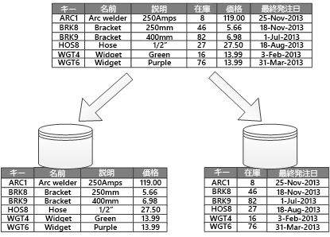

# データのパーティション分割Data partitioning

多くの大規模なソリューションでは、個別に管理およびアクセスできる複数の "*パーティション*" にデータが分割されています。In many large-scale solutions, data is divided into *partitions* that can be managed and accessed separately. パーティション分割により、スケーラビリティの向上、競合の低減、パフォーマンスの最適化を実現できます。Partitioning can improve scalability, reduce contention, and optimize performance. また、使用パターンに基づいてデータを分割するメカニズムも提供できます。It can also provide a mechanism for dividing data by usage pattern. たとえば、古いデータを廉価なデータ ストレージにアーカイブできます。For example, you can archive older data in cheaper data storage.

ただし、悪影響を最小限に抑え、メリットを最大限に活かすには、パーティション分割戦略を慎重に選択する必要があります。However, the partitioning strategy must be chosen carefully to maximize the benefits while minimizing adverse effects.

> [!NOTE]
> この記事で使用されている *パーティション分割* という用語は、データを異なるデータ ストアに物理的に分割するプロセスを指します。In this article, the term *partitioning* means the process of physically dividing data into separate data stores. これは SQL Server テーブルのパーティション分割とは異なります。It is not the same as SQL Server table partitioning.

## データをパーティション分割する理由Why partition data?

* **拡張性の向上**。**Improve scalability**. 単一のデータベース システムをスケールアップすると、最終的には物理的なハードウェア限界に到達します。When you scale up a single database system, it will eventually reach a physical hardware limit. データを複数のパーティションに分割し、各パーティションを個別のサーバー上でホストすると、システムをほぼ無制限にスケールアウトできます。If you divide data across multiple partitions, each hosted on a separate server, you can scale out the system almost indefinitely.

* **パフォーマンスの向上**。**Improve performance**. 各パーティションでのデータ アクセス操作は、より少量のデータに対して実行されます。Data access operations on each partition take place over a smaller volume of data. パーティション分割を適切に行うことで、システムの効率を高めることができます。Correctly done, partitioning can make your system more efficient. 複数のパーティションに影響する操作は、並列に実行できます。Operations that affect more than one partition can run in parallel.

* **セキュリティの向上**。**Improve security**. 場合によっては、機密データとそれ以外のデータを異なるパーティションに分け、機密データにさまざまなセキュリティ制御を適用できます。In some cases, you can separate sensitive and non-sensitive data into different partitions and apply different security controls to the sensitive data.

* **運用上の柔軟性の向上**。**Provide operational flexibility**. パーティション分割は、運用の微調整、管理効率の最大化、およびコストの最小化を達成するための多くの機会を提供します。Partitioning offers many opportunities for fine tuning operations, maximizing administrative efficiency, and minimizing cost. たとえば、各パーティションのデータの重要性に基づいて、管理、監視、バックアップと復元、および他の管理タスクについて、異なる戦略を定義することができます。For example, you can define different strategies for management, monitoring, backup and restore, and other administrative tasks based on the importance of the data in each partition.

* **データ ストアと使用パターンの一致**。**Match the data store to the pattern of use**. パーティション分割では、コストとデータ ストアが提供する組み込み機能に基づいて、各パーティションを異なるタイプのデータ ストアにデプロイできます。Partitioning allows each partition to be deployed on a different type of data store, based on cost and the built-in features that data store offers. たとえば、大量のバイナリ データを Blob Storage に格納し、構造化されたデータをドキュメント データベースに保持することができます。For example, large binary data can be stored in  blob storage, while more structured data can be held in a document database. 「[適切なデータ ストアの選択](../guide/technology-choices/data-store-overview.md)」をご覧ください。See [Choose the right data store](../guide/technology-choices/data-store-overview.md).

* **可用性の向上**。**Improve availability**. データを複数のサーバーにまたがって分割することで、単一障害点を避けることができます。Separating data across multiple servers avoids a single point of failure. 1 つのインスタンスで障害が発生した場合、使用できなくなるのは、そのパーティションのデータだけです。If one instance fails, only the data in that partition is unavailable. その他のパーティションでの操作は、続行できます。Operations on other partitions can continue. マネージド PaaS データ ストアの場合、この考慮事項はあまり関係がありません。これらのサービスでは、設計に冗長性が組み込まれているためです。For managed PaaS data stores, this consideration is less relevant, because these services are designed with built-in redundancy. 

## パーティションの設計Designing partitions

データをパーティション分割する際の一般的な 3 つの戦略を次に示します。There are three typical strategies for partitioning data:

* **水平的パーティション分割** (しばしば "*シャーディング*" と呼ばれます)。**Horizontal partitioning** (often called *sharding*). この戦略では、各パーティションは個別のデータ ストアですが、すべてのパーティションが同じスキーマを持ちます。In this strategy, each partition is a separate data store, but all partitions have the same schema. 各パーティションは "*シャード*" と呼ばれ、データの特定のサブセット (特定の顧客セットのすべての注文など) を保持します。Each partition is known as a *shard* and holds a specific subset of the data, such as all the orders for a specific set of customers.
* **垂直的パーティション分割**。**Vertical partitioning**. この戦略では、各パーティションはデータ ストアに含まれる項目のフィールドのサブセットを含みます。In this strategy, each partition holds a subset of the fields for items in the data store. フィールドは、それらの使用パターンに従って分割されます。The fields are divided according to their pattern of use. たとえば、頻繁にアクセスされるフィールドを 1 つの垂直的パーティションに、使用頻度の少ないフィールドをまとめて別の垂直的パーティションに配置します。For example, frequently accessed fields might be placed in one vertical partition and less frequently accessed fields in another.
* **機能的パーティション分割**。**Functional partitioning**. この戦略では、システム内の区分可能な各コンテキストによって使用される方法に従って、データは集約されます。In this strategy, data is aggregated according to how it is used by each bounded context in the system. たとえば、e コマース システムでは、請求書データと製品在庫データを、それぞれ異なるパーティションに格納できます。For example, an e-commerce system might store invoice data in one partition and product inventory data in another.

これらの戦略は組み合わせることができます。パーティション分割構成を設計するときには、これらをすべて検討することをお勧めします。These strategies can be combined, and we recommend that you consider them all when you design a partitioning scheme. たとえば、データをシャードに分割し、次に垂直的パーティション分割を使用して、各シャード内のデータをさら分割することができます。For example, you might divide data into shards and then use vertical partitioning to further subdivide the data in each shard. 

### 水平的パーティション分割 (シャーディング)Horizontal partitioning (sharding)

図 1 は、水平的パーティション分割 (シャーディング) を示しています。Figure 1 shows horizontal partitioning or sharding. この例では、製品在庫データが製品キーに基づいてシャードに分割されます。In this example, product inventory data is divided into shards based on the product key. 各シャードは、シャード キーの連続する範囲 (A ～ G および H ～ Z) のデータを保持し、アルファベット順に編成されます。Each shard holds the data for a contiguous range of shard keys (A-G and H-Z), organized alphabetically.
シャーディングによって、より多くのコンピューターに負荷を分散することで、競合が減り、パフォーマンスが向上します。Sharding spreads the load over more computers, which reduces contention and improves performance. 

*図 1: パーティション キーに基づく水平的パーティション分割 (シャーディング) データ**Figure 1. Horizontally partitioning (sharding) data based on a partition key*

最も重要な要素は、シャーディング キーの選択です。The most important factor is the choice of a sharding key. システムが運用状態に移行した後にキーを変更することは、非常に困難になる可能性があります。It can be difficult to change the key after the system is in operation. キーは、ワークロードをシャード間でできるだけ均等に分散するようにデータがパーティション分割されるものである必要があります。The key must ensure that data is partitioned to spread the workload as evenly as possible across the shards.

シャードは同じサイズである必要はありません。The shards don't have to be the same size. 要求の数のバランスを取ることの方が重要です。It's more important to balance the number of requests. シャードのサイズが非常に大きくても、各項目へのアクセス操作が少ないものや、Some shards might be very large, but each item has a low number of access operations. 項目数は少なくても各項目へのアクセスは非常に頻繁に発生するものがあります。Other shards might be smaller, but each item is accessed much more frequently. また、1 つのシャードが (容量と処理リソースの観点で) データ ストアのスケールの上限を超えないようにすることも重要です。It's also important to ensure that a single shard does not exceed the scale limits (in terms of capacity and processing resources) of the data store.

パフォーマンスと可用性に影響する可能性のある "ホット" パーティションが発生しないようにします。Avoid creating "hot" partitions that can affect performance and availability. たとえば、顧客の名前の最初の文字を使用すると、分散が不均等になります。他の文字よりもよく使用される文字があるためです。代わりに、顧客識別子のハッシュを使用して、パーティション間でデータをより均等に分散させます。For example, using the first letter of a customer’s name causes an unbalanced distribution, because some letters are more common Instead, use a hash of a customer identifier to distribute data more evenly across partitions.

大きなシャードの分割、小さなシャードの結合による大きなパーティションの構築、スキーマの変更などの将来の要件を最小限にするシャーディング キーを選択します。Choose a sharding key that minimizes any future requirements to split large shards, coalesce small shards into larger partitions, or change the schema. これらの操作は非常に時間がかかる可能性があり、実行時に 1 つ以上のシャードをオフラインにすることが必要になる場合があります。These operations can be very time consuming, and might require taking one or more shards offline while they are performed.

シャードをレプリケートすると、他のシャードの分割、マージ、または再構成を行うときに、一部のレプリカをオンラインにしておくことができる場合があります。If shards are replicated, it might be possible to keep some of the replicas online while others are split, merged, or reconfigured. ただし、システムでは、再構成中に実行できる操作を制限する必要があります。However, the system might need to limit the operations that can be performed during the reconfiguration. たとえば、レプリカのデータを読み取り専用としてマークしてデータの不整合を防ぎます。For example, the data in the replicas might be marked as read-only to prevent data inconsistences.

水平的パーティション分割の詳細については、「[シャーディング パターン]」をご覧ください。For more information about horizontal partitioning, see [Sharding pattern].

### 垂直的パーティション分割Vertical partitioning

垂直的パーティション分割を使用する最も一般的な目的は、頻繁にアクセスされる項目の取り込みに関連する I/O とパフォーマンスのコストを削減することです。The most common use for vertical partitioning is to reduce the I/O and performance costs associated with fetching items that are frequently accessed. 図 2 は、垂直的パーティション分割の例です。Figure 2 shows an example of vertical partitioning. この例では、項目のさまざまなプロパティが異なるパーティションに格納されています。In this example, different properties of an item are stored in different partitions. 一方のパーティションには、製品の名前、説明、価格など、アクセス頻度の高いデータが保持されています。One partition holds data that is accessed more frequently, including product name, description, and price. もう 1 つのパーティションには、在庫データ (在庫数と最終注文日) が保持されています。Another partition holds inventory data: the stock count and last-ordered date.

*図 2: 使用パターンによるデータの垂直的パーティション分割**Figure 2. Vertically partitioning data by its pattern of use*

この例では、アプリケーションは、製品の詳細を顧客に表示する際は常に、製品の名前、説明、および価格をクエリします。In this example, the application regularly queries the product name, description, and price when displaying the product details to customers. 通常、在庫数と最終注文日の 2 つの項目は一緒に使用されるので、別のパーティションに保持されています。Stock count and last- ordered date are held in a separate partition because these two items are commonly used together.

垂直的パーティション分割のその他の利点は次のとおりです。Other advantages of vertical partitioning:

- 変動が比較的少ないデータ (製品の名前、説明、価格) を、より動的なデータ (在庫レベルと最終注文日) から分離できます。Relatively slow-moving data (product name, description, and price) can be separated from the more dynamic data (stock level and last ordered date). 変動の少ないデータは、アプリケーションがメモリにキャッシュするのに適しています。Slow moving data is a good candidate for an application to cache in memory.

- 機密データは、セキュリティ制御が強化された別のパーティションに格納できます。Sensitive data can be stored in a separate partition with additional security controls.

- 垂直的パーティション分割では、必要な同時アクセスの数を減らすことができます。Vertical partitioning can reduce the amount of concurrent access that's needed.

垂直的パーティション分割は、データ ストア内のエンティティ レベルで動作します。エンティティを部分的に正規化して、"*多数の*" 項目で構成されるエンティティを "*少数の*" 項目で構成される複数のエンティティに分割します。Vertical partitioning operates at the entity level within a data store, partially normalizing an entity to break it down from a *wide* item to a set of *narrow* items. 垂直的パーティション分割は、HBase や Cassandra など、列指向のデータ ストアに理想的に適しています。It is ideally suited for column-oriented data stores such as HBase and Cassandra. 変化する可能性が低い列コレクションのデータの場合は、SQL Server の列ストアを使用することも検討してください。If the data in a collection of columns is unlikely to change, you can also consider using column stores in SQL Server.

### 機能的パーティション分割Functional partitioning

アプリケーションで各ビジネス 領域の区分のあるコンテキストを識別できる場合は、機能的パーティション分割によって、分離性とデータ アクセスのパフォーマンスを向上させることができます。When it's possible to identify a bounded context for each distinct business area in an application, functional partitioning is a way to improve isolation and data access performance. 機能的パーティション分割のもう 1 つの一般的な用途は、読み書き可能なデータを読み取り専用データから分離することです。Another common use for functional partitioning is to separate read-write data from read-only data. 図 3 は、機能的パーティション分割の概要を示しており、在庫データが顧客データから分離されています。Figure 3 shows an overview of functional partitioning where inventory data is separated from customer data.

*図 3: 区分のあるコンテキストまたはサブドメインによりデータが分割された機能的パーティション分割**Figure 3. Functionally partitioning data by bounded context or subdomain*

このパーティション分割戦略は、システムのさまざまな部分にまたがるデータ アクセスの競合を少なくするのに役立ちます。This partitioning strategy can help reduce data access contention across different parts of a system.

## 拡張性の観点でのパーティション分割の設計Designing partitions for scalability

各パーティションのサイズとワークロードを考慮して、それらを均等に分散することにより、最大の拡張性を達成することが重要です。It's vital to consider size and workload for each partition and balance them so that data is distributed to achieve maximum scalability. ただし、データのパーティションが単一のパーティション ストアの拡張制限を超えないようにすることも必要です。However, you must also partition the data so that it does not exceed the scaling limits of a single partition store.

拡張性の観点でパーティション分割を設計する際には、次の手順に従います。Follow these steps when designing partitions for scalability:

1. アプリケーションを分析して、各クエリで返される結果セットのサイズ、アクセス頻度、固有の遅延時間、サーバー側のコンピューティング処理要件など、データ アクセス パターンを理解します。Analyze the application to understand the data access patterns, such as the size of the result set returned by each query, the frequency of access, the inherent latency, and the server-side compute processing requirements. 多くの場合、少数の主要なエンティティが最大の処理リソースを要求します。In many cases, a few major entities will demand most of the processing resources.
2. この分析を使用して、データ サイズやワークロードなどの現在および将来の拡張性目標を決定します。Use this analysis to determine the current and future scalability targets, such as data size and workload. そして、拡張性目標を満たすようにパーティション全体にデータを分散します。Then distribute the data across the partitions to meet the scalability target. 水平的パーティション分割では、均等に分散するために適切なシャード キーを選択することが重要となります。For horizontal partitioning, choosing the right shard key is important to make sure distribution is even. 詳細については、「[シャーディング パターン]」を参照してください。For more information, see the [Sharding pattern].
3. データ サイズとスループットの観点から、スケーラビリティの要件に対処できる十分なリソースが各パーティションにあることを確認します。Make sure each partition has enough resources to handle the scalability requirements, in terms of data size and throughput. データ ストアによっては、パーティションあたりのストレージ領域、処理能力、またはネットワーク帯域幅が制限されていることがあります。Depending on the data store, there might be a limit on the amount of storage space, processing power, or network bandwidth per partition. 要件がこれらの制限を超える可能性がある場合は、パーティション分割戦略を再調整するか、データをさらに分割することが必要になったり、複数の戦略を組み合わせることが必要になる場合があります。If the requirements are likely to exceed these limits, you may need to refine your partitioning strategy or split data out further, possibly combining two or more strategies.
4. システムを監視して、データが想定どおりに分散されており、各パーティションで負荷が処理されていることを確認します。Monitor the system to verify that data is distributed as expected and that the partitions can handle the load. 実際の使用状況は、分析で予測されたものと必ずしも一致するとは限りません。Actual usage does not always match what an analysis predicts. その場合、パーティションを再調整できます。また、必要なバランスを取るために、システムの一部を再設計することも可能です。If so, it might be possible to rebalance the partitions, or else redesign some parts of the system to gain the required balance.

クラウド環境によっては、インフラストラクチャ境界の観点でリソースが割り当てられます。Some cloud environments allocate resources in terms of infrastructure boundaries. 選択した境界の制限が、データ ストレージ、処理能力、および帯域幅の観点で、データ量の想定される成長を収容できることを確認する必要があります。Ensure that the limits of your selected boundary provide enough room for any anticipated growth in the volume of data, in terms of data storage, processing power, and bandwidth.

たとえば、Azure Table Storage を使用する場合、一定期間内に単一パーティションで処理できる要求の量に制限があります For example, if you use Azure table storage, there is a limit to the volume of requests that can be handled by a single partition in a particular period of time. (「[Azure Storage のスケーラビリティおよびパフォーマンスのターゲット]」をご覧ください)。ビジー状態のシャードでは、単一パーティションで処理できるリソースよりも多くのリソースが必要になることがあります。(See [Azure storage scalability and performance targets].) A busy shard might require more resources than a single partition can handle. その場合、負荷を分散するために、シャードを再パーティション分割する必要があります。If so, the shard might need to be repartitioned to spread the load. これらのテーブルの合計サイズまたはスループットがストレージ アカウントの容量を超える場合は、追加のストレージ アカウントを作成して、それらのアカウントにテーブルを分散する必要があります。If the total size or throughput of these tables exceeds the capacity of a storage account, you might need to create additional storage accounts and spread the tables across these accounts. 

## クエリ パフォーマンスの観点でのパーティション分割の設計Designing partitions for query performance

クエリのパフォーマンスは、多くの場合、小さなデータ セットを使用し、並列クエリを実行することで、格段に向上できます。Query performance can often be boosted by using smaller data sets and by running parallel queries. 各パーティションには、データ セット全体の小さな割合を収容する必要があります。Each partition should contain a small proportion of the entire data set. そうすると、容量が小さくなるので、クエリのパフォーマンスが向上します。This reduction in volume can improve the performance of queries. ただし、パーティション分割は、データベースを適切に設計および構成することの代替にはなりません。However, partitioning is not an alternative for designing and configuring a database appropriately. たとえば、必要なインデックスが構成されていることを確認します。For example, make sure that you have the necessary indexes in place.

クエリ パフォーマンスの観点でパーティション分割を設計する際には、次の手順に従います。Follow these steps when designing partitions for query performance:

1. アプリケーションの要件とパフォーマンスを検証します。Examine the application requirements and performance:
   * ビジネス要件を使用して、常に高速で実行する必要のある重要なクエリを決定します。Use business requirements to determine the critical queries that must always perform quickly.
   * システムを監視して、低速で実行するクエリを識別します。Monitor the system to identify any queries that perform slowly.
   * 最も頻繁に実行されるクエリを見つけます。Find which queries are performed most frequently. 単一のクエリのコストが最小限であっても、累積されたリソース消費量が多大になる可能性があります。Even if a single query has a minimal cost, the cumulative resource consumption could be significant. 

2. パフォーマンスの低下を引き起こしているデータをパーティション分割します。Partition the data that is causing slow performance:
   * クエリの応答時間がターゲット時間内になるように各パーティションのサイズを制限します。Limit the size of each partition so that the query response time is within target.
   * 水平的パーティション分割を使用する場合は、アプリケーションが適切なパーティションを簡単に選択できるようにシャード キーを設計します。If you use horizontal partitioning, design the shard key so that the application can easily select the right partition. これにより、クエリがすべてのパーティションを通してスキャンする必要がなくなります。This prevents the query from having to scan through every partition.
   * パーティションの場所を検討してください。Consider the location of a partition. 可能な限り、パーティションのデータを、それにアクセスするアプリケーションやユーザーに地理的に近い場所に維持します。If possible, try to keep data in partitions that are geographically close to the applications and users that access it.

3. エンティティにスループットとクエリ パフォーマンスの要件がある場合、そのエンティティに基づく機能的パーティション分割を使用します。If an entity has throughput and query performance requirements, use functional partitioning based on that entity. それでも要件が満たされない場合は、水平的パーティション分割も適用します。If this still doesn't satisfy the requirements, apply horizontal partitioning as well. ほとんどの場合、単一のパーティション分割戦略で十分ですが、両方の戦略を組み合わせて使用することが効果的な場合があります。In most cases a single partitioning strategy will suffice, but in some cases it is more efficient to combine both strategies.

4. パフォーマンスを向上させるために、複数のパーティションでクエリを並列実行することを検討します。Consider running queries in parallel across partitions to improve performance.

## 可用性の観点でのパーティション分割の設計Designing partitions for availability
データをパーティション分割すると、データセット全体が単一障害点となることはなく、またデータセットの個々のサブセットを個別に管理できるので、アプリケーションの可用性が向上します。Partitioning data can improve the availability of applications by ensuring that the entire dataset does not constitute a single point of failure and that individual subsets of the dataset can be managed independently. 

可用性に影響する次の要素を考慮してください。Consider the following factors that affect availability:

**業務に対するデータの重要度**。**How critical the data is to business operations**. 重要なビジネス情報であるデータ (トランザクションなど) と、重要度の低い運用データ (ログ ファイルなど) を特定します。Identify which data is critical business information, such as transactions, and which data is less critical operational data, such as log files.

* 適切なバックアップ計画を使用して、重要なデータを可用性の高いパーティションに格納することを検討します。Consider storing critical data in highly-available partitions with an appropriate backup plan.
* データセットごとに個別の管理および監視手順を確立します。Establish separate management and monitoring procedures for the different datasets. 
* 同じレベルの重要度を持つデータを同じパーティションに配置して、適切な頻度で一緒にバックアップできるようにします。Place data that has the same level of criticality in the same partition so that it can be backed up together at an appropriate frequency. たとえば、トランザクション データを保持するパーティションは、ログ情報やトレース情報を保持するパーティションよりも頻繁にバックアップする必要があります。For example, partitions that hold transaction data might need to be backed up more frequently than partitions that hold logging or trace information.

**個々のパーティションを管理する方法**。**How individual partitions can be managed**. 個別に管理および保守ができるようにパーティションを設計すると、いくつかのメリットが生じます。Designing partitions to support independent management and maintenance provides several advantages. 例: For example:

* 1 つのパーティションで障害が発生した場合、他のパーティションのデータにアクセスするアプリケーションに影響を及ぼすことなく、そのパーティションを個別に復旧できます。If a partition fails, it can be recovered independently without applications that access data in other partitions.
* 地理的な場所に基づいてデータをパーティション分割すると、各場所のオフピーク時間に保守タスクが実行されるようにスケジュールできます。Partitioning data by geographical area allows scheduled maintenance tasks to occur at off-peak hours for each location. 計画された保守タスクがこの期間内に完了するように、パーティションのサイズが大きすぎないことを確認します。Ensure that partitions are not too big to prevent any planned maintenance from being completed during this period.

**機密データをパーティション全体でレプリケートすることの必要性**。**Whether to replicate critical data across partitions**. この戦略では、可用性とパフォーマンスを向上させることができますが、整合性の問題が発生することもあります。This strategy can improve availability and performance, but can also introduce consistency issues. 変更をすべてのレプリカと同期するには時間がかかります。It takes time to synchronize changes with every replica. この期間は、さまざまなパーティションが異なるデータ値を持つ可能性があります。During this period, different partitions will contain different data values.

## アプリケーション設計に関する考慮事項Application design considerations

パーティション分割を使用すると、システムの設計と開発の複雑さが増大します。Partitioning adds complexity to the design and development of your system. 初期においてシステムが単一のパーティションのみを含んでいる場合でも、パーティション分割をシステム設計の基盤として考慮する必要があります。Consider partitioning as a fundamental part of system design even if the system initially only contains a single partition. 後からの思い付きでパーティション分割に対処しようとすると、維持する必要があるライブ システムが既に存在するので難しくなります。If you address partitioning as an afterthought, it will be more challenging because you already have a live system to maintain:

- データ アクセス ロジックを変更する必要があります。Data access logic will need to be modified. 
- 既存の大量のデータを複数のパーティションに分散するために、それらのデータを移行することが必要になる場合があります。Large quantities of existing data may need to be migrated, to distribute it across partitions
- ユーザーは、移行中もシステムを引き続き使用できることを求めています。Users expect to be able to continue using the system during the migration.

場合によっては、初期のデータ セットが小さく、単一サーバーで容易に処理できるので、パーティション分割は重要ではないと見なされます。In some cases, partitioning is not considered important because the initial dataset is small and can be easily handled by a single server. これは一部のワークロードには当てはまるかもしれませんが、多くの商用システムはユーザー数の増加に伴って拡張する必要があります。This might be true for some workloads, but many commercial systems need to expand as the number of users increases. 

さらに、パーティション分割によってメリットがもたらされるのは大規模なデータ ストアだけではありません。Moreover, it's not only large data stores that benefit from partitioning. たとえば、小さなデータ ストアが数百の同時クライアントによって過度にアクセスされることがあります。For example, a small data store might be heavily accessed by hundreds of concurrent clients. このような状況でデータをパーティション分割すると、競合を少なくし、スループットを向上させることができます。Partitioning the data in this situation can help to reduce contention and improve throughput.

データパーティション分割構成を設計する際には、次の点を考慮する必要があります。Consider the following points when you design a data partitioning scheme:

**パーティションをまたがるデータ アクセス操作を最小限に抑える**: **Minimize cross-partition data access operations**. 可能であれば、パーティションごとに、最も一般的なデータベース操作の対象となるデータをまとめ、パーティションをまたがるデータ アクセス操作を最小限に抑えます。Where possible, keep data for the most common database operations together in each partition to minimize cross-partition data access operations. パーティションをまたがるクエリは、単一パーティション内でのクエリよりも時間がかかる可能性がありますが、あるクエリ セットにパーティションを最適化すると、他のクエリ セットが悪影響を受けることがあります。Querying across partitions can be more time-consuming than querying within a single partition, but optimizing partitions for one set of queries might adversely affect other sets of queries. パーティションをまたがるクエリを実行する必要がある場合は、並列クエリを実行し、アプリケーション内で結果を集計することによって、クエリ時間を最小限に抑えます If you must query across partitions, minimize query time by running parallel queries and aggregating the results within the application. (クエリの結果を次のクエリで使用する場合など、この方法を使用できない場合もあります)。(This approach might not be possible in some cases, such as when the result from one query is used in the next query.)

**静的参照データのレプリケーションを検討する**: **Consider replicating static reference data.** クエリで比較的静的な参照データ (郵便番号テーブルや製品リストなど) を使用する場合は、すべてのパーティションでこのデータをレプリケートして、パーティションごとの個別の検索操作を減らすことを検討します。If queries use relatively static reference data, such as postal code tables or product lists, consider replicating this data in all of the partitions to reduce separate lookup operations in different partitions. この方法を使用すると、システム全体からの大量のトラフィックによって、参照データが "ホット" データセットになる可能性を低減することもできます。This approach can also reduce the likelihood of the reference data becoming a "hot" dataset, with heavy traffic from across the entire system. ただし、参照データに対する変更の同期に関連する追加コストが発生します。However, there is an additional cost associated with synchronizing any changes to the reference data.

**パーティション間結合を最小限に抑える**: **Minimize cross-partition joins.** 可能であれば、垂直的パーティション間および機能的パーティション間での参照整合性の要件を最小限に抑えます。Where possible, minimize requirements for referential integrity across vertical and functional partitions. これらの構成では、アプリケーションが、パーティション間での参照整合性を維持する役割を担います。In these schemes, the application is responsible for maintaining referential integrity across partitions. 複数のパーティション間でデータを結合するクエリは非効率的です。通常、アプリケーションがキーに基づいてクエリを実行し、続いて外部キーに基づいてクエリを実行する必要があるためです。Queries that join data across multiple partitions are inefficient because the application typically needs to perform consecutive queries based on a key and then a foreign key. このような状況では、パーティション分割の代わりに、関連するデータのレプリケートまたは非正規化を検討します。Instead, consider replicating or de-normalizing the relevant data. パーティション間結合が必要な場合は、パーティションに対して並列クエリを実行し、アプリケーション内でデータを結合します。If cross-partition joins are necessary, run parallel queries over the partitions and join the data within the application.

**最終的な整合性の受容**。**Embrace eventual consistency**. 強力な整合性が実際に要件であるかどうかを評価します。Evaluate whether strong consistency is actually a requirement. 分散システムでの一般的な方法として、最終的な整合性を実装します。A common approach in distributed systems is to implement eventual consistency. 各パーティションのデータは個別に更新され、アプリケーションのロジックはすべての更新が正常に完了したことを確認します。The data in each partition is updated separately, and the application logic ensures that the updates are all completed successfully. また、結果整合性の操作が実行している間、データをクエリすることにより発生する可能性のある不整合を処理することができます。It also handles the inconsistencies that can arise from querying data while an eventually consistent operation is running. 

**クエリが正しいパーティションを見つける方法を考慮します**。**Consider how queries locate the correct partition**. 必要なデータを見つけるためにクエリがすべてのパーティションをスキャンする必要がある場合、複数の並列クエリが実行中である場合でも、パフォーマンスに非常に大きな影響を及ぼします。If a query must scan all partitions to locate the required data, there is a significant impact on performance, even when multiple parallel queries are running. 垂直的パーティション分割と機能的パーティション分割では、クエリでパーティションを自然に指定できます。With vertical and functional partitioning, queries can naturally specify the partition. 一方、水平的パーティション分割では、すべてのシャードが同じスキーマを持つので、項目を見つけることが困難になる可能性があります。Horizontal partitioning, on the other hand, can make locating an item difficult, because every shard has the same schema. 一般的な解決策は、特定の項目のシャードの場所を検索する際に使用するマップを維持することです。A typical solution to maintain a map that is used to look up the shard location for specific items. このマップは、アプリケーションのシャーディング ロジックに実装することも、データ ストアが透過的シャーディングをサポートする場合にはデータ ストアにより維持されるようにすることもできます。This map can be implemented in the sharding logic of the application, or maintained by the data store if it supports transparent sharding.

**シャードを定期的に再調整することを検討する**: **Consider periodically rebalancing shards**. 水平的パーティション分割では、シャードの再調整により、サイズとワークロードに基づいてデータを均等に分散することで、ホットスポットを最小限に抑え、クエリ パフォーマンスを最大化し、ストレージの物理的な制限に対処できます。With horizontal partitioning, rebalancing shards can help distribute the data evenly by size and by workload to minimize hotspots, maximize query performance, and work around physical storage limitations. ただし、これは複雑なタスクで、多くの場合、カスタム ツールまたはカスタム プロセスの使用が必要になります。However, this is a complex task that often requires the use of a custom tool or process. 

**パーティションをレプリケートする**: **Replicate partitions.** 各パーティションをレプリケートすると、障害からの保護を強化できます。If you replicate each partition, it provides additional protection against failure. 単一のレプリカで障害が発生しても、動作しているコピーにクエリを振り向けることができます。If a single replica fails, queries can be directed towards a working copy.

**パーティション分割戦略の物理制限に到達した場合、拡張性を別のレベルに拡張することが必要な場合があります**。**If you reach the physical limits of a partitioning strategy, you might need to extend the scalability to a different level**. たとえば、パーティション分割がデータベース レベルで行われる場合、パーティションを複数のデータベースで配置したりレプリケートしたりすることが必要になる場合があります。For example, if partitioning is at the database level, you might need to locate or replicate partitions in multiple databases. パーティション分割が既にデータベース レベルで行われており、物理制限が問題になっている場合、パーティションを複数のホスティング アカウントで配置したりレプリケートしたりすることが必要な可能性があります。If partitioning is already at the database level, and physical limitations are an issue, it might mean that you need to locate or replicate partitions in multiple hosting accounts.

**トランザクションでは、複数のパーティションのデータにアクセスしないようにします**。**Avoid transactions that access data in multiple partitions**. 一部のデータ ストアには、データを変更する操作に対してトランザクション レベルの一貫性と整合性を保つ機能を実装していますが、これが有効になるのは、データが単一のパーティションに配置されている場合だけです。Some data stores implement transactional consistency and integrity for operations that modify data, but only when the data is located in a single partition. 複数のパーティションにまたがってトランザクション レベルのサポートを必要とする場合、ほとんどのパーティション分割システムでこの機能はネイティブにサポートされていないので、アプリケーション ロジックの一部として実装することが必要になる可能性があります。If you need transactional support across multiple partitions, you will probably need to implement this as part of your application logic because most partitioning systems do not provide native support.

すべてのデータ ストアで運用の管理および監視のアクティビティが必要です。All data stores require some operational management and monitoring activity. これらのタスクには、データのロード、データのバックアップおよび復元、データの再編成、システムが正しく効率よく動作していることの確認などがあります。The tasks can range from loading data, backing up and restoring data, reorganizing data, and ensuring that the system is performing correctly and efficiently.

運用管理に影響する次の要因を考慮してください。Consider the following factors that affect operational management:

* **データをパーティション分割するとき、適切な管理と運用のタスクを実装する方法**。**How to implement appropriate management and operational tasks when the data is partitioned**. バックアップと復元、データのアーカイブ、システムの監視、その他の管理タスクなどです。These tasks might include backup and restore, archiving data, monitoring the system, and other administrative tasks. たとえば、バックアップと復元の操作では論理的な一貫性を維持することが課題になります。For example, maintaining logical consistency during backup and restore operations can be a challenge.
* **データを複数のパーティションにロードする方法と、他のソースから到着する新しいデータを追加する方法**。**How to load the data into multiple partitions and add new data that's arriving from other sources**. 一部のツールおよびユーティリティでは、データを正しいパーティションにロードするなど、シャード化されているデータの操作がサポートされていないことがあります。Some tools and utilities might not support sharded data operations such as loading data into the correct partition. 
* **定期的にデータをアーカイブして削除する方法**。**How to archive and delete the data on a regular basis**. パーティションの過度な成長を防止するために、定期的に (たとえば、月単位で) データをアーカイブして削除する必要があります。To prevent the excessive growth of partitions, you need to archive and delete data on a regular basis (perhaps monthly). 異なるアーカイブ スキーマに一致するように、データを変換することが必要な場合があります。It might be necessary to transform the data to match a different archive schema.
* **データ整合性の問題を見つける方法**。**How to locate data integrity issues**. あるパーティションのデータが別のパーティションの存在しない情報を参照しているなど、データ整合性の問題を見つけるプロセスを定期的に実行することを検討します。Consider running a periodic process to locate any data integrity issues, such as data in one partition that references missing information in another. このプロセスでは、これらの問題の自動修正を試みるか、手動でのレビュー用にレポートを生成できます。The process can either attempt to fix these issues automatically or simply generate a report for manual review. 

## パーティションの再調整Rebalancing partitions

システムが成熟するにつれて、パーティション分割構成を調整することが必要になる場合があります。As a system matures, you might have to adjust the partitioning scheme. たとえば、パーティション間でトラフィック量に不均衡が生じ、特定のパーティションがホットスポットになり、過度の競合が発生することがあります。For example, individual partitions might start get a disproportionate volume of traffic and become hot, leading to excessive contention. また、一部のパーティションでデータ量が過少に見積もられており、これらのパーティションが容量の上限に近づいていることもあります。Or you might have underestimated the volume of data in some partitions, causing some partitions to approach capacity limits. 

Cosmos DB などの一部のデータ ストアでは、パーティションを自動的に再調整できます。Some data stores, such as Cosmos DB, can automatically rebalance partitions. それ以外の場合、再調整は次の 2 段階で構成される管理タスクとなります。In other cases, rebalancing is an administrative task that consists of two stages:

1. 新しいパーティション分割戦略を決定します。Determine a new partitioning strategy. 

    - どのパーティションを分割する (場合によっては結合する) 必要があるか。Which partitions need to be split (or possibly combined)? 
    - 新しいパーティション キーは何か。What is the new partition key?

2. データを古いパーティション分割構成から新しいパーティション セットに移行します。Migrate data from the old partitioning scheme to the new set of partitions.

データ ストアによっては、パーティションの使用中にパーティション間でデータを移行できる場合もあります。Depending on the data store, you might be able to migrate data between partitions while they are in use. これは "*オンライン移行*" と呼ばれます。This is called *online migration*. これが不可能な場合は、データを再配置する間、パーティションを使用できないようにする必要があります ("*オフライン移行*")。If that's not possible, you might need to make partitions unavailable while the data is relocated (*offline migration*).

### オフライン移行Offline migration

オフライン移行は、競合が発生する可能性が低減されるので一般に簡単です。Offline migration is generally simpler, because it reduces the chances of contention occurring. 概念的には、オフライン移行は次のように動作します。Conceptually, offline migration works as follows:

1. パーティションをオフラインにします。Mark the partition offline.
2. データを分割/マージし、新しいパーティションに移動します。Split-merge and move the data to the new partitions.
3. データを検証します。Verify the data.
4. 新しいパーティションをオンラインにします。Bring the new partitions online.
5. 古いパーティションを削除します。Remove the old partition.

必要に応じて、手順 1. でパーティションを読み取り専用としてマークすることもできます。これにより、アプリケーションはデータの移動中も、データを読み取ることができます。Optionally, you can mark a partition as read-only in step 1, so that applications can still read the data while it is being moved.

## オンライン移行Online migration

オンライン移行は実行が複雑になりますが、中断は少なくなります。Online migration is more complex to perform but less disruptive. プロセスはオフライン移行と似ていますが、元のパーティションがオフラインになることはありません。The process is similar to offline migration, except the original partition is not marked offline. 移行プロセスの粒度 (たとえば、項目単位か、シャード単位か) に応じて、クライアント アプリケーションのデータ アクセス コードでは、2 つの場所 (元のパーティションと新しいパーティション) に保持されるデータの読み書きを処理することが必要になる場合があります。Depending on the granularity of the migration process (for example, item by item versus shard by shard), the data access code in the client applications might have to handle reading and writing data that's held in two locations, the original partition and the new partition.

## 関連するパターンRelated patterns 

次の設計パターンがシナリオに関連することがあります。The following design patterns might be relevant to your scenario:

* [シャーディング パターン]は、データのシャーディングのための一般的な戦略を示します。The [sharding pattern] describes some common strategies for sharding data.
* [インデックス テーブル パターン]は、データに対してセカンダリ インデックスを作成する方法を示します。The [index table pattern] shows how to create secondary indexes over data. この手法を使用すると、アプリケーションは、コレクションのプライマリ キーを参照しないクエリで、データをすばやく取得できます。An application can quickly retrieve data with this approach, by using queries that do not reference the primary key of a collection.
* [具体化されたビュー パターン]は、データを要約して高速のクエリ操作をサポートする、事前設定されたビューを生成する方法を示します。The [materialized view pattern] describes how to generate pre-populated views that summarize data to support fast query operations. この手法は、要約対象のデータを含むパーティションが複数のサイトにまたがって分散されている場合に、パーティション分割されたデータ ストアで役立つ可能性があります。This approach can be useful in a partitioned data store if the partitions that contain the data being summarized are distributed across multiple sites.

## 次の手順Next steps

- 特定の Azure サービスのパーティション分割戦略の詳細を確認します。Learn about partitioning strategies for specific Azure services. 「[Data partitioning strategies (データのパーティション分割戦略)](./data-partitioning-strategies.md)」をご覧ください。See [Data partitioning strategies](./data-partitioning-strategies.md)

[Azure Storage のスケーラビリティおよびパフォーマンスのターゲット]: /azure/storage/storage-scalability-targets
[Azure Storage Scalability and Performance Targets]: /azure/storage/storage-scalability-targets
[インデックス テーブル パターン]: ../patterns/index-table.md
[Index Table Pattern]: ../patterns/index-table.md
[具体化されたビュー パターン]: ../patterns/materialized-view.md
[Materialized View Pattern]: ../patterns/materialized-view.md
[シャーディング パターン]: ../patterns/sharding.md
[Sharding pattern]: ../patterns/sharding.md
