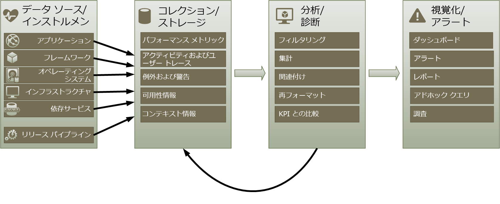
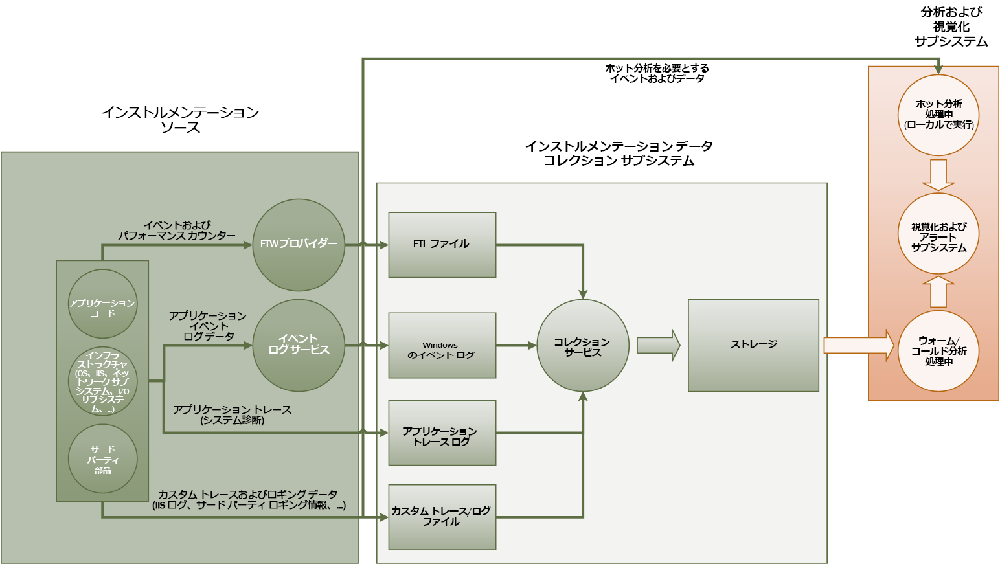
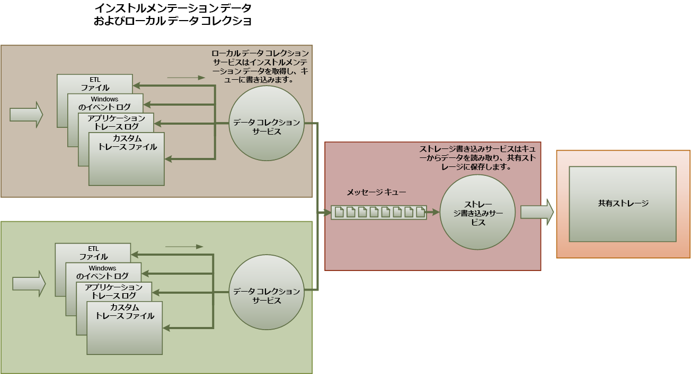
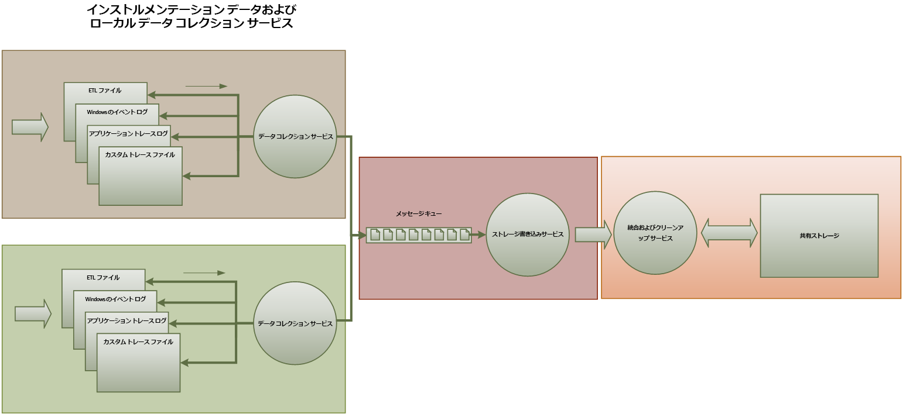
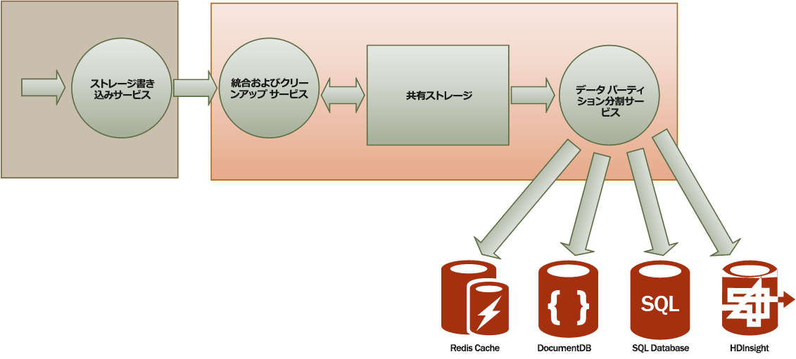

# <a name="monitoring-and-diagnostics"></a><span data-ttu-id="7f264-103">監視と診断</span><span class="sxs-lookup"><span data-stu-id="7f264-103">Monitoring and diagnostics</span></span>
[!INCLUDE [header](../_includes/header.md)]

<span data-ttu-id="7f264-104">クラウドで実行される分散アプリケーションとサービスは、その性質上、多数の変化する部分で構成される複雑なソフトウェアです。</span><span class="sxs-lookup"><span data-stu-id="7f264-104">Distributed applications and services running in the cloud are, by their nature, complex pieces of software that comprise many moving parts.</span></span> <span data-ttu-id="7f264-105">運用環境では、ユーザーによるシステムの利用方法を追跡し、リソースの使用率をトレースし、システムの正常性とパフォーマンスを総合的に監視できることが重要です。</span><span class="sxs-lookup"><span data-stu-id="7f264-105">In a production environment, it's important to be able to track the way in which users utilize your system, trace resource utilization, and generally monitor the health and performance of your system.</span></span> <span data-ttu-id="7f264-106">ここに記載する情報を診断に使用して、問題の検出と修正を行うことができます。さらに、潜在的な問題を見つけてその発生を防止するために役立てることもできます。</span><span class="sxs-lookup"><span data-stu-id="7f264-106">You can use this information as a diagnostic aid to detect and correct issues, and also to help spot potential problems and prevent them from occurring.</span></span>

## <a name="monitoring-and-diagnostics-scenarios"></a><span data-ttu-id="7f264-107">監視と診断のシナリオ</span><span class="sxs-lookup"><span data-stu-id="7f264-107">Monitoring and diagnostics scenarios</span></span>
<span data-ttu-id="7f264-108">監視を行うと、システムがどの程度正常に機能しているかを知ることができます。</span><span class="sxs-lookup"><span data-stu-id="7f264-108">You can use monitoring to gain an insight into how well a system is functioning.</span></span> <span data-ttu-id="7f264-109">監視は、サービス品質目標を維持するための非常に重要な要素です。</span><span class="sxs-lookup"><span data-stu-id="7f264-109">Monitoring is a crucial part of maintaining quality-of-service targets.</span></span> <span data-ttu-id="7f264-110">監視データを収集する一般的なシナリオは、次のとおりです。</span><span class="sxs-lookup"><span data-stu-id="7f264-110">Common scenarios for collecting monitoring data include:</span></span>

* <span data-ttu-id="7f264-111">システムが正常な状態を保っていることの確認。</span><span class="sxs-lookup"><span data-stu-id="7f264-111">Ensuring that the system remains healthy.</span></span>
* <span data-ttu-id="7f264-112">システムとそのコンポーネント要素の可用性の追跡。</span><span class="sxs-lookup"><span data-stu-id="7f264-112">Tracking the availability of the system and its component elements.</span></span>
* <span data-ttu-id="7f264-113">作業量が増加したときに、システムのスループットが予想外に低下しないことを保証するパフォーマンスの維持。</span><span class="sxs-lookup"><span data-stu-id="7f264-113">Maintaining performance to ensure that the throughput of the system does not degrade unexpectedly as the volume of work increases.</span></span>
* <span data-ttu-id="7f264-114">顧客と合意したサービス レベル アグリーメント (SLA) をシステムが満たしていることの保証。</span><span class="sxs-lookup"><span data-stu-id="7f264-114">Guaranteeing that the system meets any service-level agreements (SLAs) established with customers.</span></span>
* <span data-ttu-id="7f264-115">システム、ユーザー、およびそのデータのプライバシーとセキュリティの保護。</span><span class="sxs-lookup"><span data-stu-id="7f264-115">Protecting the privacy and security of the system, users, and their data.</span></span>
* <span data-ttu-id="7f264-116">監査または規制を目的として実行される操作の追跡。</span><span class="sxs-lookup"><span data-stu-id="7f264-116">Tracking the operations that are performed for auditing or regulatory purposes.</span></span>
* <span data-ttu-id="7f264-117">システムの毎日の使用状況の監視と、対応しなかった場合に問題となる可能性がある傾向の発見。</span><span class="sxs-lookup"><span data-stu-id="7f264-117">Monitoring the day-to-day usage of the system and spotting trends that might lead to problems if they're not addressed.</span></span>
* <span data-ttu-id="7f264-118">発生した問題の追跡 (初期報告から、考えられる原因の分析、修正、ソフトウェア更新、およびデプロイメントに至るまで)。</span><span class="sxs-lookup"><span data-stu-id="7f264-118">Tracking issues that occur, from initial report through to analysis of possible causes, rectification, consequent software updates, and deployment.</span></span>
* <span data-ttu-id="7f264-119">操作のトレースとソフトウェア リリースのデバッグ。</span><span class="sxs-lookup"><span data-stu-id="7f264-119">Tracing operations and debugging software releases.</span></span>

> [!NOTE]
> <span data-ttu-id="7f264-120">この一覧は包括的なものではありません。</span><span class="sxs-lookup"><span data-stu-id="7f264-120">This list is not intended to be comprehensive.</span></span> <span data-ttu-id="7f264-121">このドキュメントでは、監視を実行するための最も一般的な状況として、これらのシナリオに注目します。</span><span class="sxs-lookup"><span data-stu-id="7f264-121">This document focuses on these scenarios as the most common situations for performing monitoring.</span></span> <span data-ttu-id="7f264-122">より一般的でないシナリオや、環境に固有のシナリオが存在する可能性もあります。</span><span class="sxs-lookup"><span data-stu-id="7f264-122">There might be others that are less common or are specific to your environment.</span></span>
> 
> 

<span data-ttu-id="7f264-123">以降のセクションで、これらのシナリオについて詳しく説明します。</span><span class="sxs-lookup"><span data-stu-id="7f264-123">The following sections describe these scenarios in more detail.</span></span> <span data-ttu-id="7f264-124">各シナリオの情報は、次の形式で説明されます。</span><span class="sxs-lookup"><span data-stu-id="7f264-124">The information for each scenario is discussed in the following format:</span></span>

1. <span data-ttu-id="7f264-125">シナリオの概要</span><span class="sxs-lookup"><span data-stu-id="7f264-125">A brief overview of the scenario</span></span>
2. <span data-ttu-id="7f264-126">このシナリオの一般的な要件</span><span class="sxs-lookup"><span data-stu-id="7f264-126">The typical requirements of this scenario</span></span>
3. <span data-ttu-id="7f264-127">シナリオをサポートするために必要な生のインストルメンテーション データと、その情報の考えられるソース</span><span class="sxs-lookup"><span data-stu-id="7f264-127">The raw instrumentation data that's required to support the scenario, and possible sources of this information</span></span>
4. <span data-ttu-id="7f264-128">生データの分析と結合を行って、意味のある診断情報を生成する方法</span><span class="sxs-lookup"><span data-stu-id="7f264-128">How this raw data can be analyzed and combined to generate meaningful diagnostic information</span></span>

## <a name="health-monitoring"></a><span data-ttu-id="7f264-129">正常性の監視</span><span class="sxs-lookup"><span data-stu-id="7f264-129">Health monitoring</span></span>
<span data-ttu-id="7f264-130">システムは、稼働して要求を処理できていれば、正常な状態にあります。</span><span class="sxs-lookup"><span data-stu-id="7f264-130">A system is healthy if it is running and capable of processing requests.</span></span> <span data-ttu-id="7f264-131">正常性監視の目的は、システムの現在の状態のスナップショットを生成して、システムのすべてのコンポーネントが予期されているとおりに動作していることを確認することです。</span><span class="sxs-lookup"><span data-stu-id="7f264-131">The purpose of health monitoring is to generate a snapshot of the current health of the system so that you can verify that all components of the system are functioning as expected.</span></span>

### <a name="requirements-for-health-monitoring"></a><span data-ttu-id="7f264-132">正常性を監視するための要件</span><span class="sxs-lookup"><span data-stu-id="7f264-132">Requirements for health monitoring</span></span>
<span data-ttu-id="7f264-133">システムの一部で正常でない状態が認められた場合は、オペレーターにただちに (瞬時に) 知らせる必要があります。</span><span class="sxs-lookup"><span data-stu-id="7f264-133">An operator should be alerted quickly (within a matter of seconds) if any part of the system is deemed to be unhealthy.</span></span> <span data-ttu-id="7f264-134">オペレーターは、システムのどの部分が正常に機能し、どの部分に問題が発生しているかを確認できる必要があります。</span><span class="sxs-lookup"><span data-stu-id="7f264-134">The operator should be able to ascertain which parts of the system are functioning normally, and which parts are experiencing problems.</span></span> <span data-ttu-id="7f264-135">システムの正常性は、信号機システムを使用して強調表示できます。</span><span class="sxs-lookup"><span data-stu-id="7f264-135">System health can be highlighted through a traffic-light system:</span></span>

* <span data-ttu-id="7f264-136">異常は赤 (システムが停止)</span><span class="sxs-lookup"><span data-stu-id="7f264-136">Red for unhealthy (the system has stopped)</span></span>
* <span data-ttu-id="7f264-137">部分的に正常は黄 (システムは実行されているが機能は制限される)</span><span class="sxs-lookup"><span data-stu-id="7f264-137">Yellow for partially healthy (the system is running with reduced functionality)</span></span>
* <span data-ttu-id="7f264-138">完全に正常は緑</span><span class="sxs-lookup"><span data-stu-id="7f264-138">Green for completely healthy</span></span>

<span data-ttu-id="7f264-139">オペレーターは、システムの包括的な正常性監視によって、システムをドリル ダウンしてサブシステムとコンポーネントの正常性の状態を確認できます。</span><span class="sxs-lookup"><span data-stu-id="7f264-139">A comprehensive health-monitoring system enables an operator to drill down through the system to view the health status of subsystems and components.</span></span> <span data-ttu-id="7f264-140">たとえば、システム全体が部分的に正常な状態であると指示された場合、オペレーターはズーム インして、どの機能が現在使用できないかを判断できる必要があります。</span><span class="sxs-lookup"><span data-stu-id="7f264-140">For example, if the overall system is depicted as partially healthy, the operator should be able to zoom in and determine which functionality is currently unavailable.</span></span>

### <a name="data-sources-instrumentation-and-data-collection-requirements"></a><span data-ttu-id="7f264-141">データ ソース、インストルメンテーション、およびデータ収集の要件</span><span class="sxs-lookup"><span data-stu-id="7f264-141">Data sources, instrumentation, and data-collection requirements</span></span>
<span data-ttu-id="7f264-142">正常性監視をサポートするために必要な生データは、以下の結果として生成できます。</span><span class="sxs-lookup"><span data-stu-id="7f264-142">The raw data that's required to support health monitoring can be generated as a result of:</span></span>

* <span data-ttu-id="7f264-143">ユーザー要求の実行のトレース。</span><span class="sxs-lookup"><span data-stu-id="7f264-143">Tracing execution of user requests.</span></span> <span data-ttu-id="7f264-144">この情報は、どの要求が成功し、どれが失敗しているかに加え、各要求の所要時間を判断するために使用できます。</span><span class="sxs-lookup"><span data-stu-id="7f264-144">This information can be used to determine which requests have succeeded, which have failed, and how long each request takes.</span></span>
* <span data-ttu-id="7f264-145">模擬ユーザーの監視。</span><span class="sxs-lookup"><span data-stu-id="7f264-145">Synthetic user monitoring.</span></span> <span data-ttu-id="7f264-146">このプロセスは、ユーザーが実行する手順をシミュレートし、定義済みの一連の手順に従います。</span><span class="sxs-lookup"><span data-stu-id="7f264-146">This process simulates the steps performed by a user and follows a predefined series of steps.</span></span> <span data-ttu-id="7f264-147">各手順の結果をキャプチャする必要があります。</span><span class="sxs-lookup"><span data-stu-id="7f264-147">The results of each step should be captured.</span></span>
* <span data-ttu-id="7f264-148">例外、エラー、および警告のロギング。</span><span class="sxs-lookup"><span data-stu-id="7f264-148">Logging exceptions, faults, and warnings.</span></span> <span data-ttu-id="7f264-149">この情報は、アプリケーション コードに埋め込まれたトレース ステートメントの結果としてキャプチャでき、システムが参照するすべてのサービスのイベント ログから情報を取得できます。</span><span class="sxs-lookup"><span data-stu-id="7f264-149">This information can be captured as a result of trace statements embedded into the application code, as well as retrieving information from the event logs of any services that the system references.</span></span>
* <span data-ttu-id="7f264-150">システムが使用するすべてのサードパーティ サービスの正常性の監視。</span><span class="sxs-lookup"><span data-stu-id="7f264-150">Monitoring the health of any third-party services that the system uses.</span></span> <span data-ttu-id="7f264-151">この監視には、これらのサービスによって提供される正常性データを取得して解析しなければならない場合があります。</span><span class="sxs-lookup"><span data-stu-id="7f264-151">This monitoring might require retrieving and parsing health data that these services supply.</span></span> <span data-ttu-id="7f264-152">この情報は、さまざまな形式で提供される可能性があります。</span><span class="sxs-lookup"><span data-stu-id="7f264-152">This information might take a variety of formats.</span></span>
* <span data-ttu-id="7f264-153">エンドポイントの監視。</span><span class="sxs-lookup"><span data-stu-id="7f264-153">Endpoint monitoring.</span></span> <span data-ttu-id="7f264-154">このメカニズムについては、「可用性の監視」セクションで詳しく説明します。</span><span class="sxs-lookup"><span data-stu-id="7f264-154">This mechanism is described in more detail in the "Availability monitoring" section.</span></span>
* <span data-ttu-id="7f264-155">バック グラウンドでの CPU 使用率や (ネットワークを含む) I/Oアクティビティなどの環境パフォーマンス情報の収集。</span><span class="sxs-lookup"><span data-stu-id="7f264-155">Collecting ambient performance information, such as background CPU utilization or I/O (including network) activity.</span></span>

### <a name="analyzing-health-data"></a><span data-ttu-id="7f264-156">正常性データの分析</span><span class="sxs-lookup"><span data-stu-id="7f264-156">Analyzing health data</span></span>
<span data-ttu-id="7f264-157">正常性監視の主な目的は、システムが稼働しているかどうかをただちに示すことです。</span><span class="sxs-lookup"><span data-stu-id="7f264-157">The primary focus of health monitoring is to quickly indicate whether the system is running.</span></span> <span data-ttu-id="7f264-158">即時データのホット分析は、重要なコンポーネントで異常が検出された場合はアラートをトリガーできます </span><span class="sxs-lookup"><span data-stu-id="7f264-158">Hot analysis of the immediate data can trigger an alert if a critical component is detected as unhealthy.</span></span> <span data-ttu-id="7f264-159">(たとえば、一連の ping に応答しない場合)。その後、オペレーターが適切な修正措置を実行できます。</span><span class="sxs-lookup"><span data-stu-id="7f264-159">(It fails to respond to a consecutive series of pings, for example.) The operator can then take the appropriate corrective action.</span></span>

<span data-ttu-id="7f264-160">より高度なシステムには、最近のワークロードと現在のワークロードのコールド分析を実行する予測要素が含まれることがあります。</span><span class="sxs-lookup"><span data-stu-id="7f264-160">A more advanced system might include a predictive element that performs a cold analysis over recent and current workloads.</span></span> <span data-ttu-id="7f264-161">コールド分析は、傾向を発見し、システムが正常な状態を維持できるかどうかや、追加リソースが必要かどうかを判断することができます。</span><span class="sxs-lookup"><span data-stu-id="7f264-161">A cold analysis can spot trends and determine whether the system is likely to remain healthy or whether the system will need additional resources.</span></span> <span data-ttu-id="7f264-162">この予測要素は、次のような重要なパフォーマンス メトリックに基づいている必要があります。</span><span class="sxs-lookup"><span data-stu-id="7f264-162">This predictive element should be based on critical performance metrics, such as:</span></span>

* <span data-ttu-id="7f264-163">各サービスまたはサブシステムに送信される要求の割合。</span><span class="sxs-lookup"><span data-stu-id="7f264-163">The rate of requests directed at each service or subsystem.</span></span>
* <span data-ttu-id="7f264-164">これらの要求の応答時間。</span><span class="sxs-lookup"><span data-stu-id="7f264-164">The response times of these requests.</span></span>
* <span data-ttu-id="7f264-165">各サービス間で送受信されるデータの量。</span><span class="sxs-lookup"><span data-stu-id="7f264-165">The volume of data flowing into and out of each service.</span></span>

<span data-ttu-id="7f264-166">いずれかのメトリックの値が定義されたしきい値を超えた場合、システムは、システムの正常性を維持するために必要な予防措置を取ることができるようにオペレーターにアラートを発行するか、使用可能な場合は自動スケールを実行します。</span><span class="sxs-lookup"><span data-stu-id="7f264-166">If the value of any metric exceeds a defined threshold, the system can raise an alert to enable an operator or autoscaling (if available) to take the preventative actions necessary to maintain system health.</span></span> <span data-ttu-id="7f264-167">予防措置には、リソースの追加、エラーが発生している 1 つ以上のサービスの再起動、優先順位の低い要求に対する調整の適用などがあります。</span><span class="sxs-lookup"><span data-stu-id="7f264-167">These actions might involve adding resources, restarting one or more services that are failing, or applying throttling to lower-priority requests.</span></span>

## <a name="availability-monitoring"></a><span data-ttu-id="7f264-168">可用性の監視</span><span class="sxs-lookup"><span data-stu-id="7f264-168">Availability monitoring</span></span>
<span data-ttu-id="7f264-169">真に正常なシステムでは、システムを構成するコンポーネントとサブシステムが使用可能である必要があります。</span><span class="sxs-lookup"><span data-stu-id="7f264-169">A truly healthy system requires that the components and subsystems that compose the system are available.</span></span> <span data-ttu-id="7f264-170">可用性の監視は、正常性の監視と密接に関連しています。</span><span class="sxs-lookup"><span data-stu-id="7f264-170">Availability monitoring is closely related to health monitoring.</span></span> <span data-ttu-id="7f264-171">ただし、正常性の監視はシステムの現在の正常性を提示しますが、可用性の監視は、システムとそのコンポーネントの可用性を追跡して、システムの稼働時間に関する統計情報を生成することに関係しています。</span><span class="sxs-lookup"><span data-stu-id="7f264-171">But whereas health monitoring provides an immediate view of the current health of the system, availability monitoring is concerned with tracking the availability of the system and its components to generate statistics about the uptime of the system.</span></span>

<span data-ttu-id="7f264-172">多くのシステムでは、一部のコンポーネント (データベースなど) は、重大なエラーまたは接続が失われた場合に迅速にフェールオーバーできる冗長性が組み込まれて構成されています。</span><span class="sxs-lookup"><span data-stu-id="7f264-172">In many systems, some components (such as a database) are configured with built-in redundancy to permit rapid failover in the event of a serious fault or loss of connectivity.</span></span> <span data-ttu-id="7f264-173">理想的には、ユーザーはこのような障害が発生したことを認識すべきではありません。</span><span class="sxs-lookup"><span data-stu-id="7f264-173">Ideally, users should not be aware that such a failure has occurred.</span></span> <span data-ttu-id="7f264-174">しかし、可用性の監視の観点からは、このようなエラーに関する情報をできるだけ多く収集して原因を特定し、再発を防ぐための修正処置を取る必要があります。</span><span class="sxs-lookup"><span data-stu-id="7f264-174">But from an availability monitoring perspective, it's necessary to gather as much information as possible about such failures to determine the cause and take corrective actions to prevent them from recurring.</span></span>

<span data-ttu-id="7f264-175">可用性を追跡するために必要なデータは、さまざまな下位レベルの要因に依存します。</span><span class="sxs-lookup"><span data-stu-id="7f264-175">The data that's required to track availability might depend on a number of lower-level factors.</span></span> <span data-ttu-id="7f264-176">それらの要素の多くが、アプリケーション、システム、環境に固有のものである可能性があります。</span><span class="sxs-lookup"><span data-stu-id="7f264-176">Many of these factors might be specific to the application, system, and environment.</span></span> <span data-ttu-id="7f264-177">効果的な監視システムは、これらの下位レベルの要因に対応する可用性データをキャプチャした後、それらを集積してシステムの全体像を提示します。</span><span class="sxs-lookup"><span data-stu-id="7f264-177">An effective monitoring system captures the availability data that corresponds to these low-level factors and then aggregates them to give an overall picture of the system.</span></span> <span data-ttu-id="7f264-178">たとえば、e コマース システムでは、顧客からの受注を可能にするビジネス機能が、受注の詳細を保存するリポジトリと、受注の決済に関する金銭トランザクションを処理する決済システムに依存していることがあります。</span><span class="sxs-lookup"><span data-stu-id="7f264-178">For example, in an e-commerce system, the business functionality that enables a customer to place orders might depend on the repository where order details are stored and the payment system that handles the monetary transactions for paying for these orders.</span></span> <span data-ttu-id="7f264-179">このため、システムの受注部分の可用性は、リポジトリと決済サブシステムの可用性の関数になります。</span><span class="sxs-lookup"><span data-stu-id="7f264-179">The availability of the order-placement part of the system is therefore a function of the availability of the repository and the payment subsystem.</span></span>

### <a name="requirements-for-availability-monitoring"></a><span data-ttu-id="7f264-180">可用性を監視するための要件</span><span class="sxs-lookup"><span data-stu-id="7f264-180">Requirements for availability monitoring</span></span>
<span data-ttu-id="7f264-181">オペレーターは、各システムとサブシステムの可用性履歴を確認し、その情報を使用して、1 つ以上のサブシステムで定期的に障害を発生させる原因となる傾向を発見できる必要があります </span><span class="sxs-lookup"><span data-stu-id="7f264-181">An operator should also be able to view the historical availability of each system and subsystem, and use this information to spot any trends that might cause one or more subsystems to periodically fail.</span></span> <span data-ttu-id="7f264-182">(たとえば、サービスのエラーが 1 日の特定の時間に始まるが、その時間は処理のピーク時間に対応している)。</span><span class="sxs-lookup"><span data-stu-id="7f264-182">(Do services start to fail at a particular time of day that corresponds to peak processing hours?)</span></span>

<span data-ttu-id="7f264-183">監視ソリューションは、各サブシステムの現在と過去の可用性と非可用性を表示する能力を備えている必要があります。</span><span class="sxs-lookup"><span data-stu-id="7f264-183">A monitoring solution should provide an immediate and historical view of the availability or unavailability of each subsystem.</span></span> <span data-ttu-id="7f264-184">1 つ以上のサービスが失敗した場合、またはユーザーがサービスに接続できない場合は、オペレーターにすぐに通知する能力も必要です。</span><span class="sxs-lookup"><span data-stu-id="7f264-184">It should also be capable of quickly alerting an operator when one or more services fail or when users can't connect to services.</span></span> <span data-ttu-id="7f264-185">これは、単に各サービスを監視すればよいという問題ではなく、ユーザーがサービスと通信しようとしたときに、ユーザーが実行しようとして失敗したアクションを調べる必要があることも意味します。</span><span class="sxs-lookup"><span data-stu-id="7f264-185">This is a matter of not only monitoring each service, but also examining the actions that each user performs if these actions fail when they attempt to communicate with a service.</span></span> <span data-ttu-id="7f264-186">接続エラーはある程度一般的であり、一時的なエラーが原因の場合があります。</span><span class="sxs-lookup"><span data-stu-id="7f264-186">To some extent, a degree of connectivity failure is normal and might be due to transient errors.</span></span> <span data-ttu-id="7f264-187">しかし、特定の期間に特定のサブシステムで発生した接続エラーの数に関するアラートをシステムが生成できるようにしておくと役に立つことがあります。</span><span class="sxs-lookup"><span data-stu-id="7f264-187">But it might be useful to allow the system to raise an alert for the number of connectivity failures to a specified subsystem that occur during a specific period.</span></span>

### <a name="data-sources-instrumentation-and-data-collection-requirements"></a><span data-ttu-id="7f264-188">データ ソース、インストルメンテーション、およびデータ収集の要件</span><span class="sxs-lookup"><span data-stu-id="7f264-188">Data sources, instrumentation, and data-collection requirements</span></span>
<span data-ttu-id="7f264-189">正常性の監視と同じように、可用性の監視をサポートするために必要な生データは、模擬ユーザーの監視と、発生したすべての例外、エラー、および警告のログの結果として生成できます。</span><span class="sxs-lookup"><span data-stu-id="7f264-189">As with health monitoring, the raw data that's required to support availability monitoring can be generated as a result of synthetic user monitoring and logging any exceptions, faults, and warnings that might occur.</span></span> <span data-ttu-id="7f264-190">さらに、エンドポイントの監視を実行することからも可用性データを取得できます。</span><span class="sxs-lookup"><span data-stu-id="7f264-190">In addition, availability data can be obtained from performing endpoint monitoring.</span></span> <span data-ttu-id="7f264-191">アプリケーションは、それぞれがシステム内の機能領域へのアクセスをテストする 1 つ以上の正常性エンドポイントを公開できます。</span><span class="sxs-lookup"><span data-stu-id="7f264-191">The application can expose one or more health endpoints, each testing access to a functional area within the system.</span></span> <span data-ttu-id="7f264-192">監視システムは、定義されたスケジュールに従って各エンドポイントに対して ping を実行し、結果 (成功または失敗) を収集できます。</span><span class="sxs-lookup"><span data-stu-id="7f264-192">The monitoring system can ping each endpoint by following a defined schedule and collect the results (success or fail).</span></span>

<span data-ttu-id="7f264-193">すべてのタイムアウト、ネットワーク接続エラー、および接続試行回数を記録する必要があります。</span><span class="sxs-lookup"><span data-stu-id="7f264-193">All timeouts, network connectivity failures, and connection retry attempts must be recorded.</span></span> <span data-ttu-id="7f264-194">すべてのデータに、タイムスタンプを付ける必要があります。</span><span class="sxs-lookup"><span data-stu-id="7f264-194">All data should be time-stamped.</span></span>

<a name="analyzing-availability-data"></a>

### <a name="analyzing-availability-data"></a><span data-ttu-id="7f264-195">可用性データの分析</span><span class="sxs-lookup"><span data-stu-id="7f264-195">Analyzing availability data</span></span>
<span data-ttu-id="7f264-196">次の種類の分析をサポートするには、インストルメンテーション データを集めて相関させる必要があります。</span><span class="sxs-lookup"><span data-stu-id="7f264-196">The instrumentation data must be aggregated and correlated to support the following types of analysis:</span></span>

* <span data-ttu-id="7f264-197">システムとサブシステムの即時可用性。</span><span class="sxs-lookup"><span data-stu-id="7f264-197">The immediate availability of the system and subsystems.</span></span>
* <span data-ttu-id="7f264-198">システムとサブシステムの可用性エラー率。</span><span class="sxs-lookup"><span data-stu-id="7f264-198">The availability failure rates of the system and subsystems.</span></span> <span data-ttu-id="7f264-199">理想的には、オペレーターは、エラーを特定のアクティビティに相関させて、システムが失敗したときに何が発生したかを判断できる必要があります。</span><span class="sxs-lookup"><span data-stu-id="7f264-199">Ideally, an operator should be able to correlate failures with specific activities: what was happening when the system failed?</span></span>
* <span data-ttu-id="7f264-200">特定の期間中のシステムまたはサブシステムのエラー率の履歴ビュー、およびエラー発生時のシステムの負荷 (ユーザー要求の数など)。</span><span class="sxs-lookup"><span data-stu-id="7f264-200">A historical view of failure rates of the system or any subsystems across any specified period, and the load on the system (number of user requests, for example) when a failure occurred.</span></span>
* <span data-ttu-id="7f264-201">システムまたはサブシステムを使用できない理由。</span><span class="sxs-lookup"><span data-stu-id="7f264-201">The reasons for unavailability of the system or any subsystems.</span></span> <span data-ttu-id="7f264-202">たとえば、サービスが実行されていない、接続が失われた、接続したがタイムアウトした、接続したがエラーが返されたなど。</span><span class="sxs-lookup"><span data-stu-id="7f264-202">For example, the reasons might be service not running, connectivity lost, connected but timing out, and connected but returning errors.</span></span>

<span data-ttu-id="7f264-203">次の式を使用して、特定の期間のサービスの可用性の割合を計算できます。</span><span class="sxs-lookup"><span data-stu-id="7f264-203">You can calculate the percentage availability of a service over a period of time by using the following formula:</span></span>

```
%Availability =  ((Total Time – Total Downtime) / Total Time ) * 100
```

<span data-ttu-id="7f264-204">これは SLA に対応するために役立ちます </span><span class="sxs-lookup"><span data-stu-id="7f264-204">This is useful for SLA purposes.</span></span> <span data-ttu-id="7f264-205">([SLA の監視](#SLA-monitoring)については、このガイダンスの中で後述します)。"*ダウンタイム*" の定義は、サービスによって異なります。</span><span class="sxs-lookup"><span data-stu-id="7f264-205">([SLA monitoring](#SLA-monitoring) is described in more detail later in this guidance.) The definition of *downtime* depends on the service.</span></span> <span data-ttu-id="7f264-206">たとえば、Visual Studio Team Services ビルド サービスでは、ダウンタイムはビルド サービスを利用できない期間 (合計した蓄積分数) として定義されます。</span><span class="sxs-lookup"><span data-stu-id="7f264-206">For example, Visual Studio Team Services Build Service defines downtime as the period (total accumulated minutes) during which Build Service is unavailable.</span></span> <span data-ttu-id="7f264-207">お客様が開始した操作を実行するように求めるビルド サービスに対するすべての HTTP 要求が 1 分間連続してエラー コードで終わるか、応答が返されなかった場合に、ビルド サービスは 1 分間使用できなかったと見なされます。</span><span class="sxs-lookup"><span data-stu-id="7f264-207">A minute is considered unavailable if all continuous HTTP requests to Build Service to perform customer-initiated operations throughout the minute either result in an error code or do not return a response.</span></span>

## <a name="performance-monitoring"></a><span data-ttu-id="7f264-208">パフォーマンスの監視</span><span class="sxs-lookup"><span data-stu-id="7f264-208">Performance monitoring</span></span>
<span data-ttu-id="7f264-209">ユーザー数が増えてシステムにかかるストレスが大きくなるにつれて、ユーザーがアクセスするデータセットのサイズが増加し、1 つ以上のコンポーネントでエラーが発生する可能性が高くなります。</span><span class="sxs-lookup"><span data-stu-id="7f264-209">As the system is placed under more and more stress (by increasing the volume of users), the size of the datasets that these users access grows and the possibility of failure of one or more components becomes more likely.</span></span> <span data-ttu-id="7f264-210">多くの場合、コンポーネント エラーが発生する前にパフォーマンスが低下します。</span><span class="sxs-lookup"><span data-stu-id="7f264-210">Frequently, component failure is preceded by a decrease in performance.</span></span> <span data-ttu-id="7f264-211">このような低下を検出できれば、状況を改善するための手順を前もって実行できます。</span><span class="sxs-lookup"><span data-stu-id="7f264-211">If you're able detect such a decrease, you can take proactive steps to remedy the situation.</span></span>

<span data-ttu-id="7f264-212">システムのパフォーマンスは、さまざまな要因に依存します。</span><span class="sxs-lookup"><span data-stu-id="7f264-212">System performance depends on a number of factors.</span></span> <span data-ttu-id="7f264-213">各要素は、通常、1 秒あたりのデータベースのトランザクションの数や特定の期間内に処理されたネットワーク要求のボリュームなどの主要業績評価指標 (KPI) を使用して測定されます。</span><span class="sxs-lookup"><span data-stu-id="7f264-213">Each factor is typically measured through key performance indicators (KPIs), such as the number of database transactions per second or the volume of network requests that are successfully serviced in a specified time frame.</span></span> <span data-ttu-id="7f264-214">これらの KPI の一部は具体的なパフォーマンス メジャーとして使用でき、一部はメトリックの組み合わせから派生させることができます。</span><span class="sxs-lookup"><span data-stu-id="7f264-214">Some of these KPIs might be available as specific performance measures, whereas others might be derived from a combination of metrics.</span></span>

> [!NOTE]
> <span data-ttu-id="7f264-215">パフォーマンスの高低を判断するには、システムが実行する必要があるパフォーマンス レベルを理解しておく必要があります。</span><span class="sxs-lookup"><span data-stu-id="7f264-215">Determining poor or good performance requires that you understand the level of performance at which the system should be capable of running.</span></span> <span data-ttu-id="7f264-216">そのためには、一般的な負荷の下で機能しているシステムを観察し、特定の期間にわたる各 KPI のデータをキャプチャする必要があります。</span><span class="sxs-lookup"><span data-stu-id="7f264-216">This requires observing the system while it's functioning under a typical load and capturing the data for each KPI over a period of time.</span></span> <span data-ttu-id="7f264-217">これには、テスト環境の中でシミュレートされた負荷をかけてシステムを実行し、運用環境にシステムをデプロイする前に適切なデータを収集することが含まれます。</span><span class="sxs-lookup"><span data-stu-id="7f264-217">This might involve running the system under a simulated load in a test environment and gathering the appropriate data before deploying the system to a production environment.</span></span>
> 
> <span data-ttu-id="7f264-218">さらに、パフォーマンスを監視することが、システムに負荷をかけないことを確認する必要があります。</span><span class="sxs-lookup"><span data-stu-id="7f264-218">You should also ensure that monitoring for performance purposes does not become a burden on the system.</span></span> <span data-ttu-id="7f264-219">パフォーマンス監視プロセスで収集するデータの詳細レベルを動的に調整できる場合があります。</span><span class="sxs-lookup"><span data-stu-id="7f264-219">You might be able to dynamically adjust the level of detail for the data that the performance monitoring process gathers.</span></span>
> 
> 

### <a name="requirements-for-performance-monitoring"></a><span data-ttu-id="7f264-220">パフォーマンスを監視するための要件</span><span class="sxs-lookup"><span data-stu-id="7f264-220">Requirements for performance monitoring</span></span>
<span data-ttu-id="7f264-221">システムのパフォーマンスを調べるには、オペレーターは通常は次の情報を確認する必要があります。</span><span class="sxs-lookup"><span data-stu-id="7f264-221">To examine system performance, an operator typically needs to see information that includes:</span></span>

* <span data-ttu-id="7f264-222">ユーザー要求に対する反応率。</span><span class="sxs-lookup"><span data-stu-id="7f264-222">The response rates for user requests.</span></span>
* <span data-ttu-id="7f264-223">同時ユーザー要求の数。</span><span class="sxs-lookup"><span data-stu-id="7f264-223">The number of concurrent user requests.</span></span>
* <span data-ttu-id="7f264-224">ネットワーク トラフィックのボリューム。</span><span class="sxs-lookup"><span data-stu-id="7f264-224">The volume of network traffic.</span></span>
* <span data-ttu-id="7f264-225">ビジネス トランザクションの完了率。</span><span class="sxs-lookup"><span data-stu-id="7f264-225">The rates at which business transactions are being completed.</span></span>
* <span data-ttu-id="7f264-226">要求の平均処理時間。</span><span class="sxs-lookup"><span data-stu-id="7f264-226">The average processing time for requests.</span></span>

<span data-ttu-id="7f264-227">オペレーターが次の項目間の相関関係を発見できるツールを用意すると、役に立つ可能性があります。</span><span class="sxs-lookup"><span data-stu-id="7f264-227">It can also be helpful to provide tools that enable an operator to help spot correlations, such as:</span></span>

* <span data-ttu-id="7f264-228">同時ユーザー数と要求待機時間 (ユーザーが要求を送信した後、処理が開始されるまでの時間)。</span><span class="sxs-lookup"><span data-stu-id="7f264-228">The number of concurrent users versus request latency times (how long it takes to start processing a request after the user has sent it).</span></span>
* <span data-ttu-id="7f264-229">同時ユーザー数と平均応答時間 (要求の処理が開始された後、完了するまでの時間)。</span><span class="sxs-lookup"><span data-stu-id="7f264-229">The number of concurrent users versus the average response time (how long it takes to complete a request after it has started processing).</span></span>
* <span data-ttu-id="7f264-230">要求のボリュームと処理エラー数。</span><span class="sxs-lookup"><span data-stu-id="7f264-230">The volume of requests versus the number of processing errors.</span></span>

<span data-ttu-id="7f264-231">この高レベルの機能情報だけでなく、オペレーターはシステム内の各コンポーネントのパフォーマンスの詳細を取得できる必要があります。</span><span class="sxs-lookup"><span data-stu-id="7f264-231">Along with this high-level functional information, an operator should be able to obtain a detailed view of the performance for each component in the system.</span></span> <span data-ttu-id="7f264-232">このデータは、通常、次のような情報を追跡する低レベルのパフォーマンス カウンターを通じて提供されます。</span><span class="sxs-lookup"><span data-stu-id="7f264-232">This data is typically provided through low-level performance counters that track information such as:</span></span>

* <span data-ttu-id="7f264-233">メモリの使用率。</span><span class="sxs-lookup"><span data-stu-id="7f264-233">Memory utilization.</span></span>
* <span data-ttu-id="7f264-234">スレッド数。</span><span class="sxs-lookup"><span data-stu-id="7f264-234">Number of threads.</span></span>
* <span data-ttu-id="7f264-235">CPU 処理時間。</span><span class="sxs-lookup"><span data-stu-id="7f264-235">CPU processing time.</span></span>
* <span data-ttu-id="7f264-236">要求キューの長さ。</span><span class="sxs-lookup"><span data-stu-id="7f264-236">Request queue length.</span></span>
* <span data-ttu-id="7f264-237">ディスクまたはネットワークの I/O 率とエラー。</span><span class="sxs-lookup"><span data-stu-id="7f264-237">Disk or network I/O rates and errors.</span></span>
* <span data-ttu-id="7f264-238">読み書きされたバイト数。</span><span class="sxs-lookup"><span data-stu-id="7f264-238">Number of bytes written or read.</span></span>
* <span data-ttu-id="7f264-239">キューの長さなどのミドルウェア インジケーター。</span><span class="sxs-lookup"><span data-stu-id="7f264-239">Middleware indicators, such as queue length.</span></span>

<span data-ttu-id="7f264-240">すべての視覚化は、オペレーターが期間を指定して実行できる必要があります。</span><span class="sxs-lookup"><span data-stu-id="7f264-240">All visualizations should allow an operator to specify a time period.</span></span> <span data-ttu-id="7f264-241">表示されるデータは、現在の状況のスナップショットまたはパフォーマンス履歴ビューになる可能性があります。</span><span class="sxs-lookup"><span data-stu-id="7f264-241">The displayed data might be a snapshot of the current situation and/or a historical view of the performance.</span></span>

<span data-ttu-id="7f264-242">オペレーターは、パフォーマンス メジャーに基づいて、指定した期間中の特定の値に対するアラートを生成できる必要があります。</span><span class="sxs-lookup"><span data-stu-id="7f264-242">An operator should be able to raise an alert based on any performance measure for any specified value during any specified time interval.</span></span>

### <a name="data-sources-instrumentation-and-data-collection-requirements"></a><span data-ttu-id="7f264-243">データ ソース、インストルメンテーション、およびデータ収集の要件</span><span class="sxs-lookup"><span data-stu-id="7f264-243">Data sources, instrumentation, and data-collection requirements</span></span>
<span data-ttu-id="7f264-244">高レベルのパフォーマンス データ (スループット、同時ユーザー数、ビジネス トランザクション数、エラー率など) は、ユーザーの要求がシステムに到着して通過するときの進行状況を監視することで収集できます。</span><span class="sxs-lookup"><span data-stu-id="7f264-244">You can gather high-level performance data (throughput, number of concurrent users, number of business transactions, error rates, and so on) by monitoring the progress of users' requests as they arrive and pass through the system.</span></span> <span data-ttu-id="7f264-245">これには、アプリケーション コードの重要なポイントにトレース ステートメントを計時情報と共に組み込むことが含まれます。</span><span class="sxs-lookup"><span data-stu-id="7f264-245">This involves incorporating tracing statements at key points in the application code, together with timing information.</span></span> <span data-ttu-id="7f264-246">すべてのエラー、例外、警告を、それらの原因となった要求に関連付けることができるように、十分なデータと共にキャプチャする必要があります。</span><span class="sxs-lookup"><span data-stu-id="7f264-246">All faults, exceptions, and warnings should be captured with sufficient data for correlating them with the requests that caused them.</span></span> <span data-ttu-id="7f264-247">インターネット インフォメーション サービス (IIS) ログは、もう 1 つの有用なソースです。</span><span class="sxs-lookup"><span data-stu-id="7f264-247">The Internet Information Services (IIS) log is another useful source.</span></span>

<span data-ttu-id="7f264-248">可能であれば、アプリケーションが使用しているすべての外部システムのパフォーマンス データもキャプチャする必要があります。</span><span class="sxs-lookup"><span data-stu-id="7f264-248">If possible, you should also capture performance data for any external systems that the application uses.</span></span> <span data-ttu-id="7f264-249">これらの外部システムは、パフォーマンス データを要求するための独自のパフォーマンス カウンターやその他の機能を備えている場合があります。</span><span class="sxs-lookup"><span data-stu-id="7f264-249">These external systems might provide their own performance counters or other features for requesting performance data.</span></span> <span data-ttu-id="7f264-250">これが可能でない場合は、外部システムに対して行われた各要求の開始時刻と終了時刻などの情報を、操作の状態 (成功、失敗、または警告) と共に記録してください。</span><span class="sxs-lookup"><span data-stu-id="7f264-250">If this is not possible, record information such as the start time and end time of each request made to an external system, together with the status (success, fail, or warning) of the operation.</span></span> <span data-ttu-id="7f264-251">たとえば、ストップウォッチ アプローチを使用して要求を計時できます。要求の開始時にタイマーを開始し、要求の完了時にタイマーを停止します。</span><span class="sxs-lookup"><span data-stu-id="7f264-251">For example, you can use a stopwatch approach to time requests: start a timer when the request starts and then stop the timer when the request finishes.</span></span>

<span data-ttu-id="7f264-252">システム内の個々のコンポーネントの低レベルのパフォーマンス データは、Windows のパフォーマンス カウンターや Azure 診断などの機能とサービスを使用して入手できる可能性があります。</span><span class="sxs-lookup"><span data-stu-id="7f264-252">Low-level performance data for individual components in a system might be available through features and services such as Windows performance counters and Azure Diagnostics.</span></span>

### <a name="analyzing-performance-data"></a><span data-ttu-id="7f264-253">パフォーマンス データの分析</span><span class="sxs-lookup"><span data-stu-id="7f264-253">Analyzing performance data</span></span>
<span data-ttu-id="7f264-254">分析作業の大部分は、パフォーマンス データを、ユーザー要求の種類別や、各要求が送信されたサブシステムまたはサービス別に集計することです。</span><span class="sxs-lookup"><span data-stu-id="7f264-254">Much of the analysis work consists of aggregating performance data by user request type and/or the subsystem or service to which each request is sent.</span></span> <span data-ttu-id="7f264-255">ユーザー要求の例としては、ショッピング カートへのアイテムの追加や e コマース システムでの清算処理の実行などがあります。</span><span class="sxs-lookup"><span data-stu-id="7f264-255">An example of a user request is adding an item to a shopping cart or performing the checkout process in an e-commerce system.</span></span>

<span data-ttu-id="7f264-256">別の一般的な要件は、選択したパーセンタイルにパフォーマンス データを集約することです。</span><span class="sxs-lookup"><span data-stu-id="7f264-256">Another common requirement is summarizing performance data in selected percentiles.</span></span> <span data-ttu-id="7f264-257">たとえば、要求の 99%、要求の 95%、要求の 70% の応答時間を決定します。</span><span class="sxs-lookup"><span data-stu-id="7f264-257">For example, an operator might determine the response times for 99 percent of requests, 95 percent of requests, and 70 percent of requests.</span></span> <span data-ttu-id="7f264-258">各パーセンタイルに、SLA 目標またはその他の目標が設定されている場合があります。</span><span class="sxs-lookup"><span data-stu-id="7f264-258">There might be SLA targets or other goals set for each percentile.</span></span> <span data-ttu-id="7f264-259">現時点での結果は、緊急の問題を検出できるようにリアルタイムに近いタイミングで継続的に報告される必要があります。</span><span class="sxs-lookup"><span data-stu-id="7f264-259">The ongoing results should be reported in near real time to help detect immediate issues.</span></span> <span data-ttu-id="7f264-260">また、統計的な目的で、長期にわたって集計する必要もあります。</span><span class="sxs-lookup"><span data-stu-id="7f264-260">The results should also be aggregated over the longer time for statistical purposes.</span></span>

<span data-ttu-id="7f264-261">パフォーマンスに影響を与える待機時間に関する問題が発生した場合、オペレーターは、各要求によって実行される各手順の待機時間を調べることで、ボトルネックの原因を短時間で特定できる必要があります。</span><span class="sxs-lookup"><span data-stu-id="7f264-261">In the case of latency issues affecting performance, an operator should be able to quickly identify the cause of the bottleneck by examining the latency of each step that each request performs.</span></span> <span data-ttu-id="7f264-262">したがって、パフォーマンス データは、各ステップのパフォーマンスの測定値を、特定の要求に関連付ける手段を持っている必要があります。</span><span class="sxs-lookup"><span data-stu-id="7f264-262">The performance data must therefore provide a means of correlating performance measures for each step to tie them to a specific request.</span></span>

<span data-ttu-id="7f264-263">視覚化要件によっては、生データのビューを含むデータ キューブを生成して保存しておくと有用である可能性があります。</span><span class="sxs-lookup"><span data-stu-id="7f264-263">Depending on the visualization requirements, it might be useful to generate and store a data cube that contains views of the raw data.</span></span> <span data-ttu-id="7f264-264">このデータ キューブを使用すると、パフォーマンス情報の複雑なアドホック クエリと分析を実行できます。</span><span class="sxs-lookup"><span data-stu-id="7f264-264">This data cube can allow complex ad hoc querying and analysis of the performance information.</span></span>

## <a name="security-monitoring"></a><span data-ttu-id="7f264-265">セキュリティの監視</span><span class="sxs-lookup"><span data-stu-id="7f264-265">Security monitoring</span></span>
<span data-ttu-id="7f264-266">機密データが含まれているすべての商用システムは、セキュリティ構造を実装する必要があります。</span><span class="sxs-lookup"><span data-stu-id="7f264-266">All commercial systems that include sensitive data must implement a security structure.</span></span> <span data-ttu-id="7f264-267">セキュリティ メカニズムの複雑さは、通常はデータの機密性の関数です。</span><span class="sxs-lookup"><span data-stu-id="7f264-267">The complexity of the security mechanism is usually a function of the sensitivity of the data.</span></span> <span data-ttu-id="7f264-268">ユーザー認証を必要とするシステムでは、次の内容を記録する必要があります。</span><span class="sxs-lookup"><span data-stu-id="7f264-268">In a system that requires users to be authenticated, you should record:</span></span>

* <span data-ttu-id="7f264-269">すべてのサインイン試行。それらが失敗するか成功するか。</span><span class="sxs-lookup"><span data-stu-id="7f264-269">All sign-in attempts, whether they fail or succeed.</span></span>
* <span data-ttu-id="7f264-270">認証ユーザーによって実行されたすべての操作と、アクセスされたすべてのリソースの詳細。</span><span class="sxs-lookup"><span data-stu-id="7f264-270">All operations performed by--and the details of all resources accessed by--an authenticated user.</span></span>
* <span data-ttu-id="7f264-271">ユーザーがいつセッションを終了し、サインアウトしたか。</span><span class="sxs-lookup"><span data-stu-id="7f264-271">When a user ends a session and signs out.</span></span>

<span data-ttu-id="7f264-272">監視は、システムに対する攻撃を検出するために役立つ可能性があります。</span><span class="sxs-lookup"><span data-stu-id="7f264-272">Monitoring might be able to help detect attacks on the system.</span></span> <span data-ttu-id="7f264-273">たとえば、失敗した多数のサインイン試行は、ブルート フォース攻撃を示している場合があります。</span><span class="sxs-lookup"><span data-stu-id="7f264-273">For example, a large number of failed sign-in attempts might indicate a brute-force attack.</span></span> <span data-ttu-id="7f264-274">要求の予想外の急増は、分散型サービス拒否 (DDoS) 攻撃の結果である可能性があります。</span><span class="sxs-lookup"><span data-stu-id="7f264-274">An unexpected surge in requests might be the result of a distributed denial-of-service (DDoS) attack.</span></span> <span data-ttu-id="7f264-275">これらの要求のソースに関係なく、すべてのリソースに対するすべての要求を監視するように準備する必要があります。</span><span class="sxs-lookup"><span data-stu-id="7f264-275">You must be prepared to monitor all requests to all resources regardless of the source of these requests.</span></span> <span data-ttu-id="7f264-276">サインインの脆弱性があるシステムは、ユーザーに実際にサインインすることを要求せずに、誤ってリソースを外部に公開する可能性があります。</span><span class="sxs-lookup"><span data-stu-id="7f264-276">A system that has a sign-in vulnerability might accidentally expose resources to the outside world without requiring a user to actually sign in.</span></span>

### <a name="requirements-for-security-monitoring"></a><span data-ttu-id="7f264-277">セキュリティを監視するための要件</span><span class="sxs-lookup"><span data-stu-id="7f264-277">Requirements for security monitoring</span></span>
<span data-ttu-id="7f264-278">セキュリティ監視の最も重要な側面は、オペレーターが次の操作をすばやく実行できるようにすることです。</span><span class="sxs-lookup"><span data-stu-id="7f264-278">The most critical aspects of security monitoring should enable an operator to quickly:</span></span>

* <span data-ttu-id="7f264-279">認証されていないエンティティによる侵入の試みを検出する。</span><span class="sxs-lookup"><span data-stu-id="7f264-279">Detect attempted intrusions by an unauthenticated entity.</span></span>
* <span data-ttu-id="7f264-280">エンティティが、アクセス権を与えられていないデータに対して操作を実行しようとしていることを識別する。</span><span class="sxs-lookup"><span data-stu-id="7f264-280">Identify attempts by entities to perform operations on data for which they have not been granted access.</span></span>
* <span data-ttu-id="7f264-281">システムまたはシステムの一部が、外部または内部から攻撃を受けているかどうかを判断する </span><span class="sxs-lookup"><span data-stu-id="7f264-281">Determine whether the system, or some part of the system, is under attack from outside or inside.</span></span> <span data-ttu-id="7f264-282">(たとえば、悪意のある認証ユーザーによるシステム停止の試み)。</span><span class="sxs-lookup"><span data-stu-id="7f264-282">(For example, a malicious authenticated user might be attempting to bring the system down.)</span></span>

<span data-ttu-id="7f264-283">これらの要件をサポートするには、オペレーターは、次の通知を受け取る必要があります。</span><span class="sxs-lookup"><span data-stu-id="7f264-283">To support these requirements, an operator should be notified:</span></span>

* <span data-ttu-id="7f264-284">指定した期間内に同じアカウントによって行われたサインイン試行が繰り返し失敗している。</span><span class="sxs-lookup"><span data-stu-id="7f264-284">If one account makes repeated failed sign-in attempts within a specified period.</span></span>
* <span data-ttu-id="7f264-285">指定した期間内に同じ認証アカウントが、禁止されているリソースに繰り返しアクセスしようとしている。</span><span class="sxs-lookup"><span data-stu-id="7f264-285">If one authenticated account repeatedly tries to access a prohibited resource during a specified period.</span></span>
* <span data-ttu-id="7f264-286">指定した期間内に未認証または未承認の大量の要求が発生している。</span><span class="sxs-lookup"><span data-stu-id="7f264-286">If a large number of unauthenticated or unauthorized requests occur during a specified period.</span></span>

<span data-ttu-id="7f264-287">オペレーターに提供される情報には、各要求のソースのホスト アドレスが含まれている必要があります。</span><span class="sxs-lookup"><span data-stu-id="7f264-287">The information that's provided to an operator should include the host address of the source for each request.</span></span> <span data-ttu-id="7f264-288">セキュリティ違反が特定のアドレスの範囲から定期的に発生する場合は、これらのホストをブロックできる可能性があります。</span><span class="sxs-lookup"><span data-stu-id="7f264-288">If security violations regularly arise from a particular range of addresses, these hosts might be blocked.</span></span>

<span data-ttu-id="7f264-289">システムのセキュリティを維持するうえでの重要な要素は、通常のパターンから逸脱しているアクションを迅速に検出できることです。</span><span class="sxs-lookup"><span data-stu-id="7f264-289">A key part in maintaining the security of a system is being able to quickly detect actions that deviate from the usual pattern.</span></span> <span data-ttu-id="7f264-290">失敗または成功したサインイン要求数などの情報を視覚的に表示すると、普通でない時間にアクティビティが急上昇しているかどうかを検出しやすくなります </span><span class="sxs-lookup"><span data-stu-id="7f264-290">Information such as the number of failed and/or successful sign-in requests can be displayed visually to help detect whether there is a spike in activity at an unusual time.</span></span> <span data-ttu-id="7f264-291">(業務の開始時間が午前 9 時なのに、午前 3 時にサインインがあり、多数の操作が実行されている場合など)。</span><span class="sxs-lookup"><span data-stu-id="7f264-291">(An example of this activity is users signing in at 3:00 AM and performing a large number of operations when their working day starts at 9:00 AM).</span></span> <span data-ttu-id="7f264-292">この情報は、時間に基づく自動スケールを構成するためにも役立ちます。</span><span class="sxs-lookup"><span data-stu-id="7f264-292">This information can also be used to help configure time-based autoscaling.</span></span> <span data-ttu-id="7f264-293">たとえば、オペレーターは、多数のユーザーが 1 日の特定の時点に定期的にサインインすることに気付いた場合は、大量のサインインを処理するための追加認証サービスを開始し、ピークが過ぎた後で追加サービスをシャットダウンするように設定できます。</span><span class="sxs-lookup"><span data-stu-id="7f264-293">For example, if an operator observes that a large number of users regularly sign in at a particular time of day, the operator can arrange to start additional authentication services to handle the volume of work, and then shut down these additional services when the peak has passed.</span></span>

### <a name="data-sources-instrumentation-and-data-collection-requirements"></a><span data-ttu-id="7f264-294">データ ソース、インストルメンテーション、およびデータ収集の要件</span><span class="sxs-lookup"><span data-stu-id="7f264-294">Data sources, instrumentation, and data-collection requirements</span></span>
<span data-ttu-id="7f264-295">セキュリティは、ほとんどの分散システムの包括的な側面です。</span><span class="sxs-lookup"><span data-stu-id="7f264-295">Security is an all-encompassing aspect of most distributed systems.</span></span> <span data-ttu-id="7f264-296">関連データは、システム全体の複数のポイントで生成される可能性があります。</span><span class="sxs-lookup"><span data-stu-id="7f264-296">The pertinent data is likely to be generated at multiple points throughout a system.</span></span> <span data-ttu-id="7f264-297">アプリケーション、ネットワーク機器、サーバー、ファイアウォール、ウイルス対策ソフトウェア、およびその他の侵入防止要素によって生成されるイベントに起因するセキュリティ関連情報を収集するために、Security Information and Event Management (SIEM) アプローチの採用を考慮する必要があります。</span><span class="sxs-lookup"><span data-stu-id="7f264-297">You should consider adopting a Security Information and Event Management (SIEM) approach to gather the security-related information that results from events raised by the application, network equipment, servers, firewalls, antivirus software, and other intrusion-prevention elements.</span></span>

<span data-ttu-id="7f264-298">セキュリティの監視では、アプリケーションの一部ではないツールからのデータを組み込むことができます。</span><span class="sxs-lookup"><span data-stu-id="7f264-298">Security monitoring can incorporate data from tools that are not part of your application.</span></span> <span data-ttu-id="7f264-299">そのようなツールとして、外部機関によるポート スキャン アクティビティを識別するユーティリティや、アプリケーションとデータに対する認証されていないアクセスの試みを検出するネットワーク フィルターなどがあります。</span><span class="sxs-lookup"><span data-stu-id="7f264-299">These tools can include utilities that identify port-scanning activities by external agencies, or network filters that detect attempts to gain unauthenticated access to your application and data.</span></span>

<span data-ttu-id="7f264-300">どの場合でも、収集されるデータは、管理者が攻撃の性質を特定し、適切な対策を取れるものである必要があります。</span><span class="sxs-lookup"><span data-stu-id="7f264-300">In all cases, the gathered data must enable an administrator to determine the nature of any attack and take the appropriate countermeasures.</span></span>

### <a name="analyzing-security-data"></a><span data-ttu-id="7f264-301">セキュリティ データの分析</span><span class="sxs-lookup"><span data-stu-id="7f264-301">Analyzing security data</span></span>
<span data-ttu-id="7f264-302">セキュリティ監視の特徴は、データの発生源が多様であることです。</span><span class="sxs-lookup"><span data-stu-id="7f264-302">A feature of security monitoring is the variety of sources from which the data arises.</span></span> <span data-ttu-id="7f264-303">多くの場合、形式や詳細レベルが違うために、キャプチャされたデータを理路整然とした情報としてまとめるには複雑なデータ分析が必要です。</span><span class="sxs-lookup"><span data-stu-id="7f264-303">The different formats and level of detail often require complex analysis of the captured data to tie it together into a coherent thread of information.</span></span> <span data-ttu-id="7f264-304">最も単純なケース (多数の失敗したサインインや、重要なリソースに対して繰り返される不正なアクセスの試みの検出など) は別として、セキュリティ データの複雑な処理を自動化して実行することはできない可能性があります。</span><span class="sxs-lookup"><span data-stu-id="7f264-304">Apart from the simplest of cases (such as detecting a large number of failed sign-ins, or repeated attempts to gain unauthorized access to critical resources), it might not be possible to perform any complex automated processing of security data.</span></span> <span data-ttu-id="7f264-305">代わりに、タイムスタンプを付けること以外は元の形式のままで、保護されたリポジトリにデータを書き込み、エキスパートが手動で分析できるようにする方が望ましいこともあります。</span><span class="sxs-lookup"><span data-stu-id="7f264-305">Instead, it might be preferable to write this data, time-stamped but otherwise in its original form, to a secure repository to allow for expert manual analysis.</span></span>

<a name="SLA-monitoring"></a>

## <a name="sla-monitoring"></a><span data-ttu-id="7f264-306">SLA の監視</span><span class="sxs-lookup"><span data-stu-id="7f264-306">SLA monitoring</span></span>
<span data-ttu-id="7f264-307">有料顧客をサポートする多くの商用システムは、システムのパフォーマンスに関する保証を SLA の形で行っています。</span><span class="sxs-lookup"><span data-stu-id="7f264-307">Many commercial systems that support paying customers make guarantees about the performance of the system in the form of SLAs.</span></span> <span data-ttu-id="7f264-308">基本的には、SLA は、システムが定義した仕事量を合意したタイム フレームの中で処理でき、重要な情報を失うことはないと言明します。</span><span class="sxs-lookup"><span data-stu-id="7f264-308">Essentially, SLAs state that the system can handle a defined volume of work within an agreed time frame and without losing critical information.</span></span> <span data-ttu-id="7f264-309">SLA の監視は、システムが測定可能な SLA を満たすことができることの保証に関係します。</span><span class="sxs-lookup"><span data-stu-id="7f264-309">SLA monitoring is concerned with ensuring that the system can meet measurable SLAs.</span></span>

> [!NOTE]
> <span data-ttu-id="7f264-310">SLA の監視は、パフォーマンスの監視と密接に関連しています。</span><span class="sxs-lookup"><span data-stu-id="7f264-310">SLA monitoring is closely related to performance monitoring.</span></span> <span data-ttu-id="7f264-311">しかし、パフォーマンスの監視はシステムが "*最適*" に機能することの保証に関心があり、SLA の監視は "*最適*" が実際に何を意味するかを定義している契約上の義務の管理に関心があります。</span><span class="sxs-lookup"><span data-stu-id="7f264-311">But whereas performance monitoring is concerned with ensuring that the system functions *optimally*, SLA monitoring is governed by a contractual obligation that defines what *optimally* actually means.</span></span>
> 
> 

<span data-ttu-id="7f264-312">SLA には、しばしば次の条件が定義されます。</span><span class="sxs-lookup"><span data-stu-id="7f264-312">SLAs are often defined in terms of:</span></span>

* <span data-ttu-id="7f264-313">システム全体の可用性。</span><span class="sxs-lookup"><span data-stu-id="7f264-313">Overall system availability.</span></span> <span data-ttu-id="7f264-314">たとえば、組織は、システムが 99.9% の時間使用可能であることを保証する場合があります。</span><span class="sxs-lookup"><span data-stu-id="7f264-314">For example, an organization might guarantee that the system will be available for 99.9 percent of the time.</span></span> <span data-ttu-id="7f264-315">これは、ダウンタイムが年に 9 時間、週に約 10 分を超えないことに相当します。</span><span class="sxs-lookup"><span data-stu-id="7f264-315">This equates to no more than 9 hours of downtime per year, or approximately 10 minutes a week.</span></span>
* <span data-ttu-id="7f264-316">操作のスループット。</span><span class="sxs-lookup"><span data-stu-id="7f264-316">Operational throughput.</span></span> <span data-ttu-id="7f264-317">この側面は、多くの場合、1 つ以上の高水準のウォーターマークとして表現され、システムが最大 100,000 人の同時ユーザーの要求をサポートできることや、10,000 件の同時ビジネス トランザクションを処理できることの保証などがあります。</span><span class="sxs-lookup"><span data-stu-id="7f264-317">This aspect is often expressed as one or more high-water marks, such as guaranteeing that the system can support up to 100,000 concurrent user requests or handle 10,000 concurrent business transactions.</span></span>
* <span data-ttu-id="7f264-318">操作の応答時間。</span><span class="sxs-lookup"><span data-stu-id="7f264-318">Operational response time.</span></span> <span data-ttu-id="7f264-319">さらに、システムは、要求の処理速度に関する保証を行う場合があります。</span><span class="sxs-lookup"><span data-stu-id="7f264-319">The system might also make guarantees for the rate at which requests are processed.</span></span> <span data-ttu-id="7f264-320">たとえば、ビジネス トランザクション全体の 99% が 2 秒以内に完了することや、終了まで 10 秒以上かかるトランザクションは 1 つもないといったことです。</span><span class="sxs-lookup"><span data-stu-id="7f264-320">An example is that 99 percent of all business transactions will finish within 2 seconds, and no single transaction will take longer than 10 seconds.</span></span>

> [!NOTE]
> <span data-ttu-id="7f264-321">商用システムの一部の契約には、カスタマー サポートに関する SLA も含まれることがあります。</span><span class="sxs-lookup"><span data-stu-id="7f264-321">Some contracts for commercial systems might also include SLAs for customer support.</span></span> <span data-ttu-id="7f264-322">たとえば、すべてのヘルプデスクへの要求が 5 分以内に応答され、すべての問題の 99% が 1 営業日以内に完全に対処されるといったことです。</span><span class="sxs-lookup"><span data-stu-id="7f264-322">An example is that all help-desk requests will elicit a response within 5 minutes, and that 99 percent of all problems will be fully addressed within 1 working day.</span></span> <span data-ttu-id="7f264-323">効率のよい [問題追跡](#issue-tracking) (このセクションで後述します) は、SLA のこれらの条件を満たすために重要です。</span><span class="sxs-lookup"><span data-stu-id="7f264-323">Effective [issue tracking](#issue-tracking) (described later in this section) is key to meeting SLAs such as these.</span></span>
> 
> 

### <a name="requirements-for-sla-monitoring"></a><span data-ttu-id="7f264-324">SLA を監視するための要件</span><span class="sxs-lookup"><span data-stu-id="7f264-324">Requirements for SLA monitoring</span></span>
<span data-ttu-id="7f264-325">最上位レベルでは、オペレーターは、合意された SLA をシステムが満たしているかどうかをひとめで判断できる必要があります。</span><span class="sxs-lookup"><span data-stu-id="7f264-325">At the highest level, an operator should be able to determine at a glance whether the system is meeting the agreed SLAs or not.</span></span> <span data-ttu-id="7f264-326">満たしていない場合は、根本的な要因をドリルダウンして調査し、パフォーマンスが標準を下回っている理由を判断できる必要があります。</span><span class="sxs-lookup"><span data-stu-id="7f264-326">And if not, the operator should be able to drill down and examine the underlying factors to determine the reasons for substandard performance.</span></span>

<span data-ttu-id="7f264-327">視覚的に表現できる一般的な高レベルのインジケーターを次に示します。</span><span class="sxs-lookup"><span data-stu-id="7f264-327">Typical high-level indicators that can be depicted visually include:</span></span>

* <span data-ttu-id="7f264-328">サービスの稼働時間の割合。</span><span class="sxs-lookup"><span data-stu-id="7f264-328">The percentage of service uptime.</span></span>
* <span data-ttu-id="7f264-329">アプリケーションのスループット (1 秒あたりの成功したトランザクション/操作を測定)。</span><span class="sxs-lookup"><span data-stu-id="7f264-329">The application throughput (measured in terms of successful transactions and/or operations per second).</span></span>
* <span data-ttu-id="7f264-330">アプリケーションの成功/失敗した要求の数。</span><span class="sxs-lookup"><span data-stu-id="7f264-330">The number of successful/failing application requests.</span></span>
* <span data-ttu-id="7f264-331">アプリケーションとシステムのエラー、例外、および警告の数。</span><span class="sxs-lookup"><span data-stu-id="7f264-331">The number of application and system faults, exceptions, and warnings.</span></span>

<span data-ttu-id="7f264-332">これらのインジケーターは、すべて指定した時間でフィルター処理できる必要があります。</span><span class="sxs-lookup"><span data-stu-id="7f264-332">All of these indicators should be capable of being filtered by a specified period of time.</span></span>

<span data-ttu-id="7f264-333">クラウド アプリケーションは、さまざまなサブシステムとコンポーネントで構成される可能性があります。</span><span class="sxs-lookup"><span data-stu-id="7f264-333">A cloud application will likely comprise a number of subsystems and components.</span></span> <span data-ttu-id="7f264-334">オペレーターは、高レベルのインジケーターを選択して、インジケーターが基になる要素の正常性からどのように構成されているかを確認できる必要があります。</span><span class="sxs-lookup"><span data-stu-id="7f264-334">An operator should be able to select a high-level indicator and see how it's composed from the health of the underlying elements.</span></span> <span data-ttu-id="7f264-335">たとえば、システム全体の稼働時間が許容される値を下回った場合、オペレーターはズームインして、どの要素がこのエラーの原因となっているかを判断できる必要があります。</span><span class="sxs-lookup"><span data-stu-id="7f264-335">For example, if the uptime of the overall system falls below an acceptable value, an operator should be able to zoom in and determine which elements are contributing to this failure.</span></span>

> [!NOTE]
> <span data-ttu-id="7f264-336">システムの稼動時間は、慎重に定義する必要があります。</span><span class="sxs-lookup"><span data-stu-id="7f264-336">System uptime needs to be defined carefully.</span></span> <span data-ttu-id="7f264-337">冗長性を使用して最大の可用性を保証するシステムでは、要素の個々のインスタンスが失敗する場合がありますが、システムは機能を維持できます。</span><span class="sxs-lookup"><span data-stu-id="7f264-337">In a system that uses redundancy to ensure maximum availability, individual instances of elements might fail, but the system can remain functional.</span></span> <span data-ttu-id="7f264-338">正常性の監視によって表されるシステムの稼働時間は、各要素の稼働時間の合計を示し、必ずしもシステムが実際に停止したかどうかを示すものではありません。</span><span class="sxs-lookup"><span data-stu-id="7f264-338">System uptime as presented by health monitoring should indicate the aggregate uptime of each element and not necessarily whether the system has actually halted.</span></span> <span data-ttu-id="7f264-339">さらに、エラーを分離できる場合があります。</span><span class="sxs-lookup"><span data-stu-id="7f264-339">Additionally, failures might be isolated.</span></span> <span data-ttu-id="7f264-340">この場合は特定のシステムが使用不能になっても、システムの残りの部分は、機能が低下した状態で使用できる可能性があります </span><span class="sxs-lookup"><span data-stu-id="7f264-340">So even if a specific system is unavailable, the remainder of the system might remain available, although with decreased functionality.</span></span> <span data-ttu-id="7f264-341">(e コマース システムであれば、システムのエラーによって、顧客は注文できなくなるかもしれませんが、製品カタログは引き続き参照できる可能性があります)。</span><span class="sxs-lookup"><span data-stu-id="7f264-341">(In an e-commerce system, a failure in the system might prevent a customer from placing orders, but the customer might still be able to browse the product catalog.)</span></span>
> 
> 

<span data-ttu-id="7f264-342">アラートを生成するため、システムは、高レベルのインジケーターが指定されたしきい値を超えた場合はイベントを発生できる必要があります。</span><span class="sxs-lookup"><span data-stu-id="7f264-342">For alerting purposes, the system should be able to raise an event if any of the high-level indicators exceed a specified threshold.</span></span> <span data-ttu-id="7f264-343">高レベルのインジケーターを構成するさまざまな要因の下位レベルの詳細は、アラート システムに対するコンテキスト データとして使用できる必要があります。</span><span class="sxs-lookup"><span data-stu-id="7f264-343">The lower-level details of the various factors that compose the high-level indicator should be available as contextual data to the alerting system.</span></span>

### <a name="data-sources-instrumentation-and-data-collection-requirements"></a><span data-ttu-id="7f264-344">データ ソース、インストルメンテーション、およびデータ収集の要件</span><span class="sxs-lookup"><span data-stu-id="7f264-344">Data sources, instrumentation, and data-collection requirements</span></span>
<span data-ttu-id="7f264-345">SLA の監視をサポートするために必要な生データは、パフォーマンスの監視に必要な生データに似ており、ある面では、正常性の監視と可用性の監視で必要なデータに似ています</span><span class="sxs-lookup"><span data-stu-id="7f264-345">The raw data that's required to support SLA monitoring is similar to the raw data that's required for performance monitoring, together with some aspects of health and availability monitoring.</span></span> <span data-ttu-id="7f264-346">(詳細については該当するセクションを参照してください)。このデータは、以下を行うことでキャプチャできます。</span><span class="sxs-lookup"><span data-stu-id="7f264-346">(See those sections for more details.) You can capture this data by:</span></span>

* <span data-ttu-id="7f264-347">エンドポイントの監視の実行。</span><span class="sxs-lookup"><span data-stu-id="7f264-347">Performing endpoint monitoring.</span></span>
* <span data-ttu-id="7f264-348">例外、エラー、および警告のロギング。</span><span class="sxs-lookup"><span data-stu-id="7f264-348">Logging exceptions, faults, and warnings.</span></span>
* <span data-ttu-id="7f264-349">ユーザー要求の実行のトレース。</span><span class="sxs-lookup"><span data-stu-id="7f264-349">Tracing the execution of user requests.</span></span>
* <span data-ttu-id="7f264-350">システムで使用されるすべてのサードパーティ サービスの可用性の監視。</span><span class="sxs-lookup"><span data-stu-id="7f264-350">Monitoring the availability of any third-party services that the system uses.</span></span>
* <span data-ttu-id="7f264-351">パフォーマンス メトリックとカウンターの使用。</span><span class="sxs-lookup"><span data-stu-id="7f264-351">Using performance metrics and counters.</span></span>

<span data-ttu-id="7f264-352">すべてのデータは、計時し、タイムスタンプを付ける必要があります。</span><span class="sxs-lookup"><span data-stu-id="7f264-352">All data must be timed and time-stamped.</span></span>

### <a name="analyzing-sla-data"></a><span data-ttu-id="7f264-353">SLA データの分析</span><span class="sxs-lookup"><span data-stu-id="7f264-353">Analyzing SLA data</span></span>
<span data-ttu-id="7f264-354">システムのパフォーマンスの全体像を生成するには、インストルメンテーション データを集計する必要があります。</span><span class="sxs-lookup"><span data-stu-id="7f264-354">The instrumentation data must be aggregated to generate a picture of the overall performance of the system.</span></span> <span data-ttu-id="7f264-355">集計されたデータは、サブシステムのパフォーマンスを調べることができるように、ドリルダウンをサポートする必要があります。</span><span class="sxs-lookup"><span data-stu-id="7f264-355">Aggregated data must also support drill-down to enable examination of the performance of the underlying subsystems.</span></span> <span data-ttu-id="7f264-356">たとえば、以下を実行できる必要があります。</span><span class="sxs-lookup"><span data-stu-id="7f264-356">For example, you should be able to:</span></span>

* <span data-ttu-id="7f264-357">特定期間のユーザー要求の合計数を計算し、これらの要求の成功率と失敗率を決定する。</span><span class="sxs-lookup"><span data-stu-id="7f264-357">Calculate the total number of user requests during a specified period and determine the success and failure rate of these requests.</span></span>
* <span data-ttu-id="7f264-358">ユーザー要求の応答時間を結合して、システムの応答時間の全体図を生成する。</span><span class="sxs-lookup"><span data-stu-id="7f264-358">Combine the response times of user requests to generate an overall view of system response times.</span></span>
* <span data-ttu-id="7f264-359">ユーザー要求の進行状況を分析して、特定の要求の全体的な応答時間を、その要求に含まれる個々の作業の応答時間に分解する。</span><span class="sxs-lookup"><span data-stu-id="7f264-359">Analyze the progress of user requests to break down the overall response time of a request into the response times of the individual work items in that request.</span></span>  
* <span data-ttu-id="7f264-360">システムの全体的な可用性を、特定期間の稼働時間のパーセンテージとして決定する。</span><span class="sxs-lookup"><span data-stu-id="7f264-360">Determine the overall availability of the system as a percentage of uptime for any specific period.</span></span>
* <span data-ttu-id="7f264-361">システム内の個々のコンポーネントとサービスの可用時間のパーセンテージを分析する。</span><span class="sxs-lookup"><span data-stu-id="7f264-361">Analyze the percentage time availability of the individual components and services in the system.</span></span> <span data-ttu-id="7f264-362">これには、サードパーティのサービスによって生成されたログの解析が含まれる場合があります。</span><span class="sxs-lookup"><span data-stu-id="7f264-362">This might involve parsing logs that third-party services have generated.</span></span>

<span data-ttu-id="7f264-363">多くの商用システムは、SLA で合意した特定期間 (通常は 1 か月間) における実際のパフォーマンスの数値を報告する必要があります。</span><span class="sxs-lookup"><span data-stu-id="7f264-363">Many commercial systems are required to report real performance figures against agreed SLAs for a specified period, typically a month.</span></span> <span data-ttu-id="7f264-364">この情報は、その期間中に SLA が満たされなかった場合に、顧客に対する何らかの形の払い戻しを計算するために使用できます。</span><span class="sxs-lookup"><span data-stu-id="7f264-364">This information can be used to calculate credits or other forms of repayments for customers if the SLAs are not met during that period.</span></span> <span data-ttu-id="7f264-365">サービスの可用性は、「 [可用性データの分析](#analyzing-availability-data)」セクションで説明したテクニックを使用して計算できます。</span><span class="sxs-lookup"><span data-stu-id="7f264-365">You can calculate availability for a service by using the technique described in the section [Analyzing availability data](#analyzing-availability-data).</span></span>

<span data-ttu-id="7f264-366">組織は、内部で使用するために、サービスが失敗する原因となったインシデントの数と性質も追跡する場合があります。</span><span class="sxs-lookup"><span data-stu-id="7f264-366">For internal purposes, an organization might also track the number and nature of incidents that caused services to fail.</span></span> <span data-ttu-id="7f264-367">これらの問題を短時間で解決する方法または完全に削除する方法を知っておくと、ダウンタイムの短縮と SLA を満たすために役立ちます。</span><span class="sxs-lookup"><span data-stu-id="7f264-367">Learning how to resolve these issues quickly, or eliminate them completely, will help to reduce downtime and meet SLAs.</span></span>

## <a name="auditing"></a><span data-ttu-id="7f264-368">監査</span><span class="sxs-lookup"><span data-stu-id="7f264-368">Auditing</span></span>
<span data-ttu-id="7f264-369">アプリケーションの性質によっては、ユーザーの操作を監査し、すべてのデータ アクセスを記録するための要件を指定する法的規制が存在する場合があります。</span><span class="sxs-lookup"><span data-stu-id="7f264-369">Depending on the nature of the application, there might be statutory or other legal regulations that specify requirements for auditing users' operations and recording all data access.</span></span> <span data-ttu-id="7f264-370">監査は、顧客を特定の要求にリンクする証拠を提供できます。</span><span class="sxs-lookup"><span data-stu-id="7f264-370">Auditing can provide evidence that links customers to specific requests.</span></span> <span data-ttu-id="7f264-371">否認不可は、顧客と、アプリケーションまたはサービスに責任がある組織との間で信頼を維持するために役立つ、多くの電子商取引システムの重要な要素です。</span><span class="sxs-lookup"><span data-stu-id="7f264-371">Non-repudiation is an important factor in many e-business systems to help maintain trust be between a customer and the organization that's responsible for the application or service.</span></span>

### <a name="requirements-for-auditing"></a><span data-ttu-id="7f264-372">監査の要件</span><span class="sxs-lookup"><span data-stu-id="7f264-372">Requirements for auditing</span></span>
<span data-ttu-id="7f264-373">アナリストは、ユーザーによって実行された一連のビジネス オペレーションをトレースして、ユーザーの操作を再構築できる必要があります。</span><span class="sxs-lookup"><span data-stu-id="7f264-373">An analyst must be able to trace the sequence of business operations that users are performing so that you can reconstruct users' actions.</span></span> <span data-ttu-id="7f264-374">これは、単なる記録の問題として、またはフォレンジック調査の一環として必要な場合があります。</span><span class="sxs-lookup"><span data-stu-id="7f264-374">This might be necessary simply as a matter of record, or as part of a forensic investigation.</span></span>

<span data-ttu-id="7f264-375">監査情報は、機密性が高い情報です。</span><span class="sxs-lookup"><span data-stu-id="7f264-375">Audit information is highly sensitive.</span></span> <span data-ttu-id="7f264-376">多くの場合、システムのユーザーと実行されているタスクを識別できるデータが含まれています。</span><span class="sxs-lookup"><span data-stu-id="7f264-376">It will likely include data that identifies the users of the system, together with the tasks that they're performing.</span></span> <span data-ttu-id="7f264-377">このため、監査情報はほとんどの場合、信頼されているアナリストのみが使用できるレポートの形式にされ、グラフィカルなドリルダウン操作をサポートする対話型システムは使用されません。</span><span class="sxs-lookup"><span data-stu-id="7f264-377">For this reason, audit information will most likely take the form of reports that are available only to trusted analysts rather than as an interactive system that supports drill-down of graphical operations.</span></span> <span data-ttu-id="7f264-378">アナリストは、さまざまなレポートを生成できる必要があります。</span><span class="sxs-lookup"><span data-stu-id="7f264-378">An analyst should be able to generate a range of reports.</span></span> <span data-ttu-id="7f264-379">たとえば、特定の期間に発生したすべてのユーザーのアクティビティの一覧、1 人のユーザーのアクティビティの詳細な履歴、1 つ以上のリソースに対して実行された連続する操作の一覧などのレポートです。</span><span class="sxs-lookup"><span data-stu-id="7f264-379">For example, reports might list all users' activities occurring during a specified time frame, detail the chronology of activity for a single user, or list the sequence of operations performed against one or more resources.</span></span>

### <a name="data-sources-instrumentation-and-data-collection-requirements"></a><span data-ttu-id="7f264-380">データ ソース、インストルメンテーション、およびデータ収集の要件</span><span class="sxs-lookup"><span data-stu-id="7f264-380">Data sources, instrumentation, and data-collection requirements</span></span>
<span data-ttu-id="7f264-381">監査用の情報の主要ソースには、以下を含めることができます。</span><span class="sxs-lookup"><span data-stu-id="7f264-381">The primary sources of information for auditing can include:</span></span>

* <span data-ttu-id="7f264-382">ユーザー認証を管理するセキュリティ システム。</span><span class="sxs-lookup"><span data-stu-id="7f264-382">The security system that manages user authentication.</span></span>
* <span data-ttu-id="7f264-383">ユーザー アクティビティを記録するトレース ログ。</span><span class="sxs-lookup"><span data-stu-id="7f264-383">Trace logs that record user activity.</span></span>
* <span data-ttu-id="7f264-384">すべての識別可能または識別不能なネットワーク要求を追跡するセキュリティ ログ。</span><span class="sxs-lookup"><span data-stu-id="7f264-384">Security logs that track all identifiable and unidentifiable network requests.</span></span>

<span data-ttu-id="7f264-385">監査データの形式とその保存方法は、法的要件によって決まる可能性があります。</span><span class="sxs-lookup"><span data-stu-id="7f264-385">The format of the audit data and the way in which it's stored might be driven by regulatory requirements.</span></span> <span data-ttu-id="7f264-386">たとえば、データは決して消去してはならない場合があります </span><span class="sxs-lookup"><span data-stu-id="7f264-386">For example, it might not be possible to clean the data in any way.</span></span> <span data-ttu-id="7f264-387">(元の形式のまま記録する必要があります)。データが保持されているリポジトリへのアクセスは、改ざんを防ぐため、保護する必要があります。</span><span class="sxs-lookup"><span data-stu-id="7f264-387">(It must be recorded in its original format.) Access to the repository where it's held must be protected to prevent tampering.</span></span>

### <a name="analyzing-audit-data"></a><span data-ttu-id="7f264-388">監査データの分析</span><span class="sxs-lookup"><span data-stu-id="7f264-388">Analyzing audit data</span></span>
<span data-ttu-id="7f264-389">アナリストは、生データ全体に、元の形のままでアクセスできる必要があります。</span><span class="sxs-lookup"><span data-stu-id="7f264-389">An analyst must be able to access the raw data in its entirety, in its original form.</span></span> <span data-ttu-id="7f264-390">一般的な監査レポートを生成するための要件とは別に、このデータを分析するためのツールは特化され、システムの外部で保持される傾向があります。</span><span class="sxs-lookup"><span data-stu-id="7f264-390">Aside from the requirement to generate common audit reports, the tools for analyzing this data are likely to be specialized and kept external to the system.</span></span>

## <a name="usage-monitoring"></a><span data-ttu-id="7f264-391">利用状況の監視</span><span class="sxs-lookup"><span data-stu-id="7f264-391">Usage monitoring</span></span>
<span data-ttu-id="7f264-392">利用状況の監視は、アプリケーションのコンポーネントと機能がどのように使用されているかを追跡します。</span><span class="sxs-lookup"><span data-stu-id="7f264-392">Usage monitoring tracks how the features and components of an application are used.</span></span> <span data-ttu-id="7f264-393">収集されたデータを使用して、以下のことを実行できます。</span><span class="sxs-lookup"><span data-stu-id="7f264-393">An operator can use the gathered data to:</span></span>

* <span data-ttu-id="7f264-394">使用頻度が高い機能を確認し、システム内の潜在的なホット スポットを決定する。</span><span class="sxs-lookup"><span data-stu-id="7f264-394">Determine which features are heavily used and determine any potential hotspots in the system.</span></span> <span data-ttu-id="7f264-395">トラフィック量の多い要素は、機能的なパーティション分割または負荷を均等に分散するレプリケーションによって利益を得られる可能性があります。</span><span class="sxs-lookup"><span data-stu-id="7f264-395">High-traffic elements might benefit from functional partitioning or even replication to spread the load more evenly.</span></span> <span data-ttu-id="7f264-396">ほとんど使用されないためにシステムの将来のバージョンで廃止または置き換えの候補にできる機能を確認するために、この情報を使用することもできます。</span><span class="sxs-lookup"><span data-stu-id="7f264-396">An operator can also use this information to ascertain which features are infrequently used and are possible candidates for retirement or replacement in a future version of the system.</span></span>
* <span data-ttu-id="7f264-397">通常使用時のシステムの操作イベントに関する情報を取得する。</span><span class="sxs-lookup"><span data-stu-id="7f264-397">Obtain information about the operational events of the system under normal use.</span></span> <span data-ttu-id="7f264-398">たとえば、e コマース サイトでは、トランザクションの数とそれらに関係する顧客のボリュームに関する統計情報を記録できます。</span><span class="sxs-lookup"><span data-stu-id="7f264-398">For example, in an e-commerce site, you can record the statistical information about the number of transactions and the volume of customers that are responsible for them.</span></span> <span data-ttu-id="7f264-399">この情報は、顧客数が増えたときに容量計画で使用できます。</span><span class="sxs-lookup"><span data-stu-id="7f264-399">This information can be used for capacity planning as the number of customers grows.</span></span>
* <span data-ttu-id="7f264-400">ユーザーの満足度とシステムの機能またはパフォーマンスを (できる限り間接的に) 検出する。</span><span class="sxs-lookup"><span data-stu-id="7f264-400">Detect (possibly indirectly) user satisfaction with the performance or functionality of the system.</span></span> <span data-ttu-id="7f264-401">たとえば、e コマース システムで、多数の顧客がショッピング カートを放棄するのであれば、レジ機能に問題がある可能性があります。</span><span class="sxs-lookup"><span data-stu-id="7f264-401">For example, if a large number of customers in an e-commerce system regularly abandon their shopping carts, this might be due to a problem with the checkout functionality.</span></span>
* <span data-ttu-id="7f264-402">課金情報の生成。</span><span class="sxs-lookup"><span data-stu-id="7f264-402">Generate billing information.</span></span> <span data-ttu-id="7f264-403">商用アプリケーションまたはマルチテナント サービスでは、顧客が使用するリソースの料金を顧客に請求する場合があります。</span><span class="sxs-lookup"><span data-stu-id="7f264-403">A commercial application or multitenant service might charge customers for the resources that they use.</span></span>
* <span data-ttu-id="7f264-404">クォータの適用。</span><span class="sxs-lookup"><span data-stu-id="7f264-404">Enforce quotas.</span></span> <span data-ttu-id="7f264-405">マルチテナント システムのユーザーが、指定された期間中の処理時間またはリソース使用の有料クォータを超えた場合、アクセスを制限するか、処理を調整できます。</span><span class="sxs-lookup"><span data-stu-id="7f264-405">If a user in a multitenant system exceeds their paid quota of processing time or resource usage during a specified period, their access can be limited or processing can be throttled.</span></span>

### <a name="requirements-for-usage-monitoring"></a><span data-ttu-id="7f264-406">使用状況を監視するための要件</span><span class="sxs-lookup"><span data-stu-id="7f264-406">Requirements for usage monitoring</span></span>
<span data-ttu-id="7f264-407">システムの使用状況を調べるには、通常は次のような情報を確認する必要があります。</span><span class="sxs-lookup"><span data-stu-id="7f264-407">To examine system usage, an operator typically needs to see information that includes:</span></span>

* <span data-ttu-id="7f264-408">各サブシステムによって処理され、各リソースに送信される要求の数。</span><span class="sxs-lookup"><span data-stu-id="7f264-408">The number of requests that are processed by each subsystem and directed to each resource.</span></span>
* <span data-ttu-id="7f264-409">各ユーザーが実行している作業。</span><span class="sxs-lookup"><span data-stu-id="7f264-409">The work that each user is performing.</span></span>
* <span data-ttu-id="7f264-410">各ユーザーが占有しているデータ ストレージのボリューム。</span><span class="sxs-lookup"><span data-stu-id="7f264-410">The volume of data storage that each user occupies.</span></span>
* <span data-ttu-id="7f264-411">各ユーザーがアクセスしているリソース。</span><span class="sxs-lookup"><span data-stu-id="7f264-411">The resources that each user is accessing.</span></span>

<span data-ttu-id="7f264-412">オペレーターは、グラフも生成できる必要があります。</span><span class="sxs-lookup"><span data-stu-id="7f264-412">An operator should also be able to generate graphs.</span></span> <span data-ttu-id="7f264-413">たとえば、最もリソースを消費しているユーザーや最も頻繁にアクセスされるリソースまたはシステム機能を示すグラフです。</span><span class="sxs-lookup"><span data-stu-id="7f264-413">For example, a graph might display the most resource-hungry users, or the most frequently accessed resources or system features.</span></span>

### <a name="data-sources-instrumentation-and-data-collection-requirements"></a><span data-ttu-id="7f264-414">データ ソース、インストルメンテーション、およびデータ収集の要件</span><span class="sxs-lookup"><span data-stu-id="7f264-414">Data sources, instrumentation, and data-collection requirements</span></span>
<span data-ttu-id="7f264-415">使用状況の追跡は、相対的に高いレベルで実行できます。</span><span class="sxs-lookup"><span data-stu-id="7f264-415">Usage tracking can be performed at a relatively high level.</span></span> <span data-ttu-id="7f264-416">各要求の開始時刻と終了時刻、要求の性質 (読み取りや書き込みなど。問題のリソースによって異なります) を記録できます。</span><span class="sxs-lookup"><span data-stu-id="7f264-416">It can note the start and end times of each request and the nature of the request (read, write, and so on, depending on the resource in question).</span></span> <span data-ttu-id="7f264-417">この情報は、以下を実行することで取得できます。</span><span class="sxs-lookup"><span data-stu-id="7f264-417">You can obtain this information by:</span></span>

* <span data-ttu-id="7f264-418">ユーザー アクティビティのトレース。</span><span class="sxs-lookup"><span data-stu-id="7f264-418">Tracing user activity.</span></span>
* <span data-ttu-id="7f264-419">各リソースの使用率を測定するパフォーマンス カウンターのキャプチャ。</span><span class="sxs-lookup"><span data-stu-id="7f264-419">Capturing performance counters that measure the utilization for each resource.</span></span>
* <span data-ttu-id="7f264-420">各ユーザーによるリソース消費の監視。</span><span class="sxs-lookup"><span data-stu-id="7f264-420">Monitoring the resource consumption by each user.</span></span>

<span data-ttu-id="7f264-421">さらに、計測を目的として、どのユーザーがどの操作を実行し、それらの操作でどのリソースが使用されたかを識別できる必要があります。</span><span class="sxs-lookup"><span data-stu-id="7f264-421">For metering purposes, you also need to be able to identify which users are responsible for performing which operations, and the resources that these operations utilize.</span></span> <span data-ttu-id="7f264-422">収集される情報は、正確な課金を実行できるだけの詳細さを持っている必要があります。</span><span class="sxs-lookup"><span data-stu-id="7f264-422">The gathered information should be detailed enough to enable accurate billing.</span></span>

<a name="issue-tracking"></a>

## <a name="issue-tracking"></a><span data-ttu-id="7f264-423">問題追跡</span><span class="sxs-lookup"><span data-stu-id="7f264-423">Issue tracking</span></span>
<span data-ttu-id="7f264-424">顧客やその他のユーザーは、予期しないイベントまたは動作がシステムで発生した場合、問題を報告することがあります。</span><span class="sxs-lookup"><span data-stu-id="7f264-424">Customers and other users might report issues if unexpected events or behavior occurs in the system.</span></span> <span data-ttu-id="7f264-425">問題の追跡には、これらの問題を管理し、労力を関連付けてシステム内の隠れた問題を解決し、可能性のある解決策を顧客に通知することが関係します。</span><span class="sxs-lookup"><span data-stu-id="7f264-425">Issue tracking is concerned with managing these issues, associating them with efforts to resolve any underlying problems in the system, and informing customers of possible resolutions.</span></span>

### <a name="requirements-for-issue-tracking"></a><span data-ttu-id="7f264-426">問題を追跡するための要件</span><span class="sxs-lookup"><span data-stu-id="7f264-426">Requirements for issue tracking</span></span>
<span data-ttu-id="7f264-427">問題の追跡は、多くの場合、オペレーターがユーザーから報告された問題の詳細を記録して報告できる独立したシステムを使用して実行されます。</span><span class="sxs-lookup"><span data-stu-id="7f264-427">Operators often perform issue tracking by using a separate system that enables them to record and report the details of problems that users report.</span></span> <span data-ttu-id="7f264-428">これらの詳細には、ユーザーが実行しようとしたタスク、問題の症状、一連のイベント、発行されたエラー メッセージまたは警告メッセージなどが含まれる可能性があります。</span><span class="sxs-lookup"><span data-stu-id="7f264-428">These details can include the tasks that the user was trying to perform, symptoms of the problem, the sequence of events, and any error or warning messages that were issued.</span></span>

### <a name="data-sources-instrumentation-and-data-collection-requirements"></a><span data-ttu-id="7f264-429">データ ソース、インストルメンテーション、およびデータ収集の要件</span><span class="sxs-lookup"><span data-stu-id="7f264-429">Data sources, instrumentation, and data-collection requirements</span></span>
<span data-ttu-id="7f264-430">問題追跡データの最初のデータ ソースは、問題を報告したユーザーです。</span><span class="sxs-lookup"><span data-stu-id="7f264-430">The initial data source for issue-tracking data is the user who reported the issue in the first place.</span></span> <span data-ttu-id="7f264-431">ユーザーは、次のような追加のデータを提供できる場合があります。</span><span class="sxs-lookup"><span data-stu-id="7f264-431">The user might be able to provide additional data such as:</span></span>

* <span data-ttu-id="7f264-432">クラッシュ ダンプ (アプリケーションにユーザーのデスクトップ上で実行されるコンポーネントが含まれている場合)。</span><span class="sxs-lookup"><span data-stu-id="7f264-432">A crash dump (if the application includes a component that runs on the user's desktop).</span></span>
* <span data-ttu-id="7f264-433">画面のスナップショット。</span><span class="sxs-lookup"><span data-stu-id="7f264-433">A screen snapshot.</span></span>
* <span data-ttu-id="7f264-434">エラーが発生した日付と時刻や、ユーザーの場所などの、その他の環境情報。</span><span class="sxs-lookup"><span data-stu-id="7f264-434">The date and time when the error occurred, together with any other environmental information such as the user's location.</span></span>

<span data-ttu-id="7f264-435">これらの情報は、デバッグ時に活用でき、ソフトウェアの今後のリリースのためのバックログを構築するために役立ちます。</span><span class="sxs-lookup"><span data-stu-id="7f264-435">This information can be used to help the debugging effort and help construct a backlog for future releases of the software.</span></span>

### <a name="analyzing-issue-tracking-data"></a><span data-ttu-id="7f264-436">問題追跡データの分析</span><span class="sxs-lookup"><span data-stu-id="7f264-436">Analyzing issue-tracking data</span></span>
<span data-ttu-id="7f264-437">複数のユーザーが、同じ問題を報告する場合があります。</span><span class="sxs-lookup"><span data-stu-id="7f264-437">Different users might report the same problem.</span></span> <span data-ttu-id="7f264-438">問題追跡システムは、共通性があるレポートを関連付ける必要があります。</span><span class="sxs-lookup"><span data-stu-id="7f264-438">The issue-tracking system should associate common reports.</span></span>

<span data-ttu-id="7f264-439">各問題レポートには、デバッグ作業の進行状況を記録する必要があります。</span><span class="sxs-lookup"><span data-stu-id="7f264-439">The progress of the debugging effort should be recorded against each issue report.</span></span> <span data-ttu-id="7f264-440">問題が解決したら、解決策を顧客に通知できます。</span><span class="sxs-lookup"><span data-stu-id="7f264-440">When the problem is resolved, the customer can be informed of the solution.</span></span>

<span data-ttu-id="7f264-441">ユーザーから報告された問題が、問題追跡システム内に既知の解決策が記録されている問題であれば、オペレーターは、その解決策をユーザーにすぐに通知できる必要があります。</span><span class="sxs-lookup"><span data-stu-id="7f264-441">If a user reports an issue that has a known solution in the issue-tracking system, the operator should be able to inform the user of the solution immediately.</span></span>

## <a name="tracing-operations-and-debugging-software-releases"></a><span data-ttu-id="7f264-442">操作のトレースとソフトウェア リリースのデバッグ</span><span class="sxs-lookup"><span data-stu-id="7f264-442">Tracing operations and debugging software releases</span></span>
<span data-ttu-id="7f264-443">ユーザーが問題を報告するとき、ユーザーは多くの場合、自分の操作に対する直接的な影響のみを認識しています。</span><span class="sxs-lookup"><span data-stu-id="7f264-443">When a user reports an issue, the user is often only aware of the immediate impact that it has on their operations.</span></span> <span data-ttu-id="7f264-444">ユーザーは自分の経験の結果のみをシステムの管理責任者に報告できます。</span><span class="sxs-lookup"><span data-stu-id="7f264-444">The user can only report the results of their own experience back to an operator who is responsible for maintaining the system.</span></span> <span data-ttu-id="7f264-445">これらの経験は、通常は、1 つ以上の根本的な問題の目に見える症状にすぎません。</span><span class="sxs-lookup"><span data-stu-id="7f264-445">These experiences are usually just a visible symptom of one or more fundamental problems.</span></span> <span data-ttu-id="7f264-446">多くの場合、アナリストは、一連の操作の履歴を掘り下げて、問題の根本原因を確立する必要があります </span><span class="sxs-lookup"><span data-stu-id="7f264-446">In many cases, an analyst will need to dig through the chronology of the underlying operations to establish the root cause of the problem.</span></span> <span data-ttu-id="7f264-447">(このプロセスを "*根本原因分析*" と呼びます)。</span><span class="sxs-lookup"><span data-stu-id="7f264-447">This process is called *root cause analysis*.</span></span>

> [!NOTE]
> <span data-ttu-id="7f264-448">根本原因分析によって、アプリケーションの設計の非効率な部分が明らかになることがあります。</span><span class="sxs-lookup"><span data-stu-id="7f264-448">Root cause analysis might uncover inefficiencies in the design of an application.</span></span> <span data-ttu-id="7f264-449">そのような場合は、問題の要素を作り直して、今後のリリースの一部としてデプロイできる可能性があります。</span><span class="sxs-lookup"><span data-stu-id="7f264-449">In these situations, it might be possible to rework the affected elements and deploy them as part of a subsequent release.</span></span> <span data-ttu-id="7f264-450">このプロセスは慎重に管理する必要があり、更新後のコンポーネントを注意深く監視する必要があります。</span><span class="sxs-lookup"><span data-stu-id="7f264-450">This process requires careful control, and the updated components should be monitored closely.</span></span>
> 
> 

### <a name="requirements-for-tracing-and-debugging"></a><span data-ttu-id="7f264-451">トレースとデバッグのための要件</span><span class="sxs-lookup"><span data-stu-id="7f264-451">Requirements for tracing and debugging</span></span>
<span data-ttu-id="7f264-452">予期しないイベントやその他の問題をトレースするには、アナリストがこれらの問題の発端までさかのぼって、発生した一連のイベントを再構築できるだけの十分な情報を監視データが提供できることが重要です。</span><span class="sxs-lookup"><span data-stu-id="7f264-452">For tracing unexpected events and other problems, it's vital that the monitoring data provides enough information to enable an analyst to trace back to the origins of these issues and reconstruct the sequence of events that occurred.</span></span> <span data-ttu-id="7f264-453">この情報は、アナリストが問題の根本原因を診断できるものである必要があります。</span><span class="sxs-lookup"><span data-stu-id="7f264-453">This information must be sufficient to enable an analyst to diagnose the root cause of any problems.</span></span> <span data-ttu-id="7f264-454">その後、開発者は、再発を防ぐために必要な変更を行うことができます。</span><span class="sxs-lookup"><span data-stu-id="7f264-454">A developer can then make the necessary modifications to prevent them from recurring.</span></span>

### <a name="data-sources-instrumentation-and-data-collection-requirements"></a><span data-ttu-id="7f264-455">データ ソース、インストルメンテーション、およびデータ収集の要件</span><span class="sxs-lookup"><span data-stu-id="7f264-455">Data sources, instrumentation, and data-collection requirements</span></span>
<span data-ttu-id="7f264-456">トラブルシューティングには、顧客が特定の要求を行ったときのシステムでの論理フローを表すツリーを構築するために、操作の一環として呼び出されるすべてのメソッド (およびそのパラメーター) のトレースも必要になる場合があります。</span><span class="sxs-lookup"><span data-stu-id="7f264-456">Troubleshooting can involve tracing all the methods (and their parameters) invoked as part of an operation to build up a tree that depicts the logical flow through the system when a customer makes a specific request.</span></span> <span data-ttu-id="7f264-457">このフローの結果としてシステムによって生成された例外と警告をキャプチャして記録する必要があります。</span><span class="sxs-lookup"><span data-stu-id="7f264-457">Exceptions and warnings that the system generates as a result of this flow need to be captured and logged.</span></span>

<span data-ttu-id="7f264-458">デバッグをサポートするため、システムは、オペレーターがシステムの重要なポイントで状態情報をキャプチャできるフックを提供することができます。</span><span class="sxs-lookup"><span data-stu-id="7f264-458">To support debugging, the system can provide hooks that enable an operator to capture state information at crucial points in the system.</span></span> <span data-ttu-id="7f264-459">または、選択された操作が進行しているときに詳細なステップ バイ ステップ情報を提供できます。</span><span class="sxs-lookup"><span data-stu-id="7f264-459">Or, the system can deliver detailed step-by-step information as selected operations progress.</span></span> <span data-ttu-id="7f264-460">この詳細レベルでのデータのキャプチャは、システムに余分な負荷をかける可能性があり、一時的な処理である必要があります。</span><span class="sxs-lookup"><span data-stu-id="7f264-460">Capturing data at this level of detail can impose an additional load on the system and should be a temporary process.</span></span> <span data-ttu-id="7f264-461">この処理が主に使用されるのは、再現が難しい非常に珍しい一連のイベントが発生する場合、またはシステムへの 1 つ以上の要素の新しいリリースで、要素が期待どおりに機能していることを入念に監視する必要がある場合です。</span><span class="sxs-lookup"><span data-stu-id="7f264-461">An operator uses this process mainly when a highly unusual series of events occurs and is difficult to replicate, or when a new release of one or more elements into a system requires careful monitoring to ensure that the elements function as expected.</span></span>

## <a name="the-monitoring-and-diagnostics-pipeline"></a><span data-ttu-id="7f264-462">監視と診断のパイプライン</span><span class="sxs-lookup"><span data-stu-id="7f264-462">The monitoring and diagnostics pipeline</span></span>
<span data-ttu-id="7f264-463">大規模な分散システムの監視は、大きな課題です。</span><span class="sxs-lookup"><span data-stu-id="7f264-463">Monitoring a large-scale distributed system poses a significant challenge.</span></span> <span data-ttu-id="7f264-464">前のセクションで説明した各シナリオは、必ずしも切り離して考慮すべきではありません。</span><span class="sxs-lookup"><span data-stu-id="7f264-464">Each of the scenarios described in the previous section should not necessarily be considered in isolation.</span></span> <span data-ttu-id="7f264-465">それぞれの状況で必要な監視データと診断データは大幅に重複している傾向がありますが、データは異なる方法で処理して提示する必要がある可能性があります。</span><span class="sxs-lookup"><span data-stu-id="7f264-465">There is likely to be a significant overlap in the monitoring and diagnostic data that's required for each situation, although this data might need to be processed and presented in different ways.</span></span> <span data-ttu-id="7f264-466">これらの理由から、監視と診断は、全体的な視点でとらえる必要があります。</span><span class="sxs-lookup"><span data-stu-id="7f264-466">For these reasons, you should take a holistic view of monitoring and diagnostics.</span></span>

<span data-ttu-id="7f264-467">監視と診断のプロセス全体は、図 1 に示すステージで構成されるパイプラインと考えることができます。</span><span class="sxs-lookup"><span data-stu-id="7f264-467">You can envisage the entire monitoring and diagnostics process as a pipeline that comprises the stages shown in Figure 1.</span></span>



<span data-ttu-id="7f264-469">*図 1:* 監視と診断のパイプライン内のステージ</span><span class="sxs-lookup"><span data-stu-id="7f264-469">*Figure 1. The stages in the monitoring and diagnostics pipeline*</span></span>

<span data-ttu-id="7f264-470">図 1 は、監視と診断用のデータ ソースがいかに多様であるかを示しています。</span><span class="sxs-lookup"><span data-stu-id="7f264-470">Figure 1 highlights how the data for monitoring and diagnostics can come from a variety of data sources.</span></span> <span data-ttu-id="7f264-471">インストルメンテーション/収集ステージは、データをキャプチャする必要があるソースの特定、どのデータをキャプチャするかの判断、データのキャプチャ方法、調べやすいデータ形式の判断などに関係しています。</span><span class="sxs-lookup"><span data-stu-id="7f264-471">The instrumentation and collection stages are concerned with identifying the sources from where the data needs to be captured, determining which data to capture, how to capture it, and how to format this data so that it can be easily examined.</span></span> <span data-ttu-id="7f264-472">分析/診断ステージは、生データを受け取り、それを使用して、システムの状態を判断するために使用できる意味のある情報を生成します。</span><span class="sxs-lookup"><span data-stu-id="7f264-472">The analysis/diagnosis stage takes the raw data and uses it to generate meaningful information that an operator can use to determine the state of the system.</span></span> <span data-ttu-id="7f264-473">この情報を使用して、実行可能なアクションに関する意思決定を行い、その結果をインストルメンテーション/収集ステージにフィードバックできます。</span><span class="sxs-lookup"><span data-stu-id="7f264-473">The operator can use this information to make decisions about possible actions to take, and then feed the results back into the instrumentation and collection stages.</span></span> <span data-ttu-id="7f264-474">視覚化/アラート ステージは、システム状態の参照可能なビューを提示します。</span><span class="sxs-lookup"><span data-stu-id="7f264-474">The visualization/alerting stage phase presents a consumable view of the system state.</span></span> <span data-ttu-id="7f264-475">一連のダッシュボードを使用して、ほぼリアルタイムで情報を表示できます。</span><span class="sxs-lookup"><span data-stu-id="7f264-475">It can display information in near real time by using a series of dashboards.</span></span> <span data-ttu-id="7f264-476">また、長期的な傾向の特定に役立つデータの履歴を表示するレポートやグラフを生成できる可能性があります。</span><span class="sxs-lookup"><span data-stu-id="7f264-476">And it can generate reports, graphs, and charts to provide a historical view of the data that can help identify long-term trends.</span></span> <span data-ttu-id="7f264-477">KPI が許容範囲を超える可能性がある情報が示された場合、このステージでは、オペレーターにアラートをトリガーすることもできます。</span><span class="sxs-lookup"><span data-stu-id="7f264-477">If information indicates that a KPI is likely to exceed acceptable bounds, this stage can also trigger an alert to an operator.</span></span> <span data-ttu-id="7f264-478">場合によっては、修正措置を試行する自動化されたプロセス (自動スケールなど) をトリガーするために、アラートを使用することもできます。</span><span class="sxs-lookup"><span data-stu-id="7f264-478">In some cases, an alert can also be used to trigger an automated process that attempts to take corrective actions, such as autoscaling.</span></span>

<span data-ttu-id="7f264-479">これらの手順は、複数のステージが並行して発生する継続的なフロー プロセスを構成することに注意してください。</span><span class="sxs-lookup"><span data-stu-id="7f264-479">Note that these steps constitute a continuous-flow process where the stages are happening in parallel.</span></span> <span data-ttu-id="7f264-480">理想的には、すべてのフェーズが動的に構成可能である必要があります。</span><span class="sxs-lookup"><span data-stu-id="7f264-480">Ideally, all the phases should be dynamically configurable.</span></span> <span data-ttu-id="7f264-481">ある時点、特にシステムが新しくデプロイされたか問題が発生しているときは、広範なデータをより多くの頻度で収集する必要がある場合があります。</span><span class="sxs-lookup"><span data-stu-id="7f264-481">At some points, especially when a system has been newly deployed or is experiencing problems, it might be necessary to gather extended data on a more frequent basis.</span></span> <span data-ttu-id="7f264-482">それ以外の場合でも、基本レベルの必須情報のキャプチャに戻って、システムが正常に機能していることを確認できる必要があります。</span><span class="sxs-lookup"><span data-stu-id="7f264-482">At other times, it should be possible to revert to capturing a base level of essential information to verify that the system is functioning properly.</span></span>

<span data-ttu-id="7f264-483">さらに、監視プロセス全体を、フィードバックの結果として微調整と改善の対象となる、生の現在進行中のソリューションであると考える必要があります。</span><span class="sxs-lookup"><span data-stu-id="7f264-483">Additionally, the entire monitoring process should be considered a live, ongoing solution that's subject to fine-tuning and improvements as a result of feedback.</span></span> <span data-ttu-id="7f264-484">たとえば、システムの正常性を判断するために、始めは多くの要因を測定するかもしれません。</span><span class="sxs-lookup"><span data-stu-id="7f264-484">For example, you might start with measuring many factors to determine system health.</span></span> <span data-ttu-id="7f264-485">時間が経過し、関連性のない測定を破棄するにつれて分析が洗練され、バックグラウンド ノイズを最小限に抑えながら必要なデータに正確に集中できるようになります。</span><span class="sxs-lookup"><span data-stu-id="7f264-485">Analysis over time might lead to a refinement as you discard measures that aren't relevant, enabling you to more precisely focus on the data that you need while minimizing background noise.</span></span>

## <a name="sources-of-monitoring-and-diagnostic-data"></a><span data-ttu-id="7f264-486">監視と診断のデータ ソース</span><span class="sxs-lookup"><span data-stu-id="7f264-486">Sources of monitoring and diagnostic data</span></span>
<span data-ttu-id="7f264-487">監視プロセスによって使用される情報は、図 1 に示したように、複数のソースから発生する可能性があります。</span><span class="sxs-lookup"><span data-stu-id="7f264-487">The information that the monitoring process uses can come from several sources, as illustrated in Figure 1.</span></span> <span data-ttu-id="7f264-488">アプリケーション レベルでは、情報は、システムのコードに組み込まれたトレース ログから取得されます。</span><span class="sxs-lookup"><span data-stu-id="7f264-488">At the application level, information comes from trace logs incorporated into the code of the system.</span></span> <span data-ttu-id="7f264-489">開発者は、コードをとおして制御フローを追跡するための標準的なアプローチに従う必要があります。</span><span class="sxs-lookup"><span data-stu-id="7f264-489">Developers should follow a standard approach for tracking the flow of control through their code.</span></span> <span data-ttu-id="7f264-490">たとえば、メソッドへのエントリ時に、メソッドの名前、現在時刻、各パラメーターの値、その他の関連情報を指定するトレース メッセージを生成します。</span><span class="sxs-lookup"><span data-stu-id="7f264-490">For example, an entry to a method can emit a trace message that specifies the name of the method, the current time, the value of each parameter, and any other pertinent information.</span></span> <span data-ttu-id="7f264-491">開始時刻と終了時刻を記録することも有用であることがわかっています。</span><span class="sxs-lookup"><span data-stu-id="7f264-491">Recording the entry and exit times can also prove useful.</span></span>

<span data-ttu-id="7f264-492">すべての例外と警告を記録し、入れ子になった例外と警告もすべてトレースされることを確認します。</span><span class="sxs-lookup"><span data-stu-id="7f264-492">You should log all exceptions and warnings, and ensure that you retain a full trace of any nested exceptions and warnings.</span></span> <span data-ttu-id="7f264-493">理想的には、コードを実行しているユーザーを識別する情報をアクティビティの関連付け情報と共にキャプチャする必要もあります (要求がシステムを通過するときにそれらを追跡するため)。</span><span class="sxs-lookup"><span data-stu-id="7f264-493">Ideally, you should also capture information that identifies the user who is running the code, together with activity correlation information (to track requests as they pass through the system).</span></span> <span data-ttu-id="7f264-494">また、メッセージ キュー、データベース、ファイル、その他の依存サービスなどのすべてのリソースに対するアクセスの試みも記録する必要があります。</span><span class="sxs-lookup"><span data-stu-id="7f264-494">And you should log attempts to access all resources such as message queues, databases, files, and other dependent services.</span></span> <span data-ttu-id="7f264-495">この情報は、測定と監査のために使用できます。</span><span class="sxs-lookup"><span data-stu-id="7f264-495">This information can be used for metering and auditing purposes.</span></span>

<span data-ttu-id="7f264-496">多くのアプリケーションは、ライブラリとフレームワークを使用して、データ ストアへのアクセスやネットワーク通信などの一般的なタスクを実行します。</span><span class="sxs-lookup"><span data-stu-id="7f264-496">Many applications make use of libraries and frameworks to perform common tasks such as accessing a data store or communicating over a network.</span></span> <span data-ttu-id="7f264-497">これらのフレームワークは、独自のトレース メッセージと、トランザクション レートやデータ転送の成功と失敗などの生の診断情報を提供するように構成できる場合があります。</span><span class="sxs-lookup"><span data-stu-id="7f264-497">These frameworks might be configurable to provide their own trace messages and raw diagnostic information, such as transaction rates and data transmission successes and failures.</span></span>

> [!NOTE]
> <span data-ttu-id="7f264-498">最新の多くのフレームワークは、パフォーマンスとトレース イベントを自動的に公開しています。</span><span class="sxs-lookup"><span data-stu-id="7f264-498">Many modern frameworks automatically publish performance and trace events.</span></span> <span data-ttu-id="7f264-499">この情報をキャプチャすることは、取得して処理と分析を実行できる場所に保存する手段を提供するという問題にすぎません。</span><span class="sxs-lookup"><span data-stu-id="7f264-499">Capturing this information is simply a matter of providing a means to retrieve and store it where it can be processed and analyzed.</span></span>
> 
> 

<span data-ttu-id="7f264-500">アプリケーションが実行されているオペレーティング システムは、I/O 率、メモリ使用率、CPU 使用率を示すパフォーマンス カウンターなどの低レベルでシステム全体の情報のソースです。</span><span class="sxs-lookup"><span data-stu-id="7f264-500">The operating system where the application is running can be a source of low-level system-wide information, such as performance counters that indicate I/O rates, memory utilization, and CPU usage.</span></span> <span data-ttu-id="7f264-501">オペレーティング システム エラー (ファイルを正しく開くことができないなど) も報告される可能性があります。</span><span class="sxs-lookup"><span data-stu-id="7f264-501">Operating system errors (such as the failure to open a file correctly) might also be reported.</span></span>

<span data-ttu-id="7f264-502">その上でシステムが実行されているインフラストラクチャとコンポーネントも考慮する必要があります。</span><span class="sxs-lookup"><span data-stu-id="7f264-502">You should also consider the underlying infrastructure and components on which your system runs.</span></span> <span data-ttu-id="7f264-503">仮想マシン、仮想ネットワーク、およびストレージサービスは、すべてが重要なインフラストラクチャ レベルのパフォーマンス カウンターとその他の診断データのソースになることができます。</span><span class="sxs-lookup"><span data-stu-id="7f264-503">Virtual machines, virtual networks, and storage services can all be sources of important infrastructure-level performance counters and other diagnostic data.</span></span>

<span data-ttu-id="7f264-504">アプリケーションが Web サーバーやデータベース管理システムなどの外部サービスを使用する場合、これらのサービスが独自のトレース情報、ログ、およびパフォーマンス カウンターを発行することがあります。</span><span class="sxs-lookup"><span data-stu-id="7f264-504">If your application uses other external services, such as a web server or database management system, these services might publish their own trace information, logs, and performance counters.</span></span> <span data-ttu-id="7f264-505">例として、SQL Server データベースに対して実行された操作を追跡する SQL Server の動的管理ビューや、Web サーバーに対して行われた要求を記録する IIS のトレース ログがあります。</span><span class="sxs-lookup"><span data-stu-id="7f264-505">Examples include SQL Server Dynamic Management Views for tracking operations performed against a SQL Server database, and IIS trace logs for recording requests made to a web server.</span></span>

<span data-ttu-id="7f264-506">システムのコンポーネントを修正し、新しいバージョンをデプロイするときは、問題、イベント、メトリックを各バージョンに帰属できるようにすることが重要です。</span><span class="sxs-lookup"><span data-stu-id="7f264-506">As the components of a system are modified and new versions are deployed, it's important to be able to attribute issues, events, and metrics to each version.</span></span> <span data-ttu-id="7f264-507">この情報をリリース パイプラインに関連付けて、コンポーネントの特定のバージョンに関する問題を簡単に追跡して修復できるようにする必要があります。</span><span class="sxs-lookup"><span data-stu-id="7f264-507">This information should be tied back to the release pipeline so that problems with a specific version of a component can be tracked quickly and rectified.</span></span>

<span data-ttu-id="7f264-508">セキュリティ上の問題は、システムのあらゆるポイントで発生する可能性があります。</span><span class="sxs-lookup"><span data-stu-id="7f264-508">Security issues might occur at any point in the system.</span></span> <span data-ttu-id="7f264-509">たとえば、ユーザーが無効なユーザー ID またはパスワードでサインインしようとすることがあります。</span><span class="sxs-lookup"><span data-stu-id="7f264-509">For example, a user might attempt to sign in with an invalid user ID or password.</span></span> <span data-ttu-id="7f264-510">認証ユーザーが、リソースに不正にアクセスしようとすることもあります。</span><span class="sxs-lookup"><span data-stu-id="7f264-510">An authenticated user might try to obtain unauthorized access to a resource.</span></span> <span data-ttu-id="7f264-511">また、ユーザーが暗号化された情報にアクセスするために、無効なキーや期限切れのキーを使用することもあります。</span><span class="sxs-lookup"><span data-stu-id="7f264-511">Or a user might provide an invalid or outdated key to access encrypted information.</span></span> <span data-ttu-id="7f264-512">成功した要求と失敗した要求のセキュリティ関連情報を常に記録する必要があります。</span><span class="sxs-lookup"><span data-stu-id="7f264-512">Security-related information for successful and failing requests should always be logged.</span></span>

<span data-ttu-id="7f264-513">キャプチャする必要がある情報については、「 [アプリケーションのインストルメント化](#instrumenting-an-application) 」セクションで、さらにガイダンスが用意されています。</span><span class="sxs-lookup"><span data-stu-id="7f264-513">The section [Instrumenting an application](#instrumenting-an-application) contains more guidance on the information that you should capture.</span></span> <span data-ttu-id="7f264-514">しかし、この情報を収集するには、次のようなさまざまな方法があります。</span><span class="sxs-lookup"><span data-stu-id="7f264-514">But you can use a variety of strategies to gather this information:</span></span>

* <span data-ttu-id="7f264-515">**アプリケーション/システムの監視**。</span><span class="sxs-lookup"><span data-stu-id="7f264-515">**Application/system monitoring**.</span></span> <span data-ttu-id="7f264-516">この戦略では、アプリケーション、アプリケーション フレームワーク、オペレーティング システム、およびインフラストラクチャ内の内部ソースを使用します。</span><span class="sxs-lookup"><span data-stu-id="7f264-516">This strategy uses internal sources within the application, application frameworks, operating system, and infrastructure.</span></span> <span data-ttu-id="7f264-517">アプリケーション コードは、クライアント要求のライフサイクル中の重要なポイントで、独自の監視データを生成できます。</span><span class="sxs-lookup"><span data-stu-id="7f264-517">The application code can generate its own monitoring data at notable points during the lifecycle of a client request.</span></span> <span data-ttu-id="7f264-518">アプリケーションに、状況に応じて選択的に有効化または無効化できるトレース ステートメントを含めることができます。</span><span class="sxs-lookup"><span data-stu-id="7f264-518">The application can include tracing statements that might be selectively enabled or disabled as circumstances dictate.</span></span> <span data-ttu-id="7f264-519">また、診断フレームワークを使用して診断を動的に挿入できる場合もあります。</span><span class="sxs-lookup"><span data-stu-id="7f264-519">It might also be possible to inject diagnostics dynamically by using a diagnostics framework.</span></span> <span data-ttu-id="7f264-520">これらのフレームワークは、通常は、コード内のさまざまなインストルメンテーション ポイントに接続し、それらのポイントでトレース データをキャプチャできるプラグインを備えています。</span><span class="sxs-lookup"><span data-stu-id="7f264-520">These frameworks typically provide plug-ins that can attach to various instrumentation points in your code and capture trace data at these points.</span></span>
  
    <span data-ttu-id="7f264-521">さらに、コードまたは基になるインフラストラクチャが、重要なポイントでイベントを発生させる可能性があります。</span><span class="sxs-lookup"><span data-stu-id="7f264-521">Additionally, your code and/or the underlying infrastructure might raise events at critical points.</span></span> <span data-ttu-id="7f264-522">これらのイベントをリッスンするように構成された監視エージェントで、イベント情報を記録できます。</span><span class="sxs-lookup"><span data-stu-id="7f264-522">Monitoring agents that are configured to listen for these events can record the event information.</span></span>
* <span data-ttu-id="7f264-523">**実在ユーザーの監視**。</span><span class="sxs-lookup"><span data-stu-id="7f264-523">**Real user monitoring**.</span></span> <span data-ttu-id="7f264-524">このアプローチでは、ユーザーとアプリケーションとの対話を記録し、各要求と応答のフローを監視します。</span><span class="sxs-lookup"><span data-stu-id="7f264-524">This approach records the interactions between a user and the application and observes the flow of each request and response.</span></span> <span data-ttu-id="7f264-525">この情報には、2 つの目的を持たせることができます。各ユーザーの使用状況を測定するために使用でき、ユーザーが適切な品質のサービスを受け取っているかどうか (たとえば、迅速な応答、短い待機時間、最小限のエラー) を判断するために使用できます。</span><span class="sxs-lookup"><span data-stu-id="7f264-525">This information can have a two-fold purpose: it can be used for metering usage by each user, and it can be used to determine whether users are receiving a suitable quality of service (for example, fast response times, low latency, and minimal errors).</span></span> <span data-ttu-id="7f264-526">キャプチャされたデータは、エラーが最も頻繁に発生している懸案の分野を特定するために使用できます。</span><span class="sxs-lookup"><span data-stu-id="7f264-526">You can use the captured data to identify areas of concern where failures occur most often.</span></span> <span data-ttu-id="7f264-527">おそらくはアプリケーションのホット スポットまたはなんらかのボトルネックのせいでシステムが遅くなる要素を特定するために、データを使用することもできます。</span><span class="sxs-lookup"><span data-stu-id="7f264-527">You can also use the data to identify elements where the system slows down, possibly due to hotspots in the application or some other form of bottleneck.</span></span> <span data-ttu-id="7f264-528">このアプローチを慎重に実装した場合は、デバッグとテストを目的として、アプリケーションでのユーザーのフローを再構築できる可能性があります。</span><span class="sxs-lookup"><span data-stu-id="7f264-528">If you implement this approach carefully, it might be possible to reconstruct users' flows through the application for debugging and testing purposes.</span></span>
  
  > [!IMPORTANT]
  > <span data-ttu-id="7f264-529">実在ユーザーの監視によってキャプチャされたデータは、機密情報が含まれている場合があるため、非常に機密性が高いと見なす必要があります。</span><span class="sxs-lookup"><span data-stu-id="7f264-529">You should consider the data that's captured by monitoring real users to be highly sensitive because it might include confidential material.</span></span> <span data-ttu-id="7f264-530">キャプチャしたデータを保存する場合は、セキュリティが確保されるように保管してください。</span><span class="sxs-lookup"><span data-stu-id="7f264-530">If you save captured data, store it securely.</span></span> <span data-ttu-id="7f264-531">パフォーマンスの監視またはデバッグを目的としてデータを使用する場合は、その前に個人を特定できる情報をすべて除去する必要があります。</span><span class="sxs-lookup"><span data-stu-id="7f264-531">If you want to use the data for performance monitoring or debugging purposes, strip out all personally identifiable information first.</span></span>
  > 
  > 
* <span data-ttu-id="7f264-532">**模擬ユーザーの監視**。</span><span class="sxs-lookup"><span data-stu-id="7f264-532">**Synthetic user monitoring**.</span></span> <span data-ttu-id="7f264-533">このアプローチでは、ユーザーをシミュレートし、構成可能ではあるが一般的な一連の操作を実行する独自のテスト クライアントを記述します。</span><span class="sxs-lookup"><span data-stu-id="7f264-533">In this approach, you write your own test client that simulates a user and performs a configurable but typical series of operations.</span></span> <span data-ttu-id="7f264-534">テスト クライアントのパフォーマンスを追跡して、システムの状態を判断するために役立てることができます。</span><span class="sxs-lookup"><span data-stu-id="7f264-534">You can track the performance of the test client to help determine the state of the system.</span></span> <span data-ttu-id="7f264-535">さらに、テスト クライアントの複数のインスタンスを負荷テスト操作の一部として使用して、ストレス下でシステムがいかに応答し、どのような監視出力が生成されるかを確認できます。</span><span class="sxs-lookup"><span data-stu-id="7f264-535">You can also use multiple instances of the test client as part of a load-testing operation to establish how the system responds under stress, and what sort of monitoring output is generated under these conditions.</span></span>
  
  > [!NOTE]
  > <span data-ttu-id="7f264-536">実在ユーザーと模擬ユーザーの監視は、メソッド呼び出しとアプリケーションのその他の重要な部分の実行をトレースして計時するコードを含めることによって実装できます。</span><span class="sxs-lookup"><span data-stu-id="7f264-536">You can implement real and synthetic user monitoring by including code that traces and times the execution of method calls and other critical parts of an application.</span></span>
  > 
  > 
* <span data-ttu-id="7f264-537">**プロファイリング**。</span><span class="sxs-lookup"><span data-stu-id="7f264-537">**Profiling**.</span></span> <span data-ttu-id="7f264-538">このアプローチの主な目標は、アプリケーションのパフォーマンスを監視して向上させることです。</span><span class="sxs-lookup"><span data-stu-id="7f264-538">This approach is primarily targeted at monitoring and improving application performance.</span></span> <span data-ttu-id="7f264-539">実在ユーザーと模擬ユーザーの監視の機能レベルでの操作ではなく、アプリケーションが実行されるときの下位レベルの情報をキャプチャします。</span><span class="sxs-lookup"><span data-stu-id="7f264-539">Rather than operating at the functional level of real and synthetic user monitoring, it captures lower-level information as the application runs.</span></span> <span data-ttu-id="7f264-540">プロファイリングは、アプリケーションの実行状態を定期的にサンプリングする (特定の時点でアプリケーションが実行しているコード部分を決定する) ことによって実装できます。</span><span class="sxs-lookup"><span data-stu-id="7f264-540">You can implement profiling by using periodic sampling of the execution state of an application (determining which piece of code that the application is running at a given point in time).</span></span> <span data-ttu-id="7f264-541">また、重要な岐路のコード (メソッド呼び出しの開始と終了など) にプローブを挿入し、呼び出されたメソッド、呼び出された時刻、および各呼び出しの所要時間を記録するインストルメンテーションを使用することもできます。</span><span class="sxs-lookup"><span data-stu-id="7f264-541">You can also use instrumentation that inserts probes into the code at important junctures (such as the start and end of a method call) and records which methods were invoked, at what time, and how long each call took.</span></span> <span data-ttu-id="7f264-542">その後、このデータを分析して、アプリケーションのどの部分がパフォーマンスの問題を引き起こす可能性があるかを判断できます。</span><span class="sxs-lookup"><span data-stu-id="7f264-542">You can then analyze this data to determine which parts of the application might cause performance problems.</span></span>
* <span data-ttu-id="7f264-543">**エンドポイントの監視**。</span><span class="sxs-lookup"><span data-stu-id="7f264-543">**Endpoint monitoring**.</span></span> <span data-ttu-id="7f264-544">このテクニックでは、監視を有効にするためにアプリケーションによって特別に公開される 1 つ以上の診断エンドポイントを使用します。</span><span class="sxs-lookup"><span data-stu-id="7f264-544">This technique uses one or more diagnostic endpoints that the application exposes specifically to enable monitoring.</span></span> <span data-ttu-id="7f264-545">エンドポイントは、アプリケーション コードへの通路を提供し、システムの正常性に関する情報を返すことができます。</span><span class="sxs-lookup"><span data-stu-id="7f264-545">An endpoint provides a pathway into the application code and can return information about the health of the system.</span></span> <span data-ttu-id="7f264-546">さまざまなエンドポイントが、機能のさまざまな側面に対応します。</span><span class="sxs-lookup"><span data-stu-id="7f264-546">Different endpoints can focus on various aspects of the functionality.</span></span> <span data-ttu-id="7f264-547">これらのエンドポイントに対して定期的な要求の送信と応答の取得を行う独自の診断クライアントを記述できます。</span><span class="sxs-lookup"><span data-stu-id="7f264-547">You can write your own diagnostics client that sends periodic requests to these endpoints and assimilate the responses.</span></span> <span data-ttu-id="7f264-548">詳細については、[Health Endpoint Monitoring パターン](../patterns/health-endpoint-monitoring.md)に関するページを参照してください。</span><span class="sxs-lookup"><span data-stu-id="7f264-548">For more information, see the [Health Endpoint Monitoring Pattern](../patterns/health-endpoint-monitoring.md).</span></span>

<span data-ttu-id="7f264-549">情報の取得範囲を最大限にするために、これらのテクニックを組み合わせて使用する必要があります。</span><span class="sxs-lookup"><span data-stu-id="7f264-549">For maximum coverage, you should use a combination of these techniques.</span></span>

<a name="instrumenting-an-application"></a>

## <a name="instrumenting-an-application"></a><span data-ttu-id="7f264-550">アプリケーションのインストルメント化</span><span class="sxs-lookup"><span data-stu-id="7f264-550">Instrumenting an application</span></span>
<span data-ttu-id="7f264-551">インストルメンテーションは、監視プロセスの重要な部分です。</span><span class="sxs-lookup"><span data-stu-id="7f264-551">Instrumentation is a critical part of the monitoring process.</span></span> <span data-ttu-id="7f264-552">そもそもパフォーマンスとシステムの正常性に関して意味のある決定を行うことを可能にするデータをキャプチャした場合にのみ、これらの決定を行うことができます。</span><span class="sxs-lookup"><span data-stu-id="7f264-552">You can make meaningful decisions about the performance and health of a system only if you first capture the data that enables you to make these decisions.</span></span> <span data-ttu-id="7f264-553">インストルメンテーションを使用して収集する情報は、リモート運用サーバーへのサインインと手動のトレース (およびデバッグ) を実行せずに、パフォーマンスの評価、問題の診断、および意思決定を行うことができる情報である必要があります。</span><span class="sxs-lookup"><span data-stu-id="7f264-553">The information that you gather by using instrumentation should be sufficient to enable you to assess performance, diagnose problems, and make decisions without requiring you to sign in to a remote production server to perform tracing (and debugging) manually.</span></span> <span data-ttu-id="7f264-554">インストルメンテーション データは、通常は、トレース ログに書き込まれた情報とメトリックで構成されます。</span><span class="sxs-lookup"><span data-stu-id="7f264-554">Instrumentation data typically comprises metrics and information that's written to trace logs.</span></span>

<span data-ttu-id="7f264-555">トレース ログの内容は、アプリケーションによって書き込まれたテキスト形式のデータや、トレース イベントの結果として作成されたバイナリ データ (アプリケーションで Event Tracing for Windows (ETW) を使用している場合) の結果である場合があります。</span><span class="sxs-lookup"><span data-stu-id="7f264-555">The contents of a trace log can be the result of textual data that's written by the application or binary data that's created as the result of a trace event (if the application is using Event Tracing for Windows--ETW).</span></span> <span data-ttu-id="7f264-556">また、Web サーバーなどのインフラストラクチャの一部から発生したイベントを記録するシステム ログから生成される場合もあります。</span><span class="sxs-lookup"><span data-stu-id="7f264-556">They can also be generated from system logs that record events arising from parts of the infrastructure, such as a web server.</span></span> <span data-ttu-id="7f264-557">多くの場合、テキスト ログ メッセージは人間が判読できるように設計されていますが、同時に、自動システムによって簡単に解析できる形式で記述されている必要があります。</span><span class="sxs-lookup"><span data-stu-id="7f264-557">Textual log messages are often designed to be human-readable, but they should also be written in a format that enables an automated system to parse them easily.</span></span>

<span data-ttu-id="7f264-558">さらに、ログを分類する必要があります。</span><span class="sxs-lookup"><span data-stu-id="7f264-558">You should also categorize logs.</span></span> <span data-ttu-id="7f264-559">すべてのトレース データを 1 つのログに書き込まないでください。システムの異なる運用面から取得されるトレース出力は、別のログを使用して記録します。</span><span class="sxs-lookup"><span data-stu-id="7f264-559">Don't write all trace data to a single log, but use separate logs to record the trace output from different operational aspects of the system.</span></span> <span data-ttu-id="7f264-560">そうすることで、1 つの大きなファイルを処理する代わりに適切なログから読み取ることによって、ログ メッセージをすばやくフィルター処理できます。</span><span class="sxs-lookup"><span data-stu-id="7f264-560">You can then quickly filter log messages by reading from the appropriate log rather than having to process a single lengthy file.</span></span> <span data-ttu-id="7f264-561">セキュリティ要件が異なる情報 (監査情報とデバッグ データなど) を同じログに書き込まないでください。</span><span class="sxs-lookup"><span data-stu-id="7f264-561">Never write information that has different security requirements (such as audit information and debugging data) to the same log.</span></span>

> [!NOTE]
> <span data-ttu-id="7f264-562">ログは、ファイル システム上のファイルとして実装できる場合があります。または、BLOB などの他の形式で Blob Storage に保持されることもあります。</span><span class="sxs-lookup"><span data-stu-id="7f264-562">A log might be implemented as a file on the file system, or it might be held in some other format, such as a blob in blob storage.</span></span> <span data-ttu-id="7f264-563">ログ情報は、テーブル内の行などのさらに構造化されたストレージに保持される場合もあります。</span><span class="sxs-lookup"><span data-stu-id="7f264-563">Log information might also be held in more structured storage, such as rows in a table.</span></span>
> 
> 

<span data-ttu-id="7f264-564">メトリックは、通常、特定の時点でのシステムのなんらかの面またはリソースの測定またはカウントであり、1 つ以上のタグまたはディメンションが関連付けられたものです ( *"サンプル"* と呼ばれる場合があります)。</span><span class="sxs-lookup"><span data-stu-id="7f264-564">Metrics will generally be a measure or count of some aspect or resource in the system at a specific time, with one or more associated tags or dimensions (sometimes called a *sample*).</span></span> <span data-ttu-id="7f264-565">メトリックの 1 つのインスタンスは、通常は単独では役に立ちません。</span><span class="sxs-lookup"><span data-stu-id="7f264-565">A single instance of a metric is usually not useful in isolation.</span></span> <span data-ttu-id="7f264-566">メトリックは、時間をかけてキャプチャする必要があります。</span><span class="sxs-lookup"><span data-stu-id="7f264-566">Instead, metrics have to be captured over time.</span></span> <span data-ttu-id="7f264-567">考慮すべき重要な問題は、どのメトリックをどの程度の頻度で記録するかです。</span><span class="sxs-lookup"><span data-stu-id="7f264-567">The key issue to consider is which metrics you should record and how frequently.</span></span> <span data-ttu-id="7f264-568">メトリックのデータの生成回数が多すぎるとシステムに大きな負荷がかかり、少なすぎると重大なイベントにつながる状況を見逃す可能性があります。</span><span class="sxs-lookup"><span data-stu-id="7f264-568">Generating data for metrics too often can impose a significant additional load on the system, whereas capturing metrics infrequently might cause you to miss the circumstances that lead to a significant event.</span></span> <span data-ttu-id="7f264-569">考慮することはメトリックごとに異なります。</span><span class="sxs-lookup"><span data-stu-id="7f264-569">The considerations will vary from metric to metric.</span></span> <span data-ttu-id="7f264-570">たとえば、サーバーの CPU 使用率は秒単位で大幅に変化する可能性がありますが、高い使用率はそれが数分間続いた場合のみ問題になります。</span><span class="sxs-lookup"><span data-stu-id="7f264-570">For example, CPU utilization on a server might vary significantly from second to second, but high utilization becomes an issue only if it's long-lived over a number of minutes.</span></span>

<a name="information-for-correlating-data"></a>

### <a name="information-for-correlating-data"></a><span data-ttu-id="7f264-571">データを相互に関連付けるための情報</span><span class="sxs-lookup"><span data-stu-id="7f264-571">Information for correlating data</span></span>
<span data-ttu-id="7f264-572">個々のシステム レベルのパフォーマンス カウンターの監視、リソースのメトリックのキャプチャ、およびさまざまなログ ファイルからアプリケーションのトレース情報を取得することは簡単に実行できます。</span><span class="sxs-lookup"><span data-stu-id="7f264-572">You can easily monitor individual system-level performance counters, capture metrics for resources, and obtain application trace information from various log files.</span></span> <span data-ttu-id="7f264-573">しかし、一部の形式の監視では、監視パイプラインの分析/診断ステージで、複数のソースから取得されたデータを相関させる必要があります。</span><span class="sxs-lookup"><span data-stu-id="7f264-573">But some forms of monitoring require the analysis and diagnostics stage in the monitoring pipeline to correlate the data that's retrieved from several sources.</span></span> <span data-ttu-id="7f264-574">このデータは、生データではさまざまな形式である可能性があり、分析プロセスには、これらのさまざまな形式に対応できる十分なインストルメンテーション データを提供する必要があります。</span><span class="sxs-lookup"><span data-stu-id="7f264-574">This data might take several forms in the raw data, and the analysis process must be provided with sufficient instrumentation data to be able to map these different forms.</span></span> <span data-ttu-id="7f264-575">たとえば、アプリケーション フレームワーク レベルでは、タスクはスレッド ID によって特定されます。</span><span class="sxs-lookup"><span data-stu-id="7f264-575">For example, at the application framework level, a task might be identified by a thread ID.</span></span> <span data-ttu-id="7f264-576">アプリケーション内では、同じ作業に、そのタスクを実行するユーザーのユーザー ID が関連付けられることがあります。</span><span class="sxs-lookup"><span data-stu-id="7f264-576">Within an application, the same work might be associated with the user ID for the user who is performing that task.</span></span>

<span data-ttu-id="7f264-577">また、非同期操作で同じスレッドを再利用して 1 人以上のユーザーの代わりに操作を実行することがあるため、スレッドとユーザー要求が 1 対 1 で対応しないこともあります。</span><span class="sxs-lookup"><span data-stu-id="7f264-577">Also, there's unlikely to be a 1:1 mapping between threads and user requests, because asynchronous operations might reuse the same threads to perform operations on behalf of more than one user.</span></span> <span data-ttu-id="7f264-578">事態をさらに難しくしているのは、システムの実行フローで 1 つの要求が複数のスレッドによって処理される場合があることです。</span><span class="sxs-lookup"><span data-stu-id="7f264-578">To complicate matters further, a single request might be handled by more than one thread as execution flows through the system.</span></span> <span data-ttu-id="7f264-579">可能であれば、各要求を、要求コンテキストの一部としてシステム全体に伝播される一意のアクティビティ ID に関連付けます </span><span class="sxs-lookup"><span data-stu-id="7f264-579">If possible, associate each request with a unique activity ID that's propagated through the system as part of the request context.</span></span> <span data-ttu-id="7f264-580">(アクティビティ ID を生成してトレース情報に含めるテクニックは、トレース データをキャプチャするために使用されるテクノロジによって異なります)。</span><span class="sxs-lookup"><span data-stu-id="7f264-580">(The technique for generating and including activity IDs in trace information depends on the technology that's used to capture the trace data.)</span></span>

<span data-ttu-id="7f264-581">すべての監視データには、同じ方法でタイムスタンプを付ける必要があります。</span><span class="sxs-lookup"><span data-stu-id="7f264-581">All monitoring data should be time-stamped in the same way.</span></span> <span data-ttu-id="7f264-582">一貫性を保つために、すべての日付と時刻は、世界協定時刻を使用して記録します。</span><span class="sxs-lookup"><span data-stu-id="7f264-582">For consistency, record all dates and times by using Coordinated Universal Time.</span></span> <span data-ttu-id="7f264-583">これは、連続するイベントを簡単にトレースするために役立ちます。</span><span class="sxs-lookup"><span data-stu-id="7f264-583">This will help you more easily trace sequences of events.</span></span>

> [!NOTE]
> <span data-ttu-id="7f264-584">異なるタイム ゾーンとネットワークで稼働しているコンピューターは、同期されていないことがあります。</span><span class="sxs-lookup"><span data-stu-id="7f264-584">Computers operating in different time zones and networks might not be synchronized.</span></span> <span data-ttu-id="7f264-585">複数のコンピューターにまたがるインストルメンテーション データを相互に関連付けるときは、タイムスタンプのみに頼るべきではありません。</span><span class="sxs-lookup"><span data-stu-id="7f264-585">Don't depend on using time stamps alone for correlating instrumentation data that spans multiple machines.</span></span>
> 
> 

### <a name="information-to-include-in-the-instrumentation-data"></a><span data-ttu-id="7f264-586">インストルメンテーション データに含める必要がある情報</span><span class="sxs-lookup"><span data-stu-id="7f264-586">Information to include in the instrumentation data</span></span>
<span data-ttu-id="7f264-587">収集する必要があるインストルメンテーション データを決定するときは、次の点を考慮します。</span><span class="sxs-lookup"><span data-stu-id="7f264-587">Consider the following points when you're deciding which instrumentation data you need to collect:</span></span>

* <span data-ttu-id="7f264-588">トレース イベントによってキャプチャされた情報は、コンピューターと人間が判読できるものにする必要があります。</span><span class="sxs-lookup"><span data-stu-id="7f264-588">Make sure that information captured by trace events is machine and human readable.</span></span> <span data-ttu-id="7f264-589">この情報に対して適切に定義されたスキーマを採用して複数のシステムのログ データの自動処理を促進し、ログを読み取るオペレーション スタッフとエンジニアリング スタッフに一貫性を提供する必要があります。</span><span class="sxs-lookup"><span data-stu-id="7f264-589">Adopt well-defined schemas for this information to facilitate automated processing of log data across systems, and to provide consistency to operations and engineering staff reading the logs.</span></span> <span data-ttu-id="7f264-590">デプロイ環境、プロセスを実行しているコンピューター、プロセスの詳細、呼び出しスタックなどの環境情報を含めてください。</span><span class="sxs-lookup"><span data-stu-id="7f264-590">Include environmental information, such as the deployment environment, the machine on which the process is running, the details of the process, and the call stack.</span></span>  
* <span data-ttu-id="7f264-591">プロファイリングは、システムで著しいオーバーヘッドを発生させる可能性があるため、必要な場合にのみ有効にする必要があります。</span><span class="sxs-lookup"><span data-stu-id="7f264-591">Enable profiling only when necessary because it can impose a significant overhead on the system.</span></span> <span data-ttu-id="7f264-592">インストルメンテーションを使用するプロファイリングでは、イベント (メソッドの呼び出しなど) が発生するたびにそれを記録し、サンプリングでは、選択したイベントのみを記録します。</span><span class="sxs-lookup"><span data-stu-id="7f264-592">Profiling by using instrumentation records an event (such as a method call) every time it occurs, whereas sampling records only selected events.</span></span> <span data-ttu-id="7f264-593">選択は、時間ベース (*n* 秒に 1 回) または頻度ベース (*n* 個の要求で 1 回) にすることができます。</span><span class="sxs-lookup"><span data-stu-id="7f264-593">The selection can be time-based (once every *n* seconds), or frequency-based (once every *n* requests).</span></span> <span data-ttu-id="7f264-594">イベントの発生頻度が非常に高い場合、インストルメンテーションによるプロファイリングでは負担が大きすぎて、それ自体が全体的なパフォーマンスに影響を与える可能性があります。</span><span class="sxs-lookup"><span data-stu-id="7f264-594">If events occur very frequently, profiling by instrumentation might cause too much of a burden and itself affect overall performance.</span></span> <span data-ttu-id="7f264-595">この場合は、サンプリング アプローチの方が適している可能性があります。</span><span class="sxs-lookup"><span data-stu-id="7f264-595">In this case, the sampling approach might be preferable.</span></span> <span data-ttu-id="7f264-596">ただし、イベントの発生頻度が低い場合、サンプリングではイベントをキャプチャできないことがあります。</span><span class="sxs-lookup"><span data-stu-id="7f264-596">However, if the frequency of events is low, sampling might miss them.</span></span> <span data-ttu-id="7f264-597">この場合は、インストルメンテーションの方がより優れたアプローチになる可能性があります。</span><span class="sxs-lookup"><span data-stu-id="7f264-597">In this case, instrumentation might be the better approach.</span></span>
* <span data-ttu-id="7f264-598">開発者または管理者が各要求のソースを決定できるために十分なコンテキストを提供します。</span><span class="sxs-lookup"><span data-stu-id="7f264-598">Provide sufficient context to enable a developer or administrator to determine the source of each request.</span></span> <span data-ttu-id="7f264-599">この中には、要求の特定のインスタンスを識別するなんらかの形のアクティビティ ID が含まれる場合があります。</span><span class="sxs-lookup"><span data-stu-id="7f264-599">This might include some form of activity ID that identifies a specific instance of a request.</span></span> <span data-ttu-id="7f264-600">また、実行された計算作業と使用されたリソースにこのアクティビティを相関させるために使用できる情報が含まれる場合もあります。</span><span class="sxs-lookup"><span data-stu-id="7f264-600">It might also include information that can be used to correlate this activity with the computational work performed and the resources used.</span></span> <span data-ttu-id="7f264-601">この作業は、プロセスとコンピューターの境界を越える場合があることに注意してください。</span><span class="sxs-lookup"><span data-stu-id="7f264-601">Note that this work might cross process and machine boundaries.</span></span> <span data-ttu-id="7f264-602">測定では、要求が行われる原因となった顧客への参照をコンテキストに (直接的または他の関連情報を介して間接的に) 含める必要があります。</span><span class="sxs-lookup"><span data-stu-id="7f264-602">For metering, the context should also include (either directly or indirectly via other correlated information) a reference to the customer who caused the request to be made.</span></span> <span data-ttu-id="7f264-603">このコンテキストは、監視データがキャプチャされた時点のアプリケーションの状態に関する重要な情報を提供します。</span><span class="sxs-lookup"><span data-stu-id="7f264-603">This context provides valuable information about the application state at the time that the monitoring data was captured.</span></span>
* <span data-ttu-id="7f264-604">すべての要求と、これらの要求の要求元となった場所または地域を記録します。</span><span class="sxs-lookup"><span data-stu-id="7f264-604">Record all requests, and the locations or regions from which these requests are made.</span></span> <span data-ttu-id="7f264-605">この情報は、場所に固有のホット スポットがあるかどうかの判断に役立ちます。</span><span class="sxs-lookup"><span data-stu-id="7f264-605">This information can assist in determining whether there are any location-specific hotspots.</span></span> <span data-ttu-id="7f264-606">アプリケーションまたはそれが使用するデータを再パーティション化するかどうかの判断にも役立ちます。</span><span class="sxs-lookup"><span data-stu-id="7f264-606">This information can also be useful in determining whether to repartition an application or the data that it uses.</span></span>
* <span data-ttu-id="7f264-607">例外の詳細を慎重に記録してキャプチャします。</span><span class="sxs-lookup"><span data-stu-id="7f264-607">Record and capture the details of exceptions carefully.</span></span> <span data-ttu-id="7f264-608">不適切な例外処理の結果として重要なデバッグ情報が失われることがしばしばあります。</span><span class="sxs-lookup"><span data-stu-id="7f264-608">Often, critical debug information is lost as a result of poor exception handling.</span></span> <span data-ttu-id="7f264-609">アプリケーションによってスローされる例外の詳細をすべてキャプチャします。すべての内部例外、その他のコンテキスト情報を含めます。</span><span class="sxs-lookup"><span data-stu-id="7f264-609">Capture the full details of exceptions that the application throws, including any inner exceptions and other context information.</span></span> <span data-ttu-id="7f264-610">可能であれば、コール スタックも含めます。</span><span class="sxs-lookup"><span data-stu-id="7f264-610">Include the call stack if possible.</span></span>
* <span data-ttu-id="7f264-611">アプリケーションのさまざまな要素がキャプチャするデータに一貫性を持たせます。これは、イベントを分析し、それらをユーザー要求と相関させるために役立ちます。</span><span class="sxs-lookup"><span data-stu-id="7f264-611">Be consistent in the data that the different elements of your application capture, because this can assist in analyzing events and correlating them with user requests.</span></span> <span data-ttu-id="7f264-612">開発者がシステムの別の部分を実装したときと同じアプローチを採用することに依存するのではなく、包括的かつ構成可能なロギング パッケージを使用して情報を収集することを考慮します。</span><span class="sxs-lookup"><span data-stu-id="7f264-612">Consider using a comprehensive and configurable logging package to gather information, rather than depending on developers to adopt the same approach as they implement different parts of the system.</span></span> <span data-ttu-id="7f264-613">実行される I/O のボリューム、ネットワーク使用率、要求数、メモリの使用、CPU 使用率などの重要なパフォーマンス カウンターからデータを収集します。</span><span class="sxs-lookup"><span data-stu-id="7f264-613">Gather data from key performance counters, such as the volume of I/O being performed, network utilization, number of requests, memory use, and CPU utilization.</span></span> <span data-ttu-id="7f264-614">一部のインフラストラクチャ サービスは、データベースへの接続数、トランザクションの実行速度、成功または失敗したトランザクションの数などの独自のパフォーマンス カウンターを備えています。</span><span class="sxs-lookup"><span data-stu-id="7f264-614">Some infrastructure services might provide their own specific performance counters, such as the number of connections to a database, the rate at which transactions are being performed, and the number of transactions that succeed or fail.</span></span> <span data-ttu-id="7f264-615">アプリケーションでも、独自のパフォーマンス カウンターを定義していることがあります。</span><span class="sxs-lookup"><span data-stu-id="7f264-615">Applications might also define their own specific performance counters.</span></span>
* <span data-ttu-id="7f264-616">データベース システム、Web サービス、インフラストラクチャの一部であるその他のシステム レベルのサービスなどの外部サービスに対して行われたすべての呼び出しを記録します。</span><span class="sxs-lookup"><span data-stu-id="7f264-616">Log all calls made to external services, such as database systems, web services, or other system-level services that are part of the infrastructure.</span></span> <span data-ttu-id="7f264-617">各呼び出しの実行にかかった時間と、呼び出しの成功または失敗に関する情報を記録します。</span><span class="sxs-lookup"><span data-stu-id="7f264-617">Record information about the time taken to perform each call, and the success or failure of the call.</span></span> <span data-ttu-id="7f264-618">可能であれば、すべての再試行と、発生した一時的なエラーに関する情報をキャプチャします。</span><span class="sxs-lookup"><span data-stu-id="7f264-618">If possible, capture information about all retry attempts and failures for any transient errors that occur.</span></span>

### <a name="ensuring-compatibility-with-telemetry-systems"></a><span data-ttu-id="7f264-619">製品利用統計情報システムとの互換性の確認</span><span class="sxs-lookup"><span data-stu-id="7f264-619">Ensuring compatibility with telemetry systems</span></span>
<span data-ttu-id="7f264-620">多くの場合、インストルメンテーションによって作成される情報は一連のイベントとして生成され、処理と分析のために個別の製品利用統計情報システムに渡されます。</span><span class="sxs-lookup"><span data-stu-id="7f264-620">In many cases, the information that instrumentation produces is generated as a series of events and passed to a separate telemetry system for processing and analysis.</span></span> <span data-ttu-id="7f264-621">製品利用統計情報システムは、通常は、特定のアプリケーションやテクノロジに依存しませんが、情報は一般にスキーマによって定義される特定の形式に従っていることが期待されています。</span><span class="sxs-lookup"><span data-stu-id="7f264-621">A telemetry system is typically independent of any specific application or technology, but it expects information to follow a specific format that's usually defined by a schema.</span></span> <span data-ttu-id="7f264-622">スキーマは、製品利用統計情報システムが取り込むことができるデータのフィールドと型を定義するコントラクトを効果的に指定します。</span><span class="sxs-lookup"><span data-stu-id="7f264-622">The schema effectively specifies a contract that defines the data fields and types that the telemetry system can ingest.</span></span> <span data-ttu-id="7f264-623">スキーマは、まざまなプラットフォームとデバイスから到着するデータに対応できるように一般化される必要があります。</span><span class="sxs-lookup"><span data-stu-id="7f264-623">The schema should be generalized to allow for data arriving from a range of platforms and devices.</span></span>

<span data-ttu-id="7f264-624">共通スキーマには、イベント名、イベント時刻、送信者の IP アドレス、他のイベントと相関させるために必要な詳細 (たとえば、ユーザー ID、デバイス ID、アプリケーション ID) などの、すべてのインストルメンテーション イベントに共通するフィールドを含める必要があります。</span><span class="sxs-lookup"><span data-stu-id="7f264-624">A common schema should include fields that are common to all instrumentation events, such as the event name, the event time, the IP address of the sender, and the details that are required for correlating with other events (such as a user ID, a device ID, and an application ID).</span></span> <span data-ttu-id="7f264-625">イベントは任意の数のデバイスから発生する可能性があるため、スキーマはデバイスの種類に依存しないようにします。</span><span class="sxs-lookup"><span data-stu-id="7f264-625">Remember that any number of devices might raise events, so the schema should not depend on the device type.</span></span> <span data-ttu-id="7f264-626">さらに、同じアプリケーションのイベントが、異なるデバイスによって発生することがあります。これは、アプリケーションがローミングやその他のクロスデバイス配布をサポートしている場合に発生します。</span><span class="sxs-lookup"><span data-stu-id="7f264-626">Additionally, various devices might raise events for the same application; the application might support roaming or some other form of cross-device distribution.</span></span>

<span data-ttu-id="7f264-627">スキーマには、異なるアプリケーションに共通する特定のシナリオに関連するドメイン フィールドが含まれることもあります。</span><span class="sxs-lookup"><span data-stu-id="7f264-627">The schema might also include domain fields that are relevant to a particular scenario that's common across different applications.</span></span> <span data-ttu-id="7f264-628">これは、例外、アプリケーションの開始イベントと終了イベント、および Web サービス API 呼び出しの成功/失敗に関する情報である可能性があります。</span><span class="sxs-lookup"><span data-stu-id="7f264-628">This might be information about exceptions, application start and end events, and success and/or failure of web service API calls.</span></span> <span data-ttu-id="7f264-629">同じドメイン フィールド セットを使用するすべてのアプリケーションは、共通するレポートと分析を構築できるように、同じイベント セットを送信する必要があります。</span><span class="sxs-lookup"><span data-stu-id="7f264-629">All applications that use the same set of domain fields should emit the same set of events, enabling a set of common reports and analytics to be built.</span></span>

<span data-ttu-id="7f264-630">最後に、スキーマには、アプリケーション固有のイベントの詳細をキャプチャするためのカスタム フィールドを含めることができます。</span><span class="sxs-lookup"><span data-stu-id="7f264-630">Finally, a schema might contain custom fields for capturing the details of application-specific events.</span></span>

### <a name="best-practices-for-instrumenting-applications"></a><span data-ttu-id="7f264-631">アプリケーションをインストルメント化するためのベスト プラクティス</span><span class="sxs-lookup"><span data-stu-id="7f264-631">Best practices for instrumenting applications</span></span>
<span data-ttu-id="7f264-632">次の一覧は、クラウドで実行される分散アプリケーションをインストルメント化するためのベスト プラクティスについて説明しています。</span><span class="sxs-lookup"><span data-stu-id="7f264-632">The following list summarizes best practices for instrumenting a distributed application running in the cloud.</span></span>

* <span data-ttu-id="7f264-633">ログは、読みやすく、簡単に解析できるようにします。</span><span class="sxs-lookup"><span data-stu-id="7f264-633">Make logs easy to read and easy to parse.</span></span> <span data-ttu-id="7f264-634">可能であれば、構造化されたロギングを使用します。</span><span class="sxs-lookup"><span data-stu-id="7f264-634">Use structured logging where possible.</span></span> <span data-ttu-id="7f264-635">ログ メッセージは、簡潔でわかりやすくします。</span><span class="sxs-lookup"><span data-stu-id="7f264-635">Be concise and descriptive in log messages.</span></span>
* <span data-ttu-id="7f264-636">すべてのログに、ソースを識別し、各ログ レコードが書き込まれたときのコンテキストと計時情報を提供します。</span><span class="sxs-lookup"><span data-stu-id="7f264-636">In all logs, identify the source and provide context and timing information as each log record is written.</span></span>
* <span data-ttu-id="7f264-637">すべてのタイム スタンプで、同じタイム ゾーンと形式を使用します。</span><span class="sxs-lookup"><span data-stu-id="7f264-637">Use the same time zone and format for all time stamps.</span></span> <span data-ttu-id="7f264-638">これは、別の地域で実行されているハードウェアとサービスにまたがる操作のイベントをj相関させるために役立ちます。</span><span class="sxs-lookup"><span data-stu-id="7f264-638">This will help to correlate events for operations that span hardware and services running in different geographic regions.</span></span>
* <span data-ttu-id="7f264-639">ログを分類し、適切なログ ファイルにメッセージを書き込みます。</span><span class="sxs-lookup"><span data-stu-id="7f264-639">Categorize logs and write messages to the appropriate log file.</span></span>
* <span data-ttu-id="7f264-640">システムに関する機密情報またはユーザーの個人情報を開示しないでください。</span><span class="sxs-lookup"><span data-stu-id="7f264-640">Do not disclose sensitive information about the system or personal information about users.</span></span> <span data-ttu-id="7f264-641">これらの情報はログに記録する前に取り除きますが、関連する詳細は保持されていることを保証します。</span><span class="sxs-lookup"><span data-stu-id="7f264-641">Scrub this information before it's logged, but ensure that the relevant details are retained.</span></span> <span data-ttu-id="7f264-642">たとえば、ID とパスワードはデータベース接続文字列から削除しますが、残った情報をログに書き込んで、システムが適切なデータベースにアクセスしていることをアナリストが確認できるようにします。</span><span class="sxs-lookup"><span data-stu-id="7f264-642">For example, remove the ID and password from any database connection strings, but write the remaining information to the log so that an analyst can determine that the system is accessing the correct database.</span></span> <span data-ttu-id="7f264-643">すべての重大な例外を記録しますが、下位レベルの例外と警告のロギングは管理者がオンとオフを切り替えることができるようにします。</span><span class="sxs-lookup"><span data-stu-id="7f264-643">Log all critical exceptions, but enable the administrator to turn logging on and off for lower levels of exceptions and warnings.</span></span> <span data-ttu-id="7f264-644">さらに、すべての再試行ロジック情報をキャプチャして記録します。</span><span class="sxs-lookup"><span data-stu-id="7f264-644">Also, capture and log all retry logic information.</span></span> <span data-ttu-id="7f264-645">このデータは、システムの一時的な状態の監視に役立てることができます。</span><span class="sxs-lookup"><span data-stu-id="7f264-645">This data can be useful in monitoring the transient health of the system.</span></span>
* <span data-ttu-id="7f264-646">外部 Web サービスまたはデータベースへの要求などのプロセス外の呼び出しをトレースします。</span><span class="sxs-lookup"><span data-stu-id="7f264-646">Trace out of process calls, such as requests to external web services or databases.</span></span>
* <span data-ttu-id="7f264-647">セキュリティ要件が異なるログ メッセージを同じログ ファイルに混在させないでください。</span><span class="sxs-lookup"><span data-stu-id="7f264-647">Don't mix log messages with different security requirements in the same log file.</span></span> <span data-ttu-id="7f264-648">たとえば、デバッグ情報と監査情報を同じログに書き込まないでください。</span><span class="sxs-lookup"><span data-stu-id="7f264-648">For example, don't write debug and audit information to the same log.</span></span>
* <span data-ttu-id="7f264-649">監査イベントを除いて、すべてのログ呼び出しは、ビジネス操作の進行状況をブロックすることがないファイア アンド フォーゲット操作にする必要があります。</span><span class="sxs-lookup"><span data-stu-id="7f264-649">With the exception of auditing events, make sure that all logging calls are fire-and-forget operations that do not block the progress of business operations.</span></span> <span data-ttu-id="7f264-650">監査イベントはビジネスに不可欠であり、ビジネス オペレーションの基本として分類できるため、例外になります。</span><span class="sxs-lookup"><span data-stu-id="7f264-650">Auditing events are exceptional because they are critical to the business and can be classified as a fundamental part of business operations.</span></span>
* <span data-ttu-id="7f264-651">ロギングは拡張可能であり、具体的なターゲットと直接的な依存関係を持っていない必要があります。</span><span class="sxs-lookup"><span data-stu-id="7f264-651">Make sure that logging is extensible and does not have any direct dependencies on a concrete target.</span></span> <span data-ttu-id="7f264-652">たとえば、*System.Diagnostics.Trace* を使用して情報を書き込むのではなく、ロギング メソッドを公開し、適切な手段を通じて実装できる抽象インターフェイス (*ILogger* など) を定義します。</span><span class="sxs-lookup"><span data-stu-id="7f264-652">For example, rather than writing information by using *System.Diagnostics.Trace*, define an abstract interface (such as *ILogger*) that exposes logging methods and that can be implemented through any appropriate means.</span></span>
* <span data-ttu-id="7f264-653">すべてのロギングはフェールセーフであり、連鎖エラーをトリガーしない必要があります。</span><span class="sxs-lookup"><span data-stu-id="7f264-653">Make sure that all logging is fail-safe and never triggers any cascading errors.</span></span> <span data-ttu-id="7f264-654">ロギングは例外をスローしない必要があります。</span><span class="sxs-lookup"><span data-stu-id="7f264-654">Logging must not throw any exceptions.</span></span>
* <span data-ttu-id="7f264-655">インストルメンテーションは、継続的で反復的なプロセスとして扱い、問題がある場合だけでなく定期的にログを見直します。</span><span class="sxs-lookup"><span data-stu-id="7f264-655">Treat instrumentation as an ongoing iterative process and review logs regularly, not just when there is a problem.</span></span>

## <a name="collecting-and-storing-data"></a><span data-ttu-id="7f264-656">データの収集と保存</span><span class="sxs-lookup"><span data-stu-id="7f264-656">Collecting and storing data</span></span>
<span data-ttu-id="7f264-657">監視プロセスの収集ステージは、インストルメンテーションによって生成される情報の取得、取得したデータを分析/診断ステージで容易に使用できるようにするためのフォーマッティング、および変換後のデータを信頼できるストレージに保存することに関係します。</span><span class="sxs-lookup"><span data-stu-id="7f264-657">The collection stage of the monitoring process is concerned with retrieving the information that instrumentation generates, formatting this data to make it easier for the analysis/diagnosis stage to consume, and saving the transformed data in reliable storage.</span></span> <span data-ttu-id="7f264-658">分散システムのさまざまな部分から収集したインストルメンテーション データは、さまざまな場所にさまざまな形式で保持される可能性があります。</span><span class="sxs-lookup"><span data-stu-id="7f264-658">The instrumentation data that you gather from different parts of a distributed system can be held in a variety of locations and with varying formats.</span></span> <span data-ttu-id="7f264-659">たとえば、アプリケーション コードで、トレース ログ ファイルの生成とアプリケーション イベント ログ データの生成を行うと同時に、他のテクノロジを通じて、アプリケーションが使用しているインフラストラクチャの重要な側面を監視するパフォーマンス カウンターをキャプチャできます。</span><span class="sxs-lookup"><span data-stu-id="7f264-659">For example, your application code might generate trace log files and generate application event log data, whereas performance counters that monitor key aspects of the infrastructure that your application uses can be captured through other technologies.</span></span> <span data-ttu-id="7f264-660">アプリケーションが使用するサードパーティのコンポーネントとサービスは、さまざまな形式で、別のトレース ファイル、Blob Storage、またはカスタム データ ストアを使用して、インストルメンテーション情報を提供する場合があります。</span><span class="sxs-lookup"><span data-stu-id="7f264-660">Any third-party components and services that your application uses might provide instrumentation information in different formats, by using separate trace files, blob storage, or even a custom data store.</span></span>

<span data-ttu-id="7f264-661">データ収集は、多くの場合、インストルメンテーション データを生成するアプリケーションから自律的に実行できる収集サービスを通じて実行されます。</span><span class="sxs-lookup"><span data-stu-id="7f264-661">Data collection is often performed through a collection service that can run autonomously from the application that generates the instrumentation data.</span></span> <span data-ttu-id="7f264-662">図 2 は、このアーキテクチャの例を示しています。インストルメンテーション データ コレクションのサブシステムが強調されています。</span><span class="sxs-lookup"><span data-stu-id="7f264-662">Figure 2 illustrates an example of this architecture, highlighting the instrumentation data-collection subsystem.</span></span>



<span data-ttu-id="7f264-664">*図 2:* インプリメンテーション データの収集</span><span class="sxs-lookup"><span data-stu-id="7f264-664">*Figure 2. Collecting instrumentation data*</span></span>

<span data-ttu-id="7f264-665">これは概略図です。</span><span class="sxs-lookup"><span data-stu-id="7f264-665">Note that this is a simplified view.</span></span> <span data-ttu-id="7f264-666">収集サービスは必ずしも単一のプロセスである必要はなく、次のセクションで説明するように、別々のコンピューターで実行される多くの構成要素で構成される場合があります。</span><span class="sxs-lookup"><span data-stu-id="7f264-666">The collection service is not necessarily a single process and might comprise many constituent parts running on different machines, as described in the following sections.</span></span> <span data-ttu-id="7f264-667">さらに、一部の製品利用統計情報データの分析を迅速に行う必要があるホット分析の場合 (「 [ホット分析、ウォーム分析、コールド分析のサポート](#supporting-hot-warm-and-cold-analysis) 」セクションで後述します)、収集サービスの範囲外で動作するローカル コンポーネントが分析タスクをすぐに実行することがあります。</span><span class="sxs-lookup"><span data-stu-id="7f264-667">Additionally, if the analysis of some telemetry data must be performed quickly (hot analysis, as described in the section [Supporting hot, warm, and cold analysis](#supporting-hot-warm-and-cold-analysis) later in this document), local components that operate outside the collection service might perform the analysis tasks immediately.</span></span> <span data-ttu-id="7f264-668">図 2 は、選択したイベントに対するこの状況を示しています。</span><span class="sxs-lookup"><span data-stu-id="7f264-668">Figure 2 depicts this situation for selected events.</span></span> <span data-ttu-id="7f264-669">分析処理の後、結果を視覚化とアラートを行うサブシステムに直接送信できます。</span><span class="sxs-lookup"><span data-stu-id="7f264-669">After analytical processing, the results can be sent directly to the visualization and alerting subsystem.</span></span> <span data-ttu-id="7f264-670">ウォーム分析またはコールド分析の対象となるデータは、処理を待つ間ストレージに保持されます。</span><span class="sxs-lookup"><span data-stu-id="7f264-670">Data that's subjected to warm or cold analysis is held in storage while it awaits processing.</span></span>

<span data-ttu-id="7f264-671">Azure のアプリケーションとサービスでは、Azure Diagnostics がデータをキャプチャするための 1 つの可能性のあるソリューションを提供します。</span><span class="sxs-lookup"><span data-stu-id="7f264-671">For Azure applications and services, Azure Diagnostics provides one possible solution for capturing data.</span></span> <span data-ttu-id="7f264-672">Azure Diagnostics は、各コンピューティング ノードの次のソースからデータを収集して集計した後、Azure Storage にアップロードします。</span><span class="sxs-lookup"><span data-stu-id="7f264-672">Azure Diagnostics gathers data from the following sources for each compute node, aggregates it, and then uploads it to Azure Storage:</span></span>

* <span data-ttu-id="7f264-673">IIS ログ</span><span class="sxs-lookup"><span data-stu-id="7f264-673">IIS logs</span></span>
* <span data-ttu-id="7f264-674">IIS の失敗した要求ログ</span><span class="sxs-lookup"><span data-stu-id="7f264-674">IIS Failed Request logs</span></span>
* <span data-ttu-id="7f264-675">Windows イベント ログ</span><span class="sxs-lookup"><span data-stu-id="7f264-675">Windows event logs</span></span>
* <span data-ttu-id="7f264-676">パフォーマンス カウンター</span><span class="sxs-lookup"><span data-stu-id="7f264-676">Performance counters</span></span>
* <span data-ttu-id="7f264-677">クラッシュ ダンプ</span><span class="sxs-lookup"><span data-stu-id="7f264-677">Crash dumps</span></span>
* <span data-ttu-id="7f264-678">Azure 診断インフラストラクチャ ログ</span><span class="sxs-lookup"><span data-stu-id="7f264-678">Azure Diagnostics infrastructure logs</span></span>  
* <span data-ttu-id="7f264-679">カスタム エラー ログ</span><span class="sxs-lookup"><span data-stu-id="7f264-679">Custom error logs</span></span>
* <span data-ttu-id="7f264-680">.NET EventSource</span><span class="sxs-lookup"><span data-stu-id="7f264-680">.NET EventSource</span></span>
* <span data-ttu-id="7f264-681">マニフェスト ベースの ETW</span><span class="sxs-lookup"><span data-stu-id="7f264-681">Manifest-based ETW</span></span>

<span data-ttu-id="7f264-682">詳細については、「 [Azure: Telemetry Basics and Troubleshooting (Azure: 製品利用統計情報の基本とトラブルシューティング)」](https://social.technet.microsoft.com/wiki/contents/articles/18146.windows-azure-telemetry-basics-and-troubleshooting.aspx)を参照してください。</span><span class="sxs-lookup"><span data-stu-id="7f264-682">For more information, see the article [Azure: Telemetry Basics and Troubleshooting](https://social.technet.microsoft.com/wiki/contents/articles/18146.windows-azure-telemetry-basics-and-troubleshooting.aspx).</span></span>

### <a name="strategies-for-collecting-instrumentation-data"></a><span data-ttu-id="7f264-683">インプリメンテーション データを収集するための戦略</span><span class="sxs-lookup"><span data-stu-id="7f264-683">Strategies for collecting instrumentation data</span></span>
<span data-ttu-id="7f264-684">クラウドの伸び縮みする性質を考慮して、製品利用統計情報データをシステムのすべてのノードから手動で取得しなくても済むように、データを 1 か所に転送して統合する必要があります。</span><span class="sxs-lookup"><span data-stu-id="7f264-684">Considering the elastic nature of the cloud, and to avoid the necessity of manually retrieving telemetry data from every node in the system, you should arrange for the data to be transferred to a central location and consolidated.</span></span> <span data-ttu-id="7f264-685">複数のデータセンターにまたがるシステムでは、データを収集して統合し、リージョンごとに保存した後、リージョンのデータを 1 つのサーバーの中央システムに集めます。</span><span class="sxs-lookup"><span data-stu-id="7f264-685">In a system that spans multiple datacenters, it might be useful to first collect, consolidate, and store data on a region-by-region basis, and then aggregate the regional data into a single central system.</span></span>

<span data-ttu-id="7f264-686">帯域幅の使用を最適化するために、緊急度の低いデータをバッチとしてまとめて転送することを選択できます。</span><span class="sxs-lookup"><span data-stu-id="7f264-686">To optimize the use of bandwidth, you can elect to transfer less urgent data in chunks, as batches.</span></span> <span data-ttu-id="7f264-687">ただし、データに時間の影響を受ける情報が含まれている場合は、転送をいつまでも遅らせることはできません。</span><span class="sxs-lookup"><span data-stu-id="7f264-687">However, the data must not be delayed indefinitely, especially if it contains time-sensitive information.</span></span>

#### <a name="pulling-and-pushing-instrumentation-data"></a><span data-ttu-id="7f264-688">*インストルメンテーション データのプルとプッシュ*</span><span class="sxs-lookup"><span data-stu-id="7f264-688">*Pulling and pushing instrumentation data*</span></span>
<span data-ttu-id="7f264-689">インストルメンテーション データ収集サブシステムは、アプリケーションの各インスタンスのさまざまなログとその他のソースからアクティブにインストルメンテーション データを取得することができます ( *プル モデル*)。</span><span class="sxs-lookup"><span data-stu-id="7f264-689">The instrumentation data-collection subsystem can actively retrieve instrumentation data from the various logs and other sources for each instance of the application (the *pull model*).</span></span> <span data-ttu-id="7f264-690">または、アプリケーションの各インスタンスを構成するコンポーネントからデータが送信されるのを待つパッシブ受信者として機能することができます ( *プッシュ モデル*)。</span><span class="sxs-lookup"><span data-stu-id="7f264-690">Or, it can act as a passive receiver that waits for the data to be sent from the components that constitute each instance of the application (the *push model*).</span></span>

<span data-ttu-id="7f264-691">プル モデルを実装するアプローチの 1 つは、アプリケーションの各インスタンスでローカルに実行される監視エージェントを使用することです。</span><span class="sxs-lookup"><span data-stu-id="7f264-691">One approach to implementing the pull model is to use monitoring agents that run locally with each instance of the application.</span></span> <span data-ttu-id="7f264-692">監視エージェントは、ローカル ノードで収集された製品利用統計情報データを定期的に取得 (プル) し、その情報をアプリケーションのすべてのインスタンスによって共有される中央ストレージに直接書き込む、独立したプロセスです。</span><span class="sxs-lookup"><span data-stu-id="7f264-692">A monitoring agent is a separate process that periodically retrieves (pulls) telemetry data collected at the local node and writes this information directly to centralized storage that all instances of the application share.</span></span> <span data-ttu-id="7f264-693">これは、Azure Diagnostics によって実装されるメカニズムです。</span><span class="sxs-lookup"><span data-stu-id="7f264-693">This is the mechanism that Azure Diagnostics implements.</span></span> <span data-ttu-id="7f264-694">Azure Web ロールまたは worker ロールの各インスタンスは、ローカルに保存される診断情報とその他のトレース情報をキャプチャするように構成できます。</span><span class="sxs-lookup"><span data-stu-id="7f264-694">Each instance of an Azure web or worker role can be configured to capture diagnostic and other trace information that's stored locally.</span></span> <span data-ttu-id="7f264-695">各インスタンスと共に実行される監視エージェントは、指定されたデータを Azure Storage にコピーします。</span><span class="sxs-lookup"><span data-stu-id="7f264-695">The monitoring agent that runs alongside each instance copies the specified data to Azure Storage.</span></span> <span data-ttu-id="7f264-696">このプロセスの詳細については、「 [Azure Cloud Services での Azure 診断の有効化](/azure/cloud-services/cloud-services-dotnet-diagnostics) 」を参照してください。</span><span class="sxs-lookup"><span data-stu-id="7f264-696">The article [Enabling Diagnostics in Azure Cloud Services and Virtual Machines](/azure/cloud-services/cloud-services-dotnet-diagnostics) provides more details on this process.</span></span> <span data-ttu-id="7f264-697">IIS ログ、クラッシュ ダンプ、カスタム エラー ログなどの要素は Blob Storage に書き込まれます。</span><span class="sxs-lookup"><span data-stu-id="7f264-697">Some elements, such as IIS logs, crash dumps, and custom error logs, are written to blob storage.</span></span> <span data-ttu-id="7f264-698">Windows イベント ログ、ETW イベント、およびパフォーマンス カウンターからのデータは、Table Storage に記録されます。</span><span class="sxs-lookup"><span data-stu-id="7f264-698">Data from the Windows event log, ETW events, and performance counters is recorded in table storage.</span></span> <span data-ttu-id="7f264-699">図 3 は、このメカニズムを示しています。</span><span class="sxs-lookup"><span data-stu-id="7f264-699">Figure 3 illustrates this mechanism.</span></span>


<span data-ttu-id="7f264-701">*図 3:* 監視エージェントを使用した情報の取得と共有ストレージへの書き込み</span><span class="sxs-lookup"><span data-stu-id="7f264-701">*Figure 3. Using a monitoring agent to pull information and write to shared storage*</span></span>

> [!NOTE]
> <span data-ttu-id="7f264-702">監視エージェントの使用は、データ ソースから自然に取得されるインストルメンテーション データをキャプチャするのに最適です。</span><span class="sxs-lookup"><span data-stu-id="7f264-702">Using a monitoring agent is ideally suited to capturing instrumentation data that's naturally pulled from a data source.</span></span> <span data-ttu-id="7f264-703">たとえば、SQL Server の動的管理ビューの情報や Azure Service Bus Queue の長さなどです。</span><span class="sxs-lookup"><span data-stu-id="7f264-703">An example is information from SQL Server Dynamic Management Views or the length of an Azure Service Bus queue.</span></span>
> 
> 

<span data-ttu-id="7f264-704">1 つの場所の限定された数のノードで実行されている小規模なアプリケーションの製品利用統計情報データを保存するには、ここで説明したアプローチを使用するのが適しています。</span><span class="sxs-lookup"><span data-stu-id="7f264-704">It's feasible to use the approach just described to store telemetry data for a small-scale application running on a limited number of nodes in a single location.</span></span> <span data-ttu-id="7f264-705">ただし、複雑で拡張性の高いグローバルなクラウド アプリケーションでは、何百もの Web と worker ロール、データベース シャード、およびその他のサービスから、膨大な量のデータが生成されることがあります。</span><span class="sxs-lookup"><span data-stu-id="7f264-705">However, a complex, highly scalable, global cloud application might generate huge volumes of data from hundreds of web and worker roles, database shards, and other services.</span></span> <span data-ttu-id="7f264-706">このデータの殺到は、1 つの一元化された場所で使用できる I/O 帯域幅ではすぐに対応できなくなる可能性があります。</span><span class="sxs-lookup"><span data-stu-id="7f264-706">This flood of data can easily overwhelm the I/O bandwidth available with a single, central location.</span></span> <span data-ttu-id="7f264-707">したがって、製品利用統計情報ソリューションは、システムが拡張したときにボトルネックになることがないように拡張可能である必要があります。</span><span class="sxs-lookup"><span data-stu-id="7f264-707">Therefore, your telemetry solution must be scalable to prevent it from acting as a bottleneck as the system expands.</span></span> <span data-ttu-id="7f264-708">理想的には、システムの一部で障害が発生した場合に重要な監視情報 (監査データや課金データなど) が失われるリスクを低減するために、冗長性が組み込まれている必要があります。</span><span class="sxs-lookup"><span data-stu-id="7f264-708">Ideally, your solution should incorporate a degree of redundancy to reduce the risks of losing important monitoring information (such as auditing or billing data) if part of the system fails.</span></span>

<span data-ttu-id="7f264-709">これらの問題に対応するために、キューを実装できます。図 4 を参照してください。</span><span class="sxs-lookup"><span data-stu-id="7f264-709">To address these issues, you can implement queuing, as shown in Figure 4.</span></span> <span data-ttu-id="7f264-710">このアーキテクチャでは、ローカルの監視エージェント (適切に構成できる場合) またはカスタム データ コレクション サービス (適切に構成できない場合) がデータをキューにポストします。</span><span class="sxs-lookup"><span data-stu-id="7f264-710">In this architecture, the local monitoring agent (if it can be configured appropriately) or custom data-collection service (if not) posts data to a queue.</span></span> <span data-ttu-id="7f264-711">非同期に実行している別のプロセス (図 4 のストレージ書き込みサービス) がこのキューのデータを取得し、それを共有ストレージに書き込みます。</span><span class="sxs-lookup"><span data-stu-id="7f264-711">A separate process running asynchronously (the storage writing service in Figure 4) takes the data in this queue and writes it to shared storage.</span></span> <span data-ttu-id="7f264-712">メッセージ キューは、このシナリオに最適です。"少なくとも 1 回" のセマンティクスを提供し、ポスト後はキューに登録されたデータが失われないためです。</span><span class="sxs-lookup"><span data-stu-id="7f264-712">A message queue is suitable for this scenario because it provides "at least once" semantics that help ensure that queued data will not be lost after it's posted.</span></span> <span data-ttu-id="7f264-713">別個の worker ロールを使用して、ストレージ書き込みサービスを実装できます。</span><span class="sxs-lookup"><span data-stu-id="7f264-713">You can implement the storage writing service by using a separate worker role.</span></span>



<span data-ttu-id="7f264-715">*図 4: キューを使用したインストルメンテーション データのバッファー処理*</span><span class="sxs-lookup"><span data-stu-id="7f264-715">*Figure 4. Using a queue to buffer instrumentation data*</span></span>

<span data-ttu-id="7f264-716">ローカル データ コレクション サービスでは、データを受信したらすぐにキューに追加できます。</span><span class="sxs-lookup"><span data-stu-id="7f264-716">The local data-collection service can add data to a queue immediately after it's received.</span></span> <span data-ttu-id="7f264-717">キューはバッファーとして機能し、ストレージ書き込みサービスは独自のペースでデータの取得や書き込みを行うことができます。</span><span class="sxs-lookup"><span data-stu-id="7f264-717">The queue acts as a buffer, and the storage writing service can retrieve and write the data at its own pace.</span></span> <span data-ttu-id="7f264-718">既定では、キューは先入れ先出しベースで機能します。</span><span class="sxs-lookup"><span data-stu-id="7f264-718">By default, a queue operates on a first-in, first-out basis.</span></span> <span data-ttu-id="7f264-719">しかし、より迅速に処理する必要があるデータを含むメッセージに優先順位を付けて、キューでの処理を高速化できます。</span><span class="sxs-lookup"><span data-stu-id="7f264-719">But you can prioritize messages to accelerate them through the queue if they contain data that must be handled more quickly.</span></span> <span data-ttu-id="7f264-720">詳細については、 [Priority Queue](https://msdn.microsoft.com/library/dn589794.aspx) パターンを参照してください。</span><span class="sxs-lookup"><span data-stu-id="7f264-720">For more information, see the [Priority Queue](https://msdn.microsoft.com/library/dn589794.aspx) pattern.</span></span> <span data-ttu-id="7f264-721">この方法に代わって、さまざまなチャネル (Service Bus のトピックなど) を使用し、必要な分析処理の形式に応じて、データをさまざまな宛先に送信できます。</span><span class="sxs-lookup"><span data-stu-id="7f264-721">Alternatively, you can use different channels (such as Service Bus topics) to direct data to different destinations depending on the form of analytical processing that's required.</span></span>

<span data-ttu-id="7f264-722">拡張性のために、ストレージ書き込みサービスの複数のインスタンスを実行することができます。</span><span class="sxs-lookup"><span data-stu-id="7f264-722">For scalability, you can run multiple instances of the storage writing service.</span></span> <span data-ttu-id="7f264-723">大量のイベントがある場合は、イベント ハブを使用して、処理やストレージのためにデータを別のコンピューティング リソースに送信できます。</span><span class="sxs-lookup"><span data-stu-id="7f264-723">If there is a high volume of events, you can use an event hub to dispatch the data to different compute resources for processing and storage.</span></span>

<a name="consolidating-instrumentation-data"></a>

#### <a name="consolidating-instrumentation-data"></a><span data-ttu-id="7f264-724">*インストルメンテーション データの統合*</span><span class="sxs-lookup"><span data-stu-id="7f264-724">*Consolidating instrumentation data*</span></span>
<span data-ttu-id="7f264-725">アプリケーションの 1 つのインスタンスからデータ コレクション サービスによって取得されるインストルメンテーション データは、そのインスタンスの正常性とパフォーマンスのローカライズされたビューを示します。</span><span class="sxs-lookup"><span data-stu-id="7f264-725">The instrumentation data that the data-collection service retrieves from a single instance of an application gives a localized view of the health and performance of that instance.</span></span> <span data-ttu-id="7f264-726">システムの全体的な正常性を評価するには、ローカル ビュー内のデータの一部の要素を統合する必要があります。</span><span class="sxs-lookup"><span data-stu-id="7f264-726">To assess the overall health of the system, it's necessary to consolidate some aspects of the data in the local views.</span></span> <span data-ttu-id="7f264-727">この操作は、データが格納された後でも実行できますが、データが収集される際に実行できる場合もあります。</span><span class="sxs-lookup"><span data-stu-id="7f264-727">You can perform this after the data has been stored, but in some cases, you can also achieve it as the data is collected.</span></span> <span data-ttu-id="7f264-728">インストルメンテーション データは、共有ストレージに直接書き込む以外にも、データを統合してフィルターやクリーンアップ プロセスとして機能する別個のデータ統合サービスに渡すことができます。</span><span class="sxs-lookup"><span data-stu-id="7f264-728">Rather than being written directly to shared storage, the instrumentation data can pass through a separate data consolidation service that combines data and acts as a filter and cleanup process.</span></span> <span data-ttu-id="7f264-729">たとえば、アクティビティ ID などの同じ相関関係情報が含まれているインストルメンテーション データは統合できます </span><span class="sxs-lookup"><span data-stu-id="7f264-729">For example, instrumentation data that includes the same correlation information such as an activity ID can be amalgamated.</span></span> <span data-ttu-id="7f264-730">(ユーザーがビジネス オペレーションを 1 つのノードで開始したものの、その後ノード障害が発生した場合や負荷分散の構成方法によって別のノードに転送されることがあります)。また、このプロセスは重複するデータを検出して削除することもできます (製品利用統計情報サービスがメッセージ キューを使用してインストルメンテーション データをストレージから取り出す場合は重複の可能性が常にあります)。</span><span class="sxs-lookup"><span data-stu-id="7f264-730">(It's possible that a user starts performing a business operation on one node and then gets transferred to another node in the event of node failure, or depending on how load balancing is configured.) This process can also detect and remove any duplicated data (always a possibility if the telemetry service uses message queues to push instrumentation data out to storage).</span></span> <span data-ttu-id="7f264-731">図 5 は、この構造の例を示します。</span><span class="sxs-lookup"><span data-stu-id="7f264-731">Figure 5 illustrates an example of this structure.</span></span>



<span data-ttu-id="7f264-733">*図 5: 別個のサービスを使用したインストルメンテーション データの統合とクリーンアップ*</span><span class="sxs-lookup"><span data-stu-id="7f264-733">*Figure 5. Using a separate service to consolidate and clean up instrumentation data*</span></span>

### <a name="storing-instrumentation-data"></a><span data-ttu-id="7f264-734">インストルメンテーション データの格納</span><span class="sxs-lookup"><span data-stu-id="7f264-734">Storing instrumentation data</span></span>
<span data-ttu-id="7f264-735">前述の説明では、インストルメンテーション データが格納される方法について簡単に示しました。</span><span class="sxs-lookup"><span data-stu-id="7f264-735">The previous discussions have depicted a rather simplistic view of the way in which instrumentation data is stored.</span></span> <span data-ttu-id="7f264-736">実際には、異なる種類の情報の格納に、情報の種類に合わせて最も適切なテクノロジを使うのが理にかなっています。</span><span class="sxs-lookup"><span data-stu-id="7f264-736">In reality, it can make sense to store the different types of information by using technologies that are most appropriate to the way in which each type is likely to be used.</span></span>

<span data-ttu-id="7f264-737">たとえば、Azure BLOB と Table Storage はアクセス方法が似通っています。</span><span class="sxs-lookup"><span data-stu-id="7f264-737">For example, Azure blob and table storage have some similarities in the way in which they're accessed.</span></span> <span data-ttu-id="7f264-738">しかし、それらを使って実行できる処理については制限があり、それぞれが保持するデータの粒度はまったく異なります。</span><span class="sxs-lookup"><span data-stu-id="7f264-738">But they have limitations in the operations that you can perform by using them, and the granularity of the data that they hold is quite different.</span></span> <span data-ttu-id="7f264-739">より多くの分析処理を実行する必要がある場合や、データにフルテキスト検索機能が必要な場合は、特定の種類のクエリ処理やデータ アクセス用に最適化された機能が用意されているデータ ストレージを使用することが適切なことがあります。</span><span class="sxs-lookup"><span data-stu-id="7f264-739">If you need to perform more analytical operations or require full-text search capabilities on the data, it might be more appropriate to use data storage that provides capabilities that are optimized for specific types of queries and data access.</span></span> <span data-ttu-id="7f264-740">例: </span><span class="sxs-lookup"><span data-stu-id="7f264-740">For example:</span></span>

* <span data-ttu-id="7f264-741">パフォーマンス カウンター データはアドホック分析ができるように、SQL データベースに格納します。</span><span class="sxs-lookup"><span data-stu-id="7f264-741">Performance counter data can be stored in a SQL database to enable ad hoc analysis.</span></span>
* <span data-ttu-id="7f264-742">トレース ログは、Azure Cosmos DB に格納することをお勧めします。</span><span class="sxs-lookup"><span data-stu-id="7f264-742">Trace logs might be better stored in Azure Cosmos DB.</span></span>
* <span data-ttu-id="7f264-743">セキュリティ情報は、HDFS に書き込むことができます。</span><span class="sxs-lookup"><span data-stu-id="7f264-743">Security information can be written to HDFS.</span></span>
* <span data-ttu-id="7f264-744">フルテキスト検索が必要な情報はエラスティック検索を使って格納できます (リッチ インデックス機能を使って検索を高速化することもできます)。</span><span class="sxs-lookup"><span data-stu-id="7f264-744">Information that requires full-text search can be stored through Elasticsearch (which can also speed searches by using rich indexing).</span></span>

<span data-ttu-id="7f264-745">データを共有ストレージから定期的に取得する追加のサービスを実装し、目的に合わせてデータをパーティション分割またはフィルター処理して、図 6 に示す適切なセットのデータ ストアに書き込むことができます。</span><span class="sxs-lookup"><span data-stu-id="7f264-745">You can implement an additional service that periodically retrieves the data from shared storage, partitions and filters the data according to its purpose, and then writes it to an appropriate set of data stores as shown in Figure 6.</span></span> <span data-ttu-id="7f264-746">別のアプローチでは、統合とクリーンアップ プロセスにこの機能を含め、取得したデータを中間の共有ストレージ領域に保存することなく、これらのストアに直接書き込みます。</span><span class="sxs-lookup"><span data-stu-id="7f264-746">An alternative approach is to include this functionality in the consolidation and cleanup process and write the data directly to these stores as it's retrieved rather than saving it in an intermediate shared storage area.</span></span> <span data-ttu-id="7f264-747">各アプローチには、それぞれ長所と短所があります。</span><span class="sxs-lookup"><span data-stu-id="7f264-747">Each approach has its advantages and disadvantages.</span></span> <span data-ttu-id="7f264-748">別個のパーティション分割サービスを実装すると、統合とクリーンアップ サービスの負荷を軽減し、パーティション分割されたデータの少なくとも一部を必要に応じて再生成できます (共有ストレージに保持されるデータ量によります)。</span><span class="sxs-lookup"><span data-stu-id="7f264-748">Implementing a separate partitioning service lessens the load on the consolidation and cleanup service, and it enables at least some of the partitioned data to be regenerated if necessary (depending on how much data is retained in shared storage).</span></span> <span data-ttu-id="7f264-749">ただし、追加のリソースが消費されます。</span><span class="sxs-lookup"><span data-stu-id="7f264-749">However, it consumes additional resources.</span></span> <span data-ttu-id="7f264-750">また、インストルメンテーション データを各アプリケーション インスタンスから受信し、このデータを実用的な情報に変換するまでに遅延が発生する可能性があります。</span><span class="sxs-lookup"><span data-stu-id="7f264-750">Also, there might be a delay between the receipt of instrumentation data from each application instance and the conversion of this data into actionable information.</span></span>



<span data-ttu-id="7f264-752">*図 6: 分析要件とストレージ要件に基づくデータのパーティション分割*</span><span class="sxs-lookup"><span data-stu-id="7f264-752">*Figure 6. Partitioning data according to analytical and storage requirements*</span></span>

<span data-ttu-id="7f264-753">同じインストルメンテーション データを 1 つ以上の目的で使う必要がある場合があります。</span><span class="sxs-lookup"><span data-stu-id="7f264-753">The same instrumentation data might be required for more than one purpose.</span></span> <span data-ttu-id="7f264-754">たとえば、パフォーマンス カウンターは、システム パフォーマンスの推移の履歴を表示するために使用することができます。</span><span class="sxs-lookup"><span data-stu-id="7f264-754">For example, performance counters can be used to provide a historical view of system performance over time.</span></span> <span data-ttu-id="7f264-755">他の使用状況データと組み合わせて、顧客の課金情報を生成することもできます。</span><span class="sxs-lookup"><span data-stu-id="7f264-755">This information might be combined with other usage data to generate customer billing information.</span></span> <span data-ttu-id="7f264-756">このような場合は、課金情報を保持する長期的なストアとして機能するドキュメント データベースや、複雑なパフォーマンス分析を処理する多次元ストアなど、同じデータを 1 つ以上の宛先に送信できます。</span><span class="sxs-lookup"><span data-stu-id="7f264-756">In these situations, the same data might be sent to more than one destination, such as a document database that can act as a long-term store for holding billing information, and a multidimensional store for handling complex performance analytics.</span></span>

<span data-ttu-id="7f264-757">また、データが必要となる緊急度も検討する必要があります。</span><span class="sxs-lookup"><span data-stu-id="7f264-757">You should also consider how urgently the data is required.</span></span> <span data-ttu-id="7f264-758">アラートを発信する情報を提供するデータにはすばやくアクセスする必要があるため、高速なデータ ストレージに格納し、アラート発信システムが実行するクエリを最適化するためにインデックスを作成して構造化する必要があります。</span><span class="sxs-lookup"><span data-stu-id="7f264-758">Data that provides information for alerting must be accessed quickly, so it should be held in fast data storage and indexed or structured to optimize the queries that the alerting system performs.</span></span> <span data-ttu-id="7f264-759">場合によっては、各ノードのデータを収集する製品利用統計情報サービスでデータを書式設定してローカルに保存し、アラート発信システムのローカル インスタンスがあらゆる問題をすばやく通知できるようにする必要があります。</span><span class="sxs-lookup"><span data-stu-id="7f264-759">In some cases, it might be necessary for the telemetry service that gathers the data on each node to format and save data locally so that a local instance of the alerting system can quickly notify you of any issues.</span></span> <span data-ttu-id="7f264-760">同じデータを別の目的にも使う場合は、前のダイアグラムに示されているストレージ書き込みサービスにディスパッチして 1 か所に格納できます。</span><span class="sxs-lookup"><span data-stu-id="7f264-760">The same data can be dispatched to the storage writing service shown in the previous diagrams and stored centrally if it's also required for other purposes.</span></span>

<span data-ttu-id="7f264-761">詳細な分析、レポート作成、および履歴の傾向の特定のための情報は、緊急度が低いため、データ マイニングとアドホック クエリをサポートする方法で格納することができます。</span><span class="sxs-lookup"><span data-stu-id="7f264-761">Information that's used for more considered analysis, for reporting, and for spotting historical trends is less urgent and can be stored in a manner that supports data mining and ad hoc queries.</span></span> <span data-ttu-id="7f264-762">詳細については、このドキュメントの後の方のセクション「 [ホット、ウォーム、およびコールド分析のサポート](#supporting-hot-warm-and-cold-analysis) 」を参照してください。</span><span class="sxs-lookup"><span data-stu-id="7f264-762">For more information, see the section [Supporting hot, warm, and cold analysis](#supporting-hot-warm-and-cold-analysis) later in this document.</span></span>

#### <a name="log-rotation-and-data-retention"></a><span data-ttu-id="7f264-763">*ログのローテーションとデータの保持*</span><span class="sxs-lookup"><span data-stu-id="7f264-763">*Log rotation and data retention*</span></span>
<span data-ttu-id="7f264-764">インストルメンテーションでは、かなりの量のデータが生成されます。</span><span class="sxs-lookup"><span data-stu-id="7f264-764">Instrumentation can generate considerable volumes of data.</span></span> <span data-ttu-id="7f264-765">このデータは、未加工のログ ファイル、トレース ファイル、各ノードでキャプチャされたその他の情報を始めとして、共有ストレージに保持される統合、クリーニング、およびパーティション分割されたデータまで、複数の場所に保持されます。</span><span class="sxs-lookup"><span data-stu-id="7f264-765">This data can be held in several places, starting with the raw log files, trace files, and other information captured at each node to the consolidated, cleaned, and partitioned view of this data held in shared storage.</span></span> <span data-ttu-id="7f264-766">場合によっては、処理および転送されたデータの元の生データは各ノードから削除できます。</span><span class="sxs-lookup"><span data-stu-id="7f264-766">In some cases, after the data has been processed and transferred, the original raw source data can be removed from each node.</span></span> <span data-ttu-id="7f264-767">未加工の情報を保存する必要がある場合や、保存しておく方が便利な場合もあります。</span><span class="sxs-lookup"><span data-stu-id="7f264-767">In other cases, it might be necessary or simply useful to save the raw information.</span></span> <span data-ttu-id="7f264-768">たとえば、デバッグを目的に生成されたデータは未加工の状態のまま残しておくのが最適ですが、バグがすべて修正された後はすぐに削除して問題ありません。</span><span class="sxs-lookup"><span data-stu-id="7f264-768">For example, data that's generated for debugging purposes might be best left available in its raw form but can then be discarded quickly after any bugs have been rectified.</span></span>

<span data-ttu-id="7f264-769">パフォーマンス データは、パフォーマンスの傾向の特定や容量の計画に使用できるように、多くの場合、長期間必要になります。</span><span class="sxs-lookup"><span data-stu-id="7f264-769">Performance data often has a longer life so that it can be used for spotting performance trends and for capacity planning.</span></span> <span data-ttu-id="7f264-770">このデータの統合ビューは通常、一定の期間はすぐにアクセスできるようにオンラインで保持されます。</span><span class="sxs-lookup"><span data-stu-id="7f264-770">The consolidated view of this data is usually kept online for a finite period to enable fast access.</span></span> <span data-ttu-id="7f264-771">その後は、アーカイブまたは破棄することができます。</span><span class="sxs-lookup"><span data-stu-id="7f264-771">After that, it can be archived or discarded.</span></span> <span data-ttu-id="7f264-772">測定および顧客への課金のために収集されるデータは、無期限に保存する必要がある場合があります。</span><span class="sxs-lookup"><span data-stu-id="7f264-772">Data gathered for metering and billing customers might need to be saved indefinitely.</span></span> <span data-ttu-id="7f264-773">さらに、法的要件に基づいて、監査とセキュリティの目的で収集された情報はアーカイブして保存する必要がある場合があります。</span><span class="sxs-lookup"><span data-stu-id="7f264-773">Additionally, regulatory requirements might dictate that information collected for auditing and security purposes also needs to be archived and saved.</span></span> <span data-ttu-id="7f264-774">また、このデータは機密性が高いため、改ざんを防ぐために暗号化またはその他の方法で保護する必要があります。</span><span class="sxs-lookup"><span data-stu-id="7f264-774">This data is also sensitive and might need to be encrypted or otherwise protected to prevent tampering.</span></span> <span data-ttu-id="7f264-775">ユーザーのパスワードなどの不正アクセスにつながる情報は記録しないでください。</span><span class="sxs-lookup"><span data-stu-id="7f264-775">You should never record users' passwords or other information that might be used to commit identity fraud.</span></span> <span data-ttu-id="7f264-776">このような情報は、格納する前にデータから削除する必要があります。</span><span class="sxs-lookup"><span data-stu-id="7f264-776">Such details should be scrubbed from the data before it's stored.</span></span>

#### <a name="down-sampling"></a><span data-ttu-id="7f264-777">*ダウン サンプリング*</span><span class="sxs-lookup"><span data-stu-id="7f264-777">*Down-sampling*</span></span>
<span data-ttu-id="7f264-778">長期間の傾向を特定するために、履歴データを格納しておくと便利です。</span><span class="sxs-lookup"><span data-stu-id="7f264-778">It's useful to store historical data so you can spot long-term trends.</span></span> <span data-ttu-id="7f264-779">古いデータをすべて保存するのではなく、データをダウンサンプリングしてデータの密度を下げ、ストレージのコストを節約できる場合があります。</span><span class="sxs-lookup"><span data-stu-id="7f264-779">Rather than saving old data in its entirety, it might be possible to down-sample the data to reduce its resolution and save storage costs.</span></span> <span data-ttu-id="7f264-780">たとえば、パフォーマンス インジケーターを分単位で保存するのではなく、ひと月以上前のデータは統合して時間単位で表示することもできます。</span><span class="sxs-lookup"><span data-stu-id="7f264-780">As an example, rather than saving minute-by-minute performance indicators, you can consolidate data that's more than a month old to form an hour-by-hour view.</span></span>

### <a name="best-practices-for-collecting-and-storing-logging-information"></a><span data-ttu-id="7f264-781">ログ情報を収集および格納するためのベスト プラクティス</span><span class="sxs-lookup"><span data-stu-id="7f264-781">Best practices for collecting and storing logging information</span></span>
<span data-ttu-id="7f264-782">次の一覧は、ログ情報をキャプチャおよび格納するためのベスト プラクティスをまとめたものです。</span><span class="sxs-lookup"><span data-stu-id="7f264-782">The following list summarizes best practices for capturing and storing logging information:</span></span>

* <span data-ttu-id="7f264-783">監視エージェントやデータ コレクション サービスはプロセス外のサービスとして実行し、簡単にデプロイできる必要があります。</span><span class="sxs-lookup"><span data-stu-id="7f264-783">The monitoring agent or data-collection service should run as an out-of-process service and should be simple to deploy.</span></span>
* <span data-ttu-id="7f264-784">監視エージェントやデータ コレクション サービスからのすべての出力は、コンピューター、オペレーティング システム、またはネットワーク プロトコルに依存しない、独立した形式にする必要があります。</span><span class="sxs-lookup"><span data-stu-id="7f264-784">All output from the monitoring agent or data-collection service should be an agnostic format that's independent of the machine, operating system, or network protocol.</span></span> <span data-ttu-id="7f264-785">たとえば、ETL や ETW ではなく、JSON、MessagePack、Protobuf などの自己記述型の形式で情報を出力します。</span><span class="sxs-lookup"><span data-stu-id="7f264-785">For example, emit information in a self-describing format such as JSON, MessagePack, or Protobuf rather than ETL/ETW.</span></span> <span data-ttu-id="7f264-786">標準的な形式を使うと、システムが処理パイプラインを構築して、データを特定の形式で読み取り、変換、および送信するコンポーネントを簡単に実装できます。</span><span class="sxs-lookup"><span data-stu-id="7f264-786">Using a standard format enables the system to construct processing pipelines; components that read, transform, and send data in the agreed format can be easily integrated.</span></span>
* <span data-ttu-id="7f264-787">監視とデータ コレクション処理はフェールセーフで、エラーの連鎖を引き起こさないようにする必要があります。</span><span class="sxs-lookup"><span data-stu-id="7f264-787">The monitoring and data-collection process must be fail-safe and must not trigger any cascading error conditions.</span></span>
* <span data-ttu-id="7f264-788">データ シンクへの情報の送信中に一時的なエラーが発生する場合は、監視エージェントやデータ コレクション サービスで製品利用統計情報データの順序を変更し、最新の情報が最初に送信されるように準備する必要があります </span><span class="sxs-lookup"><span data-stu-id="7f264-788">In the event of a transient failure in sending information to a data sink, the monitoring agent or data-collection service should be prepared to reorder telemetry data so that the newest information is sent first.</span></span> <span data-ttu-id="7f264-789">(監視エージェントやデータ コレクション サービスは、独自の裁量により、古いデータをドロップしたり、ローカルに保存して後追いで送信したりする場合があります)。</span><span class="sxs-lookup"><span data-stu-id="7f264-789">(The monitoring agent/data-collection service might elect to drop the older data, or save it locally and transmit it later to catch up, at its own discretion.)</span></span>

## <a name="analyzing-data-and-diagnosing-issues"></a><span data-ttu-id="7f264-790">データの分析と問題の診断</span><span class="sxs-lookup"><span data-stu-id="7f264-790">Analyzing data and diagnosing issues</span></span>
<span data-ttu-id="7f264-791">監視と診断のプロセスの重要な部分は、収集されたデータを分析してシステムの健康状態の全体像を把握することです。</span><span class="sxs-lookup"><span data-stu-id="7f264-791">An important part of the monitoring and diagnostics process is analyzing the gathered data to obtain a picture of the overall well-being of the system.</span></span> <span data-ttu-id="7f264-792">独自の KPI とパフォーマンス メトリックを定義し、分析の要件を満たすには収集されたデータをどのように構成すればよいかを理解することが重要です。</span><span class="sxs-lookup"><span data-stu-id="7f264-792">You should have defined your own KPIs and performance metrics, and it's important to understand how you can structure the data that has been gathered to meet your analysis requirements.</span></span> <span data-ttu-id="7f264-793">また、この情報は一連のイベントを追跡し、発生する問題の診断に役立つキーとなるため、別のメトリックとログ ファイルでキャプチャされたデータがどのように関連付けられているかを理解することも重要です。</span><span class="sxs-lookup"><span data-stu-id="7f264-793">It's also important to understand how the data that's captured in different metrics and log files is correlated, because this information can be key to tracking a sequence of events and help diagnose problems that arise.</span></span>

<span data-ttu-id="7f264-794">セクション「 [インストルメンテーション データの統合](#consolidating-instrumentation-data)」で説明したように、通常、システムの各部分のデータはローカルでキャプチャされますが、一般的にはそのシステムを構成する他のサイトで生成されたデータと組み合わせる必要があります。</span><span class="sxs-lookup"><span data-stu-id="7f264-794">As described in the section [Consolidating instrumentation data](#consolidating-instrumentation-data), the data for each part of the system is typically captured locally, but it generally needs to be combined with data generated at other sites that participate in the system.</span></span> <span data-ttu-id="7f264-795">データが正確に組み合わされるように、この情報は慎重に関連付ける必要があります。</span><span class="sxs-lookup"><span data-stu-id="7f264-795">This information requires careful correlation to ensure that data is combined accurately.</span></span> <span data-ttu-id="7f264-796">たとえば、ある処理の使用状況データの範囲は、ユーザーが接続する Web サイトをホストするノード、この処理の一部としてアクセスされる別個のサービスが実行されているノード、他のノードに保持されているデータ ストレージにまで広がる可能性があります。</span><span class="sxs-lookup"><span data-stu-id="7f264-796">For example, the usage data for an operation might span a node that hosts a website to which a user connects, a node that runs a separate service accessed as part of this operation, and data storage held on another node.</span></span> <span data-ttu-id="7f264-797">この処理で使われるリソースやプロセスの全体像を把握するには、この情報を結び付ける必要があります。</span><span class="sxs-lookup"><span data-stu-id="7f264-797">This information needs to be tied together to provide an overall view of the resource and processing usage for the operation.</span></span> <span data-ttu-id="7f264-798">データの事前処理とフィルター処理の一部はデータがキャプチャされるノードで発生する一方で、集計やフォーマットは多くの場合中央ノードで発生します。</span><span class="sxs-lookup"><span data-stu-id="7f264-798">Some pre-processing and filtering of data might occur on the node on which the data is captured, whereas aggregation and formatting are more likely to occur on a central node.</span></span>

<a name="supporting-hot-warm-and-cold-analysis"></a>

### <a name="supporting-hot-warm-and-cold-analysis"></a><span data-ttu-id="7f264-799">ホット分析、ウォーム分析、コールド分析のサポート</span><span class="sxs-lookup"><span data-stu-id="7f264-799">Supporting hot, warm, and cold analysis</span></span>
<span data-ttu-id="7f264-800">視覚化、レポート、およびアラート発信用途のデータの分析と再フォーマットには複雑なプロセスを要し、独自のリソース セットを消費します。</span><span class="sxs-lookup"><span data-stu-id="7f264-800">Analyzing and reformatting data for visualization, reporting, and alerting purposes can be a complex process that consumes its own set of resources.</span></span> <span data-ttu-id="7f264-801">一部の形態の監視はスピードが重視されるため、効果を発揮するにはデータの即時分析が必要です。</span><span class="sxs-lookup"><span data-stu-id="7f264-801">Some forms of monitoring are time-critical and require immediate analysis of data to be effective.</span></span> <span data-ttu-id="7f264-802">これを *ホット分析*と呼びます。</span><span class="sxs-lookup"><span data-stu-id="7f264-802">This is known as *hot analysis*.</span></span> <span data-ttu-id="7f264-803">たとえば、アラートの発信やセキュリティ監視の一部 (システムへの攻撃を検出する場合など) に必要な分析などが挙げられます。</span><span class="sxs-lookup"><span data-stu-id="7f264-803">Examples include the analyses that are required for alerting and some aspects of security monitoring (such as detecting an attack on the system).</span></span> <span data-ttu-id="7f264-804">これらの目的に必要なデータは、すぐに使えて、効率的に処理できるように構造化されている必要があります。</span><span class="sxs-lookup"><span data-stu-id="7f264-804">Data that's required for these purposes must be quickly available and structured for efficient processing.</span></span> <span data-ttu-id="7f264-805">場合によっては、データが保持されている個々のノードに分析処理を移動する必要があります。</span><span class="sxs-lookup"><span data-stu-id="7f264-805">In some cases, it might be necessary to move the analysis processing to the individual nodes where the data is held.</span></span>

<span data-ttu-id="7f264-806">他の形態の分析は時間の制限が少なく、生データが受信された後にいくつかの計算処理や集計処理が必要になる場合があります。</span><span class="sxs-lookup"><span data-stu-id="7f264-806">Other forms of analysis are less time-critical and might require some computation and aggregation after the raw data has been received.</span></span> <span data-ttu-id="7f264-807">これを、*ウォーム分析*と呼びます。</span><span class="sxs-lookup"><span data-stu-id="7f264-807">This is called *warm analysis*.</span></span> <span data-ttu-id="7f264-808">パフォーマンス分析は多くの場合このカテゴリに分類されます。</span><span class="sxs-lookup"><span data-stu-id="7f264-808">Performance analysis often falls into this category.</span></span> <span data-ttu-id="7f264-809">この場合、分離された 1 つのパフォーマンス イベントは、統計的に有意ではありません </span><span class="sxs-lookup"><span data-stu-id="7f264-809">In this case, an isolated, single performance event is unlikely to be statistically significant.</span></span> <span data-ttu-id="7f264-810">(突然の急増または誤作動によって引き起こされた可能性があるため)。一連のイベントからのデータの方が、より信頼性の高い全体像を提供します。</span><span class="sxs-lookup"><span data-stu-id="7f264-810">(It might be caused by a sudden spike or glitch.) The data from a series of events should provide a more reliable picture of system performance.</span></span>

<span data-ttu-id="7f264-811">また、ウォーム分析は正常性の問題の診断に役立ちます。</span><span class="sxs-lookup"><span data-stu-id="7f264-811">Warm analysis can also be used to help diagnose health issues.</span></span> <span data-ttu-id="7f264-812">正常性イベントは通常、ホット分析を通じて処理され、アラートがすぐに生成されます。</span><span class="sxs-lookup"><span data-stu-id="7f264-812">A health event is typically processed through hot analysis and can raise an alert immediately.</span></span> <span data-ttu-id="7f264-813">オペレーターはウォーム パスからのデータを調べることによって、正常性イベントの原因を掘り下げることができる必要があります。</span><span class="sxs-lookup"><span data-stu-id="7f264-813">An operator should be able to drill into the reasons for the health event by examining the data from the warm path.</span></span> <span data-ttu-id="7f264-814">このデータには、正常性イベントの原因となった問題につながるイベントに関する情報が含まれている必要があります。</span><span class="sxs-lookup"><span data-stu-id="7f264-814">This data should contain information about the events leading up to the issue that caused the health event.</span></span>

<span data-ttu-id="7f264-815">監視の種類によっては、より長期的なデータが生成されます。</span><span class="sxs-lookup"><span data-stu-id="7f264-815">Some types of monitoring generate more long-term data.</span></span> <span data-ttu-id="7f264-816">この分析は、定義済みのスケジュールに従って、後の日程で実行できます。</span><span class="sxs-lookup"><span data-stu-id="7f264-816">This analysis can be performed at a later date, possibly according to a predefined schedule.</span></span> <span data-ttu-id="7f264-817">場合によっては、長期間にわたってキャプチャされた大量のデータに対して複雑なフィルター処理を実行する必要があります。</span><span class="sxs-lookup"><span data-stu-id="7f264-817">In some cases, the analysis might need to perform complex filtering of large volumes of data captured over a period of time.</span></span> <span data-ttu-id="7f264-818">これを、 *コールド分析*と呼びます。</span><span class="sxs-lookup"><span data-stu-id="7f264-818">This is called *cold analysis*.</span></span> <span data-ttu-id="7f264-819">主な要件は、キャプチャしたデータが安全に格納されることです。</span><span class="sxs-lookup"><span data-stu-id="7f264-819">The key requirement is that the data is stored safely after it has been captured.</span></span> <span data-ttu-id="7f264-820">たとえば、使用状況の監視や監査にはある時点におけるシステムの状態についての正確な全体像を必要としますが、この情報は収集した直後に処理できる必要はありません。</span><span class="sxs-lookup"><span data-stu-id="7f264-820">For example, usage monitoring and auditing require an accurate picture of the state of the system at regular points in time, but this state information does not have to be available for processing immediately after it has been gathered.</span></span>

<span data-ttu-id="7f264-821">また、コールド分析を利用して、正常性の予測分析のためのデータを提供することもできます。</span><span class="sxs-lookup"><span data-stu-id="7f264-821">An operator can also use cold analysis to provide the data for predictive health analysis.</span></span> <span data-ttu-id="7f264-822">特定の期間にわたって収集された履歴データを現在の正常性データ (ホット パスから取得) と組み合わせて、正常性の問題を引き起こす原因となる傾向を特定できます。</span><span class="sxs-lookup"><span data-stu-id="7f264-822">The operator can gather historical information over a specified period and use it in conjunction with the current health data (retrieved from the hot path) to spot trends that might soon cause health issues.</span></span> <span data-ttu-id="7f264-823">このような場合は、アラートを発信して修正措置を取ることができるようにすることをお勧めします。</span><span class="sxs-lookup"><span data-stu-id="7f264-823">In these cases, it might be necessary to raise an alert so that corrective action can be taken.</span></span>

### <a name="correlating-data"></a><span data-ttu-id="7f264-824">データの関連付け</span><span class="sxs-lookup"><span data-stu-id="7f264-824">Correlating data</span></span>
<span data-ttu-id="7f264-825">インストルメンテーションによってキャプチャされたデータは、システム状態に関するスナップショットを提供しますが、分析の目的はこのデータを有益なものにすることです。</span><span class="sxs-lookup"><span data-stu-id="7f264-825">The data that instrumentation captures can provide a snapshot of the system state, but the purpose of analysis is to make this data actionable.</span></span> <span data-ttu-id="7f264-826">例: </span><span class="sxs-lookup"><span data-stu-id="7f264-826">For example:</span></span>

* <span data-ttu-id="7f264-827">ある時点においてシステム レベルで大量の I/O 読み込みが発生した原因は何でしょうか。</span><span class="sxs-lookup"><span data-stu-id="7f264-827">What has caused an intense I/O loading at the system level at a specific time?</span></span>
* <span data-ttu-id="7f264-828">大量のデータベース処理の結果でしょうか。</span><span class="sxs-lookup"><span data-stu-id="7f264-828">Is it the result of a large number of database operations?</span></span>
* <span data-ttu-id="7f264-829">これは、同じ時点におけるデータベースの応答時間、1 秒あたりのトランザクション数、およびアプリケーションの応答時間に反映されていますか。</span><span class="sxs-lookup"><span data-stu-id="7f264-829">Is this reflected in the database response times, the number of transactions per second, and application response times at the same juncture?</span></span>

<span data-ttu-id="7f264-830">その場合、負荷を軽減する対応策の 1 つは、データをより多くのサーバーに分割することです。</span><span class="sxs-lookup"><span data-stu-id="7f264-830">If so, one remedial action that might reduce the load might be to shard the data over more servers.</span></span> <span data-ttu-id="7f264-831">さらに、例外はシステムのあらゆるレベルでの障害の結果として発生する可能性があります。</span><span class="sxs-lookup"><span data-stu-id="7f264-831">In addition, exceptions can arise as a result of a fault in any level of the system.</span></span> <span data-ttu-id="7f264-832">1 つのレベルで発生した例外は、その上のレベルの障害を引き起こすことがよくあります。</span><span class="sxs-lookup"><span data-stu-id="7f264-832">An exception in one level often triggers another fault in the level above.</span></span>

<span data-ttu-id="7f264-833">このような理由により、システムやシステム上で実行されているアプリケーションの状態の全体像を把握するには、各レベルのさまざまな種類の監視データを組み合わせる必要があります。</span><span class="sxs-lookup"><span data-stu-id="7f264-833">For these reasons, you need to be able to correlate the different types of monitoring data at each level to produce an overall view of the state of the system and the applications that are running on it.</span></span> <span data-ttu-id="7f264-834">その後、この情報を使ってシステムが期待どおり機能しているかどうか、システムの品質を向上させるために何ができるかを判断します。</span><span class="sxs-lookup"><span data-stu-id="7f264-834">You can then use this information to make decisions about whether the system is functioning acceptably or not, and determine what can be done to improve the quality of the system.</span></span>

<span data-ttu-id="7f264-835">セクション「 [データを相互に関連付けるための情報](#information-for-correlating-data)」で説明しているように、イベントの関連付けに必要な集計をサポートするための十分なコンテキストやアクティビティ ID 情報が、生のインストルメンテーション データに含まれていることを確認する必要があります。</span><span class="sxs-lookup"><span data-stu-id="7f264-835">As described in the section [Information for correlating data](#information-for-correlating-data), you must ensure that the raw instrumentation data includes sufficient context and activity ID information to support the required aggregations for correlating events.</span></span> <span data-ttu-id="7f264-836">さらに、このデータはさまざまな形式で保持されている可能性があり、分析の際にはこの情報を解析して標準化された形式に変換する必要がある場合があります。</span><span class="sxs-lookup"><span data-stu-id="7f264-836">Additionally, this data might be held in different formats, and it might be necessary to parse this information to convert it into a standardized format for analysis.</span></span>

### <a name="troubleshooting-and-diagnosing-issues"></a><span data-ttu-id="7f264-837">問題のトラブルシューティングと診断</span><span class="sxs-lookup"><span data-stu-id="7f264-837">Troubleshooting and diagnosing issues</span></span>
<span data-ttu-id="7f264-838">診断では、根本原因の分析の実行など、エラーや予期しない動作の原因を判断できる必要があります。</span><span class="sxs-lookup"><span data-stu-id="7f264-838">Diagnosis requires the ability to determine the cause of faults or unexpected behavior, including performing root cause analysis.</span></span> <span data-ttu-id="7f264-839">一般的に必要な情報は、次のようなものです。</span><span class="sxs-lookup"><span data-stu-id="7f264-839">The information that's required typically includes:</span></span>

* <span data-ttu-id="7f264-840">指定した期間における、システム全体または指定したサブシステムのイベント ログやトレースからの詳細情報。</span><span class="sxs-lookup"><span data-stu-id="7f264-840">Detailed information from event logs and traces, either for the entire system or for a specified subsystem during a specified time window.</span></span>
* <span data-ttu-id="7f264-841">指定した期間における、システム全体または指定したサブシステムで発生した、指定したあらゆるレベルの例外およびエラーによるスタック トレースすべて。</span><span class="sxs-lookup"><span data-stu-id="7f264-841">Complete stack traces resulting from exceptions and faults of any specified level that occur within the system or a specified subsystem during a specified period.</span></span>
* <span data-ttu-id="7f264-842">指定した期間における、システム全体または指定したサブシステムの失敗したプロセスのクラッシュ ダンプ。</span><span class="sxs-lookup"><span data-stu-id="7f264-842">Crash dumps for any failed processes either anywhere in the system or for a specified subsystem during a specified time window.</span></span>
* <span data-ttu-id="7f264-843">指定した期間における、すべてのユーザーまたは選択したユーザーによって実行された操作を記録したアクティビティ ログ。</span><span class="sxs-lookup"><span data-stu-id="7f264-843">Activity logs recording the operations that are performed either by all users or for selected users during a specified period.</span></span>

<span data-ttu-id="7f264-844">多くの場合、トラブルシューティングのためのデータを分析するには、システムのアーキテクチャと、ソリューションを構成するさまざまなコンポーネントの技術的な詳細に関する理解が必要です。</span><span class="sxs-lookup"><span data-stu-id="7f264-844">Analyzing data for troubleshooting purposes often requires a deep technical understanding of the system architecture and the various components that compose the solution.</span></span> <span data-ttu-id="7f264-845">そのため、データの解釈、問題の原因の確定、および適切な対処の推奨に、大幅な手動による介入が必要になることがよくあります。</span><span class="sxs-lookup"><span data-stu-id="7f264-845">As a result, a large degree of manual intervention is often required to interpret the data, establish the cause of problems, and recommend an appropriate strategy to correct them.</span></span> <span data-ttu-id="7f264-846">この情報のコピーを元の形式で格納し、専門家によるコールド分析に使用できるようにするだけで適切な場合があります。</span><span class="sxs-lookup"><span data-stu-id="7f264-846">It might be appropriate simply to store a copy of this information in its original format and make it available for cold analysis by an expert.</span></span>

## <a name="visualizing-data-and-raising-alerts"></a><span data-ttu-id="7f264-847">データの視覚化とアラートの生成</span><span class="sxs-lookup"><span data-stu-id="7f264-847">Visualizing data and raising alerts</span></span>
<span data-ttu-id="7f264-848">すべての監視システムにとって重要な機能は、オペレーターが傾向や問題をすばやく特定できる形でデータを表示する機能です。</span><span class="sxs-lookup"><span data-stu-id="7f264-848">An important aspect of any monitoring system is the ability to present the data in such a way that an operator can quickly spot any trends or problems.</span></span> <span data-ttu-id="7f264-849">また、対処が必要となる重大なイベントが発生した際にオペレーターにすばやく通知する機能も重要です。</span><span class="sxs-lookup"><span data-stu-id="7f264-849">Also important is the ability to quickly inform an operator if a significant event has occurred that might require attention.</span></span>

<span data-ttu-id="7f264-850">データを表示する方法は、ダッシュボードによる視覚化、アラートの生成、レポートなど、さまざまな形態を取ります。</span><span class="sxs-lookup"><span data-stu-id="7f264-850">Data presentation can take several forms, including visualization by using dashboards, alerting, and reporting.</span></span>

### <a name="visualization-by-using-dashboards"></a><span data-ttu-id="7f264-851">ダッシュボードによる視覚化</span><span class="sxs-lookup"><span data-stu-id="7f264-851">Visualization by using dashboards</span></span>
<span data-ttu-id="7f264-852">データを視覚化するには、一連のチャート、グラフ、およびその他の図を使って情報を表示できるダッシュボードを使う方法が最も一般的です。</span><span class="sxs-lookup"><span data-stu-id="7f264-852">The most common way to visualize data is to use dashboards that can display information as a series of charts, graphs, or some other illustration.</span></span> <span data-ttu-id="7f264-853">これらの表示項目をパラメーター化して、アナリストが特定の状況で重要なパラメーター (期間など) を選択できるようにする必要があります。</span><span class="sxs-lookup"><span data-stu-id="7f264-853">These items can be parameterized, and an analyst should be able to select the important parameters (such as the time period) for any specific situation.</span></span>

<span data-ttu-id="7f264-854">ダッシュボードは、階層的に整理することができます。</span><span class="sxs-lookup"><span data-stu-id="7f264-854">Dashboards can be organized hierarchically.</span></span> <span data-ttu-id="7f264-855">最上位のダッシュボードではシステムの全体像をあらゆる側面から確認できますが、オペレーターが詳細にドリルダウンできる機能も備えています。</span><span class="sxs-lookup"><span data-stu-id="7f264-855">Top-level dashboards can give an overall view of each aspect of the system but enable an operator to drill down to the details.</span></span> <span data-ttu-id="7f264-856">たとえば、システムの全体的なディスク I/O を示すダッシュボードでは、アナリストが個々のディスクの I/O 率を表示して、1 つ以上の特定のデバイス アカウントで過度のトラフィックが発生していないかどうかを確認できるようにする必要があります。</span><span class="sxs-lookup"><span data-stu-id="7f264-856">For example, a dashboard that depicts the overall disk I/O for the system should allow an analyst to view the I/O rates for each individual disk to ascertain whether one or more specific devices account for a disproportionate volume of traffic.</span></span> <span data-ttu-id="7f264-857">また、理想的には、この I/O を発生させている各要求のソース (ユーザーまたはアクティビティ) などの関連情報もダッシュボードに表示される必要があります。</span><span class="sxs-lookup"><span data-stu-id="7f264-857">Ideally, the dashboard should also display related information, such as the source of each request (the user or activity) that's generating this I/O.</span></span> <span data-ttu-id="7f264-858">その後、この情報に基づいて、デバイス間に負荷を均等に分散した方がよいか (およびその方法)、デバイスを追加した方がシステムのパフォーマンスが向上するかどうかを判断します。</span><span class="sxs-lookup"><span data-stu-id="7f264-858">This information can then be used to determine whether (and how) to spread the load more evenly across devices, and whether the system would perform better if more devices were added.</span></span>

<span data-ttu-id="7f264-859">また、ダッシュボードはカラー コーディングやその他の視覚的な合図を使って、異常を示す値や想定の範囲外にある値を示します。</span><span class="sxs-lookup"><span data-stu-id="7f264-859">A dashboard might also use color-coding or some other visual cues to indicate values that appear anomalous or that are outside an expected range.</span></span> <span data-ttu-id="7f264-860">前の例を使うと、次のようになります。</span><span class="sxs-lookup"><span data-stu-id="7f264-860">Using the previous example:</span></span>

* <span data-ttu-id="7f264-861">I/O 率が長期間にわたって最大容量に迫っている状況のディスク (ホット ディスク) は赤色で強調表示されます。</span><span class="sxs-lookup"><span data-stu-id="7f264-861">A disk with an I/O rate that's approaching its maximum capacity over an extended period (a hot disk) can be highlighted in red.</span></span>
* <span data-ttu-id="7f264-862">I/O 率が定期的に短期間にわたって最大容量で実行されるディスク (ウォーム ディスク) は黄色で強調表示されます。</span><span class="sxs-lookup"><span data-stu-id="7f264-862">A disk with an I/O rate that periodically runs at its maximum limit over short periods (a warm disk) can be highlighted in yellow.</span></span>
* <span data-ttu-id="7f264-863">通常の使用状況を示すディスクは緑色で表示されます。</span><span class="sxs-lookup"><span data-stu-id="7f264-863">A disk that's exhibiting normal usage can be displayed in green.</span></span>

<span data-ttu-id="7f264-864">ダッシュボード システムが効果的に動作するには、動作対象となる生データが必要です。</span><span class="sxs-lookup"><span data-stu-id="7f264-864">Note that for a dashboard system to work effectively, it must have the raw data to work with.</span></span> <span data-ttu-id="7f264-865">独自のダッシュボード システムを構築している場合、または別の組織が開発したダッシュボードを活用する場合は、収集するインストルメンテーション データ、その粒度、ダッシュボードで使うためのフォーマットなどを把握する必要があります。</span><span class="sxs-lookup"><span data-stu-id="7f264-865">If you are building your own dashboard system, or using a dashboard developed by another organization, you must understand which instrumentation data you need to collect, at what levels of granularity, and how it should be formatted for the dashboard to consume.</span></span>

<span data-ttu-id="7f264-866">優れたダッシュボードは情報を表示するだけではなく、アナリストがその情報について掘り下げることができる手段を提供します。</span><span class="sxs-lookup"><span data-stu-id="7f264-866">A good dashboard does not only display information, it also enables an analyst to pose ad hoc questions about that information.</span></span> <span data-ttu-id="7f264-867">一部のシステムにはオペレーターがこれらのタスクを実行し、基になるデータを探索できる管理ツールが用意されています。</span><span class="sxs-lookup"><span data-stu-id="7f264-867">Some systems provide management tools that an operator can use to perform these tasks and explore the underlying data.</span></span> <span data-ttu-id="7f264-868">他にもこの情報を保持するために使われるリポジトリによっては、このデータで直接クエリを実行し、また Microsoft Excel などのツールにインポートしてさらに詳しい分析やレポート作成を行うことができる場合があります。</span><span class="sxs-lookup"><span data-stu-id="7f264-868">Alternatively, depending on the repository that's used to hold this information, it might be possible to query this data directly, or import it into tools such as Microsoft Excel for further analysis and reporting.</span></span>

> [!NOTE]
> <span data-ttu-id="7f264-869">この情報は商業的に機密性が高い可能性があるため、ダッシュボードへのアクセスは承認されているユーザーに制限することをお勧めします。</span><span class="sxs-lookup"><span data-stu-id="7f264-869">You should restrict access to dashboards to authorized personnel, because this information might be commercially sensitive.</span></span> <span data-ttu-id="7f264-870">また、ダッシュボードの基データはユーザーが変更できないように保護してください。</span><span class="sxs-lookup"><span data-stu-id="7f264-870">You should also protect the underlying data for dashboards to prevent users from changing it.</span></span>
> 
> 

### <a name="raising-alerts"></a><span data-ttu-id="7f264-871">アラートの発信</span><span class="sxs-lookup"><span data-stu-id="7f264-871">Raising alerts</span></span>
<span data-ttu-id="7f264-872">アラートとは、インストルメンテーション データを監視、分析して、重大なイベントが検出された際に通知を生成するプロセスです。</span><span class="sxs-lookup"><span data-stu-id="7f264-872">Alerting is the process of analyzing the monitoring and instrumentation data and generating a notification if a significant event is detected.</span></span>

<span data-ttu-id="7f264-873">アラートはシステムの正常性、応答性、および安全性を維持するための機能です。</span><span class="sxs-lookup"><span data-stu-id="7f264-873">Alerting helps ensure that the system remains healthy, responsive, and secure.</span></span> <span data-ttu-id="7f264-874">ユーザーにパフォーマンス、可用性、およびプライバシーを保証する重要なシステムの一部で、即時に実行される必要があります。</span><span class="sxs-lookup"><span data-stu-id="7f264-874">It's an important part of any system that makes performance, availability, and privacy guarantees to the users where the data might need to be acted on immediately.</span></span> <span data-ttu-id="7f264-875">アラートが発生したイベントは、オペレーターに通知される必要があります。</span><span class="sxs-lookup"><span data-stu-id="7f264-875">An operator might need to be notified of the event that triggered the alert.</span></span> <span data-ttu-id="7f264-876">アラートは自動スケールなどのシステムの機能を呼び出すために使われる場合もあります。</span><span class="sxs-lookup"><span data-stu-id="7f264-876">Alerting can also be used to invoke system functions such as autoscaling.</span></span>

<span data-ttu-id="7f264-877">アラートは通常、次のインストルメンテーション データによって変わります。</span><span class="sxs-lookup"><span data-stu-id="7f264-877">Alerting usually depends on the following instrumentation data:</span></span>

* <span data-ttu-id="7f264-878">セキュリティ イベント。</span><span class="sxs-lookup"><span data-stu-id="7f264-878">Security events.</span></span> <span data-ttu-id="7f264-879">イベント ログに認証エラーや承認エラーが繰り返し発生していることが示されている場合は、システムが攻撃を受けている可能性があるため、オペレーターに通知する必要があります。</span><span class="sxs-lookup"><span data-stu-id="7f264-879">If the event logs indicate that repeated authentication and/or authorization failures are occurring, the system might be under attack and an operator should be informed.</span></span>
* <span data-ttu-id="7f264-880">パフォーマンス メトリック。</span><span class="sxs-lookup"><span data-stu-id="7f264-880">Performance metrics.</span></span> <span data-ttu-id="7f264-881">特定のパフォーマンス メトリックが指定されたしきい値を超えている場合は、迅速に対応する必要があります。</span><span class="sxs-lookup"><span data-stu-id="7f264-881">The system must quickly respond if a particular performance metric exceeds a specified threshold.</span></span>
* <span data-ttu-id="7f264-882">可用性情報。</span><span class="sxs-lookup"><span data-stu-id="7f264-882">Availability information.</span></span> <span data-ttu-id="7f264-883">障害が発生した場合は、1 つ以上のサブシステムをすぐに再起動するか、バックアップ リソースにフェールオーバーする必要があります。</span><span class="sxs-lookup"><span data-stu-id="7f264-883">If a fault is detected, it might be necessary to quickly restart one or more subsystems, or fail over to a backup resource.</span></span> <span data-ttu-id="7f264-884">サブシステムで障害が繰り返し発生する場合は、重大な問題が発生している可能性があります。</span><span class="sxs-lookup"><span data-stu-id="7f264-884">Repeated faults in a subsystem might indicate more serious concerns.</span></span>

<span data-ttu-id="7f264-885">オペレーターは電子メール、ポケットベル、SMS テキスト メッセージなどの各種配布チャネルを使ってアラートの情報を受け取ります。</span><span class="sxs-lookup"><span data-stu-id="7f264-885">Operators might receive alert information by using many delivery channels such as email, a pager device, or an SMS text message.</span></span> <span data-ttu-id="7f264-886">また、アラートには状況の重大度を示す情報が含まれていることがあります。</span><span class="sxs-lookup"><span data-stu-id="7f264-886">An alert might also include an indication of how critical a situation is.</span></span> <span data-ttu-id="7f264-887">多くのアラート システムはサブスクライバー グループをサポートし、同じグループのメンバーであるすべてのオペレーターが同じアラートを受信します。</span><span class="sxs-lookup"><span data-stu-id="7f264-887">Many alerting systems support subscriber groups, and all operators who are members of the same group can receive the same set of alerts.</span></span>

<span data-ttu-id="7f264-888">アラート システムはカスタマイズ可能で、基になるインストルメンテーション データの適切な値をパラメーターとして指定できます。</span><span class="sxs-lookup"><span data-stu-id="7f264-888">An alerting system should be customizable, and the appropriate values from the underlying instrumentation data can be provided as parameters.</span></span> <span data-ttu-id="7f264-889">このアプローチにより、オペレーターはデータをフィルター処理して、関心のあるしきい値や値の組み合わせに焦点を絞ることができます。</span><span class="sxs-lookup"><span data-stu-id="7f264-889">This approach enables an operator to filter data and focus on those thresholds or combinations of values that are of interest.</span></span> <span data-ttu-id="7f264-890">場合によっては、アラート システムには生のインストルメンテーション データを提供できます。</span><span class="sxs-lookup"><span data-stu-id="7f264-890">Note that in some cases, the raw instrumentation data can be provided to the alerting system.</span></span> <span data-ttu-id="7f264-891">他の状況では、集計したデータを提供する方が適切なこともあります </span><span class="sxs-lookup"><span data-stu-id="7f264-891">In other situations, it might be more appropriate to supply aggregated data.</span></span> <span data-ttu-id="7f264-892">(たとえば、あるノードで 10 分以上にわたって CPU 使用率が 90% を超えた場合にアラートがトリガーされるなど)。</span><span class="sxs-lookup"><span data-stu-id="7f264-892">(For example, an alert can be triggered if the CPU utilization for a node has exceeded 90 percent over the last 10 minutes).</span></span> <span data-ttu-id="7f264-893">アラート システムに提供される詳細には、適切な概要やコンテキスト情報も含まれている必要があります。</span><span class="sxs-lookup"><span data-stu-id="7f264-893">The details provided to the alerting system should also include any appropriate summary and context information.</span></span> <span data-ttu-id="7f264-894">このデータにより、アラートが偽のイベントを誤検知する可能性が減少します。</span><span class="sxs-lookup"><span data-stu-id="7f264-894">This data can help reduce the possibility that false-positive events will trip an alert.</span></span>

### <a name="reporting"></a><span data-ttu-id="7f264-895">レポート</span><span class="sxs-lookup"><span data-stu-id="7f264-895">Reporting</span></span>
<span data-ttu-id="7f264-896">レポートはシステムの全体像を把握するために使用されます。</span><span class="sxs-lookup"><span data-stu-id="7f264-896">Reporting is used to generate an overall view of the system.</span></span> <span data-ttu-id="7f264-897">現在の情報の他に、履歴データも組み込まれることがあります。</span><span class="sxs-lookup"><span data-stu-id="7f264-897">It might incorporate historical data in addition to current information.</span></span> <span data-ttu-id="7f264-898">レポート自体の要件は 2 つのカテゴリに分類されます。運用レポートとセキュリティ レポートです。</span><span class="sxs-lookup"><span data-stu-id="7f264-898">Reporting requirements themselves fall into two broad categories: operational reporting and security reporting.</span></span>

<span data-ttu-id="7f264-899">運用レポートには通常、次の側面があります。</span><span class="sxs-lookup"><span data-stu-id="7f264-899">Operational reporting typically includes the following aspects:</span></span>

* <span data-ttu-id="7f264-900">指定した期間における、システム全体または指定したサブシステムのリソース使用率を把握するための統計情報を集計します。</span><span class="sxs-lookup"><span data-stu-id="7f264-900">Aggregating statistics that you can use to understand resource utilization of the overall system or specified subsystems during a specified time window</span></span>
* <span data-ttu-id="7f264-901">指定した期間における、システム全体または指定したサブシステムのリソース使用率の傾向を識別します。</span><span class="sxs-lookup"><span data-stu-id="7f264-901">Identifying trends in resource usage for the overall system or specified subsystems during a specified period</span></span>
* <span data-ttu-id="7f264-902">指定した期間における、システム全体または指定したサブシステムで発生した例外を監視します。</span><span class="sxs-lookup"><span data-stu-id="7f264-902">Monitoring the exceptions that have occurred throughout the system or in specified subsystems during a specified period</span></span>
* <span data-ttu-id="7f264-903">デプロイされたリソースの観点からアプリケーションの効率性を判断し、不必要にパフォーマンスに影響を与えずにリソースの量 (および関連するコスト) を縮小できるかどうかを判断します。</span><span class="sxs-lookup"><span data-stu-id="7f264-903">Determining the efficiency of the application in terms of the deployed resources, and understanding whether the volume of resources (and their associated cost) can be reduced without affecting performance unnecessarily</span></span>

<span data-ttu-id="7f264-904">セキュリティ レポートは、顧客によるシステム利用の追跡に関する内容です。</span><span class="sxs-lookup"><span data-stu-id="7f264-904">Security reporting is concerned with tracking customers' use of the system.</span></span> <span data-ttu-id="7f264-905">次のような情報が含まれます。</span><span class="sxs-lookup"><span data-stu-id="7f264-905">It can include:</span></span>

* <span data-ttu-id="7f264-906">ユーザー操作の監査。</span><span class="sxs-lookup"><span data-stu-id="7f264-906">Auditing user operations.</span></span> <span data-ttu-id="7f264-907">これには、各ユーザーが実行した個々の要求とその日時を記録する必要があります。</span><span class="sxs-lookup"><span data-stu-id="7f264-907">This requires recording the individual requests that each user performs, together with dates and times.</span></span> <span data-ttu-id="7f264-908">データは、特定のユーザーが特定の期間に実行した一連の操作を管理者がすぐに再構築できるように構築されている必要があります。</span><span class="sxs-lookup"><span data-stu-id="7f264-908">The data should be structured to enable an administrator to quickly reconstruct the sequence of operations that a user performs over a specified period.</span></span>
* <span data-ttu-id="7f264-909">ユーザーによるリソース使用率の追跡。</span><span class="sxs-lookup"><span data-stu-id="7f264-909">Tracking resource use by user.</span></span> <span data-ttu-id="7f264-910">これには、ユーザーの各要求が、システムを構成する各種リソースにどのように、どの程度の時間アクセスしたかを記録する必要があります。</span><span class="sxs-lookup"><span data-stu-id="7f264-910">This requires recording how each request for a user accesses the various resources that compose the system, and for how long.</span></span> <span data-ttu-id="7f264-911">管理者はこのデータを使って、主に課金のために、指定した期間におけるユーザーごとの使用率レポートを作成できる必要があります。</span><span class="sxs-lookup"><span data-stu-id="7f264-911">An administrator must be able to use this data to generate a utilization report by user over a specified period, possibly for billing purposes.</span></span>

<span data-ttu-id="7f264-912">多くの場合、レポートは定義されたスケジュールに従ってバッチ処理によって生成されます </span><span class="sxs-lookup"><span data-stu-id="7f264-912">In many cases, batch processes can generate reports according to a defined schedule.</span></span> <span data-ttu-id="7f264-913">(待機時間は通常問題になりません)。しかし、必要に応じてアドホック ベースで生成することもできます。</span><span class="sxs-lookup"><span data-stu-id="7f264-913">(Latency is not normally an issue.) But they should also be available for generation on an ad hoc basis if needed.</span></span> <span data-ttu-id="7f264-914">たとえば、データを Azure SQL Database などのリレーショナル データベースに格納している場合、SQL Server Reporting Services などのツールを使ってデータを抽出してフォーマットし、それをレポートのセットとして表示することもできます。</span><span class="sxs-lookup"><span data-stu-id="7f264-914">As an example, if you are storing data in a relational database such as Azure SQL Database, you can use a tool such as SQL Server Reporting Services to extract and format data and present it as a set of reports.</span></span>

## <a name="related-patterns-and-guidance"></a><span data-ttu-id="7f264-915">関連のあるパターンとガイダンス</span><span class="sxs-lookup"><span data-stu-id="7f264-915">Related patterns and guidance</span></span>
* <span data-ttu-id="7f264-916">[自動スケールのガイダンス](../best-practices/auto-scaling.md) では、オペレーターがシステムのパフォーマンスを継続的に監視してリソースの追加や削除に関して判断を行う必要性を軽減することで、管理オーバーヘッドを削減する方法について説明しています。</span><span class="sxs-lookup"><span data-stu-id="7f264-916">[Autoscaling guidance](../best-practices/auto-scaling.md) describes how to decrease management overhead by reducing the need for an operator to continually monitor the performance of a system and make decisions about adding or removing resources.</span></span>
* <span data-ttu-id="7f264-917">[Health Endpoint Monitoring Pattern (正常性エンドポイントの監視パターン) (正常性エンドポイントの監視パターン)](https://msdn.microsoft.com/library/dn589789.aspx) 」では、公開されたエンドポイントを通じて外部ツールが定期的にアクセスできる機能チェックをアプリケーションに実装する方法について説明しています。</span><span class="sxs-lookup"><span data-stu-id="7f264-917">[Health Endpoint Monitoring Pattern](https://msdn.microsoft.com/library/dn589789.aspx) describes how to implement functional checks within an application that external tools can access through exposed endpoints at regular intervals.</span></span>
* <span data-ttu-id="7f264-918">[Priority Queue Pattern (優先順位キュー パターン) (優先順位キュー パターン)](https://msdn.microsoft.com/library/dn589794.aspx) 」では、緊急度の高い要求を緊急度の低いメッセージの前に処理できるように、キューに置かれたメッセージの優先順位を設定する方法を示しています。</span><span class="sxs-lookup"><span data-stu-id="7f264-918">[Priority Queue Pattern](https://msdn.microsoft.com/library/dn589794.aspx) shows how to prioritize queued messages so that urgent requests are received and can be processed before less urgent messages.</span></span>

## <a name="more-information"></a><span data-ttu-id="7f264-919">詳細情報</span><span class="sxs-lookup"><span data-stu-id="7f264-919">More information</span></span>
* [<span data-ttu-id="7f264-920">Microsoft Azure Storage の監視、診断、およびトラブルシューティング</span><span class="sxs-lookup"><span data-stu-id="7f264-920">Monitor, diagnose, and troubleshoot Microsoft Azure Storage</span></span>](/azure/storage/storage-monitoring-diagnosing-troubleshooting)
* [<span data-ttu-id="7f264-921">Azure: Telemetry Basics and Troubleshooting (Azure: 製品利用統計情報の基本とトラブルシューティング)</span><span class="sxs-lookup"><span data-stu-id="7f264-921">Azure: Telemetry Basics and Troubleshooting</span></span>](https://social.technet.microsoft.com/wiki/contents/articles/18146.windows-azure-telemetry-basics-and-troubleshooting.aspx)
* [<span data-ttu-id="7f264-922">Azure のクラウド サービスおよび仮想マシンの診断機能</span><span class="sxs-lookup"><span data-stu-id="7f264-922">Enabling Diagnostics in Azure Cloud Services and Virtual Machines</span></span>](/azure/cloud-services/cloud-services-dotnet-diagnostics)
* <span data-ttu-id="7f264-923">[Azure Redis Cache](https://azure.microsoft.com/services/cache/)、[Azure Cosmos DB](https://azure.microsoft.com/services/cosmos-db/) および [HDInsight](https://azure.microsoft.com/services/hdinsight/)</span><span class="sxs-lookup"><span data-stu-id="7f264-923">[Azure Redis Cache](https://azure.microsoft.com/services/cache/), [Azure Cosmos DB](https://azure.microsoft.com/services/cosmos-db/), and [HDInsight](https://azure.microsoft.com/services/hdinsight/)</span></span>
* [<span data-ttu-id="7f264-924">Service Bus キューの使用方法</span><span class="sxs-lookup"><span data-stu-id="7f264-924">How to use Service Bus queues</span></span>](/azure/service-bus-messaging/service-bus-dotnet-get-started-with-queues)
* [<span data-ttu-id="7f264-925">Azure Virtual Machines での SQL Server Business Intelligence</span><span class="sxs-lookup"><span data-stu-id="7f264-925">SQL Server business intelligence in Azure Virtual Machines</span></span>](/azure/virtual-machines/windows/sqlclassic/virtual-machines-windows-classic-ps-sql-bi)
* <span data-ttu-id="7f264-926">[アラート通知の受信](/azure/monitoring-and-diagnostics/insights-receive-alert-notifications)[サービス正常性を追跡する](/azure/monitoring-and-diagnostics/insights-service-health)</span><span class="sxs-lookup"><span data-stu-id="7f264-926">[Receive alert notifications](/azure/monitoring-and-diagnostics/insights-receive-alert-notifications) and [Track service health](/azure/monitoring-and-diagnostics/insights-service-health)</span></span>
* [<span data-ttu-id="7f264-927">Application Insights</span><span class="sxs-lookup"><span data-stu-id="7f264-927">Application Insights</span></span>](/azure/application-insights/app-insights-overview)

