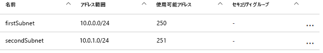
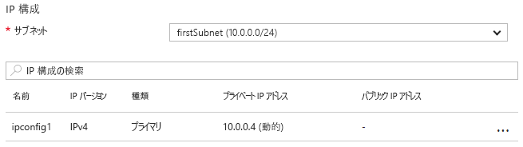

# <a name="update-a-resource-in-an-azure-resource-manager-template"></a><span data-ttu-id="1a6a0-103">Azure Resource Manager テンプレートのリソースを更新する</span><span class="sxs-lookup"><span data-stu-id="1a6a0-103">Update a resource in an Azure Resource Manager template</span></span>

<span data-ttu-id="1a6a0-104">デプロイ中にリソースの更新が必要になるシナリオはいくつかあります。</span><span class="sxs-lookup"><span data-stu-id="1a6a0-104">There are some scenarios in which you need to update a resource during a deployment.</span></span> <span data-ttu-id="1a6a0-105">このシナリオは、他の依存リソースが作成されるまで、リソースの一部のプロパティを指定できないときに発生する可能性があります。</span><span class="sxs-lookup"><span data-stu-id="1a6a0-105">You might encounter this scenario when you cannot specify all the properties for a resource until other, dependent resources are created.</span></span> <span data-ttu-id="1a6a0-106">たとえば、ロード バランサーのバックエンド プールを作成する場合、仮想マシン (VM) のネットワーク インターフェイス (NIC) をバックエンド プールに含めるために、その NIC を更新することがあります。</span><span class="sxs-lookup"><span data-stu-id="1a6a0-106">For example, if you create a backend pool for a load balancer, you might update the network interfaces (NICs) on your virtual machines (VMs) to include them in the backend pool.</span></span> <span data-ttu-id="1a6a0-107">そして、Resource Manager でデプロイ中のリソース更新がサポートされている間、エラーが発生しないように、また、デプロイが更新として確実に処理されるようにするには、テンプレートを適切に設計する必要があります。</span><span class="sxs-lookup"><span data-stu-id="1a6a0-107">And while Resource Manager supports updating resources during deployment, you must design your template correctly to avoid errors and to ensure the deployment is handled as an update.</span></span>

<span data-ttu-id="1a6a0-108">最初に、テンプレートでそのリソースを 1 回参照してリソースを作成し、その後同じ名前でそのリソースを参照し、後でそのリソースを更新します。</span><span class="sxs-lookup"><span data-stu-id="1a6a0-108">First, you must reference the resource once in the template to create it and then reference the resource by the same name to update it later.</span></span> <span data-ttu-id="1a6a0-109">しかし、テンプレート内で同じ名前のリソースが 2 つあると、Resource Manager は例外をスローします。</span><span class="sxs-lookup"><span data-stu-id="1a6a0-109">However, if two resources have the same name in a template, Resource Manager throws an exception.</span></span> <span data-ttu-id="1a6a0-110">このエラーが発生しないようにするには、更新されたリソースを、サブテンプレートとしてリンクまたは挿入されている 2 番目のテンプレートで、`Microsoft.Resources/deployments` リソース タイプを使用して指定します。</span><span class="sxs-lookup"><span data-stu-id="1a6a0-110">To avoid this error, specify the updated resource in a second template that's either linked or included as a subtemplate using the `Microsoft.Resources/deployments` resource type.</span></span>

<span data-ttu-id="1a6a0-111">次に、入れ子になっているテンプレートに、変更する既存のプロパティの名前を指定するか、追加するプロパティの新しい名前を指定する必要があります。</span><span class="sxs-lookup"><span data-stu-id="1a6a0-111">Second, you must either specify the name of the existing property to change or a new name for a property to add in the nested template.</span></span> <span data-ttu-id="1a6a0-112">元のプロパティと、そのプロパティの元の値も指定しなければなりません。</span><span class="sxs-lookup"><span data-stu-id="1a6a0-112">You must also specify the original properties and their original values.</span></span> <span data-ttu-id="1a6a0-113">元のプロパティと値を指定しないと、新しいリソースを作成する必要があるものと Resource Manager からみなされ、元のリソースは削除されます。</span><span class="sxs-lookup"><span data-stu-id="1a6a0-113">If you fail to provide the original properties and values, Resource Manager assumes you want to create a new resource and deletes the original resource.</span></span>

## <a name="example-template"></a><span data-ttu-id="1a6a0-114">テンプレートの例</span><span class="sxs-lookup"><span data-stu-id="1a6a0-114">Example template</span></span>

<span data-ttu-id="1a6a0-115">これを実証するテンプレートの例を見てみましょう。</span><span class="sxs-lookup"><span data-stu-id="1a6a0-115">Let's look at an example template that demonstrates this.</span></span> <span data-ttu-id="1a6a0-116">このテンプレートで `firstSubnet` という名前のサブネットを含む `firstVNet` という名前の仮想ネットワークをデプロイします。</span><span class="sxs-lookup"><span data-stu-id="1a6a0-116">Our template deploys a virtual network  named `firstVNet` that has one subnet named `firstSubnet`.</span></span> <span data-ttu-id="1a6a0-117">そして、`nic1` という名前の仮想ネットワーク インターフェイス (NIC) をデプロイし、サブネットに関連付けます。</span><span class="sxs-lookup"><span data-stu-id="1a6a0-117">It then deploys a virtual network interface (NIC) named `nic1` and associates it with our subnet.</span></span> <span data-ttu-id="1a6a0-118">その後、`secondSubnet` という名前の 2 番目のサブネットを追加することにより、`updateVNet` という名前のデプロイ リソースに、`firstVNet` リソースを更新する入れ子になったテンプレートが追加されます。</span><span class="sxs-lookup"><span data-stu-id="1a6a0-118">Then, a deployment resource named `updateVNet` includes a nested template that updates our `firstVNet` resource by adding a second subnet named `secondSubnet`.</span></span> 

```json
{
  "$schema": "https://schema.management.azure.com/schemas/2015-01-01/deploymentTemplate.json#",
  "contentVersion": "1.0.0.0",
  "parameters": {},
  "resources": [
      {
      "apiVersion": "2016-03-30",
      "name": "firstVNet",
      "location":"[resourceGroup().location]",
      "type": "Microsoft.Network/virtualNetworks",
      "properties": {
          "addressSpace":{"addressPrefixes": [
              "10.0.0.0/22"
          ]},
          "subnets":[              
              {
                  "name":"firstSubnet",
                  "properties":{
                    "addressPrefix":"10.0.0.0/24"
                  }
              }
            ]
      }
    },
    {
        "apiVersion": "2015-06-15",
        "type":"Microsoft.Network/networkInterfaces",
        "name":"nic1",
        "location":"[resourceGroup().location]",
        "dependsOn": [
            "firstVNet"
        ],
        "properties": {
            "ipConfigurations":[
                {
                    "name":"ipconfig1",
                    "properties": {
                        "privateIPAllocationMethod":"Dynamic",
                        "subnet": {
                            "id": "[concat(resourceId('Microsoft.Network/virtualNetworks','firstVNet'),'/subnets/firstSubnet')]"
                        }
                    }
                }
            ]
        }
    },
    {
      "apiVersion": "2015-01-01",
      "type": "Microsoft.Resources/deployments",
      "name": "updateVNet",
      "dependsOn": [
          "nic1"
      ],
      "properties": {
        "mode": "Incremental",
        "parameters": {},
        "template": {
          "$schema": "http://schema.management.azure.com/schemas/2015-01-01/deploymentTemplate.json#",
          "contentVersion": "1.0.0.0",
          "parameters": {},
          "variables": {},
          "resources": [
              {
                  "apiVersion": "2016-03-30",
                  "name": "firstVNet",
                  "location":"[resourceGroup().location]",
                  "type": "Microsoft.Network/virtualNetworks",
                  "properties": {
                      "addressSpace": "[reference('firstVNet').addressSpace]",
                      "subnets":[
                          {
                              "name":"[reference('firstVNet').subnets[0].name]",
                              "properties":{
                                  "addressPrefix":"[reference('firstVNet').subnets[0].properties.addressPrefix]"
                                  }
                          },
                          {
                              "name":"secondSubnet",
                              "properties":{
                                  "addressPrefix":"10.0.1.0/24"
                                  }
                          }
                     ]
                  }
              }
          ],
          "outputs": {}
          }
        }
    }
  ],
  "outputs": {}
}
```

<span data-ttu-id="1a6a0-119">最初に、`firstVNet` リソースのリソース オブジェクトを見てみましょう。</span><span class="sxs-lookup"><span data-stu-id="1a6a0-119">Let's take a look at the resource object for our `firstVNet` resource first.</span></span> <span data-ttu-id="1a6a0-120">入れ子になったテンプレートで `firstVNet` の設定を再度指定しますのでご注意ください。この理由は、Resource Manager では同じテンプレート内での同じデプロイ名を使用することは許可されず、入れ子になったテンプレートは別のテンプレートと見なされるためです。</span><span class="sxs-lookup"><span data-stu-id="1a6a0-120">Notice that we respecify the settings for our `firstVNet` in a nested template&mdash;this is because Resource Manager doesn't allow the same deployment name within the same template and nested templates are considered to be a different template.</span></span> <span data-ttu-id="1a6a0-121">`firstSubnet` リソースに値を再度指定することにより、リソース マネージャーは既存のリソースを削除する代わりに更新し、再度デプロイします。</span><span class="sxs-lookup"><span data-stu-id="1a6a0-121">By respecifying our values for our `firstSubnet` resource, we are telling Resource Manager to update the existing resource instead of deleting it and redeploying it.</span></span> <span data-ttu-id="1a6a0-122">最後に、`secondSubnet` の新しい設定は、この更新中に選択されます。</span><span class="sxs-lookup"><span data-stu-id="1a6a0-122">Finally, our new settings for `secondSubnet` are picked up during this update.</span></span>

## <a name="try-the-template"></a><span data-ttu-id="1a6a0-123">テンプレートを試行する</span><span class="sxs-lookup"><span data-stu-id="1a6a0-123">Try the template</span></span>

<span data-ttu-id="1a6a0-124">このテンプレートを実験する場合は、次の手順に従います。</span><span class="sxs-lookup"><span data-stu-id="1a6a0-124">If you would like to experiment with this template, follow these steps:</span></span>

1.  <span data-ttu-id="1a6a0-125">Azure Portal に移動し、**+** アイコンを選択して、**[テンプレートのデプロイ]** のリソースの種類を検索しそれを選択します。</span><span class="sxs-lookup"><span data-stu-id="1a6a0-125">Go to the Azure portal, select the **+** icon, and search for the **template deployment** resource type, and select it.</span></span>
2.  <span data-ttu-id="1a6a0-126">**[テンプレートのデプロイ]** ページに移動して、**[作成]** を選択します。</span><span class="sxs-lookup"><span data-stu-id="1a6a0-126">Navigate to the **template deployment** page, select the **create** button.</span></span> <span data-ttu-id="1a6a0-127">このボタンにより、**[カスタム デプロイ]** ブレードが開きます。</span><span class="sxs-lookup"><span data-stu-id="1a6a0-127">This button opens the **custom deployment** blade.</span></span>
3.  <span data-ttu-id="1a6a0-128">**[編集]** アイコンを選択します。</span><span class="sxs-lookup"><span data-stu-id="1a6a0-128">Select the **edit** icon.</span></span>
4.  <span data-ttu-id="1a6a0-129">空のテンプレートを削除します。</span><span class="sxs-lookup"><span data-stu-id="1a6a0-129">Delete the empty template.</span></span>
5.  <span data-ttu-id="1a6a0-130">サンプル テンプレートをコピーして、右のウィンドウに貼り付けます。</span><span class="sxs-lookup"><span data-stu-id="1a6a0-130">Copy and paste the sample template into the right pane.</span></span>
6.  <span data-ttu-id="1a6a0-131">**[保存]** を選択します。</span><span class="sxs-lookup"><span data-stu-id="1a6a0-131">Select the **save** button.</span></span>
7.  <span data-ttu-id="1a6a0-132">**[カスタム デプロイ]** ウィンドウに戻りますが、今回はドロップダウン ボックスがいくつか表示されています。</span><span class="sxs-lookup"><span data-stu-id="1a6a0-132">You return to the **custom deployment** pane, but this time there are some drop-down list boxes.</span></span> <span data-ttu-id="1a6a0-133">サブスクリプションを選択し、新しいリソース グループを作成するか、既存のリソース グループを使用して、場所を選択します。</span><span class="sxs-lookup"><span data-stu-id="1a6a0-133">Select your subscription, either create new or use existing resource group, and select a location.</span></span> <span data-ttu-id="1a6a0-134">使用条件を確認し、**[同意する]** を選択します。</span><span class="sxs-lookup"><span data-stu-id="1a6a0-134">Review the terms and conditions, then select the **I agree** button.</span></span>
8.  <span data-ttu-id="1a6a0-135">**[購入]** を選択します。</span><span class="sxs-lookup"><span data-stu-id="1a6a0-135">Select the **purchase** button.</span></span>

<span data-ttu-id="1a6a0-136">デプロイが完了したら、ポータルで指定したリソース グループを開きます。</span><span class="sxs-lookup"><span data-stu-id="1a6a0-136">Once deployment has finished, open the resource group you specified in the portal.</span></span> <span data-ttu-id="1a6a0-137">`firstVNet` という名前の仮想ネットワークと、`nic1` という名前の NIC が表示されます。</span><span class="sxs-lookup"><span data-stu-id="1a6a0-137">You see a virtual network named `firstVNet` and a NIC named `nic1`.</span></span> <span data-ttu-id="1a6a0-138">`firstVNet`、`subnets` の順にクリックします。</span><span class="sxs-lookup"><span data-stu-id="1a6a0-138">Click `firstVNet`, then click `subnets`.</span></span> <span data-ttu-id="1a6a0-139">最初に作成された `firstSubnet` のほか、`updateVNet` リソースで追加された `secondSubnet` が表示されます。</span><span class="sxs-lookup"><span data-stu-id="1a6a0-139">You see the `firstSubnet` that was originally created, and you see the `secondSubnet` that was added in the `updateVNet` resource.</span></span> 



<span data-ttu-id="1a6a0-141">次に、リソース グループに戻り、`nic1`、`IP configurations` の順にクリックします。</span><span class="sxs-lookup"><span data-stu-id="1a6a0-141">Then, go back to the resource group and click `nic1` then click `IP configurations`.</span></span> <span data-ttu-id="1a6a0-142">`IP configurations` セクションで、`subnet` が `firstSubnet (10.0.0.0/24)` に設定されています。</span><span class="sxs-lookup"><span data-stu-id="1a6a0-142">In the `IP configurations` section, the `subnet` is set to `firstSubnet (10.0.0.0/24)`.</span></span> 



<span data-ttu-id="1a6a0-144">元の `firstVNet` が、再作成ではなく更新されています。</span><span class="sxs-lookup"><span data-stu-id="1a6a0-144">The original `firstVNet` has been updated instead of recreated.</span></span> <span data-ttu-id="1a6a0-145">`firstVNet` が再作成されているとしたら、`nic1` は `firstVNet` に関連付けられていません。</span><span class="sxs-lookup"><span data-stu-id="1a6a0-145">If `firstVNet` had been recreated, `nic1` would not be associated with `firstVNet`.</span></span>

## <a name="next-steps"></a><span data-ttu-id="1a6a0-146">次のステップ</span><span class="sxs-lookup"><span data-stu-id="1a6a0-146">Next steps</span></span>

* <span data-ttu-id="1a6a0-147">この手法は、[テンプレート構成ブロックのプロジェクト](https://github.com/mspnp/template-building-blocks)と [Azure 参照アーキテクチャ](/azure/architecture/reference-architectures/)で実装されています。</span><span class="sxs-lookup"><span data-stu-id="1a6a0-147">This technique is implemented in the [template building blocks project](https://github.com/mspnp/template-building-blocks) and the [Azure reference architectures](/azure/architecture/reference-architectures/).</span></span> <span data-ttu-id="1a6a0-148">これらを使用して、独自のアーキテクチャを作成したり、この参照アーキテクチャのいずれかをデプロイしたりできます。</span><span class="sxs-lookup"><span data-stu-id="1a6a0-148">You can use these to create your own architecture or deploy one of our reference architectures.</span></span>
