# Azure でのリソース アクセス管理についてUnderstanding resource access management in Azure

[クラウド リソース ガバナンス](governance-explainer.md)に関するページでは、ガバナンスとは、組織の目標と要件を満たすために、Azure リソースの使用を継続的に管理、監視、および監査するプロセスを意味することを説明しました。In [what is resource governance?](governance-explainer.md), you learned that governance refers to the ongoing process of managing, monitoring, and auditing the use of Azure resources to meet the goals and requirements of your organization. ガバナンス モデルを設計する方法について確認する前に、Azure のリソース アクセス管理の制御について理解することが重要です。Before you move on to learn how to design a governance model, it's important to understand the resource access management controls in Azure. これらのリソース アクセス管理の制御の構成により、ご自身のガバナンス モデルの基礎が形成されます。The configuration of these resource access management controls forms the basis of your governance model.

まずは、Azure でリソースがどのようにデプロイされるかを詳しく見ていきましょう。Let's begin by taking a closer look at how are resources are deployed in Azure. 

## Azure リソースとはWhat is an Azure resource?

Azure では、**リソース**という用語は、Azure によって管理されるエンティティを指します。In Azure, the term **resource** refers to an entity managed by Azure. たとえば、仮想マシン、仮想ネットワーク、およびストレージ アカウントはすべて、Azure リソースと呼ばれます。For example, virtual machines, virtual networks, and storage accounts are all referred to as Azure resources.

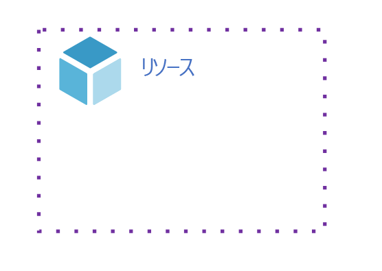   
*図 1: リソース。**Figure 1. A resource.*

## Azure リソース グループとはWhat is an Azure resource group?

Azure の各リソースは、[リソース グループ](/azure/azure-resource-manager/resource-group-overview#resource-groups)に属している必要があります。Each resource in Azure must belong to a [resource group](/azure/azure-resource-manager/resource-group-overview#resource-groups). リソース グループは、複数のリソースを単一のエンティティとして管理できるようにまとめる、論理コンストラクトに過ぎません。A resource group is simply a logical construct that groups multiple resources together so they can be managed as a single entity. たとえば、[n 層アプリケーション](/azure/architecture/guide/architecture-styles/n-tier)のリソースなど、似たようなライフサイクルを共有するリソースを、グループとして作成または削除できます。For example, resources that share a similar lifecycle, such as the resources for an [n-tier application](/azure/architecture/guide/architecture-styles/n-tier) may be created or deleted as a group. 

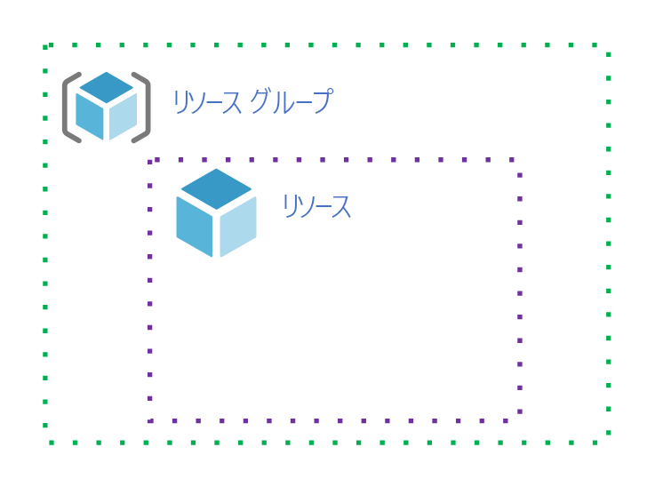   
*図 2: リソース グループにはリソースが含まれる。**Figure 2. A resource group contains a resource.* 

リソース グループ、およびそのリソース グループに含まれているリソースは、Azure **サブスクリプション**に関連付けられます。Resource groups and the resources they contain are associated with an Azure **subscription**. 

## Azure サブスクリプションとはWhat is an Azure subscription?

Azure サブスクリプションは、リソース グループとそのリソースをまとめる論理コンストラクトであるという点では、リソース グループに似ています。An Azure subscription is similar to a resource group in that it's a logical construct that groups together resource groups and their resources. ただし、Azure サブスクリプションも、Azure Resource Manager によって使用される制御に関連付けられています。However, an Azure subscription is also associated with the controls used by Azure resource manager. これはどういう意味でしょうか。What does this mean? Azure サブスクリプションと Azure Resource Manager の関係について確認するために、Azure Resource Manager を詳しく見てみましょう。Let's take a closer look at Azure resource manager to learn about the relationship between it and an Azure subscription.

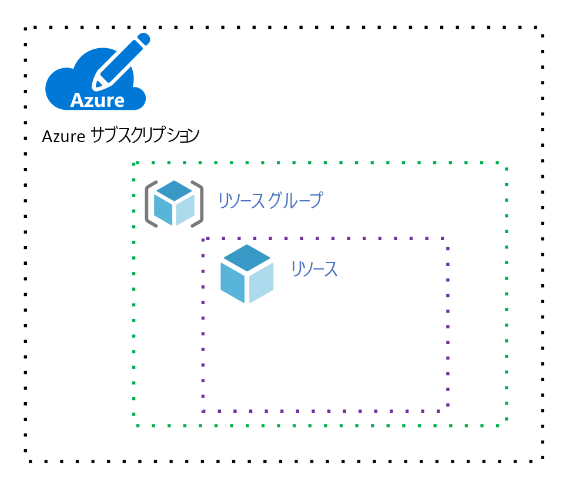   
*図 3: Azure サブスクリプション。**Figure 3. An Azure subscription.*

## Azure Resource Manager とはWhat is Azure resource manager?

[Azure のしくみ](azure-explainer.md)に関するページでは、Azure には、Azure のすべての機能を調整する多くのサービスを備えた "フロントエンド" が含まれることを説明しました。In [how does Azure work?](azure-explainer.md) you learned that Azure includes a "front end" with many services that orchestrate all the functions of Azure. これらのサービスの 1 つが [Azure Resource Manager ](/azure/azure-resource-manager/)で、このサービスは、リソースを管理するために、クライアントによって使用される RESTful API をホストしています。One of these services is [Azure resource manager](/azure/azure-resource-manager/), and this service hosts the RESTful API used by clients to manage resources. 

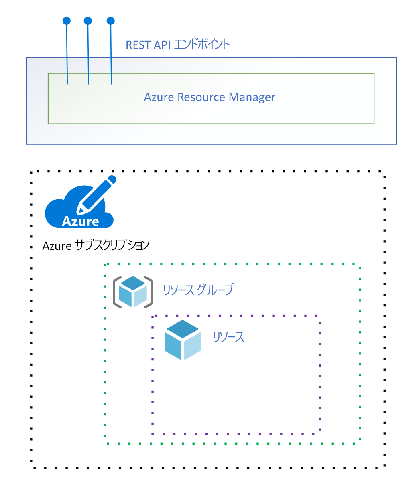   
*図 4: Azure Resource Manager。**Figure 4. Azure resource manager.*

次の図は、[Powershell](/powershell/azure/overview)、[Azure portal](https://portal.azure.com)、および [Azure コマンド ライン インターフェイス (CLI)](/cli/azure) の 3 つのクライアントを示しています。The following figure shows three clients: [Powershell](/powershell/azure/overview),[the Azure portal](https://portal.azure.com), and the [Azure command line interface (CLI)](/cli/azure):

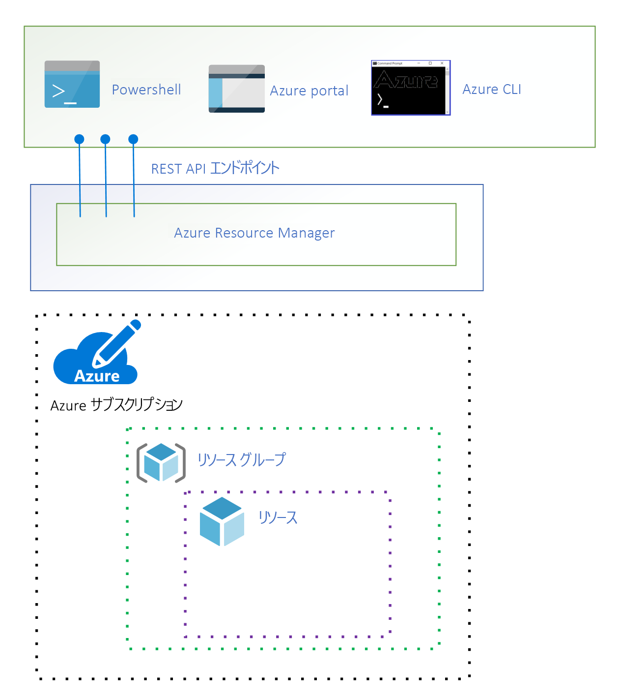   
*図 5: Azure クライアントが Azure Resource Manager RESTful API に接続する。**Figure 5. Azure clients connect to the Azure resource manager RESTful API.*

これらのクライアントは、RESTful API を使用して Azure Resource Manager に接続しますが、Azure Resource Manager には、リソースを直接管理する機能が含まれていません。While these clients connect to Azure resource manager using the RESTful API, Azure resource manager does not include functionality to manage resources directly. 代わりに、Azure ではリソースの種類のほとんどに、独自の[**リソース プロバイダー**](/azure/azure-resource-manager/resource-group-overview#terminology)があります。Rather, most resource types in Azure have their own [**resource provider**](/azure/azure-resource-manager/resource-group-overview#terminology). 

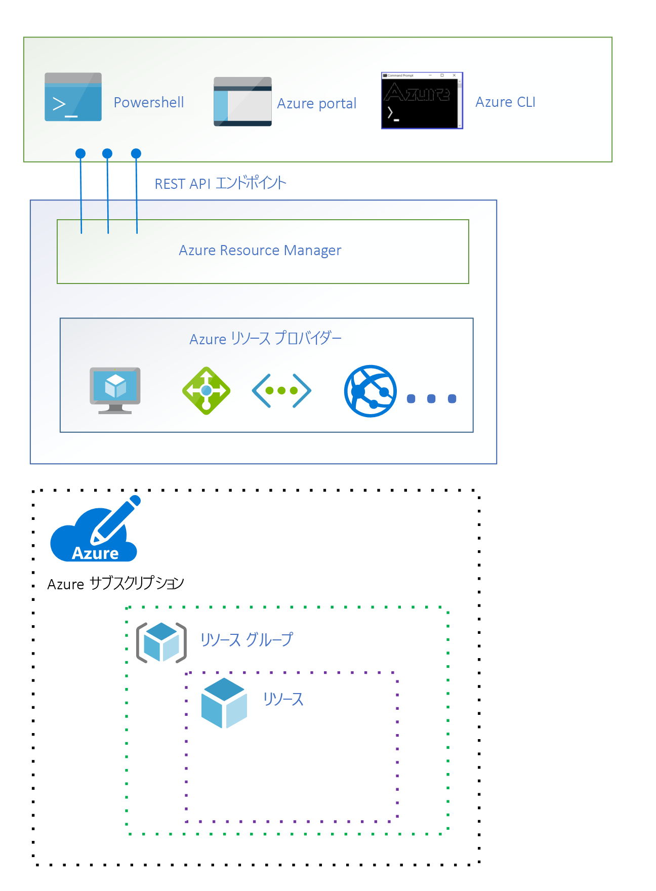   
*図 6: Azure リソース プロバイダー。**Figure 6. Azure resource providers.*

クライアントが特定のリソースを管理するように要求すると、Azure Resource Manager は要求を完了するために、そのリソースの種類のリソース プロバイダーに接続します。When a client makes a request to manage a specific resource, Azure resource manager connects to the resource provider for that resource type to complete the request. たとえば、クライアントが仮想マシン リソースを管理するように要求した場合、Azure Resource Manager は、**Microsoft.compute** リソース プロバイダーに接続します。For example, if a client makes a request to manage a virtual machine resource, Azure resource manager connects to the **Microsoft.compute** resource provider. 

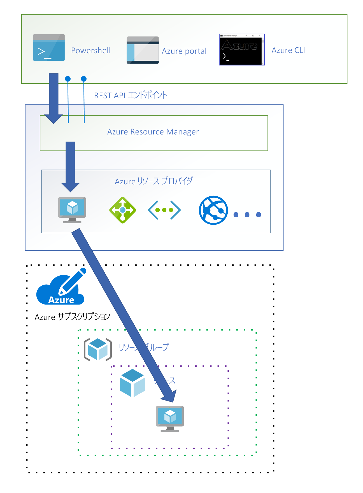   
*図 7: Azure Resource Manager が、クライアント要求で指定されたリソースを管理する **Microsoft.compute** リソース プロバイダーに接続する。**Figure 7. Azure resource manager connects to the **Microsoft.compute** resource provider to manage the resource specified in the client request.*

Azure Resource Manager が、仮想マシン リソースを管理するために、サブスクリプションとリソース グループの両方の識別子を指定するようクライアントに要求していることに注意してください。Notice that Azure resource manager required the client to specify an identifier for both the subscription and the resource group in order to manage the virtual machine resource. 

Azure Resource Manager のしくみがわかったので、Azure サブスクリプションが、Azure Resource Manager によって使用される制御にどのように関連付けられるかという説明に戻りましょう。Now that you have an understanding of how Azure resource manager works, let's return to our discussion of how an Azure subscription is associated with the controls used by Azure resource manager. Azure Resource Manager によってリソースの管理要求が実行される前に、一連の制御がチェックされます。Before any resource management request can be executed by Azure resource manager, a set of controls are checked. 

最初の制御は、要求が必ず検証済みユーザーによって行われていることです。また、ユーザー ID 機能を提供するために、Azure Resource Manager は [Azure Active Directory (Azure AD)](/azure/active-directory/) との間に信頼関係を確保します。The first control is that a request must be made by a validated user, and Azure resource manager has a trusted relationship with [Azure Active Directory (Azure AD)](/azure/active-directory/) to provide user identity functionality.

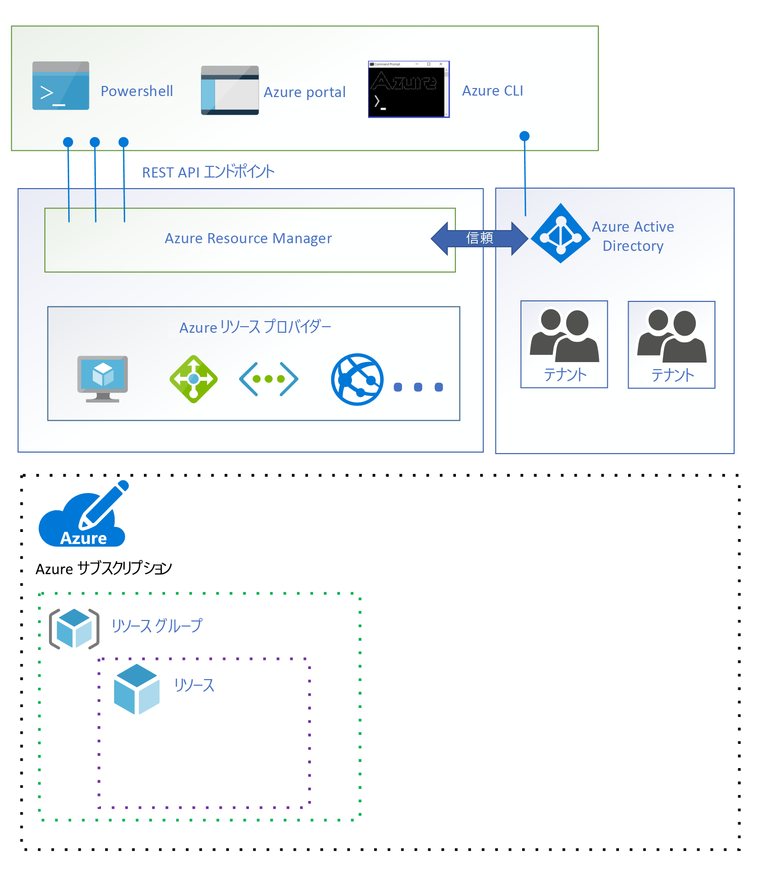   
*図 8: Azure Active Directory。**Figure 8. Azure Active Directory.*

Azure AD では、ユーザーが**テナント**にセグメント化されています。In Azure AD, users are segmented into **tenants**. テナントとは、通常は組織に関連付けられる Azure AD の安全な専用インスタンスを表す論理コンストラクターです。A tenant is a logical construct that represents a secure, dedicated instance of Azure AD typically associated with an organization. 各サブスクリプションが Azure AD テナントと関連付けられています。Each subscription is associated with an Azure AD tenant.

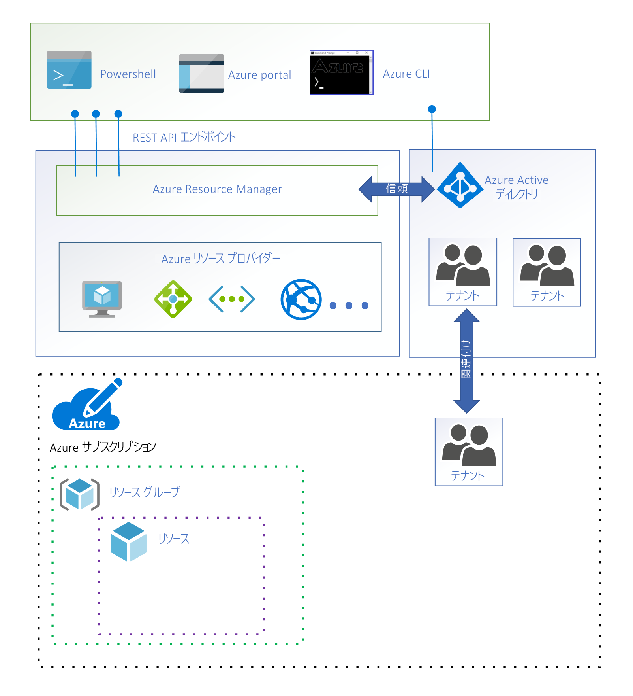   
*図 9: サブスクリプションと関連付けられている Azure AD テナント。**Figure 9. An Azure AD tenant associated with a subscription.*

特定のサブスクリプションでリソースを管理するためのクライアント要求ごとに、関連付けられている Azure AD テナント内にユーザーがアカウントを持っている必要があります。Each client request to manage a resource in a particular subscription requires that the user has an account in the associated Azure AD tenant. 

次の制御では、要求を行うための十分なアクセス許可がユーザーにあることが確認されます。The next control is a check that the user has sufficient permission to make the request. [ロールベースのアクセス制御 (RBAC)](/azure/role-based-access-control/) を使用して、アクセス許可がユーザーに割り当てられます。Permissions are assigned to users using [role-based access control (RBAC)](/azure/role-based-access-control/).

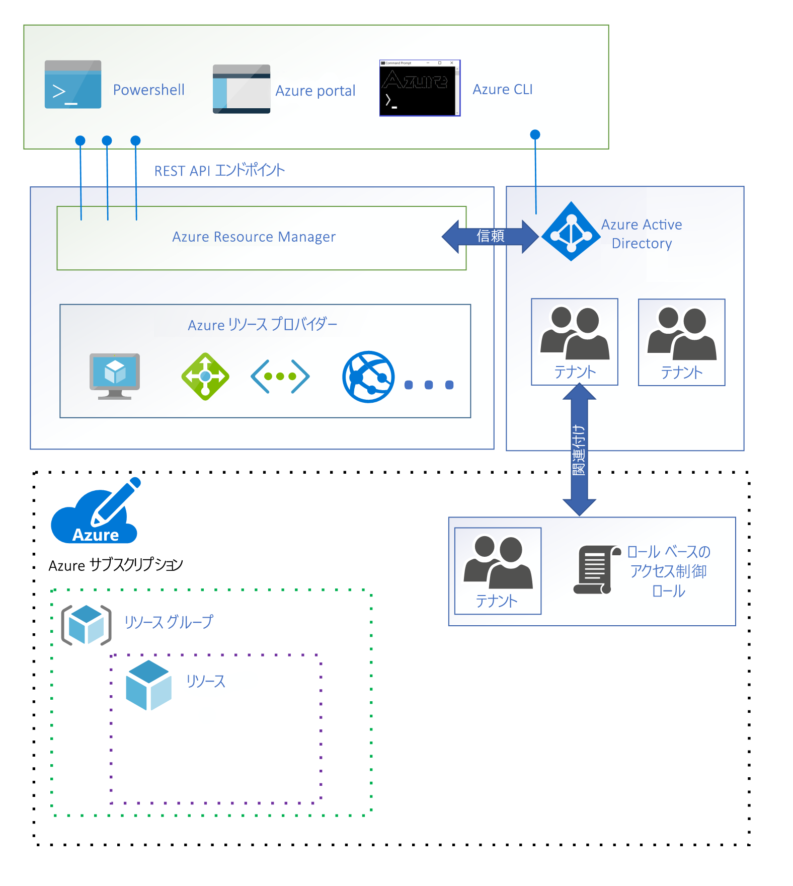   
*図 10: テナントの各ユーザーに 1 つ以上の RBAC ロールが割り当てらている。**Figure 10. Each user in the tenant is assigned one or more RBAC roles.*

RBAC ロールでは、特定のリソースに対してユーザーが適用できる一連のアクセス許可が指定されます。An RBAC role specifies a set of permissions a user may take on a specific resource. ロールがユーザーに割り当てられると、これらのアクセス許可が適用されます。When the role is assigned to user, those permissions are applied. たとえば、[組み込み**所有者**ロール](/azure/role-based-access-control/built-in-roles#owner)を使用すると、ユーザーはリソースに対して任意のアクションを実行できます。For example, the [built-in **owner** role](/azure/role-based-access-control/built-in-roles#owner) allows a user to perform any action on a resource.

次の制御は、[Azure リソース ポリシー](/azure/azure-policy/)に適うように指定されている設定で、要求が許可されることのチェックです。The next control is a check that the request is allowed under the settings specified for [Azure resource policy](/azure/azure-policy/). Azure リソース ポリシーでは、特定のリソースに対して許可される操作が指定されます。Azure resource policies specify the operations allowed for a specific resource. たとえば、Azure リソース ポリシーを使用して、ユーザーが特定の種類の仮想マシンのみデプロイできるように指定できます。For example, an Azure resource policy can specify that users are only allowed to deploy a specific type of virtual machine.

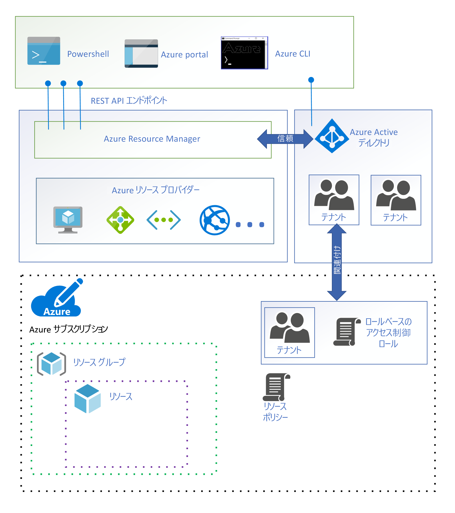   
*図 11: Azure リソース ポリシー。**Figure 11. Azure resource policy.*

次の制御は、要求が [Azure サブスクリプションの制限](/azure/azure-subscription-service-limits)を超えていないことのチェックです。The next control is a check that the request does not exceed an [Azure subscription limit](/azure/azure-subscription-service-limits). たとえば、サブスクリプションあたりのリソース グループ数は、980 グループに制限されています。For example, each subscription has a limit of 980 resource groups per subscription. 追加のリソース グループをデプロイする要求を受け取ったときに、制限に達している場合、その要求は拒否されます。If a request is received to deploy an additional resource groups once the limit has been reached, it is denied.

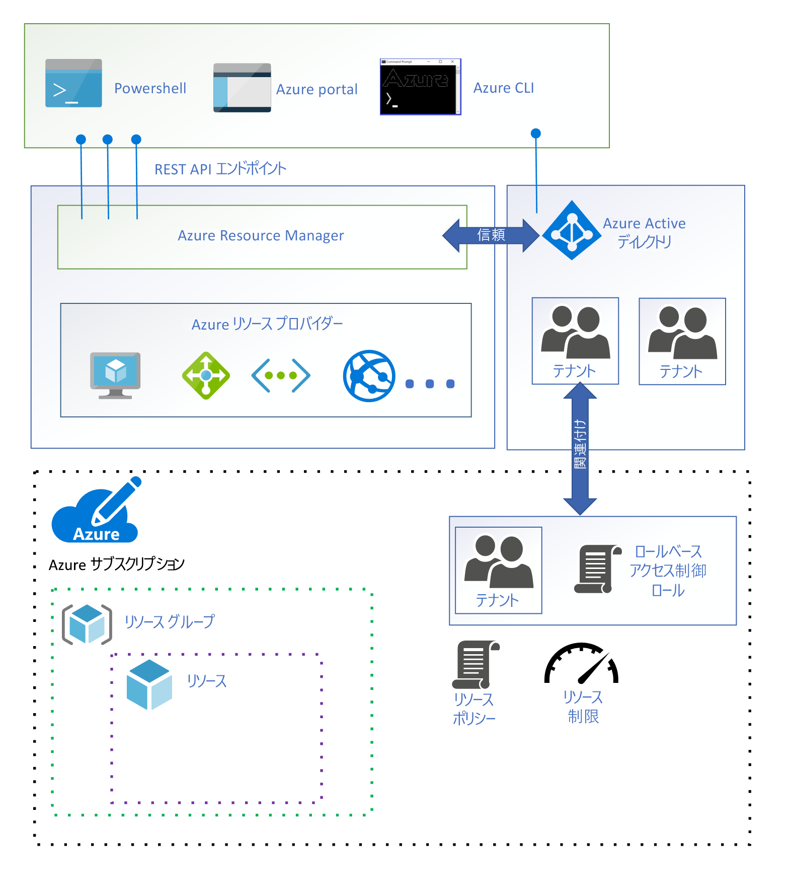   
*図 12: Azure リソース制限。**Figure 12. Azure resource limits.* 

最後の制御は、要求が、サブスクリプションに関連付けられている財務コミットメント内に収まっていることのチェックです。The final control is a check that the request is within the financial commitment associated with the subscription. たとえば、仮想マシンのデプロイ要求の場合は、サブスクリプションに十分な支払い情報があることが Azure Resource Manager によって確認されます。For example, if the request is to deploy a virtual machine, Azure resource manager verifies that the subscription has sufficient payment information.

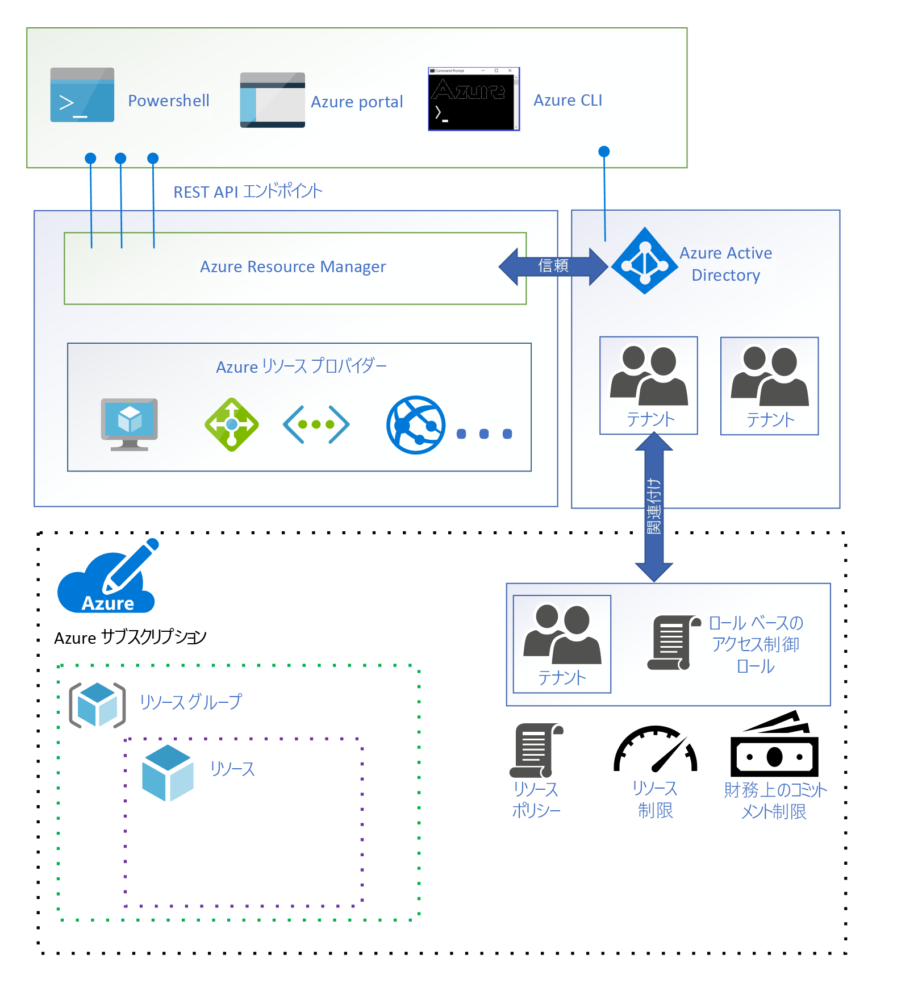   
*図 13: 財務コミットメントはサブスクリプションに関連付けられています。**Figure 13. A financial commitment is associated with a subscription.*

# まとめSummary

この記事では、Azure Resource Manager を使用して、リソース アクセスが Azure でどのように管理されるかを説明しました。In this article, you learned about how resource access is managed in Azure using Azure resource manager.

# 次の手順Next steps

Azure でのリソース アクセスの管理方法については理解できました。次は、これらのサービスを使用して、[ガバナンス モデルを設計する](governance-how-to.md)方法を説明します。Now that you understand how resource access is managed in Azure, move on to learn how to [design a governance model](governance-how-to.md) using these services.