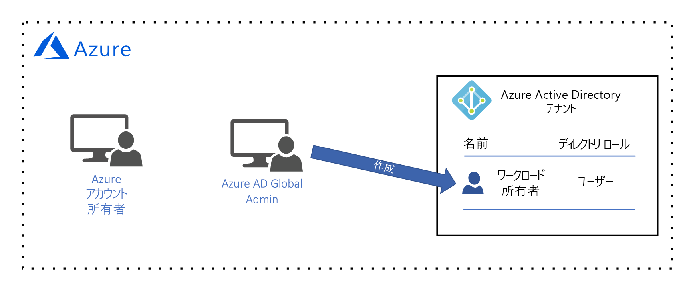
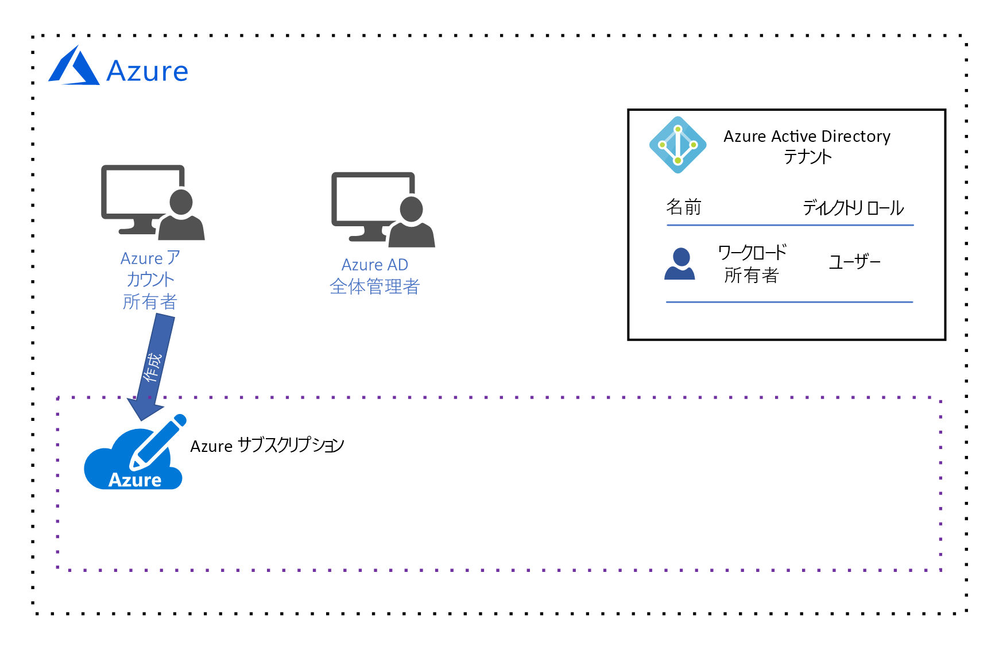
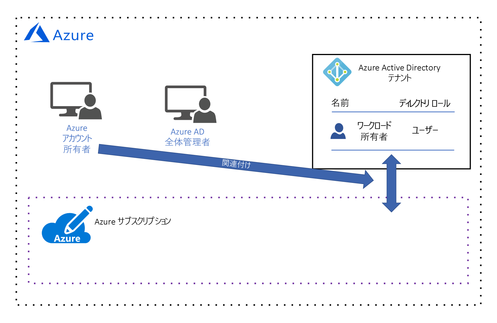
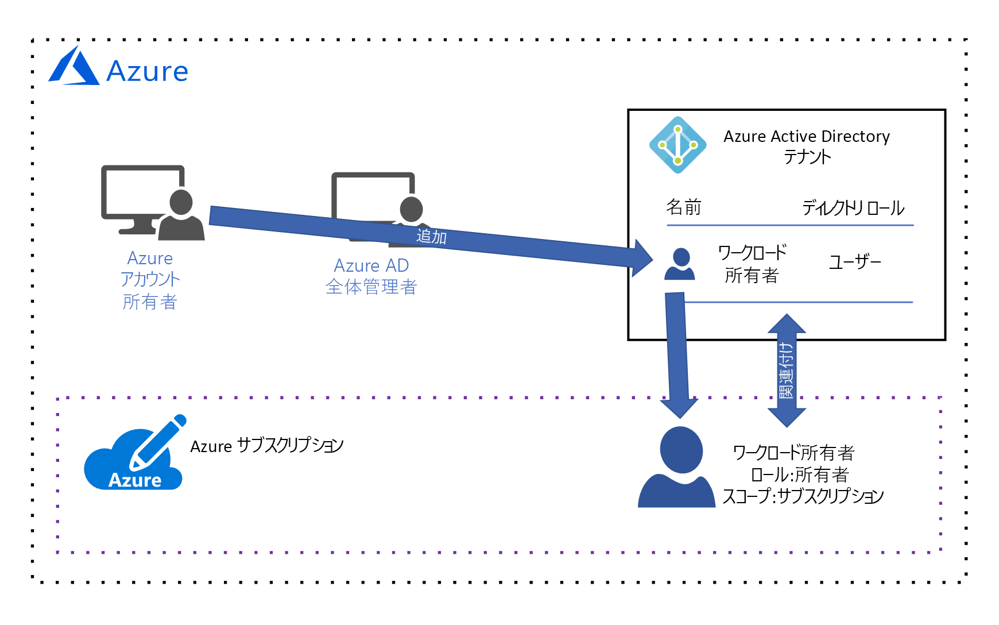
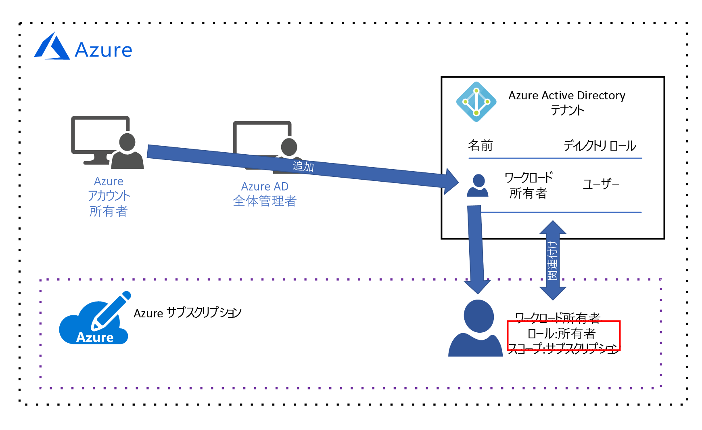
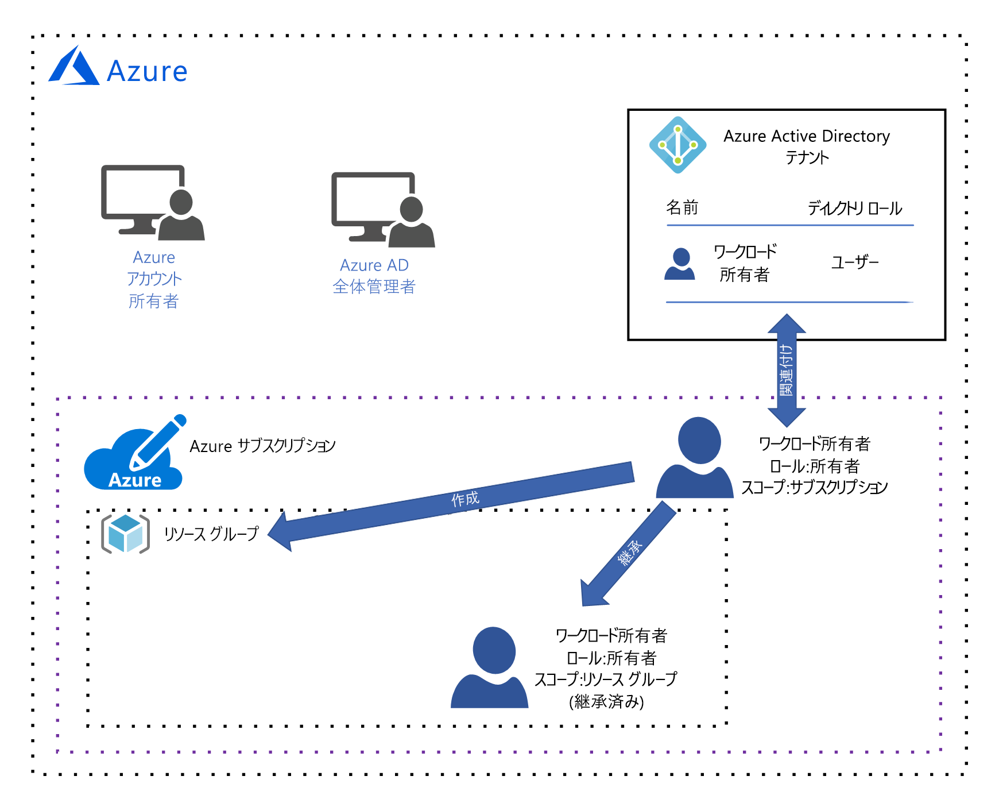
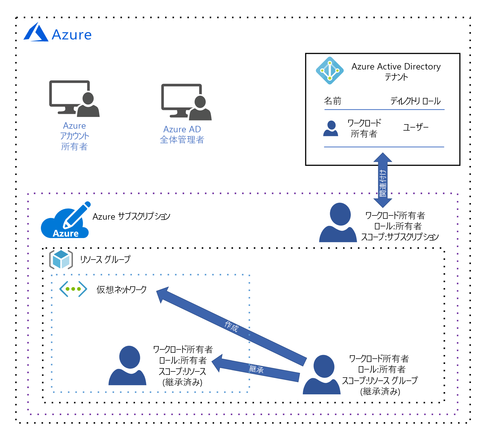

# Azure ガバナンス設計ガイド

この設計ガイドは、ご自身の組織の "*中央 のIT*" ペルソナを対象としています。 "*中央 の IT*" は、組織のクラウド ガバナンス アーキテクチャの設計および実装を担当します。 [クラウド リソース ガバナンス](governance-explainer.md)に関するページで説明したように、ガバナンスとは、組織の目標と要件を満たすために、Azure リソースの使用を継続的に管理、監視、および監査するプロセスを意味します。

このガイダンスの目的は、一連の仮想的ガバナンス目標および要件を確認することで、組織のガバナンス アーキテクチャの設計プロセスへの理解を助けることにあります。 次に、それらを満たすように Azure のガバナンス ツールを構成する方法について説明します。 

基本導入ステージの目標は、シンプルなワークロードを Azure にデプロイすることです。 これには、次の要件が伴います。
* シンプルなワークロードのデプロイと保守を担当する 1 人の**ワークロード所有者**の ID を管理する。 ワークロード所有者には、リソースの作成、読み取り、更新、および削除のアクセス許可、および ID 管理システムで他のユーザーにこれらの特権を委任するアクセス許可が必要です。
* シンプルなワークロードのすべてのリソースを 1 つの管理単位として管理する。

## Azure のライセンス

ガバナンス モデルの設計を開始する前に、Azure のライセンスの取得方法を理解することが重要です。 ご自身の Azure ライセンスに関連付けられている管理者アカウントには、ご使用の Azure リソースすべてに対する最高レベルのアクセス権が付与されているためです。 これらの管理者アカウントにより、ご自身のガバナンス モデルの基礎が形成されます。  

> [!NOTE]
> お客様の組織の既存の[マイクロソフトエンタープライズ契約](https://www.microsoft.com/en-us/licensing/licensing-programs/enterprise.aspx)に Azure が含まれていない場合は、前払いによる年額コミットメントを行うことで Azure を追加できます。 詳細については、「[Azure のエンタープライズ向けライセンス](https://azure.microsoft.com/pricing/enterprise-agreement/)」を参照してください。 

Azure がご自身の組織のエンタープライズ契約に追加されたとき、組織は **Azure アカウント**を作成するよう求められました。 アカウントの作成プロセス中に、**Azure アカウント所有者**が、Azure Active Directory (Azure AD) テナントおよび**グローバル管理者**アカウントと共に作成されています。 Azure AD テナントとは、Azure AD の安全な専用インスタンスを表す論理コンストラクトです。

*図 1. Azure アカウント マネージャーと Azure AD グローバル管理者が含まれる Azure アカウント。*

## ID 管理

Azure は、[Azure AD](/azure/active-directory) のみを信頼してユーザーを認証し、リソースへのユーザー アクセスを承認します。したがって、Azure AD は ID 管理システムです。 Azure AD グローバル管理者には最高レベルのアクセス許可が付与されており、ユーザーの作成やアクセス許可の割り当てなど、ID に関連するすべてのアクションを実行できます。 

ここでの要件は、シンプルなワークロードのデプロイと保守を担当する 1 人の**ワークロード所有者**の ID を管理することです。 ワークロード所有者には、リソースの作成、読み取り、更新、および削除のアクセス許可、および ID 管理システムで他のユーザーにこれらの特権を委任するアクセス許可が必要です。

Azure AD のグローバル管理者が、**ワークロード所有者**を表す**ワークロード所有者**アカウントを作成します。

*図 2. Azure AD のグローバル管理者がワークロード所有者のユーザー アカウントを作成する。*

このユーザーが**サブスクリプション**に追加されるまで、リソースのアクセス許可を割り当てることができません。そこで、次の 2 つのセクションでは、これを行います。 

## リソース管理のスコープ

組織によってデプロイされるリソースの数が増えると、それらのリソースを管理する複雑さも増します。 Azure では論理コンテナー階層が実装されており、これにより、組織がさまざまな細分性レベルのグループ (**スコープ**) でリソースを管理できます。 

最上位レベルのリソース管理のスコープは**サブスクリプション** レベルです。 サブスクリプションは、Azure **アカウント所有者**によって作成されます。このユーザーは財務コミットメントを確立し、そのサブスクリプションに関連付けられているすべての Azure リソースに対する支払いを行う責任があります。

*図 3. Azure アカウント所有者がサブスクリプションを作成する。*

サブスクリプションが作成されると、Azure **アカウント所有者**は、Azure AD テナントをサブスクリプションに関連付けます。この Azure AD テナントは、ユーザーの認証と承認に使用されます。

*図 4. Azure アカウント所有者が Azure AD テナントをサブスクリプションに関連付ける。*

お気付きかもしれませんが、現在サブスクリプションにはユーザーが関連付けられていません。つまり、リソースを管理するアクセス許可は、誰にも付与されていません。 実際には、**アカウント所有者**はサブスクリプションの所有者であり、サブスクリプションのリソースに対して任意のアクションを実行するアクセス許可を持っています。 しかし、実のところ、**アカウント所有者**は、組織の財務担当者である可能性が高く、リソースの作成、読み取り、更新、および削除を担当しません。これらのタスクは**ワークロード所有者**によって実行されます。 したがって、**ワークロード所有者**をサブスクリプションに追加して、アクセス許可を割り当てる必要があります。

**アカウント所有者**は、現時点で**ワークロード所有者**をサブスクリプションに追加するアクセス許可を持つ唯一のユーザーです。したがって、アカウント所有者が、**ワークロード所有者**をサブスクリプションに追加します。

*図 5. Azure アカウント所有者がワークロード所有者をサブスクリプションに追加する。*

Azure **アカウント所有者**は、[ロールベースのアクセス制御 (RBAC)](/azure/role-based-access-control/) ロールを割り当てることで、**ワークロード所有者**にアクセス許可を付与します。 RBAC ロールにより、個々のリソースの種類または一連のリソースの種類に対して**ワークロード所有者**が持つ一連のアクセス許可が指定されます。

この例では、**アカウント所有者**は、[組み込みの**所有者**ロール](/azure/role-based-access-control/built-in-roles#owner)を割り当てました。 

*図 6. **ワークロード所有者**に組み込みの所有者ロールが割り当てられる。*

組み込みの**所有者**ロールによって、サブスクリプション スコープで、すべてのアクセス許可が**ワークロード所有者**に付与されます。 

> [!IMPORTANT]
> Azure **アカウント所有者**は、サブスクリプションに関連付けられている財務コミットメントの責任を負いますが、**ワークロード所有者**には、同じアクセス許可が付与されています。 **アカウント所有者**は、**ワークロード所有者**がサブスクリプション予算内でリソースをデプロイしていることを信頼する必要があります。

次の管理スコープ レベルは**リソース グループ** レベルです。 リソース グループは、リソースの論理コンテナーです。 リソース グループ レベルで適用された操作は、グループ内のすべてのリソースに適用されます。 さらに、各ユーザーのアクセス許可は、そのスコープで明示的に変更された場合を除き、上のレベルから継承されることにも注意してください。 

これを確認するために、**ワークロード所有者**がリソース グループを作成するとき、何が起こるかを見てみましょう。

*図 7. ワークロード所有者がリソース グループを作成し、リソース グループ スコープで組み込みの所有者ロールを継承する。*

この場合も、組み込みの**所有者**ロールによって、リソース グループ スコープで、すべてのアクセス許可が**ワークロード所有者**に付与されます。 先ほど説明したように、このロールはサブスクリプション レベルから継承されます。 このスコープで別のロールがこのユーザーに割り当てられると、そのロールはこのスコープにのみ適用されます。

最下位レベルの管理スコープは**リソース** レベルです。 リソース レベルで適用された操作は、リソース自体にのみ適用されます。 また、前と同様に、リソース レベルのアクセス許可は、リソース グループ スコープから継承されます。 たとえば、**ワークロード所有者**が[仮想ネットワーク](/azure/virtual-network/virtual-networks-overview)をリソース グループにデプロイするとどうなるかを見てみましょう。

*図 8. ワークロード所有者がリソースを作成し、リソース スコープで組み込みの所有者ロールを継承する。*

**ワークロード所有者**は、リソース スコープで所有者ロールを継承します。つまり、ワークロード所有者には、仮想ネットワークに対するすべてのアクセス許可が付与されます。 

## まとめ

この記事で学習した内容は次のとおりです。

* Azure は、ID 管理に関して Azure AD のみを信頼します。
* サブスクリプションはリソース管理の最上位スコープであり、各サブスクリプションが Azure AD テナントに関連付けられています。 関連付けられている Azure AD テナントのユーザーのみが、サブスクリプションのリソースにアクセスできます。
* リソース管理スコープには、サブスクリプション、リソース グループ、リソースの 3 つのレベルがあります。 RBAC ロールを使用して、各スコープでアクセス許可が割り当てられます。 RBAC ロールは上位スコープから下位スコープに継承されます。

## 次の手順

このガバナンス モデルの実装方法については、[基本導入ステージの概要](overview.md)に関するページに戻ってください。 次に、ワークロードの種類を選択し、それをデプロイする方法について学習します。