# ガバナンス設計ガイド: 複数チーム向けの Azure での新規開発Governance design guide: new development in Azure for multiple teams

このガイドの目的は、Azure でのリソース ガバナンス モデルの設計プロセスについて説明することです。The goal of this guidance is to help you learn the process for designing a resource governance model in Azure.  一連のガバナンス要件を例として挙げて、これらの要件に対応する実装サンプルをいくつか紹介します。We'll look at a set of hypothetical governance requirements, then go through several example implementations that satisfy those requirements. 

要件を次に示します。Our requirements are:
* Azure でさまざまなリソース アクセス要件を持つ複数のチームの ID 管理。Identity management for multiple teams with different resource access requirements in Azure. ID 管理システムには、次のユーザーの ID が格納されています。The identity management system stores the identity of the following users:
  1. **サブスクリプション**の所有を担当する組織内の個人。The individual in our organization responsible for ownership of **subscriptions**.
  2. オンプレミス ネットワークを Azure 仮想ネットワークに接続するときに使用される**共有インフラストラクチャ リソース**を担当する組織内の個人。The individual in our organization responsible for the **shared infrastructure resources** used to connect our on-premises network to an Azure virtual network. 
  3. **ワークロード**の管理を担当する組織内の個人 (2 人)。Two individuals in our organization responsible for managing a **workload**. 
* 複数の**環境**のサポート。Support for multiple **environments**. 既に説明したように、ここで環境とは、同様の管理およびセキュリテの要件を持つリソースの論理的なグループのことです。As you learned earlier, an environment is a logical grouping of resources with similar management and security requirements. ここでは 3 つの環境が必要です。We require three environments:
  1. **共有インフラストラクチャ環境**: 他の環境のワークロードによって共有されるリソースが含まれます。A **shared infrastructure environment** that includes resources shared by workloads in other environments. オンプレミスへの接続性を提供するゲートウェイ サブネットを含む仮想ネットワークなど。For example, a virtual network with a gateway subnet that provides connectivity to on-premises.
  2. **運用環境**: 最も制限の厳しいセキュリティ ポリシーが適用されます。A **production environment** with the most restrictive security policies. 内部または外部に接続されるワークロードを含めることができます。May include internal or external facing workloads.
  3. **開発環境**: 概念実証とテストを行うための環境です。A **development environment** for proof-of-concept and testing work. この環境のセキュリティ、コンプライアンス、およびコストの各ポリシーは、運用環境のものとは異なります。This environment has security, compliance, and cost policies that differ from those in the production environment.
* **最小限の特権のアクセス許可モデル**。既定では、アクセス許可がユーザーに付与されていません。A **permissions model of least privilege** in which users have no permissions by default. このモデルは以下をサポートする必要があります。The model must support the following:
  * リソース アクセス権を割り当てるアクセス許可を持つ、サブスクリプション スコープの 1 人の信頼されたユーザー。A single trusted user at the subscription scope with permission to assign resource access rights.
  * リソースへの各ワークロード所有者によるアクセスが既定で拒否されている。Each workload owner is denied access to resources by default. リソース アクセス権は、サブスクリプション スコープの 1 人の信頼されたユーザーによって明示的に付与されます。Resource access rights are granted explicitly by the single trusted user at the subscription scope.
  * 共有インフラストラクチャ リソースへの管理アクセスが、インフラストラクチャ所有者に制限されている。Management access for the shared infrastructure resources limited to the shared infrastructure owner.  
  * 各ワークロードへの管理アクセスが、ワークロード所有者に制限されている。Management access for each workload restricted to the workload owner.
  * [組み込み RBAC ロール][rbac-built-in-roles]のみを使用。Use of [built-in RBAC roles][rbac-built-in-roles] only. カスタム RBAC ロールは使用しません。No custom RBAC roles.
* ワークロード所有者名、環境、またはその両方でコストを追跡。Cost tracking by workload owner name, environment, or both. 

## ID 管理Identity management

ガバナンス モデルの ID 管理を設計する前に、次の 4 つの主な領域について理解しておくことが重要です。Before we can design identity management for our governance model, it's important to understand the four major areas it encompasses:

* 管理: ユーザー ID を作成、編集、および削除するためのプロセスとツール。Administration: the processes and tools for creating, editing, and deleting user identity.
* 認証: ユーザー名、パスワードなどの資格情報を検証することにより、ユーザー ID を確認すること。Authentication: verifying user identity by validating credentials, such as a user name and password.
* 承認: 認証されたユーザーがアクセスできるリソースや、そのユーザーが実行できる操作を決定すること。Authorization: determining which resources an authenticated user is allowed to access or what operations they have permission to perform.
* 監査: ログまたはその他の情報を定期的に確認して、ユーザー ID に関連するセキュリティの問題を検出すること。Auditing: periodically reviewing logs and other information to discover security issues related to user identity. これには、不審な使用パターンがないかどうかを確認する、ユーザーのアクセス許可が正しいかどうかを定期的に確認する、などが含まれます。This includes reviewing suspicious usage patterns, periodically reviewing user permissions to verify they are accurate, and other functions.

ID に関して Azure が信頼するサービスは Azure Active Directory (AD) の 1 つだけです。There is only one service trusted by Azure for identity, and that is Azure Active Directory (AD). ここではユーザーを Azure AD に追加し、前に示したすべての領域に対して使用しますが、We'll be adding users to Azure AD and using it for all of the functions listed above. Azure AD の構成方法を見る前に、これらのサービスへのアクセスの管理に使用される特権アカウントについて理解しておくことが重要です。But before we look at how we'll configure Azure AD, it's important to understand the privileged accounts that are used to manage access to these services.

ご自身の組織が Azure アカウントにサインアップしたとき、少なくとも 1 人の Azure **アカウント所有者**が割り当てられ、Office 365 など、組織による他の Microsoft サービスの使用に関連付けられている Azure AD **テナント**がなかった場合は、Azure AD テナントが作成されました。When your organization signed up for an Azure account, at least one Azure **account owner** was assigned and an Azure AD **tenant** was created if there was not already an Azure AD tenant associated with your organization's use of other Microsoft services such as Office 365. Azure AD テナントに対する完全なアクセス許可を持つ**グローバル管理者**が、そのテナントの作成時に関連付けられました。A **global administrator** with full permissions on the Azure AD tenant was associated when it was created. 

Azure アカウント所有者ユーザー ID と Azure AD グローバル管理者ユーザー ID の両方が、Microsoft によって管理されている安全性の高い ID システムに格納されています。Both of the Azure Account Owner and Azure AD global administrator user identities are stored in a highly secure identity system that is managed by Microsoft. Azure アカウント所有者には、サブスクリプションを作成、更新、および削除する権限があります。The Azure Account Owner is authorized to create, update, and delete subscriptions. Azure AD グローバル管理者が Azure AD で許可されているアクションは多数ありますが、この設計ガイドでは、ユーザー ID の作成と削除に注目します。The Azure AD global administrator is authorized to perform many actions in Azure AD, but for this design guide we'll focus on the creation and deletion of user identity. 

> [!NOTE]
> お使いのアカウントに既存の Office 365 または Intune ライセンスが関連付けられている場合は、ご自身の組織に Azure AD テナントが既に存在することがあります。Your organization may already have an existing Azure AD tenant if there's an existing Office 365 or Intune license associated with your account.

Azure アカウント所有者には、サブスクリプションを作成、更新、および削除するアクセス許可が付与されています。The Azure Account Owner has permission to create, update, and delete subscriptions: 

*図 1. Azure アカウント マネージャーと Azure AD グローバル管理者が含まれる Azure アカウント。*
*Figure 1. An Azure account with an Account Manager and Azure AD Global Administrator.*

Azure AD **グローバル管理者**には、ユーザー アカウントを作成するアクセス許可が付与されています。The Azure AD **global administrator** has permission to create user accounts:  

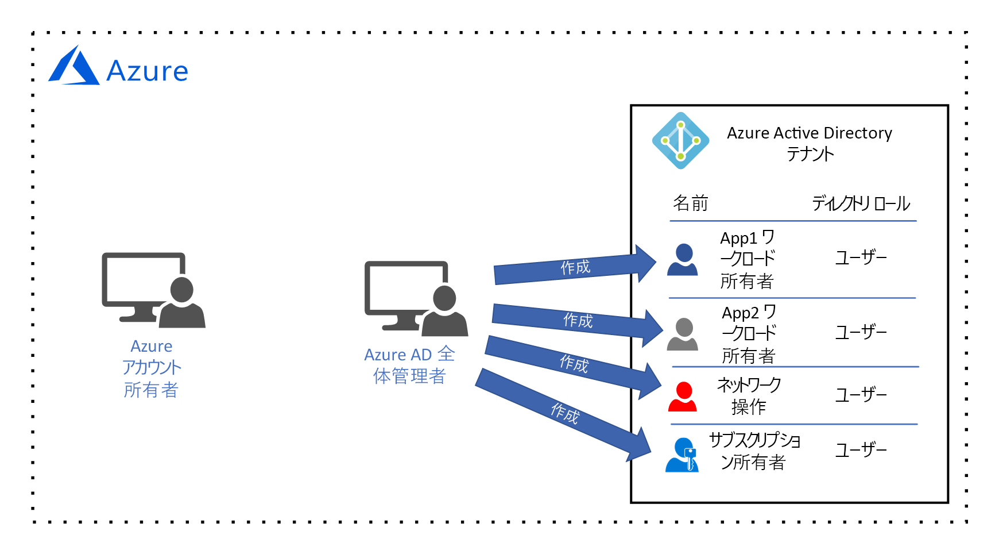
*図 2. Azure AD グローバル管理者は必要なユーザー アカウントをテナントに作成する。*
*Figure 2. The Azure AD Global Administrator creates the required user accounts in the tenant.*

最初の 2 つのアカウント **App1 ワークロード所有者**と **App2 ワークロード所有者**はそれぞれ、ワークロードの管理を担当する組織内の個人に関連付けられています。The first two accounts, **App1 Workload Owner** and **App2 Workload Owner** are each associated with an individual in our organization responsible for managing a workload. **ネットワーク操作**アカウントは、共有インフラストラクチャ リソースを担当する個人が所有します。The **network operations** account is owned by the individual that is responsible for the shared infrastructure resources. 最後の**サブスクリプション所有者**アカウントは、サブスクリプションの所有権を担当する個人と関連付けられています。Finally, the **subscription owner** account is associated with the individual responsible for ownership of subscriptions.

## 最小限の特権のリソース アクセスのアクセス許可モデルResource access permissions model of least privilege

ID 管理システムとユーザー アカウントが作成されたので、次は、最小限の特権のアクセス許可モデルをサポートするために、ロールベースのアクセス制御 (RBAC) ロールを各アカウントにどのように適用するかを決める必要があります。Now that we have our identity management system and user accounts created, we have to decide how we'll apply role-based access control (RBAC) roles to each account to support a permissions model of least privilege.

また、別の要件として、ワークロード所有者が、自身が所有していない他のワークロードに管理アクセスできないように、各ワークロードに関連付けられているリソースがそれぞれ、お互いに独立している必要もあります。Our other requirement is for the resources associated with each workload be isolated from one another such that no one workload owner has management access to any other workload they do not own. このモデルは、[Azure RBAC の組み込みロール][rbac-built-in-roles]のみを使用して実装する必要があります。We have a requirement to implement this model using only [built-in roles for Azure RBAC][rbac-built-in-roles].

それぞれの RBAC ロールが、**サブスクリプション**、**リソース グループ**、個別の**リソース**の 3 つのスコープのいずれかで適用されます。Each RBAC role is applied at one of three scopes in Azure: **subscription**, **resource group**, then an individual **resource**. ロールは下位のスコープに継承されます。Roles are inherited at lower scopes. たとえば、ユーザーに[組み込み所有者ロール][rbac-built-in-owner]がサブスクリプション レベルで割り当てられている場合、そのロールは、オーバーライドされない限り、リソース グループおよび個別のリソース レベルでもユーザーに割り当てられます。For example, if a user is assigned the [built-in owner role][rbac-built-in-owner] at the subscription level, that role is also assigned to that user at the resource group and individual resource level unless it's overridden.

そのため、最小限の特権アクセスのモデルを作成するには、特定のタイプのユーザーが、3 つの各スコープで実行できるアクションを決める必要があります。Therefore, to create a model of least privilege access we have to decide the actions a particular type of user is allowed to take at each of these three scopes. たとえば、ここでは、ワークロード所有者には、自身のワークロードに関連付けられているリソースのみに対する管理アクセス許可を付与し、他のリソースは管理できないようにする必要があります。For example, our requirement is for a workload owner to have permission to manage access to only the resources associated with their workload and no others. [組み込み所有者ロール][rbac-built-in-owner]をサブスクリプション スコープで割り当てると、各ワークロード所有者はすべてのワークロードへの管理アクセス権を持つことになります。If we were to assign the [built-in owner role][rbac-built-in-owner] at the subscription scope, each workload owner would have management access to all workloads.

この概念がもう少しわかるように、2 つのアクセス許可モデルの例を見てみましょう。Let's take a look at two example permission models to understand this concept a little better. 最初の例のモデルでは、サービス管理者のみを信頼してリソース グループを作成します。In the first example, our model trusts only the service administrator to create resource groups. 2 番目の例のモデルでは、組み込み所有者ロールを、サブスクリプション スコープの各ワークロード所有者に割り当てます。In the second example, our model assigns the built-in owner role to each workload owner at the subscription scope. 

両方の例に、サブスクリプション スコープで[組み込み所有者ロール][rbac-built-in-owner]が割り当てられているサブスクリプション サービス管理者がいます。In both examples, we have a subscription service administrator that is assigned the [built-in owner role][rbac-built-in-owner] at the subscription scope. [組み込み所有者ロール][rbac-built-in-owner]によって、リソースへのアクセス管理を含むすべてのアクセス許可が付与されることを思い出してください。Recall that the [built-in owner role][rbac-built-in-owner] grants all permissions including the management of access to resources.
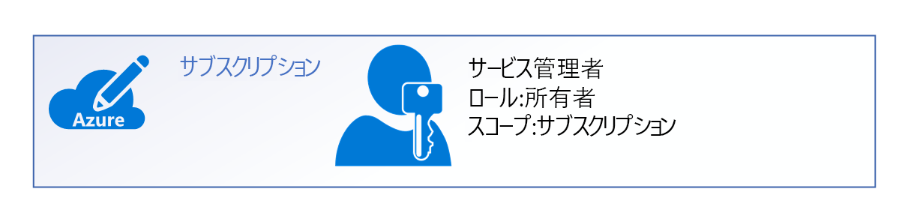
*図 3. 組み込み所有者ロールが割り当てられたサービス管理者が含まれるサブスクリプション。*
*Figure 3. A subscription with a service administrator assigned the built-in owner role.* 

1. 最初の例の**ワークロード所有者 A** にはサブスクリプション スコープのアクセス許可がありません。つまり、既定では、この所有者にリソース アクセス管理のアクセス権はありません。In our first example, we have **workload owner A** with no permissions at the subscription scope - they have no resource access management rights by default. このユーザーは、そのワークロードに対応したリソースを展開して管理する必要があります。This user wants to deploy and manage the resources for their workload. ワークロード所有者は**サービス管理者**に、リソース グループを作成するように要求する必要があります。They must contact the **service administrator** to request creation of a resource group.
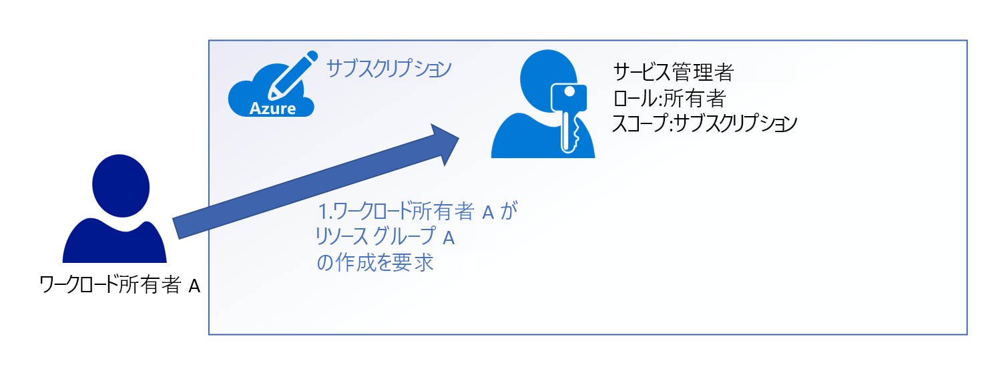  

2. **サービス管理者**はその要求を確認し、**リソース グループ A** を作成します。この時点では、まだ**ワークロード所有者 A** にはアクセス許可がないため、何もできません。The **service administrator** reviews their request and creates **resource group A**. At this point, **workload owner A** still doesn't have permission to do anything.
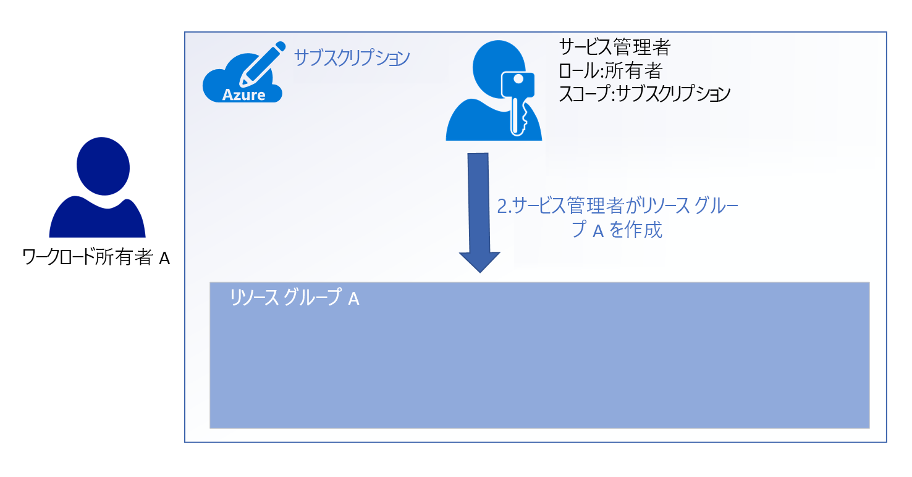

3. **サービス管理者**は**ワークロード所有者 A** を**リソース グループ A** に追加し、[組み込み共同作成者ロール](/azure/role-based-access-control/built-in-roles#contributor)を割り当てます。The **service administrator** adds **workload owner A** to **resource group A** and assigns the [built-in contributor role](/azure/role-based-access-control/built-in-roles#contributor). 共同作成者ロールによって、**リソース グループ A** には、アクセス管理を除くすべてのアクセス許可が付与されます。The contributor role grants all permissions on **resource group A** except managing access permission.
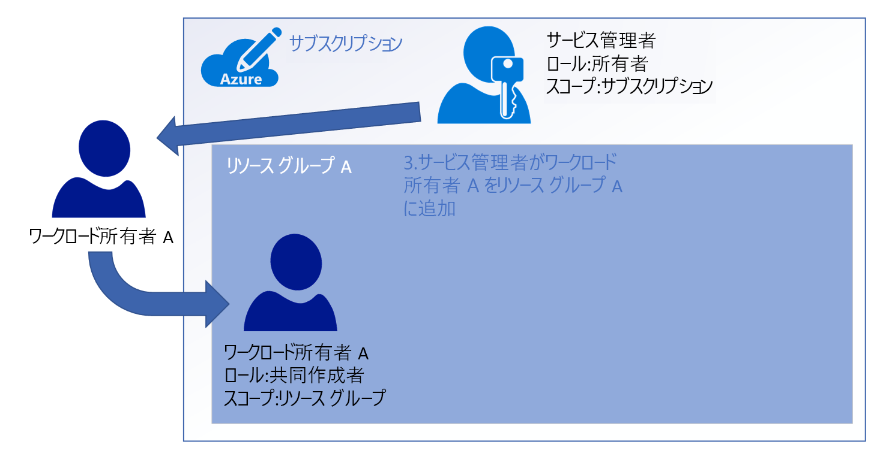

4. **ワークロード所有者 A** は、ワークロードの容量計画の一環として、2 人のチーム メンバーが CPU とネットワーク トラフィック監視データを確認できるようにする必要があるとします。Let's assume that **Workload owner A** has a requirement for a pair of team members to view the CPU and network traffic monitoring data as part of capacity planning for the workload. **ワークロード所有者 A** には共同作成者ロールが割り当てられているため、ユーザーを**リソース グループ A** に追加するアクセス許可はありません。そこで、この要求を**サービス管理者**に送信する必要があります。Because **workload owner A** is assigned the contributor role, they do not have permission to add a user to **resource group A**. They must send this request to the **service administrator**.
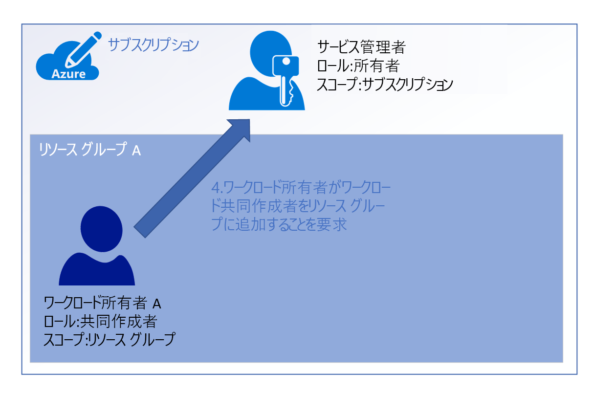

5. **サービス管理者**は要求を確認し、2 人の**ワークロードの共同作成者**ユーザーを**リソース グループ A** に追加します。この 2 人のユーザーにはリソース管理のアクセス許可は必要ありません。したがって、[組み込み閲覧者ロール](/azure/role-based-access-control/built-in-roles#contributor)が割り当てられます。The **service administrator** reviews the request, and adds the two **workload contributor** users to **resource group A**. Neither of these two users require permission to manage resources, so they are assigned the [built-in reader role](/azure/role-based-access-control/built-in-roles#contributor). 
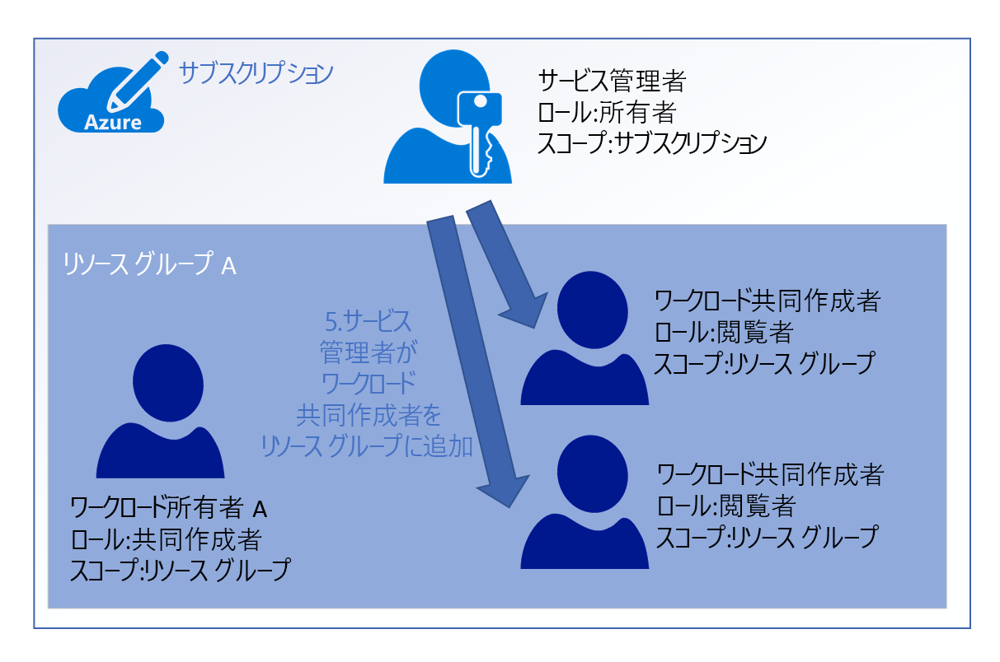

6. さらに、**ワークロード所有者 B** も、自身のワークロードに対するリソースをリソース グループに追加する必要があります。Next, **workload owner B** also requires a resource group to contain the resources for their workload. **ワークロード所有者 A** と同様、**ワークロード所有者 B** にも、サブスクリプション スコープでアクションを実行するためのアクセス許可が最初は付与されていません。そこで、ワークロード所有者 B も**サービス管理者**に要求を送信する必要があります。As with **workload owner A**, **workload owner B** initially does not have permission to take any action at the subscription scope so they must send a request to the **service administrator**. 
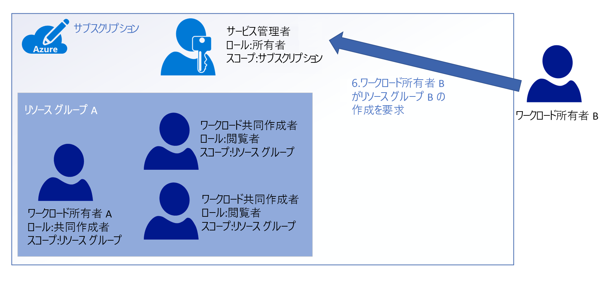

7. **サービス管理者**はその要求を確認し、**リソース グループ B** を作成します。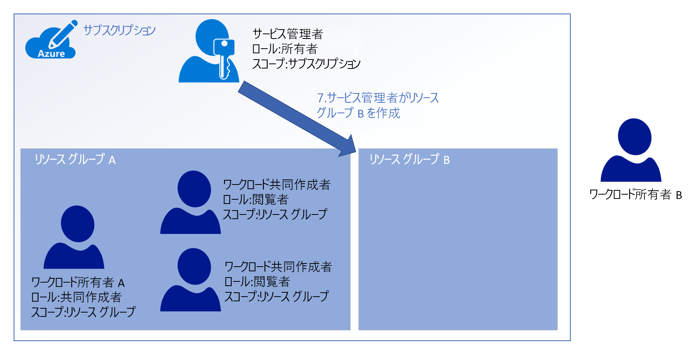The **service administrator** reviews the request and creates **resource group B**. 

8. 次に、**サービス管理者**は**ワークロード所有者 B** を**リソース グループ B** に追加し、[組み込み共同作成者ロール](https://docs.microsoft.com/en-us/azure/role-based-access-control/built-in-roles#contributor)を割り当てます。The **service administrator** then adds **workload owner B** to **resource group B** and assigns the [built-in contributor role](https://docs.microsoft.com/en-us/azure/role-based-access-control/built-in-roles#contributor). 
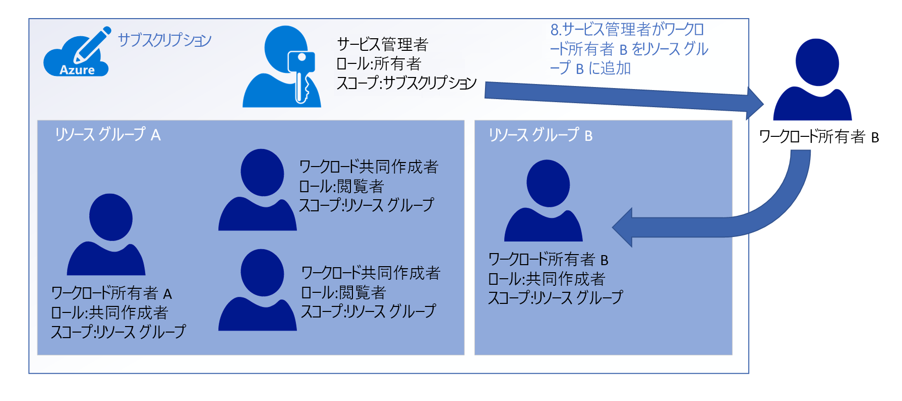

この時点で、ワークロード所有者はそれぞれ、自身のリソース グループで孤立しています。At this point, each of the workload owners is isolated in their own resource group. ワークロード所有者またはそのチーム メンバーが、他のリソース グループのリソースに管理アクセスすることはできません。None of the workload owners or their team members have management access to the resources in any other resource group. 

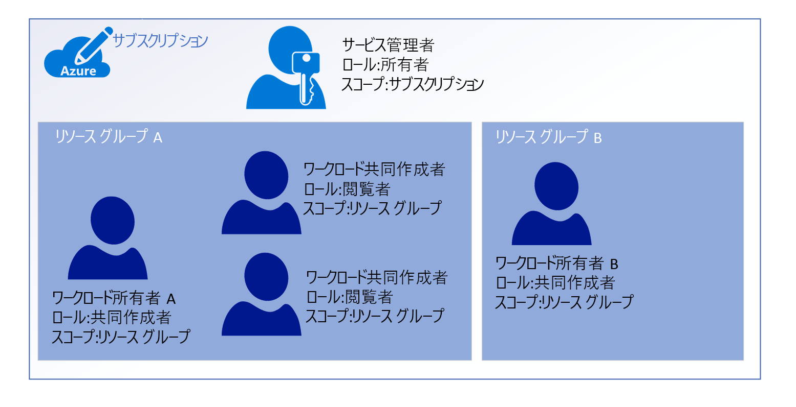
*図 4. それぞれのリソース グループで孤立している 2 人のワークロード所有者が含まれるサブスクリプション。*
*Figure 4. A subscription with two workload owners isolated with their own resource group.*

これは最小限の特権モデルです。このモデルでは、各ユーザーに、適切なアクセス許可が適切なリソース管理スコープで割り当てられています。This model is a least privilege model - each user is assigned the correct permission at the correct resource management scope.

ただし、この例では、すべてのタスクが**サービス管理者**によって実行されたことに注意してください。However, consider that every task in this example was performed by the **service administrator**. この例ではワークロード所有者が 2 人しかいなかったため、シンプルで、問題がないように見えますが、大規模な組織では問題が発生するのは想像に難くありません。While this is a simple example and may not appear to be an issue because there were only two workload owners, it's easy to imagine the types of issues that would result for a large organization. たとえば、要求のバックログが大きくなれば、**サービス管理者**がボトルネックとなる可能性があり、これが遅延につながります。For example, the **service administrator** can become a bottleneck with a large backlog of requests that result in delays.  

次の 2 番目の例では、**サービス管理者**によって実行されるタスク数が減っています。Let's take a look at second example that reduces the number of tasks performed by the **service administrator**. 

1. このモデルでは、サブスクリプション スコープで**ワークロード所有者 A** に[組み込み所有者ロール][rbac-built-in-owner]が割り当てられており、そのワークロード所有者 A は、自身のリソース グループとして**リソース グループ A** を作成できます。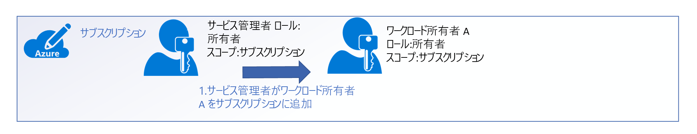In this model, **workload owner A** is assigned the [built-in owner role][rbac-built-in-owner] at the subscription scope, enabling them to create their own resource group: **resource group A**. 

2. **リソース グループ A** が作成されるとき、**ワークロード所有者 A** が既定で追加され、この所有者は、[組み込み所有者][rbac-built-in-owner]ロールをサブスクリプション スコープから継承します。When **resource group A** is created, **workload owner A** is added by default and inherits the [built-in owner][rbac-built-in-owner] role from the subscription scope.
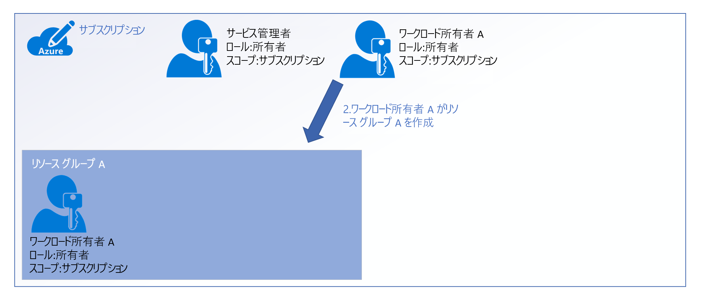

3. [組み込み所有者ロール][rbac-built-in-owner]により、**ワークロード所有者 A** に、リソース グループへのアクセスを管理するアクセス許可が付与されます。The [built-in owner role][rbac-built-in-owner] grants **workload owner A** permission to manage access to the resource group. **ワークロード所有者 A** が 2 人の**ワークロード共同作成者**を追加し、それぞれに[組み込み閲覧者ロール][rbac-built-in-owner]を割り当てます。**Workload owner A** adds two **workload contributors** and assigns the [built-in reader role][rbac-built-in-owner] to each of them. 
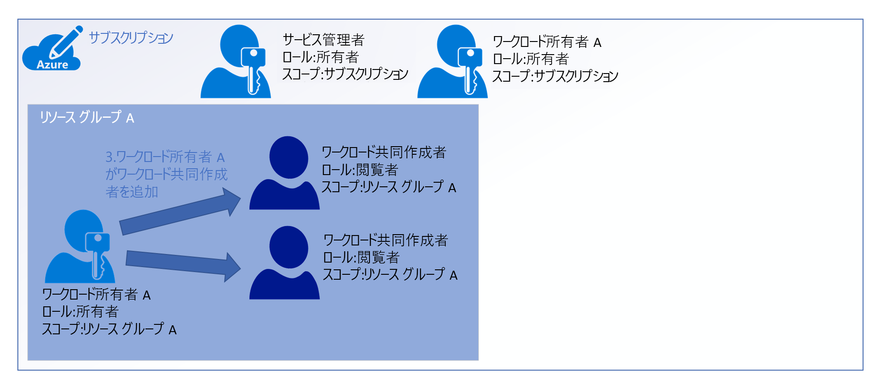

4. ここで、**サービス管理者**が、**ワークロード所有者 B** を、組み込み所有者ロールが含まれるサブスクリプションに追加します。**Service administrator** now adds **workload owner B** to the subscription with the built-in owner role. 
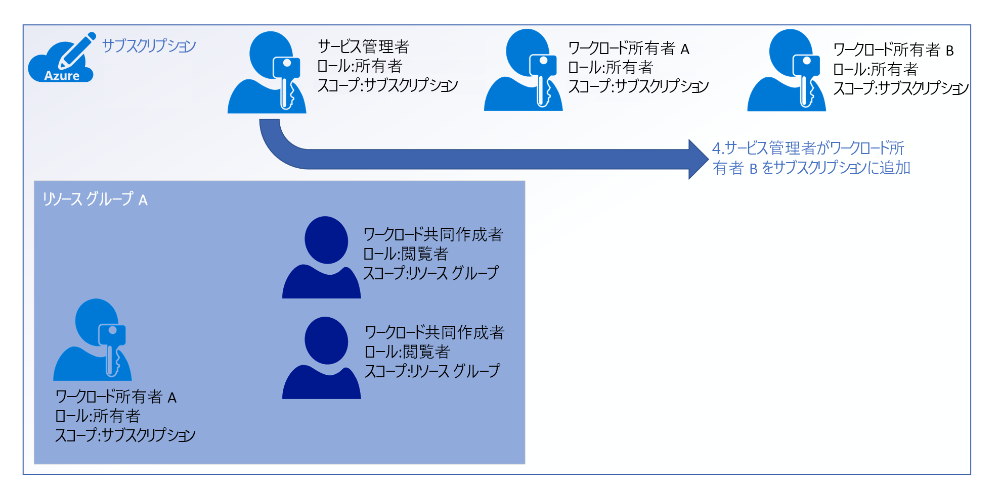

5. **ワークロード所有者 B** が**リソース グループ B** を作成します。ワークロード所有者 B は既定で追加されています。**Workload owner B** creates **resource group B** and is added by default. 前と同様、**ワークロード所有者 B** は、組み込み所有者ロールをサブスクリプション スコープから継承します。Again, **workload owner B** inherits the built-in owner role from the subscription scope.
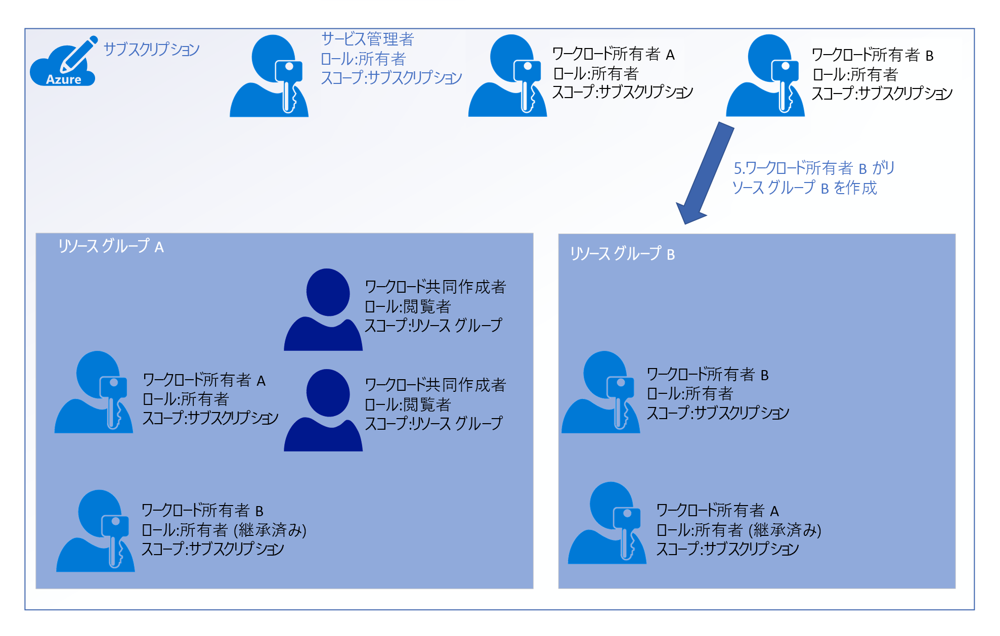

このモデルでは、**サービス管理者**が実行するアクションが、最初の例よりも少なくなっていることに注意してください。これはそれぞれのワークロード所有者に管理アクセスが委任されているためです。Note that in this model, the **service administrator** performed fewer actions than they did in the first example due to the delegation of management access to each of the individual workload owners.

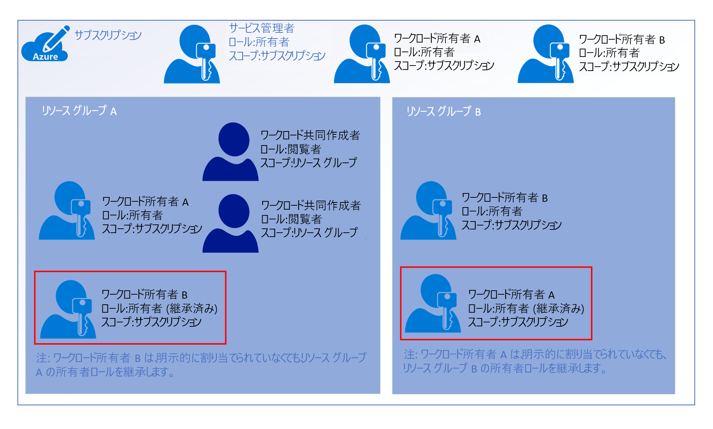
*図 5. 組み込み所有者ロールが割り当てられた、サービス管理者と 2 人のワークロード所有者が含まれるサブスクリプション。*
*Figure 5. A subscription with a service administrator and two workload owners, all assigned the built-in owner role.*

ただし、サブスクリプション スコープで**ワークロード所有者 A** と**ワークロード所有者 B** の両方に組み込み所有者ロールが割り当てられているため、それぞれが、お互いのリソース グループの組み込み所有者ロールを継承しています。However, because both **workload owner A** and **workload owner B** are assigned the built-in owner role at the subscription scope, they have each inherited the built-in owner role for each other's resource group. つまり、両方の所有者は、お互いのリソースにフル アクセスできるだけでなく、管理アクセスを、お互いのリソース グループに委任することもできます。This means that not only do they have full access to one another's resources, they are also able to delegate management access to each other's resource groups. たとえば、**ワークロード所有者 B** が他のユーザーを**リソース グループ A** に追加し、組み込み所有者ロールなど、任意のロールを割り当てることができます。For example, **workload owner B** has rights to add any other user to **resource group A** and can assign any role to them, including the built-in owner role.

それぞれの例を要件と比較すると、この 2 つの例では、2 人のワークロード所有者にリソース アクセス権を付与するアクセス許可を持つ 1 人の信頼されたユーザーがサブスクリプション スコープでサポートされていることがわかります。If we compare each example to our requirements, we see that both examples support a single trusted user at the subscription scope with permission to grant resource access rights to our two workload owners. 2 人のワークロード所有者は、既定では、リソース管理にアクセスできなかったため、**サービス管理者**に、アクセス許可を明示的に割り当ててもらう必要がありました。Each of the two workload owners did not have access to resource management by default and required the **service administrator** to explicitly assign permissions to them. ただし、最初の例のみが、ワークロード所有者が他のワークロードのリソースにアクセスできないように、各ワークロードに関連付けられているリソースがお互いに独立していなければならない、という要件に対応しています。However, only the first example supports the requirement that the resources associated with each workload are isolated from one another such that no workload owner has access to the resources of any other workload.

## リソース管理モデルResource management model

これで、最小限の特権のアクセス許可モデルの設計が完了しました。次は、これらのガバナンス モデルの実際の適用例をいくつか見ていきましょう。Now that we've designed a permissions model of least privilege, let's move on to take a look at some practical applications of these governance models. 次の 3 つの環境をサポートする必要がある、という要件を思い出してください。Recall from our requirements that we must support the following three environments:
1. **共有インフラストラクチャ:** すべてのワークロードで共有されるリソースの 1 つのグループ。**Shared infrastructure:** a single group of resources shared by all workloads. ネットワーク ゲートウェイ、ファイアウォール、セキュリティ サービスなどのリソースです。These are resources such as network gateways, firewalls, and security services.  
2. **開発:** 複数の非運用対応ワークロードを表す複数のリソース グループ。**Development:** multiple groups of resources representing multiple non-production ready workloads. これらのリソースは、概念実証、テスト、およびその他の開発者アクティビティ用に使用されます。These resources are used for proof-of-concept, testing, and other developer activities. これらのリソースのガバナンス モデルは、開発者の俊敏性の向上に対応するために、それほど厳しくない可能性があります。These resources may have a more relaxed governance model because to allow for increased developer agility.
3. **運用:** 複数の運用ワークロードを表す複数のリソース グループ。**Production:** multiple groups of resources representing multiple production workloads. これらのリソースは、プライベートとパブリックのアプリケーション成果物のホストに使用されます。These resources are used to host the private and public facing application artifacts. これらのリソースでは、リソース、アプリケーション コード、およびデータを不正アクセスから保護するために、通常、最も厳しいガバナンスおよびセキュリティ モデルが採用されています。These resources typically have the tightest governance and security models to protect the resources, application code, and data from unauthorized access.

この 3 つの環境ごとに、**ワークロード所有者**、**環境**、またはその両方について、コスト データを追跡する必要があります。For each of these three environments, we have a requirement to track cost data by **workload owner**, **environment**, or both. つまり、**共有インフラストラクチャ**の継続的なコスト、**開発**環境と**運用**環境の両方の個人によって発生するコスト、および**開発**と**運用**の全体的なコストを把握する必要があります。That is, we want to know the ongoing cost of our **shared infrastructure**, the costs incurred by individuals in both the **development** and **production** environments, and finally the overall cost of **development** and **production**. 

リソースのスコープには、**サブスクリプション**と**リソース グループ**の 2 つのレベルがあることは既に説明しました。You have already learned that resources are scoped to two levels: **subscription** and **resource group**. したがって、最初は、**サブスクリプション**によって環境を整理する方法を決めます。Therefore, our first decision is how to organize our environments by **subscription**. 可能性は 2 つしかありません。1 つのサブスクリプション、そして複数のサブスクリプションです。There are only two possibilities: a single subscription, or, multiple subscriptions. 

それぞれのモデルの例を見る前に、Azure 内のサブスクリプションの管理構造を確認しましょう。Before we look at examples of each of these models, let's review the management structure for subscriptions in Azure. 

サブスクリプションを担当する個人が組織にいる、という要件を思い出してください。このユーザーは、Azure AD テナント内で**サブスクリプション所有者**アカウントを所有しています。Recall from our requirements that we have an individual in our organization that is responsible for subscriptions, and this user owns the **subscription owner** account in our Azure AD tenant. ただし、このアカウントには、サブスクリプションを作成するためのアクセス許可がありません。However, this account does not have permission to create subscriptions. これを行うアクセス許可を持っているのは **Azure アカウント所有者**だけです。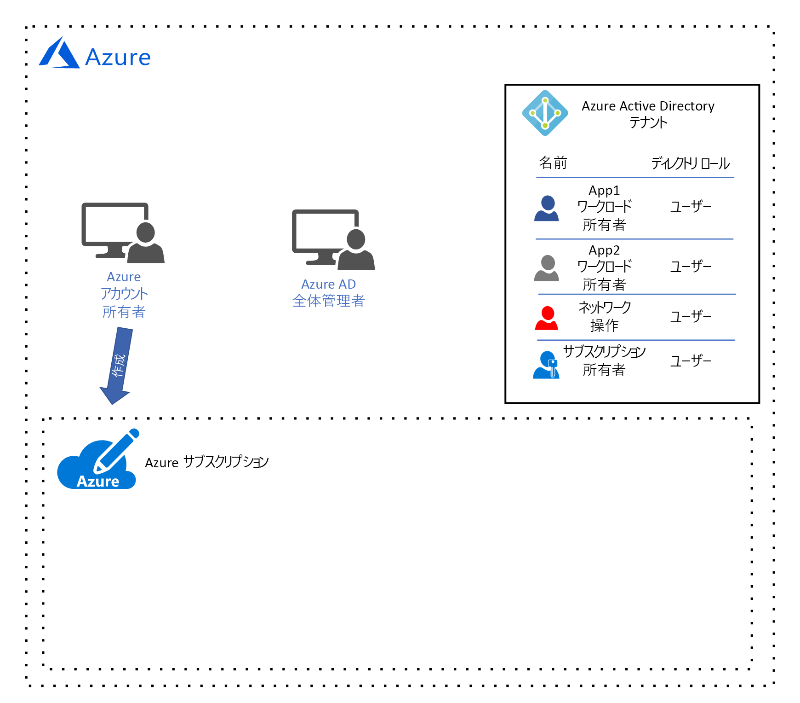
*図 6. Azure アカウント所有者がサブスクリプションを作成する。*Only the **Azure Account Owner** has permission to do this: 
*Figure 6. An Azure Account Owner creates a subscription.*

サブスクリプションが作成されたら、**Azure アカウント所有者**は、**サブスクリプション所有者**アカウントを、**所有者**ロールと共にサブスクリプションに追加できます。Once the subscription has been created, the **Azure Account Owner** can add the **subscription owner** account to the subscription with the **owner** role:

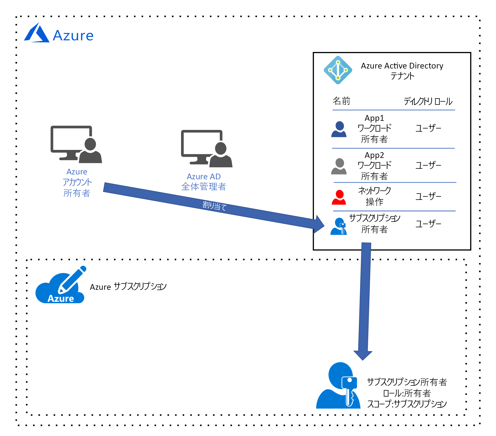
*図 7. Azure アカウント所有者は、**サブスクリプション所有者**ユーザー アカウントを**所有者**ロールと共にサブスクリプションに追加する。*
*Figure 7. The Azure Account Owner adds the **subscription owner** user account to the subscription with the **owner** role.*

これで、**サブスクリプション所有者**は、**リソース グループ**を作成して、リソース アクセス管理を委任できます。The **subscription owner** can now create **resource groups** and delegate resource access management.

まず、1 つのサブスクリプションを使用したリソース管理モデルの例を見てみましょう。First let's look at an example resource management model using a single subscription. 最初に、リソース グループを 3 つの環境と連携させる方法を決めます。Our first decision is how to align resource groups to the three environments. 2 つのオプションがあります。We have two options:
1. 各環境を 1 つのリソース グループと連携させる。Align each environment to a single resource group. 共有インフラストラクチャ リソースはすべて、1 つの**共有インフラストラクチャ** リソース グループにデプロイされます。All shared infrastructure resources are deployed to a single **shared infrastructure** resource group. 開発ワークロードに関連付けられているリソースはすべて、1 つの**開発**リソース グループにデプロイされます。All resources associated with development workloads are deployed to a single **development** resource group. 運用ワークロードに関連付けられているリソースについては、**運用**環境の 1 つの**運用**リソース グループにすべてデプロイされます。All resources associated with production workloads are deployed into a single **production** resource group for the **production** environment. 
2. ワークロードと個別のリソース グループを連携させ、名前付け規則とタグを使用して、リソース グループを 3 つの環境それぞれと連携させる。Align workloads with a separate resource group, using a naming convention and tags to align resource groups with each of the three environments.  

まずは、最初のオプションについて考えてみましょう。Let's begin by evaluating the first option. ここでは、前のセクションで説明したアクセス許可モデルと、1 人のサブスクリプション サービス管理者を使用します。この管理者は、リソース グループを作成し、そのグループに、ユーザーを、組み込み**共同作成者**ロールまたは**閲覧者**ロールと共に追加します。We'll be using the permissions model that we discussed in the previous section, with a single subscription service administrator that creates resource groups and adds users to them with either the built-in **contributor** or **reader** role. 

1. デプロイされた最初のリソース グループは、**共有インフラストラクチャ**環境を表します。The first resource group deployed represents the **shared infrastructure** environment. **サブスクリプション所有者**は、**netops-shared-rg** という名前の共有インフラストラクチャ リソースのリソース グループを作成します。The **subscription owner** creates a resource group for the shared infrastructure resources named **netops-shared-rg**. 
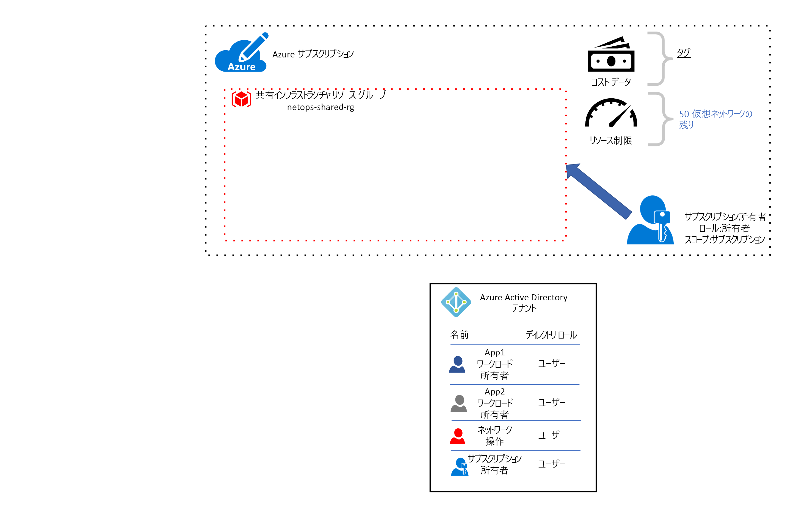
2. **サブスクリプション所有者**は、**ネットワーク操作ユーザー** アカウントをそのリソース グループに追加し、**共同作成者**ロールを割り当てます。The **subscription owner** adds the **network operations user** account to the resource group and assigns the **contributor** role. 
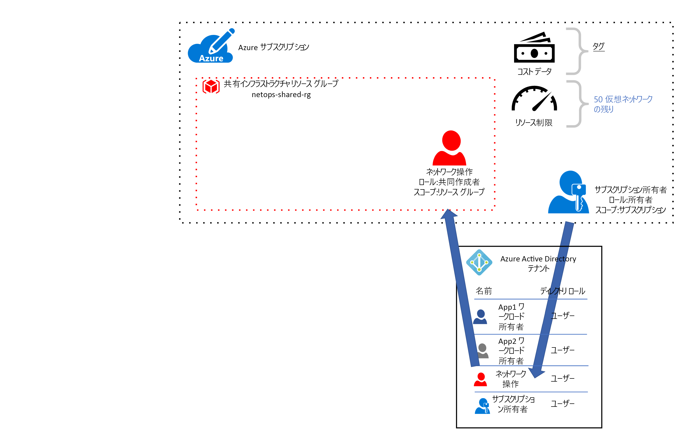
3. **ネットワーク操作ユーザー**は、[VPN ゲートウェイ](/azure/vpn-gateway/vpn-gateway-about-vpngateways)を作成し、オンプレミス VPN アプライアンスに接続するように構成します。The **network operations user** creates a [VPN gateway](/azure/vpn-gateway/vpn-gateway-about-vpngateways) and configures it to connect to the on-premises VPN appliance. また、**ネットワーク操作ユーザー**は、*environment:shared* および *managedBy:netOps* という[タグ](/azure/azure-resource-manager/resource-group-using-tags)のペアを各リソースに適用します。The **network operations** user also applies a pair of [tags](/azure/azure-resource-manager/resource-group-using-tags) to each of the resources: *environment:shared* and *managedBy:netOps*. **サブスクリプション サービス管理者**がコスト レポートをエクスポートすると、それぞれのタグに合わせてコストが調整されます。When the **subscription service administrator** exports a cost report, costs will be aligned with each of these tags. これにより、**サブスクリプション サービス管理者**が、*environment* タグ *managedBy* タグを使ってコストをピボットできます。This allows the **subscription service administrator** to pivot costs using the *environment* tag and the *managedBy* tag. 図の右上にある**リソース制限**カウンターをご覧ください。Notice the **resource limits** counter at the top right-hand side of the figure. 各 Azure サブスクリプションに[サービス制限](/azure/azure-subscription-service-limits)があります。これらの制限の影響について理解しやすいように、ここでは各サブスクリプションの仮想ネットワークの制限を追跡します。Each Azure subscription has [service limits](/azure/azure-subscription-service-limits), and to help you understand the effect of these limits we'll follow the virtual network limit for each subscription. サブスクリプションあたりの仮想ネットワークの既定の制限は 50 です。1 つ目の仮想ネットワークがデプロイされたため、現在 49 の仮想ネットワークが使用可能です。There is a default limit of 50 virtual networks per subscription, and after the first virtual network is deployed there are now 49 available.
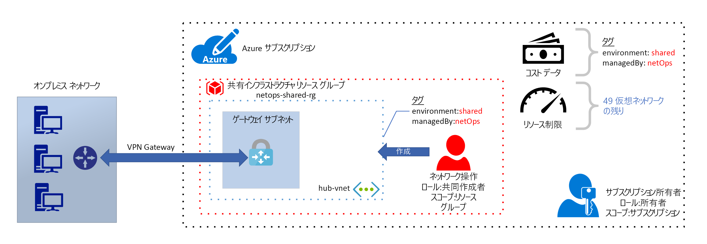
4. さらに 2 つのリソース グループをデプロイします。1 つ目は *prod-rg* という名前です。Two more resource groups are deployed, the first is named *prod-rg*. このリソース グループは**運用**環境と連携します。This resource group is aligned with the **production** environment. 2 つ目の名前は *dev-rg* で、**開発**環境と連携します。The second is named *dev-rg* and is aligned with the **development** environment. 運用ワークロードに関連付けられているリソースはすべて、**運用**環境にデプロイされ、開発ワークロードに関連付けられているリソースはすべて、**開発**環境にデプロイされます。All resources associated with production workloads are deployed to the **production** environment and all resources associated with development workloads are deployed to the **development** environment. この例では、この 2 つの環境それぞれにデプロイするワークロードは 2 つだけなので、Azure サブスクリプション サービスの制限に達することはありません。In this example we'll only deploy two workloads to each of these two environments so we won't encounter any Azure subscription service limits. しかし、リソース数の上限がリソース グループあたり 800 であることを考慮することが重要です。However, it's important to consider that each resource group has a limit of 800 resources per resource group. 各リソース グループにワークロードを追加し続けると、この制限に達する可能性があります。Therefore, if we keep adding workloads to each resource group it is possible that this limit will be reached. 
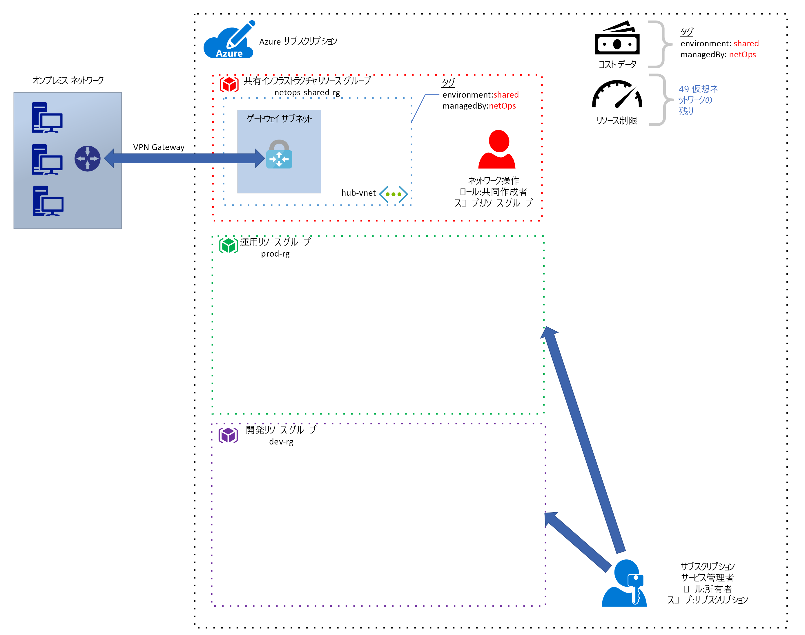
5. 最初の**ワークロード所有者**が要求を**サブスクリプション サービス管理者**に送信します。その所有者は、**共同作成者**ロールと共に、**開発**環境と**運用**環境それぞれのリソース グループに追加されます。The first **workload owner** sends a request to the **subscription service administrator** and is added to each of the **development** and **production** environment resource groups with the **contributor** role. 前に説明したように、**共同作成者**ロールにより、ユーザーは、別のユーザーへのロールの割り当て以外のすべての操作を実行できます。As you learned earlier, the **contributor** role allows the user to perform any operation other than assigning a role to another user. 最初の**ワークロード所有者**は、自身のワークロードに関連付けられているリソースを作成できます。The first **workload owner** can now create the resources associated with their workload.
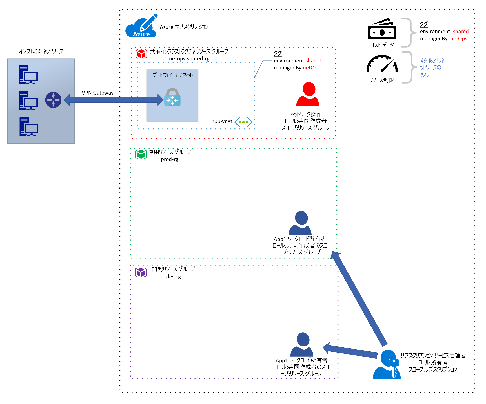
6. 最初の**ワークロード所有者**は、2 つのリソース グループそれぞれに仮想ネットワークを作成します。各仮想ネットワークには 2 つの仮想マシンがあります。The first **workload owner** creates a virtual network in each of the two resource groups with a pair of virtual machines in each. 最初の**ワークロード所有者**は、*environment* タグと *managedBy* タグをすべてのリソースに適用します。The first **workload owner** applies the *environment* and *managedBy* tags to all resources. Azure サービスの制限カウンターが示す現在の残りの仮想ネットワーク数が 47 であることに注意してください。Note that the Azure service limit counter is now at 47 virtual networks remaining.
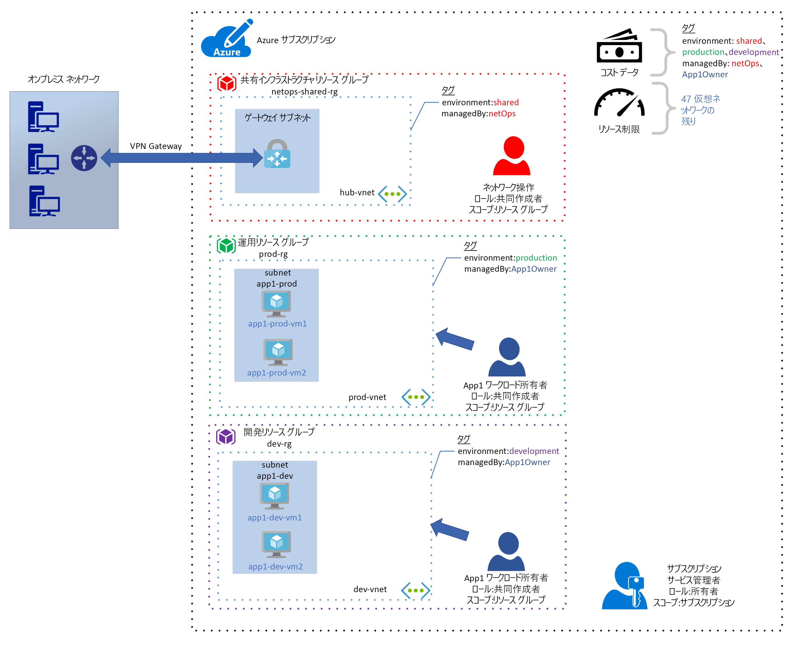
7. 仮想ネットワークが作成されたとき、どちらにもオンプレミスへの接続性はありません。Each of the virtual networks does not have connectivity to on-premises when they are created. この種類のアーキテクチャでは、各仮想ネットワークが、**共有インフラストラクチャ**環境の *hub-vnet* にピアリングされていなければなりません。In this type of architecture, each virtual network must be peered to the *hub-vnet* in the **shared infrastructure** environment. 仮想ネットワークのピアリングにより、2 つの個別の仮想ネットワーク間に接続が作成され、その間をネットワーク トラフィックが行き来できるようになります。Virtual network peering creates a connection between two separate virtual networks and allows network traffic to travel between them. 仮想ネットワークのピアリングは、本質的には推移的でないことに注意してください。Note that virtual network peering is not inherently transitive. ピアリングは、接続されている 2 つの各仮想ネットワークで指定する必要があります。いずれか 1 つの仮想ネットワークでしかピアリングが指定されていない場合、接続は不完全です。A peering must be specified in each of the two virtual networks that are connected, and if only one of the virtual networks specifies a peering the connection is incomplete. この影響を示すために、最初の**ワークロード所有者**は、**prod-vnet** と **hub-vnet** の間のピアリングを指定します。To illustrate the effect of this, the first **workload owner** specifies a peering between **prod-vnet** and **hub-vnet**. この場合、最初のピアリングは作成されますが、トラフィックは行き来しません。**hub-vnet** から **prod-vnet** への補完的なピアリングがまだ指定されていないためです。The first peering is created, but no traffic flows because the complementary peering from **hub-vnet** to **prod-vnet** has not yet been specified. 最初の**ワークロード所有者**は、**ネットワーク操作**ユーザーに、この補完的なピアリング接続を要求します。The first **workload owner** contacts the **network operations** user and requests this complementary peering connection.
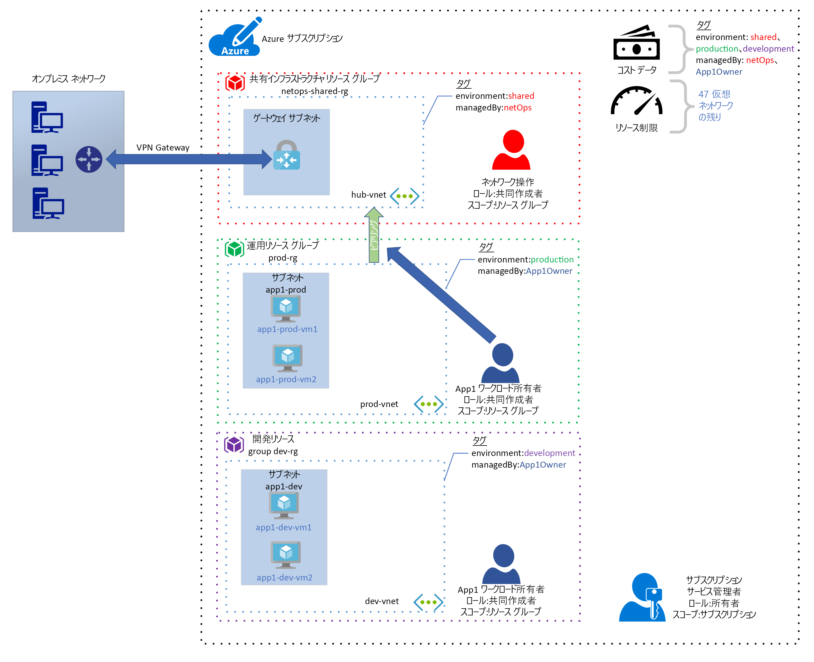
8. **ネットワーク操作**ユーザーは要求を確認し、承認したうえで、**hub-vnet** の設定でピアリングを指定します。The **network operations** user reviews the request, approves it, then specifies the peering in the settings for the **hub-vnet**. これでピアリングの接続は完了です。2 つの仮想ネットワーク間を、ネットワーク トラフィックが行き来するようになります。The peering connection is now complete and network traffic flows between the two virtual networks.
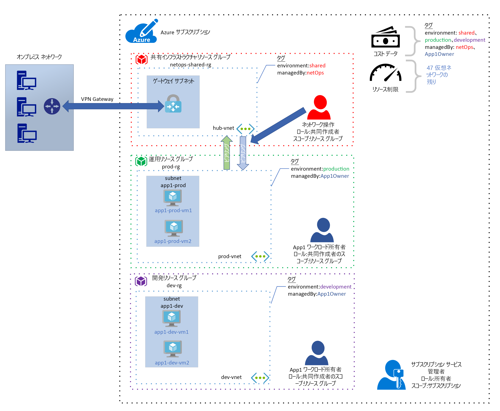
9. ここで、もう 1 人の**ワークロード所有者**が要求を**サブスクリプション サービス管理者**に送信します。その所有者は、**共同作成者**ロールと共に、既存の**運用**環境と**開発**環境それぞれのリソース グループに追加されます。Now, a second **workload owner** sends a request to the **subscription service administrator** and is added to the existing **production** and **development** environment resource groups with the **contributor** role. その 2 番目の**ワークロード所有者**には、各リソース グループで、最初の**ワークロード所有者**と同じアクセス許可がすべてのリソースについて付与されます。The second **workload owner** has the same permissions on all resources as the first **workload owner** in each resource group. 
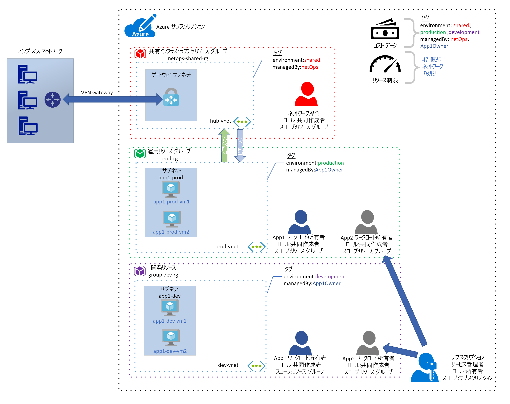
10. 2 番目の**ワークロード所有者**は、**prod vnet** 仮想ネットワークにサブネットを作成し、2 つの仮想マシンを追加します。The second **workload owner** creates a subnet in the **prod-vnet** virtual network, then adds two virtual machines. 2 番目の**ワークロード所有者**は、*environment* タグと *managedBy* タグを各リソースに適用します。The second **workload owner** applies the *environment* and *managedBy* tags to each resource.
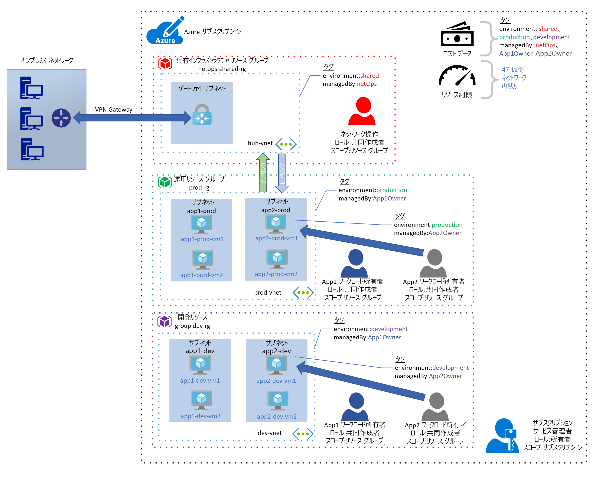 

このリソース管理モデルの例では、3 つの必要な環境でリソースを管理できます。This example resource management model enables us to manage our resources in the three required environments. 共有インフラストラクチャ リソースが保護されているのは、それらのリソースへのアクセス許可を持つユーザーが、サブスクリプションに 1 人しかいないためです。Our shared infrastructure resources are protected because there's only a single user in the subscription with permission to access those resources. 共有インフラストラクチャ リソースは、その実際の共有リソース自体に対するアクセス許可がなくても、各ワークロード所有者が利用できます。Each of our workload owners is able to utilize the share infrastructure resources without having any permissions on the actual shared resources themselves. この管理モデルは、ワークロード分離の要件を満たしておらず、2 人の**ワークロード所有者**それぞれが、もう一方のワークロードのリソースにアクセスできます。This management model fails our requirement for workload isolation - each of the two **workload owners** are able to access the resources of the other's workload. 

また、一見するとわかりにくいかもしれませんが、このモデルには重要な考慮事項がもう 1 つあります。There's another important consideration with this model that may not be immediately obvious. この例では、オンプレミスとの接続性を提供するために **hub-vnet** とのネットワーク ピアリング接続を要求したのは、**app1 ワークロード所有者**でした。In our example, it was **app1 workload owner** that requested the network peering connection with the **hub-vnet** to provide connectivity to on-premises. **ネットワーク操作**ユーザーは、そのワークロードでデプロイされたリソースに基づいてその要求を評価しました。The **network operations** user evaluated that request based on the resources deployed with that workload. **サブスクリプション所有者**が **app2 ワークロード所有者**を、**共同作成者**ロールと共に追加したとき、そのユーザーには、**prod-rg** リソース グループのすべてのリソースに対する管理アクセス権がありました。When the **subscription owner** added **app2 workload owner** with the **contributor** role, that user had management access rights to all resources in the **prod-rg** resource group. 

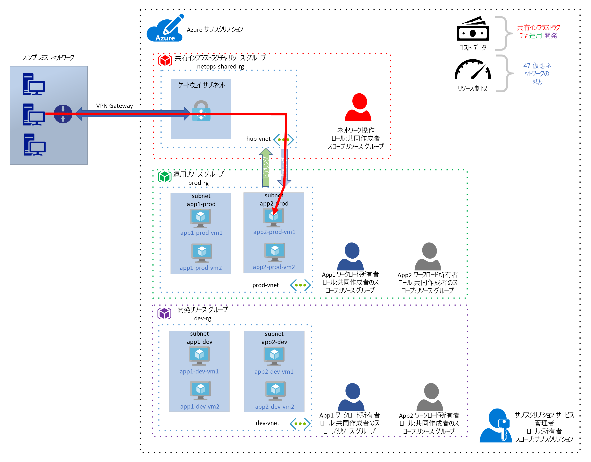

つまり、**app2 ワークロード所有者**には、**prod-vnet** 仮想ネットワーク内に、自身のサブネットと仮想マシンをデプロイするアクセス許可がありました。This means **app2 workload owner** had permission to deploy their own subnet with virtual machines in the **prod-vnet** virtual network. 既定では、これで、それらの仮想マシンはオンプレミス ネットワークにアクセスできます。By default, those virtual machines now have access to the on-premises network. **ネットワーク操作**ユーザーは、これらのマシンを認識せず、そのマシンがオンプレミスに接続するのを承認しませんでした。The **network operations** user is not aware of those machines and did not approve their connectivity to on-premises.

次に、さまざまな環境やワークロードに対するリソース グループが複数含まれる 1 つのサブスクリプションを見てみましょう。Next, let's look at a single subscription with multiple resources groups for different environments and workloads. 前の例では、リソースは環境ごとに分かれ、同じ環境のリソースは同じリソース グループにあったため、各環境のリソースを簡単に特定できました。Note that in the previous example, the resources for each environment were easily identifiable because they were in the same resource group. そのグループ分けがなくなり、今後は、リソースを特定するために、リソース グループの名前付け規則を使用する必要があります。Now that we no longer have that grouping, we will have to rely on a resource group naming convention to provide that functionality. 

1. **共有インフラストラクチャ** リソースでは引き続きこのモデル内で個別のリソース グループが使用されるため、変更されません。Our **shared infrastructure** resources will still have a separate resource group in this model, so that remains the same. ワークロードごとに 2 つのリソース グループが必要です。1 つは**開発**環境、もう 1 つは**運用**環境に対して使用されます。Each workload requires two resource groups - one for each of the **development** and **production** environments. 最初のワークロードに対して、**サブスクリプション所有者**は 2 つのリソース グループを作成します。For the first workload, the **subscription owner** creates two resource groups. 1 つは **app1-prod-rg**、もう 1 つは **app1-dev-rg** という名前です。The first is named **app1-prod-rg** and the second one is named **app1-dev-rg**. 前に説明したように、この名前付け規則により、リソースが、最初のワークロード **app1** と、**dev** 環境または **prod** 環境のいずれかに関連付けられていることが特定されます。As discussed earlier, this naming convention identifies the resources as being associated with the first workload, **app1**, and either the **dev** or **prod** environment. ここでも、"*サブスクリプション*" 所有者は、**app1 ワークロード所有者**を、**共同作成者**ロールと共にリソース グループに追加します。Again, the *subscription* owner adds **app1 workload owner** to the resource group with the **contributor** role.
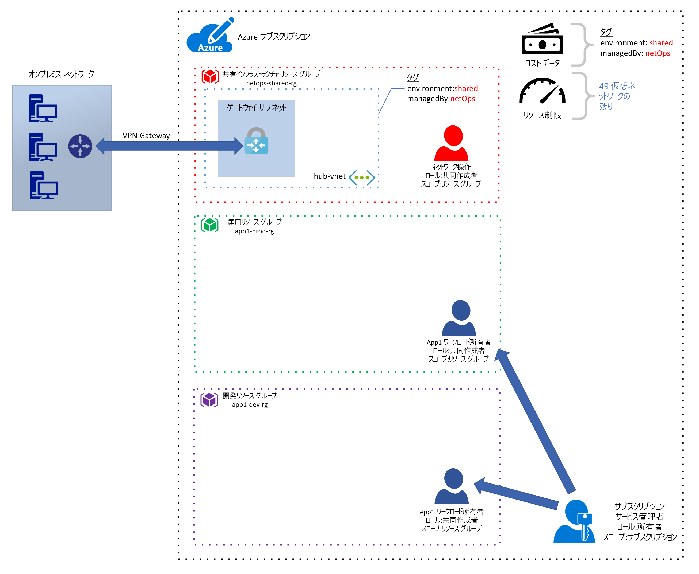
2. 最初の例と同様、**app1 ワークロード所有者**が、**app1-prod-vnet** という名前の仮想ネットワークを**運用**環境に、もう 1 つの **app1-dev-vnet** という名前の仮想ネットワークを**開発**環境に追加します。Similar to the first example, **app1 workload owner** deploys a virtual network named **app1-prod-vnet** to the **production** environment, and another named **app1-dev-vnet** to the **development** environment. ここでも、**app1 ワークロード所有者**が、ピアリング接続の作成要求を**ネットワーク操作**ユーザーに送信します。Again, **app1 workload owner** sends a request to the **network operations** user to create a peering connection. **app1 ワークロード所有者**が、最初の例と同じタグを追加していることに注意してください。制限カウンターは、サブスクリプションに残っている仮想ネットワークの数を示す 47 に減少しています。Note that **app1 workload owner** adds the same tags as in the first example, and the limit counter has been decremented to 47 virtual networks remaining in the subscription.
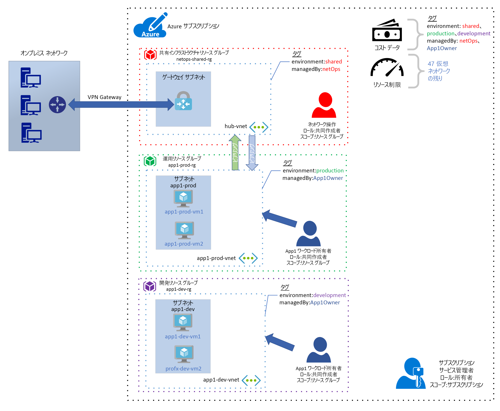
3. ここで、**サブスクリプション所有者**は、**app2 ワークロード所有者**に対して 2 つのリソース グループを作成します。The **subscription owner** now creates two resource groups for **app2 workload owner**. **app1 ワークロード所有者**と同じ規則に従って、リソース グループの名前は **app2-prod-rg** と **app2-dev-rg** となります。Following the same conventions as for **app1 workload owner**, the resource groups are named **app2-prod-rg** and **app2-dev-rg**. **サブスクリプション所有者**は、**app2 ワークロード所有者**を、**共同作成者**ロールと共に各リソース グループに追加します。The **subscription owner** adds **app2 workload owner** to each of the resource groups with the **contributor** role.
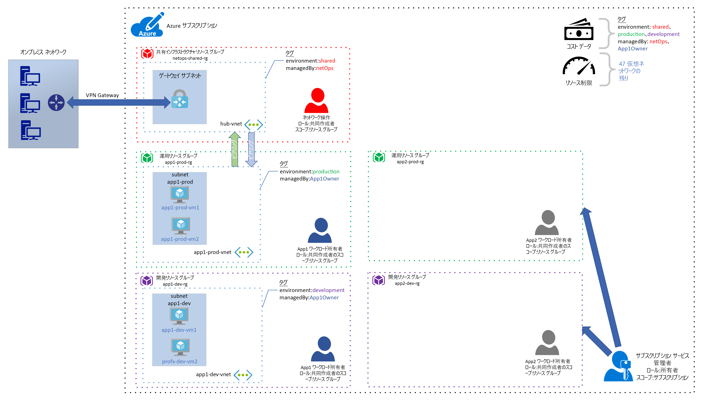
4. "*app2 ワークロード所有者*" が、仮想ネットワークと仮想マシンを、同じ名前付け規則を持つリソース グループにデプロイします。*App2 workload owner* deploys virtual networks and virtual machines to the resource groups with the same naming conventions. タグが追加され、制限カウンターは、"*サブスクリプション*" に残っている仮想ネットワークの数を示す 45 に減少しています。Tags are added and the limit counter has been decremented to 45 virtual networks remaining in the *subscription*.
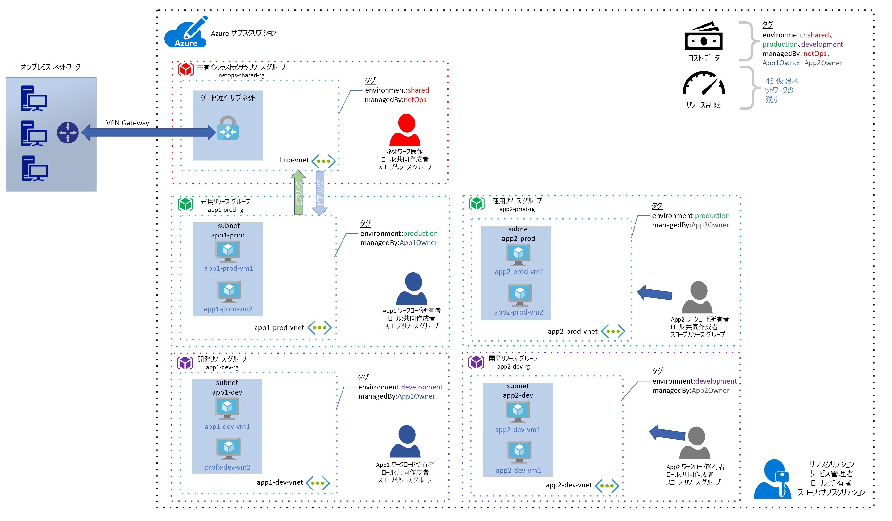
5. "*app2 ワークロード所有者*" が、"*ネットワーク操作*" ユーザーに対して、*app2-prod-vnet* を *hub-vnet* にピアリングするよう要求します。*App2 workload owner* sends a request to the *network operations* user to peer the *app2-prod-vnet* with the *hub-vnet*. "*ネットワーク操作*" ユーザーは、ピアリング接続を作成します。The *network operations* user creates the peering connection.
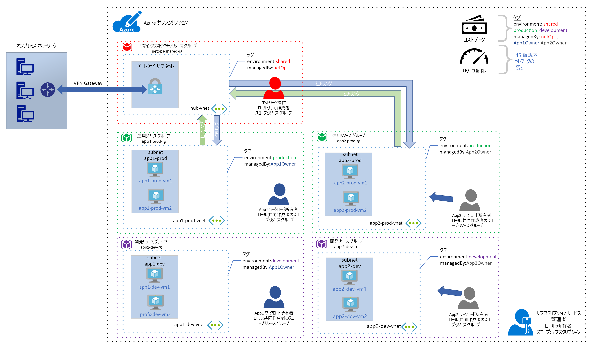

結果の管理モデルは最初の例と似ていますが、主に次のような違いがあります。The resulting management model is similar to the first example, with several key differences:
* 2 つのワークロードはそれぞれ、ワークロードおよび環境によって分離されています。Each of the two workloads is isolated by workload and by environment.
* このモデルには、最初の例のモデルよりも仮想ネットワークが 2 つ多く必要です。This model required two more virtual networks than the first example model. ワークロードが 2 つだけなので、この違いは重要ではありませんが、このモデルのワークロード数の制限は理論的には 24 個です。While this is not an important distinction with only two workloads, the theoretical limit on the number of workloads for this model is 24. 
* それぞれの環境に対応する 1 つのリソース グループに、リソースがグループ化されなくなりました。Resources are no longer grouped in a single resource group for each environment. リソースをグループ化するには、各環境に使用される名前付け規則を理解する必要があります。Grouping resources requires an understanding of the naming conventions used for each environment. 
* ピアリングされた各仮想ネットワーク接続が、"*ネットワーク操作*" ユーザーによって確認および承認されました。Each of the peered virtual network connections was reviewed and approved by the *network operations* user.

ここで、複数のサブスクリプションを使用したリソース管理モデルを見てみましょう。Now let's look at a resource management model using multiple subscriptions. このモデルでは、3 つの各環境を、**共有サービス** サブスクリプション、**運用**サブスクリプション、**開発**サブスクリプションの 3 つの個別のサブスクリプションと連携させます。In this model, we'll align each of the three environments to a separate subscription: a **shared services** subscription, **production** subscription, and finally a **development** subscription. このモデルに関する考慮事項は、リソース グループとワークロードを連携させる方法を決める必要がある点では、1 つのサブスクリプションを使用するモデルと似ています。The considerations for this model are similar to a model using a single subscription in that we have to decide how to align resource groups to workloads. ワークロードごとにリソース グループを作成すると、ワークロードの分離要件に対応できることは既に確認しました。したがって、この例では、そのモデルをそのまま使用します。We've already determined that creating a resource group for each workload satisfies our workload isolation requirement, so we'll stick with that model in this example.

1. このモデルには、"*共有インフラストラクチャ*"、"*運用*"、および "*開発*" の 3 つの "*サブスクリプション*" があります。In this model, there are three *subscriptions*: *shared infrastructure*, *production*, and *development*. この 3 つのサブスクリプションそれぞれに、"*サブスクリプション所有者*" が必要で、このシンプルな例では、3 つすべてに同じユーザー アカウントを使用します。Each of these three subscriptions requires a *subscription owner*, and in our simple example we'll use the same user account for all three. "*共有インフラストラクチャ*" リソースは、上記の最初の 2 つの例と同じように管理されており、最初のワークロードは、"*運用*" 環境の *app1-rg*と、"*開発*" 環境の同じ名前のリソース グループに関連付けられています。The *shared infrastructure* resources are managed similarly to the first two examples above, and the first workload is associated with the *app1-rg* in the *production* environment and the same-named resource group in the *development* environment. "*app1 ワークロード所有者*" は、"*共同作成者*" ロールと共に各リソース グループに追加されます。The *app1 workload owner* is added to each of the resource group with the *contributor* role. 
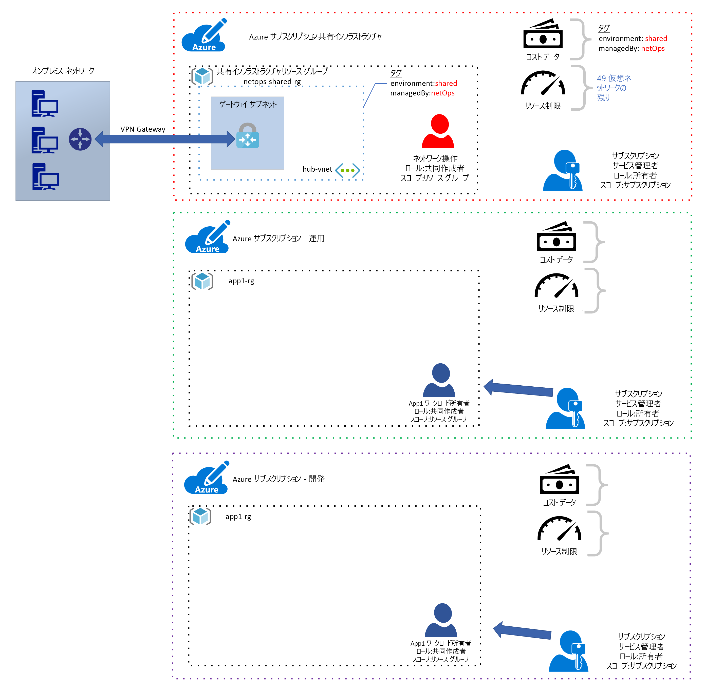
2. 前の例と同様に、"*app1 ワークロード所有者*" がリソースを作成し、"*共有インフラストラクチャ*" 仮想ネットワークとのピアリング接続を要求します。As with the earlier examples, *app1 workload owner* creates the resources and requests the peering connection with the *shared infrastructure* virtual network. "*app1 ワークロード所有者*" は *managedBy* タグのみを追加します。*environment* タグは必要なくなったためです。*App1 workload owner* adds only the *managedBy* tag because there is no longer a need for the *environment* tag. つまり、各環境のリソースが同じ "*サブスクリプション*" にグループ化されるようになり、*environment* タグは不要です。That is, resources are for each environment are now grouped in the same *subscription* and the *environment* tag is redundant. 制限カウンターは、残り 49 仮想ネットワークに減少します。The limit counter is decremented to 49 virtual networks remaining.
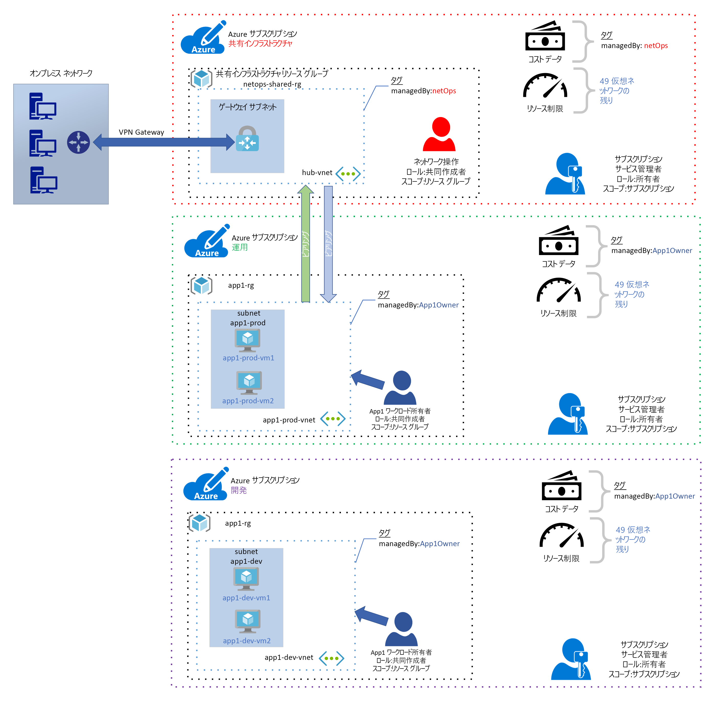
3. 最後に、"*サブスクリプション所有者*" は 2 つ目のワークロードに対して処理を繰り返して、共同作成者ロールで "*app2 ワークロード所有者*" を含むリソース グループを追加します。Finally, the *subscription owner* repeats the process for the second workload, adding the resource groups with the *app2 workload owner* in the \*contributor role. 各環境サブスクリプションの制限カウンターは、残り 48 仮想ネットワークに減少します。The limit counter for each of the environment subscriptions is decremented to 48 virtual networks remaining. 

この管理モデルには、上記の 2 番目の例で示した利点があります。This management model has the benefits of the second example above. 主な違いは、制限が 2 つの "*サブスクリプション*" に分散されるため、あまり問題にはならないという点です。However, the key difference is that limits are less of an issue due to the fact that they are spread over two *subscriptions*. 欠点は、タグによって追跡されるコスト データを、3 つのすべての "*サブスクリプション*" にわたって集計する必要があることです。The drawback is that the cost data tracked by tags must be aggregated across all three *subscriptions*. 

したがって、ご自身の要件の優先度に応じて、2 つのサンプル リソース管理モデルのいずれかを選択できます。Therefore, you can select any of these two examples resource management models depending on the priority of your requirements. 皆様の組織で 1 つのサブスクリプションのサービス制限に到達しないと思われる場合は、複数のリソース グループを含む 1 つのサブスクリプションを使用できます。If you anticipate that your organization will not reach the service limits for a single subscription, you can use a single subscription with multiple resource groups. 逆に、組織のワークロードが多くなりそうなときは、環境ごとに複数のサブスクリプションを使用することをお勧めします。Conversely, if your organization anticipates many workloads, multiple subscriptions for each environment may be better.

<!-- ## Summary

## Next steps -->

<!-- links -->

[rbac-built-in-owner]: /azure/role-based-access-control/built-in-roles#owner
[rbac-built-in-roles]: /azure/role-based-access-control/built-in-roles
