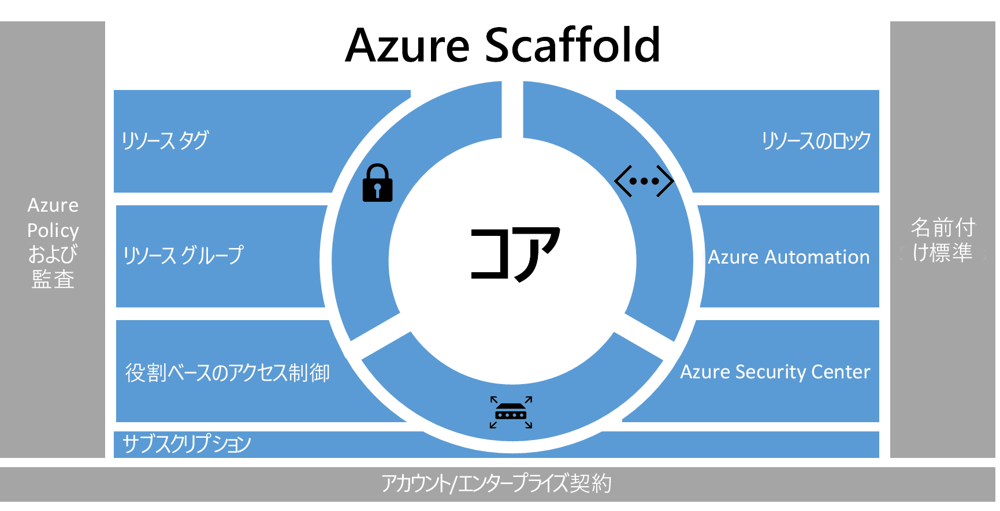
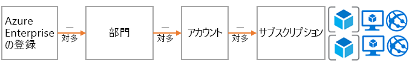
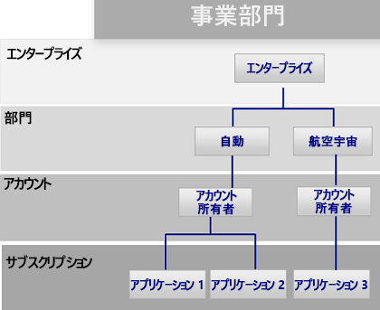
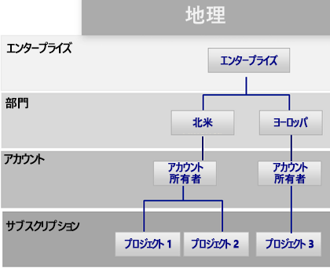
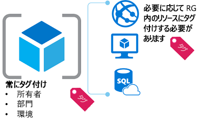
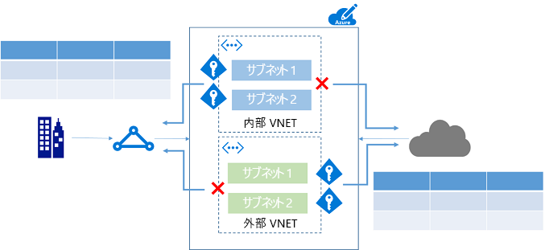
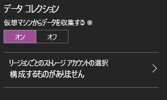

# Azure エンタープライズ スキャフォールディング - 規範的なサブスクリプション ガバナンスAzure enterprise scaffold - prescriptive subscription governance
俊敏性と柔軟性を求めてパブリック クラウドを採用する企業がますます増えています。Enterprises are increasingly adopting the public cloud for its agility and flexibility. これらの企業は、クラウドの強みを活かして収益を生み出したり、ビジネスのリソースを最適化したりしています。They are utilizing the cloud's strengths to generate revenue or optimize resources for the business. Microsoft Azure は、企業がさまざまなワークロードやアプリケーションに対応するためにブロックのように組み立てることができる多数のサービスを提供しています。Microsoft Azure provides a multitude of services that enterprises can assemble like building blocks to address a wide array of workloads and applications. 

しかし、何から始めたらよいのかわからないことも少なくありません。But, knowing where to begin is often difficult. Azure を使用することを決定した後、一般に次のような疑問が生じます。After deciding to use Azure, a few questions commonly arise:

* "特定の国でのデータの主権に関する法的要件を満たすにはどうすればよいか""How do I meet our legal requirements for data sovereignty in certain countries?"
* "重要なシステムが誤って変更されないようにするにはどうすればよいか""How do I ensure that someone does not inadvertently change a critical system?"
* "各リソースがサポートしているものを把握し、その明細を明らかにして正確に課金できるようにするにはどうすればよいか""How do I know what every resource is supporting so I can account for it and bill it back accurately?"

ガード レールのない空のサブスクリプションでは見通しが立ちません。The prospect of an empty subscription with no guard rails is daunting. この空のスペースは、Azure への移行の妨げとなる可能性があります。This blank space can hamper your move to Azure.

この記事は、技術者がガバナンスのニーズに対処し、俊敏性のニーズとのバランスを取る際の出発点となります。This article provides a starting point for technical professionals to address the need for governance, and balance it with the need for agility. この記事では、組織が Azure サブスクリプションを実装および管理する際の指針となるエンタープライズ スキャフォールディングの概念について説明します。It introduces the concept of an enterprise scaffold that guides organizations in implementing and managing their Azure subscriptions. 

## ガバナンスのニーズNeed for governance
Azure に移行する場合、企業内でクラウドを有効に活用するために、早期にガバナンスに対処する必要があります。When moving to Azure, you must address the topic of governance early to ensure the successful use of the cloud within the enterprise. しかし、包括的なガバナンス システムの構築には時間がかかり、煩雑さを伴うため、IT 部門を関与させずに直接ベンダーに依頼するビジネス グループもあります。Unfortunately, the time and bureaucracy of creating a comprehensive governance system means some business groups go directly to vendors without involving enterprise IT. このアプローチでは、リソースが適切に管理されていない場合に、企業が脆弱性にさらされたままになるおそれがあります。This approach can leave the enterprise open to vulnerabilities if the resources are not properly managed. パブリック クラウドの俊敏性、柔軟性、従量課金という特性は、(社内と外部の両方の) 顧客のニーズに速やかに対応する必要があるビジネス グループにとって重要です。The characteristics of the public cloud - agility, flexibility, and consumption-based pricing - are important to business groups that need to quickly meet the demands of customers (both internal and external). ただし、IT 部門はデータとシステムを効果的に保護できるようにする必要があります。But, enterprise IT needs to ensure that data and systems are effectively protected.

実際には、スキャフォールディングを使用して構造の基礎を作成します。In real life, scaffolding is used to create the basis of the structure. スキャフォールディングは概要を示し、より永続的なシステムを実装するためのアンカー ポイントを提供します。The scaffold guides the general outline, and provides anchor points for more permanent systems to be mounted. エンタープライズ スキャフォールディングも同様であり、環境を構造化する一連の柔軟な制御と Azure の機能、およびパブリック クラウド上に構築されるサービスのアンカーを提供します。An enterprise scaffold is the same: a set of flexible controls and Azure capabilities that provide structure to the environment, and anchors for services built on the public cloud. エンタープライズ スキャフォールディングは、ビルダー (IT 部門とビジネス グループ) が新しいサービスを作成し、配置するための基盤となります。It provides the builders (IT and business groups) a foundation to create and attach new services.

スキャフォールディングは、さまざまな規模のクライアントとの多数の取り組みの中で収集された実践に基づいています。The scaffold is based on practices we have gathered from many engagements with clients of various sizes. これらのクライアントは、クラウドでソリューションを開発している小規模の組織から、クラウドでソリューションの移行と開発を行っている Fortune 500 の企業や独立系ソフトウェア ベンダーまでさまざまです。Those clients range from small organizations developing solutions in the cloud to Fortune 500 enterprises and independent software vendors who are migrating and developing solutions in the cloud. エンタープライズ スキャフォールディングは、従来型 IT ワークロードとアジャイル ワークロード (Azure の機能に基づくサービスとしてのソフトウェア (SaaS) アプリケーションの開発など) の両方を柔軟にサポートできるように設計されています。The enterprise scaffold is "purpose-built" to be flexible to support both traditional IT workloads and agile workloads; such as, developers creating software-as-a-service (SaaS) applications based on Azure capabilities.

エンタープライズ スキャフォールディングは、Azure 内の新しい各サブスクリプションの基盤として使用することを目的としています。The enterprise scaffold is intended to be the foundation of each new subscription within Azure. エンタープライズ スキャフォールディングにより、管理者は、ビジネス グループや開発者が各自の目標を速やかに達成するのを妨げることなく、組織のガバナンスの最小要件を満たすワークロードを実現できます。It enables administrators to ensure workloads meet the minimum governance requirements of an organization without preventing business groups and developers from quickly meeting their own goals.

> [!IMPORTANT]
> ガバナンスは Azure の成功に不可欠です。Governance is crucial to the success of Azure. この記事は、エンタープライズ スキャフォールディングの技術的な実装を対象としていますが、広範なプロセスとコンポーネント間の関係だけを取り上げています。This article targets the technical implementation of an enterprise scaffold but only touches on the broader process and relationships between the components. ポリシー ガバナンスのフローはトップダウンであり、その企業が目指していることによって決まります。Policy governance flows from the top down and is determined by what the business wants to achieve. 当然ながら、Azure のガバナンス モデルの作成には IT 部門の担当者が参加しますが、さらに重要なことは、ビジネス グループのリーダーの有力な代表者とセキュリティおよびリスク管理部門も参加することです。Naturally, the creation of a governance model for Azure includes representatives from IT, but more importantly it should have strong representation from business group leaders, and security and risk management. 要するに、エンタープライズ スキャフォールディングとは、ビジネス リスクを軽減して組織の任務や目的を推進することです。In the end, an enterprise scaffold is about mitigating business risk to facilitate an organization's mission and objectives.
> 
> 

次の図は、スキャフォールディングのコンポーネントを示しています。The following image describes the components of the scaffold. 基礎は、部門、アカウント、サブスクリプションの確かな計画に依存しています。The foundation relies on a solid plan for departments, accounts, and subscriptions. 柱は、Resource Manager ポリシーと厳密な命名規則で構成されます。The pillars consist of Resource Manager policies and strong naming standards. スキャフォールディングの残りの部分は、安全で管理しやすい環境を実現する Azure のコア機能に基づきます。The rest of the scaffold comes from core Azure capabilities and features that enable a secure and manageable environment.

> [!NOTE]
> Azure は、2008 年に導入されて以来、急成長してきました。Azure has grown rapidly since its introduction in 2008. この成長を実現するために、Microsoft のエンジニアリング チームはサービスの管理とデプロイの方法を再考する必要がありました。This growth required Microsoft engineering teams to rethink their approach for managing and deploying services. 2014 年に導入された Azure Resource Manager モデルは、クラシック デプロイ モデルに代わるものです。The Azure Resource Manager model was introduced in 2014 and replaces the classic deployment model. Resource Manager により、組織は Azure リソースのデプロイ、整理、管理をより簡単に行うことができます。Resource Manager enables organizations to more easily deploy, organize, and control Azure resources. Resource Manager では、相互に依存する複雑なソリューションのデプロイを迅速化するために、リソースの作成時に並列処理が行われます。Resource Manager includes parallelization when creating resources for faster deployment of complex, interdependent solutions. また、きめ細かいアクセス制御が可能であり、メタデータでリソースにタグ付けすることもできます。It also includes granular access control, and the ability to tag resources with metadata. Microsoft では、Resource Manager モデルを使用してすべてのリソースを作成することを推奨しています。Microsoft recommends that you create all resources through the Resource Manager model. エンタープライズ スキャフォールディングは、Resource Manager モデル向けに設計されています。The enterprise scaffold is explicitly designed for the Resource Manager model.
> 
> 

## 階層の定義Define your hierarchy
スキャフォールディングの基盤は、Azure エンタープライズ加入契約 (および Enterprise Portal) です。The foundation of the scaffold is the Azure Enterprise Enrollment (and the Enterprise Portal). エンタープライズ加入契約は、企業内での Azure サービスの構造と使用法を定める、中核となるガバナンス構造です。The enterprise enrollment defines the shape and use of Azure services within a company and is the core governance structure. 顧客は、エンタープライズ契約の範囲内で環境を部門、アカウント、サブスクリプションにさらに分割できます。Within the enterprise agreement, customers are able to further subdivide the environment into departments, accounts, and finally, subscriptions. Azure サブスクリプションは、すべてのリソースが含まれる基本単位です。An Azure subscription is the basic unit where all resources are contained. また、サブスクリプションによって Azure 内での制限 (コア数、リソース数など) が定められます。It also defines several limits within Azure, such as number of cores, resources, etc.

企業はそれぞれ異なるので、前の図の階層はその企業での Azure の構造に非常に柔軟に対応します。Every enterprise is different and the hierarchy in the previous image allows for significant flexibility in how Azure is organized within the company. このドキュメントに記載されたガイダンスを実践する前に、実際の階層をモデル化し、課金、リソース アクセス、複雑さへの影響を理解しておく必要があります。Before implementing the guidance contained in this document, you should model your hierarchy and understand the impact on billing, resource access, and complexity.

Azure の加入契約には、次の 3 つの一般的なパターンがあります。The three common patterns for Azure Enrollments are:

* **機能**パターンThe **functional** pattern
  
    
* **部署**パターンThe **business unit** pattern 
  
    
* **地域**パターンThe **geographic** pattern
  
    

企業のガバナンス要件をサブスクリプションにも適用するために、サブスクリプション レベルでスキャフォールディングを適用します。You apply the scaffold at the subscription level to extend the governance requirements of the enterprise into the subscription.

## 命名規則Naming standards
スキャフォールディングの最初の柱は命名規則です。The first pillar of the scaffold is naming standards. 適切に設計された命名規則を使用することで、ポータル、請求書、スクリプトでリソースを識別できるようになります。Well-designed naming standards enable you to identify resources in the portal, on a bill, and within scripts. ほとんどの場合、オンプレミスのインフラストラクチャの命名規則が既にあります。Most likely, you already have naming standards for on-premises infrastructure. Azure を環境に追加するときは、それらの命名規則をAzure リソースにも適用する必要があります。When adding Azure to your environment, you should extend those naming standards to your Azure resources. 命名規則により、あらゆるレベルで環境のより効率的な管理が促進されます。Naming standard facilitate more efficient management of the environment at all levels.

> [!TIP]
> 命名規則のヒントFor naming conventions:
> * [パターンと実践のガイダンス](../best-practices/naming-conventions.md)を確認し、可能であれば採用してください。Review and adopt where possible the [Patterns and Practices guidance](../best-practices/naming-conventions.md). このガイダンスは意味のある命名規則を決定するうえで役立ちます。This guidance helps you decide on a meaningful naming standard.
> * リソースの名前にキャメルケースを使用します (myResourceGroup や vnetNetworkName など)。Use camelCasing for names of resources (such as myResourceGroup and vnetNetworkName). 注: 小文字のみを使用し、他の特殊文字は使用できないリソース (ストレージ アカウントなど) もあります。Note: There are certain resources, such as storage accounts, where the only option is to use lower case (and no other special characters).
> * Azure Resource Manager ポリシー (次のセクションで説明) を使用して命名規則を適用することを検討します。Consider using Azure Resource Manager policies (described in the next section) to enforce naming standards.
> 
> 以上のヒントを活用すれば、一貫性のある命名規則を実装できます。The preceding tips help you implement a consistent naming convention.

## ポリシーと監査Policies and auditing
スキャフォールディングの 2 つ目の柱には、[Azure ポリシー](/azure/azure-policy/azure-policy-introduction)の作成と[アクティビティ ログの監査](/azure/azure-resource-manager/resource-group-audit)が含まれます。The second pillar of the scaffold involves creating [Azure policies](/azure/azure-policy/azure-policy-introduction) and [auditing the activity log](/azure/azure-resource-manager/resource-group-audit). Resource Manager ポリシーにより、Azure でのリスクを管理できます。Resource Manager policies provide you with the ability to manage risk in Azure. 特定のアクションを制限、強制、または監査してデータの主権を確保するポリシーを定義できます。You can define policies that ensure data sovereignty by restricting, enforcing, or auditing certain actions. 

* ポリシーは既定の**許可**システムです。Policy is a default **allow** system. リソースに対するアクションを拒否または監査するポリシーを定義してリソースに割り当てることで、アクションを制御します。You control actions by defining and assigning policies to resources that deny or audit actions on resources.
* ポリシーは、ポリシー定義言語 (if-then 条件) でのポリシー定義で示されます。Policies are described by policy definitions in a policy definition language (if-then conditions).
* ポリシーは、JSON (Javascript Object Notation) 形式のファイルを使用して作成します。You create polices with JSON (Javascript Object Notation) formatted files. ポリシーを定義したら、特定のスコープ (サブスクリプション、リソース グループ、またはリソース) に割り当てます。After defining a policy, you assign it to a particular scope: subscription, resource group, or resource.

ポリシーには、実際のシナリオのきめ細かなアプローチを可能にする複数のアクションが含まれます。Policies have multiple actions that allow for a fine-grained approach to your scenarios. アクションは次のとおりです。The actions are:

* **拒否**: リソース要求をブロックします。**Deny**: Blocks the resource request
* **監査**: 要求を許可しますが、アクティビティ ログに行を追加します (アクティビティ ログを使用してアラートを提供したり、Runbook をトリガーしたりできます)。**Audit**: Allows the request but adds a line to the activity log (which can be used to provide alerts or to trigger runbooks)
* **追加**: 指定した情報をリソースに追加します。**Append**: Adds specified information to the resource. たとえば、リソースに "CostCenter" タグがない場合、このタグを既定値で追加します。For example, if there is not a "CostCenter" tag on a resource, add that tag with a default value.

### Resource Manager ポリシーの一般的な使用法Common uses of Resource Manager policies
Azure Resource Manager ポリシーは、Azure Toolkit の強力なツールの 1 つです。Azure Resource Manager policies are a powerful tool in the Azure toolkit. Resource Manager ポリシーにより、予想外のコストを回避したり、タグ付けによってリソースのコスト センターを特定したりできます。また、コンプライアンス要件を確実に満たすこともできます。They enable you to avoid unexpected costs, to identify a cost center for resources through tagging, and to ensure that compliancy requirements are met. ポリシーを組み込みの監査機能と組み合わせると、複雑で柔軟性のあるソリューションを作成できます。When policies are combined with the built-in auditing features, you can fashion complex and flexible solutions. ポリシーを使用することで、企業は "従来型 IT" ワークロードと "アジャイル" ワークロード (顧客アプリケーションの開発など) を管理できます。Policies allow companies to provide controls for "Traditional IT" workloads and "Agile" workloads; such as, developing customer applications. ポリシーの最も一般的なパターンは次のとおりです。The most common patterns we see for policies are:

* **地域コンプライアンス/データの主権** - Azure は世界中のリージョンを提供しています。**Geo-compliance/data sovereignty** - Azure provides regions across the world. 多くの場合、(目的がデータの主権を確保することか、リソースのエンド ユーザーの近くにリソースを作成することかを問わず) 企業はリソースを作成する場所を制御することを望んでいます。Enterprises often wish to control where resources are created (whether to ensure data sovereignty or just to ensure resources are created close to the end consumers of the resources).
* **コスト管理** - Azure サブスクリプションには、さまざまな種類と規模のリソースを含めることができます。**Cost management** - An Azure subscription can contain resources of many types and scale. 多くの場合、企業は標準サブスクリプションで、月に数百ドル以上のコストがかかる可能性のある大規模なリソースを不必要に使用しないようにすることを望んでいます。Corporations often wish to ensure that standard subscriptions avoid using unnecessarily large resources, which can cost hundreds of dollars a month or more.
* **必須のタグによる既定のガバナンス** - タグの要求は、最も一般的で非常に望ましい機能の 1 つです。**Default governance through required tags** - Requiring tags is one of the most common and highly desired features. Azure Resource Manager ポリシーを使用すると、リソースに適切にタグ付けすることができます。Using Azure Resource Manager Policies enterprises are able to ensure that a resource is appropriately tagged. 最も一般的なタグは、Department、Resource Owner、Environment (運用、テスト、開発など) です。The most common tags are: Department, Resource Owner, and Environment type (for example - production, test, development)

**例****Examples**

基幹業務アプリケーションの "従来型 IT" サブスクリプション"Traditional IT" subscription for line-of-business applications

* すべてのリソースに Department タグと Owner タグを適用するEnforce Department and Owner tags on all resources
* リソースの作成を北米リージョンに制限するRestrict resource creation to the North American Region
* G シリーズ VM と HDInsight クラスターを作成する機能を制限するRestrict the ability to create G-Series VMs and HDInsight Clusters

クラウド アプリケーションを作成する部署の "アジャイル" 環境"Agile" Environment for a business unit creating cloud applications

* データの主権要件を満たすために、特定のリージョンでのみリソースの作成を許可する。To meet data sovereignty requirements, allow the creation of resources ONLY in a specific region.
* すべてのリソースに Environment タグを適用する。Enforce Environment tag on all resources. リソースがタグなしで作成された場合は、**Environment: Unknown** タグをリソースに追加する。If a resource is created without a tag, append the **Environment: Unknown** tag to the resource.
* リソースが北米以外で作成されたときに監査する (ただし、リソースの作成を妨げない)。Audit when resources are created outside of North America but do not prevent.
* 高コストのリソースが作成されたときに監査する。Audit when high-cost resources are created.

> [!TIP]
> 組織での Resource Manager ポリシーの最も一般的な使用法は、リソースを作成できる*場所*と作成できるリソースの*種類*の制御です。The most common use of Resource Manager policies across organizations is to control *where* resources can be created and *what* types of resources can be created. 多くの企業では、*場所*と*種類*を制御するだけでなく、従量課金のために、ポリシーを使用してリソースに適切なメタデータが含まれるようにしています。In addition to providing controls on *where* and *what*, many enterprises use policies to ensure resources have the appropriate metadata to bill back for consumption. 以下に関するポリシーは、サブスクリプション レベルで適用することをお勧めします。We recommend applying policies at the subscription level for:
> 
> * 地域コンプライアンス/データの主権Geo-compliance/data sovereignty
> * コスト管理Cost management
> * 必須タグ (BillTo、Application Owner など、ビジネス ニーズに基づいて決定)Required tags (Determined by business need, such as BillTo, Application Owner)
> 
> 下位レベルのスコープで追加のポリシーを適用できます。You can apply additional policies at lower levels of scope.
> 
> 

### 監査 - 状況の把握Audit - what happened?
環境がどのように機能しているかを確認するには、ユーザー アクティビティを監査する必要があります。To view how your environment is functioning, you need to audit user activity. Azure 内のほとんどの種類のリソースで診断ログが作成されます。診断ログは、ログ ツールまたは Azure Log Analytics で分析できます。Most resource types within Azure create diagnostic logs that you can analyze through a log tool or in Azure Log Analytics. 複数のサブスクリプションのアクティビティ ログを収集して、部門別ビューやエンタープライズ ビューを提供できます。You can gather activity logs across multiple subscriptions to provide a departmental or enterprise view. 監査レコードは重要な診断ツールであると同時に、Azure 環境内でイベントをトリガーする重要なメカニズムでもあります。Audit records are both an important diagnostic tool and a crucial mechanism to trigger events in the Azure environment.

Resource Manager デプロイメントのアクティビティ ログにより、実行された**操作**とそれらの操作を実行したユーザーを確認できます。Activity logs from Resource Manager deployments enable you to determine the **operations** that took place and who performed them. アクティビティ ログは、Log Analytics などのツールを使用して収集および集計できます。Activity logs can be collected and aggregated using tools like Log Analytics.

## リソース タグResource tags
組織のユーザーはサブスクリプションにリソースを追加するので、適切な部門、顧客、環境にリソースを関連付けることがますます重要になります。As users in your organization add resources to the subscription, it becomes increasingly important to associate resources with the appropriate department, customer, and environment. [タグ](/azure/azure-resource-manager/resource-group-using-tags)を使用することで、リソースにメタデータを添付できます。You can attach metadata to resources through [tags](/azure/azure-resource-manager/resource-group-using-tags). タグを使用して、リソースや所有者に関する情報を提供します。You use tags to provide information about the resource or the owner. タグを使用すると、さまざまな方法でリソースを集計し、グループ化できるだけでなく、配賦のためにそのデータを使用できます。Tags enable you to not only aggregate and group resources in various ways, but use that data for the purposes of chargeback. リソースには、最大 15 組のキーと値のペアでタグ付けできます。You can tag resources with up to 15 key:value pairs. 

リソース タグには柔軟性があるので、ほとんどのリソースに付ける必要があります。Resource tags are flexible and should be attached to most resources. 一般的なリソース タグの例を次に示します。Examples of common resource tags are:

* BillToBillTo
* Department (または Business Unit)Department (or Business Unit)
* Environment (Production、Stage、Development)Environment (Production, Stage, Development)
* Tier (Web Tier、Application Tier)Tier (Web Tier, Application Tier)
* Application OwnerApplication Owner
* ProjectNameProjectName

タグのその他の例については、「[Recommended naming conventions for Azure resources (Azure リソースの推奨される名前付け規則)](../best-practices/naming-conventions.md)」をご覧ください。For more examples of tags, see [Recommended naming conventions for Azure resources](../best-practices/naming-conventions.md).

> [!TIP]
> 以下についてタグ付けすることを必須にするポリシーの作成を検討してください。Consider making a policy that mandates tagging for:
> 
> * リソース グループResource groups
> * StorageStorage
> * Virtual MachinesVirtual Machines
> * アプリケーション サービス環境/Web サーバーApplication Service Environments/web servers
> 
> このタグ付け戦略によって、ビジネス、財務、セキュリティ、リスク管理、環境の全体的な管理に必要なメタデータをサブスクリプションで特定できます。This tagging strategy identifies across your subscriptions what metadata is needed for the business, finance, security, risk management, and overall management of the environment. 

## リソース グループResource group
Resource Manager では、管理、課金、または自然なアフィニティのために、リソースを意味のあるグループに配置できます。Resource Manager enables you to put resources into meaningful groups for management, billing, or natural affinity. 前述のように、Azure には 2 つのデプロイメント モデルがあります。As mentioned earlier, Azure has two deployment models. 初期のクラシック モデルでは、管理の基本単位はサブスクリプションでした。In the earlier Classic model, the basic unit of management was the subscription. サブスクリプション内でリソースを分類するのが難しかったことから、多数のサブスクリプションが作成されていました。It was difficult to break down resources within a subscription, which led to the creation of large numbers of subscriptions. Resource Manager モデルでリソース グループが導入されました。With the Resource Manager model, we saw the introduction of resource groups. リソース グループは、共通のライフサイクルを持つリソースまたは "all SQL servers" や "Application A" などの属性を共有するリソースのコンテナーです。Resource groups are containers of resources that have a common lifecycle or share an attribute such as "all SQL servers" or "Application A".

リソース グループに別のリソース グループを含めることはできません。また、リソースは 1 つのリソース グループにのみ属することができます。Resource groups cannot be contained within each other and resources can only belong to one resource group. リソース グループのすべてのリソースに対して特定のアクションを適用できます。You can apply certain actions on all resources in a resource group. たとえば、リソース グループを削除すると、そのリソース グループ内のすべてのリソースが削除されます。For example, deleting a resource group removes all resources within the resource group. 通常は、アプリケーション全体または関連するシステムを同じリソース グループに配置します。Typically, you place an entire application or related system in the same resource group. たとえば、Contoso Web アプリケーションという 3 層アプリケーションでは、Web サーバー、アプリケーション サーバー、SQL Server が同じリソース グループに含まれます。For example, a three-tier application called Contoso Web Application would contain the web server, application server and SQL server in the same resource group.

> [!TIP]
> リソース グループを整理する方法は、"従来型 IT" ワークロードと "アジャイル IT" ワークロードで異なる場合があります。How you organize your resource groups may vary from "Traditional IT" workloads to "Agile IT" workloads:
> 
> * "従来型 IT" ワークロードは、同じライフサイクル内の項目 (アプリケーションなど) でグループ化するのが最も一般的です。"Traditional IT" workloads are most commonly grouped by items within the same lifecycle, such as an application. アプリケーションでグループ化すると、個々のアプリケーションの管理が可能になります。Grouping by application allows for individual application management.
> * "アジャイル IT" ワークロードは、外部顧客向けのクラウド アプリケーションに集中する傾向があります。"Agile IT" workloads tend to focus on external customer-facing cloud applications. リソース グループは、デプロイメントのレイヤー (Web 層、アプリケーション層など) と管理のレイヤーを反映する必要があります。The resource groups should reflect the layers of deployment (such as Web Tier, App Tier) and management.
> 
> ワークロードを理解すると、リソース グループ戦略の開発に役立ちます。Understanding your workload helps you develop a resource group strategy.

## ロールベースのアクセス制御Role-based access control
「リソースにアクセスできる必要があるのはだれか」、You probably are asking yourself "who should have access to resources?" 「このアクセスを制御するにはどうすればよいか」と自問しているかもしれません。and "how do I control this access?" Azure Portal へのアクセスの許可または拒否と、ポータルでのリソースへのアクセスの制御は非常に重要です。Allowing or disallowing access to the Azure portal, and controlling access to resources in the portal is crucial. 

Azure が最初にリリースされたときには、サブスクリプションに対するアクセス制御が基本でした (管理者または共同管理者)。When Azure was initially released, access controls to a subscription were basic: Administrator or Co-Administrator. クラシック モデルでのサブスクリプションへのアクセスは、ポータルでのすべてのリソースへのアクセスを意味していました。Access to a subscription in the Classic model implied access to all the resources in the portal. きめ細かく制御することができなかったため、Azure 加入契約に一定レベルの妥当なアクセス制御を提供するためにサブスクリプションが急増しました。This lack of fine-grained control led to the proliferation of subscriptions to provide a level of reasonable access control for an Azure Enrollment.

このようにサブスクリプションを急増させる必要はなくなりました。This proliferation of subscriptions is no longer needed. ロールベースのアクセス制御により、ユーザーを標準ロール (一般的な "リーダー" および "ライター" タイプのロールなど) を割り当てることができます。With role-based access control, you can assign users to standard roles (such as common "reader" and "writer" types of roles). また、カスタム ロールを定義することもできます。You can also define custom roles.

> [!TIP]
> ロールベースのアクセス制御を実装する方法To implement role-based access control:
> * AD Connect ツールを使用して企業 ID ストア (Active Directory が最も一般的) を Azure Active Directory に接続します。Connect your corporate identity store (most commonly Active Directory) to Azure Active Directory using the AD Connect tool.
> * 管理された ID を使用して、サブスクリプションの管理者/共同管理者を管理します。Control the Admin/Co-Admin of a subscription using a managed identity. 管理者/共同管理者を新しいサブスクリプション所有者に**割り当てないでください**。**Don't** assign Admin/Co-admin to a new subscription owner. 代わりに、RBAC ロールを使用して、グループまたは個々のユーザーに**所有者**権限を付与します。Instead, use RBAC roles to provide **Owner** rights to a group or individual.
> * Azure ユーザーを Active Directory のグループ (アプリケーション X の所有者など) に追加します。Add Azure users to a group (for example, Application X Owners) in Active Directory. 同期されたグループを使用して、アプリケーションが属するリソース グループを管理するための適切な権限をグループのメンバーに付与します。Use the synced group to provide group members the appropriate rights to manage the resource group containing the application.
> * 求められている作業を行うために必要な**最小限の特権**の付与の原則に従います。Follow the principle of granting the **least privilege** required to do the expected work. 例: For example:
>   * デプロイメント グループ: リソースのデプロイだけを実行できるグループ。Deployment Group: A group that is only able to deploy resources.
>   * 仮想マシン管理: (運用のために) VM を再起動できるグループ。Virtual Machine Management: A group that is able to restart VMs (for operations)
> 
> これらのヒントを活用すると、サブスクリプション間のユーザー アクセスを管理できます。These tips help you manage user access across your subscription.

## Azure のリソース ロックAzure resource locks
組織ではサブスクリプションにコア サービスを追加するので、ビジネスが中断されないように、それらのサービスの可用性を確保することがますます重要になります。As your organization adds core services to the subscription, it becomes increasingly important to ensure that those services are available to avoid business disruption. [リソース ロック](/azure/azure-resource-manager/resource-group-lock-resources)を使用すると、変更または削除したときにアプリケーションやクラウド インフラストラクチャに大きな影響を及ぼす価値の高いリソースに対する操作を制限できます。[Resource locks](/azure/azure-resource-manager/resource-group-lock-resources) enable you to restrict operations on high-value resources where modifying or deleting them would have a significant impact on your applications or cloud infrastructure. ロックは、サブスクリプション、リソース グループ、またはリソースに適用できます。You can apply locks to a subscription, resource group, or resource. 通常は、仮想ネットワーク、ゲートウェイ、ストレージ アカウントなどの基本的なリソースにロックを適用します。Typically, you apply locks to foundational resources such as virtual networks, gateways, and storage accounts. 

リソース ロックでは、CanNotDelete と ReadOnly の 2 つの値を現在サポートしています。Resource locks currently support two values: CanNotDelete and ReadOnly. CanNotDelete では、(適切な権限を持つ) ユーザーはリソースの読み取りまたは変更を引き続き行うことができますが、リソースを削除することはできません。CanNotDelete means that users (with the appropriate rights) can still read or modify a resource but cannot delete it. ReadOnly では、許可されたユーザーがリソースを削除することも変更することもできません。ReadOnly means that authorized users can't delete or modify a resource.

管理ロックを作成または削除するには、`Microsoft.Authorization/*` または `Microsoft.Authorization/locks/*` アクションにアクセスできる必要があります。To create or delete management locks, you must have access to `Microsoft.Authorization/*` or `Microsoft.Authorization/locks/*` actions.
組み込みロールのうち、所有者とユーザー アクセス管理者にのみこれらのアクションが許可されています。Of the built-in roles, only Owner and User Access Administrator are granted those actions.

> [!TIP]
> コア ネットワーク オプションは、ロックで保護する必要があります。Core network options should be protected with locks. ゲートウェイのサイト間 VPN が誤って削除されると、Azure サブスクリプションに大きな被害を及ぼします。Accidental deletion of a gateway, site-to-site VPN would be disastrous to an Azure subscription. Azure では、使用中の仮想ネットワークを削除することはできませんが、さらに厳しい制限を適用すれば有益な予防措置になります。Azure doesn't allow you to delete a virtual network that is in use, but applying more restrictions is a helpful precaution. 
> 
> * 仮想ネットワーク: CanNotDeleteVirtual Network: CanNotDelete
> * ネットワーク セキュリティ グループ: CanNotDeleteNetwork Security Group: CanNotDelete
> * ポリシー: CanNotDeletePolicies: CanNotDelete
> 
> また、適切な制御を維持するには、ポリシーが不可欠となります。Policies are also crucial to the maintenance of appropriate controls. 使用中のポリシーに、**CanNotDelete** ロックを適用することをお勧めします。We recommend that you apply a **CanNotDelete** lock to polices that are in use.

## コア ネットワーク リソースCore networking resources
リソースへのアクセスは内部 (企業のネットワーク内) の場合もあれば、外部 (インターネット経由) の場合もあります。Access to resources can be either internal (within the corporation's network) or external (through the internet). 組織のユーザーは誤って不適切な場所にリソースを配置しがちであり、リソースが悪意のあるアクセスにさらされる可能性があります。It is easy for users in your organization to inadvertently put resources in the wrong spot, and potentially open them to malicious access. オンプレミスのデバイスと同様に、企業は Azure ユーザーが正しく判断できるように適切な制御を追加する必要があります。As with on-premises devices, enterprises must add appropriate controls to ensure that Azure users make the right decisions. Microsoft では、サブスクリプション ガバナンスのために、基本的なアクセス制御を提供するコア リソースを特定しました。For subscription governance, we identify core resources that provide basic control of access. コア リソースは以下で構成されます。The core resources consist of:

* **仮想ネットワーク**は、サブネットのコンテナー オブジェクトです。**Virtual networks** are container objects for subnets. 必須ではありませんが、多くの場合、アプリケーションを内部の企業リソースに接続するときに使用されます。Though not strictly necessary, it is often used when connecting applications to internal corporate resources.
* **ネットワーク セキュリティ グループ**はファイアウォールに似ており、リソースがネットワーク上で通信する方法に関するルールを提供します。**Network security groups** are similar to a firewall and provide rules for how a resource can "talk" over the network. ネットワーク セキュリティ グループでは、サブネット (または仮想マシン) がインターネットや同じ仮想ネットワーク内の他のサブネットに接続する方法と条件を細かく制御できます。They provide granular control over how/if a subnet (or virtual machine) can connect to the Internet or other subnets in the same virtual network.

> [!TIP]
> ネットワークのヒントFor networking:
> * 外部接続ワークロードと内部接続ワークロード専用の仮想ネットワークを作成します。Create virtual networks dedicated to external-facing workloads and internal-facing workloads. この方法により、外部に接続する領域に内部ワークロード向けの仮想マシンを誤って配置する可能性が低減されます。This approach reduces the chance of inadvertently placing virtual machines that are intended for internal workloads in an external facing space.
> * アクセスを制限するネットワーク セキュリティ グループを構成します。Configure network security groups to limit access. 少なくとも、内部仮想ネットワークからインターネットへのアクセスをブロックし、外部仮想ネットワークから企業ネットワークへのアクセスをブロックします。At a minimum, block access to the internet from internal virtual networks, and block access to the corporate network from external virtual networks.
> 
> これらのヒントを使用すると、安全なネットワーク リソースを実装できます。These tips help you implement secure networking resources.

### AutomationAutomation
リソースを個別に管理すると、時間がかかるだけでなく、特定の操作でエラーが発生しやすくなる可能性があります。Managing resources individually is both time-consuming and potentially error prone for certain operations. Azure には、Azure Automation、Logic Apps、Azure Functions などの各種自動化機能が用意されています。Azure provides various automation capabilities including Azure Automation, Logic Apps, and Azure Functions. [Azure Automation](/azure/automation/automation-intro) では、管理者はリソース管理の一般的なタスクを処理する Runbook を作成し、定義できます。[Azure Automation](/azure/automation/automation-intro) enables administrators to create and define runbooks to handle common tasks in managing resources. Runbook は、PowerShell コード エディターまたはグラフィカル エディターを使用して作成します。You create runbooks by using either a PowerShell code editor or a graphical editor. 複雑な多段階のワークフローを作成できます。You can produce complex multi-stage workflows. Azure Automation は、未使用のリソースのシャットダウンや、人の介入を必要とせずに特定のトリガーに応答して実行されるリソースの作成など、一般的なタスクの処理によく使用されます。Azure Automation is often used to handle common tasks such as shutting down unused resources, or creating resources in response to a specific trigger without needing human intervention.

> [!TIP]
> Automation のヒントFor automation:
> * Azure Automation アカウントを作成し、[Runbook ギャラリー](/azure/automation/automation-runbook-gallery)で提供される使用可能な Runbook (グラフィカルとコマンド ライン) を確認します。Create an Azure Automation account and review the available runbooks (both graphical and command line) available in the [Runbook Gallery](/azure/automation/automation-runbook-gallery).
> * 重要な Runbook をインポートし、独自の用途に合わせてカスタマイズします。Import and customize key runbooks for your own use.
> 
> 一般的なシナリオとして、仮想マシンをスケジュールどおりに起動およびシャットダウンできます。A common scenario is the ability to Start/Shutdown virtual machines on a schedule. このシナリオに対応し、シナリオを拡張する方法を示す Runbook の例をギャラリーで入手できます。There are example runbooks that are available in the Gallery that both handle this scenario and teach you how to expand it.
> 
> 

## Azure Security CenterAzure Security Center
クラウド導入の最大の障壁の 1 つが、セキュリティに対する懸念でした。Perhaps one of the biggest blockers to cloud adoption has been the concerns over security. IT リスク マネージャーとセキュリティ部門は、Azure 内のリソースのセキュリティを確保する必要があります。IT risk managers and security departments need to ensure that resources in Azure are secure. 

[Azure Security Center](/azure/security-center/security-center-intro) では、サブスクリプション内のリソースのセキュリティの状態を一元的に表示することができ、リソースの侵害を防ぐうえで役立つ推奨事項が提供されます。The [Azure Security Center](/azure/security-center/security-center-intro) provides a central view of the security status of resources in the subscriptions, and provides recommendations that help prevent compromised resources. また、より詳細なポリシーを設定することもできます (たとえば、特定のリソース グループにポリシーを適用して、企業が対処しようとしているリスクへの対策を調整できます)。It can enable more granular policies (for example, applying policies to specific resource groups that allow the enterprise to tailor their posture to the risk they are addressing). Azure Security Center はオープン プラットフォームです。Microsoft のパートナーと独立系ソフトウェア ベンダーは、Azure Security Center に接続して機能を強化するソフトウェアを作成できます。Finally, Azure Security Center is an open platform that enables Microsoft partners and independent software vendors to create software that plugs into Azure Security Center to enhance its capabilities. 

> [!TIP]
> 各サブスクリプションで、Azure Security Center は既定で有効になっています。Azure Security Center is enabled by default in each subscription. ただし、Azure Security Center がエージェントをインストールし、データの収集を開始できるようにするには、仮想マシンからデータ収集を有効にする必要があります。However, you must enable data collection from virtual machines to allow Azure Security Center to install its agent and begin gathering data.
> 
> 
> 
> 

## 次の手順Next steps
* ここでは、サブスクリプション ガバナンスについて説明しました。次に、これらの推奨事項を実際に確認してください。Now that you have learned about subscription governance, it's time to see these recommendations in practice. [Azure サブスクリプション ガバナンスの実装例](subscription-governance-examples.md)をご覧ください。See [Examples of implementing Azure subscription governance](subscription-governance-examples.md).
