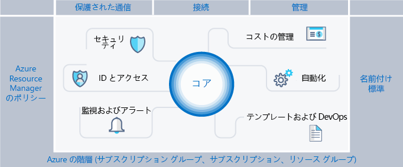
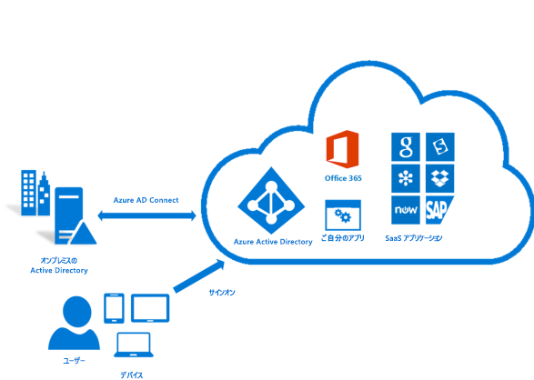
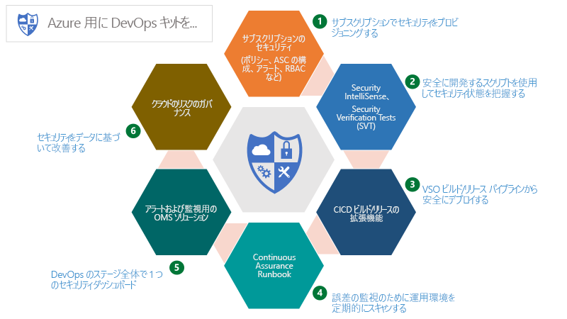
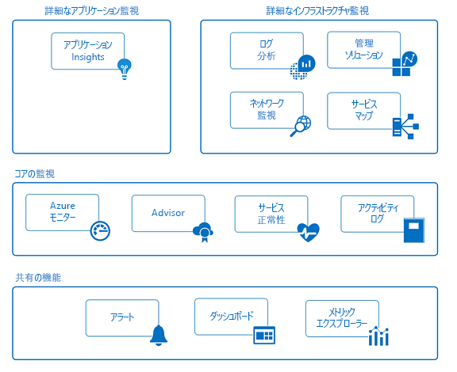

# Azure エンタープライズ スキャフォールディング:サブスクリプションの規範的なガバナンス

俊敏性と柔軟性を求めてパブリック クラウドを採用する企業がますます増えています。 これらの企業は、収益を生み出したり、ビジネスのリソース使用状況を最適化したりするために、クラウドの強みに依存しています。 Microsoft Azure は、企業がさまざまなワークロードやアプリケーションに対応するためにブロックのように組み立てることができる多数のサービスと機能を提供しています。

Microsoft Azure の使用を決定することは、クラウドのメリットを実現する最初のステップに過ぎません。 次のステップは、企業が効果的に Azure を利用するための方法を理解して、次の質問に対応できるように設定する必要があるベースライン機能を特定することです。

* "データの主権に懸念があります。自分のデータとシステムが規制要件を満たすことをどのように保証できるか"
* "各リソースがサポートしているものを把握し、その明細を明らかにして正確に課金できるようにするにはどうすればよいか"
* "パブリック クラウドでのデプロイや処理はすべて、セキュリティを最重要として開始されることを確認する必要があります。そのためには何をすべきか"

ガードレールのない空のサブスクリプションでは見通しが立ちません。 この空のスペースは、Azure への移行の妨げとなる可能性があります。

この記事は、技術者がガバナンスのニーズに対処し、俊敏性のニーズとのバランスを取る際の出発点となります。 この記事では、組織が安全な方法で Azure 環境を実装および管理する際の指針となるエンタープライズ スキャフォールディングの概念について説明します。 こうして提供されるフレームワークが、効果的かつ効率的な管理につながります。

## ガバナンスのニーズ

Azure に移行する場合、企業内でクラウドを有効に活用するために、早期にガバナンスに対処する必要があります。 しかし、包括的なガバナンス システムの構築には時間がかかり、煩雑さを伴うため、IT 部門を関与させずに直接プロバイダーに依頼するビジネス グループもあります。 このアプローチでは、リソースが適切に管理されていない場合に、企業がセキュリティ侵害にさらされるおそれがあります。 パブリック クラウドの俊敏性、柔軟性、従量課金という特性は、(社内と外部の両方の) 顧客のニーズに速やかに対応する必要があるビジネス グループにとって重要です。 ただし、IT 部門はデータとシステムを効果的に保護できるようにする必要があります。

ビルを建てるとき、スキャフォールディング (足場) は構造の基礎を作るために使用されます。 スキャフォールディングは概要を示し、より永続的なシステムを実装するためのアンカー ポイントを提供します。 エンタープライズ スキャフォールディングも同様であり、環境を構造化する一連の柔軟な制御と Azure の機能、およびパブリック クラウド上に構築されるサービスのアンカーを提供します。 エンタープライズ スキャフォールディングは、迅速に提供することに配慮した、ビルダー (IT 部門とビジネス グループ) が新しいサービスを作成して配置するための基盤となります。

スキャフォールディングは、さまざまな規模のクライアントとの多数の取り組みの中で収集された実践に基づいています。 これらのクライアントは、小規模の組織から、クラウドでソリューションの移行と開発を行っている大規模な多国籍企業や独立系ソフトウェア ベンダーまでさまざまです。ワークロードを移行したり、クラウド用ソリューションを開発したりしています。 エンタープライズ スキャフォールディングは、従来型 IT ワークロードとアジャイル ワークロード (Azure プラットフォームの機能に基づくサービスとしてのソフトウェア (SaaS) アプリケーションの開発など) の両方を柔軟にサポートできるように設計されています。

エンタープライズ スキャフォールディングは、Azure 内の新しい各サブスクリプションの基盤として使用することを目的としています。 エンタープライズ スキャフォールディングにより、管理者は、ビジネス グループや開発者が各自の目標を速やかに達成するのを妨げることなく、組織のガバナンスの最小要件を満たすワークロードを実現できます。 私たちの経験から、これがパブリック クラウドの成長を妨げるものではなく、成長の速度を大いに速めることは明らかです。

> [!NOTE]
> [Azure Blueprints](/azure/governance/blueprints/overview) と呼ばれる新機能がプレビューとしてリリースされました。これは、サブスクリプションや管理グループにまたがって、共通のイメージ、テンプレート、ポリシー、スクリプトの、パッケージ化、管理、およびデプロイを行えるようにするものです。 この機能は、参照モデルとしてのスキャフォールディングの目的と、企業へのモデルのデプロイの橋渡しをします。
>
次の図は、スキャフォールディングのコンポーネントを示しています。 基礎は、管理階層とサブスクリプションの確かな計画に依存しています。 柱は、Resource Manager ポリシーと厳密な命名規則で構成されます。 スキャフォールディングの残りの部分は、安全で管理しやすい環境を実現して結び付ける Azure のコア機能です。

## 階層の定義

スキャフォールディングの基盤は、サブスクリプションとリソース グループにおける Azure エンタープライズ加入契約の階層とリレーションシップです。 エンタープライズ加入契約は、契約の観点から、企業内での Azure サービスの構造と使用法を定めています。 エンタープライズ契約の範囲内で、各企業の構造に合わせて、環境を部門、アカウント、サブスクリプション、リソース グループにさらに分割できます。

Azure サブスクリプションは、すべてのリソースが含まれる基本単位です。 また、サブスクリプションによって Azure 内での制限 (コア数、仮想ネットワーク数、その他のリソース数など) が定められます。 Azure リソース グループを使用すると、サブスクリプション モデルをさらに調整して、リソースを自然なグループに分けることができます。

企業はそれぞれ異なるので、上の図の階層はその企業での Azure の構造に非常に柔軟に対応します。 企業の課金、リソース管理、リソース アクセスのニーズを反映するように階層をモデル化することは、パブリック クラウドの運用を開始する際に最初に行う最も重要な決定事項です。

### 部門とアカウント

Azure の加入契約には、次の 3 つの一般的なパターンがあります。

* **機能**パターン

    
* **部署**パターン

    
* **地域**パターン

    

これらのパターンのそれぞれに役割がありますが、**部署**パターンが使用されることが増えています。企業のコスト モデルをモデル化する際や、統制範囲を反映する際に柔軟性が高いためです。 Microsoft Core Engineering and Operations グループによって、**部署**パターンのサブセットが作成されています。これは、**連邦**、**州**および**地方**に関してモデル化したもので、きわめて効果的です。 (詳しくは、「[Organizing subscriptions and resource groups within the Enterprise](https://azure.microsoft.com/blog/organizing-subscriptions-and-resource-groups-within-the-enterprise/)」(企業におけるサブスクリプションとリソース グループの編成) をご覧ください。)

### Azure 管理グループ

Microsoft では最近、階層をモデル化するために [Azure 管理グループ](/azure/azure-resource-manager/management-groups-overview)という新しい方法をリリースしました。 管理グループは、部門とアカウントよりも柔軟性が非常に高く、最大で 6 レベルまで入れ子にすることができます。 管理グループを使用すると、課金階層とは別に、リソースの効率的な管理のみを目的として階層を作成できます。 管理グループは課金階層を正確に反映するように作成できます。多くの企業ではそのように開始しています。 しかしながら、管理グループが大いに力を発揮するのは、関連するサブスクリプション (課金階層での位置にかかわらず) をグループ化して、共通のロールだけでなくポリシーとイニシアティブも割り当てる必要がある組織のモデル化に使用するときです。 例をいくつか示します。

* **運用/非運用**。 一部の企業は、運用サブスクリプションと非運用サブスクリプションを識別するために管理グループを作成します。 このような顧客は管理グループを使用すると、ロールとポリシーを容易に管理できます。たとえば、非運用サブスクリプションでは開発者が "共同作成者" としてアクセスできるようにしますが、運用サブスクリプションでは "閲覧者" アクセス権のみを持ちます。
* **内部サービス/外部サービス**。 運用/非運用とよく似ています。企業では、多くの場合、内部サービスと外部サービス (顧客用) で要件、ポリシー、ロールが異なります。

よく考えられた管理グループを Azure のポリシーとイニシアティブと一緒に使用することが、効率的な Azure ガバナンスのバックボーンです。

### サブスクリプション

部門とアカウント (または管理グループ) について決めるときは、Azure 環境をどのように分割すれば企業に合わせられるかを主に考えます。 しかしながら、サブスクリプションは実際の処理が行われる場所であるため、ここでの決定はセキュリティ、スケーラビリティおよび課金に影響を与えます。  多くの組織は次のパターンを参考にしています。

* **アプリケーション/サービス**:サブスクリプションはアプリケーションまたはサービス (アプリケーションのポートフォリオ) を表します
* **ライフサイクル**:サブスクリプションはサービスのライフサイクル (運用または開発など) を表します。
* **部門**:サブスクリプションは組織内の部門を表します。

最初の 2 つのパターンが最もよく使用されており、どちらも強くお薦めします。 ライフサイクルのアプローチはほとんどの組織に適しています。 このケースでは、一般的には 2 つの基本サブスクリプションの使用をお薦めします。 "運用" と "非運用" です。リソース グループを使用して、環境をさらに分割します。

### リソース グループ

Azure Resource Manager では、管理、課金、または自然なアフィニティのために、リソースを意味のあるグループに配置できます。 リソース グループは、共通のライフサイクルを持つリソースまたは "all SQL servers" や "Application A" などの属性を共有するリソースのコンテナーです。

リソース グループに別のリソース グループを入れ子にすることはできません。また、リソースは 1 つのリソース グループにのみ属することができます。 リソース グループのすべてのリソースに対して特定のアクションを適用できます。 たとえば、リソース グループを削除すると、そのリソース グループ内のすべてのリソースが削除されます。 サブスクリプションと同じく、リソース グループを作成するときには一般的なパターンがあり、これらは "従来型 IT" ワークロードから "アジャイル IT" ワークロードまでさまざまです。

* "従来型 IT" ワークロードは、同じライフサイクル内の項目 (アプリケーションなど) でグループ化するのが最も一般的です。 アプリケーションでグループ化すると、個々のアプリケーションの管理が可能になります。
* "アジャイル IT" ワークロードは、外部顧客向けのクラウド アプリケーションに集中する傾向があります。 多くの場合、リソース グループは、デプロイメントのレイヤー (Web 層、アプリケーション層など) と管理のレイヤーを反映します。

> [!NOTE]
> ワークロードを理解すると、リソース グループ戦略の開発に役立ちます。 これらのパターンをうまく組み合わせることができます。 たとえば、共有サービス リソース グループを "アジャイル" リソース グループと同じサブスクリプションにします。

## 命名規則

スキャフォールディングの最初の柱は一貫性がある命名規則です。 適切に設計された命名規則を使用することで、ポータル、請求書、スクリプトでリソースを識別できるようになります。 おそらくオンプレミス インフラストラクチャのための命名規則は既に存在しています。 Azure を環境に追加するときは、それらの命名規則をAzure リソースにも適用する必要があります。

> [!TIP]
> 命名規則のヒント
>
> * [パターンと実践のガイダンス](/azure/architecture/best-practices/naming-conventions)を確認し、可能であれば採用してください。 このガイダンスは意味のある命名規則を決定する際に役立ち、例も豊富に含まれています。
> * Resource Manager ポリシーを使用すると、命名規則の適用に役立ちます。
>
> 名前を後から変更するのは難しいことに注意してください。ここで数分間かけておけば後で面倒が起きません。

よく使用され検索対象にもなるリソースの命名規則は十分に考えてください。  たとえば、区別しやすいように、すべてのリソース グループが厳しい規則に従う必要があると定めます。

### リソース タグ

リソース タグは命名規則と密接に関連しています。 リソースがサブスクリプションに追加されると、課金、管理、運用の目的から、論理的にリソースを分類することが非常に重要になります。 詳細については、[タグを使用した Azure リソースの整理](/azure/azure-resource-manager/resource-group-using-tags)に関するページを参照してください。

> [!IMPORTANT]
> タグには個人情報が含まれる可能性があり、GDPR 規制の対象になる場合があります。 タグの管理は注意深く計画してください。 GDPR に関する全般情報については、[Service Trust ポータルの GDPR に関するセクション](https://servicetrust.microsoft.com/ViewPage/GDPRGetStarted)をご覧ください。

タグは課金や管理以外でも多くの方法で使用されます。 これらはオートメーションにおいてよく使用されます (後のセクションを参照してください)。 このため、事前に考慮しておかないと、競合が発生することがあります。 推奨プラクティスは、エンタープライズ レベル (ApplicationOwner、CostCenter など) で一般的なすべてのタグを指定し、オートメーションを使用してリソースをデプロイするときに一貫して適用することです。

## Azure のポリシーとイニシアティブ

スキャフォールディングの第 2 の柱は、[Azure のポリシーとイニシアティブ](/azure/azure-policy/azure-policy-introduction)を使用して、サブスクリプションのリソースとサービスに対して (効果的に) 規則を適用して、リスクを管理することです。 Azure のイニシアティブは、1 つの目標を達成するように設計されたポリシーのコレクションです。 その後、Azure のポリシーとイニシアティブをリソース スコープに割り当てて、特定のポリシーの適用を開始します。

ポリシーとイニシアティブは、前述した管理グループと一緒に使用するとさらに効果的です。 管理グループを使用すると、イニシアティブまたはポリシーをサブスクリプションのセット全体に割り当てられるようになります。

### Resource Manager ポリシーの一般的な使用法

Azure のポリシーとイニシアティブは、Azure Toolkit の強力なツールの 1 つです。 ポリシーを使用すると、企業は "従来型 IT" ワークロードを制御できるようになり、基幹業務アプリケーションで必要となる安定性が実現します。その一方で、"アジャイル" ワークロードにも対処できます。たとえば、顧客企業のリスクを高めずに、アプリケーションを開発することができます。 ポリシーの最も一般的なパターンは次のとおりです。

* **地域コンプライアンス/データの主権**。 Azure が対応するリージョンは世界にまたがり、その数は増え続けています。 多くの場合、企業は、規制要件に対処するために、特定のスコープのリソースが 1 つの地理的リージョンに存在することを保証する必要があります。
* **サーバーの公開を回避**します。 Azure のポリシーにより、特定のリソースの種類のデプロイを禁止できます。 一般的には、特定の範囲でパブリック IP の作成を拒否するポリシーを作成して、意図せずにサーバーをインターネットに公開することを避けます。
* **コスト管理およびメタデータ**。 多くの場合、リソース タグは、CostCenter や Owner などのリソースとリソース グループに重要な課金データを追加するために使用されます。 これらのタグは、リソースの正確な課金と管理のために重要です。 ポリシーによって、デプロイされたすべてのリソースに対してリソース タグの適用が実施され、管理が容易になります。

### イニシアティブの一般的な使用方法

イニシアティブの導入によって、論理的なポリシーをグループ化して、全体として追跡する手段が企業に提供されています。 イニシアティブは、企業が "アジャイル" と "従来型" 両方のワークロードのニーズに対処できるようにさらにサポートします。 イニシアティブが非常に独創的に使用されるケースもありますが、一般的な使用方法は次のとおりです。

* **Azure Security Center での監視を有効にします**。 これは Azure Policy での既定のイニシアチブであり、イニシアチブとは何かがよくわかる例です。 これによって、ポリシーで、暗号化されていない SQL データベース、仮想マシン (VM) の脆弱性、一般的なセキュリティ関連ニーズを識別できるようになります。
* **規制特有のイニシアティブ**。 多くの場合、企業は規制要件 (HIPAA など) に共通するポリシーをグループ化して、コントロールやコントロールに対するコンプライアンスを効率的に追跡できるようにします。
* **リソースの種類と SKU**。 デプロイできるリソースの種類と、デプロイできる SKU を制限するイニシアティブの作成は、コストを管理するために役立ちます。また、これによって、組織は、サポートするためのスキルセットと手順がチームにあるリソースのみを確実にデプロイできます。

> [!TIP]
> ポリシー定義の代わりにイニシアティブ定義を常に使用することをお勧めします。 イニシアティブをスコープ (サブスクリプションまたは管理グループ) に割り当てた後で、割り当てを変更する必要なく、イニシアティブに簡単にもう 1 つのポリシーを追加できます。 これにより、適用内容の理解とコンプライアンスの追跡がきわめて容易になります。

### ポリシーとイニシアティブの割り当て

ポリシーを作成して、それを論理的なイニシアティブにグループ分けしたら、ポリシーをスコープ (管理グループ、サブスクリプション、またはリソース グループ) に割り当てる必要があります。 割り当てによって、ポリシーの割り当てからサブスコープを除外することもできます。 たとえば、あるサブスクリプション内のパブリック IP の作成を拒否する場合に、保護対象の DMZ に接続するリソース グループを除外する割り当てを作成できます。

ポリシーの例をいくつか参照してください。Azure 内でさまざまなリソースにポリシーとイニシアティブを適用できる方法が、この [GitHub](https://github.com/Azure/azure-policy) リポジトリに記載されています。

## ID 管理とアクセス管理

パブリック クラウドの使用を開始するにあたり、最初に重要な質問として、「リソースにアクセスできる必要があるのはだれか」、 「このアクセスを制御するにはどうすればよいか」と自問しているかもしれません。 Azure portal へのアクセスの許可または拒否と、ポータルでのリソースへのアクセスの制御は、長期的に成功を収めることと、クラウド内のアセットの安全性に関して非常に重要です。

リソースへのアクセスを保護するタスクを実行するには、まず ID プロバイダーを構成してから、ロールとアクセス権を構成します。 オンプレミスの Active Directory に接続している Azure Active Directory (Azure AD) は、Azure Identity の基盤です。 つまり、Azure AD は Active Directory では "*ありません*"。Azure AD テナントは何か、Azure 加入契約とどのように関連しているかを理解することが重要です。  Azure AD と AD の基本を確実に学ぶためには、[こちら](../getting-started/azure-resource-access.md)の情報を確認してください。 Active Directory を Azure AD に接続して同期するには、[AD Connect ツール](/azure/active-directory/connect/active-directory-aadconnect)をオンプレミスにインストールして構成します。

Azure が最初にリリースされたときには、サブスクリプションに対するアクセス制御が基本でした (管理者または共同管理者)。 クラシック モデルでのサブスクリプションへのアクセスは、ポータルでのすべてのリソースへのアクセスを意味していました。 きめ細かく制御することができなかったため、Azure 加入契約に一定レベルの妥当なアクセス制御を提供するためにサブスクリプションが急増しました。 このようにサブスクリプションを急増させる必要はなくなりました。 ロールベースのアクセス制御 (RBAC) では、"所有者"、"共同作成者"、"閲覧者" など一般的なアクセス権を提供する標準ロールをユーザーに割り当てることができます。独自のロールを作成することもできます。

ロールベースのアクセスを実装するとき、次を強くお薦めします。

* サブスクリプションの管理者/共同管理者を制御します。これらのロールは大きな権限を持っているためです。 Azure クラシック デプロイを管理する必要がある場合は、サブスクリプションの所有者を共同管理者として追加するだけです。

* 管理グループを使用して、複数のサブスクリプションに[ロール](/azure/azure-resource-manager/management-groups-overview#management-group-access)を割り当て、サブスクリプション レベルでロールを管理する負荷を減らします。
* Azure ユーザーを Active Directory のグループ (アプリケーション X の所有者など) に追加します。 同期されたグループを使用して、アプリケーションが属するリソース グループを管理するための適切な権限をグループのメンバーに付与します。
* 求められている作業を行うために必要な**最小限の特権**の付与の原則に従います。

> [!IMPORTANT]
>[Azure AD Privileged Identity Management](/azure/active-directory/privileged-identity-management/pim-configure)、Azure [Multi-Factor Authentication](/azure/active-directory/authentication/howto-mfa-getstarted)、および[条件付きアクセス](/azure/active-directory/active-directory-conditional-access-azure-portal)機能の使用を検討してください。これらによって、セキュリティが強化され、Azure サブスクリプション全体の管理操作の可視性が向上します。 これらの機能は有効な Azure AD Premium ライセンスで使用でき (機能によって異なる)、アイデンティティをさらに保護して管理します。 Azure AD PIM により、承認ワークフローの "Just-in-Time" 管理アクセスと、管理者のアクティブ化とアクティビティの完全な監査が可能になります。 Azure MFA はもう 1 つの重要な機能であり、Azure portal へのログインの 2 段階認証を有効にします。 条件付きアクセス制御と組み合わせると、セキュリティ侵害のリスクを効果的に管理できます。

アイデンティティとアクセス制御について計画を立てて準備すること、および Azure Identity Management のベスト プラクティス ([リンク](/azure/security/azure-security-identity-management-best-practices)) に従うことは、採用できる最適なリスク軽減戦略の 1 つであり、すべてのデプロイにおいて必須と考える必要があります。

## セキュリティ

従来、クラウド導入の最大の障壁の 1 つは、セキュリティに対する懸念でした。 IT リスク マネージャーとセキュリティ部門は、Azure 内のリソースのセキュリティが既定で保護されており安全であることを保証する必要があります。 Azure ではいくつもの機能が提供されており、リソースを保護し、リソースに対する脅威を検出して防ぐために利用できます。

### Azure Security Center

[Azure Security Center](/azure/security-center/security-center-intro) は、環境全体のリソースのセキュリティ状態についての統一されたビューと、脅威に対する高度な保護を提供します。 Azure Security Center はオープン プラットフォームです。Microsoft のパートナーは、プラグインして機能を強化するソフトウェアを作成できます。 Azure Security Center のベースライン機能 (Free レベル) によって、セキュリティの体制を強化する評価とレコメンデーションが提供されます。 有料レベルでは、Just-In-Time 管理アクセスや適応型アプリケーション制御 (ホワイトリスト登録) など役に立つ機能が有効になります。

> [!TIP]
>Azure Security Center は強力なツールであり、絶えず改善されており、脅威の検出や企業の保護に使用できる新しい機能を取り入れています。 Azure Security Center は常に有効化しておくことを強くお薦めします。

### Azure のリソース ロック

組織がサブスクリプションにコア サービスを追加すると、ビジネスの中断を回避することがますます重要になります。 よく見られる中断の 1 つは、Azure サブスクリプションに対して実行されたスクリプトやツールの結果として、意図せずに誤ってリソースを削除した場合です。 [リソース ロック](/azure/azure-resource-manager/resource-group-lock-resources)を使用すると、変更または削除したときに大きな影響を及ぼす価値の高いリソースに対する操作を制限できます。 ロックは、サブスクリプションとリソース グループだけでなく、個々のリソースにも適用されます。 一般的なユース ケースは、仮想ネットワーク、ゲートウェイ、ネットワーク セキュリティ グループ、キー ストレージ アカウントなど、基盤となるリソースにロックを適用することです。

### セキュアな DevOps ツールキット

"Secure DevOps Kit for Azure" (AzSK) は、スクリプト、ツール、拡張機能、オートメーションなどのコレクションです。元はマイクロソフトの IT チームによって作成され、Github ([リンク](https://github.com/azsk/DevOpsKit-docs)) で OpenSource に公開されています。 AzSK はオートメーションを広範に使用し、セキュリティをネイティブの DevOps ワークフローに円滑に統合して、チームのためにあらゆる Azure サブスクリプションとリソース セキュリティのニーズに対応します。次に示す 6 つの重点分野で、セキュアな DevOps を実現するために役立ちます。

* サブスクリプションの保護
* セキュアな開発の実現
* セキュリティと CICD の統合
* 継続的な保証
* アラートと監視
* クラウドのリスク ガバナンス

AzSK は、Azure ガバナンス プラン全体の重要な部分を占めるツール、スクリプトおよび情報を豊富に含むセットです。これをスキャフォールディングに組み込むことは、組織のリスク管理目標を達成するために重要です。

### Azure Update Management

環境の安全を保つためにできる重要なタスクの 1 つは、確実にサーバーに最新の更新プログラムが適用されるようにすることです。 これを実現するツールは多数ありますが、Azure が提供する [Azure Update Management](/azure/automation/automation-update-management) ソリューションは、重要な OS パッチを識別してロールアウトします。 これは、このガイドの後半の「[自動化](#automate)」セクションで説明している Azure Automation を利用しています。

## 監視とアラート

テレメトリの収集と分析は、すべての Azure サブスクリプションで使用しているサービスの、アクティビティ、パフォーマンス メトリック、正常性と可用性に関する見通しを得ることができ、アプリケーションとインフラストラクチャを積極的に管理するために不可欠です。また、すべての Azure サブスクリプションの根本的なニーズです。 すべての Azure サービスは、テレメトリをアクティビティ ログ、メトリック、診断ログの形式で出力します。

* **アクティビティ ログ**には、サブスクリプションのリソースに対して実行されたすべての操作が示されています。
* **メトリック**は、リソース内から生成される数値情報であり、リソースのパフォーマンスと正常性を示します。
* **診断ログ**は Azure サービスによって出力され、そのサービスの操作に関する豊富なデータを提供します。

これらの情報は複数のレベルで表示して対処することができ、常に改善されています。 Azure では、下の図に示すように Azure リソースの**共有**、**コア**、**詳細**の監視機能を提供しています。

### 共有機能

* **アラート**:Azure リソースのすべてのログ、イベント、メトリックを収集できますが、重大な状態や動作を通知する機能はありません。このデータが役立つのは履歴管理の目的やフォレンジクスのためだけです。 Azure アラートは、すべてのアプリケーションとインフラストラクチャに対して定義した状態についてプロアクティブに通知します。 一連の受信者に通知するために、ログ、イベント、メトリックに対して、アクション グループを使用するアラート ルールを作成します。 アクション グループでは、外部アクションを使用して、修復のオートメーションを行う機能も提供されます。たとえば、Webhook を使用して、Azure Automation Runbook や Azure Functions を実行します。

* **ダッシュボード**:ダッシュボードでは、監視ビューを集計して、リソースとサブスクリプションに対するデータを組み合わせることができ、Azure リソースのテレメトリについて企業全体のビューを提供します。 独自のビューを作成して構成し、他のユーザーと共有することができます。 たとえば、さまざまなタイルを含むダッシュボードを作成して、Azure SQL DB、Azure DB for PostgreSQL、Azure DB for MySQL など、すべての Azure データベース サービスに関する情報を DBA が提供できるようにします。

* **メトリックス エクスプローラー**:メトリックは、Azure リソースによって生成される数値 (CPU 使用率やディスク I/O など) であり、これにより、リソースの操作やパフォーマンスを洞察できます。 メトリックス エクスプローラーを使用すると、興味があるメトリックを定義し、Log Analytics に送信して集計および分析できます。

### コアな監視

* **Azure Monitor**:Azure Monitor は、Azure リソースを 1 つのソースから監視できるコア プラットフォーム サービスです。 Azure Monitor の Azure Portal インターフェイスは、Application Insights、Log Analytics、ネットワーク監視、管理ソリューション、Service Map といった、詳細な監視機能を含め、Azure 全体のすべての監視機能が一元管理される出発点です。 Azure Monitor を使用すると、クラウド全体の Azure リソースのメトリックとログを視覚化、クエリ、ルーティング、アーカイブし、そのメトリックとログに対してアクションを実行できます。 ポータルに加え、Monitor PowerShell コマンドレット、クロス プラットフォーム CLI、または Azure Monitor REST API でデータを取得できます。

* **Azure Advisor**:Azure Advisor では、サブスクリプションと環境全体のテレメトリを常に監視します。また、Azure リソースを最適化して費用を節約し、アプリケーションを構成するリソースのパフォーマンス、セキュリティ、および可用性を向上させる方法のベスト プラクティスに関する推奨を行います。

* **Service Health**:Azure Service Health では、アプリケーションに影響を及ぼす可能性がある Azure サービスの問題を特定します。これは、予定メンテナンス期間を計画する際に役立ちます。

* **アクティビティ ログ**:アクティビティ ログには、サブスクリプションのリソースに対するすべての操作が示されています。 提供される監査証跡によって、リソースに対する作成、更新、削除の各操作について "何を"、"だれが"、"いつ" を判別できます。 アクティビティ ログ イベントがプラットフォームに保存され、クエリで使用できる期間は 90 日です。 アクティビティ ログを Log Analytics に取り込むと、長期間保存することができ、複数のリソースに対して詳細なクエリと分析を行うことができます。

### 詳細なアプリケーション監視

* **Application Insights**:Application Insights では、アプリケーション固有のテレメトリを収集し、クラウドまたはオンプレミス内のアプリケーションのパフォーマンス、可用性、使用状況を監視できます。 .NET、JavaScript、JAVA、Node.js、Ruby、Python など、サポートされる複数の言語用の SDK を使用してアプリケーションをインストルメント化します。 Application Insights イベントが、インフラストラクチャとセキュリティ監視をサポートする同じ Log Analytics データ ストアに取り込まれると、高機能のクエリ言語を使用し、長期にわたってイベントを相互に関連付けて集計できます。

### 詳細なインフラストラクチャ監視

* **Log Analytics**:Log Analytics は、Azure の監視において中心的役割を果たします。たとえば、さまざまなソースからテレメトリなどのデータを収集します。また、アプリケーションやリソースの運用を洞察するためのクエリ言語や分析エンジンを提供します。 Log Analytics のデータは、きわめて高性能のログ検索やビューを通じて直接、対話操作することができるほか、Log Analytics にデータを格納する他の Azure サービス (Application Insights、Azure Security Center など) の分析ツールを使用することもできます。

* **ネットワーク監視**:Azure のネットワーク監視サービスでは、ネットワーク トラフィック フロー、パフォーマンス、セキュリティ、接続性、ボトルネックについて洞察することができます。 よく計画されたネットワーク設計には、Network Watcher や ExpressRoute Monitor など、Azure ネットワーク監視サービスの構成を含める必要があります。

* **管理ソリューション**:管理ソリューションは、アプリケーションまたはサービスのための、ロジック、分析情報、および事前定義済み Log Analytics クエリのセットがパッケージ化されたものです。 これらは Log Analytics を基盤として使用し、イベント データを格納および分析します。 サンプルの管理ソリューションには、コンテナー監視と Azure SQL Database 分析が含まれます。

* **Service Map**:Service Map では、インフラストラクチャ コンポーネント、そのプロセス、および他のコンピューターや外部プロセスへの相互依存関係に関するグラフィカル ビューが提供されます。 これにより、Log Analytics 内のイベント、パフォーマンス データ、管理ソリューションが統合されます。

> [!TIP]
> 個々のアラートを作成する前に、Azure Alerts 全体で使用される共有アクション グループのセットを作成して管理します。 これによって、受信者リスト、通知配信方法 (電子メール、SMS 電話番号)、および外部アクションに対する Webhooks (Azure Automation Runbook、Azure Functions / Logic Apps、ITSM) のライフサイクルを一元的に管理できるようになります。

## コスト管理

オンプレミス クラウドからパブリック クラウドに移るときに直面する大きな変化の 1 つは、設備投資 (ハードウェアの購入) から営業経費 (使用するサービスの支払) への切り替えです。 このように CAPEX から OPEX に切り替わることで、コストをさらに注意深く管理するニーズも発生します。 クラウドのメリットは、不要になったときにオフにする (またはサイズを変更する) だけで、使用するサービスのコストを根本的に削減できることです。 意図的にクラウドにおいてコストを管理することは、推奨されるプラクティスであり、熟練した顧客は日常的に行っています。

コストの視覚化、追跡、および管理を行うためのいくつかのツールが提供されます。 また、コスト管理を独自のツールとダッシュボードにカスタマイズして統合できるように API の完全なセットも提供されます。 これらのツールは大まかに、Azure Portal の機能と外部機能に分けることができます

### Azure Portal の機能

これらは、コストに関する即時性のある情報と、アクションを実行する機能を提供するツールです。

* **サブスクリプション リソース コスト**:ポータルにある、[Azure コスト分析](/azure/cost-management/overview)ビューでは、コストをひとめで確認でき、リソースまたはリソース グループごとの毎日の支出に関する情報を得ることができます。
* **Azure Cost Management**:この製品は、Microsoft が Cloudyn を買収したことにより生まれました。Azure の支出額および他のパブリック クラウド プロバイダーでの支出を管理および分析することができます。 Free レベルと有料レベルの両方があり、[概要](/azure/cost-management/overview)で説明しているように豊富な機能があります。
* **Azure Budgets とアクション グループ**: 何にコストがかかるか、それについて何をすべきかを把握するのは、最近まではほぼ手動で行っていました。 Azure Budgets とその API が導入されたことにより、コストがしきい値に達したときにアクションを作成できるようになりました ([この](https://channel9.msdn.com/Shows/Azure-Friday/Managing-costs-with-the-Azure-Budgets-API-and-Action-Groups)例を参照)。 たとえば、"test" リソース グループが予算の 100% に到達したときにシャットダウン、または [もう 1 つの例]。
* **Azure Advisor**: 何にコストがかかるかを把握しても、戦いは半分しか終わっていません。もう半分は、その情報に対してどうすべきかを把握することです。 [Azure Advisor](/azure/advisor/advisor-overview) では、費用の節約、信頼性の向上、さらにはセキュリティの向上のための処置についてレコメンデーションが提供されます。

### 外部のコスト管理ツール

* **PowerBI Azure Consumption Insights**。 組織のために独自の視覚エフェクトを作成しますか。 その場合は、PowerBI 用の Azure Consumption Insights コンテンツ パックをツールとして選択してください。 このコンテンツ パックと PowerBI を使用すると、組織を表すためにカスタムの視覚エフェクトを作成し、コストについて詳しい分析を実行し、さらに充実させるために他のデータ ソースを追加することもできます。

* **Consumption API**。 [Consumption API](/rest/api/consumption/) を使用すると、コストと使用状況のデータに加え、予算、予約インスタンス、Marketplace 請求料金に関する情報にもプログラミングでアクセスできます。 これらの API にアクセスできるのは、エンタープライズ加入契約と一部の Web Direct サブスクリプションのみです。ただし、これらにより、コスト データを独自のツールとデータ ウェアハウスに統合することができるようになります。 また、[ここ](/cli/azure/consumption?view=azure-cli-latest)で説明するように、Azure CLI を使用してこれらの API にアクセスすることもできます。

クラウドを長期間使用し、使用に "熟練した" 顧客を観察すると、強くお勧めできるプラクティスがいくつも見つかります。

* **コストの積極的な監視**。 熟達した Azure ユーザーである組織は、絶えずコストを監視して、必要に応じて対処しています。 組織によっては、分析を実行して使用方法の変更を提案するために専任の担当者を置くところもあります。このような担当者は、数か月間稼働しているのに未使用の HDInsight クラスターを見つけたときに初めて、採算以上の働きをしたことになります。
* **予約インスタンスの使用**。 クラウドにおいてコストを管理するもう 1 つの重要な理念は、ジョブに対して正しいツールを使用することです。 年中無休で維持する必要がある IaaS VM がある場合は、予約インスタンスを使用すると大幅にコストを節約できます。 VM のシャットダウンのオートメーションと RI の使用の間で適切なバランスを見つけるには、経験と分析が必要です。
* **オートメーションの効果的な使用**:多くのワークロードは毎日実行する必要はありません。 毎日 4 時間ずつ VM をオフにするだけでも、コストの 15% を節約できます。 オートメーションはすぐに効果が得られます。
* **可視性のためのリソース タグの使用**:このドキュメントの別の場所でも説明していますが、リソース タグを使用するとコストを詳しく分析できます。

コスト管理は、パブリック クラウドを効果的かつ効率的に実行するために重要な原則です。 成功を収める企業は、コストを管理することができ、コストを実際の需要に合わせることができます。コストを増やしてから需要の発生を望むのとは対照的です。

## 自動化

クラウド プロバイダーを使用する組織の熟練度を区別する能力がいくつもありますが、その 1 つは、組み込んでいるオートメーションのレベルです。  オートメーションは決して終わらないプロセスです。組織がクラウドに移行するとき、この部分にこそ、構築のためにリソースと時間を投資する必要があります。  リソースの一貫したロールアウト (スキャフォールディングのもう 1 つの主要概念であるテンプレートと DevOpsに直接関連している場合) から、問題の修復まで、オートメーションには多くの目的があります。  オートメーションは、Azure スキャフォールディングの "結合組織" であり、各部分を結び付けます。

この機能を構築するときに使用できるツールは、Azure Automation、EventGrid、AzureCLI といったマイクロソフト製ツールから、一例を挙げるだけでも Terraform、Jenkins、Chef、Puppet といった大量のサード パーティ製ツールまで多数あります。 運営チームでオートメーションを行うために中心となるのは、Azure Automation、Event Grid、および Azure Cloud Shell です。

* **Azure Automation**:クラウドベースの機能です。これを使用して、(PowerShell または Python で) Runbook を作成し、プロセスのオートメーション、リソースの構成、さらにパッチの適用も行うことができます。  [Azure Automation](/azure/automation/automation-intro) には、デプロイに不可欠な広範なクロス プラットフォーム機能のセットが含まれますが、範囲が広すぎるためここで詳しく説明することはできません。
* **Event Grid**: この[サービス](/azure/event-grid) は、Azure 環境内のイベントに対応することができる、全面的に管理されたイベント ルーティング システムです。 オートメーションが、成熟したクラウド編成の結合組織であるのと同様に、Event Grid は優れたオートメーションの結合組織です。 Event Grid を使用すると、新しいリソースが作成されるたびに管理者に電子メールを送信して、そのリソースをデータベースに記録する、単純なサーバーレス アクションを作成できます。 その同じ Event Grid が、リソースが削除されたときに通知し、アイテムをデータベースから削除することができます。
* **Azure Cloud Shell**: Azure においてリソースを管理するための、ブラウザーベースのインタラクティブな[シェル](/azure/cloud-shell/overview)です。 これは、PowerShell または Bash に最適な環境を提供します。必要に応じて起動 (および管理) されるため、スクリプトを実行するために一貫性のある環境を得ることができます。 Azure Cloud Shell では、環境のオートメーションを行うために、既にインストールされている他の重要なツールにアクセスできます。[Azure CLI](/cli/azure/get-started-with-azure-cli?view=azure-cli-latest) や [Terraform](/azure/virtual-machines/linux/terraform-install-configure) の他にも、コンテナー、データベース (sqlcmd) などを管理するための[ツール](https://azure.microsoft.com/updates/cloud-shell-new-cli-tools-and-font-size-selection/)がますます増加しています。

オートメーションはフルタイム ジョブであり、またたく間にクラウド チームにおける最も重要な運用タスクの 1 つになろうとしています。 "オートメーション ファースト" のアプローチを採用する組織は、 Azure を使用して大きな成功を収めます。

* コストの管理: 積極的に機会を探し、リソースのサイズ変更、拡大縮小、未使用リソースのオフを実行するオートメーションを作成します。
* 運用の柔軟性: オートメーションを (テンプレートと DevOps と組み合わせて) 使用し、一定レベルの再現性を得ることで、可用性の向上やセキュリティの強化につながり、チームがビジネスの問題解決に集中できるようになります。

## テンプレートと DevOps

「自動化」のセクションで強調したように、組織の目標は、ソース管理されたテンプレートとスクリプトを介してリソースをプロビジョニングすること、さらに対話型での環境の構成を最小限にすることです。 継続的なデプロイのための制御された DevOps プロセスと "infrastructure as code" アプローチを組み合わせると、一貫性を保証することができ、環境内での誤差を減らすことができます。 ほぼすべての Azure リソースは、[Azure Resource Manager JSON テンプレート](/azure/azure-resource-manager/resource-group-template-deploy)を PowerShell または Azure クロス プラットフォーム CLI と、Hashicorp の Terraform (最上のサポートがあり、Azure Cloud Shell に統合される) などのツールと組み合わせてデプロイできます。

[この](https://blogs.msdn.microsoft.com/mvpawardprogram/2018/05/01/azure-resource-manager/)記事では、[Azure DevOps](/azure/devops/user-guide/?view=vsts) ツール チェーンを含む Azure Resource Manager テンプレートに DevOps アプローチを適用する場合について、ベスト プラクティスや実例から学んだ内容を説明しています。 特に運用環境と QA 環境に関しては、時間と労力を費やして、組織の要件に合うテンプレートのコア セットを開発し、DevOps ツール チェーン (Azure DevOps、Jenkins、Bamboo、Teamcity、Concourse など) を使用して継続的な配信パイプラインを開発してください。 [Azure クイック スタート テンプレート](https://github.com/Azure/azure-quickstart-templates)の大規模なライブラリが GitHub 上にあり、テンプレートの作成を開始するときに役立ちます。また、Azure DevOps を使用するとクラウドベースの配信パイプラインを迅速に作成できます。

運用サブスクリプションまたはリソース グループのベスト プラクティスとしては、RBAC セキュリティを使用して既定で対話型ユーザーを禁止することと、サービス プリンシパルに基づいて自動化された継続的デリバリー パイプラインを使用して、すべてのリソースをプロビジョニングし、すべてのアプリケーション コードを配信することが目標です。 管理者も開発者も Azure Portal を使用してリソースを対話形式で構成する必要はありません。 このレベルの DevOps では協調が求められますが、Azure スキャフォールディングのすべての概念を使用して、組織の拡大縮小のニーズを満たす、一貫性を備えたセキュアな環境を提供します。

> [!TIP]
> 複雑な Azure Resource Manager テンプレートを設計および開発するときは、[リンクされたテンプレート](/azure/azure-resource-manager/resource-group-linked-templates)を使用して、モノリシック JSON ファイルから複雑なリソースの関係を編成してリファクタリングします。 これにより、リソースを個別に管理できるようになり、テンプレートの内容がわかりやすくなり、テストや再利用を行いやすくなります。

Azure は、ハイパースケール クラウド プロバイダーです。 組織がオンプレミス サーバーからクラウドに移るときに、クラウド プロバイダーと SaaS アプリケーションが使用するのと同じ概念を利用することで、組織がビジネスのニーズに対応する効率の大幅な向上に役立ちます。

## コア ネットワーク

Azure スキャフォールディング参照モデルの最後のコンポーネントは、組織がどうやって安全に Azure にアクセスするかという点で重要です。 リソースへのアクセスは内部 (企業のネットワーク内) の場合もあれば、外部 (インターネット経由) の場合もあります。 組織のユーザーは誤って不適切な場所にリソースを配置しがちであり、リソースが悪意のあるアクセスにさらされる可能性があります。 オンプレミスのデバイスと同様に、企業は Azure ユーザーが正しく判断できるように適切な制御を追加する必要があります。 Microsoft では、サブスクリプション ガバナンスのために、基本的なアクセス制御を提供するコア リソースを特定しました。 コア リソースは以下で構成されます。

* **仮想ネットワーク**は、サブネットのコンテナー オブジェクトです。 必須ではありませんが、多くの場合、アプリケーションを内部の企業リソースに接続するときに使用されます。
* **ユーザー定義ルート**を使用すると、サブネット内のルート テーブルを操作して、ネットワーク仮想アプライアンス経由でのトラフィックの送信、またはピアリングした仮想ネットワーク上のリモート ゲートウェイへのトラフィックの送信を行うことができます。
* **仮想ネットワーク ピアリング**では、2 つ以上の Azure 仮想ネットワークをシームレスに接続し、より複雑なハブとスポークの設計または共有サービス ネットワークを作成できます。
* **サービス エンドポイント**。 かつて、PaaS サービスはさまざまな方法に依存して、仮想ネットワークからそれらのリソースへのアクセスを保護していました。 サービス エンドポイントを使用すると、接続したエンドポイントのみからの有効な PaaS サービスに対するアクセスを保護することができ、全体のセキュリティが向上します。
* **セキュリティ グループ**は広範な規則のセットであり、これを使用すると、Azure リソースに対するインバウンドおよびアウトバウンド トラフィックを許可または拒否できるようになります。 [セキュリティ グループ](/azure/virtual-network/security-overview)は、セキュリティ規則で構成されます。**サービス タグ** (Azure KeyVault、Azure SQL Database など一般的な Azure サービスを定義) と**アプリケーション グループ** (WebServersやアプリ サーバーなどのアプリケーション構造を定義) を使用して拡張できます。

> [!TIP]
> サービス タグとアプリケーション グループをネットワーク セキュリティ グループで使用すると、規則がわかりやすくなるだけではありません &mdash;(これは影響を理解するために重要です)&mdash;。大きめのサブネット内で極小のセグメント化を効果的に行うことができ、対象が不要に広がらないようにし、柔軟性が高まります。

### 仮想データセンター

Azure では、内部機能だけでなく、充実したパートナー ネットワークからサード パーティ機能も提供され、効果的にセキュリティ体制を整えることができます。 さらに重要なのは、[Azure 仮想データセンター](/azure/architecture/vdc/networking-virtual-datacenter)という形で、ベスト プラクティスとガイダンスが提供されることです。 1 つのワークロードからハイブリッド機能を使用する複数のワークロードに移るとき、VDC ガイダンスから、Azure 内のワークロードが増大するにつれ拡張する柔軟性の高いネットワークを実現する "レシピ" が提供されます。

## 次の手順

ガバナンスは Azure の成功に不可欠です。 この記事は、エンタープライズ スキャフォールディングの技術的な実装を対象としていますが、広範なプロセスとコンポーネント間の関係だけを取り上げています。 ポリシー ガバナンスのフローはトップダウンであり、その企業が目指していることによって決まります。 当然ながら、Azure のガバナンス モデルの作成には IT 部門の担当者が参加しますが、さらに重要なことは、ビジネス グループのリーダーの有力な代表者とセキュリティおよびリスク管理部門も参加することです。 要するに、エンタープライズ スキャフォールディングとは、ビジネス リスクを軽減して組織の任務や目的を推進することです。

ここでは、サブスクリプション ガバナンスについて説明しました。次に、これらの推奨事項を実際に確認してください。 [Azure サブスクリプション ガバナンスの実装例](azure-scaffold-examples.md)をご覧ください。
