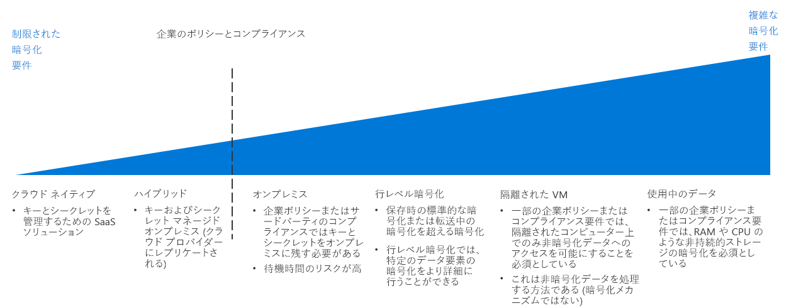

# 暗号化決定ガイドEncryption decision guide

データを暗号化すると、データが不正アクセスから保護されます。Encrypting data protects it against unauthorized access. 暗号化ポリシーを適切に実装すると、クラウドベースのワークロードにセキュリティのレイヤーが追加され、組織やネットワークの内外両方からの攻撃者や他の承認されていないユーザーに対する保護が提供されます。Properly implemented encryption policy provides additional layers of security for your cloud-based workloads and guards against attackers and other unauthorized users from both inside and outside your organization and networks.

リソースの暗号化は一般に望ましいことですが、待ち時間が長くなってリソースの全体的な使用量が増加するコストも伴います。While encrypting resources is generally desirable, encryption does have costs that can increase latency and overall resource usage. 要求の厳しいワークロードでは、暗号化とパフォーマンスの適切なバランスが重要です。For demanding workloads, striking the correct balance between encryption and performance is essential.

ジャンプ先:[キーの管理](#key-management) | [データの暗号化](#data-encryption) | [詳細情報](#learn-more)Jump to: [Key management](#key-management) | [Data encryption](#data-encryption) | [Learn more](#learn-more)

クラウド暗号化戦略を決定するときの転換点では、企業のポリシーとコンプライアンスの要件に焦点が当てられます。The inflection point when determining a cloud encryption strategy focuses on corporate policy and compliance mandates.

クラウド環境に暗号化を実装する方法は複数あり、コストと複雑さが異なります。There are multiple ways to implement encryption in a cloud environment, with varying cost and complexity. 企業のポリシーとサード パーティのコンプライアンスは、暗号化戦略を計画するときの最も大きな要因です。Corporate policy and third-party compliance are the biggest drivers when planning an encryption strategy. ほとんどのクラウドベースのソリューションでは、保存時と転送中のデータを暗号化するための標準的なメカニズムが提供されます。Most cloud-based solutions provide standard mechanisms for encrypting data, whether at rest or in transit. 一方、標準化されたシークレットとキーの管理、使用する暗号化、データ固有の暗号化など、より厳しい制御が要求されるポリシーとコンプライアンス要件の場合は、おそらく、複雑なソリューションの実装が必要になります。However, for policies and compliance requirements that demand tighter controls, such as standardized secrets and key management, encryption in-use, or data specific encryption, you will likely need to implement a complex solution.

## キー管理Key management

最新のキー管理システムでは、保護を強化するためハードウェア セキュリティ モジュール (HSM) を使用したキーの格納のサポートが提供されている必要があります。Modern key management systems should offer support for storing keys using hardware security modules (HSMs) for increased protection. そのため、組織で暗号化キー、重要なパスワード、接続文字列、その他の IT の機密情報を作成して保管できるためには、キー管理システムが不可欠です。Thus, a key management system is critical to your organization's ability to create and store cryptographic keys, important passwords, connection strings, and other IT confidential information.

次の表では、クラウドへの移行を計画するときのために、安全で管理しやすいクラウド デプロイを作成するのに不可欠な、暗号化キー、証明書、シークレットを保存して管理する方法について説明します。When planning a cloud migration, the following table describes how you can store and manage encryption keys, certificates, and secrets, which are critical for creating secure and manageable cloud deployments:

| 質問Question | クラウド ネイティブCloud Native | ハイブリッドHybrid | オンプレミスOn-premises |
|---------------------------------------------------------------------------------------------------------------------------------------|--------------|--------|-------------|
| 組織では一元的なキーとシークレットの管理が行われていませんかDoes your organization lack centralized key and secret management?                                                                    | はいYes          | いいえ No     | いいえ No          |
| デバイスに対するキーとシークレットの作成はオンプレミスのハードウェアに制限する必要がある一方で、それらのキーはクラウドで使用されますかWill you need to limit the creation of keys and secrets to devices to your on-premises hardware, while using these keys in the cloud? | いいえ No           | はいYes    | いいえ No          |
| 組織にはキーとシークレットがオフサイトに格納されるのを禁止するルールまたはポリシーがありますかDoes your organization have rules or policies in place that would prevent keys and secrets from being stored offsite?                | いいえ No           | いいえ No     | はいYes         |

### クラウド ネイティブCloud native

クラウド ネイティブのキー管理では、すべてのキーとシークレットはクラウドベースのコンテナーで生成、管理、格納されます。With cloud native key management, all keys and secrets are generated, managed, and stored in a cloud-based vault. このアプローチでは、キーの管理に関連する多くの IT タスクが簡略化されます。This approach simplifies many IT tasks related to key management.

クラウド ネイティブのキー管理の前提条件:クラウド ネイティブのキー管理システムの使用には、次の前提条件があります。Cloud native key management assumptions: Using a cloud native key management system assumes the following:

- 組織のシークレットとキーの作成、管理、ホストについて、クラウドのキー管理ソリューションを信頼します。You trust the cloud key management solution with creating, managing, and hosting your organization's secrets and keys.
- クラウドのキー管理システムにアクセスするために暗号化サービスまたはシークレットへのアクセスに依存するすべてのオンプレミス アプリケーションとサービスを有効にします。You enable all on-premises applications and services that rely on accessing encryption services or secrets to access the cloud key management system.

### ハイブリッド (Bring Your Own Key)Hybrid (bring your own key)

Bring Your Own Key のアプローチでは、オンプレミス環境内の専用 HSM ハードウェアでキーを生成した後、クラウド リソースで使用するために、セキュリティで保護されたクラウドのキー管理システムにキーを転送します。With a bring-your-own-key approach, you generate keys on dedicated HSM hardware within your on-premises environment, then transfer the keys to a secure cloud key management system for use with cloud resources.

ハイブリッドのキー管理の前提条件:ハイブリッドのキー管理システムの使用には、次の前提条件があります。Hybrid key management assumptions: Using a hybrid key management system assumes the following:

- キーとシークレットをホストおよび使用するために、クラウド プラットフォームの基盤のセキュリティおよびアクセス制御インフラストラクチャを信頼します。You trust the underlying security and access control infrastructure of the cloud platform for hosting and using your keys and secrets.
- 規制や組織方針によって、組織のシークレットとキーの作成と管理をオンプレミスで行うことが求められます。You are required by regulatory or organizational policy to keep the creation and management of your organization's secrets and keys on-premises.

### オンプレミス (Hold Your Own Key)On-premises (hold your own key)

特定のシナリオでは、規制、方針、または技術的な理由により、パブリック クラウド サービスによって提供されるキー管理システムにキーを格納できない可能性があります。In certain scenarios, there may be regulatory, policy, or technical reasons why you can't store keys on a key management system provided by a public cloud service. このような場合は、オンプレミスのハードウェアを使用してキーを保持し、クラウドベースのリソースが暗号化のためにこれらのキーにアクセスできるメカニズムをプロビジョニングする必要があります。In these cases, you must maintain keys using on-premises hardware, and provision a mechanism to allow cloud-based resource to access these keys for encryption purposes. Hold Your Own Key アプローチと互換性のないクラウド サービスがあるかもしれないことに注意してください。Note that a hold your own key approach may not be compatible with all cloud services.

オンプレミスのキー管理の前提条件:オンプレミスのキー管理システムの使用には、次の前提条件があります。On-premises key management assumptions: Using an on-premises key management system assumes the following:

- 規制や組織方針によって、組織のシークレットとキーの作成、管理、ホストをオンプレミスで行うことが求められます。You are required by regulatory or organizational policy to keep the creation, management, and hosting of your organization's secrets and keys on-premises.
- 暗号化サービスまたはシークレットへのアクセスに依存するすべてのクラウドベースのアプリケーションまたはサービスが、オンプレミスのキー管理システムにアクセスできます。Any cloud-based applications or services that rely on accessing encryption services or secrets can access the on-premises key management system.

## データの暗号化Data encryption

暗号化ポリシーを計画するときは、暗号化ニーズが異なる複数のデータの状態が存在することを考慮します。There are several different states of data with different encryption needs to consider when planning your encryption policy:

| データの状態Data state | データData |
|-----|-----|
| 転送中のデータData in transit | 内部ネットワーク トラフィック、インターネット接続、データ センターまたは仮想ネットワーク間の接続Internal network traffic, internet connections, connections between datacenters or virtual networks |
| 保存データData at rest    | データベース、ファイル、仮想ドライブ、PaaS ストレージDatabases, files, virtual drives, PaaS storage |
| 使用中のデータData in use     | RAM または CPU キャッシュに読み込まれたデータData loaded in RAM or in CPU caches |

### 転送中のデータData in transit

転送中のデータとは、内部のリソース間、データ センター間や外部のネットワーク間、またはインターネット上を移動しているデータです。Data in transit is data moving between resources on the internal, between datacenters or external networks, or over the internet.

転送中のデータの暗号化は、通常、トラフィックに対して SSL/TLS プロトコルを要求することによって行われます。Encrypting data in transit is usually done by requiring SSL/TLS protocols for traffic. クラウドでホストされたリソースと外部ネットワークまたはパブリック インターネットの間を移動するトラフィックは、常に暗号化する必要があります。Traffic transiting between your cloud-hosted resources to external network or the public internet should always be encrypted. PaaS リソースでも、一般に、既定でトラフィックに対して SSL/TLS の暗号化が適用されます。PaaS resources generally also enforce SSL/TLS encryption to traffic by default. 会社の仮想ネットワーク内でホストされている IaaS リソース間のトラフィックに対して暗号化を適用するかどうかは、クラウド導入チームとワークロード所有者が決定することであり、通常は推奨されます。Whether you enforce encryption for traffic between IaaS resources hosted inside your virtual networks is a decision for your Cloud Adoption Team and workload owner and is generally recommended.

**転送中のデータの暗号化の前提条件**。**Encrypting data in transit assumptions**. 転送中データに対する適切な暗号化ポリシーの実装では、次のことが想定されます。Implementing proper encryption policy for data in transit assumes the following:

- クラウド環境内のパブリックにアクセスできるすべてのエンドポイントは、SSL/TLS プロトコルを使用してパブリック インターネットで通信します。All publicly accessible endpoints in your cloud environment will communicate with the public internet using SSL/TLS protocols.
- クラウド ネットワークを、パブリック インターネット経由でオンプレミスまたは他の外部ネットワークと接続するときは、暗号化された VPN プロトコルを使用します。When connecting cloud networks with on-premises or other external network over the public internet, use encrypted VPN protocols.
- ExpressRoute などの専用 WAN 接続を使用して、クラウド ネットワークをオンプレミスや他の外部ネットワークと接続するときは、オンプレミスの VPN または他の暗号化アプライアンスと、クラウド ネットワークにデプロイされた対応する仮想 VPN または暗号化アプライアンスを、ペアにして使用します。When connecting cloud networks with on-premises or other external network using a dedicated WAN connection such as ExpressRoute, you will use a VPN or other encryption appliance on-premises paired with a corresponding virtual VPN or encryption appliance deployed to your cloud network.
- IT スタッフが見ることのできるトラフィック ログまたは他の診断レポートに含めるべきでない機密データがある場合は、仮想ネットワーク内のリソース間のすべてのトラフィックを暗号化します。If you have sensitive data that shouldn't be included in traffic logs or other diagnostics reports visible to IT staff, you will encrypt all traffic between resources in your virtual network.

### 保存データData at rest

保存データは、積極的に移動または処理されていないすべてのデータを表し、ファイル、データベース、仮想マシンのドライブ、PaaS のストレージ アカウント、または同様の資産が含まれます。Data at rest represents any data not being actively moved or processed, including files, databases, virtual machine drives, PaaS storage accounts, or similar assets. 保存データの暗号化は、外部ネットワーク侵入、悪意のある内部ユーザー、または偶発的な解放からの不正アクセスに対して、仮想デバイスまたはファイルを保護します。Encrypting stored data protects virtual devices or files against unauthorized access either from external network penetration, rogue internal users, or accidental releases.

一般に、PaaS ストレージとデータベース リソースでは、既定で暗号化が適用されます。PaaS storage and database resources generally enforce encryption by default. IaaS の仮想リソースは、キー管理システムに格納されている暗号化キーを使用して、仮想ディスクの暗号化により保護できます。IaaS virtual resources can be secured through virtual disk encryption using cryptographic keys stored in your key management system.

保存データの暗号化には、保護対象の厳密なデータをいっそう細かく制御できる、列レベルと行レベルの暗号化のような高度なデータベースの暗号化技術も含まれます。Encryption for data at rest also encompasses more advanced database encryption techniques, such as column-level and row level encryption, which provides much more control over exactly what data is being secured.

ポリシーとコンプライアンスの全体的な要件、格納されているデータの機密性、およびワークロードのパフォーマンス要件に基づいて、暗号化を必要とする資産を決定する必要があります。Your overall policy and compliance requirements, the sensitivity of the data being stored, and the performance requirements of your workloads should determine which assets require encryption.

**保存データの暗号化の前提条件**。**Encrypting Data at Rest Assumptions**. 保存データの暗号化では、次のことが想定されます。Encrypting data at rest assumes the following:

- 格納するデータは、公開を前提としたものではありません。You are storing data that is not meant for public consumption.
- ワークロードは、ディスク暗号化による待ち時間の増加を受け入れることができます。Your workloads can accept the added latency cost of disk encryption.

### 使用中のデータData in use

使用中のデータの暗号化には、RAM や CPU キャッシュなどの非永続的ストレージ内のデータのセキュリティ保護が含まれます。Encryption for data in use involves securing data in nonpersistent storage, such as RAM or CPU caches. 完全なメモリの暗号化などのテクノロジや、Intel の Secure Guard Extensions (SGX) などのエンクレーブ テクノロジーを使用します。Use of technologies such as full memory encryption, enclave technologies, such as Intel's Secure Guard Extensions (SGX). これには、安全で信頼できる実行環境を作成するために使用できる同形暗号化などの暗号化技術も含まれます。This also includes cryptographic techniques, such as homomorphic encryption that can be used to create secure, trusted execution environments.

**使用中のデータの暗号化の前提条件**。**Encrypting data in use assumptions**. 使用中のデータの暗号化では、次のことが想定されます。Encrypting data in use assumes the following:

- 常に (RAM や CPU レベルでも)、データの所有権を、基になるクラウド プラットフォームから切り離しておく必要があります。You are required to maintain data ownership separate from the underlying cloud platform at all times, even at the RAM and CPU level.

## 詳細情報Learn more

Azure プラットフォームでの暗号化とキー管理の詳細については、次の記事を参照してください。See the following for more information about encryption and key management in the Azure platform.

- 「[Azure の暗号化の概要](/azure/security/security-azure-encryption-overview)」。[Azure encryption overview](/azure/security/security-azure-encryption-overview). Azure で暗号化を使用して保存データと転送中のデータの両方が保護される方法について詳細に説明されています。A detailed description of how Azure uses encryption to secure both data at rest and data in transit.
- [Azure Key Vault](/azure/key-vault/key-vault-overview)。[Azure Key Vault](/azure/key-vault/key-vault-overview). Key Vault は、Azure 内の暗号化キー、シークレット、証明書を格納および管理するための主要なキー管理システムです。Key Vault is the primary key management system for storing and managing cryptographic keys, secrets, and certificates within Azure.
- 「[Confidential computing in Azure (Azure での Confidential Computing)](/solutions/confidential-compute)」。[Confidential computing in Azure](/solutions/confidential-compute). Azure の Confidential Computing イニシアチブでは、信頼できる実行環境または使用中のデータを保護するための他の暗号化メカニズムを作成するためのツールとテクノロジが提供されます。Azure's confidential computing initiative provides tools and technology to create trusted execution environments or other encryption mechanisms to secure data in use.

## 次の手順Next steps

ソフトウェア定義ネットワークでクラウドのデプロイに仮想化されたネットワーク機能が提供される方法について学習します。Learn how Software Defined Networks provide virtualized networking capabilities for cloud deployments.

> [!div class="nextstepaction"]
> [デプロイに最も適したソフトウェア定義ネットワーク パターンWhich Software Defined Network pattern is best for my deployment?](../software-defined-network/overview.md)
