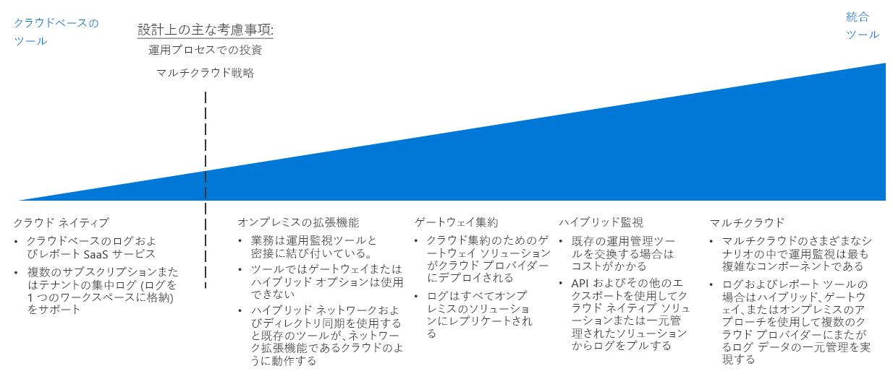

# ログとレポートの意思決定ガイドLogging and reporting decision guide

パフォーマンス、アップタイム、およびセキュリティの問題が重大な問題になる前に、IT チームに通知するメカニズムは、すべての組織に必要です。All organizations need mechanisms for notifying IT teams of performance, uptime, and security issues before they become serious problems. 成功した監視戦略では、ワークロードとネットワーク インフラストラクチャを構成する個々のコンポーネントがどのように実行されているかを把握することができます。A successful monitoring strategy allows you to understand how the individual components that make up your workloads and networking infrastructure are performing. パブリック クラウドの移行では、ログとレポートを既存の任意の監視システムと統合しつつ、重要なイベントとメトリックを適切な IT スタッフに明らかにすることは、組織がアップタイム、セキュリティ、およびポリシーのコンプライアンス目標を確実に達成するうえで非常に重要です。Within the context of a public cloud migration, integrating logging and reporting with any of your existing monitoring systems, while surfacing important events and metrics to the appropriate IT staff, is critical in ensuring your organization is meeting uptime, security, and policy compliance goals.

ジャンプ先:[監視インフラストラクチャの計画](#planning-your-monitoring-infrastructure) | [クラウド ネイティブ](#cloud-native) | [オンプレミスの拡張機能](#on-premises-extension) | [ゲートウェイ集約](#gateway-aggregation) | [ハイブリッド監視 (オンプレミス)](#hybrid-monitoring-on-premises) | [ハイブリッド監視 (クラウド ベース)](#hybrid-monitoring-cloud-based) | [マルチクラウド](#multi-cloud) | [詳細情報](#learn-more)Jump to: [Planning your monitoring infrastructure](#planning-your-monitoring-infrastructure) | [Cloud native](#cloud-native) | [On-premises extension](#on-premises-extension) | [Gateway aggregation](#gateway-aggregation) | [Hybrid monitoring (on-premises)](#hybrid-monitoring-on-premises) | [Hybrid monitoring (cloud-based)](#hybrid-monitoring-cloud-based) | [Multi-cloud](#multi-cloud) | [Learn more](#learn-more)

クラウドのログ記録およびレポート戦略を決定するときの転換点は、主に組織が運用プロセスに対して行ってきた既存の投資に基づきます。また、マルチクラウド戦略をサポートするために必要な任意の要件もある程度関係します。The inflection point when determining a cloud logging and reporting strategy is based primarily on existing investments your organization has made in operational processes, and to some degree any requirements you have to support a multi-cloud strategy.

クラウドでのアクティビティをログに記録してレポートを作成するには、複数の方法があります。There are multiple ways to log and report on activities in the cloud. クラウド ネイティブと一元化されたログには、サブスクリプション設計とサブスクリプションの数に基づく 2 つの共通のサービスとしてのソフトウェア (SaaS) オプションがあります。Cloud native and centralized logging are two common software as a service (SaaS) options that are driven by the subscription design and the number of subscriptions.

## 監視インフラストラクチャの計画Planning your monitoring infrastructure

デプロイを計画するときには、ログ データの格納場所と、クラウド ベースのレポート サービスと監視サービスを既存のプロセスとツールに統合する方法を検討する必要があります。When planning your deployment, you need to consider where logging data is stored and how you will integrate cloud-based reporting and monitoring services with your existing processes and tools.

| 質問Question | クラウド ネイティブCloud native | オンプレミスの拡張機能On-premises extension | ハイブリッド監視Hybrid monitoring | ゲートウェイ集約Gateway aggregation |
|-----|-----|-----|-----|-----|
| 既存のオンプレミスの監視インフラストラクチャはありますか?Do you have an existing on-premises monitoring infrastructure? | いいえ No | 可能 Yes | はいYes |  いいえ No |
| ログ データの外部の保存場所への格納を妨げている要件はありますか?Do you have requirements preventing storage of log data on external storage locations? | いいえ No | はいYes | いいえ No | いいえ No |
| クラウド監視とオンプレミス システムを統合する必要がありますか?Do you need to integrate cloud monitoring with on-premises systems? | いいえ No | いいえ No | はいYes | いいえ No |
テレメトリ データを監視システムに送信する前に、処理またはフィルター処理する必要がありますか?Do you need to process or filter telemetry data before submitting it to your monitoring systems? | いいえ No | いいえ No | いいえ No | はいYes |

### クラウド ネイティブCloud native

現在、組織に確立されたログとレポートのシステムがない場合、または計画されたクラウドのデプロイで既存のオンプレミスの監視システムまたは他の外部の監視システムとの統合が必要ない場合は、クラウド ネイティブの SaaS ソリューションが最も簡単な選択です。If your organization currently lacks established logging and reporting systems, or if your planned cloud deployment does not need to be integrated with existing on-premises or other external monitoring systems, a cloud native SaaS solution is the simplest choice.

このシナリオでは、ログ データが記録され、ワークロードと同じクラウド環境に格納され、同時に情報を処理して IT スタッフに明らかにするログ ツールとレポート作成ツールが、クラウド プラットフォームの一部として提供されます。In this scenario, log data is recorded and stored in the same cloud environment as your workload, while the logging and reporting tools that process and surface information to IT staff are offered as part of the cloud platform.

クラウド ネイティブのログ記録ソリューションは、サブスクリプションごとに、またはより小さい実験的なデプロイにはワークロードごとにアドホックで実装でき、クラウド全体でログ データを監視するための一元化された方法で構成することができます。Cloud native logging solutions can be implemented ad hoc per subscription or workload for smaller or experimental deployments and are organized in a centralized manner to monitor log data across your entire cloud estate.

**クラウド ネイティブの前提条件**。**Cloud native assumptions**. クラウド ネイティブのログとレポートのシステムの使用には、次の前提条件があります。Using a cloud native logging and reporting system assumes the following:

- クラウド ワークロードから既存のオンプレミス システムにログを統合する必要がない。You do not need to integrate the log data from you cloud workloads into existing on-premises systems.
- オンプレミス システムの監視に、クラウド ベースのレポート システムを使用する予定がない。You will not be using your cloud-based reporting systems to monitor on-premises systems.

### オンプレミスの拡張機能On-premises extension

クラウドのテレメトリを、ハイブリッドのログとレポートをサポートしていない、または最小限の再デプロイでアプリケーションとサービスの移行をサポートするオンプレミス システムと統合する必要があるシナリオでは、ログ データをクラウド環境に格納するのではなく、オンプレミス システムに直接送信する VM に監視エージェントをデプロイする必要があります。In scenarios where you need to integrate cloud telemetry with on-premises systems that do not support hybrid logging and reporting, or support the migration of applications and services with a minimum amount of redevelopment, you will need to deploy monitoring agents to VMs that will send log data directly to your on-premises systems, rather than storing it in the cloud environment.

このアプローチをサポートするためには、[ハイブリッド ネットワーク](../software-defined-network/hybrid.md)と[クラウドでホストされるドメイン サービス](../identity/overview.md#cloud-hosted-domain-services)を組み合わせることで、クラウド リソースがオンプレミス システムと直接通信できるようにする必要があります。In order to support this approach, your cloud resources will need to be able to communicate directly with your on-premises systems through a combination of [hybrid networking](../software-defined-network/hybrid.md) and [cloud hosted domain services](../identity/overview.md#cloud-hosted-domain-services). これを実施することで、クラウド仮想ネットワークがオンプレミス環境のネットワーク拡張機能として機能します。With this in place, the cloud virtual network functions as a network extension of the on-premises environment. そのため、クラウドでホストされるワークロードは、オンプレミスのログおよびレポートのシステムと直接通信できます。Therefore, cloud hosted workloads can communicate directly with your on-premises logging and reporting system.

このアプローチでは、クラウドにデプロイされたアプリケーションまたはサービスを少し変更して、監視ツールへの既存の投資を利用します。This approach capitalizes on your existing investment in monitoring tooling with limited modification to any cloud-deployed applications or services. 多くの場合、これはリフトアンドシフト移行時に監視をサポートする最も速いアプローチです。This is often the fastest approach to support monitoring during a lift-and-shift migration. ただし、クラウド ベースの PaaS および SaaS のリソースによって生成されたログ データはキャプチャされず、VM の状態など、クラウド プラットフォーム自体で生成された VM 関連のログはすべて省略されます。However, it won’t capture log data produced by cloud-based PaaS and SaaS resources, and it will omit any VM-related logs generated by the cloud platform itself such as VM status. その結果、このパターンは、より包括的なハイブリッド監視ソリューションが実装されるまでの一時的な解決策とする必要があります。As a result, this pattern should be a temporary solution until a more comprehensive hybrid monitoring solution is implemented.

オンプレミスのみの前提条件:On-premises only assumptions:

- 技術的な要件をサポートするため、または規制やポリシー要件により、ログ データのみをオンプレミス環境でのみ維持する必要がある。You need to maintain log data only in your on-premises environment only, either in support of technical requirements or due to regulatory or policy requirements.
- オンプレミス システムでハイブリッドのログとレポート、またはゲートウェイ集約ソリューションをサポートしていない。Your on-premises systems do not support hybrid logging and reporting or gateway aggregation solutions.
- クラウド ベースのアプリケーションで、オンプレミスのログ システムにテレメトリを直接送信できるか、オンプレミスに送信する監視エージェントをワークロード VM にデプロイできる。Your cloud-based applications can submit telemetry directly to your on-premises logging systems or monitoring agents that submit to on-premises can be deployed to workload VMs.
- ワークロードが、クラウド ベースのログとレポートを必要とする PaaS または SaaS サービスに依存していない。Your workloads are not dependent on PaaS or SaaS services that require cloud-based logging and reporting.

### ゲートウェイ集約Gateway aggregation

クラウド ベースのテレメトリ データの量が非常に大きい、または既存のオンプレミスの監視システムで、ログ データが処理できるように事前に変更する必要があるシナリオでは、ログ データの[ゲートウェイ集約](../../../patterns/gateway-aggregation.md)サービスが必要になる場合があります。For scenarios where the amount of cloud-based telemetry data is very large or existing on-premises monitoring systems need log data modified before it can be processed, a log data [gateway aggregation](../../../patterns/gateway-aggregation.md) service may be required.

ゲートウェイ サービスは、クラウド プロバイダーにデプロイされます。A gateway service is deployed to your cloud provider. 次に、関連するアプリケーションとサービスは、既定のログ システムではなく、ゲートウェイにテレメトリ データが送信されるように構成されます。Then, relevant applications and services are configured to submit telemetry data to the gateway instead of a default logging system. ゲートウェイで集約、結合などのデータの処理ができるようになります。それ以外の場合は、取り込みと分析のために監視サービスにデータを送信する前に、データを書式設定できます。The gateway can then process the data: aggregating, combining, or otherwise formatting it before then submitting it to your monitoring service for ingestion and analysis.

また、ゲートウェイを使用して、クラウド ネイティブまたはハイブリッド システムにバインドされたテレメトリ データを集約または前処理することもできます。Also, a gateway can be used to aggregate and preprocess telemetry data bound for cloud-native or hybrid systems.

ゲートウェイ集約の前提条件:Gateway aggregation assumptions:

- ご使用のクラウド ベースのアプリケーションまたはサービスから非常に高いレベルのテレメトリ データを想定している。You expect very high levels of telemetry data from your cloud-based applications or services.
- テレメトリ データを監視システムに送信する前に、書式設定するか、最適化する必要がある。You need to format or otherwise optimize telemetry data before submitting it to your monitoring systems.
- 監視システムに、ゲートウェイで処理された後にログ データを取り込むのに使用できる API またはその他のメカニズムがある。Your monitoring systems have APIs or other mechanisms available to ingest log data after processing by the gateway.

### ハイブリッド監視 (オンプレミス)Hybrid monitoring (on-premises)

ハイブリッド監視ソリューションでは、オンプレミスとクラウドの両方のリソースからのログ データを結合して、IT 資産の運用状態に関する統合ビューを提供します。A hybrid monitoring solution combines log data from both your on-premises and cloud resources to provide an integrated view into your IT estate's operational status.

置換が難しいまたは置換にコストがかかるオンプレミスの監視システムへの既存の投資がある場合、クラウド ワークロードからのテレメトリを以前から存在している監視ソリューションに統合する必要がある場合があります。If you have an existing investment in on-premises monitoring systems that would be difficult or costly to replace, you may need to integrate the telemetry from your cloud workloads into preexisting on-premises monitoring solutions. ハイブリッドのオンプレミスの監視システムでは、オンプレミスのテレメトリ データは引き続き既存のオンプレミスの監視システムを使用します。In a hybrid on-premises monitoring system, on-premises telemetry data continues to use the existing on-premises monitoring system. クラウド ベースのテレメトリ データは、クラウド監視システムに直接送信されるか、ワークロードと共にクラウドに格納されてから、一定の間隔でコンパイルされ、オンプレミス システムに取り込まれます。Cloud-based telemetry data is either sent to the cloud monitoring system directly, or the data is stored on the cloud alongside your workloads and then compiled and ingested into the on-premises system at regular intervals.

**オンプレミスのハイブリッド監視の前提条件**。**On-premises hybrid monitoring assumptions**. ハイブリッド監視にオンプレミスのログとレポートのシステムを使用するには、次の前提条件があります。Using an on-premises logging and reporting system for hybrid monitoring assumes the following:

- クラウドのワークロードを監視するため、既存のオンプレミスのレポート システムを使用する必要がある。You need to use existing on-premises reporting systems to monitor cloud workloads.
- ログ データの所有権をオンプレミスで維持する必要がある。You need to maintain ownership of log data on-premises.
- オンプレミスの管理システムに、クラウド ベースのシステムからログ データを取り込むために使用できる API またはその他のメカニズムがある。Your on-premises management systems have APIs or other mechanisms available to ingest log data from cloud-based systems.

> [!TIP]
> クラウド移行の反復的な性質の一環として、個別のクラウド ネイティブおよびオンプレミスの監視から部分的なハイブリッド アプローチへの移行はあり得ます。As part of the iterative nature of cloud migration, transitioning from distinct cloud-native and on-premises monitoring to a partial hybrid approach is likely. 監視アーキテクチャに対する変更が IT および運用の全体のプロセスに沿っていることを確認します。Make sure to keep changes to your monitoring architecture in line with your overall IT and operational processes.

### ハイブリッド監視 (クラウド ベース)Hybrid monitoring (cloud-based)

オンプレミスの監視システムを維持する切実なニーズがない場合、またはオンプレミスの監視システムを SaaS ソリューションと置き換える場合、オンプレミスのログ データを一元化されたクラウド ベースの監視システムと統合することもできます。If you do not have a compelling need to maintain an on-premises monitoring system, or you want to replace on-premises monitoring systems with a SaaS solution, you can also choose to integrate on-premises log data with a centralized cloud-based monitoring system.

オンプレミスを中心としたアプローチをミラーリングすることで、このシナリオではクラウド ワークロードがその既定のクラウド ログ メカニズムを使用します。また、オンプレミスのアプリケーションとサービスは、テレメトリをクラウドベースのログ システムに直接送信するか、そのデータを集約してクラウド システムに一定間隔で読み込みます。Mirroring the on-premises centered approach, in this scenario cloud workloads would use their default cloud logging mechanism, and on-premises applications and services would either send telemetry directory to the cloud-based logging system, or aggregate that data for ingestion into the cloud system at regular intervals. その後、クラウド ベースの監視システムは、IT 資産全体の監視とレポートのプライマリ システムとして機能します。The cloud-based monitoring system would then serve as your primary monitoring and reporting system for your entire IT estate.

クラウドベースのハイブリッド監視の前提条件:ハイブリッド監視にクラウドベースのログとレポートのシステムを使用するには、次の前提条件があります。Cloud-based hybrid monitoring assumptions: Using cloud-based logging and reporting systems for hybrid monitoring assumes the following:

- 既存のオンプレミスの監視システムに依存していない。You are not dependent upon existing on-premises monitoring systems.
- ワークロードにログ データをオンプロミスで格納するための規制やポリシー要件がない。Your workloads do not have regulatory or policy requirements to store log data on-premises.
- クラウド ベースの管理システムに、オンプレミスのアプリケーションとサービスからログ データを取り込むために使用できる API またはその他のメカニズムがある。Your cloud-based monitoring systems have APIs or other mechanisms available to ingest log data from on-premises applications and services.

### マルチクラウドMulti-cloud

ログとレポートの機能をマルチクラウド プラットフォーム全体に取り込むのは、複雑になる場合があります。Integrating logging and reporting capabilities across a multiple-cloud platform can be complicated. プラットフォーム間で提供されるサービスは多くの場合、直接比較することはできず、これらのサービスで提供されるログとテレメトリの機能も異なります。Services offered between platforms are often not directly comparable, and logging and telemetry capabilities provided by these services differ as well.
マルチクラウドのログのサポートでは多くの場合、ハイブリッドのログ記録ソリューションにデータを送信する前に、一般的な形式にログ データを処理するゲートウェイ サービスを使用する必要があります。Multi-cloud logging support often requires the use of gateway services to process log data into a common format before submitting data to a hybrid logging solution.

## 詳細情報Learn more

[Azure Monitor](/azure/azure-monitor/overview) は Azure の既定のレポートと監視サービスです。[Azure Monitor](/azure/azure-monitor/overview) is the default reporting and monitoring service for Azure. 共有サービスには次のものが含まれています。It provides:

- アプリのテレメトリ、ホストのテレメトリ (VM など)、コンテナー メトリック、Azure プラットフォームのメトリック、イベント ログを収集するための統合プラットフォーム。A unified platform for collecting app telemetry, host telemetry (such as VMs), container metrics, Azure platform metrics, and event logs.
- 視覚化ツール、クエリ ツール、アラート ツール、分析ツール。Visualization, queries, alerts, and analytical tools. 仮想マシン、ゲスト オペレーティング システム、仮想ネットワーク、およびワークロードのアプリケーション イベントの分析情報を提供できます。It can provide insights into virtual machines, guest operating systems, virtual networks, and workload application events.
- 外部サービスとの統合および監視とアラート サービスの自動化のための [REST API](/azure/monitoring-and-diagnostics/monitoring-rest-api-walkthrough)。[REST APIs](/azure/monitoring-and-diagnostics/monitoring-rest-api-walkthrough) for integration with external services and automation of monitoring and alerting services
- 多くの人気のあるサード パーティ ベンダーとの[統合](/azure/monitoring-and-diagnostics/monitoring-partners)。[Integration](/azure/monitoring-and-diagnostics/monitoring-partners) with many popular third-party vendors.
