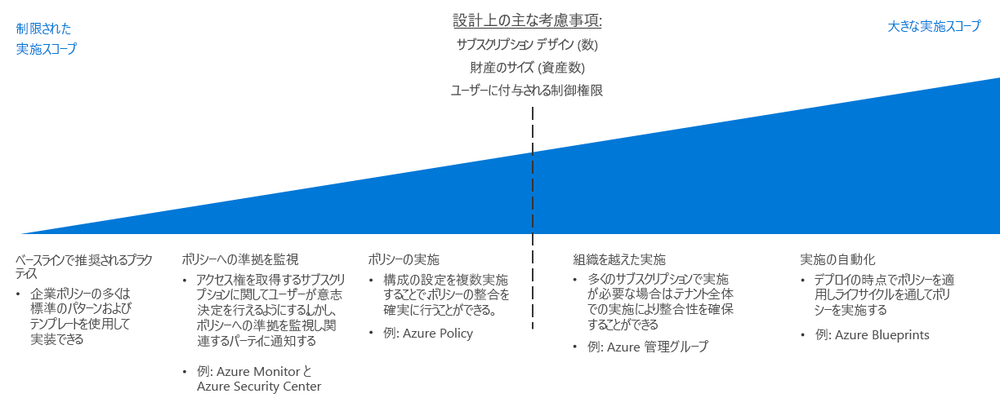

# ポリシー適用の意思決定ガイド

組織のポリシーを定義することは、組織全体にわたってそれを適用する方法がなければ有効ではありません。 クラウドへの移行を計画する際に鍵となるのは、クラウド資産全体にわたってポリシーのコンプライアンスを最大限確保するために、クラウド プラットフォームによって提供されるツールと既存の IT プロセスをどのように組み合わせれば最適であるかを特定することです。

ジャンプ先:[ベースラインの推奨プラクティス](#baseline-recommended-practices) | [ポリシー コンプライアンスの監視](#policy-compliance-monitoring) | [ポリシーの適用](#policy-enforcement) | [組織間のポリシー](#cross-organization-policy) | [適用の自動化](#automated-enforcement)

クラウドの資産が増加するにつれて、増加した一連のリソース、サブスクリプションにわたってポリシーを管理し、適用するという、関連して生じる必要性に直面することになります。 資産が大きくなり、組織のポリシー要件が増えるにつれて、一貫したポリシー適合と迅速な違反の検出を確実に行うためにポリシー適用のプロセスを拡大する必要があります。

小規模なクラウド資産に対しては、通常、リソースまたはサブスクリプション レベルでプラットフォームによって提供されるポリシー適用メカニズムで十分です。 大規模なデプロイでは、より大きな適用範囲が適切であり、デプロイの標準、リソースのグループ化と組織化、ポリシーの適用とログ システムおよびレポート システムとの統合を伴う、より高度なメカニズムを活用する必要が生じる場合があります。

ポリシー適用プロセスの範囲を決定する主な要因は、組織の[クラウド ガバナンス要件](/azure/architecture/cloud-adoption/governance/overview)、クラウド資産のサイズと種類、組織が[サブスクリプション設計](../subscriptions/overview.md)に反映される方法です。 資産のサイズが大きくなることや、ポリシー適用を一元管理する必要性が増すことは、どちらも適用範囲を増やす理由になります。

## ベースラインの推奨プラクティス

1 つのサブスクリプションとシンプルなクラウドを持つデプロイでは、Azure プラットフォームのリソースとサブスクリプションにネイティブで備わっている機能を使用して、多くの企業のポリシーを適用できます。 CAF [意思決定ガイド](../overview.md)の全体を通して説明されているパターンを一貫して使用することが、ポリシー適用に特定の投資を行わずにベースライン レベルのポリシー コンプライアンスを確立する助けになります。

例: 

- [デプロイ テンプレート](../resource-consistency/overview.md)を使用すると、標準化された構造と構成を持つリソースをプロビジョニングできます。
- [タグ付けと名前付けの標準](../resource-tagging/overview.md)を導入すると、オペレーションを組織化し、会計とビジネス上の要件を支える助けになります。
- トラフィック管理とネットワーク制限を、[ソフトウェア定義のネットワーク](../software-defined-network/overview.md)を通して実施できます。
- [ロール ベースのアクセス制御](../identity/overview.md)では、クラウド リソースをセキュリティで保護し、分離することができます。

これらのガイド全体で説明されている標準的なパターンのアプリケーションが、どのように組織の要件を満たす助けになるかを調べることで、クラウド ポリシーの適用計画を開始します。

## ポリシー コンプライアンスの監視

Azure プラットフォームによって提供されるポリシー適用メカニズムにただ頼ることを超えた最初のステップは、クラウドベースのアプリケーションとサービスが組織のポリシーに準拠していることを確実に確認できるようにすることです。 これには、リソースが非準拠の状態になったときに責任者にアラートを送る通知機能の実装が含まれます。  クラウド ワークロードのコンプライアンス状態の[ログ記録とレポート作成](../log-and-report/overview.md)を効果的に行うことは、企業ポリシー適用戦略の重要な一部です。

クラウド資産が拡大したら、[Azure Security Center](/azure/security-center/) などの追加ツールによって、統合されたセキュリティと脅威の検出を提供できます。こうしたツールは、一元化されたポリシー管理を適用したり、オンプレミスとクラウドの両方の資産にアラートを適用したりするのに役立ちます。

## ポリシーの適用

Azure では、管理グループ、サブスクリプション、またはリソース グループ レベルで構成設定とリソース作成ルールを適用し、ポリシーとの適合を確保しやすくすることもできます。

[Azure Policy](/azure/governance/policy/overview) は、ポリシーの作成、割り当て、および管理を行うための Azure のサービスです。 これらのポリシーは、リソースにさまざまなルールと効果を適用して、それらのリソースが会社の標準とサービス レベル アグリーメントに準拠した状態に保たれるようにします。 Azure Policy では、割り当てられているポリシーへの非準拠がないか、リソースを評価します。 たとえば、環境内の仮想マシンの SKU サイズを制限したい場合があります。 対応するポリシーが実施されると、新しいリソースと既存のリソースの準拠状況が評価されます。 適切なポリシーにより、既存のリソースを準拠の状態にすることができます。

## 組織間のポリシー

クラウドの資産が、適用が必要な多くのサブスクリプションにまたがるまで拡大したら、クラウド資産全体の適用戦略に焦点を合わせて、ポリシーの一貫性を確保する必要があります。

ポリシーは組織構造に関連しているため、[サブスクリプション設計](../subscriptions/overview.md)ではポリシーを考慮に入れる必要があります。 サブスクリプション設計内で複雑な組織のサポートを助けるのに加え、[Azure 管理グループ](../subscriptions/overview.md#management-groups)を使用して、Azure ポリシー ルールを複数のサブスクリプションにわたって割り当てることができます。

## 適用の自動化

標準化されたデプロイ テンプレートは、規模がより小さい場合に効果的であるのに対して、[Azure Blueprints](/azure/governance/blueprints/overview) では、Azure ソリューションの大規模な標準化されたプロビジョニングとデプロイのオーケストレーションが可能です。 作成される任意のリソースに対して一貫したポリシー設定を適用し、複数のサブスクリプションにわたるワークロードをデプロイできます。

クラウドとオンプレミスのリソースを統合する IT 環境については、ログ作成とレポート作成のシステムを使用して、ハイブリッドの監視機能を提供することが必要な場合があります。 サード パーティ製またはカスタムの運用監視システムで、追加のポリシー適用機能を提供できる場合があります。 より大規模な、またはより成熟したクラウド資産の場合は、これらのシステムをどのようにクラウド資産と統合するのが最適であるかを検討してください。

## 次の手順

サブスクリプション設計とガバナンス目標のサポートのため、リソースの整合性を利用してクラウド デプロイの編成と標準化を行う方法について学習します。

> [!div class="nextstepaction"]
> [リソースの整合性](../resource-consistency/overview.md)
