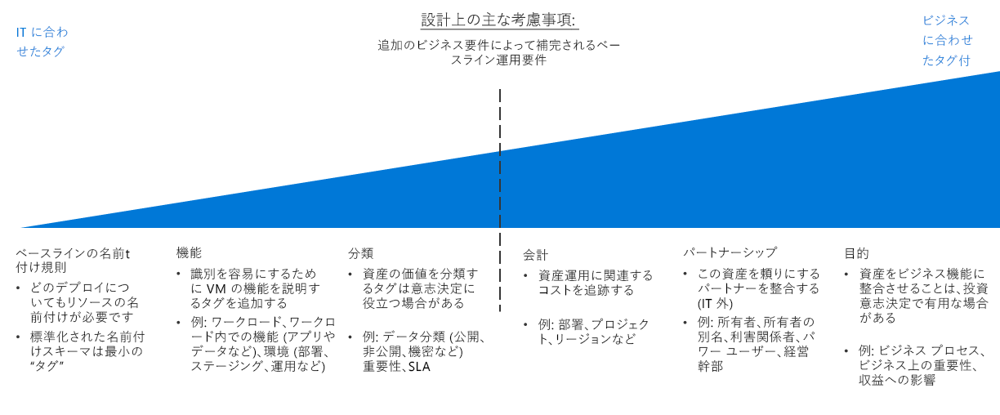

# リソースの編成とタグ付けの決定のガイドResource organization and tagging decision guide

デプロイが非常に単純なものでない限り、クラウドベースのリソースの編成は、IT 部門にとって最も重要なタスクの 1 つです。Organizing cloud-based resources is one of the most important tasks for IT, unless you have very simple deployments. リソースを編成する目的は、主に次の 3 つです。Organizing your resources serves three primary purposes:

- **リソース管理**。**Resource Management**. IT チームは、特定のワークロード、環境、所有権グループ、またはその他の重要な情報に関連付けられているリソースをすばやく見つける必要があります。Your IT teams will need to quickly find resources associated with specific workloads, environments, ownership groups, or other important information. リソースの整理は、リソース管理に組織のロールとアクセス許可を割り当てるために不可欠です。Organizing resources is critical to assigning organizational roles and access permissions for resource management.
- **操作**。**Operations**. 適切な方法で編成すると、IT 部門によるリソースの管理が簡単になるだけでなく、リソースの作成、運用の監視、および DevOps プロセスの作成の一部としてオートメーションを利用できるようになります。In addition to making resources easier for IT to manage, a proper organizational scheme allows you to take advantage of automation as part of resource creation, operational monitoring, and the creation of DevOps processes.
- **アカウンティング**。**Accounting**. ビジネス グループにクラウド リソースの消費量を認識させるため、IT 部門は、どのワークロードとチームがどのリソースを使用しているかを把握する必要があります。Making business groups aware of cloud resource consumption requires IT to understand what workloads and teams are using which resources. チャージバックやショーバック アカウンティングなどの手法をサポートするには、所有権と使用状況を反映するようにクラウド リソースを編成する必要があります。To support approaches such as chargeback and showback accounting, cloud resources need to be organized to reflect ownership and usage.

## タグ付け決定ガイドTagging decision guide

ジャンプ先:[ベースラインの名前付け規則](#baseline-naming-conventions) | [リソース タグ付けのパターン](#resource-tagging-patterns) | [名前付けとタグ付けのポリシー](#naming-and-tagging-policy) | [詳細情報](#learn-more)Jump to: [Baseline naming conventions](#baseline-naming-conventions) | [Resource tagging patterns](#resource-tagging-patterns) | [Naming and tagging policy](#naming-and-tagging-policy) | [Learn more](#learn-more)

タグ付けのアプローチには、クラウド ワークロードを管理する IT チームのサポートから、ビジネス全体のすべての側面に関連する情報の統合までの範囲の何に注目するかにより、簡単にも複雑にもなります。Your tagging approach can be simple or complex, with the emphasis ranging from supporting IT teams managing cloud workloads to integrating information relating to all aspects of the entire business.

IT に合わせることに注目したタグ付けでは、資産を監視する複雑さは軽減され、機能と分類に基づく管理の決定ははるかに簡単になります。An IT-aligned tagging focus will reduce the complexity of monitoring assets and make management decisions based on functionality and classification much easier.

非 IT ポリシーも含むタグ付けスキームでは、ビジネスの関心が反映されたタグ付け標準を作成し、そのような標準を長期間維持するために、より多くの時間をかけることが必要になる場合があります。Tagging schemes that also include non-IT policies may require a larger time investment to create tagging standards that reflect business interests and maintain those standards over time. ただし、このプロセスの結果として作成されるタグ付けシステムでは、IT 資産のコストと価値を考慮する機能が向上します。However, the result of this process is a tagging system providing an improved ability to account for costs and value of IT assets. 資産の価値とその運用コストのこのような関連付けは、組織内での IT のコスト センターとしての認識を変える最初のステップの 1 つです。This association of an asset's value to its operational cost is one of the first steps in changing the cost center perception of IT within your organization.

## ベースラインの名前付け規則Baseline naming conventions

標準化された名前付け規則は、クラウドでホストされるリソースを編成するための開始点です。A standardized naming convention is the starting point for organizing your cloud-hosted resources. 適切な構造の名前付けシステムを作成すると、管理とアカウンティング両方の目的でリソースをすばやく識別できるようになります。A properly structured naming system allows you to quickly identify resources for both management and accounting purposes. 組織の他の部分に IT 名前付け規則が既にある場合は、クラウド リソースの名前付け規則をそれらに揃えるかどうか、またはクラウドベースの標準を別に確立する必要があるかを検討します。If you have existing IT naming conventions in other parts of your organization, consider whether your cloud resource naming conventions should align with them or if you should establish separate cloud-based standards.

Azure リソースの種類によって[名前付けの要件](../../../best-practices/naming-conventions.md#naming-rules-and-restrictions)が異なることにも注意してください。Note also that different Azure resource types have different [naming requirements](../../../best-practices/naming-conventions.md#naming-rules-and-restrictions). 名前付け規則は、これらの名前付け要件に対応している必要があります。Your naming conventions must be compatible with these naming requirements.

## リソース タグ付けのパターンResource tagging patterns

一貫した名前付け規則だけで提供できるものより高度な組織のために、クラウド プラットフォームではリソースのタグ付けの機能がサポートされています。For more sophisticated organization than a consistent naming convention only can provide, cloud platforms support the ability to tag resources.

"*タグ*" は、リソースにアタッチされているメタデータ要素です。*Tags* are metadata elements attached to resources. タグは、キー/値の文字列のペアで構成されます。Tags consist of pairs of key/value strings. これらのペアに含める値はユーザー次第ですが、包括的な名前付けとタグ付けのポリシーの一部として、一貫性のあるグローバルなタグのセットを適用することは、全体的なガバナンス ポリシーの重要な部分です。The values you include in these pairs is up to you, but the application of a consistent set of global tags, as part of a comprehensive naming and tagging policy, is a critical part of an overall governance policy.

タグ付けの一般的なパターンの例を次に示します。Here are some examples of common tagging patterns:

<!-- markdownlint-disable MD033 -->

| タグの種類Tag type | 例Examples | 説明Description |
|-----|-----|-----|
| 機能Functional            | app = catalogsearch1app = catalogsearch1  tier = webtier = web  webserver = apachewebserver = apache env = prodenv = prod  env = stagingenv = staging  env = devenv = dev                 | ワークロード内での目的との関連、デプロイされている環境、または他の機能および運用に関する詳細で、リソースを分類します。Categorize resources in relation to their purpose within a workload, what environment they've been deployed to, or other functionality and operational details.                                 |
| 分類Classification        | confidentiality=privateconfidentiality=private sla = 24hourssla = 24hours                                 | 使用方法および適用されるポリシーによって、リソースを分類しますClassifies a resource by how it is used and what policies apply to it                               |
| 会計Accounting            | department = financedepartment = finance  project = catalogsearchproject = catalogsearch  region = northamericaregion = northamerica | 課金を目的として、組織内の特定のグループにリソースを関連付けることができますAllows resource to be associated with specific groups within an organization for billing purposes |
| パートナーシップPartnership           | owner = jsmithowner = jsmith  contactalias = catsearchownerscontactalias = catsearchowners stakeholders = user1;user2;user3stakeholders = user1;user2;user3                        | リソースに関連のある、またはそれ以外でリソースによって影響を受けるユーザー (IT 外) に関する情報を提供しますProvides information about what people (outside of IT) are related or otherwise affected by the resource                      |
| 目的Purpose               | businessprocess=supportbusinessprocess=support businessimpact=moderatebusinessimpact=moderate revenueimpact=highrevenueimpact=high   | 投資に関する決定のサポートを向上させるため、リソースをビジネス機能と一致させますAligns resources to business functions to better support investment decisions  |

<!-- markdownlint-enable MD033 -->

## 名前付けとタグ付けのポリシーNaming and tagging policy

名前付けとタグ付けのポリシーは時間とともに発展します。Your naming and tagging policy will evolve over time. ただし、クラウド移行の冒頭で、組織の主要な優先順位を決定することが重要です。However, determining your core organizational priorities at the outset of a cloud migration is critical. 計画プロセスの一環として、次のことを慎重に検討します。As part of your planning process, carefully consider the following questions:

- 名前付けとタグ付けのポリシーを、組織内の既存の名前付けおよび組織的ポリシーと統合する最善の方法は何ですか。How best can your naming and tagging policies integrate with existing naming and organizational policies within your organization?
- チャージバックまたはショウバックのアカウンティング システムを実装しますか。Will you implement a chargeback or showback accounting system? この組織構造では、部署、ビジネス グループ、チームはどのように表されていますかHow are your departments, business groups, and teams represented in this organizational structure?
- すべてのリソースで必要なタグ付け情報は何ですかWhat tagging information will be required for all resources? 実装するかしないかが個々のチームに委ねられるタグ付け情報は何ですかWhat tagging information will be left up to individual teams to implement or not implement?
- リソースの規制準拠要件のような詳細情報をタグ付けで表す必要がありますかDoes tagging need to represent details such regulatory compliance requirements for a resource? 稼働時間の要件、パッチのスケジュール、セキュリティ要件など、運用に関する詳細はどうですかWhat about operational details such as uptime requirements, patching schedules, or security requirements?

## 詳細情報Learn more

Azure での名前付けとタグ付けに関する詳細については、以下を参照してください。For more information about naming and tagging in Azure, see:

- [Azure リソースの名前付け規則](../../../best-practices/naming-conventions.md)。[Naming conventions for Azure resources](../../../best-practices/naming-conventions.md). Azure リソースの推奨される名前付け規則については、Azure クラウドの基礎のサイトでこのガイドを参照してください。Refer to this guidance from the Azure Cloud Fundamentals site for recommended naming conventions for Azure resources.
- [タグを使用した Azure リソースの整理](/azure/azure-resource-manager/resource-group-using-tags?toc=/azure/billing/TOC.json)。[Use tags to organize your Azure resources](/azure/azure-resource-manager/resource-group-using-tags?toc=/azure/billing/TOC.json). Azure ではリソース グループと個々のリソースの両方のレベルでタグを適用でき、適用されたタグに基づいて柔軟な詳細さでアカウンティング レポートを作成できます。You can apply tags in Azure at both the resource group and individual resource level, giving you flexibility in the granularity of any accounting reports based on applied tags.

## 次の手順Next steps

クラウド環境でデータをセキュリティ保護するための暗号化の使用方法について学習します。Learn how encryption is used to secure data in cloud environments.

> [!div class="nextstepaction"]
> [暗号化Encryption](../encryption/overview.md)
