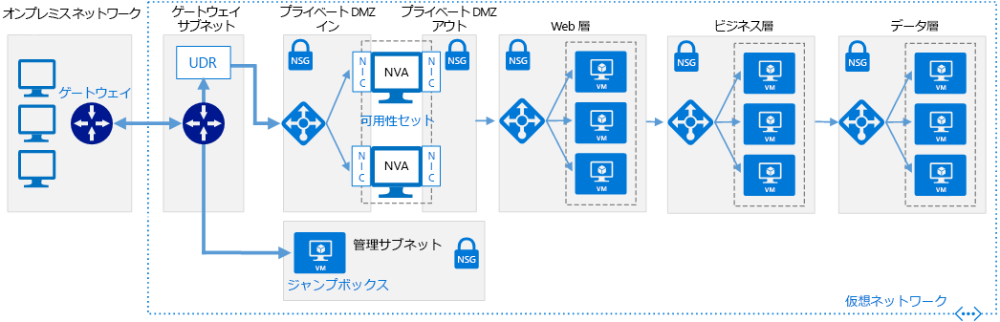

# ソフトウェア定義ネットワーク:クラウド DMZSoftware Defined Networks: Cloud DMZ

クラウド DMZ ネットワーク アーキテクチャでは、仮想プライベート ネットワーク (VPN) を使用してネットワークに接続することで、オンプレミス ネットワークとクラウド ベース ネットワークとの間のアクセスを制限することができます。The Cloud DMZ network architecture allows limited access between your on-premises and cloud-based networks, using a virtual private network (VPN) to connect the networks. DMZ は、クラウド ベースのリソースからオンプレミス ネットワークへのアクセスを保護するために、クラウドにデプロイされます。A DMZ is deployed in the cloud to secure access to the on-premises network from cloud-based resources.

このアーキテクチャは、組織がクラウド ベースのワークロードとオンプレミスのワークロードの統合を開始したいが、完全に成熟したクラウド セキュリティ ポリシーを持たない、または 2 つの環境の間でセキュリティで保護された専用の WAN 接続を取得していないシナリオをサポートするように設計されています。This architecture is designed to support scenarios where your organization wants to start integrating cloud-based workloads with on-premises workloads but may not have fully matured cloud security policies or acquired a secure dedicated WAN connection between the two environments. その結果、オンプレミス サービスをセキュリティで確実に保護するために、クラウド ネットワークを非武装地帯のように扱う必要があります。As a result, cloud networks should be treated like a demilitarized zone to ensure on-premises services are secure.

DMZ は、ファイアウォールやパケット検査などのセキュリティ機能を実装するために、ネットワーク仮想アプライアンス (NVA) をデプロイします。The DMZ deploys network virtual appliances (NVAs) to implement security functionality such as firewalls and packet inspection. オンプレミスとクラウド ベースのアプリケーションまたはサービスとの間を通過するトラフィックは、監査できるように DMZ を通過する必要があります。Traffic passing between on-premises and cloud-based applications or services must pass through the DMZ where it can be audited. VPN 接続および DMZ ネットワークによって許可されるトラフィックを決定する規則は、IT セキュリティ チームが厳密に管理します。VPN connections and the rules determining what traffic is allowed through the DMZ network are strictly controlled by IT security teams.

## クラウド DMZ の前提条件Cloud DMZ assumptions

クラウド DMZ のデプロイでは、以下のことを前提とします。Deploying a Cloud DMZ assumes the following:

- セキュリティ チームが、オンプレミスとクラウド ベースのセキュリティ要件とポリシーを完全には調整していない。Your security teams have not fully aligned on-premises and cloud-based security requirements and policies.
- クラウド ベース ワークロードで、オンプレミスまたはサード パーティのネットワークでホストされているサービスへのアクセスを制限する必要がある。または、オンプレミス環境内のユーザーやアプリケーションでクラウド ホスト リソースへのアクセスを制限する必要がある。Your cloud-based workloads require limited access to services hosted on your on-premises or third-party networks, or your users or applications in your on-premises environment need limited access to cloud-hosted resources.
- オンプレミスのネットワークとクラウド プロバイダーの間に VPN 接続を実装することが、企業ポリシー、規制要件、または技術的な互換性の問題によって妨げられていない。Implementing a VPN connection between your on-premises networks and cloud provider is not prevented by corporate policy, regulatory requirements, or technical compatibility issues.
- ワークロードが、サブスクリプションのリソース制限をバイパスするために複数のサブスクリプションを必要としないか、複数のサブスクリプションを必要とするが、複数のサブスクリプションに分散するリソースによって使用される接続と共有サービスの中央管理を必要としない。Your workloads either do not require multiple subscriptions to bypass subscription resource limits, or they involve multiple subscriptions but don't require central management of connectivity or shared services used by resources spread across multiple subscriptions.

クラウド DMZ 仮想ネットワーク アーキテクチャの実装を考える際、クラウド導入チームは、次の問題を考慮する必要があります。Your Cloud Adoption team should consider the following issues when looking at implementing a Cloud DMZ virtual networking architecture:

- オンプレミス ネットワークをクラウド ネットワークに接続すると、セキュリティ要件がより複雑になります。Connecting on-premises networks with cloud networks increases the complexity of your security requirements. クラウド ネットワークとオンプレミス環境の間の接続がセキュリティで保護されていても、クラウド リソースを確実に保護する必要があります。Even though the connection between cloud networks and the on-premises environment are secured, you still need to ensure cloud resources are secured.
- クラウドDMZ アーキテクチャは、接続をセキュリティでさらに保護し、オンプレミスとクラウド ネットワークの間でセキュリティ ポリシーを調整しながら、本格的なハイブリッド ネットワーク アーキテクチャを幅広く採用できるようにするための足がかりとして広く使用されています。The Cloud DMZ architecture is commonly used as a stepping stone while connectivity is further secured and security policy aligned between on-premises and cloud networks, allowing a broader adoption of a full-scale hybrid networking architecture.

## 詳細情報Learn more

Azure プラットフォームでのクラウド DMZ の実装の詳細については、次の記事をご覧ください。See the following for more information about the implementing a Cloud DMZ in the Azure platform.

- [Azure とオンプレミス データ センター間に DMZ を実装する](../../../reference-architectures/dmz/secure-vnet-hybrid.md)。[Implement a DMZ between Azure and your on-premises datacenter](../../../reference-architectures/dmz/secure-vnet-hybrid.md). この記事では、安全なハイブリッド ネットワーク アーキテクチャを Azure に実装する方法について説明します。This article discusses how to implement a secure hybrid network architecture in Azure.
