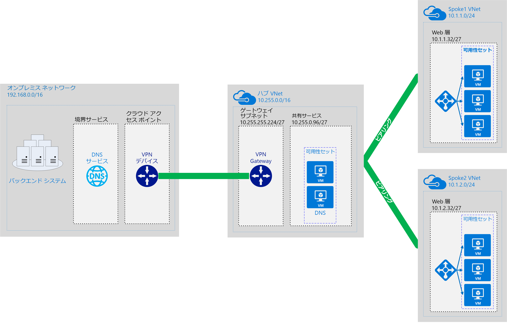

# ソフトウェア定義ネットワーク:ハブ アンド スポークSoftware Defined Networks: Hub and Spoke

ハブ アンド スポークのネットワーク モデルは、複数接続されている仮想ネットワークに、Azure ベースのクラウド ネットワーク インフラストラクチャを編成します。The hub and spoke networking model organizes your Azure-based cloud network infrastructure into multiple connected virtual networks. このモデルを使用すると、一般的な通信やセキュリティの要件をより効率的に管理し、潜在的なサブスクリプションの制限に対処できます。This model allows you to more efficiently manage common communication or security requirements and deal with potential subscription limitations.

ハブ アンド スポークのモデルで、*ハブ*は、外部接続を管理したり、複数のワークロードによって使用されるサービスをホストしたりするための中心的な場所として機能する仮想ネットワークです。In the hub and spoke model, the *hub* is a virtual network that acts as a central location for managing external connectivity and hosting services used by multiple workloads. *スポーク*は、ワークロードをホストし、[仮想ネットワーク ピアリング](/virtual-network/virtual-network-peering-overview)を介して中央のハブに接続する仮想ネットワークです。The *spokes* are virtual networks that host workloads and connect to the central hub through [virtual network peering](/virtual-network/virtual-network-peering-overview).

ワークロード スポーク ネットワークを出入りするすべてのトラフィックは、ハブ ネットワークを介してルーティングされます。そのハブ ネットワークで、集中管理された IT 規則またはプロセスによってトラフィックをルーティング、検査、またはその他の方法で管理できます。All traffic passing in or out of the workload spoke networks is routed through the hub network where it can be routed, inspected, or otherwise managed by centrally managed IT rules or processes.

このモデルは、次の問題に対処することを目的としています。This model aims to address the following issues:

- コストの削減と管理の効率。Cost savings and management efficiency. 複数のワークロードで共有できるサービス (ネットワーク仮想アプライアンス (NVA) や DNS サーバーなど) を 1 か所に集めることで、IT は複数のワークロードにわたって過剰なリソースと管理作業を最小限にすることができます。Centralizing services that can be shared by multiple workloads, such as network virtual appliances (NVAs) and DNS servers, in a single location allows IT to minimize redundant resources and management effort across multiple workloads.
- サブスクリプションの制限の克服。Overcoming subscriptions limits. 大規模なクラウド ベースのワークロードでは、単一の Azure サブスクリプション内で許可されるリソースよりも多くのリソースの使用が求められる場合があります ([サブスクリプションの制限](/azure/azure-subscription-service-limits)をご覧ください)。Large cloud-based workloads may require the use of more resources than are allowed within a single Azure subscription (see [subscription limits](/azure/azure-subscription-service-limits)). さまざまなサブスクリプションから中央のハブへのワークロード仮想ネットワークのピアリングで、こうした制限を克服できます。Peering workload virtual networks from different subscriptions to a central hub can overcome these limits.
- 懸念事項の分離。Separation of concerns. 中央の IT チームとワークロード チームの間で個々 のワークロードをデプロイする機能。The ability to deploy individual workloads between central IT teams and workloads teams.

次の図は、集中管理されたハイブリッド接続を含むハブ アンド スポークのアーキテクチャの例を示しています。The following diagram shows an example hub and spoke architecture including centrally managed hybrid connectivity.

ハブ アンド スポークのアーキテクチャは、ハイブリッド ネットワーク アーキテクチャと共によく使用され、複数のワークロード間で共有されるオンプレミス環境への集中管理された接続を提供します。The hub and spoke architecture is often used alongside the hybrid networking architecture, providing a centrally managed connection to your on-premises environment shared between multiple workloads. このシナリオでは、ワークロードとオンプレミスの間を移動するすべてのトラフィックはハブを通過します。そのハブで、トラフィックを管理および保護できます。In this scenario, all traffic traveling between the workloads and on-premises passes through the hub where it can be managed and secured.

## ハブ アンド スポークの前提条件Hub and spoke assumptions

ハブ アンド スポークの仮想ネットワーク アーキテクチャの実装は、以下のことを前提とします。Implementing a hub and spoke virtual networking architecture assumes the following:

- クラウドのデプロイには、開発、テスト、実稼働などの個別の作業環境でホストされるワークロードが含まれ、それらはすべて DNS やディレクトリ サービスなどの一連の共通サービスに依存します。Your cloud deployments will involve workloads hosted in separate working environments, such as development, test, and production, that all rely on a set of common services such as DNS or directory services.
- ワークロードは相互に通信する必要はありませんが、共通の外部通信と共有サービスの要件があります。Your workloads do not need to communicate with each other but have common external communications and shared services requirements.
- ワークロードには、単一の Azure サブスクリプション内で使用できるリソースよりも多くのリソースが必要です。Your workloads require more resources than are available within a single Azure subscription.
- ワークロード チームには、外部接続に対する集中的なセキュリティ管理を維持しながら、自身のリソースに対する委任管理権限を付与する必要があります。You need to provide workload teams with delegated management rights over their own resources while maintaining central security control over external connectivity.

## グローバルなハブ アンド スポークGlobal hub and spoke

ハブ アンド スポークのアーキテクチャの実装は、通常、ネットワーク間の待機時間を最小限に抑えるために、同じ Azure リージョンにデプロイされた仮想ネットワークを使用して行われます。Hub and spoke architectures are commonly implemented with virtual networks deployed to the same Azure Region to minimize latency between networks. ただし、世界規模で展開している大規模組織では、可用性、ディザスター リカバリー、または規制の要件のために、複数のリージョンにわたってワークロードをデプロイすることが必要な場合があります。However, large organizations with global reach may need to deploy workloads across multiple regions for availability, disaster recovery, or regulatory requirements. ハブ アンド スポーク モデルは、Azure の[グローバル仮想ネットワーク ピアリング](/azure/virtual-network/virtual-network-peering-overview)の使用により、集中管理と共有サービスをリージョン全体に拡張し、世界中に分散したワークロードをサポートすることができます。Through the use of Azure [global virtual network peering](/azure/virtual-network/virtual-network-peering-overview), the hub and spoke model can extend centralized management and shared services across regions to support workloads distributed across the world.

## 詳細情報Learn more

ハブ アンド スポークのネットワークを Azure に実装する方法の例については、Azure の参照アーキテクチャのサイトで次の例をご覧ください。For examples of how to implement hub and spoke networks on Azure, see the following examples on the Azure Reference Architectures site:

- [Azure にハブスポーク ネットワーク トポロジを実装するImplement a hub-spoke network topology in Azure](../../../reference-architectures/hybrid-networking/hub-spoke.md)
- [Azure に共有サービスを含むハブスポーク ネットワーク トポロジを実装するImplement a hub-spoke network topology with shared services in Azure](../../../reference-architectures/hybrid-networking/shared-services.md)
