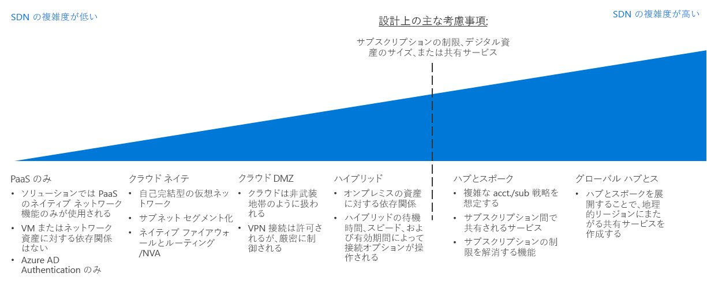

# CAF: ソフトウェア定義ネットワーク意思決定ガイドCAF: Software Defined Network decision guide

ソフトウェア定義ネットワーク (SDN) は、ソフトウェアを使用して一元管理、構成、および変更できる仮想ネットワーク機能を可能にするように設計されたネットワーク アーキテクチャです。Software Defined Networking (SDN) is a network architecture designed to allow virtualized networking functionality that can be centrally managed, configured, and modified through software. SDN は物理ネットワーク インフラストラクチャ上に抽象化レイヤーを提供して、オンプレミスのネットワーク内にある物理的なルーター、ファイアウォール、その他のネットワーク ハードウェアに相当する仮想化された機器を実現します。SDN provides an abstraction layer over the physical networking infrastructure, and enables the virtualized equivalent to physical routers, firewalls, and other networking hardware you would find in an on-premises network.

SDN を使用すると、IT スタッフは、仮想化されたリソースを使用してワークロード ニーズをサポートするネットワーク構造および機能を構成してデプロイできます。SDN allows IT staff to configure and deploy network structures and capabilities that support workload needs using virtualized resources. ソフトウェア ベースのデプロイ管理の柔軟性により、ネットワーク リソースの迅速な変更が可能になり、俊敏なデプロイ モデルと従来のデプロイ モデルの両方をサポートできるようになります。The flexibility of software-based deployment management enables rapid modification of networking resources and allows the ability to support both agile and traditional deployment models. SDN テクノロジで作成された仮想ネットワークは、パブリック クラウド プラットフォーム上にセキュリティで保護されたネットワークを作成するために重要です。Virtualized networks created with SDN technology are critical to creating secure networks on a public cloud platform.

## ネットワークの意思決定ガイドNetworking decision guide

ジャンプ先:[PaaS のみ](paas-only.md) | [クラウド ネイティブ](cloud-native.md) | | [クラウド DMZ](cloud-dmz.md) [ハイブリッド](hybrid.md) | [ハブ/スポーク モデル](hub-spoke.md) | [詳細情報](#learn-more)Jump to: [PaaS Only](paas-only.md) | [Cloud native](cloud-native.md) | | [Cloud DMZ](cloud-dmz.md) [Hybrid](hybrid.md) | [Hub/Spoke model](hub-spoke.md) | [Learn more](#learn-more)

SDN では、さまざまな度合いの価格と複雑さを持ついくつかのオプションが提供されます。SDN provides several options with varying degrees of pricing and complexity. 上の検出ガイドは、これらのオプションを、特定のビジネスおよびテクノロジ戦略に最も整合するようにすばやく個人用に設定するためのリファレンスを提供します。The above discovery guide provides a reference to quickly personalize these options to best align with specific business and technology strategies.

このガイドに示されている変曲点は、クラウド戦略チームがネットワーク アーキテクチャに関して意思決定する前に行った、いくつかの重要な意思決定によって異なります。The inflection point in this guide depends on several key decisions that your Cloud Strategy team have made before making decisions about networking architecture. これらの中で最も重要なのは、[デジタル資産の定義](../../digital-estate/overview.md)および[サブスクリプション設計](../subscriptions/overview.md)に関連する意思決定です (これには、クラウド会計やグローバル市場の戦略に関連して行った意思決定からの入力も必要になる可能性があります)。Most important among these are decisions involving your [Digital Estate definition](../../digital-estate/overview.md) and [Subscription Design](../subscriptions/overview.md) (which may also require inputs from decisions made related to your cloud accounting and global markets strategies).

VM の数が 1,000 未満の小さな単一リージョン デプロイが、この変曲点によって大きく影響を受ける可能性はあまりありません。Small, single region deployments of less than 1,000 VMs are less likely to be significantly affected by this inflection point. 逆に、1,000 を超える VM、複数の事業単位、または複数の地政学市場を使用した大きな導入作業は、SDN に関する意思決定やこの重要な変曲点によって大きく影響を受ける可能性があります。Conversely, large adoption efforts with more than 1,000 VMs, multiple business units, or multiple geo-politic markets, could be substantially affected by your SDN decision and this key inflection point.

## 適切な仮想ネットワーク アーキテクチャの選択Choosing the right virtual networking architectures

このセクションでは、適切な仮想ネットワーク アーキテクチャの選択に役立つように意思決定ガイドをさらに詳細に説明します。This section expands on the decision guide to help you choose the right virtual networking architectures.

クラウド ベースの仮想ネットワークを作成するために SDN テクノロジを実装するには多くの方法があります。There are many ways to implement SDN technologies to create cloud-based virtual networks. 移行で使用される仮想ネットワークをどのように構築するか、およびこれらのネットワークが既存の IT インフラストラクチャとどのように対話するかは、ワークロードの要件とガバナンスの要件の組み合わせによって異なります。How you structure the virtual networks used in your migration and how those networks interact with your existing IT infrastructure will depend on a combination of the workload requirements and your governance requirements.

クラウド移行を計画するときにどの仮想ネットワーク アーキテクチャまたはアーキテクチャの組み合わせを考慮すべきかを計画する場合は、組織にとって何が適切かを判定するのに役立つ次の質問を考慮してください。When planning which virtual networking architecture or combination of architectures to consider when planning your cloud migration, consider the following questions to help determine what's right for your organization:

| 質問Question | PaaS のみPaaS Only | クラウド ネイティブCloud Native | クラウド DMZCloud DMZ | ハイブリッドHybrid | ハブ アンド スポークHub and Spoke |
|-----|-----|-----|-----|-----|-----|
| ワークロードでは PaaS サービスのみを使用し、それらのサービス自体によって提供されるものを超えるネットワーク機能は必要ありませんか?Will your workload only use PaaS services and not require networking capabilities beyond those provided by the services themselves? | はいYes | いいえ No | いいえ No | いいえ No | いいえ No |
| ワークロードにはオンプレミスのアプリケーションとの統合が必要ですか?Does your workload require integration with on-premises applications? | いいえ No | いいえ No | 可能 Yes | はいYes | はいYes |
| 成熟したセキュリティ ポリシーや、オンプレミスのネットワークとクラウド ネットワークの間のセキュリティで保護された接続を確立していますか?Have you established mature security policies and secure connectivity between your on-premises and cloud networks? | いいえ No | いいえ No | いいえ No | 可能 Yes | はいYes |
| ワークロードにはクラウド ID サービスでサポートされていない認証サービスが必要ですか、またはオンプレミスのドメイン コントローラーへの直接アクセスが必要ですか?Does your workload require authentication services not supported through cloud identity services, or do you need direct access to on-premises domain controllers? | いいえ No | いいえ No | いいえ No | 可能 Yes | はいYes |
| 多数の VM やワークロードをデプロイして管理する必要がありますか?Will you need to deploy and manage a large number of VMs and workloads? | いいえ No | いいえ No | いいえ No | いいえ No | はいYes |
| リソースに対する制御を個々のワークロード チームに委任している間、一元管理およびオンプレミスの接続を提供する必要がありますか?Will you need to provide centralized management and on-premises connectivity while delegating control over resources to individual workload teams? | いいえ No | いいえ No | いいえ No | いいえ No | はいYes |

## 仮想ネットワークのアーキテクチャVirtual networking architectures

主なソフトウェア定義ネットワーク アーキテクチャの詳細について説明します。Learn more about the primary software defined networking architectures:

- [**PaaS のみ**](paas-only.md): サービスとしてのプラットフォーム (PaaS) 製品は、限られた一連の組み込みのネットワーク機能をサポートしているため、ワークロードの要件をサポートするために、明示的に定義されたソフトウェア定義ネットワークを必要としない可能性があります。[**PaaS Only**](paas-only.md): Platform as a service (PaaS) products support a limited set of built-in networking features and may not require an explicitly defined software defined network to support workload requirements.
- [**クラウド ネイティブ**](cloud-native.md): クラウド ネイティブ仮想ネットワークは、クラウド プラットフォームにリソースをデプロイするときの既定のソフトウェア定義ネットワーク アーキテクチャです。[**Cloud Native**](cloud-native.md): A cloud native virtual network is the default software defined networking architecture when deploying resources to a cloud platform.
- [**クラウド DMZ**](cloud-dmz.md): クラウド環境での非武装地帯の実装によってセキュリティ保護される、オンプレミスのネットワークとクラウド ネットワークの間の制限された接続を提供します。[**Cloud DMZ**](cloud-dmz.md): Provides limited connectivity between your on-premises and cloud network which is secured through the implementation of a demilitarized zone on the cloud environment.
- [**ハイブリッド**](hybrid.md): ハイブリッド クラウド ネットワーク アーキテクチャでは、仮想ネットワークはオンプレミスのリソースにアクセスでき、その逆も可能です。[**Hybrid**](hybrid.md): The hybrid cloud network architecture allows virtual networks to access your on-premises resources and vice versa.
- [**ハブ アンド スポーク**](hub-spoke.md): ハブ アンド スポーク アーキテクチャでは、外部の接続や共有サービスを一元管理したり、個々のワークロードを分離したり、潜在的なサブスクリプションの制限を克服したりできます。[**Hub and Spoke**](hub-spoke.md): The hub and spoke architecture allows you to centrally manage external connectivity and shared services, isolate individual workloads, and overcome potential subscription limits.

## 詳細情報Learn more

Azure プラットフォームでのソフトウェア定義ネットワークの詳細については、次の記事を参照してください。See the following for more information about software defined networking in the Azure platform.

- [Azure Virtual Network](/azure/virtual-network/virtual-networks-overview)。[Azure Virtual Network](/azure/virtual-network/virtual-networks-overview). Azure では、コアの SDN 機能は、物理的なオンプレミスのネットワークに類似したクラウドとして機能する Azure Virtual Network によって提供されます。On Azure, the core SDN capability is provided by Azure Virtual Network, which acts as a cloud analog to physical on-premises networks. 仮想ネットワークはまた、プラットフォーム上のリソース間の既定の分離境界としても機能します。Virtual networks also act as a default isolation boundary between resources on the platform.
- [Azure のネットワーク セキュリティに関するベスト プラクティス](/azure/security/azure-security-network-security-best-practices)。[Azure Network Security Best Practices](/azure/security/azure-security-network-security-best-practices). セキュリティの脆弱性を最小限に抑えるように仮想ネットワークを構成する方法に関する Azure セキュリティ チームからの推奨事項。Recommendations from the Azure Security team on how to configure your virtual networks to minimize security vulnerabilities.

## 次の手順Next steps

運用チームがクラウド ワークロードの正常性やポリシーのコンプライアンスを管理するためにログ、監視、およびレポートをどのように使用するかについて学習します。Learn how logs, monitoring, and reporting are used by operations teams to manage the health and policy compliance of cloud workloads.

> [!div class="nextstepaction"]
> [ログとレポートLogs and Reporting](../log-and-report/overview.md)
