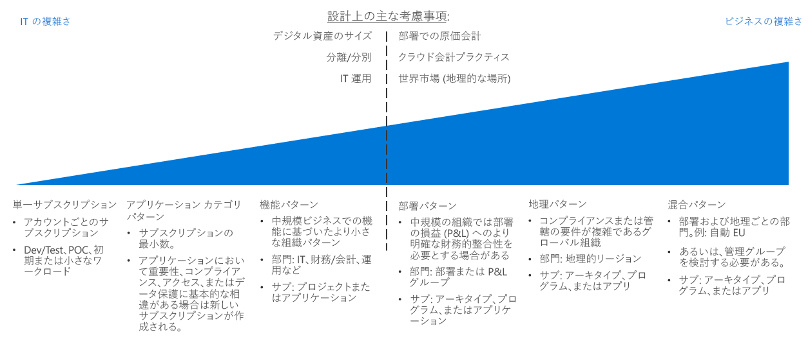
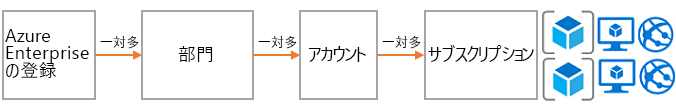
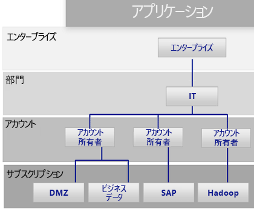
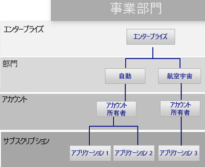
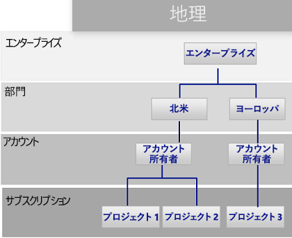

# サブスクリプション決定ガイドSubscription decision guide

すべてのクラウド プラットフォームは、組織にさまざまな課金とリソース管理のオプションを提供するコア所有権モデルに基づきます。All cloud platforms are based on a core ownership model that provides organizations with numerous billing and resource management options. Azure で使用される構造は、組織階層とグループ化されたサブスクリプション所有権に対するさまざまなサポート オプションが含まれるため、他のクラウド プロバイダーのものと異なります。The structure that Azure uses is different from other cloud providers because it includes various support options for organizational hierarchy and grouped subscription ownership. いずれにしても、一般に、課金に関する 1 人の責任者と、それとは別にリソース管理のために割り当てられた 1 人の最上位所有者が存在します。Regardless, there is generally one individual responsible for billing and another who is assigned as the top-level owner for managing resources.

ジャンプ先:[サブスクリプションの設計と Azure Enterprise Agreement](#subscriptions-design-and-azure-enterprise-agreements) | [サブスクリプションの設計パターン](#subscription-design-patterns) | [管理グループ](#management-groups) | [サブスクリプション レベルでの組織](#organization-at-the-subscription-level)Jump to: [Subscriptions design and Azure Enterprise Agreements](#subscriptions-design-and-azure-enterprise-agreements) | [Subscription design patterns](#subscription-design-patterns) | [Management groups](#management-groups) | [Organization at the subscription level](#organization-at-the-subscription-level)

サブスクリプションの設計は、企業がクラウドの導入時に構造を確立したり資産を整理したりするために使用する、最も一般的な戦略の 1 つです。Subscription design is one of the most common strategies that companies use to establish a structure or organize assets during cloud adoption.

**サブスクリプションの階層**:"*サブスクリプション*" とは、Azure サービス (仮想マシン、SQL DB、App Services、コンテナーなど) の論理的なコレクションです。**Subscription hierarchy**: A *subscription* is a logical collection of Azure services (such as virtual machines, SQL DB, App Services, or containers). Azure の各資産は、1 つのサブスクリプションにデプロイされます。Each asset in Azure is deployed to a single subscription. その後、各サブスクリプションは 1 つの "*アカウント*" によって所有されます。Each subscription is then owned by one *account*. このアカウントは、サブスクリプション全体の課金と管理に関するアクセスを提供するユーザー アカウント (または、なるべくならサービス アカウント) です。This account is a user account (or preferably a service account) that provides billing and administrative access across a subscription. Enterprise Agreement (EA) によって一定量の Azure の使用を約束されたお客様の場合は、"*部署*" と呼ばれる別の管理レベルが追加されます。For customers who have made a commitment to use a specific amount of Azure through an Enterprise Agreement (EA), another level of control called a *department* is added. EA ポータルでは、サブスクリプション、アカウント、部署を使用して、課金と管理のための階層を作成することができます。In the EA portal, subscription, accounts, and departments can be used to create a hierarchy for billing and management purposes.

サブスクリプションの設計にはさまざまな複雑さがあります。The complexity of subscription designs varies. 設計の戦略に関する決定には、一般にビジネスと IT 両方の制約が含まれており、固有の転換点があります。Decisions regarding a design strategy have unique inflection points, as they typically involve both business and IT constraints. 技術的な決定を行う前に、IT アーキテクトと意思決定者は、業務部門の関係者やクラウド戦略チームと協力して、望ましいクラウド アカウンティング アプローチ、部署内の原価計算手法、組織のグローバル マーケット ニーズを理解する必要があります。Before making technical decisions, IT architects and decision makers should work with the business stakeholders and the cloud strategy team to understand the desired cloud accounting approach, cost accounting practices within your business units, and global market needs for your organization.

**転換点**:上の図の破線は、サブスクリプション設計のパターンの複雑さが異なる転換点を示しています。**Inflection point**: The dashed line in the image above references an inflection point between simple and more complex patterns for subscription design. 通常、デジタル資産のサイズと Azure サブスクリプションの制限の比較に基づく追加の技術的な決定ポイント、分離と隔離のポリシー、および IT 運用部門は、サブスクリプションの設計に大きな影響を与えます。Additional technical decision points based on digital estate size versus Azure subscription limits, isolation and segregation policies, and IT operational divisions usually have a significant effect on subscription design.

**その他の考慮事項**:サブスクリプションの設計を選択するときに注意すべき重要な点は、リソースまたはデプロイをグループ化するための手段は、サブスクリプションだけではないということです。**Other considerations**: An important thing to note when selecting a subscription design is that subscriptions aren’t the only way to group resources or deployments. サブスクリプションが作成されたのは Azure の初期であるため、Azure Service Manager のような以前の Azure ソリューションに関連する制限があります。Subscriptions were created in the early days of Azure, as such they have limitations related to previous Azure solutions like Azure Service Manager.

デプロイの構造、自動化、およびリソース グループ化の新しい方法によって、構造のサブスクリプション設計が影響を受ける場合があります。Deployment structure, automation, and new approaches to grouping resources can affect your structure subscription design. サブスクリプションの設計を最終的に決定する前に、[リソースの整合性](../resource-consistency/overview.md)に関する決定が設計の選択に与える可能性がある影響について検討してください。Before finalizing a subscription design, consider how [resource consistency](../resource-consistency/overview.md) decisions might influence your design choices. たとえば、多国籍の大規模な組織では、最初にサブスクリプション管理の複雑なパターンを検討する場合があります。For example, a large multinational organization might initially consider a complex pattern for subscription management. ただし、その同じ会社でも、管理グループの階層を追加することによってもっとシンプルな部署パターンにすることで、大きなメリットが実現される可能性があります。However, that same company might realize greater benefits with a simpler business unit pattern by adding a management group hierarchy.

## サブスクリプションの設計と Azure Enterprise AgreementSubscriptions design and Azure Enterprise agreements

すべての Azure サブスクリプションは 1 つのアカウントに関連付けられ、アカウントは各サブスクリプションに対する課金と最上位レベルのアクセス制御に結び付けられています。All Azure subscriptions are associated with one account, which is connected to billing and top-level access control for each subscription. 1 つのアカウントで、複数のサブスクリプションを所有でき、サブスクリプション組織の基本レベルを提供できます。A single account can own multiple subscriptions and can provide a base level of subscriptions organization.

小規模の Azure デプロイでは、単一のサブスクリプションまたはサブスクリプションの小さいコレクションにより、クラウド資産全体が構成される場合があります。For small Azure deployments, a single subscription or a small collection of subscriptions may compose your entire cloud estate. 一方、大規模な Azure デプロイでは、組織の構造をサポートし、[サブスクリプションのクォータと制限](/azure/azure-subscription-service-limits)をバイパスするために、複数のサブスクリプションを含むことが必要になる可能性があります。However, large Azure deployments likely need to span multiple subscriptions to support your organizational structure and bypass [subscription quotas and limits](/azure/azure-subscription-service-limits).

各 Azure Enterprise Agreement では、組織の優先順位が反映された階層にサブスクリプションとアカウントをさらに整理する機能が提供されます。Each Azure Enterprise Agreement provides a further ability to organize subscriptions, and accounts into hierarchies that reflect your organizational priorities. 組織のエンタープライズ加入契約では、契約の観点から、企業内での Azure サービスの構造と使用方法が定められています。Your organizational enterprise enrollment defines the shape and use of Azure services within your company from a contractual point of view. 各エンタープライズ契約の範囲内で、組織の構造に合わせて、環境を部署、アカウント、サブスクリプションにさらに分割できます。Within each enterprise agreement, you can further subdivide the environment into departments, accounts, and subscriptions to match your organization's structure.

## サブスクリプションの設計パターンSubscription design patterns

すべての企業は異なります。Every enterprise is different. そのため、Azure Enterprise Agreement 全体で有効な部署/アカウント/サブスクリプションの階層では、非常に柔軟に Azure を編成できます。Therefore, the department/account/subscription hierarchy enabled throughout an Azure Enterprise Agreement allows for significant flexibility in how Azure is organized. 企業の課金、リソース管理、リソース アクセスのニーズを反映するように組織の階層をモデル化することは、パブリック クラウドを使い始めるときに最初に行う最も重要な決定事項です。Modeling your organization's hierarchy to reflect the needs of your company for billing, resource management, and resource access is the first, and most important, decision that you make when starting in the public cloud.

次のサブスクリプション パターンでは、潜在的な組織の優先順位をサポートするために、サブスクリプション設計の複雑さが一般的に増すことが反映されています。The following subscription patterns reflect a general increase in subscription design complexity to support potential organizational priorities:

### 1 つのサブスクリプションSingle subscription

デプロイする必要があるクラウドでホストされた資産の数が少ない組織では、アカウントごとに 1 つのサブスクリプションで十分な場合があります。A single subscription per account may suffice for organizations that need to deploy a small number of cloud-hosted assets. 多くの場合、これはクラウド導入プロセスを始めるときに実装する最初のサブスクリプション パターンであり、クラウド プラットフォームの機能を調べるための実験的または概念実証的なデプロイが小規模で済みます。This is often the first subscription pattern you implement when beginning your cloud adoption process, allowing small-scale experimental or proof of concept deployments to explore the capabilities of a cloud platform.

ただし、1 つのサブスクリプションでサポートされるリソースの数には技術的な制限があります。However, there can be technical limitations to the number of resources that a single subscription will support. クラウド資産の規模が大きくなると、単一サブスクリプションではサポートされない方法でポリシーとアクセス制御を整理するために、リソースの編成もサポートすることが必要になる場合があります。As the size of your cloud estate grows, you may likely want to also support organizing your resources to better organize policies and access control in a manner not supported with a single subscription.

### アプリケーション カテゴリ パターンApplication category pattern

組織のクラウド フットプリントの規模が大きくなると、複数のサブスクリプションを使用する可能性がますます高くなります。As the size of an organization's cloud footprint grows, the use of multiple subscriptions becomes increasingly likely. このシナリオでのサブスクリプションは、一般に、ビジネスの重要度、コンプライアンスの要件、アクセス制御、またはデータ保護のニーズが根本的に異なるアプリケーションをサポートするために作成されます。In this scenario, subscriptions are generally created to support applications that have fundamental differences in business criticality, compliance requirements, access controls, or data protection needs. これらのアプリケーション カテゴリをサポートするサブスクリプションとアカウントはすべて 1 つの部署の下に編成され、部署は中央の IT 運用スタッフによって所有および管理されます。The subscriptions and accounts supporting these application categories are all organized under a single department which is owned and administered by central IT operations staff.

アプリケーションの分類方法の選択は組織ごとに異なり、多くの場合、特定のアプリケーションやサービスに基づいて、またはアプリケーションのアーキタイプの系統に沿って、サブスクリプションが分けられます。Each organization will choose to categorize applications differently, often separating subscriptions based on specific applications or services or along the lines of application archetypes. このパターンでの個別サブスクリプションを正当化する可能性のあるワークロードは次のとおりです。Workloads that might justify a separate subscription under this pattern include:

- 実験的アプリケーションまたは低リスク アプリケーションExperimental or low-risk applications
- 保護されたデータを含むアプリケーションApplications with protected data
- ミッション クリティカルなワークロードMission-critical workloads
- 規制の要件の対象となるアプリケーション (HIPAA、FedRAMP など)Applications subject to regulatory requirements (such as HIPAA or FedRAMP)
- バッチ ワークロードBatch workloads
- Hadoop などのビッグ データ ワークロードBig data workloads such as Hadoop
- Kubernetes などのデプロイ オーケストレーターを使用するコンテナー化されたワークロードContainerized workloads using deployment orchestrators such as Kubernetes
- 分析ワークロードAnalytics workloads

このパターンでは、複数のアカウント所有者で特定のワークロードを担当することがサポートされています。This pattern supports multiple accounts owners responsible for specific workloads. このパターンでは、エンタープライズ契約階層の部署レベルでのさらに複雑な構造がないので、Azure Enterprise Agreement を実装する必要はありません。As it lacks a more complex structure at the department level of the enterprise agreement hierarchy, this pattern does not require an Azure Enterprise Agreement to implement.

### 機能パターンFunctional pattern

このパターンでは、Azure Enterprise Agreement のお客様に提供される企業/部署/アカウント/サブスクリプションの階層を使用し、財務、営業、IT サポートなどの機能ラインに沿って、サブスクリプションとアカウントが編成されます。This pattern organizes subscriptions and accounts along functional lines, such as finance, sales, or IT support, using the Enterprise/Department/Account/subscription hierarchy provided to Azure enterprise agreement customers.

### 部署パターンBusiness unit pattern

このパターンでは、Azure Enterprise Agreement の階層を使用し、損益カテゴリ、部署、部門、利益センター、または同様のビジネス構造に基づいて、サブスクリプションとアカウントがグループ化されます。This pattern groups subscriptions and accounts based on profit and loss category, business unit, division, profit center, or similar business structure using the Azure Enterprise Agreement hierarchy.

### 地理的パターンGeographic pattern

国際的な組織では、このパターンにより、Azure Enterprise Agreement の階層を使用し、地理的な地域に基づいてサブスクリプションとアカウントをグループ化します。For organizations with global operations, this pattern groups subscriptions and accounts based on geographic regions using the Azure Enterprise Agreement hierarchy.

### 混合パターンMixed patterns

企業/部署/アカウント/サブスクリプションの階層。enterprise/department/account/subscriptions hierarchy. ただし、地理的地域と部署のようなパターンの組み合わせにより、いっそう複雑な社内の課金と組織の構造を反映することができます。However, you can combine patterns such as geographic region and business unit to reflect more complex billing and organizational structures within your company. さらに、[リソース整合性の設計](../resource-consistency/overview.md)により、サブスクリプション設計のガバナンスと組織の構造をさらに拡張できます。In addition, your [resource consistency design](../resource-consistency/overview.md) can further extend the governance and organizational structure of your subscription design.

管理グループは、次のセクションで説明するように、より複雑な組織構造のサポートに役立つ場合があります。Management groups, as discussed in the following section, can help support more complicated organizational structures.

管理グループは、次のセクションで説明するように、より複雑な組織構造のサポートに役立つ場合があります。Management groups, discussed in the following section, can help support more complicated organizational structures.

## 管理グループManagement groups

Enterprise Agreement によって提供される部署と組織の構造だけでなく、[Azure 管理グループ](/azure/governance/management-groups/index)でも、複数のサブスクリプションにまたがるポリシー、アクセス制御、コンプライアンスを柔軟に整理できます。In addition to the department and organization structure provided through Enterprise Agreements, [Azure management groups](/azure/governance/management-groups/index) offer additional flexibility for organizing policy, access control, and compliance across multiple subscriptions. 管理グループは最大 6 レベルまで入れ子にでき、課金階層とは異なる階層を作成できます。Management groups can be nested up to six levels, allowing you to create a hierarchy that is separate from your billing hierarchy. これは、リソースの効率的な管理だけを目的としたものであってもかまいません。This can be solely for efficient management of resources.

管理グループは課金階層を正確に反映するように作成できます。多くの企業ではそのように開始しています。Management groups can mirror your billing hierarchy, and often enterprises start that way. しかしながら、管理グループが大いに力を発揮するのは、関連するサブスクリプション (課金階層での位置にかかわらず) をグループ化して、共通のロールだけでなくポリシーとイニシアティブも割り当てる必要がある組織のモデル化に使用するときです。However, the power of management groups is when you use them to model your organization where related subscriptions &mdash; regardless of where they are in the billing hierarchy &mdash; are grouped together and need common roles assigned along with policies and initiatives.

たとえば、次のようになります。Examples include:

- 運用/非運用:一部の企業は、運用サブスクリプションと非運用サブスクリプションを識別するために管理グループを作成します。Production/non-production: Some enterprises create management groups to identify their production and non-production subscriptions. このような顧客は管理グループを使用すると、ロールとポリシーを容易に管理できます。たとえば、非運用サブスクリプションでは開発者が "共同作成者" としてアクセスできるようにしますが、運用サブスクリプションでは "閲覧者" アクセス権のみを持ちます。Management groups allow these customers to more easily manage roles and policies, for example: non-production subscription may allow developers "contributor" access, but in production, they have only "reader" access.
- 内部サービス/外部サービス:運用/非運用とよく似ています。企業では、多くの場合、内部サービスと外部サービス (顧客用) で要件、ポリシー、ロールが異なります。Internal services/external services: Much like production/non-production, enterprises often have different requirements, policies, and roles for internal services versus external customer-facing services.

## サブスクリプション レベルでの組織Organization at the subscription level

部署とアカウント (または管理グループ) を決定するときは、主として、組織に合わせて Azure 環境を分割する方法を決める必要があります。When determining your departments and accounts (or management groups), you will primarily need to decide how you're going to divide your Azure environment to match your organization. ただし、サブスクリプションは実際の処理が行われる場所であるため、ここれらの決定はセキュリティ、スケーラビリティ、課金に影響を与えます。However, subscriptions are where the real work happens, and these decisions will impact security, scalability, and billing.

ガイドとして次のパターンを検討してください。Consider the following patterns as guides:

- **アプリケーション/サービス**:サブスクリプションはアプリケーションまたはサービス (アプリケーションのポートフォリオ) を表します。**Application/service**: Subscriptions represent an application or a service (portfolio of applications).

- **ライフサイクル**:サブスクリプションはサービスのライフサイクル (運用または開発など) を表します。**Lifecycle**: Subscriptions represent a lifecycle of a service, such as production or development.

- **部門**:サブスクリプションは組織内の部門を表します。**Department**: Subscriptions represent departments in the organization.

最初の 2 つのパターンが最もよく使用されており、どちらも強くお薦めします。The first two patterns are the most commonly used and are both highly recommended. ライフサイクルのアプローチはほとんどの組織に適しています。The lifecycle approach is appropriate for most organizations. この場合の一般的な推奨事項は、2 つの基本的なサブスクリプション (運用と非運用) を使用してから、リソース グループを使用して環境をさらに分割することです。In this case, the general recommendation is to use two base subscriptions: production and non-production, and then use resource groups to break out the environments further.

リソースのグループ化と管理に Azure サブスクリプションとリソース グループを使用する方法についての一般的な説明は、「[Azure でのリソース アクセス管理](../../getting-started/azure-resource-access.md)」を参照してください。For a general description of how Azure subscriptions and resource groups are used to group and manage resources, see [Resource access management in Azure](../../getting-started/azure-resource-access.md).

## 次の手順Next steps

クラウドでのアクセス制御と管理に ID サービスを使用する方法について学習します。Learn how identity services are used for access control and management in the cloud.

> [!div class="nextstepaction"]
> [IDIdentity](../identity/overview.md)
