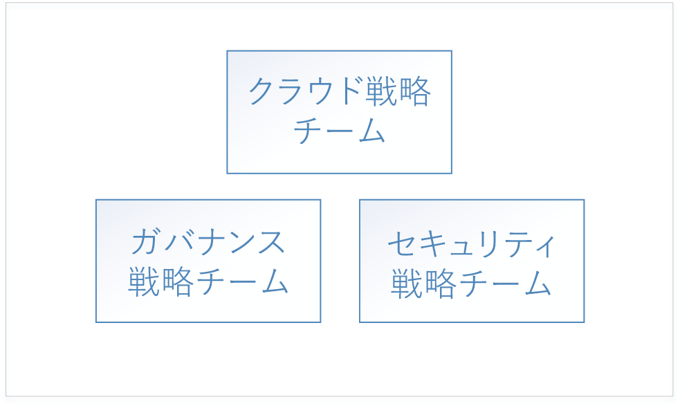
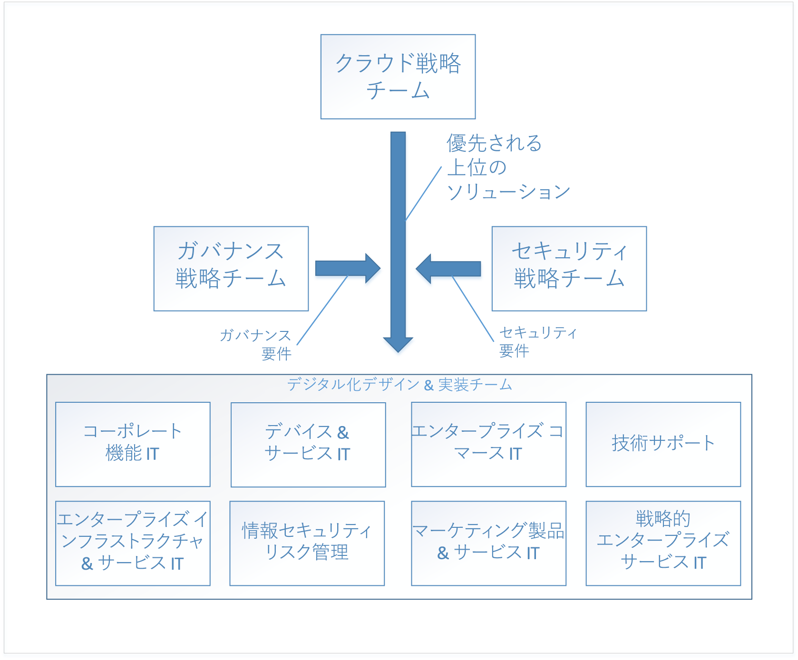

# エンタープライズ クラウドの導入: 概要Enterprise Cloud Adoption: Getting started 

クラウド コンピューティングへの**デジタル変革**は、オンプレミスでの運用からクラウドでの運用への移行を意味します。The **digital transformation** to cloud computing represents a shift from operating on-premises to operating in the cloud. この移行にはビジネスの新しい方法が含まれます。たとえば、デジタル変革により、ソフトウェアやデータ センター ハードウェアのための設備投資から、クラウド リソースを使用するための運用コストに移行します。This shift includes new ways of doing business - for example, the digital transformation shifts from capital expenditures for software and datacenter hardware to operating expenditures for usage of cloud resources. 

## デジタル変換: プロセスDigital transformation: process

クラウドの導入を成功させるには、企業は組織、従業員、プロセスがこのデジタル変換に対応できるように準備する必要があります。To be successful in adopting the cloud, an enterprise must prepare its organization, people, and processes to be ready for this digital transformation. 組織構造は企業によって異なるため、組織の準備を整える汎用的な方法はありません。Every enterprise's organizational structure is different, so there is no one-size-fits-all approach to organizational readiness. このドキュメントでは、企業が準備する際に実施できるステップの概要を説明します。This document outlines the high-level steps your enterprise can take to get ready. 組織は、ここで示す各ステップを遂行するための詳細な計画の作成に時間を費やす必要があります。Your organization will have to spend time developing a detailed plan to accomplish each of the listed steps.

デジタル変革の大まかなプロセスは次のとおりです。The high-level process for the digital transformation is:

1. クラウド戦略チームを結成します。Create a cloud strategy team. このチームはデジタル変革を牽引する役割を担います。This team is responsible for leading the digital transformation. この段階で、デジタル変革のためのガバナンス チームとセキュリティ チームを結成することも重要です。It's also important at this stage to form a governance team and a security team for the digital transformation.
2. クラウド戦略チームのメンバーは、クラウド テクノロジについて、何が新しく、何が違うのかを学びます。Members of the cloud strategy team learn what's new and different about cloud technologies.  
3. クラウド戦略チームは、デジタル変革に向けてビジネス ケースを構築して企業の準備をします。ビジネス戦略の現在のギャップをすべて列挙し、それらを排除するための大まかなソリューションを決定します。The cloud strategy team prepares the enterprise by building the business case for digital transformation - enumerates all the current gaps in business strategy and determines the high-level solutions to eliminate them.
4. ビジネス グループと共に大まかなソリューションを調整します。Align high-level solutions with business groups. 各ソリューションの設計と実装を所有する、各ビジネス グループ内の関係者を特定します。Identify stakeholders in each business group to own the design and implementation for each solution.
5. 既存の役割、スキル、プロセスを変換して、クラウド向けの役割、スキル、プロセスを含めます。Translate existing roles, skills and process to include cloud roles, skills, and process.  
<!--6. Develop processes for operating in the cloud to make solutions more robust in terms of availability, resiliency, and security. 
7. Optimize solutions for performance, scalability, and cost efficiency.-->

## ステップ 1: クラウド戦略チームを結成するStep 1: create a cloud strategy team

企業のデジタル変革の第一歩は、組織のビジネス リーダーを関与させてクラウド戦略チーム (CST) を結成することです。The first step in your enterprise's digital transformation is engaging business leaders from across the organization to create a cloud strategy team (CST). このチームは、財務グループ、IT インフラストラクチャ グループ、アプリケーション グループのビジネス リーダーで構成されます。This team consists of business leaders from finance, IT infrastructure, and application groups. これらのチームは、クラウドの分析および実験フェーズを支援できます。These teams can help with the cloud analysis and experimentation phase.

たとえば、クラウド戦略チームは、CTO が主導し、エンタープライズ アーキテクチャ チームのメンバー、IT 財務担当者、さまざまな IT アプリケーション グループ (人事、財務など) の上級技術者、インフラストラクチャ、セキュリティ、ネットワークの各チームのリーダーで構成できます。For instance, a Cloud Strategy Team could be driven by the CTO and consist of members of the enterprise architecture team, IT finance, senior technologists from various IT applications groups (HR, finance, and so on), and leaders from the infrastructure, security, and networking teams.  

また、他にガバナンス チームとセキュリティ チームという 2 つの高レベルのチームを結成することも重要です。It's also important to form two other high-level teams: a governance team, and a security team. これらのチームは、企業のガバナンス ポリシーとセキュリティ ポリシーの策定、実施、継続的な監査を担当します。These teams are responsible for designing, implementing, and the ongoing audit of the enterprise's governance and security policies. ガバナンス チームには、資産保護、コスト管理、グループ ポリシー、関連トピックに取り組んだことがあるメンバーが必要です。The governance team requires members that have worked with asset protection, cost management, group policy and related topics. セキュリティ チームには、業界の現在のセキュリティ標準と企業のセキュリティ要件を熟知しているメンバーが必要です。The security team requires members that are well versed in current industry security standards as well as the enterprise's security requirements.

ガバナンス チームは、クラウドにおける企業のガバナンス モデルの設計と実装、およびデジタル変革に含まれる共有インフラストラクチャ資産の配置と管理を担当します。The governance team is responsible for designing and implementing the enterprise's governance model in the cloud, as well as deploying and maintaining the shared infrastructure assets that are part of the digital transformation. これらの資産には、オンプレミス ネットワークをクラウドの仮想ネットワークに接続するために必要なハードウェア、ソフトウェア、クラウド リソースが含まれます。These assets include hardware, software, and cloud resources necessary to connect the on-premises network to virtual networking in the cloud.

セキュリティ チームは、ガバナンス チームと緊密に連携して、クラウドにおける企業のセキュリティ ポリシーを策定し、実施する役割を担います。The security team is responsible for designing and implementing the enterprise's security policy in the cloud, working closely with the governance team. セキュリティ チームは、クラウドの仮想ネットワークを含めるために、オンプレミス ネットワークのセキュリティ境界の拡張を管理します。The security team owns the extension of the security boundary of the on-premises network to include virtual networking in the cloud. これは、クラウド仮想ネットワーク上の受信ファイアウォールと送信ファイアウォールを所有して管理し、ツールとポリシーによって、承認されていないリソースの展開を確実に防ぐという形を取ることがあります。This may take the form of owning and maintaining the inbound and outbound firewalls on the cloud virtual network as well as ensuring that tools and policy prevent the deployment of unauthorized resources.

## ステップ 2: クラウドの何が新しいのかを学ぶStep 2: learn what's new in the cloud
 
企業のデジタル変革の次のステップでは、クラウド戦略チームのメンバーが、クラウド テクノロジによって企業のビジネスの方法がどのように変わるのかを学びます。The next step in your enterprise's digital transformation is for the members of the cloud strategy team to learn about how cloud technology will change the way the enterprise does business. これは、ビジネス、従業員、テクノロジの変革に向けた準備と計画です。This is preparation and planning for the changes to your business, people, and technology. クラウド戦略チームのメンバーは、オンプレミスと比較して、クラウドの何が新しく、何が違うのかを理解することが重要です。It's important for the members of the cloud strategy team to understand what's new and different in the cloud as compared to on-premises.

クラウドを理解するための出発点として、[Azure のしくみ](what-is-azure.md)を俯瞰的に学びます。The starting point for understanding the cloud is learning [how Azure works](what-is-azure.md) at a high level. 次に、[リソース アクセス管理を理解](azure-resource-access.md)するための準備として、[Azure のガバナンス](what-is-governance.md)の基礎を学びます。Next, learn about the basics of [governance in Azure](what-is-governance.md) in preparation for [understanding resource access management](azure-resource-access.md).

高度な学習のために、ガバナンス チームは、目次のガバナンス セクションの概念と設計ガイドを見直す必要があります。For advanced learning, the governance team should review the concepts and design guides in the governance section of the table of contents. インフラストラクチャとワークロードのセクションは、クラウドの一般的なアーキテクチャとワークロードについて学ぶのに役立ちます。The infrastructure and workloads sections are useful for learning about typical architectures and workloads in the cloud.

## ステップ 3: ビジネス戦略のギャップを特定するStep 3: identify gaps in business strategy

次に、クラウド戦略チームは、デジタル変革ソリューションを必要とするビジネス上の問題を列挙します。The next step is for the cloud strategy team to enumerate the business problems that require a digital transformation solution. たとえば、既存のオンプレミスのデータ センターに、耐用年数が経過し、交換が必要なハードウェアが存在する場合があります。For example, an enterprise may have an existing on-premises data center with end-of-life hardware that requires replacement. 別の例として、新しい機能やサービスの市場投入に時間がかかっており、競争で後れを取っている場合もあります。In another example, an enterprise may be experiencing difficulty with time-to-market for new features and services and may be falling behind to competition. これらのギャップは、企業のデジタル変革の "*目標*" を表しています。These gaps represent the *goals* of your enterprise's digital transformation.

ビジネス戦略のギャップは、次のカテゴリに分類できます。Gaps in business strategy can be classified into the following categories:

|カテゴリCategory|説明Description|
|-----|-----|
|コスト管理Cost management|企業がテクノロジの代金を支払う方法のギャップを表します。Represents a gap in the way the Enterprise pays for technology.|
|ガバナンスGovernance|コスト超過、セキュリティの問題、またはコンプライアンスの問題の原因となる可能性のある不適切な使用から資産を保護するために企業が使用するプロセスのギャップを表します。Represents a gap in the processes used by the Enterprise to protect its assets from improper usage that might result in cost overruns, security issues, or compliance issues. | 
|コンプライアンスCompliance|企業が、社内の独自のプロセスとポリシー、および外部の法律、規制、標準に従う方法のギャップを表します。Represents a gap in the way the enterprise adheres to its own internal processes and policies as well as external laws, regulations, and standards. |
|セキュリティSecurity|企業がテクノロジおよびデータ資産を外部の脅威から保護する方法のギャップを表します。Represents a gap in the way the enterprise protects its technology and data assets from external threats. |
|データ ガバナンスData governance|企業がデータ (特に顧客データ) を管理する方法のギャップを表します。Represents a gap in the way an enterprise manages its data, especially customer data. たとえば、欧州連合の新しい一般データ保護規則 (GDPR) には、顧客データの保護に関する厳しい要件があり、新しいハードウェアやソフトウェアが必要になる場合があります。For example, new General Data Protection Regulation (GDPR) in the European Union has strict requirements for the protection of customer data that may require new hardware and software.|    

ビジネス戦略のすべてのギャップをこれらのカテゴリに分類したら、次に、各問題の大まかなソリューションを決定します。Once your enterprise has classified all business strategy gaps into these categories, the next step is to determine a high-level solution for each problem.

次の表に、いくつかの例を示します。The following table illustrates several examples:

|ビジネス戦略のギャップBusiness strategy gap|カテゴリ &nbsp; &nbsp; &nbsp; &nbsp; &nbsp;Category &nbsp; &nbsp; &nbsp; &nbsp; &nbsp;|ソリューション &nbsp;&nbsp;&nbsp;&nbsp;&nbsp;&nbsp;&nbsp;&nbsp;&nbsp;&nbsp;&nbsp;&nbsp;&nbsp;&nbsp;Solution &nbsp;&nbsp;&nbsp;&nbsp;&nbsp;&nbsp;&nbsp;&nbsp;&nbsp;&nbsp;&nbsp;&nbsp;&nbsp;&nbsp;|
|-----|-----|-----|
| 現在、オンプレミスでホストされているサービスで、需要ピーク時 (使用の約 10%) に可用性、回復性、スケーラビリティに関する問題が発生しています。Services currently hosted on-premises experience issues with availability, resiliency, and scalability during time of peak demand, which is approximately ten percent of usage. オンプレミスのデータ センター内のサーバーは耐用年数が経過しています。Servers in on-premises datacenter are end-of-life. エンタープライズ IT では、ピーク需要に対処するための仕様を備えた、データ センター向けの新しいオンプレミス ハードウェアの購入を推奨しています。Enterprise IT recommends purchasing new on-premises hardware for datacenter with specifications to handle peak demand.| コスト管理Cost management | 影響を受ける既存のオンプレミスのワークロードを、クラウドのスケーラブルなリソースに移行し、使用分のみの料金を支払います。Migrate affected existing on-premises workloads to scalable resources in the cloud, paying for usage only. |
| データ管理に関する外部の法律と規制により、保存データの暗号化 (新しいハードウェアとソフトウェアが必要) を必要とする一連の標準管理に従うことが企業に求められています。External data management laws and regulations require the enterprise to adhere to set of standard controls that require encryption of data at rest, requiring new hardware and software. | データ ガバナンスData governance | 保存データを Azure Storage Service Encryption for Data at Rest に移行します。Move data to Azure storage service encryption for data at rest. |
| オンプレミスのデータ センターでホストされているサービスで、公開されているサービスに対する分散型サービス拒否 (DDoS) 攻撃が発生しています。Services hosted in on-premises datacenter been experiencing distributed denial of service (DDoS) attacks on public-facing services. この攻撃は軽減するのが難しく、新しいハードウェア、ソフトウェア、セキュリティ担当者が効果的に対処する必要があります。The attacks are difficult to mitigate and require new hardware, software, and security personnel to deal with effectively. | セキュリティSecurity | サービスを Azure に移行し、Azure DDoS Protection を利用します。Migrate services to Azure, and take advantage of Azure DDoS protection.|

ビジネス戦略のすべてのギャップを列挙し、大まかなソリューションを決定したら、リストに優先順位を付けます。When all of the gaps in business strategy have been enumerated and high-level solutions have been determined, prioritize the list. リストに優先順位を付けるには、ビジネス戦略のギャップを、各カテゴリでの企業の短期的および長期的目標に合わせます。The list can be prioritized by aligning the business strategy gaps with the enterprise's short and long-term goals in each category. たとえば、企業の短期的目標が、次の 2 つの会計四半期に IT 支出を削減することである場合、"*コスト管理*" カテゴリのビジネス ギャップには、それぞれに関連する推定コスト削減額に基づいて優先順位を付けることができます。For example, if the enterprise has a short-term goal to reduce IT spend in the next two fiscal quarters, the business gaps in the *cost management* category may be prioritized by the projected cost saving associated with each.

このプロセスの出力は、ビジネス カテゴリに合わせて調整された大まかなソリューションのスタックランク付けリストになります。The output of this process is a stack-ranked list of high-level solutions aligned with business categories. 

## ステップ 4: 大まかなソリューションをビジネス グループと共に調整してソリューションを設計するStep 4: align high-level solutions with business groups to design solutions 

デジタル変革の目標を列挙し、優先順位を付け、大まかなソリューションを提案しました。次に、クラウド戦略チームは、各ビジネス グループの設計チームおよび実装チームと共にそれぞれの大まかなソリューションを調整します。Now that the goals of the digital transformation have been enumerated, prioritized, and high-level solutions proposed, the next step is for the cloud strategy team to align each of the high-level solutions with design and implementation teams in each of the business groups. 

各チームは優先順位が付けられたリストを入手し、大まかなソリューションを検討して各ソリューションを設計します。The teams take the prioritized lists and work through each high-level solution to design each solution. 設計プロセスには、新しいインフラストラクチャと新しいワークロードの仕様が含まれます。The design process will involve the specification of new infrastructure and new workloads. また、従業員の役割と従業員が従うプロセスが変更される場合もあります。There may also be changes to the roles of the people and the processes they follow. この段階で、各設計チームは、ガバナンス チームとセキュリティ チームを交えて各設計を検討することも非常に重要です。It's also extremely important at this stage for each of the design teams to include both the governance and security teams for review of each design. 各設計は、ガバナンス チームとセキュリティ チームが定義したポリシーと手順の範囲内である必要があり、各設計の最終的な承認時にこれらのチームを含める必要があります。Each design must fall within with the policies and procedures defined by the governance and security teams, and these teams must be included in the final sign off of each design.

各ソリューションの設計は簡単な作業ではありません。設計を進める中で、他のチームの他のソリューション設計との関連を踏まえて設計を検討する必要があります。The design of each solution is a non-trivial task and as designs are created, must be considered in context with other solution designs from other teams. たとえば、一部の設計により、既存のオンプレミスのアプリケーションやサービスをクラウドに移行することになる場合は、これらをグループ化し、全体的な移行戦略を策定する方が効率的な場合があります。For example, if several of the designs result in a migration of existing on-premises applications and services to the cloud, it may be more efficient to group these together and design an overall migration strategy. 別の例として、既存のオンプレミスのアプリケーションとサービスの中に移行できないものがあり、それらを新しく開発されたサービスまたはサード パーティのサービスに置き換えることがソリューションとなる場合もあります。In another example, it may not be possible to migrate some existing on-premises applications and services and the solution may be to replace them with either new development or third-party services. この場合、これらをグループ化し、重複するものを特定して、サード パーティのサービスを複数のソリューションに使用できるかどうかを判断する方が効率的です。In this case, it may be more efficient to group these together and determine the overlap between them to determine if a third-party service can be used for more than one solution.

ソリューションの設計が完了したら、チームは各設計の実装フェーズに移ります。Once the design of the solution is complete, the team moves on to the implementation phase for each design. 各ソリューション設計の実装フェーズは、標準のプロジェクト管理プロセスを使用して実行できます。The implementation phase for each solution design can be run using standard project management processes.

## ステップ 5: 既存の役割、スキル、プロセスをクラウド向けに変換するStep 5: translate existing roles, skills, and process for the cloud

IT 業界の歴史における各進化段階で、業界の最も顕著な変化は、スタッフの役割の変化によって特徴付けられることも少なくありません。At each evolutionary phase during the history of the IT industry, the most notable industry changes are often marked by changes in staff roles. メインフレームからクライアント/サーバー モデルへの移行時には、コンピューターのオペレーターの役割がほぼ消滅し、システム管理者に置き換えられました。During the transition from mainframes to the client/server model, the role of the computer operator largely disappeared, replaced by the system administrator. 仮想化時代が到来したときには、物理サーバーを操作するスタッフの要件が減り、代わりに仮想化スペシャリストが求められるようになりました。When the age of virtualization arrived, the requirement for individuals working with physical servers diminished, replaced with a need for virtualization specialists. 同様に、組織がクラウド コンピューティングに移行するにつれて、役割が再び変化すると考えられます。Similarly, as institutions shift to cloud computing, roles will likely change again. たとえば、データ センター スペシャリストがクラウド財務アナリストに置き換えられる可能性があります。For example, datacenter specialists might be replaced with cloud financial analysts. IT 職の肩書が変わっていない場合でも、日常業務における役割は大幅に進化しています。Even in cases where IT job titles have not changed, the daily work roles have evolved significantly. 

IT スタッフは、クラウド ソリューションをサポートするために異なるスキル セットが必要であることを認識するようになるにつれて、自分の役割や立場に不安を感じている可能性があります。IT staff members may feel anxious about their roles and positions as they realize that a different set of skills is needed for the support of cloud solutions. しかし、新しいクラウド テクノロジを調査し、知識を身に付けている機敏な従業員は、このような恐れを抱く必要はありません。But agile employees who explore and learn new cloud technologies don’t need to have that fear. これらの従業員はクラウド サービスの導入を牽引し、組織が関連する変化を理解して受け入れることができるよう支援することができます。They can lead the adoption of cloud services and help the organization understand and embrace the associated changes. 

### 懸念を把握するCapturing concerns

デジタル変革を進める中で、各チームはスタッフの懸念を把握する必要があります。During the digital transformation, each team should capture any staff concerns as they arise. 懸念を把握するときは、以下を特定します。When capturing concerns, identify the following: 
* 懸念の種類。The type of concern. たとえば、スタッフはデジタル変革に伴う職務の変更に抵抗を示す可能性があります。For example, workers may be resistant to the changes in job duties that accompany the digital transformation.
* 懸念に対処していない場合の影響。The impact of the concern if it is not addressed. たとえば、デジタル変革に対する抵抗から、スタッフが必要な変更を実施するのに時間がかかる可能性があります。For example, resistance to the digital transformation may be result in workers being slow to execute the changes necessary. 
* 懸念に対処できる領域。The area equipped to address the concern. たとえば、IT 部門のスタッフが新しいスキルを習得することに難色を示している場合、IT 関係者の領域が、この懸念に最も適切に対処できます。For example, if workers in the IT department are reluctant to acquire new skills, the IT stakeholder's area is best equipped to address this concern. 懸念事項によっては、領域の特定が明確な場合もあります。このような場合、経営幹部に上申することが必要な場合があります。Identifying the area may be clear for some concerns, and in these cases you may need to escalate to executive leadership. 

### ギャップを特定するIdentify gaps

企業のデジタル変革に関する問題への取り組みのもう 1 つの側面は、**ギャップ**の特定です。Another aspect of working through the issues with your enterprise's digital transformation is identifying **gaps**. ギャップとは、社内に現在存在しない、デジタル変革に必要な役割、スキル、またはプロセスです。A gap is a role, skill, or process required for your digital transformation that does not currently exist in your enterprise. 

まず、新しい責務と撤廃すべき現在の責務に重点を置いて、デジタル変革に伴う新しい責務を列挙します。Begin by enumerating the new responsibilities that accompany the digital transformation, with an emphasis on new responsibilities and current responsibilities to be retired. 各責務に即した分野を特定します。Identify the area that is aligned with each responsibility. 新しい責務については、その分野にどの程度即しているかを判断します。For new responsibilities, determine how closely aligned it is with the area. 一部の責務は複数の分野にまたがる可能性があります。これは、懸念事項と捉える必要があり、適切に調整する機会を示しています。Some responsibilities may span several areas, and this represents an opportunity for better alignment that should be captured as a concern. 責務と見なされる分野がない場合は、これをギャップと捉えます。In the case where no area is identified as being responsible, capture this as a gap.

次に、責務をサポートするために必要なスキルを特定します。Next, identify the skills necessary to support the responsibility. 社内にこれらのスキルを持つ既存のリソースがあるかどうかを確認します。Determine if your enterprise has existing resources with these skills. 既存のリソースがない場合は、必要なトレーニング プログラムや人材獲得を決定します。If there are no existing resources, determine what training programs or talent acquisition is necessary. デジタル変革を順調に進めるために責務をサポートする必要がある期間を決定します。Determine the time frame by which the responsibility must be supported to keep your digital transformation on track.

最後に、これらのスキルを実行する役割を特定します。Finally, identify the roles that will execute these skills. 一部の既存の従業員が役割の一部を担うことになりますが、まったく新しい役割が必要になる場合もあります。Some of your existing workforce will assume parts of the role, and in other cases an entirely new role may be necessary. 

### チーム間で連携するPartner across teams

組織のデジタル変革のギャップを埋めるために必要なスキルは、通常、1 つの役割、または 1 つの部門に限定されるわけではありません。The skills necessary to fill the gaps in your organization's digital transformation will typically not be confined to a single role, or even a single department. スキルには、1 つの役割または複数の役割にまたがる可能性のある関係や依存関係があり、それらの役割は複数の部門に存在することがあります。Skills will have relationships and dependencies that can span a single role or multiple roles, and those roles may exist in several departments. たとえば、ワークロード所有者は、IT の役割を担う従業員に、サブスクリプションやリソース グループなどのコア リソースをプロビジョニングするよう求めることがあります。For example, a workload owner may require someone in an IT role to provision core resources such as subscriptions and resource groups.

これらの依存関係は、組織が役割間のワークフローを管理するために実装する新しいプロセスを表します。These dependencies represent new processes that your organization implements to manage the workflow between roles. 上記の例では、ワークロード所有者と IT の役割の関係をサポートできる複数の異なる種類のプロセスがあります。In the above example, there are several different types of process that can support the relationship between the workload owner and the IT role. たとえば、ワークフロー ツールを作成してプロセスを管理できます。また、簡単な電子メール テンプレートを使用することもできます。For example, a workflow tool can be created to manage the process, or, a simple email template can be used.

これらの依存関係を追跡し、それらをサポートするプロセスと、そのプロセスが現在存在するかどうかを記録します。Track these dependencies and make note of the processes that will support them, and whether or not the process currently exists. ツールを必要とするプロセスでは、ツールを展開するためのタイムラインが、デジタル変革の全体的なスケジュールに沿っていることを確認します。For process that require tooling, ensure that the timeline for deploying any tools aligns with the overall digital transformation schedule.

## 次の手順Next steps

デジタル変革は反復的なプロセスであり、反復するたびに、関与するチームが効率化されていきます。The digital transformation is an iterative process, and with each iteration the teams involved will become more efficient. 

> [!div class="nextstepaction"]
> [Azure のしくみを理解するUnderstand how Azure works](what-is-azure.md)