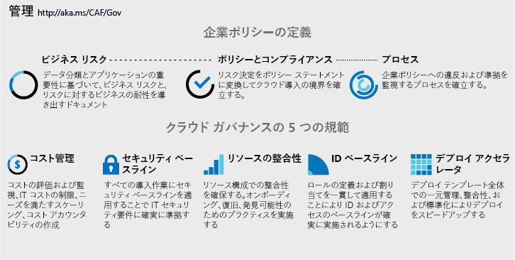

# クラウド ガバナンス戦略の実装

<!-- markdownlint-disable MD033 -->

<ul class="panelContent cardsI">
<li style="display: flex; flex-direction: column;">
    

        

            

                

ビジネス プロセスやテクノロジ プラットフォームに対するすべての変更は、ビジネス上のリスクを伴います。 クラウド カストディアンと呼ばれることもあるメンバーで構成されるクラウド ガバナンス チームの任務は、導入やイノベーションの取り組みをできるだけ途切れさせずに、こうしたリスクを軽減することです。  ただし、クラウド ガバナンスには、技術的な実装以上のことが求められます。 企業のナラティブや企業ポリシーの些細な変更により、導入の取り組みに大幅な影響が及ぼされる場合があります。 実装の前に、企業ポリシーの定義において IT の今後を見据えることが重要です。  
                

            

        

    

</li>
<li style="display: flex; flex-direction: column;">
    <a href="../_images/operational-transformation-govern-highres.png" style="display: flex; flex-direction: column; flex: 1 0 auto;">
        

            

                

                    

 
<i>図 1: 企業ポリシーとクラウド ガバナンスの 5 つの規範</i>
                    

                

            

        

    </a>
</li>
</ul>

<!-- markdownlint-enable MD033 -->

## 企業ポリシーの定義

企業ポリシーの定義では、クラウド プラットフォームにかかわらず、ビジネス上のリスクを特定して軽減することに注力します。 正常なクラウド ガバナンス戦略は、健全な企業ポリシーを定義することから開始します。 以下の 3 段階のプロセスでは、そのようなポリシーの反復開発について示します。

<!-- markdownlint-disable MD033 -->

<ul  class="panelContent cardsF">
<li style="display: flex; flex-direction: column;">
    <a href="./policy-compliance/understanding-business-risk.md" style="display: flex; flex-direction: column; flex: 1 0 auto;">
        

            

                

                    

                        

                            
                        

                    

                    

                        <h3>ビジネス リスク</h3>
                        
現在のクラウド導入計画とデータ分類を調査し、ビジネス上のリスクを特定します。 企業と協力し、リスク許容度とリスク軽減コストのバランスを取ります。

                    

                

            

        

    </a>
</li>
<li style="display: flex; flex-direction: column;">
    <a href="./policy-compliance/define-policy.md" style="display: flex; flex-direction: column; flex: 1 0 auto;">
        

            

                

                    

                        

                            
                        

                    

                    

                        <h3>ポリシーとコンプライアンス</h3>
                        
リスク許容度を評価し、クラウドの導入とリスク軽減のための最も影響が少ないポリシーを通知します。 業界によっては、サードパーティのコンプライアンスが最初のポリシー作成に影響を及ぼします。

                    

                

            

        

    </a>
</li>
<li style="display: flex; flex-direction: column;">
    <a href="./policy-compliance/processes.md" style="display: flex; flex-direction: column; flex: 1 0 auto;">
        

            

                

                    

                        

                            
                        

                    

                    

                        <h3>処理</h3>
                        
導入の速度とイノベーションのアクティビティにより、自然とポリシー違反が発生します。 関連プロセスの実行により、ポリシーへの準拠を監視して強制できるようにします。

                    

                

            

        

    </a>
</li>
</ul>

<!-- markdownlint-enable MD033 -->

## 次の手順

健全なクラウド ガバナンス戦略は、ビジネス リスクを理解することから始まります。

> [!div class="nextstepaction"]
> [ビジネス リスクの理解](./policy-compliance/understanding-business-risk.md)
