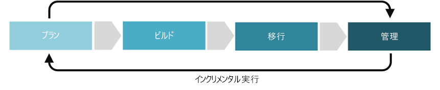

# コスト管理規範の改善

コスト管理規範で、クラウドベースのワークロードをホストする場合に発生する費用に関連するコア ビジネス リスクへの対処を試みます。 クラウド ガバナンスの 5 つの規範の中で、コスト管理は、計画的なコスト サイクルを作成し維持することを目的として、クラウド リソースのコストと使用の管理に関わっています。

この記事では、コスト管理規範を作成し、成熟させるために会社が実行できる可能性があるタスクについて概要を説明します。 これらのタスクは、クラウド ソリューション実装の計画、構築、導入、および運用フェーズに分類できます。これらのフェーズは繰り返され、[クラウド ガバナンスへの増分アプローチ](../journeys/overview.md#an-incremental-approach-to-cloud-governance)を開発できるようになります。

*図 1: クラウド ガバナンスへの増分アプローチの導入フェーズ。*

1 つのドキュメントですべてのビジネスの要件を説明することはできません。 そのため、この記事では、ガバナンス成熟プロセスのフェーズごとに推奨される最小限のアクティビティと潜在的なアクティビティの例について概要を説明します。 これらのアクティビティの初期の目標は、ユーザーが[ポリシー MVP](../journeys/overview.md#an-incremental-approach-to-cloud-governance) を構築し、増分型のポリシー進化のためのフレームワークを確立できるように支援することです。 クラウド ガバナンス チームは、コスト管理ガバナンス機能を強化するために、これらのアクティビティにどれだけ投資するかを決定する必要があります。

> [!CAUTION]
> この記事で概要を説明する最小限のアクティビティと潜在的なアクティビティのどちらも、特定の企業ポリシーやサードパーティのコンプライアンス要件には整合していません。 このガイダンスは、両方の要件とクラウド ガバナンス モデルの整合に導く会話の促進に役立つように設計されています。

## 計画と準備状況

ガバナンス成熟のこのフェーズは、ビジネス成果とアクションにつながる戦略の間にあるギャップの橋渡しをします。 このプロセス中に、リーダーシップ チームは具体的なメトリックを定義し、そのメトリックをデジタル資産にマップして、全体的な移行作業の計画を開始します。

**最小限の推奨されるアクティビティ:**

* [コスト管理ツールチェーン](toolchain.md)の選択肢を評価します。
* 下書きのアーキテクチャ ガイドライン ドキュメントを作成し、主な関係者に配布します。
* アーキテクチャ ガイドラインの開発によって影響を受ける人物とチームを教育し、関与させます。

**潜在的なアクティビティ:**

* クラウド戦略に対して業務の妥当性を裏付ける予算上の決定を確実に行います。
* 資金配分の成功に関する報告に使用する学習メトリックを検証します。
* クラウド コストの計算方法に影響する、目的のクラウド アカウンティング モデルを理解します。
* デジタル資産プランをよく理解し、正確な原価計算を検証します。
* 購入の選択肢を評価して、"従量課金制" にする方法と、エンタープライズ契約を購入して事前にコミットする方法のどちらが良いかを判断します。
* 計画された予算にビジネスの目標を合わせ、必要に応じて予算計画を調整します。
* 各コスト サイクルの最後に、技術およびビジネスの関係者に通知するための目標と予算の報告メカニズムを作成します。

## 構築とデプロイ前準備

環境を適切に移行するには、いくつかの技術的な前提条件と技術面以外の前提条件が必要です。 このプロセスでは、移行を進める意思決定、準備状況、およびコア インフラストラクチャに重点を置いています。

**最小限の推奨されるアクティビティ:**

* デプロイ前フェーズでロールアウトすることによって、[コスト管理ツールチェーン](toolchain.md)を実装します。
* アーキテクチャ ガイドライン ドキュメントを更新し、主な関係者に配布します。
* ユーザー導入の促進に役立つ教材やドキュメント、認識の伝達、インセンティブなどのプログラムを開発します。
* 購入要件が予算と目標に沿っているかどうかを判断します。

**潜在的なアクティビティ:**

* 予算計画を、コア所有モデルを定義する[サブスクリプション戦略](../../decision-guides/subscriptions/overview.md)と合わせます。
* [リソース整合性戦略](../../decision-guides/resource-consistency/overview.md)を使用して、アーキテクチャとコストのガイドラインを徐々に適用します。
* 導入計画と移行計画に影響を与えるコストの異常がないかどうかを判断します。

## 導入と移行

移行は増分型のプロセスであり、その焦点は既存のデジタル資産の中のアプリケーションまたはワークロードの移動、テスト、導入です。

**最小限の推奨されるアクティビティ:**

* [コスト管理ツールチェーン](toolchain.md)をデプロイ前準備から運用環境に移行します。
* アーキテクチャ ガイドライン ドキュメントを更新し、主な関係者に配布します。
* ユーザー導入の促進に役立つ教材やドキュメント、認識の伝達、インセンティブなどのプログラムを開発します。

**潜在的なアクティビティ:**

* クラウド アカウンティング モデルを実装します。
* リリースごとに予算に実際の支出が反映されていることを確認し、必要に応じて調整します。
* 予算計画の変化を監視し、追加のサインオフが必要な場合は関係者に確認を取ります。
* アーキテクチャ ガイドラインのドキュメントを更新して実際のコストを反映します。

## 運用と実装後

変換が完了したら、アプリケーションまたはワークロードの自然なライフサイクルに対してガバナンスと運用を続行する必要があります。 ガバナンス成熟のこのフェーズの焦点は、ソリューションが実装されて変換サイクルが安定し始めた後に一般的に行われるアクティビティです。

**最小限の推奨されるアクティビティ:**

* 組織のコスト管理のニーズの変化に基づいて[コスト管理ツールチェーン](toolchain.md)をカスタマイズします。
* 通知やレポート (ある場合) を自動化して実際の支出を反映することを検討します。
* 将来の導入プロセスの案内となるように、アーキテクチャ ガイドラインを改良します。
* アーキテクチャ ガイドラインに常に準拠するように、影響を受けるチームの教育を定期的に行います。

**潜在的なアクティビティ:**

* 四半期ごとにクラウド ビジネス レビューを実行し、ビジネスにもたらされる価値とそれに関連するコストを伝えます。
* 四半期ごとにプランを調整して実際の支出への変更を反映します。
* 事業部門のサブスクリプションについて、損益に対する財務上の調整を判断します。
* 関係者の価値とコストの報告方法を毎月分析します。
* 使用率の低い資産を修正し、継続する価値があるかどうかを判断します。
* 支出の計画と実績の間にある不整合や異常を検出します。
* クラウド導入チームとクラウド戦略チームがこのような異常を把握して解決できるように支援します。

## 次の手順

ここでは、クラウド ID ガバナンスの概念を理解しました。次は、[コスト管理ツールチェーン](toolchain.md)を検証し、Azure プラットフォーム上でコスト管理ガバナンス規範を開発するときに必要になる Azure のツールと機能を特定します。

> [!div class="nextstepaction"]
> [Azure 向けコスト管理ツールチェーン](toolchain.md)