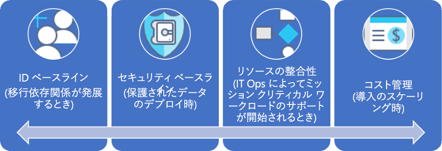

# CAF:大企業のガバナンス体験

## ベスト プラクティスの概要

このガバナンス体験は、ある架空の会社のガバナンスが成熟するさまざまな段階での経験に沿ったものです。 実際のお客様の体験に基づいています。 推奨されるベスト プラクティスは、架空の会社の制約とニーズに基づいています。

すぐに始められるように、この概要では、ベスト プラクティスに基づくガバナンスのための実用最小限の製品 (MVP) が定義されています。 また、新しいビジネスや技術的リスクが登場したときにベスト プラクティスをさらに追加するいくつかのガバナンス進化へのリンクも提供されています。

> [!WARNING]
> この MVP は、一連の想定に基づくベースラインの起点です。 この最小限の一連のベスト プラクティスも、独自のビジネス リスクとリスク許容範囲によってもたらされる企業のポリシーに基づいています。 これらの想定が自分にも当てはまるかどうかを確認するには、この記事の後にある[長い物語](./narrative.md)を読んでください。

### ガバナンスのベスト プラクティス

このベスト プラクティスは、組織が複数の Azure サブスクリプションに対して迅速かつ一貫してガバナンス ガードレールを追加するために使用できる基盤として機能します。

### リソースの編成

次の図では、リソースを編成するためのガバナンス MVP 階層を示します。

すべてのアプリケーションを管理グループ、サブスクリプション、リソース グループ階層の適切な領域にデプロイする必要があります。 デプロイ計画の間に、クラウド ガバナンス チームは、クラウド導入チームを支援するために必要なノードを階層に作成します。

1. 地理的な場所そして環境 (運用、非運用) が反映された詳細な階層を持つ各部署の管理グループ。
2. 部署、地理的な場所、環境、および "アプリケーション分類" の一意の組み合わせごとのサブスクリプション。
3. アプリケーションごとに個別のリソース グループ。
4. このグループ階層の各レベルで、一貫性のある用語体系を適用する必要があります。

これらのパターンには、階層を必要以上に複雑にしないで成長に対応する余地があります。

[!INCLUDE [governance-of-resources](../../../../../includes/cloud-adoption/governance/governance-of-resources.md)]

## ガバナンスの進化

この MVP をデプロイした後は、追加のガバナンス レイヤーを環境にすばやく組み込むことができます。 特定のビジネス ニーズに合わせて MVP を進化させる方法をいくつか次に示します。

- [保護されたデータのセキュリティ ベースライン](./security-baseline-evolution.md)
- [ミッション クリティカルなアプリケーションのリソース構成](./resource-consistency-evolution.md)
- [コスト管理の制御](./cost-management-evolution.md)
- [マルチクラウドの進化の制御](./multi-cloud-evolution.md)

<!-- markdownlint-disable MD026 -->

## このベスト プラクティスの役割

MVP では、企業ポリシーを迅速に適用するために、[デプロイ高速化](../../deployment-acceleration/overview.md)規範のプラクティスとツールが確立されます。 具体的には、MVP では、Azure Blueprints、Azure Policy、Azure 管理グループを使用して、この架空の会社の物語で定義されているいくつかの基本的な企業ポリシーが適用されます。 それらの企業ポリシーが Azure Resource Manager テンプレートと Azure ポリシーを使用して適用されて、ID とセキュリティのための非常に小さいベースラインが確立されます。

## ベスト プラクティスの進化

このガバナンス MVP は、時間をかけたガバナンス プラクティスの進化に使用されます。 導入が進むと、ビジネス上のリスクが増大します。 それらのリスクを軽減するため、CAF ガバナンス モデル内のさまざまな規範が進化します。 このシリーズの以降の記事では、架空の企業に影響を与える企業ポリシーの進化について説明します。 これらの進化は、3 つの規範で発生します。

- ID ベースライン: 物語で移行の依存関係が進化するとき。
- コスト管理: 導入が拡大するとき。
- セキュリティ ベースライン: 保護されたデータがデプロイされるとき。
- リソースの整合性: IT 運用でミッション クリティカルなワークロードのサポートが始まるとき。

## 次の手順

ガバナンス MVP について理解し、この後のガバナンスの進化についてわかったら、コンテキストについてさらに理解するのに役立つ物語を読んでください。

> [!div class="nextstepaction"]
> [理解に役立つ物語を読む](./narrative.md)
