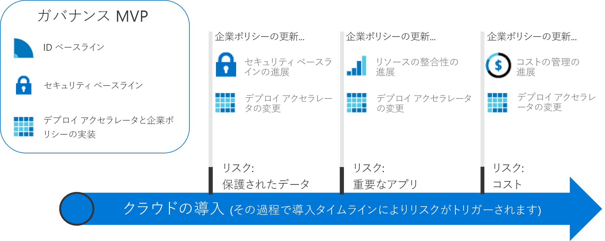

# アクションにつながるガバナンス体験

このセクションのガバナンス体験では、CAF のガバナンス モデルの増分アプローチについて説明します。 クラウド ガバナンス シナリオのニーズに合わせて進化するアジャイル ガバナンス プラットフォームを確立することができます。

## クラウド ガバナンスのベスト プラクティスを確認して採用する

導入パスを開始するには、次のいずれかの体験を選択します。 各体験では、架空の顧客の一連の経験を基にして、一連のベスト プラクティスについて説明します。 CAF ガバナンス モデルの増分アプローチについて初めて読む場合は、いずれかのベスト プラクティスを採用する前に、高レベルのガバナンスの理論上の概要に関する以下の説明を確認することをお勧めします。

<!-- markdownlint-disable MD033 -->

<ul class="panelContent cardsZ">
<li style="display: flex; flex-direction: column;">
    <a href="./small-to-medium-enterprise/overview.md" style="display: flex; flex-direction: column; flex: 1 0 auto;">
        

            

                

                    

                        <h3>中小企業</h3>
                        
所有するデータセンターが 5 つ未満で、中央 IT またはショーバック モデルによりコストを管理している企業のガバナンス体験。

                    

                

            

        

    </a>
</li>
<li style="display: flex; flex-direction: column;">
    <a href="./large-enterprise/overview.md" style="display: flex; flex-direction: column; flex: 1 0 auto;">
        

            

                

                    

                        <h3>大企業</h3>
                        
所有するデータセンターが 5 つ以上で、複数の部署でコストを管理している企業のガバナンス体験。

                    

                

            

        

    </a>
</li>
</ul>

<!-- markdownlint-enable MD033 -->

## クラウド ガバナンスに対する漸進的アプローチ

クラウドの導入はプロセスであってターゲットではありません。 その過程では、明確なマイルストーンと具体的なビジネス上の利点があります。 ただし、クラウド導入の最終的な状態は、企業が体験を始める時点では通常は不明です。 クラウド ガバナンスでは、企業が体験を通して安全な位置を維持できるガードレールが作成されます。

これらのガバナンス体験では、実際の顧客の体験に基づく、架空の企業の経験が説明されています。 各体験は、顧客によるクラウド導入のガバナンスの面に沿って進みます。

### 最終的な状態の確立

目的地のない旅は単なる放浪です。 最初の一歩を踏み出す前に、終了状態の大まかなビジョンを確立することが重要です。 次のインフォグラフィックでは、終了状態の枠組みを提供します。 それは作業の開始点ではなく、可能性のある目標を示します。

CAF ガバナンス モデルでは、体験の過程での重要な主要領域が識別されます。 各領域は、企業がクラウド サービスを導入することで対処する必要のある異なる種類のリスクに関係しています。 このフレームワーク内では、ガバナンス体験によってクラウド管理チームに必要なアクションが示されます。 その過程で、CAF ガバナンス モデルの各原則がさらに詳しく説明されます。 だいたい次のような内容です。

**企業ポリシー**。 企業のポリシーはクラウド ガバナンスを主導します。 ガバナンス体験では、会社のポリシーの特定の側面に焦点が当てられます。

- ビジネス リスク:企業のリスクを識別して理解します。
- ポリシーとコンプライアンス:コンプライアンス要件をサポートするポリシー ステートメントにリスクを変換します。
- プロセス:示されたポリシーに準拠していることを確認します。

**クラウド ガバナンスの 5 つの規範**。 これらの規範によって企業のポリシーがサポートされます。 各規範は、潜在的な落とし穴から企業を保護します。

- Cost Management
- セキュリティ ベースライン
- リソースの整合性
- ID ベースライン
- デプロイ高速化

基本的に、企業のポリシーは潜在的な問題を検出する早期警告システムとして機能します。 規範は、企業のリスクを軽減してガードレールを作成するのに役立ちます。

### 最終状態に成長する

ガバナンス要件はクラウド導入の体験を通して進化するため、ガバナンスに対する異なるアプローチが必要です。 企業は、"*最初の一歩を踏み出す前に*" 小さいチームがすべてのハイウェイのガードレールとロードマップを作成するまで待つことはできません。 より迅速かつ円滑なビジネスの結果が期待されます。 IT ガバナンスも迅速に移動し、クラウド導入の過程でビジネスの需要とペースを合わせて関連性を保ち、"シャドウ IT" を避ける必要があります。

"**増分ガバナンス**" アプローチがこれらの特性を支援します。 増分ガバナンスでは、企業のポリシー、プロセス、およびツールの小さなセットに依存して、導入とガバナンスの基盤が確立されます。 その基盤は、**実用最小限の製品 (MVP)** と呼ばれます。 MVP により、管理チームは、導入のライフサイクル全体の実装にガバナンスをすばやく組み込むことができます。 MVP は、クラウド導入プロセスのどの時点でも確立できます。 ただし、可能な限り早い段階で MVP を導入することをお勧めします。

リスクの変化に迅速に対応する機能により、クラウド ガバナンス チームは新しい方法で作業に取り組むことができます。 クラウド ガバナンス チームは、偵察者としてクラウド戦略チームを参加させ、クラウド導入チームより先行し、ルートを示し、導入計画に関連するリスクを軽減するためのガードレールをすばやく確立できます。 これらの Just-In-Time ガバナンス レイヤーは**ガバナンスの進化**として知られます。 このアプローチでは、ガバナンス戦略はクラウド導入チームより一歩早く進化します。

次の図では、単純なガバナンス MVP とガバナンスの 3 つの進化を示します。 進化の過程で、新しいリスクを軽減するために追加の企業ポリシーが定義されます。 デプロイ高速化の規範が、各デプロイのこれらの変更に適用されます。

> [!NOTE]
> ガバナンスは、セキュリティ、ネットワーク、ID、財務、DevOps、運用などの主要な機能に代わるものではありません。 その過程では、各機能のメンバーとの対話およびメンバーへの依存関係があります。 決定とアクションが速く行われるように、これらのメンバーをクラウド ガバナンス チームに含める必要があります。

## ガバナンス体験の選択

体験では、ガバナンス MVP の実装方法が示されます。 さらに、各体験では、クラウド ガバナンス チームがパートナーとしてクラウド導入チームより先行して、導入作業を高速化する方法が示されています。 CAF ガバナンス モデルでは、基礎から後続の進化まで、ガバナンスの適用がガイドされます。

ガバナンス体験を始めるには、次の 2 つのオプションのいずれかを選択します。 オプションは、架空の顧客経験に基づいています。 ナビゲーションを容易にするため、タイトルは企業の規模に基づいています。 ただし、実際の決定はさらに複雑になる可能性があります。 次の表では、2 つのオプションの違いの概要を示します。

> [!NOTE]
> どちらの体験も、ユーザーの実際の状況と完全には一致していない可能性があります。 どちらか近い方の体験を選択し、開始点として使用してくだし。 体験全体を通して、特定の条件を満たすよう決定をカスタマイズするのに役立つ追加情報が提供されます。

### ビジネスの特性

|                                            | 中小企業                                                                              | 大企業                                                                                               |
|--------------------------------------------|---------------------------------------------------------------------------------------------------------|----------------------------------------------------------------------------------------------------------------|
| 地理的な場所 (国または地理的地域) | 顧客やスタッフは主に 1 つの地理的な場所に存在する                                                      | 顧客やスタッフは複数の地理的な場所に存在する                                                              |
| 影響を受ける部署                    | 1 つの部署                                                                                    | 複数の部署                                                                                        |
| IT 予算                                  | 1 つの IT 予算                                                                                        | 複数の部署に割り当てられた予算                                                                         |
| IT 投資                             | 資本コスト (CapEx) 主導型の投資が毎年計画され、通常は、基本的なメンテナンスのみがカバーされる。 | CapEx 主導型の投資が毎年計画され、多くの場合、メンテナンスと 3 ～ 5 年ごとの更新サイクルが含まれる。 |

### クラウド ガバナンス採用前に現在の状態

|                                             | 中小企業                                                                               | 大企業                                                                                                          |
|---------------------------------------------|----------------------------------------------------------------------------------------------------------|---------------------------------------------------------------------------------------------------------------------------|
| データセンターまたはサード パーティのホスティング プロバイダー | 5 つ未満のデータセンター                                                                                  | 5 つ以上のデータセンター                                                                                                   |
| ネットワーク                                  | WAN なし、または 1 &ndash; 2 つの WAN プロバイダー                                                                             | 複雑なネットワークまたはグローバル WAN                                                                                             |
| ID                                    | 単一フォレスト、単一ドメイン。 要求ベースの認証またはサード パーティの MFA デバイスの要件はない。 | 複雑、複数フォレスト、複数ドメイン。 アプリケーションでは要求ベースの認証またはサード パーティの MFA デバイスが必要である。 |

### クラウド ガバナンス進化後の望ましい将来の状態

|                                              | 中小企業                                                                        | 大企業                                                                                        |
|----------------------------------------------|---------------------------------------------------------------------------------------------------|---------------------------------------------------------------------------------------------------------|
| コスト管理 – クラウド アカウンティング           | ショーバック モデル。 課金は IT で集中管理される。                                                | チャージバック モデル。 課金は、IT 調達全体に分散できる。                                  |
| セキュリティ ベースライン – 保護されたデータ           | 会社の財務データと IP。 制限された顧客データ。 サード パーティのコンプライアンス要件はない。     | 顧客の財務と PII データの複数のコレクション。 サード パーティのコンプライアンスの考慮が必要な場合がある。 |
| リソースの整合性 – ミッション クリティカルなアプリケーション | 障害は苦痛だが、財務的な損害はない。 既存の IT 運用は、比較的未成熟である。 | 障害が定義されており、財務への影響が監視される。 IT 運用は確立され、成熟している。         |

これら 2 つの体験では、クラウド ガバナンスに投資しているお客様の 2 つの極端な経験が表されています。 ほとんどの企業では、上記の 2 つのシナリオの組み合わせが反映されます。 体験を確認した後、CAF ガバナンス モデルを使用して、ガバナンスの会話を開始し、実際のニーズをよりよく満たすようにベースラインの体験を修正します。

## 次の手順

次のどちらかの体験を選択してください。

> [!div class="nextstepaction"]
> [中小企業のガバナンス体験](./small-to-medium-enterprise/overview.md)
>
> [大企業のガバナンス体験](./large-enterprise/overview.md)
