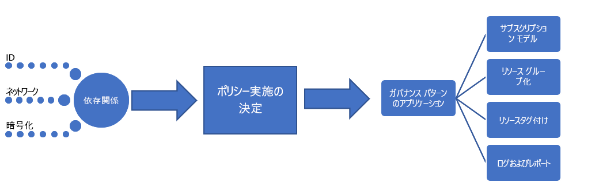

# 中小企業:ベスト プラクティスの説明

ガバナンスの体験は、初期[企業ポリシー](./initial-corporate-policy.md)のセットから始まります。 これらのポリシーは、[ベスト プラクティス](./overview.md)が反映されたガバナンス MVP を確立するために使用されます。

この記事では、ガバナンス MVP の作成に必要な高レベルの戦略について説明します。 ガバナンス MVP の中核となるのは、[デプロイ高速化](../../deployment-acceleration/overview.md)の規範です。 このステージで適用されるツールとパターンにより、将来のガバナンスの展開に必要な段階的進化が可能になります。

## ガバナンス MVP (クラウド導入基盤)

いくつかのシンプルな原則とクラウド ベースの管理ツールにより、ガバナンスと企業ポリシーの迅速な導入を実現できます。 これらは、ガバナンス プロセスでのアプローチに対する 3 つのクラウド ガバナンス基本の最初のものです。 この記事ではそれぞれについて説明します。

開始点を確立するため、この記事では、すべての導入に対する基盤となるガバナンス MVP を作成するために必要な ID ベースライン、セキュリティ ベースライン、デプロイ高速化の背後にある高レベルの戦略について説明します。

## 実装プロセス

ガバナンス MVP の実装は、ID、セキュリティ、およびネットワークに依存します。 依存関係を解決した後、クラウド管理チームは、ガバナンスのいくつかの側面を決定します。 クラウド ガバナンス チームおよびサポート チームによる決定は、適用資産の 1 つのパッケージによって実装されます。

この実装は、簡単なチェックリストを使用して記述することもできます。

1. コア依存関係に関する決定を要求します:ID、ネットワーク、暗号化。
2. 企業ポリシー適用時に使用されるパターンを決定します。
3. リソース整合性、リソース タグ付け、ログ記録とレポートの各規範に対する適切なガバナンス パターンを決定します。
4. 選択したポリシー適用パターンと一致するガバナンス ツールを実装して、依存の決定とガバナンスの決定を適用します。

[!INCLUDE [implementation-process](../../../../../includes/cloud-adoption/governance/implementation-process.md)]

## ガバナンス定義パターンの適用

クラウド ガバナンス チームは、次の決定と実装に対して責任を負います。 多くは他のチームからの入力を必要としますが、クラウド ガバナンス チームは決定と実装の両方を所有する可能性があります。 以下のセクションでは、このユース ケースに対して行われる決定の概要と、各決定の詳細について説明します。

### サブスクリプション モデル

**アプリケーション カテゴリ** パターンが Azure サブスクリプションに対して選択されています。

- アプリケーション アーキタイプは、同様のニーズを持つアプリケーションをグループ化する方法です。 たとえば、次のような場合です。保護されたデータのあるアプリケーション、管理されたアプリケーション (HIPAA、FedRAMP など)、低リスク アプリケーション、オンプレミスに依存するアプリケーション、Azure での SAP や他のメインフレーム、オンプレミスの SAP やメインフレームを拡張するアプリケーション。 これらのアーキタイプは、データの分類とビジネスに利用されるアプリケーションの種類に基づいて、組織ごとに一意です。 デジタル資産の依存関係のマッピングは、組織でのアプリケーション アーキタイプの定義に役立つ場合があります。
- 現在のフォーカスによっては、部門は必要ない可能性があります。 デプロイは 1 つの課金単位内に制約されることが期待されます。 導入のステージでは、課金を一元化するためのエンタープライズ契約さえない可能性があります。 このレベルの導入は、単一の従量課金制 Azure サブスクリプションによって管理されている場合があります。
- EA Portal の使用や、エンタープライズ契約の有無に関係なく、サブスクリプション モデルを定義して合意し、単なる課金を超える管理オーバーヘッドを最小限に抑える必要があります。
- **アプリケーション カテゴリ** パターンでは、各アプリケーション アーキタイプに対してサブスクリプションが作成されます。 各サブスクリプションは、環境 (開発、テスト、および運用) ごとにアカウントに属しています。
- 前の 2 つのポイントに基づいて、サブスクリプションの設計の一部として一般的な名前付け規則について合意する必要があります。

### リソースの整合性

**デプロイの整合性**パターンは、リソースの整合性として選択されています。

- アプリケーションごとにリソース グループが作成されます。 アプリケーション アーキタイプごとに管理グループが作成されます。 関連付けられている管理グループのすべてのサブスクリプションに、Azure Policy を適用する必要があります。
- デプロイ プロセスの一環として、リソース グループの Azure リソース整合性テンプレートをソース管理に格納する必要があります。
- 各リソース グループは、特定のワークロードまたはアプリケーションに関連付けられます。
- Azure 管理グループにより、会社のポリシーが成熟したらガバナンスの設計を更新できます。
- Azure Policy の広範な実装は、チームの時間コミットメントを超える可能性があり、この時点では大きな価値を提供しない場合があります。 ただし、シンプルな既定のポリシーを作成して各管理グループに適用し、少数の現在のクラウド ガバナンス ポリシー ステートメントを強制する必要があります。 このポリシーでは、特定のガバナンス要件の実装を定義します。 その後、これらの実装をデプロイされるすべての資産に適用できます。

### リソースのタグ付け

タグ付けに対する**分類**パターンは、リソースのタグ付けのモデルとして選択されています。

- デプロイされる資産には、次の値でタグ付けする必要があります:データ分類、重要度、SLA、環境。
- これら 4 つの値により、ガバナンス、運用、およびセキュリティに関する決定が促進されます。
- 大規模な企業内の事業単位やチームにこのガバナンス体験が実装される場合は、タグ付けに課金単位のメタデータも含める必要があります。

### ログ記録とレポート

この時点では、ログ記録とレポートの**クラウド ネイティブ** パターンは推奨されますが、どのような開発チームでも必要ではありません。

- ログ記録またはレポートの目的で収集されるデータに関して、ガバナンス要件は設定されていません。
- 保護されたデータやミッション クリティカルなワークロードをリリースする前に、追加の分析が必要になります。

## ガバナンス プロセスの進化

ガバナンスが進化するとき、一部のポリシー ステートメントは、自動ツールでは制御できないか、制御してはなりません。 その他のポリシーは、IT セキュリティ チームおよびオンプレミスの ID 管理チームが時間をかけて作業します。 発生する新しいリスクを軽減するため、クラウド管理チームは次のプロセスを監視します。

**導入の高速化**:クラウド管理チームは、複数のチームのデプロイ スクリプトを確認します。 デプロイ テンプレートとして機能するスクリプトのセットを維持します。 クラウド導入チームと DevOps チームはこれらのテンプレートを使用して、より迅速にデプロイを定義します。 これらの各スクリプトには、さまざまなガバナンス ポリシーを適用するために必要な要件が含まれており、クラウド導入エンジニアの追加作業は必要ありません。 これらのスクリプトのキュレーターとしてのクラウド ガバナンス チームは、ポリシーの変更をより迅速に実装できます。 スクリプトのキュレーションの結果として、クラウド ガバナンス チームは導入高速化のソースと見なされます。 これにより、厳密に準拠を強制することなく、デプロイの間の整合性が作成されます。

**エンジニアのトレーニング**:クラウド ガバナンス チームは、隔月のトレーニング セッションを提供し、エンジニア向けの 2 つのビデオを作成しています。 これらの資料は、エンジニアがガバナンス カルチャとデプロイ中の作業方法を簡単に学習するのに役立ちます。 チームは、エンジニアが新しいポリシーによる導入への影響を理解できるように、運用環境と非運用環境のデプロイの違いを示すトレーニング資産を追加します。 これにより、厳密に準拠を強制することなく、デプロイの間の整合性が作成されます。

**デプロイの計画**:保護されたデータを含むすべての資産をデプロイする前に、クラウド ガバナンス チームはデプロイ スクリプトを確認してガバナンスの整合を検証します。 以前に承認されたデプロイを使用する既存のチームは、プログラムによるツールを使用して監査されます。

**月単位の監査とレポート**:毎月、クラウド ガバナンス チームはすべてのクラウド デプロイの監査を実行して、ポリシーへの整合が継続していることを検証します。 逸脱が検出されたら、文書化されて、クラウド導入チーム間で共有されます。 適用してもビジネス中断やデータ リークのリスクがないときは、ポリシーが自動的に適用されます。 監査の最後に、クラウド ガバナンス チームは、ポリシーへの全体的な準拠を伝えるために、クラウド戦略チームと各クラウド導入チームに対するレポートをまとめます。 レポートの保存は、監査と法的な目的のためでもあります。

**四半期ごとのポリシー レビュー**:四半期ごと、クラウド ガバナンス チームとクラウド戦略チームは、監査結果を確認し、会社のポリシーの変更を提案します。 これらの提案の多くは、使用パターンの継続的な改善と観察の結果です。 承認されたポリシーの変更は、その後の監査サイクルの間に、ガバナンス ツールに統合されます。

## 代替パターン

このガバナンス体験で選択されたパターンのいずれかがリーダーの要件に適合しない場合は、各パターンの代替パターンを使用できます。

- [暗号化パターン](../../../decision-guides/encryption/overview.md)
- [ID パターン](../../../decision-guides/identity/overview.md)
- [ログ記録とレポート パターン](../../../decision-guides/log-and-report/overview.md)
- [ポリシー適用パターン](../../../decision-guides/policy-enforcement/overview.md)
- [リソース整合性パターン](../../../decision-guides/resource-consistency/overview.md)
- [リソース タグ付けパターン](../../../decision-guides/resource-tagging/overview.md)
- [ソフトウェア定義ネットワーク パターン](../../../decision-guides/software-defined-network/overview.md)
- [サブスクリプション設計パターン](../../../decision-guides/subscriptions/overview.md)

## 次の手順

このガイドを実装した後、各クラウド導入チームは健全なガバナンス基盤を利用できます。 クラウド ガバナンス チームは、企業のポリシーとガバナンス規範の継続的な更新を並列して行います。

2 つのチームは許容範囲インジケーターを使用してクラウド導入のサポートを継続するために必要な次の進化を識別します。 この体験の架空の会社の場合、次の手順は、保護されたデータのクラウドへの移動をサポートするようにセキュリティ ベースラインを進化させることです。

> [!div class="nextstepaction"]
> [セキュリティ ベースラインの進化](./security-baseline-evolution.md)