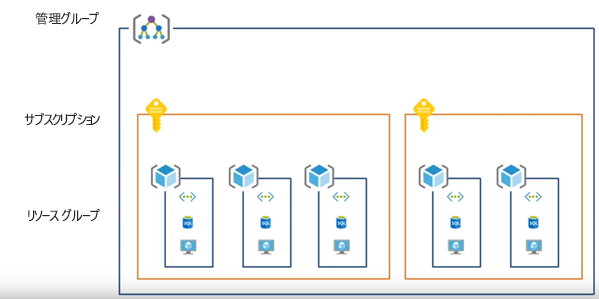
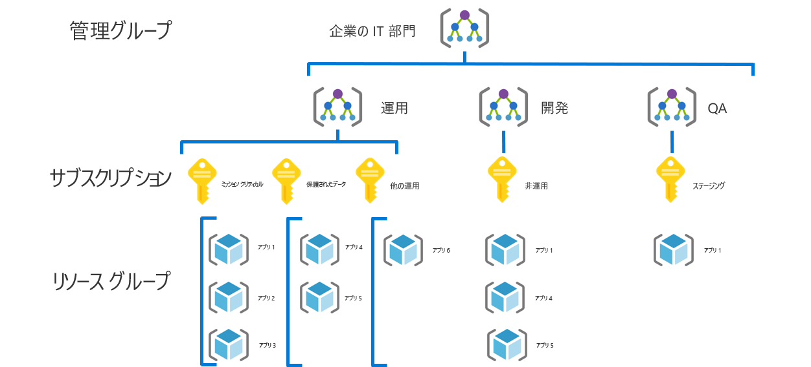
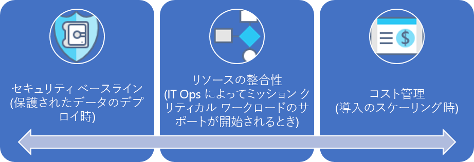

# 中小企業のガバナンス体験Small-to-medium enterprise governance journey

## ベスト プラクティスの概要Best practice overview

このガバナンス体験は、ある架空の会社のガバナンスが成熟するさまざまな段階での経験に沿ったものです。This governance journey follows the experiences of a fictional company through various stages of governance maturity. 実際のお客様の体験に基づいています。It is based on real customer journeys. 推奨されるベスト プラクティスは、架空の会社の制約とニーズに基づいています。The suggested best practices are based on the constraints and needs of the fictional company.

すぐに始められるように、この概要では、ベスト プラクティスに基づくガバナンスのための実用最小限の製品 (MVP) が定義されています。As a quick starting point, this overview defines a minimum viable product (MVP) for governance based on best practices. また、新しいビジネスや技術的リスクが登場したときにベスト プラクティスをさらに追加するいくつかのガバナンス進化へのリンクも提供されています。It also provides links to some governance evolutions that add further best practices as new business or technical risks emerge.

> [!WARNING]
> この MVP は、一連の想定に基づくベースラインの起点です。This MVP is a baseline starting point, based on a set of assumptions. この最小限の一連のベスト プラクティスも、独自のビジネス リスクとリスク許容範囲によってもたらされる企業のポリシーに基づいています。Even this minimal set of best practices is based on corporate policies driven by unique business risks and risk tolerances. これらの想定が自分にも当てはまるかどうかを確認するには、この記事の後にある[長い物語](./narrative.md)を読んでください。To see if these assumptions apply to you, read the [longer narrative](./narrative.md) that follows this article.

## ガバナンスのベスト プラクティスGovernance best practice

このベスト プラクティスは、組織が複数の Azure サブスクリプションに対して迅速かつ一貫してガバナンス ガードレールを追加するために使用できる基盤として機能します。This best practice serves as a foundation that an organization can use to quickly and consistently add governance guardrails across multiple Azure subscriptions.

### リソースの編成Resource organization

次の図では、リソースを編成するためのガバナンス MVP 階層を示します。The following diagram shows the governance MVP hierarchy for organizing resources.

すべてのアプリケーションを管理グループ、サブスクリプション、リソース グループ階層の適切な領域にデプロイする必要があります。Every application should be deployed in the proper area of the management group, subscription, and resource group hierarchy. デプロイ計画の間に、クラウド ガバナンス チームは、クラウド導入チームを支援するために必要なノードを階層に作成します。During deployment planning, the Cloud Governance team will create the necessary nodes in the hierarchy to empower the cloud adoption teams.  

1. 環境の種類 (運用、開発、テストなど) ごとの管理グループ。A management group for each type of environment (such as Production, Development, and Test).
2. 各 "アプリケーション分類" のサブスクリプション。A subscription for each "application categorization".
3. アプリケーションごとに個別のリソース グループ。A separate resource group for each application.
4. このグループ階層の各レベルで、一貫性のある用語体系を適用する必要があります。Consistent nomenclature should be applied at each level of this grouping hierarchy.

このパターンの使用例を次に示します。Here is an example of this pattern in use:

これらのパターンには、階層を必要以上に複雑にしないで成長に対応する余地があります。These patterns provide room for growth without complicating the hierarchy unnecessarily.

[!INCLUDE [governance-of-resources](../../../../../includes/cloud-adoption/governance/governance-of-resources.md)]

## ガバナンスの進化Governance evolutions

この MVP をデプロイした後は、追加のガバナンス レイヤーを環境にすばやく組み込むことができます。Once this MVP has been deployed, additional layers of governance can be quickly incorporated into the environment. 特定のビジネス ニーズに合わせて MVP を進化させる方法をいくつか次に示します。Here are some ways to evolve the MVP to meet specific business needs:

- [保護されたデータのセキュリティ ベースラインSecurity Baseline for protected data](./security-baseline-evolution.md)
- [ミッション クリティカルなアプリケーションのリソース構成Resource configurations for mission-critical applications](./resource-consistency-evolution.md)
- [コスト管理の制御Controls for Cost Management](./cost-management-evolution.md)
- [マルチクラウドの進化の制御Controls for multi-cloud evolution](./multi-cloud-evolution.md)

<!-- markdownlint-disable MD026 -->

## このベスト プラクティスの役割What does this best practice do?

MVP では、企業ポリシーを迅速に適用するために、[デプロイ高速化](../../deployment-acceleration/overview.md)規範のプラクティスとツールが確立されます。In the MVP, practices and tools from the [Deployment Acceleration](../../deployment-acceleration/overview.md) discipline are established to quickly apply corporate policy. 具体的には、MVP では、Azure Blueprints、Azure Policy、Azure 管理グループを使用して、この架空の会社の物語で定義されているいくつかの基本的な企業ポリシーが適用されます。In particular, the MVP uses Azure Blueprints, Azure Policy, and Azure management groups to apply a few basic corporate policies, as defined in the narrative for this fictional company. それらの企業ポリシーが Resource Manager テンプレートと Azure ポリシーを使用して適用されて、ID とセキュリティのための非常に小さいベースラインが確立されます。Those corporate policies are applied using Resource Manager templates and Azure policies to establish a very small baseline for identity and security.

## ベスト プラクティスの進化Evolving the best practice

このガバナンス MVP は、時間をかけたガバナンス プラクティスの進化に使用されます。Over time, this governance MVP will be used to evolve the governance practices. 導入が進むと、ビジネス上のリスクが増大します。As adoption advances, business risk grows. それらのリスクを軽減するため、CAF ガバナンス モデル内のさまざまな規範が進化します。Various disciplines within the CAF governance model will evolve to mitigate those risks. このシリーズの以降の記事では、架空の企業に影響を与える企業ポリシーの進化について説明します。Later articles in this series discuss the evolution of corporate policy affecting the fictional company. これらの進化は、次の 3 つの規範で発生します。These evolutions happen across three disciplines:

- コスト管理: 導入が拡大するとき。Cost Management, as adoption scales.
- セキュリティ ベースライン: 保護されたデータがデプロイされるとき。Security Baseline, as protected data is deployed.
- リソースの整合性: IT 運用でミッション クリティカルなワークロードのサポートが始まるとき。Resource Consistency, as IT Operations begins supporting mission-critical workloads.

## 次の手順Next steps

ガバナンス MVP について理解し、この後のガバナンスの進化についてわかったら、コンテキストについてさらに理解するのに役立つ物語を読んでください。Now that you’re familiar with the governance MVP and have an idea of the governance evolutions to follow, read the supporting narrative for additional context.

> [!div class="nextstepaction"]
> [理解に役立つ物語を読むRead the supporting narrative](./narrative.md)
