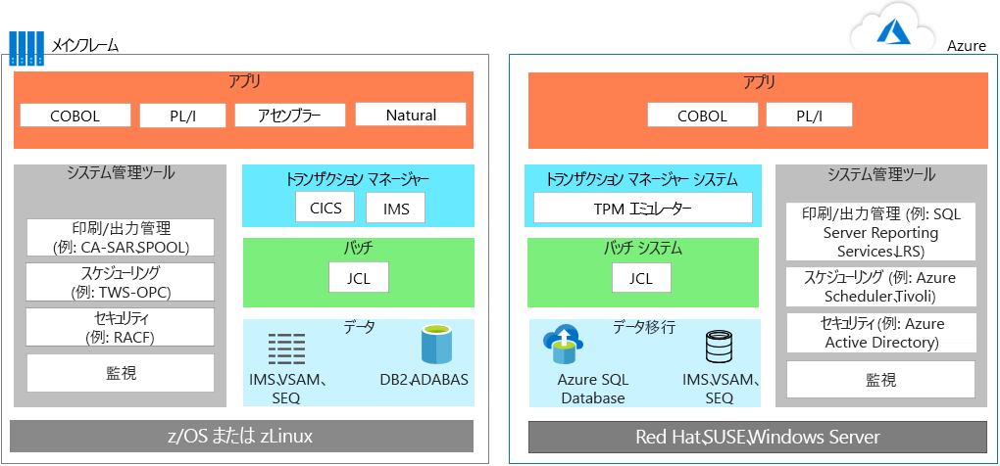
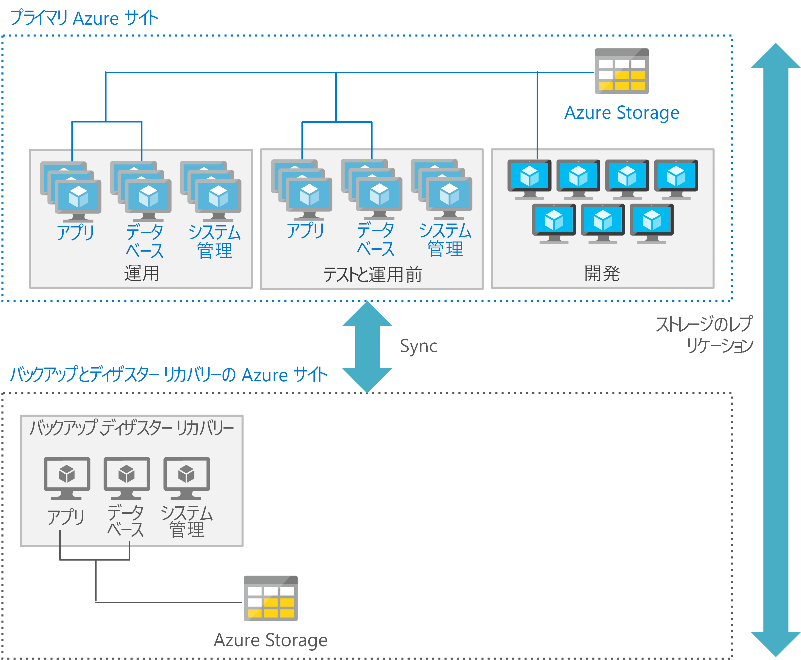

# メインフレーム アプリケーションの移行

アプリケーションをメインフレーム環境から Azure に移行する場合、ほとんどのチームは実際的なアプローチに従います。つまり、いつでもどこでも可能なかぎり再利用し、アプリケーションを再作成または置換するときは段階的デプロイを開始します。

アプリケーションの移行には、通常、次の方法の 1 つ以上が含まれます。

- 再ホスト:メインフレームから既存のコード、プログラム、およびアプリケーションを移動し、コードを再コンパイルして、クラウド インスタンスでホストされているメインフレーム エミュレーターで実行できます。 このアプローチは、一般に、クラウドベースのエミュレーターへのアプリケーションの移動で開始し、その後でクラウドベースのデータベースにデータベースを移行します。 データとファイルの変換と共に、ある程度のエンジニアリングとリファクタリングが必要です。

    または、従来のホスティング プロバイダーを使用して再ホストすることができます。 クラウドの主要な利点の 1 つは、インフラストラクチャ管理のアウトソーシングです。 メインフレームのワークロードを代わりにホストしてくれるデータセンター プロバイダーを見つけることができます。 このモデルでは、時間を購入し、ベンダーのロックインを減らし、一時的なコスト削減を実現できます。

- 廃止:不要になったすべてのアプリケーションを、移行の前に廃止する必要があります。

- 再構築:最新の手法を使用してプログラムを全面的に書き直す組織もあります。 この方法ではコストと複雑さが増すので、リフトアンドシフト アプローチほど一般的ではありません。 多くの場合、この種の移行の後では、コード変換エンジンを使用してモジュールとたコードの置き換えを始めるのが理にかなっています。

- 置換前のコード:このアプローチでは、メインフレームの機能を、クラウドの同等の機能で置き換えます。 1 つのオプションであるサービスとしてのソフトウェア (SaaS) では、財務、人事、製造、エンタープライズ リソース プランニングなど、企業の関心事のために特に作成されたソリューションが使用されます。 さらに、以前はカスタム メインフレーム ソリューションを使用して解決されていた問題を、今では多くの業界固有アプリを使用して解決できるようになっています。

最初に移行する必要があるワークロードを計画した後、、関連するアプリケーション、レガシ コードベース、データベースを移動するための要件を決定することを、検討する必要があります。

## Azure でのメインフレームのエミュレーション

Azure クラウド サービスでは従来のメインフレーム環境をエミュレートでき、メインフレームの既存のコードとアプリケーションを再利用できます。 エミュレートできる一般的なサーバー コンポーネントとしては、オンライン トランザクション処理 (OLTP) システム、バッチ システム、データ インジェスト システムなどがあります。

### OLTP システム

多くのメインフレームには、膨大なユーザーのために何千または何百万もの更新を処理する OLTP システムがあります。 多くの場合、これらのアプリケーションでは、顧客情報管理システム (CICS)、情報管理システム (IMS)、ターミナル インターフェイス プロセッサ (TIP) など、トランザクション処理と画面フォーム処理のソフトウェアが使用されます。

OLTP アプリケーションを Azure に移動するときは、メインフレームのトランザクション処理 (TP) モニター用のエミュレーターを、Azure 上の仮想マシン (VM) を使用し、サービスとしてのインフラストラクチャ (IaaS) として実行できます。 画面処理とフォームの機能も、Web サーバーで実装できます。 このアプローチは、データ アクセスとトランザクションのための ActiveX データ オブジェクト (ADO)、Open Database Connectivity (ODBC)、Java Database Connectivity (JDBC) などのデータベース API と組み合わせることができます。

### 時間の制約があるバッチ更新

銀行、保険、政府で使用されているものなどの多くのメインフレーム システムでは、数百万のアカウント レコードの更新が毎月または毎年実行されます。 メインフレームでは、高スループットのデータ処理システムを提供することで、この種のワークロードが処理されます。 メインフレームのバッチ ジョブは、通常、本質的にシリアルであり、パフォーマンスのためにメインフレーム バックボーンによって提供される IOPS (1 秒あたりの入力/出力操作数) に依存します。

クラウドベースのバッチ環境では、パフォーマンスのために並列コンピューティングと高速ネットワークが使用されます。 バッチ処理のパフォーマンスを最適化する必要がある場合、Azure ではさまざまなコンピューティング、ストレージ、およびネットワークのオプションが提供されています。

### データ インジェスト システム

メインフレームでは、小売、金融サービス、製造、その他のソリューションから、処理のためにデータの大きなバッチが取り込まれます。 Azure では、[AzCopy](/azure/storage/common/storage-use-azcopy) などの簡単なコマンド ライン ユーティリティを使用して、保存場所との間でデータのコピーを実行できます。 また、[Azure Data Factory](/azure/data-factory/introduction) サービスを使用すると、各種のデータ ストアからデータを取り込み、データ主導型のワークフローを作成してスケジューリングすることもできます。

エミュレーション環境だけでなく、Azure では、既存のメインフレーム環境を拡張できるサービスとしてのプラットフォーム (PaaS) および分析サービスも提供されています。

## OLTP ワークロードを Azure に移行する

リフトアンドシフト アプローチは、既存のアプリケーションを Azure に迅速に移行するためのコード不要のオプションです。 各アプリケーションはそのままの状態で移行されます。このため、コード変更に伴うリスクとコストのどちらも負担することなく、クラウドのメリットを享受できます。 Azure でのメインフレーム トランザクション処理 (TP) モニター用のエミュレーターの使用では、このアプローチがサポートされています。

さまざまなベンダーの TP モニターを利用でき、Azure 上のサービスとしてのインフラストラクチャ (IaaS) オプションである仮想マシンで実行できます。 次の図は、IBM の z/OS メインフレーム上のリレーショナル データベース管理システム (DBMS) である IBM DB2 を利用するオンライン アプリケーションを移行する前と後を示したものです。 DB2 for Z/OS では、データの格納用には VSAM (Virtual Storage Access Method) ファイルが使用され、フラット ファイル用には ISAM (Indexed Sequential Access Method: 索引順次アクセス方式) が使用されます。 このアーキテクチャでは、トランザクション監視用に CICS も使用されます。

Azure では、TP マネージャーと JCL を用いたバッチ ジョブを実行するために、エミュレーション環境が使用されています。 データ層では、DB2 が [Azure SQL Database](/azure/sql-database/sql-database-technical-overview) に置き換えられていますが、Microsoft SQL Server、DB2 LUW、または Oracle Database を使用することもできます。 エミュレーターでは、IMS、VSAM、および SEQ がサポートされています。 メインフレームのシステム管理ツールは、VM 上で実行される Azure サービスおよび他のベンダーのソフトウェアによって置き換えられています。

画面処理とフォーム入力の機能は一般に Web サーバーを使用して実装され、データ アクセスおよびトランザクションには ADO、ODBC、JDBC などのデータベース API と組み合わせることができます。 使用する Azure IaaS コンポーネントの正確なラインナップは、選択するオペレーティング システムによって異なります。 例: 

- Windows ベースの VM の場合:画面処理とビジネス ロジック用にはインターネット インフォメーション サービス (IIS) と ASP.NET。 データ アクセスとトランザクションには ADO.NET を使用します。

- Linux ベースの VM の場合:使用可能な Java ベースのアプリケーション サーバー。たとえば、画面処理と Java ベースのビジネス機能用の Apache Tomcat など。 データ アクセスとトランザクションには JDBC を使用します。

## バッチ ワークロードを Azure に移行する

Azure でのバッチ操作は、メインフレーム上の一般的なバッチ環境とは異なります。 メインフレームのバッチ ジョブは、通常、本質的にシリアルであり、パフォーマンスのためにメインフレーム バックボーンによって提供される IOPS に依存します。 クラウドベースのバッチ環境では、パフォーマンスのために並列コンピューティングと高速ネットワークが使用されます。

Azure を使用するバッチ処理のパフォーマンスを最適化するには、次のような[コンピューティング](/azure/virtual-machines/windows/overview)、[ストレージ](/azure/storage/blobs/storage-blobs-introduction)、[ネットワーク](https://azure.microsoft.com/blog/maximize-your-vm-s-performance-with-accelerated-networking-now-generally-available-for-both-windows-and-linux/)、および[監視](/azure/azure-monitor/overview)のオプションを検討します。

### Compute

次のコマンドを使用します。

- クロック速度が最高の VM。 多くの場合、メインフレームのアプリケーションはシングル スレッドであり、メインフレームの CPU は非常に高いクロック速度です。

- データのキャッシュとアプリケーションの作業領域に対応する大容量のメモリを備えた VM。

- アプリケーションが複数のスレッドをサポートしている場合は、マルチスレッド処理を利用するために高密度 vCPU を備えた VM。

- 並列処理。Azure は並列処理用に簡単にスケールアウトし、より多くのコンピューティング能力をバッチ実行に提供します。

### Storage

次のコマンドを使用します。

- 使用可能な最大の IOPS のために [Azure Premium SSD](/azure/virtual-machines/windows/premium-storage) または [Azure Ultra SSD](/azure/virtual-machines/windows/disks-ultra-ssd)。

- ストレージ サイズあたりの IOPS を上げるために複数のディスクによるストライピング。

- 複数の Azure ストレージ デバイスに IO を分散させるためのストレージのパーティション分割。

### ネットワーク

- 待機時間を最小にするには [Azure 高速ネットワーク](/azure/virtual-network/create-vm-accelerated-networking-powershell)を使用します。

### 監視

- 監視ツール、[Azure Monitor](/azure/azure-monitor/overview)、[Azure Application Insights](/azure/application-insights/app-insights-overview)、Azure ログを使用すると、管理者はバッチ実行の過剰なパフォーマンスを監視し、ボトルネックを回避することができます。

## 開発環境を移行する

クラウドの分散アーキテクチャは、最新の手法とプログラミング言語のメリットを提供するさまざまな開発ツールのセットに依存します。 この移行を容易にするには、IBM z/OS 環境をエミュレートするように設計された他のツールで開発環境を使用することができます。 次に、Microsoft と他のベンダーが提供するオプションの一覧を示します。

| コンポーネント        | Azure のオプション                                                                                                                                  |
|------------------|---------------------------------------------------------------------------------------------------------------------------------------------------|
| z/OS             | Windows、Linux、UNIX                                                                                                                      |
| CICS             | Micro Focus、Oracle、GT Software (Fujitsu)、TmaxSoft、Raincode、NTT Data によって提供される Azure サービス、または Kubernetes を使用した書き換え |
| IMS              | Micro Focus と Oracle によって提供される Azure サービス                                                                                  |
| アセンブラー        | Raincode と TmaxSoft からの Azure サービス、COBOL、C、Java、またはオペレーティング システムの機能へのマップ               |
| JCL              | JCL、PowerShell、または他のスクリプト ツール                                                                                                   |
| COBOL            | COBOL、C、または Java                                                                                                                            |
| Natural          | Natural、COBOL、C、または Java                                                                                                                  |
| FORTRAN と PL/I | FORTRAN、PL/I、COBOL、C、また Java                                                                                                           |
| REXX と PL/I    | REXX、PowerShell、または他のスクリプト ツール                                                                                                  |

## データベースとデータを移行する

アプリケーションの移行には、通常、データ層の再ホストが伴います。 [Azure Database Migration Service](/azure/dms/dms-overview) を使用すると、[Azure SQL Database Managed Instance](/azure/sql-database/sql-database-managed-instance)、[Azure Database Service for PostgreSQL](/azure/postgresql/overview)、[Azure Database for MySQL](/azure/mysql/overview) など、Azure 上のフルマネージド ソリューションに (SQL Server、オープン ソース、その他の) リレーショナル データベースを移行できます。

たとえば、メインフレームのデータ層で次のものが使用されている場合に移行できます。

- IBM DB2 または IMS データベース。Azure で Azure SQL Database、SQL Server、DB2 LUW、または Oracle Database を使用します。

- VSAM および他のフラット ファイル。Azure SQL、SQL Server、DB2 LUW、または Oracle で ISAM (Indexed Sequential Access Method: 索引順次アクセス方式) を使用します。

- Generation Data Group (GDG)。Azure では、同様の機能を GDG に提供する名前付け規則とファイル名拡張子を使用するファイルに移行します。

IBM のデータ層には、やはり移行する必要がある複数の主要なコンポーネントが含まれます。 たとえば、データベースを移行するときは、z/OS VSAM データ セットである dbextent をそれぞれが含む、プールに含まれるデータのコレクションも移行します。 移行には、ストレージ プール内のデータの場所を示すディレクトリが含まれる必要があります。 また、移行計画では、データベースで実行された操作の記録を含むデータベース ログを考慮する必要があります。 データベースには、1 つ、2 つ (デュアルまたは代替)、または 4 つ (デュアルおよび代替) のログが含まれる場合があります。

データベースの移行には、以下のコンポーネントも含まれます。

- データベース マネージャー:データベース内のデータへのアクセスを提供します。 データベース マネージャーは、z/OS 環境内の専用のパーティションで実行されます。

- アプリケーション リクエスター:アプリケーション サーバーに渡す前に、アプリケーションから要求を受け入れます。

- オンライン リソース アダプター:CICS トランザクションで使用するアプリケーション リクエスター コンポーネントが含まれます。

- バッチ リソース アダプター:z/OS バッチ アプリケーション用のアプリケーション リクエスター コンポーネントを実装します。

- 対話式 SQL (ISQL):CICS アプリケーションおよびインターフェイスとして実行され、ユーザーが SQL ステートメントまたはオペレーター コマンドを入力できるようにします。

- CICS アプリケーション:CICS の制御下で実行され、CICS で使用可能なリソースとデータ ソースを使用します。

- バッチ アプリケーション:ユーザーとの対話型通信を行わずにプロセスのロジックを実行します。たとえば、一括データ更新プログラムを作成したり、データベースからレポートを生成したりします。

## Azure のスケールとスループットを最適化する

一般に、メインフレームはスケールアップし、クラウドはスケールアウトします。Azure で実行されるメインフレーム スタイルのアプリケーションのスケールとスループットを最適化するには、メインフレームでアプリケーションが分割および分離される方法を理解することが重要です。 z/OS メインフレームでは、1 つのインスタンス上で特定のアプリケーションに対するリソースを分離して管理するために、論理パーティション (LPAR) と呼ばれる機能が使用されます。

たとえば、メインフレームでは CICS 領域と関連する COBOL プログラム用に 1 つの論理パーティション (LPAR)、DB2 用に別の LPAR が使用される場合があります。 開発、テスト、およびステージング環境用に追加の LPAR が使用されることがよくあります。

Azure では、この目的に別の VM を使用することの方が一般的です。 通常、Azure のアーキテクチャでは、アプリケーション層、データ層、開発用などにそれぞれ異なる VM のセットがデプロイされます。 処理の各階層は、その環境に最も適した種類の VM と機能を使用して最適化できます。

さらに、各階層で適切なディザスター リカバリー サービスを提供することもできます。 たとえば、運用およびデータベース用の VM ではホットまたはウォーム リカバリーが必要であり、開発およびテスト用の VM ではコールド リカバリーをサポートするようなことがあります。

次の図では、プライマリ サイトとセカンダリ サイトを使用して可能な Azure のデプロイを示します。 プライマリ サイトには、運用、運用前、およびテスト用の VM が高可用性でデプロイされます。 セカンダリ サイトは、バックアップおよびディザスター リカバリー用です。

## メインフレームから Azure への段階的移行を実行する

メインフレームから Azure へのソリューションの移動では、"*段階的な*" 移行が必要な場合があります。つまり、一部のアプリケーションが最初に移動され、他のアプリケーションは一時的または永続的にメインフレームに残されます。 通常、このアプローチには、メインフレームと Azure の間でアプリケーションとデータベースが相互運用できるシステムが必要です。

一般的なシナリオでは、アプリケーションを Azure に移動し、アプリケーションによって使用されるデータはメインフレームで維持します。 Azure 上のアプリケーションがメインフレーム上のデータにアクセスできるようにするには、特定のソフトウェアが使用されます。 さいわい、広範なソリューションでは、Azure と既存のメインフレーム環境間の統合、ハイブリッド シナリオのサポート、および時間をかけた移行が提供されています。 Microsoft パートナー、独立系ソフトウェア ベンダー、およびシステム インテグレーターがユーザーの作業を支援できます。

1 つのオプションは [Microsoft Host Integration Server](https://docs.microsoft.com/host-integration-server/) (HIS) です。このソリューションでは、メインフレームに残っている DB2 のデータにアクセスするために Azure のアプリケーションで必要な分散リレーショナル データベース アーキテクチャ (DRDA) が提供されます。 メインフレームと Azure の統合に対する他のオプションとしては、IBM、Attunity、Codit、他のベンダーからのソリューション、およびオープン ソースのオプションがあります。

## パートナー ソリューション

メインフレームの移行を検討している場合は、パートナー エコシステムが役に立ちます。

Azure では、メインフレームで現在実行されているシステムに対し、実績があり高可用性でスケーラブルなインフラストラクチャが提供されます。 一部のワークロードは、比較的簡単に移行できます。 CICS や IMS のように従来のシステム ソフトウェアに依存する他のワークロードは、パートナー ソリューションを使用して再ホストし、時間をかけて Azure に移行することができます。 何を選択しても、Microsoft とそのパートナーが、メインフレーム システムのソフトウェアの機能を維持しながら、Azure に対する最適化を支援します。

パートナー ソリューションの選択に関する詳細なガイダンスについては、「[Platform Modernization Alliance (プラットフォーム最新化アライアンス)](https://www.platformmodernization.org/pages/mainframe.aspx)」を参照してください。

## 詳細情報

詳細については、次のリソースを参照してください。

- [Azure を使ってみる](/azure)

- [プラットフォーム近代化のための提携:メインフレーム移行](https://www.platformmodernization.org/pages/mainframe.aspx)

- [Azure 上に IBM DB2 pureScale をデプロイする](https://azure.microsoft.com/resources/deploy-ibm-db2-purescale-on-azure)

- [Host Integration Server (HIS) のドキュメント](https://docs.microsoft.com/host-integration-server/)
