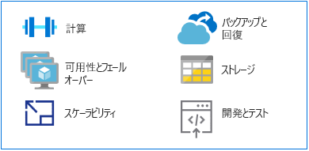

# メインフレームから Azure に切り替える

Azure は、従来のメインフレーム アプリケーションを実行するための代替プラットフォームとして、高可用環境にハイパースケールのコンピューティングとストレージを提供します。 メインフレーム環境に関連するコストをかけずに、最新のクラウドベースのプラットフォームの価値と敏捷性が手に入ります。

このセクションでは、メインフレーム プラットフォームから Azure への切り替えに関する技術的なガイダンスを提供します。

## MIPS と vCPU

メインフレームのワークロードを実行するために必要な仮想中央処理装置 (vCPU) のサイズを決定するための汎用のマッピング式はありません。 ただし、100万命令毎秒 (MIPS) のメトリックは、多くの場合、Azure 上の vCPU にマップされます。 MIPS では、特定のマシンの 1 秒あたりのサイクル数を一定の値にすることで、メインフレームの全体的なコンピューティング能力を測定します。

小規模な組織では 500 MIPS 未満で済みますが、大規模な組織は通常 5,000 MIPS を超えます。 1 MIPS あたり 1,000 ドルの場合、大規模な組織では 5,000 MIPS のインフラストラクチャをデプロイするために年間約 500 万ドルを費やします。 この規模の一般的な Azure デプロイの年間コスト見積もりは、MIPS インフラストラクチャのコストの約 1/10 です。 詳細については、ホワイト ペーパー「[Demystifying Mainframe-to-Azure Migration (メインフレームから Azure への移行の解明)](https://azure.microsoft.com/resources/demystifying-mainframe-to-azure-migration)」の表 4 を参照してください。

Azure による vCPU への MIPS の正確な計算は、vCPU の種類と実行している正確なワークロードによって変わります。 ただし、ベンチマーク調査は、必要となる vCPU の数と種類を見積もるための優れた基盤となります。 最近の [HPE zREF ベンチマーク](https://h20195.www2.hpe.com/v2/getpdf.aspx/4aa4-2452enw.pdf)は、以下の見積もりを提供しています。

- オンライン (CICS) ジョブの場合、HP Proliant サーバー上で実行される Intel ベース コアあたり 288 MIPS。

- COBOL バッチ ジョブの場合、Intel コアあたり 170 MIPS。

このガイドでは、オンライン処理の場合は vCPU あたり 200 MIPS、バッチ処理の場合は vCPU あたり 100 MIPS と見積もります。

> [!NOTE]
> このような見積もりは、新しい仮想マシン (VM) シリーズが Azure で使用できるようになると変わる可能性があります。

## 高可用性とフェールオーバー

メインフレーム システムでは、メインフレームの結合と Parallel Sysplex を使用する場合、ファイブ ナインの可用性 (99.999%) が提供されることがよくあります。 それでも、システム運用者は、保守と初期プログラム読み込み (IPL) のためのダウンタイムをスケジュールする必要があります。 実際の可用性は、ハイエンドの Intel ベースのサーバーと同等のツー ナインまたはスリー ナインに近づきます。

対照的に、Azure はコミットメントベースのサービス レベル アグリーメント (SLA) を提供します。この場合、複数ナインの可用性が既定であり、ローカルまたは地域ベースのサービスのレプリケーションに最適化されています。

Azure は、ローカルでも他の地域内でも、複数のストレージ デバイスからデータをレプリケートすることで可用性を向上します。 Azure ベースの障害が発生した場合、コンピューティング リソースはローカルまたはリージョン レベルでレプリケートされたデータにアクセスできます。

[Azure SQL Database](/azure/sql-database/sql-database-technical-overview) や [Azure Cosmos Database](/azure/cosmos-db/introduction) などの Azure のサービスとしてのプラットフォーム (PaaS) リソースを使用すると、Azure で自動的にフェールオーバーを処理できます。 Azure のサービスとしてのインフラストラクチャ (IaaS) を使用する場合、フェールオーバーは、SQL Server の AlwaysOn 機能、フェールオーバー クラスタリング インスタンス、可用性グループなど、特定のシステム機能に依存します。

## スケーラビリティ

メインフレームは通常スケールアップしますが、クラウド環境はスケールアウトします。メインフレームは結合機能 (CF) を使用してスケールアウトできますが、ハードウェアとストレージのコストが高いため、メインフレームのスケールアウトは非常に高価です。

さらに、CF は密結合コンピューティングを提供しますが、Azure のスケールアウト機能は疎結合です。 クラウドは、使用量ベースの課金モデルでは、オンデマンドのコンピューティング能力、ストレージ、およびサービスのスケールによって、正確なユーザー仕様に合わせてスケールアップまたはスケールダウンできます。

## バックアップと回復

一般的に、メインフレームのお客様は、災害時に備えてディザスター リカバリー サイトを保守するか、独立したメインフレーム プロバイダーを利用しています。 ディザスター リカバリー サイトとの同期は、通常、データのオフライン コピーを使用して実行されます。 どちらの方法も高コストが発生します。

また、自動化された geo 冗長性は、多額の費用はかかりますが、メインフレームの結合機能を介しても利用できます。また、通常はミッションクリティカル システム用に予約されています。 対照的に、Azure には、実装が簡単で費用対効果の高い[バックアップ](/azure/backup/backup-introduction-to-azure-backup)、[復旧](/azure/site-recovery/site-recovery-overview)、および[冗長性](/azure/storage/common/storage-redundancy)のオプションがあり、ローカル レベルまたはリージョン レベルで、または geo 冗長性を介して利用できます。

## Storage

メインフレームのしくみを理解するには、さまざまな重複する用語を解読することも必要です。 たとえば、一般的に、中央ストレージ、物理メモリ、物理ストレージ、およびメイン ストレージは、すべてメインフレーム プロセッサに直接接続されているストレージを指します。

メインフレーム ハードウェアには、プロセッサや他の多くのデバイスが含まれます。たとえば、ダイレクト アクセス ストレージ デバイス (DASD)、磁気テープ ドライブ、一部のユーザー コンソールなどです。 テープと DASD は、システム関数のためにユーザー プログラムによって使用されます。

メインフレーム用の物理ストレージには、次のような種類があります。

- 中央ストレージ:メインフレーム プロセッサ上に直接配置され、これはプロセッサまたは物理ストレージとも呼ばれます。

- 補助ストレージ:メインフレームとは別に配置されます。この種類には、DASD 上のストレージが含まれ、ページング ストレージとも呼ばれます。

クラウドには、柔軟でスケーラブルなオプションが幅広く用意されており、必要なオプションに対してのみ料金を支払います。 [Azure Storage](/azure/storage/common/storage-introduction) は、データ オブジェクトのための高度にスケーラブルなオブジェクト ストア、クラウドのためのファイル システム サービス、信頼性の高いメッセージング ストア、および NoSQL ストアを提供します。 VM の場合、マネージド ディスクとアンマネージド ディスクは、永続的でセキュリティで保護されたディスク ストレージを提供します。

## メインフレームの開発とテスト

メインフレーム移行プロジェクトの主なけん引役は、アプリケーション開発の変化する面です。 組織は、ビジネス ニーズに対する開発環境の俊敏性と応答性を高める必要があります。

一般的に、メインフレームには、QA やステージング LPAR など、開発用とテスト用に別の論理パーティション (LPAR) があります。 メインフレーム開発ソリューションには、コンパイラ (COBOL、PL/I、アセンブラー) とエディターが含まれます。 最も一般的なものは、IBM メインフレーム上で稼働する z/OS オペレーティング システム用の対話式システム生産性向上機能 (ISPF) です。 その他には、ROSCOE Programming Facility (RPF) や、CA Librarian や CA-Panvalet などの Computer Associates ツールがあります。

エミュレーション環境とコンパイラは x86 プラットフォーム上で使用できるので、一般的に開発とテストはメインフレームから Azure に移行する最初のワークロードになる可能性があります。 [Azure の DevOps ツール](https://azure.microsoft.com/solutions/devops/)の可用性と普及により、開発環境とテスト環境の移行が加速しています。

ソリューションを Azure 上で開発およびテストし、メインフレームへの展開の準備が整ったら、コードをメインフレームにコピーしてそこでコンパイルする必要があります。

## 次の手順

> [!div class="nextstepaction"]
> [メインフレーム アプリケーションの移行](application-strategies.md)
