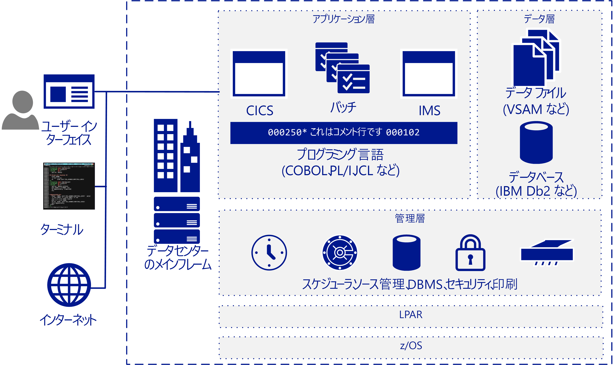

# メインフレーム移行の概要Mainframe migration overview

メインフレームのワークロード、アプリケーション、データベースの全部または一部をクラウドに移行することで多くの会社や組織が効果を上げています。Many companies and organizations benefit from moving some or all their mainframe workloads, applications, and databases to the cloud. Azure はメインフレームのような機能をクラウド機能で提供しますが、メインフレームに付き物の多くの欠点がありません。Azure provides mainframe-like features at cloud scale without many of the drawbacks associated with mainframes.

メインフレームという言葉は一般的に大型のコンピューター システムを意味しますが、近年配備されているメインフレームの大半は IBM System Z サーバーか、MVS、DOS、VSE、OS/390、z/OS を実行している IBM プラグ互換システムです。The term mainframe generally refers to a large computer system, but the vast majority currently of mainframes deployed are IBM System Z servers or IBM plug-compatible systems running MVS, DOS, VSE, OS/390, or z/OS. メインフレーム システムは、重要な情報システムを実行する目的で、今後もさまざまな産業で利用されます。大量の処理が集中する IT 環境など、特定のシナリオで役目が与えられています。Mainframe systems continue to be used in many industries to run vital information systems, and they have a place in highly-specific scenarios, such as large, high-volume, transaction intensive IT environments.

クラウドに移行することで企業はそのインフラストラクチャを最新式にすることができます。Migrating to the cloud enables companies to modernize their infrastructure. クラウド サービスを利用すれば、メインフレームのアプリケーションとそれが与える価値を、組織がそれを必要とするときに、ワークロードとして利用できます。With cloud services you can make mainframe applications, and the value that they provide, available as a workload whenever your organization needs it. ワークロードの多くは、データベースの名前を更新するなど、コードを少し変更するだけで Azure に転送できます。Many workloads can be transferred to Azure with only minor code changes, such as updating the names of databases. 段階的な手法を利用すれば、もっと複雑なワークロードを移行できます。You can migrate more complex workloads using a phased approach.

Fortune 500 企業のほとんどが既に、重要なワークロードのために Azure を稼働させています。Most Fortune 500 companies are already running Azure for their critical workloads. Azure は最終結果に基づくインセンティブが大きく、それが多くの移行プロジェクトの動機となっています。Azure's significant bottom-line incentives motivate many migration projects. 企業は通常、開発とテストのワークロードを先に Azure に移行し、続いてサービスとしての DevOps、電子メール、ディザスター リカバリーを移行します。Companies typically move development and test workloads to Azure first, followed by DevOps, email, and disaster recovery as a service.

## 対象ユーザーIntended audience

IT 環境のオプションとして移行またはクラウド サービスの追加を検討している場合、このガイドをお読みください。If you’re considering a migration or the addition of cloud services as an option for your IT environment, this guide is for you.

このガイドがは、IT 組織が移行について検討を始めるときに役に立ちます。This guidance helps IT organizations start the migration conversation. メインフレームよりも Azure やクラウドベースのインフラストラクチャに詳しい方もいるので、このガイドではまず、メインフレームのしくみについて説明し、それからどのような移行をどのように行うかを決めるためのさまざまな方針を提示します。You may be more familiar with Azure and cloud-based infrastructures than you are with mainframes, so this guide starts with an overview of how mainframes work, and continues with various strategies for determining what and how to migrate.

## メインフレームのアーキテクチャMainframe architecture

メインフレームは 1950 代の後半に、大量のオンライン トランザクションと一括処理を実行するための大規模サーバーとして設計されました。In the late 1950s, mainframes were designed as scale-up servers to run high-volume online transactions and batch processing. そのため、メインフレームにはオンライン トランザクション フォーム (グリーン スクリーンとも呼ばれています) 用のソフトウェアや一括実行を処理するための高性能 I/O システムが備わっています。Because of this, mainframes have software for online transaction forms (sometimes called green screens) and high-performance I/O systems for processing batch runs.

メインフレームは信頼性と可用性に優れ、大量のオンライン取引と一括ジョブを処理できることでも知られています。Mainframes have a reputation for high reliability and availability, and are known for their ability to run huge online transactions and batch jobs. トランザクションとは、1 つの要求によって開始された処理から発生します。その要求は通常、端末のユーザーによって行われます。A transaction results from a piece of processing initiated by a single request, typically from a user at a terminal. トランザクションは、Web ページ、リモート ワークステーション、他の情報システムのアプリケーションなど、他の複数のソースから発生することもあります。Transactions can also come from multiple other sources, including web pages, remote workstations, and applications from other information systems. 次の図のように、トランザクションは事前に定義した時刻に自動トリガーすることもできます。A transaction can also be triggered automatically at a predefined time as the following figure shows.

一般的な IBM メインフレーム アーキテクチャには次のような共通コンポーネントがあります。A typical IBM mainframe architecture includes these common components:

- **フロントエンド システム:** ユーザーは端末、Web ページ、リモート ワークステーションからトランザクションを開始できます。**Front-end systems:** Users can initiate transactions from terminals, web pages, or remote workstations. メインフレームのアプリケーションには、多くの場合、カスタムのユーザー インターフェイスがありますが、これは Azure への移行後も残すことができます。Mainframe applications often have custom user interfaces that can be preserved after migration to Azure. メインフレームのアプリケーションにアクセスする目的で端末のエミュレーターが引き続き利用されます。これらもグリーン スクリーン端末と呼ばれています。Terminal emulators are still used to access mainframe applications, and are also called green-screen terminals.

- **アプリケーション層:** メインフレームには一般的に、CICS (Customer Information Control System/顧客情報管理システム) と、IBM Information Management System (IMS)、メッセージベースのトランザクション マネージャーとよく併用される IBM z/OS メインフレーム用の主要なトランザクション管理スイートが含まれます。**Application tier:** Mainframes typically include a customer information control system (CICS), a leading transaction management suite for the IBM z/OS mainframe that is often used with IBM Information Management System (IMS), a message-based transaction manager. バッチ システムでは、大量のアカウント レコードに対して高スループットのデータ更新が処理されます。Batch systems handle high-throughput data updates for large volumes of account records.

- **コード:** メインフレームで使用されるプログラミング言語には、COBOL、Fortran、PL/I、Natural があります。**Code:** Programming languages used by mainframes include COBOL, Fortran, PL/I, and Natural. ジョブ制御言語 (JCL) は z/OS と併用されます。Job control language (JCL) is used to work with z/OS.

- **データベース層:** z/OS で一般的なリレーショナル データベース管理システム (DBMS) は IBM DD2 です。**Database tier:** A common relational database management system (DBMS) for z/OS is IBM DD2. これにより *dbspaces* と呼ばれているデータ構造が管理されますが、この構造には 1 つまたは複数のテーブルが含まれ、*dbextents* と呼ばれている物理データ セットのストレージ プールに割り当てられます。It manages data structures called *dbspaces* that contain one or more tables and are assigned to storage pools of physical data sets called *dbextents*. データベースには重要な構成要素が 2 つあり、それはストレージ プールでデータの場所を特定するディレクトリと、データベース上で実行された操作が記録されるログです。Two important database components are the directory that identifies data locations in the storage pools, and the log that contains a record of operations performed on the database. さまざまなフラットファイル データ形式がサポートされています。Various flat-file data formats are supported. z/OS 向け DB2 では通常、データの保管に仮想ストレージ アクセス メソッド (VSAM) データセットが使用されます。DB2 for z/OS typically uses virtual storage access method (VSAM) datasets to store the data.

- **管理層:** IBM メインフレームには、TWS-OPC など、スケジュール作成ソフトウェア、CA-SAR や SPOOL など、印刷と出力管理のためのツール、コードのソース管理システムが含まれます。**Management tier:** IBM mainframes include scheduling software such as TWS-OPC, tools for print and output management such as CA-SAR and SPOOL, and a source control system for code. z/OS のセキュリティで保護されたアクセス制御は RACF (Resource Access Control Facility) によって処理されます。Secure access control for z/OS is handled by resource access control facility (RACF). データベース マネージャーからはデータベース内のデータにアクセスできます。また、データベース マネージャーは z/OS 環境内の専用パーティションで実行されます。A database manager provides access to data in the database and runs in its own partition in a z/OS environment.

- **LPAR:** 論理パーティションまたは LPAR は、計算リソースを分割する目的で使用されます。**LPAR:** Logical partitions, or LPARs, are used to divide compute resources. 物理メインフレームは複数の LPAR にパーティション分割されます。A physical mainframe is partitioned into multiple LPARs.

- **z/OS:** IBM メインフレームに最もよく使用されている 64 ビットのオペレーティング システムです。**z/OS:** A 64-bit operating system that is most commonly used for IBM mainframes.

IBM システムでは、CICS などのトランザクション モニターを使用し、ビジネス トランザクションのあらゆる面を追跡記録し、管理します。IBM systems use a transaction monitor such as CICS to track and manage all aspects of a business transaction. CICS では、リソースの共有、データの整合性、実行の優先順位が管理されます。CICS manages the sharing of resources, the integrity of data, and prioritization of execution. CICS によってユーザーが認証され、リソースが割り当てられ、アプリケーションからのデータベース要求が IBM DB2 などのデータベース マネージャーに渡されます。CICS authorizes users, allocates resources, and passes database requests by the application to a database manager, such as IBM DB2.

もっと精密な調整が必要であれば、一般的に CICS と IMS/TM (以前の IMS/Data Communications または IMS/DC) が併用されます。For more precise tuning, CICS is commonly used with IMS/TM (formerly IMS/Data Communications or IMS/DC). IMS は、データの 1 つのコピーを維持することでデータの重複を減らすように設計されています。IMS was designed to reduce data redundancy by maintaining a single copy of the data. プロセス全体で状態を維持し、データ ストアにビジネス機能を記録することでトランザクション モニターとして CICS を補完します。It complements CICS as a transaction monitor by maintaining state throughout the process and recording business functions in a data store.

## メインフレームの操作Mainframe operations

メインフレームの一般的な操作:The following are typical mainframe operations:

- **オンライン:** ワークロードには、トランザクション処理、データベース管理、接続があります。**Online:** Workloads include transaction processing, database management, and connections. それらは多くの場合、IBM DB2、CICS、z/OS コネクタで実装されます。They are often implemented using IBM DB2, CICS, and z/OS connectors.

- **バッチ:** ジョブはユーザーの介入なしで実行されます。通常、平日の毎朝などの、定期的なスケジュールで行われます。**Batch:** Jobs run without user interaction, typically on a regular schedule such as every weekday morning. バッチ ジョブは、Micro Focus Enterprise Server や BMC Control-M ソフトウェアなど、JCL エミュレーターを利用し、Windows または Linux ベースのシステム上で実行できます。Batch jobs can be run on systems based on Windows or Linux by using a JCL emulator such as Micro Focus Enterprise Server or BMC Control-M software.

- **ジョブ制御言語 (JCL):** バッチ ジョブの処理に必要なリソースを指定します。**Job control language (JCL):** Specify resources needed to process batch jobs. JCL は一連のジョブ制御ステートメントを介してこの情報を z/OS に伝えます。JCL conveys this information to z/OS through a set of job control statements. 基本の JCL には、JOB、ASSGN、DLBL、EXTENT、LIBDEF、EXEC という 6 種類のステートメントがあります。Basic JCL contains six types of statements: JOB, ASSGN, DLBL, EXTENT, LIBDEF, and EXEC. 1 つのジョブには複数の EXEC ステートメント (手順) を含めることができます。各手順には、複数の LIBDEF、ASSGN、DLBL、EXTENT ステートメントを与えることができます。A job can contain several EXEC statements (steps), and each step could have several LIBDEF, ASSGN, DLBL, and EXTENT statements.

- **初期プログラム ロード (IPL):** ディスクからプロセッサの実ストレージにオペレーティング システムのコピーを読み込み、実行することを指します。**Initial program load (IPL):**  Refers to loading a copy of the operating system from disk into a processor’s real storage and running it. IPL はダウンタイムからの復帰に利用されます。IPLs are used to recover from downtime. IPL は、Windows や Linux の VM でのオペレーティング システムの起動に似ています。An IPL is like booting the operating system on Windows or Linux VMs.

## 次の手順Next steps

> [!div class="nextstepaction"]
> [通説と事実Myths and facts](myths-and-facts.md)
