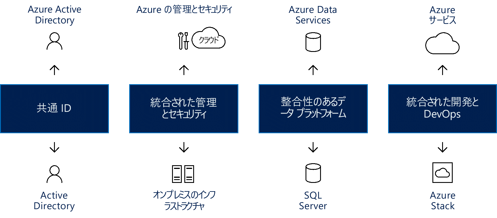

# 一貫性のあるハイブリッド クラウドの作成Create hybrid cloud consistency

この記事では、一貫性のあるハイブリッド クラウド作成するための高レベルの方法を説明します。This article guides you through the high level approaches for creating hybrid cloud consistency.

移行中のハイブリッド デプロイ モデルは、リスクを軽減しき、スムーズなインフラストラクチャの移行に貢献することができます。Hybrid deployment models during migration can reduce risk and contribute to a smooth infrastructure transition. クラウド プラットフォームは、ビジネス プロセスに関して最大レベルの柔軟性を提供します。Cloud platforms offer the greatest level of flexibility when it comes to business processes. 多くの組織はクラウドへの移行をためらっていて、その代わりに最も機密性の高いデータの完全な制御を維持することを好んでいます。Many organizations are hesitant to make the move to the cloud, preferring instead to keep full control over the most sensitive data. 残念ながら、オンプレミス サーバーでは、クラウドと同じ速度でのイノベーションは可能ではありません。Unfortunately, on-premises servers don’t allow for the same rate of innovation as the cloud. ハイブリッド クラウド ソリューションでは、両方の環境の最大の強みを利用できます。クラウド イノベーションの速度とオンプレミス管理の安心感です。A hybrid cloud solution allows you the best of both worlds: The speed of cloud innovation AND the comfort of on-premises management.

## 一貫性のあるハイブリッド クラウドを統合するIntegrate hybrid cloud consistency

ハイブリッド クラウド ソリューションを使用することで、組織はコンピューティング リソースをスケールできます。Using a hybrid cloud solution allows organizations to scale computing resources. 短期の需要急増に対処するために、膨大な資本支出をする必要もなくなります。It also eliminates the need to make massive capital expenditures to handle short-term spikes in demand. 場合、ビジネスに対する変更によって、より機密性の高いデータやアプリケーションのためにローカル リソースを解放する必要が高まった場合、クラウド リソースのプロビジョニング解除を行う方がより簡単で、迅速かつ安価です。When changes to your business drive the need to free up local resources for more sensitive data or applications, it is easier, faster, and less expensive to deprovision cloud resources. 追加のリソースを購入して維持する代わりに、組織が一時的に使用するリソースの分に対してのみ支払いを行います。You pay only for those resources your organization temporarily uses, instead of having to purchase and maintain additional resources. これによって、長期間にわたってアイドル状態のままになることもある機器の量が削減されます。This reduces the amount of equipment that might remain idle over long periods of time. ハイブリッド クラウド コンピューティングは "テクノロジの粋を集めた" プラットフォームであり、データ漏洩のリスクを最小限に抑えながら、柔軟性、スケーラビリティ、コスト効率といったクラウド コンピューティングのメリットすべてを提供します。Hybrid cloud computing is a "best of all possible worlds" platform, delivering all the benefits of cloud computing flexibility, scalability, and cost efficiencies; all with the lowest possible risk of data exposure.

*図 1。ID、管理、セキュリティ、データ、開発、および DevOps にわたる一貫性のあるハイブリッド クラウドの作成*
*Figure 1. Creating hybrid cloud consistency across identity, management, security, data, development, and DevOps*

真のハイブリッド クラウド ソリューションでは 4 つのコンポーネントを提供する必要があります。そのそれぞれから、以下を含む大きなメリットがもたらされます。A true hybrid cloud solution must provide four components, each of which brings significant benefits, including:

- オンプレミス アプリケーションとクラウド アプリケーションのための共通 ID: これによって、ユーザーにすべてのアプリケーションへのシングル サインオン (SSO) が提供され、ユーザーの生産性が向上します。Common identity for on-premises and cloud applications: This improves user productivity by giving users single sign-on (SSO) to all their applications. また、アプリケーションとユーザーがネットワークやクラウドの境界線を越えるので、一貫性が確保されます。It also ensures consistency as applications and users cross network/cloud boundaries.
- ハイブリッド クラウド全体の管理とセキュリティの統合: これにより、まとまりのある方法で環境の監視、管理、セキュリティ保護が提供されるので、可視性と制御の向上が可能です。Integrated management and security across your hybrid cloud: This provides you with a cohesive way to monitor, manage, and secure the environment, enabling increased visibility and control.
- データ センターとクラウドに向けた一貫性のあるデータ プラットフォーム: これによって、オンプレミスとクラウドのデータ サービスへのシームレスなアクセスと結び付くデータ移植性が生み出され、すべてのデータ ソースに対する深い分析情報が得られます。A consistent data platform for the datacenter and the cloud: This creates data portability, combined with seamless access to on-premises and cloud data services for deep insight into all data sources.
- クラウドとオンプレミスのデータ センター間で統合される開発と DevOps: これにより、必要に応じて 2 つの環境間でアプリケーションを移動することができ、両方の場所に同じ開発環境が用意されるようになるため開発者の生産性が向上します。Unified development and DevOps across the cloud and on-premises datacenters: This allows you to move applications between the two environments as needed, improving developer productivity, as both places now have the same development environment.
  
Azure の観点から見たこれらのコンポーネントの例を以下に示します。Examples of these components from an Azure perspective include:

- Azure Active Directory (Azure AD)。オンプレミスの Azure AD と連携動作して、すべてのユーザーに共通の ID を提供します。Azure Active Directory (Azure AD), which works with on-premises Azure AD to provide common identity for all users. オンプレミスとクラウドにわたる SSO によって、必要なアプリケーションと資産にユーザーが安全にアクセスすることが簡単になっています。SSO across on-premises and via the cloud makes it simple for users to safely access the applications and assets they need. ユーザーが必要なものにアクセスできるように、管理者はセキュリティとガバナンス制御を管理でき、それらのアクセス許可は、ユーザー エクスペリエンスに影響を与えずに、柔軟に調整することができます。Adminis can manage security and governance controls so that users can access what they need, with flexibility to adjust those permissions without affecting the user experience.
- Azure では、クラウドとオンプレミス インフラストラクチャの両方に対して統合された管理とセキュリティのサービスが提供されます。これには、ハイブリッド クラウドを監視、構成、および保護するための統合ツール セットが含まれます。Azure provides integrated management and security services for both cloud and on-premises infrastructure that include an integrated set of tools for monitoring, configuring, and protecting hybrid clouds. 管理に対するこのエンド ツー エンドのアプローチは、とりわけ、ハイブリッド クラウド ソリューションを検討している組織が直面している実世界の課題に対処するものです。This end-to-end approach to management specifically addresses real-world challenges facing organizations considering a hybrid cloud solution.
- Azure のハイブリッド クラウドには、すべてのデータへのセキュリティで保護されたアクセスが、シームレスかつ効率的に行われるようにする一般的なツールが用意されています。Azure hybrid cloud provides common tools that ensure secure access to all data, seamlessly and efficiently. Azure データ サービスは Microsoft SQL Server と 一体になり、一貫性のあるデータ プラットフォームを作り出します。Azure data services combine with Microsoft SQL Server to create a consistent data platform. 一貫性のあるハイブリッド クラウド モデルでは、ユーザーは運用と分析の両方のデータを操作でき、オンプレミスとクラウドで、データ ウェアハウス、データ分析、データ視覚化のために同じサービスが提供されます。A consistent hybrid cloud model allows users to work with both operational and analytical data, providing the same services on-premises and in the cloud for data warehousing, data analysis, and data visualization.
- Microsoft Azure クラウド サービスは、Microsoft Azure Stack オンプレミスと一体化して、統合された開発と DevOps を提供します。Microsoft Azure cloud services, combined with Microsoft Azure Stack on-premises, provide unified development and DevOps. クラウドとオンプレミス間の一貫性は、DevOps チームが、いずれかの環境で実行され、適切な場所に簡単にデプロイできるアプリケーションを構築できることを意味します。Consistency across the cloud and on-premises means that your DevOps team can build applications that run in either environment, and can easily deploy to the right location. ハイブリッド ソリューション間でテンプレートを再利用することもでき、それによってさらに DevOps プロセスを簡略化できます。You can reuse templates across the hybrid solution as well, which can further simplify DevOps processes.

## ハイブリッド クラウド環境での Azure StackAzure Stack in a hybrid cloud environment

Microsoft Azure Stack は、組織が自社のデータ センターで、一貫性のある Azure サービスを実行できるハイブリッド クラウド ソリューションで、Azure のパブリック クラウド サービスと一貫性のある、簡素化された開発、管理、およびセキュリティ エクスペリエンスが提供されます。Microsoft Azure Stack is a hybrid cloud solution that allows organizations to run Azure-consistent services in their datacenter, providing a simplified development, management, and security experience that is consistent with Azure public cloud services. Azure Stack は Azure の拡張機能で、オンプレミス環境から Azure サービスを実行し、その後必要な場合は Azure クラウドに移動することができます。Azure Stack is an extension of Azure, enabling you to run Azure services from your on-premises environments and then move to the Azure cloud if and when required.

Azure Stack では、同じツールを使用して IaaS と PaaS 両方のデプロイと運用が可能で、Azure パブリック クラウドと同じエクスペリエンスが提供されます。Azure Stack allows you to deploy and operate both IaaS and PaaS using the same tools and offering the same experience as the Azure public cloud. Azure Stack の管理は、Web UI ポータルからであるか PowerShell からであるかを問わず、Azure の IT 管理者およびエンドユーザーにとって一貫性のあるルック アンド フィールを持っています。Management of Azure Stack, whether through the web UI portal or through PowerShell, has a consistent look and feel for IT administrators and end users with Azure.

Azure と Azure Stack によって、顧客向けアプリケーションと社内の基幹業務アプリケーションの両方に向けて、以下を含む新しいハイブリッド型のユース ケースが実現されます。Azure and Azure Stack unlock new hybrid use cases for both customer-facing and internal line-of-business applications, including:

- **エッジおよび非接続ソリューション**。**Edge and disconnected solutions**. お客様は Azure Stack と Azure の両方で共通のアプリケーション ロジックを使用し、Azure Stack でローカルにデータを処理した後、さらに詳しい分析のために Azure で集約することで、待機時間と接続性の要件に対応できます。Customers can address latency and connectivity requirements by processing data locally in Azure Stack and then aggregating in Azure for further analytics, with common application logic across both. 多くのお客様が、工場の現場、クルーズ船、坑道などのさまざまなコンテキストにわたるこうしたエッジ シナリオに興味を持っています。Many customers are interested in this edge scenario across different contexts, including factory floors, cruise ships, and mine shafts.
- **さまざまな規制に対応するクラウド アプリケーション**。**Cloud applications that meet various regulations**. お客様は Azure でアプリケーションの開発とデプロイを行えば、規制やポリシーの要件を満たすために Azure Stack 上のオンプレミスにデプロイする完全な柔軟性が得られ、コードの変更は不要です。Customers can develop and deploy applications in Azure, with full flexibility to deploy on-premises on Azure Stack to meet regulatory or policy requirements, with no code changes needed. 実例となるアプリケーションの例としては、グローバルな監査、財務報告書の作成、外国為替取引、オンライン ゲーム、経費報告書の作成が挙げられます。Illustrative application examples include global audit, financial reporting, foreign exchange trading, online gaming, and expense reporting. お客様はビジネス要件と技術的要件に基づいて、同じアプリケーションの異なるインスタンスを Azure または Azure Stack にデプロイしようとする場合があります。Customers are sometimes looking to deploy different instances of the same application to Azure or Azure Stack, based on business and technical requirements. Azure はほとんどの要件を満たすのに対して、Azure Stack は必要な場合にデプロイのアプローチを補完するものです。While Azure meets most requirements, Azure Stack complements the deployment approach where needed.
- **オンプレミスのクラウド アプリケーション モデル**。**Cloud application model on-premises**. お客様は、Azure の Web サービス、コンテナー、サーバーレス、マイクロサービスの各アーキテクチャを使用して、既存のアプリケーションの更新と拡張を行うか、新しいアプリケーションを構築することができます。Customers can use Azure web services, containers, serverless, and microservice architectures to update and extend existing applications or build new ones. クラウドの Azure と、オンプレミスの Azure Stack で一貫性のある DevOps プロセスを使用できます。You can use consistent DevOps processes across Azure in the cloud and Azure Stack on-premises. 中核のミッション クリティカルなアプリケーションを含め、アプリケーションの最新化への関心が高まっています。There is a growing interest in application modernization, including for core mission-critical applications.

Azure Stack には 2 つのデプロイ オプションが用意されています。Azure Stack is offered via two deployment options:

- **Azure Stack 統合システム**。**Azure Stack integrated systems**. Azure Stack 統合システムは Microsoft とハードウェア パートナーのパートナーシップを通して提供され、クラウドと歩調を合わせたイノベーションと、管理のしやすさをバランスさせて提供するソリューションを実現しています。Azure Stack integrated systems are offered through a partnership of Microsoft and hardware partners, creating a solution that provides cloud-paced innovation balanced with simplicity in management. Azure Stack はハードウェアとソフトウェアの統合システムとして提供されるため、クラウドからのイノベーションを採用しつつ適度な柔軟性と制御性が得られます。Because Azure Stack is offered as an integrated system of hardware and software, you get the right amount of flexibility and control, while still adopting innovation from the cloud. Azure Stack 統合システムには 4 ノードから 12 ノードまでのサイズがあり、ハードウェア パートナーと Microsoft によって共同でサポートされます。Azure Stack integrated systems range in size from 4–12 nodes and are jointly supported by the hardware partner and Microsoft. Azure Stack 統合システムの使用により、運用ワークロード向けの新しいシナリオが可能になります。Use Azure Stack integrated systems to enable new scenarios for your production workloads.
- **Azure Stack Development Kit**。**Azure Stack Development Kit**. Microsoft Azure Stack Development Kit は、Azure Stack の評価と学習に使用できる Azure Stack の単一ノード デプロイです。Microsoft Azure Stack Development Kit is a single-node deployment of Azure Stack, which you can use to evaluate and learn about Azure Stack. このキットは開発環境としても使用でき、Azure と一貫性のある API やツールを使用して開発を行うことができます。You can also use the kit as a developer environment, where you can develop using APIs and tooling that are consistent with Azure. Azure Stack Development Kit は、運用環境での使用を想定していません。Azure Stack Development Kit is not intended to be used as a production environment.

## Azure Stack One Cloud EcosystemAzure Stack One Cloud Ecosystem

完全な Azure エコシステムを使用して、Azure Stack の取り組みをスピードアップできます。You can speed up Azure Stack initiatives by using the complete Azure ecosystem:

- Azure では、Azure の認定を受けたアプリケーションとサービスの大半が、Azure Stack で動作することを保証しています。Azure ensures that most applications and services certified for Azure will work on Azure Stack. &mdash;Bitnami、Docker、Kemp Technologies、Pivotal Cloud Foundry、Red Hat Enterprise Linux、SUSE Linux など&mdash;の複数の ISV が、Azure Stack に向けて自社のソリューションを拡張しています。Several ISVs &mdash; including Bitnami, Docker, Kemp Technologies, Pivotal Cloud Foundry, Red Hat Enterprise Linux, and SUSE Linux &mdash; are extending their solutions to Azure Stack.
- Azure Stack は、フル マネージド サービスとして配信および運用することを選択できます。You can opt to have Azure Stack delivered and operated as a fully managed service. &mdash;Tieto、Yourhosting、Revera、Pulsant、NTT など&mdash;のいくつかのパートナーが、間もなく Azure と Azure Stack にわたってマネージド サービスのオファリングを用意する予定です。Several partners &mdash; including Tieto, Yourhosting, Revera, Pulsant, and NTT &mdash; will have managed service offerings across Azure and Azure Stack shortly. これらのパートナーは、Cloud Solution Provider (クラウド プロバイダー) プログラムを介して Azure 用のマネージド サービスを提供してきており、今後、そのオファリングを拡張してハイブリッド ソリューションを含めてゆきます。These partners have been delivering managed services for Azure via the Cloud Solution Provider (Cloud Providers) program and are now extending their offerings to include hybrid solutions.
- 完備したフル マネージド型のハイブリッド クラウド ソリューションの例である Avanade は、クラウド移行サービス、ソフトウェア、インフラストラクチャ、設定と構成、継続的なマネージド サービスを含むオールインワンのオファーを提供しているため、お客様は現在 Azure でしているように Azure Stack を利用できます。As an example of a complete, fully managed hybrid cloud solution, Avanade is delivering an all-in-one offer that includes cloud transformation services, software, infrastructure, setup and configuration, and ongoing managed services so customers can consume Azure Stack just as they do with Azure today.
- システム インテグレーター (SI) は、お客様のためにエンド ツー エンドの Azure ソリューションを構築することで、アプリケーション最新化の取り組みを推進することに貢献できます。Systems Integrators (SI) can help accelerate application modernization initiatives by building end-to-end Azure solutions for customers. 彼らは詳細にわたる Azure のスキル セット、領域と業界の知識、プロセスの専門知識 (DevOps など) をもたらします。They bring in-depth Azure skill sets, domain and industry knowledge, and process expertise (e.g., DevOps). SI にとっては、すべての Azure Stack クラウドが、ソリューションを設計し、システムのデプロイを先導して影響を及ぼし、含まれる機能をカスタマイズして運用作業を提供する機会となります。Every Azure Stack cloud is an opportunity for an SI to design the solution, lead and influence system deployment, customize the included capabilities, and deliver operational activities. これには、Avanade、DXC、Dell EMC Services、InFront Consulting Group、HPE Pointnext、Pricewaterhouse Coopers (PwC) などの SI が含まれます。This includes SIs like Avanade, DXC, Dell EMC Services, InFront Consulting Group, HPE Pointnext, and Pricewaterhouse Coopers (PwC).
