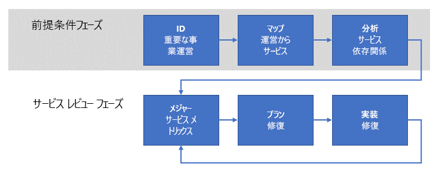

# 運用適合性レビューの確立Establishing an operational fitness review

企業が Azure でワークロードの運用を開始したら、次のステップは、これらのワークロードに対する**非機能的な**要件を列挙し、実装して、繰り返し確認するための**運用適合性レビュー** プロセスを確立することです。As your enterprise begins to operate workloads in Azure, the next step is to establish an **operational fitness review** process to enumerate, implement, and iteratively review the **non-functional** requirements for these workloads. "_非機能的_" 要件とは、サービスの予期される運用的な動作に関連します。_Non-functional_ requirements are related to the expected operational behavior of the service. 非機能的要件の 5 つの主要カテゴリは、スケーラビリティ、可用性、回復性 (事業継続とディザスター リカバリーを含む)、管理、セキュリティであり、[ソフトウェア品質の重要な要素](../../guide/pillars.md)と呼ばれます。There are five essential categories of non-functional requirements referred to as the [pillars of software quality](../../guide/pillars.md): scalability, availability, resiliency (including business continuity and disaster recovery), management, and security. 運用適合性レビュー プロセスの目的は、ミッション クリティカルなワークロードが品質の重要な要素に関するビジネスの期待を満たしていることを確認することです。The purpose of an operational fitness review process is ensuring that your mission critical workloads meet the expectations of your business with respect to the quality pillars.

そのためには、企業は運用適合性レビュー プロセスを実施して、運用環境でワークロードを実行することが原因で発生する問題を完全に理解し、問題を修復する方法を決定して、解決する必要があります。For this reason,  your enterprise should undertake an operational fitness review process to fully understand the issues that result from running the workload in a production environment, determine how to remediate the issues, then resolve them. この記事では、企業がこの目標を達成するために使用できる高レベルの運用適合性レビュー プロセスの概要について説明します。This article outlines a high-level operational fitness review process that your enterprise can use to achieve this goal.

## Microsoft での運用適合性Operational fitness at Microsoft

Azure プラットフォームの開発は、最初から、Microsoft 全体の多くのチームによって行われる継続的な開発と統合プロジェクトでした。From the outset, the development of the Azure platform has been a continuous development and integration project undertaken by many teams across Microsoft. 基本的な非機能的要件を定期的に列挙して実装するための堅牢なプロセスがなかったら、Azure の大規模で複雑なプロジェクトの品質と一貫性を確保することは非常に困難でした。It would be very difficult to ensure quality and consistency for a project of Azure's size and complexity without a robust process for enumerating and implementing the fundamental non-functional requirements on a regular basis.

Microsoft が実施したこれらのプロセスが、このドキュメントで概要を説明することの基礎を形成しています。These processes followed by Microsoft form the basis for those outlined in this document.

## 問題の理解Understanding the problem

「[概要](../../cloud-adoption/getting-started/overview.md)」で説明したように、企業のデジタル変革の最初のステップは、Azure を採用することによって解決するビジネス上の問題を明らかにすることです。As you learned in [Getting started](../../cloud-adoption/getting-started/overview.md), the first step in an enterprise's digital transformation is identifying the business problems to be solved by adopting Azure. 次のステップは、クラウドへのワークロードの移行や、既存のオンプレミス サービスの対応によるクラウド機能の組み込みなど、問題に対する高いレベルでの解決策を決定することです。The next step is to determine a high-level solution to the problem, such as migrating a workload to the cloud, or adapting an existing on-premises service to include cloud functionality. 最後に、解決策を設計して実装します。Finally, the solution is designed and implemented.

このプロセスの過程で、サービスの "_機能_" に頻繁に注目します。During this process, the focus is often on the _features_ of the service. つまり、サービスを実行するために必要な "_機能_" の要件のセットがあります。That is, there are a set of desired _functional_ requirements for the service to perform. たとえば、製品配送サービスでは、製品の出荷場所と配達先の場所の決定、配送中の製品の追跡、顧客への通知などの機能が必要です。For example, a product delivery service requires features for determining the source and destination locations of the product, tracking the product during delivery, customer notifications, and others.

これに対し、"_非機能的_" な要件は、サービスの[可用性](../../checklist/availability.md)、[回復性](../../resiliency/index.md)、[スケーラビリティ](../../checklist/scalability.md)などのプロパティに関係します。In contrast, the _non-functional_ requirements relate to properties such as the service's [availability](../../checklist/availability.md), [resiliency](../../resiliency/index.md), and [scalability](../../checklist/scalability.md). これらのプロパティは、サービスの特定の機能の最終的な動作に直接影響しないため、機能的要件とは異なります。These properties differ from the functional requirements because they do not directly affect the final function of any particular feature in the service. ただし、これらの非機能的要件は、サービスの "_パフォーマンス_" や "_継続性_" に関係します。However, these non-functional requirements are related to the _performance_ and _continuity_ of the service.

一部の非機能的な要件は、サービス レベル アグリーメント (SLA) の観点で指定できます。Some non-functional requirements can be specified in terms of a service level agreement (SLA). たとえば、サービスの継続性に関しては、サービスの可用性要件を **99.99% の時間で利用可能**のようなパーセンテージとして表現できます。For example, with regard to service continuity, an availability requirement for the service can be expressed as a percentage such as **available 99.99% of the time**. 他の非機能的要件は、定義がさらに難しく、運用ニーズが発展すると変化することがあります。Other non-functional requirements may be more difficult to define and may change as production needs evolve. たとえば、コンシューマー向けサービスは、需要急増後に予期しないスループット要件に直面し始める可能性があります。For example, a consumer-facing service might start facing unanticipated throughput requirements after a surge of popularity.

![注] RPO、RTO、SLA、および関連する概念の説明など、回復性に関する要件の定義について詳しくは、「[回復性に優れた Azure 用アプリケーションの設計](../../resiliency/index.md#define-your-availability-requirements)」をご覧ください。![NOTE] Defining the requirements for resiliency, including explanations of RPO, RTO, SLA, and related concepts, are explored in more depth in [Designing resilient applications for Azure](../../resiliency/index.md#define-your-availability-requirements).

## 運用適合性レビューのプロセスOperational fitness review process

企業のサービスのパフォーマンスと継続性の維持において重要なのは、"_運用適合性レビュー_" のプロセスを実装することです。The key to maintaining the performance and continuity of an enterprise's services is to implement an _operational fitness review_ process.

概要レベルでは、プロセスには 2 つのフェーズがあります。At a high level, the process has two phases. 前提条件フェーズでは、要件が確立されて、サポート サービスにマップされます。In the prerequisites phase, the requirements are established and mapped to supporting services. これは頻繁には行われません。おそらく、年 1 回や、新しい運用の導入時です。This occurs less frequently; perhaps annually or when new operations are introduced. 前提条件フェーズの出力は、フロー フェーズで使用されます。The output of the prerequisites phase is used in the flow phase. フロー フェーズはさらに頻繁に発生します。推奨されるのは毎月です。The flow phase occurs more frequently; we recommend monthly.

### 前提条件フェーズPrerequisites phase

このフェーズのステップでは、重要なサービスの定期的なレビューを実施するために必要な要件をキャプチャします。The steps in this phase are intended to capture the necessary requirements for conducting a regular review of the important services.

- **重要なビジネス操作を識別する**。**Identify critical business operations**. 企業の**ミッション クリティカルな**ビジネス操作を明らかにします。Identify the enterprise's **mission critical** business operations. ビジネス操作は、すべてのサポート サービス機能から独立しています。Business operations are independent from any supporting service functionality. つまり、ビジネス操作は、ビジネスで実行する必要があり、IT サービスのセットによってサポートされる、実際のアクティビティを表します。In other words, business operations represent the actual activities that the business needs to perform and are supported by a set of IT services. "_ミッション クリティカル_" または "_ビジネス クリティカル_" という用語は、操作が妨げられた場合のビジネスに対する重大な影響を反映します。The term _mission critical_, or alternatively _business critical_, reflects a severe impact to the business if the operation is impeded. たとえば、オンライン小売業には、"客がショッピング カートに商品を追加できるようにする" や "クレジット カードの支払いを処理する" といったビジネス操作が存在する場合があります。For example, an online retailer may have a business operation such as "enable a customer to add an item to a shopping cart" or "process a credit card payment". これらの操作のいずれかが失敗した場合、客は取引を完了できず、企業は販売の実現に失敗します。If either of these operations were to fail, a customer would be unable to complete the transaction and the enterprise would fail to realize sales.

- **操作をサービスにマップする**。**Map operations to services**. これらのビジネス操作を、それらをサポートするサービスにマップします。Map these business operations to the services that support them. 上のショッピング カートの例では、在庫管理サービスやショッピング カート サービスなど、複数のサービスが関係する場合があります。In the above shopping cart example, several services may be involved: an inventory stock management service, a shopping cart service, and others. 上のクレジット カード支払いの例では、オンプレミスの支払いサービスがサードパーティの支払い処理サービスと対話する可能性があります。In the credit card payment example above, an on-premises payment service may interact with a third-party payment processing service.

- **サービスの依存関係を分析する**。**Analyze service dependencies**. ほとんどのビジネス操作には、複数のサポート サービス間のオーケストレーションが必要です。Most business operations require orchestration between multiple supporting services. サービス間の依存関係と、ミッション クリティカルなトランザクションのサービス間のフローを理解しておくことが重要です。It is important to understand the dependences between the services and the flow of mission critical transactions through these services. オンプレミスのサービスと Azure サービスの間の依存関係についても考慮する必要があります。You should also consider the dependencies between on-premises services and Azure services. ショッピング カートの例では、在庫管理サービスはオンプレミスでホストされて、物理的な倉庫から従業員によるデータ入力を取り込みますが、データは [Azure Storage](/azure/storage/common/storage-introduction) などの Azure サービスや [Azure Cosmos DB](/azure/cosmos-db/introduction) などのデータベースに格納される場合があります。In the shopping cart example, the inventory stock management service may be hosted on-premises and ingest data input by employees from a physical warehouse, but it may store data in an Azure service such as [Azure storage](/azure/storage/common/storage-introduction) or a database such as [Azure Cosmos DB](/azure/cosmos-db/introduction).

これらのアクティビティからの出力は、サービス操作に対する**スコアカード メトリック**のセットです。An output from these activities is a set of **scorecard metrics** for service operations. メトリックは、可用性、スケーラビリティ、ディザスター リカバリーなどの非機能的な条件の観点から分類されます。The metrics are categorized in terms of non-functional criteria such as availability, scalability, and disaster recovery. スコアカードのメトリックは、サービスの操作で満たすことが期待される条件を表します。Scorecard metrics express the criteria that the service is expected to meet operationally. これらのメトリックは、サービス操作に適した任意の細分性レベルで表現できます。These metrics can be expressed at any level of granularity that is appropriate for the service operation.

スコアカードは、ビジネス所有者とエンジニアリングの間の意味のあるディスカッションを容易にするために簡単な用語で表す必要があります。The scorecard should be expressed in simple terms to facilitate meaningful discussion between the business owners and engineering. たとえば、スケーラビリティ スコアカードのメトリックでは、望ましい条件で動作している場合は "_緑_"、望ましい条件を満たしていないが計画的な修復をアクティブに実装している場合は "_黄_"、望ましい条件を満たしていなくて計画もアクションもない場合は "_赤_" で表すことができます。For example, a scalability scorecard metric could be expressed as _green_ for performing at the desired criteria, _yellow_ for failing to meet the desired criteria but actively implementing a planned remediation, and _red_ for failing to meet the desired criteria with no plan or action.

これらのメトリックがビジネス ニーズを直接反映する必要があることを強調することが重要です。It is important to emphasize that these metrics should directly reflect business needs.

### サービス レビュー フェーズService review phase

サービス レビュー フェーズは、運用適合性レビュー プロセスの中核です。The service review phase is core of the operational fitness review process.

- **サービス メトリックを測定する**。**Measure service metrics**. スコアカードのメトリックを使用してサービスを監視し、ビジネス要件を満たすことを確認する必要があります。Using the scorecard metrics, the services should be monitored to ensure that they meet the business expectations. つまり、サービスの監視が不可欠です。This means that service monitoring is essential. 非機能的要件に関してサービスのセットを監視できない場合、対応するスコアカード メトリックは赤であると見なす必要があります。If you are not able to monitor a set of services with respect to the non-functional requirements, then the corresponding scorecard metrics should be considered red. この場合、修復のための最初のステップは、適切なサービス監視を実装することです。In this case, the first step for remediation is to implement the appropriate service monitoring.
たとえば、サービスに対するビジネス要件が 99.99% の可用性での動作であるのに、可用性を測定するためのテレメトリが運用環境にない場合は、要件が満たされていないものと想定する必要があります。For example, if the business expects a service to operate with 99.99% availability, but there is no production telemetry in place to measure the availability, you should assume that you're not meeting the requirement.

- **修復を計画する**。**Plan remediation**. 許容されるしきい値を下回ったメトリックがあるサービス操作の場合、操作を許容できるメトリックにするためのサービスの修復コストを決定します。For each service operation with metrics that fall below an acceptable threshold, determine the cost of remediating the service to bring operation to an acceptable metric. サービスの修復コストがサービスの予想収益より大きい場合は、顧客エクスペリエンスなどの実体のないコストの考慮に移ります。If the cost of remediating the service is greater than the expected revenue generation of the service, move on to consider the non-tangible costs such as customer experience. たとえば、顧客がサービスを使用して注文しにくい場合は、競合企業を選択する可能性があります。For example, if customers have difficulty placing a successful order using the service, they may choose a competitor instead.

- **修復を実装する**。**Implement remediation**. ビジネス所有者とエンジニアリングの間でプランがまとまった後、プランを実装する必要があります。After the business owners and engineering converge on a plan, it should be implemented. スコアカードのメトリックを確認するたびに、実装の状態を報告する必要があります。The status of the implementation should be reported whenever scorecard metrics are reviewed.

このプロセスは反復的であり、それを担当する専用チームを設けるのが理想的です。This process is iterative, and ideally your enterprise should have a team dedicated to owning it. このチームは、定期的にミーティングを行って、既存の修復プロジェクトを検討し、新しいワークロードの基礎レビューを開始し、企業の全体的なスコアカードを追跡する必要があります。This team should meet regularly to review existing remediation projects, kick off the fundamentals review of new workloads, and track the enterprise's overall scorecard. このチームには、スケジュールが遅れていたりメトリックを満たせていない修復チームに対して説明責任を要求する権限があります。The team should have the authority to ensure accountability for remediation teams that are behind schedule or fail to meet metrics.

## 運用適合性レビュー チームの構成Structure of the operational fitness review team

運用適合性レビュー チームは、次の役割で構成されます。The operational fitness review team is composed of the following roles:

1. **ビジネス所有者**。**Business owner**. この役割は、各 "ミッション クリティカルな" ビジネス操作を識別して優先順位を付けるためのビジネス知識を提供します。This role provides knowledge of the business to identify and prioritize each "mission critical" business operation. また、軽減コストをビジネスへの影響と比較し、修復に関する最終的な決定を下します。This role also compares the mitigation cost to the business impact and drives the final decision on remediation.

2. **ビジネス アドボケイト**。**Business advocate**. この役割は、ビジネス操作を個別の部分に分割し、これらの部分をオンプレミスとクラウドのサービスとインフラストラクチャにマッピングします。This role is responsible for breaking down business operations into discreet parts and mapping those parts to on-premises and cloud services and infrastructure. この役割には、各ビジネス操作に関連付けられているテクノロジの深い知識が必要です。The role requires deep knowledge of the technology associated with each business operation.

3. **エンジニアリング所有者**。**Engineering owner**. この役割は、ビジネス操作に関連付けられているサービスの実装を担当します。This role is responsible for implementating the services associated with the business operation. 各人は、運用適合性レビュー チームによって発見された非機能的要件の問題を解決するための解決策の設計、実装、展開に参加する場合があります。These individuals may participate in the design, implementation, and deployment of any solutions for solving non-functional requirement issues uncovered by the operational fitness review team.

4. **サービス所有者**。**Service owner**. この役割は、ビジネスのアプリケーションとサービスの運用を担当します。This role is responsible for operating the business's applications and services. これらのアプリケーションとサービスのログ記録と使用状況のデータを収集します。These individuals collect logging and usage data for these applications and services. このデータは、問題の特定と、展開後の修正の確認の両方に使用されます。This data is used both to identify issues and verify fixes once deployed.

## 運用適合性レビュー ミーティングOperational fitness review meeting

運用適合性レビュー チームには定期的にミーティングを開くことをお勧めします。We recommend that your operational fitness review team meet on a regular basis. たとえば、毎月ミーティングを行い、四半期ごとに上級リーダーに状態とメトリックを報告します。For example, the could team meet on a monthly cadence and report status and metrics to senior leadership on a quarterly basis.

プロセスとミーティングの詳細は、特定のニーズに合わせて調整する必要があります。The details of the process and meeting should be adapted to fit your specific needs. 以下のタスクから始めることをお勧めします。We recommend the following tasks as a starting point:

1. ビジネス所有者とビジネス アドボケイトは、エンジニアリングとサービス所有者からの入力を基にして、各ビジネス操作の非機能的な要件を列挙して決定します。The business owner and business advocate enumerate and determine the non-functional requirements for each business operation, with input from the engineering and service owners. 以前に識別されたビジネス操作の場合、優先度を確認して検証します。For business operations that have been previously identified, the priority is reviewed and verified. 新しいビジネス操作の場合、既存のリスト内での優先度を割り当てます。For new business operations, a priority in the existing list is assigned.

2. エンジニアリングとサービス所有者は、ビジネス操作の**現在の状態**を対応するオンプレミスおよびクラウドのサービスにマップします。The engineering and service owners map the **current state** of business operations to the corresponding on-premises and cloud services. マッピングは、各サービスのコンポーネントのリストと依存関係ツリーで構成されます。The mapping is composed of a list of the components in each service, oriented as a dependency tree. リストと依存関係ツリーが生成されたら、ツリーの**クリティカル パス**を決定します。Once the list and dependency tree are generated, the **critical paths** through the tree are determined.

3. エンジニアリングとサービス所有者は、前のステップでリストしたサービスの操作ログと監視の現在の状態を確認します。The engineering and service owners review the current state of operational logging and monitoring for the services listed in the previous step. 非機能的要件の達成失敗の原因であるサービス コンポーネントを特定するには、堅牢なログ記録と監視が不可欠です。Robust logging and monitoring are critical, in order to identify service components that contribute to failuring to meet non-functional requirements. 十分なログと監視が設けられていない場合、それらを設ける計画を作成して実装する必要があります。If sufficient logging and monitoring are not in place, a plan must be created and implemented to put them in place.

4. 新しいビジネス操作に対してはスコアカード メトリックを作成します。Scorecard metrics are created for new business operation. スコアカードは、ステップ 2 で識別した各サービスの構成コンポーネントのリストと、非機能的要件およびコンポーネントが要件を満たしている度合いを表すメトリックで構成されます。The scorecard is composed of the list of constituent components for each service identified in step 2, aligned with the non-functional requirements and a metric representing how well the component meets the requirement.

5. 非機能的要件を満たしていない構成コンポーネントについては、上位レベルの解決策を設計して、エンジニアリング所有者を割り当てます。For those constituent components that fail to meet non-functional requirements, a high-level solution is designed and an engineering owner is assigned. この時点で、ビジネス所有者とビジネス アドボケイトは、ビジネス操作の予想収益に基づいて、修復作業にかかる予算を設定する必要があります。At this point, the business owner and business advocate should establish a budget for the remediation work, based on the expected revenue of the business operation.

6. 最後に、実行されている修復作業の確認が行われます。Finally, a review is conducted of the ongoing remediation work. 進行中の作業の各スコアカード メトリックを、予想されるメトリックと対比して確認します。Each of the scorecard metrics for work in progress is reviewed against the expected metrics. メトリックを満たしている構成コンポーネントについては、サービス所有者が、メトリックが満たされていることを確認するためのログと監視データを提示します。For constituent components that are meeting metrics, the service owner presents logging and monitoring data to confirm that the metric is met. メトリックを満たしていない構成コンポーネントについては、各エンジニアリング所有者が、メトリックが満たされるのを妨げている問題と修復のための新しい設計について説明します。For those constituent components that are not meeting metrics, each engineering owner explains the issues that are preventing metrics from being reached and any new designs for remediation.

## 推奨リソースRecommended resources

- 「[ソフトウェア品質の重要な要素](../../guide/pillars.md)」。[Pillars of software quality](../../guide/pillars.md).
Azure アプリケーション アーキテクチャ ガイドのこのセクションでは、ソフトウェア品質の 5 つの重要な要素、すなわち、拡張性、可用性、回復性、管理性、セキュリティに重点が置かれています。This section of the Azure Application Architecture guide describes the five pillars of software quality: Scalability, availability, resiliency, management, and security.
- 「[Azure アプリケーションの 10 の設計原則](../../guide/design-principles/index.md)」。[Ten design principles for Azure applications](../../guide/design-principles/index.md).
Azure アプリケーション アーキテクチャ ガイドのこのセクションでは、アプリケーションをよりスケーラブルで回復性があり、管理しやすいものにする一連の設計原則が説明されています。This section of the Azure Application Architecture guide discusses a set of design principles to make your application more scalable, resilient, and manageable.
- 「[回復性に優れた Azure 用アプリケーションの設計](../../resiliency/index.md)」。[Designing resilient applications for Azure](../../resiliency/index.md).
このガイドでは、まず回復性という用語の定義と関連する概念が説明されています。This guide starts with a definition of the term resiliency and related concepts. 次に、設計、実装からデプロイ、運用までというアプリケーションの有効期間全体に体系的な方法を使用することで、回復性を実現するプロセスについて説明します。Then it describes a process for achieving resiliency, using a structured approach over the lifetime of an application, from design and implementation to deployment and operations.
- 「[クラウド設計パターン](../../patterns/index.md)」。[Cloud Design Patterns](../../patterns/index.md).
これらの設計パターンは、エンジニアリング チームがソフトウェア品質の重要な要素に基づいてアプリケーションを構築するときに役立ちます。These design patterns are useful for engineering teams when building applications on the pillars of software quality.