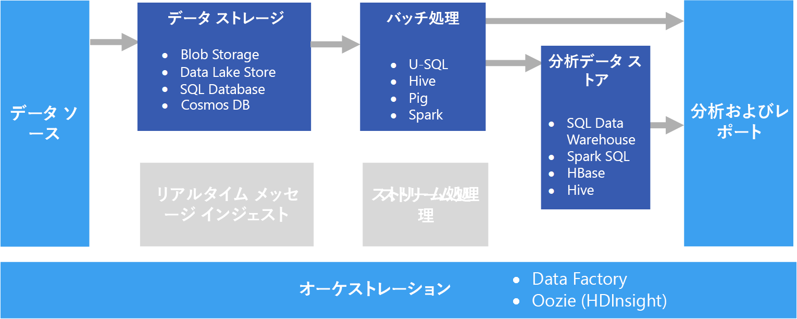

# バッチ処理Batch processing

ビッグ データの一般的なシナリオは、保存されたデータのバッチ処理です。A common big data scenario is batch processing of data at rest. このシナリオでは、ソース アプリケーション自体またはオーケストレーション ワークフローによって、ソース データがデータ ストレージに読み込まれます。In this scenario, the source data is loaded into data storage, either by the source application itself or by an orchestration workflow. その後、データは、並列化されたジョブによってインプレースで処理されます。これは、オーケストレーション ワークフローによって開始することもできます。The data is then processed in-place by a parallelized job, which can also be initiated by the orchestration workflow. 処理には複数の反復手順が含まれることがあり、処理後の変換された結果が分析データ ストアに読み込まれ、分析およびレポート コンポーネントによるクエリを実行できます。The processing may include multiple iterative steps before the transformed results are loaded into an analytical data store, which can be queried by analytics and reporting components.

たとえば、Web サーバーからのログがフォルダーにコピーされた後、夜間処理されて、Web アクティビティの日次レポートが生成されます。For example, the logs from a web server might be copied to a folder and then processed overnight to generate daily reports of web activity.

## このソリューションを使用する状況When to use this solution

バッチ処理は、単純なデータ変換からより完全な ETL (抽出-変換-読み込み) パイプラインに至るまで、さまざまなシナリオで使用されます。Batch processing is used in a variety of scenarios, from simple data transformations to a more complete ETL (extract-transform-load) pipeline. ビッグ データのコンテキストでは、バッチ処理は非常に大きなデータ セットを操作する可能性があり、計算にかなりの時間がかかります In a big data context, batch processing may operate over very large data sets, where the computation takes significant time. (例については、「[Lambda architecture](../big-data/index.md#lambda-architecture)」(ラムダ アーキテクチャ) を参照してください)。バッチ処理は、通常は、さらに対話型で調査することに至り、機械学習用のモデル化の準備が完了したデータを提供したり、分析とビジュアル化用に最適化されたデータ ストアにデータを書き込んだりします。(For example, see [Lambda architecture](../big-data/index.md#lambda-architecture).) Batch processing typically leads to further interactive exploration, provides the modeling-ready data for machine learning, or writes the data to a data store that is optimized for analytics and visualization.

バッチ処理の 1 つの例は、フラットな半構造化 CSV ファイルまたは JSON ファイルの大規模なセットを、さらにクエリを実行できる準備が整ったスキーマ化され、構造化された形式に変換することです。One example of batch processing is transforming a large set of flat, semi-structured CSV or JSON files into a schematized and structured format that is ready for further querying. 通常、データは、取り込みに使用される生の形式 (CSV など) から、クエリを効率的に実行できるバイナリ形式に変換されます。これが行われるのは、データが列形式で格納され、多くの場合、データに関するインデックスとインライン統計が用意されるためです。Typically the data is converted from the raw formats used for ingestion (such as CSV) into binary formats that are more performant for querying because they store data in a columnar format, and often provide indexes and inline statistics about the data.

## 課題Challenges

- **データの形式とエンコード**。**Data format and encoding**. デバッグ時の最も困難な問題の一部は、予期しない形式またはエンコードがファイルで使用されている場合に発生します。Some of the most difficult issues to debug happen when files use an unexpected format or encoding. たとえば、ソース ファイルで UTF-16 と UTF-8 エンコードの両方が使用されていたり、予期しない区切り文字 (スペースやタブ) や予期しない文字が含まれていたりすることがあります。For example, source files might use a mix of UTF-16 and UTF-8 encoding, or contain unexpected delimiters (space versus tab), or include unexpected characters. 別の一般的な例は、区切り記号として解釈されるタブ、スペース、またはコンマが含まれているテキスト フィールドです。Another common example is text fields that contain tabs, spaces, or commas that are interpreted as delimiters. データの読み込みと解析ロジックは、これらの問題を検出して処理するのに十分な柔軟性を持っている必要があります。Data loading and parsing logic must be flexible enough to detect and handle these issues.

- **タイム スライスの調整**。**Orchestrating time slices**. 多くの場合、ソース データは、年、月、日、時間別に整理された処理時間を反映するフォルダー階層に配置されます。Often source data is placed in a folder hierarchy that reflects processing windows, organized by year, month, day, hour, and so on. 場合によっては、データが遅れて到着することがあります。In some cases, data may arrive late. たとえば、Web サーバーが失敗し、3 月 7 日のログが 3 月 9 日までフォルダーに保存されないとします。For example, suppose that a web server fails, and the logs for March 7th don't end up in the folder for processing until March 9th. 遅すぎたためにそれらは単純に無視されるのでしょうか。Are they just ignored because they're too late? 下流の処理ロジックは順序がばらばらのレコードを処理できるでしょうか。Can the downstream processing logic handle out-of-order records?

## アーキテクチャArchitecture

バッチ処理アーキテクチャには、上の図に示した次の論理コンポーネントがあります。A batch processing architecture has the following logical components, shown in the diagram above.

- **データ ストレージ**。**Data storage**. 通常は、さまざまな形式の大量の大容量ファイルのリポジトリとして機能できる分散ファイル ストアです。Typically a distributed file store that can serve as a repository for high volumes of large files in various formats. 一般的に、この種類のストアは、しばしばData Lake と呼ばれます。Generically, this kind of store is often referred to as a data lake.

- **バッチ処理**。**Batch processing**. ビッグ データの大容量という性質は、多くの場合、ソリューションで、実行時間の長いバッチ ジョブを使用してデータ ファイルを処理し、フィルター処理や集計などを行って分析用のデータを準備する必要があることを意味します。The high-volume nature of big data often means that solutions must process data files using long-running batch jobs to filter, aggregate, and otherwise prepare the data for analysis. 通常、これらのジョブには、ソース ファイルの読み取り、ソース ファイルの処理、新しいファイルへの出力の書き込みが含まれます。Usually these jobs involve reading source files, processing them, and writing the output to new files.

- **分析データ ストア**。**Analytical data store**. 多くのビッグ データ ソリューションは、分析用にデータを準備した後、処理されたデータを分析ツールを使用してクエリを実行できる構造化された形式で提供するように設計されています。Many big data solutions are designed to prepare data for analysis and then serve the processed data in a structured format that can be queried using analytical tools.

- **分析とレポート**。**Analysis and reporting**. ほとんどのビッグ データ ソリューションの目的は、分析とレポートによってデータに関する実用的な情報を提供することにあります。The goal of most big data solutions is to provide insights into the data through analysis and reporting.

- **オーケストレーション**。**Orchestration**. バッチ処理では、通常は、データ ストレージ、バッチ処理、分析データ ストア、およびレポート層にデータを移行するかコピーするための何らかのオーケストレーションが必要です。With batch processing, typically some orchestration is required to migrate or copy the data into your data storage, batch processing, analytical data store, and reporting layers.

## テクノロジの選択Technology choices

次のテクノロジは、Azure でのバッチ処理に推奨される選択肢です。The following technologies are recommended choices for batch processing solutions in Azure.

### データ ストレージData storage

- **Azure Storage Blob コンテナー**。**Azure Storage Blob Containers**. 多くの既存の Azure のビジネス プロセスでは、既に Azure Blob Storage を活用しているため、ビッグ データ ストア向けの適切な選択肢になっています。Many existing Azure business processes already use Azure blob storage, making this a good choice for a big data store.
- **Azure Data Lake Store**。**Azure Data Lake Store**. Azure Data Lake Store は、任意のサイズのファイルを格納できる豊富なセキュリティ オプションを備えた実質的に無制限のストレージであり、異種形式のデータの一元的なストアを必要とする非常に大規模なビッグ データ ソリューションに適した選択肢です。Azure Data Lake Store offers virtually unlimited storage for any size of file, and extensive security options, making it a good choice for extremely large-scale big data solutions that require a centralized store for data in heterogeneous formats.

詳しくは、[データ ストレージ](../technology-choices/data-storage.md)に関するページをご覧ください。For more information, see [Data storage](../technology-choices/data-storage.md).

<!-- markdownlint-disable MD024 -->

### バッチ処理Batch processing

<!-- markdownlint-enable MD024 -->

- **U-SQL**。**U-SQL**. U-SQL は、Azure Data Lake Analytics によって使用されるクエリ処理言語です。U-SQL is the query processing language used by Azure Data Lake Analytics. それは、SQL の宣言型の性質を C# の手続き型の拡張性と組み合わせたものであり、並列性を利用してデータを大規模に効率的に処理できるようにします。It combines the declarative nature of SQL with the procedural extensibility of C#, and takes advantage of parallelism to enable efficient processing of data at massive scale.
- **Hive**。**Hive**. Hive は、HDInsight を含む大半の Hadoop ディストリビューションでサポートされている SQL に似た言語です。Hive is a SQL-like language that is supported in most Hadoop distributions, including HDInsight. Azure Blob Storage と Azure Data Lake Store を含む HDFS と互換性のあるストアのデータを処理するために使用できます。It can be used to process data from any HDFS-compatible store, including Azure blob storage and Azure Data Lake Store.
- **Pig**。**Pig**. Pig は、HDInsight を含む多数の Hadoop ディストリビューションで使用される、宣言型のビッグ データ処理言語です。Pig is a declarative big data processing language used in many Hadoop distributions, including HDInsight. 非構造化または半構造化データを処理するために特に便利です。It is particularly useful for processing data that is unstructured or semi-structured.
- **Spark**。**Spark**. Spark エンジンは、Java、Scala、および Python を含むさまざまな言語で記述されたバッチ処理プログラムをサポートします。The Spark engine supports batch processing programs written in a range of languages, including Java, Scala, and Python. Spark は、分散アーキテクチャを使用して、複数の worker ノード間でデータを並列で処理します。Spark uses a distributed architecture to process data in parallel across multiple worker nodes.

詳しくは、[バッチ処理](../technology-choices/batch-processing.md)に関するページをご覧ください。For more information, see [Batch processing](../technology-choices/batch-processing.md).

### 分析データ ストアAnalytical data store

- **SQL Data Warehouse**。**SQL Data Warehouse**. Azure SQL Data Warehouse は、SQL Server データベース テクノロジに基づく管理対象サービスであり、大規模なデータ ウェアハウスのワークロードをサポートするように最適化されています。Azure SQL Data Warehouse is a managed service based on SQL Server database technologies and optimized to support large-scale data warehousing workloads.
- **Spark SQL**。**Spark SQL**. Spark SQL は Spark 上に構築された API で、SQL 構文を使用してクエリを実行できるデータフレームとテーブルの作成をサポートします。Spark SQL is an API built on Spark that supports the creation of dataframes and tables that can be queried using SQL syntax.
- **HBase**。**HBase**. HBase は、待ち時間の短い NoSQL ストアで、構造化および半構造化データに対してクエリを実行するための高パフォーマンスで柔軟なオプションを提供します。HBase is a low-latency NoSQL store that offers a high-performance, flexible option for querying structured and semi-structured data.
- **Hive**。**Hive**. バッチ処理に適していることに加え、Hive は、概念的には一般的なリレーショナル データベース管理システムに類似するデータベース アーキテクチャを提供します。In addition to being useful for batch processing, Hive offers a database architecture that is conceptually similar to that of a typical relational database management system. Tez エンジンや Stinger Initiative などのイノベーションによる Hive クエリのパフォーマンスの向上は、シナリオによっては Hive テーブルを分析クエリのソースとして効率的に使用できることを意味します。Improvements in Hive query performance through innovations like the Tez engine and Stinger initiative mean that Hive tables can be used effectively as sources for analytical queries in some scenarios.

詳しくは、[分析データ ストア](../technology-choices/analytical-data-stores.md)に関するページをご覧ください。For more information, see [Analytical data stores](../technology-choices/analytical-data-stores.md).

### 分析とレポートAnalytics and reporting

- **Azure Analysis Services**。**Azure Analysis Services**. 多くのビッグ データ ソリューションでは、レポート、ダッシュボード、および対話型の "スライス アンド ダイス" 分析のベースにすることができる一元的なオンライン分析処理 (OLAP) データ モデル (しばしばキューブとも呼ばれます) を含めることによって、従来のエンタープライズ ビジネス インテリジェンス アーキテクチャをエミュレートします。Many big data solutions emulate traditional enterprise business intelligence architectures by including a centralized online analytical processing (OLAP) data model (often referred to as a cube) on which reports, dashboards, and interactive “slice and dice” analysis can be based. Azure Analysis Services では、このニーズを満たすために、表形式モデルの作成をサポートしています。Azure Analysis Services supports the creation of tabular models to meet this need.
- **Power BI**。**Power BI**. データ アナリストは、Power BI を使用して、OLAP モデル内のデータ モデルに基づいて、または分析データストアから直接、対話型のデータのビジュアル化を作成できます。Power BI enables data analysts to create interactive data visualizations based on data models in an OLAP model or directly from an analytical data store.
- **Microsoft Excel**。**Microsoft Excel**. Microsoft Excel は、世界で最も広く使用されているソフトウェア アプリケーションの 1 つであり、豊富なデータ分析とビジュアル化の機能を備えています。Microsoft Excel is one of the most widely used software applications in the world, and offers a wealth of data analysis and visualization capabilities. データ アナリストは、Excel を使用して、分析データ ストアからドキュメントのデータ モデルを構築したり、OLAP データ モデルから対話型のピボット テーブルとグラフにデータを取得したりできます。Data analysts can use Excel to build document data models from analytical data stores, or to retrieve data from OLAP data models into interactive PivotTables and charts.

詳しくは、[分析とレポート](../technology-choices/analysis-visualizations-reporting.md)に関するページをご覧ください。For more information, see [Analytics and reporting](../technology-choices/analysis-visualizations-reporting.md).

### オーケストレーションOrchestration

- **Azure Data Factory**。**Azure Data Factory**. Azure Data Factory パイプラインを使用して、繰り返されるテンポラル ウィンドウに合わせてスケジュールされた一連のアクティビティを定義できます。Azure Data Factory pipelines can be used to define a sequence of activities, scheduled for recurring temporal windows. これらのアクティビティは、オンデマンド HDInsight クラスターの Hive、Pig、MapReduce、または Spark ジョブ、Azure Date Lake Analytics の U-SQL ジョブ、Azure SQL Data Warehouse または Azure SQL Database のストアド プロシージャと同じようにコピー操作を開始できます。These activities can initiate data copy operations as well as Hive, Pig, MapReduce, or Spark jobs in on-demand HDInsight clusters; U-SQL jobs in Azure Date Lake Analytics; and stored procedures in Azure SQL Data Warehouse or Azure SQL Database.
- **Oozie** と **Sqoop**。**Oozie** and **Sqoop**. Oozie は、Apache Hadoop エコシステム向けのジョブ オートメーション エンジンであり、それを使用して、Hive、Pig、MapReduce ジョブと同じようにデータのコピー操作を開始してデータを処理でき、Sqoop ジョブと同じように HDFS データベースと SQL データベース間でデータをコピーできます。Oozie is a job automation engine for the Apache Hadoop ecosystem and can be used to initiate data copy operations as well as Hive, Pig, and MapReduce jobs to process data and Sqoop jobs to copy data between HDFS and SQL databases.

詳細については、[パイプラインのオーケストレーション](../technology-choices/pipeline-orchestration-data-movement.md)に関するページを参照してください。For more information, see [Pipeline orchestration](../technology-choices/pipeline-orchestration-data-movement.md)
