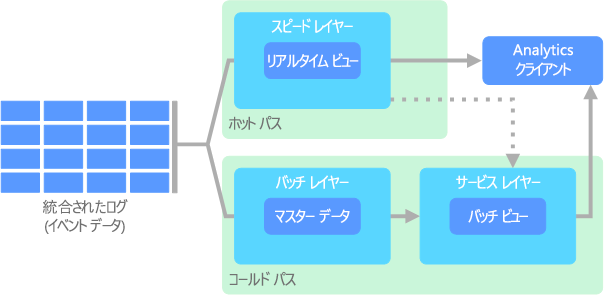
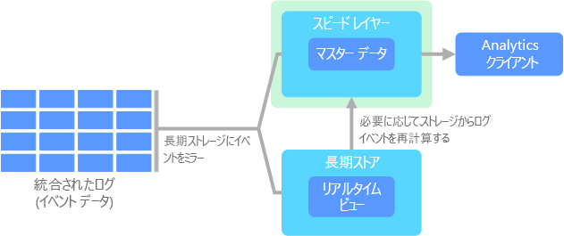
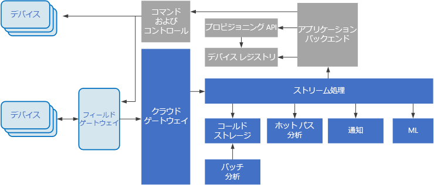

# ビッグ データ アーキテクチャBig data architectures

ビッグ データ アーキテクチャは、従来のデータベース システムには多すぎる、または複雑すぎるデータのインジェスト、処理、分析を扱うために設計されています。A big data architecture is designed to handle the ingestion, processing, and analysis of data that is too large or complex for traditional database systems. 組織がビッグ データ領域に入るしきい値は、ユーザーとそのツールの機能によって変わります。The threshold at which organizations enter into the big data realm differs, depending on the capabilities of the users and their tools. 数百 GB のデータを意味する場合もあれば、数百 TB のデータを意味する場合もあります。For some, it can mean hundreds of gigabytes of data, while for others it means hundreds of terabytes. ビッグ データ セットを使用するためのツールが進歩するにつれて、ビッグ データの意味も進歩します。As tools for working with big data sets advance, so does the meaning of big data. この用語は、厳密にはデータのサイズではなく、高度な分析を介してデータ セットから抽出できる値に関連していますが、このような場合、データはかなり大きくなる傾向にあります。More and more, this term relates to the value you can extract from your data sets through advanced analytics, rather than strictly the size of the data, although in these cases they tend to be quite large.

長年にわたって、データのランドスケープは変化してきました。Over the years, the data landscape has changed. データで実行できること、実行できると期待されることは変化しています。What you can do, or are expected to do, with data has changed. ストレージのコストは大幅に下がりましたが、データを収集する手段は増え続けています。The cost of storage has fallen dramatically, while the means by which data is collected keeps growing. 一部のデータは速いペースで到達しますが、常に収集し、観察する必要があります。Some data arrives at a rapid pace, constantly demanding to be collected and observed. 他のデータはより遅く到達しますが、非常に大きなチャンクであり、多くの場合、何十年もの履歴データの形式です。Other data arrives more slowly, but in very large chunks, often in the form of decades of historical data. 高度な分析の問題や、機械学習が必要な問題に直面する場合があります。You might be facing an advanced analytics problem, or one that requires machine learning. これらは、ビッグ データ アーキテクチャで解決方法を探る課題です。These are challenges that big data architectures seek to solve.

ビッグ データ ソリューションには、通常は、次の種類のワークロードが 1 つ以上関係しています。Big data solutions typically involve one or more of the following types of workload:

* 保存されているビッグ データ ソースのバッチ処理。Batch processing of big data sources at rest.
* 動作中のビッグ データのリアルタイム処理。Real-time processing of big data in motion.
* ビッグ データの対話型探索。Interactive exploration of big data.
* 予測分析と機械学習。Predictive analytics and machine learning.

以下が必要になった場合に、ビッグ データ アーキテクチャを検討してください。Consider big data architectures when you need to:

* 従来のデータベースには多すぎる、大量のデータを保存および処理する。Store and process data in volumes too large for a traditional database.
* 分析とレポートのために非構造化データを変換する。Transform unstructured data for analysis and reporting.
* リアルタイムで、または短い待機時間で、バインドされていないデータ ストリームを取得、処理、分析する。Capture, process, and analyze unbounded streams of data in real time, or with low latency.

## ビッグ データ アーキテクチャのコンポーネントComponents of a big data architecture

次のダイアグラムは、ビッグ データ アーキテクチャに適している論理コンポーネントを示しています。The following diagram shows the logical components that fit into a big data architecture. 個々のソリューションには、このダイアグラムのすべての項目が含まれているわけではありません。Individual solutions may not contain every item in this diagram.

 

大部分のビッグ データ アーキテクチャには、次のコンポーネントの一部またはすべてが含まれています。Most big data architectures include some or all of the following components:

* **データ ソース**。**Data sources**. すべてのビッグ データ ソリューションは、1 つ以上のデータ ソースから始まります。All big data solutions start with one or more data sources. たとえば、次のようになります。Examples include:

    * リレーショナル データベースなど、アプリケーション データ ストア。Application data stores, such as relational databases.
    * Web サーバー ログ ファイルなど、アプリケーションによって生成された静的ファイル。Static files produced by applications, such as web server log files.
    * IoT デバイスなど、リアルタイムのデータ ソース。Real-time data sources, such as IoT devices.

* **データ ストレージ**。**Data storage**. バッチ処理操作のためのデータは、通常は、さまざまな形式の大きなファイルを大量に保持できる分散ファイル ストアに保存されます。Data for batch processing operations is typically stored in a distributed file store that can hold high volumes of large files in various formats. この種のストアは、*Data Lake* とも呼ばれます。This kind of store is often called a *data lake*. このストレージを実装するための選択肢としては、Azure Data Lake Store、または Azure Storage 内の BLOB コンテナーなどがあります。Options for implementing this storage include Azure Data Lake Store or blob containers in Azure Storage.

* **バッチ処理**。**Batch processing**. データ セットは非常に大きいため、多くの場合、ビッグ データ ソリューションでは、実行時間の長いバッチ ジョブの使用によってデータ ファイルを処理し、フィルター処理や集計を行うなどして分析用のデータを準備する必要があります。Because the data sets are so large, often a big data solution must process data files using long-running batch jobs to filter, aggregate, and otherwise prepare the data for analysis. 通常、これらのジョブには、ソース ファイルの読み取り、ソース ファイルの処理、新しいファイルへの出力の書き込みが含まれます。Usually these jobs involve reading source files, processing them, and writing the output to new files. 選択肢には、Azure Data Lake Analytics での U-SQL ジョブの実行、HDInsight Hadoop クラスターでの Hive、Pig、またはカスタム Map/Reduce ジョブの使用、あるいは HDInsight Spark クラスターでの Java、Scala、または Python プログラムの使用などがあります。Options include running U-SQL jobs in Azure Data Lake Analytics, using Hive, Pig, or custom Map/Reduce jobs in an HDInsight Hadoop cluster, or using Java, Scala, or Python programs in an HDInsight Spark cluster.

* **リアルタイム メッセージ インジェスト**。**Real-time message ingestion**. ソリューションにリアルタイム ソースが含まれている場合は、アーキテクチャに、ストリーム処理のためにリアルタイム メッセージを取得して保存する方法が含まれている必要があります。If the solution includes real-time sources, the architecture must include a way to capture and store real-time messages for stream processing. これは、受信メッセージを処理用のフォルダーにドロップするような、単純なデータ ストアにすることもできます。This might be a simple data store, where incoming messages are dropped into a folder for processing. ただし、多くのソリューションには、メッセージのためのバッファーとして機能し、スケールアウト処理、信頼性の高い配信、その他のメッセージ キューのセマンティクスをサポートするメッセージ インジェスト ストアが必要です。However, many solutions need a message ingestion store to act as a buffer for messages, and to support scale-out processing, reliable delivery, and other message queuing semantics. ストリーミング アーキテクチャのこの部分は、ストリーム バッファリングとも呼ばれます。This portion of a streaming architecture is often referred to as stream buffering. オプションとして、Azure Event Hubs、Azure IoT Hub、Kafka などがあります。Options include Azure Event Hubs, Azure IoT Hub, and Kafka.

* **ストリーム処理**。**Stream processing**. このソリューションでは、リアルタイム メッセージを取得した後、分析用にデータをフィルターしたり、集計したり、その他の準備を行ったりして、それらのメッセージを処理する必要があります。After capturing real-time messages, the solution must process them by filtering, aggregating, and otherwise preparing the data for analysis. 処理されたストリーム データは、その後、出力シンクに書き込まれます。The processed stream data is then written to an output sink. Azure Stream Analytics では、バインドされていないストリームを操作する SQL クエリの絶え間ない実行に基づいて、管理されたストリーム処理サービスが提供されます。Azure Stream Analytics provides a managed stream processing service based on perpetually running SQL queries that operate on unbounded streams. HDInsight クラスターで、Storm や Spark Streaming など、オープン ソースの Apache ストリーミング テクノロジを使用することもできます。You can also use open source Apache streaming technologies like Storm and Spark Streaming in an HDInsight cluster.

* **分析データ ストア**。**Analytical data store**. 多くのビッグ データ ソリューションでは、分析用にデータが準備されてから、処理されたデータが提供されます。このデータは分析ツールを使用して照会可能な、構造化された形式になります。Many big data solutions prepare data for analysis and then serve the processed data in a structured format that can be queried using analytical tools. これらのクエリの処理に使用する分析データ ストアは、従来のほとんどのビジネス インテリジェンス (BI) ソリューションに見られるように、Kimball スタイルのリレーショナル データ ウェアハウスにすることができます。The analytical data store used to serve these queries can be a Kimball-style relational data warehouse, as seen in most traditional business intelligence (BI) solutions. 別の方法としては、HBase などの待機時間の短い NoSQL テクノロジや、分散データ ストア内のデータ ファイル上のメタデータ抽象化を提供する対話型 Hive データベースを通じて、データを利用できます。Alternatively, the data could be presented through a low-latency NoSQL technology such as HBase, or an interactive Hive database that provides a metadata abstraction over data files in the distributed data store. Azure SQL Data Warehouse では、クラウドベースの大規模なデータ ウェアハウスのための、管理されたサービスが提供されます。Azure SQL Data Warehouse provides a managed service for large-scale, cloud-based data warehousing. HDInsight では対話型の Hive、HBase、Spark SQL をサポートしており、これらを使用して分析用のデータを処理することもできます。HDInsight supports Interactive Hive, HBase, and Spark SQL, which can also be used to serve data for analysis.

* **分析とレポート**。**Analysis and reporting**. ほとんどのビッグ データ ソリューションの目的は、分析とレポートによってデータに関する実用的な情報を提供することにあります。The goal of most big data solutions is to provide insights into the data through analysis and reporting. ユーザーによるデータ分析を支援するために、Azure Analysis Services での多次元 OLAP キューブまたは表形式データ モデルなどのデータ モデリング レイヤーをアーキテクチャに組み込むことができます。To empower users to analyze the data, the architecture may include a data modeling layer, such as a multidimensional OLAP cube or tabular data model in Azure Analysis Services. Microsoft Power BI または Microsoft Excel 内のモデリング テクノロジおよび視覚化テクノロジを使用して、セルフサービス BI をサポートすることもできます。It might also support self-service BI, using the modeling and visualization technologies in Microsoft Power BI or Microsoft Excel. 分析とレポートは、データ サイエンティストやデータ アナリストによる対話型のデータ探索の形で行うこともできます。Analysis and reporting can also take the form of interactive data exploration by data scientists or data analysts. これらのシナリオでは、多くの Azure サービスで Jupyter などの分析ノートブックがサポートされており、そのユーザーは Python や R に関する既存のスキルを活用できます。大規模なデータ探索の場合は、Microsoft R Server をスタンドアロンでも、Spark と組み合わせても使用できます。For these scenarios, many Azure services support analytical notebooks, such as Jupyter, enabling these users to leverage their existing skills with Python or R. For large-scale data exploration, you can use Microsoft R Server, either standalone or with Spark.

* **オーケストレーション**。**Orchestration**. ほとんどのビッグ データ ソリューションはデータの反復処理操作で構成されており、ワークフロー内でカプセル化されています。この処理操作では、ソース データの変換や複数のソースとシンクとの間でのデータ移動、処理されたデータの分析データ ストアへの読み込み、レポートまたはダッシュボードへのダイレクトな結果のプッシュが行われます。Most big data solutions consist of repeated data processing operations, encapsulated in workflows, that transform source data, move data between multiple sources and sinks, load the processed data into an analytical data store, or push the results straight to a report or dashboard. これらのワークフローを自動化するために、Azure Data Factory や Apache Oozie および Sqoop などのオーケストレーション テクノロジを使用できます。To automate these workflows, you can use an orchestration technology such Azure Data Factory or Apache Oozie and Sqoop.

## ラムダ アーキテクチャLambda architecture

非常に大規模なデータ セットを使用する場合、クライアントに必要な種類のクエリを実行するために時間がかかることがあります。When working with very large data sets, it can take a long time to run the sort of queries that clients need. これらのクエリをリアルタイムで実行することはできません。また多くの場合、データ セット全体で並列に動作する [MapReduce](https://en.wikipedia.org/wiki/MapReduce) などのアルゴリズムが必要です。These queries can't be performed in real time, and often require algorithms such as [MapReduce](https://en.wikipedia.org/wiki/MapReduce) that operate in parallel across the entire data set. 結果は生データとは別に保存され、クエリに使用されます。The results are then stored separately from the raw data and used for querying.

このアプローチの 1 つの欠点は待機時間が生じることです。処理に数時間かかると、クエリが数時間前の結果を返す可能性があります。One drawback to this approach is that it introduces latency &mdash; if processing takes a few hours, a query may return results that are several hours old. 理想的には、リアルタイムでは一部の結果を取得し (精度がある程度低下する可能性があります)、これらの結果をバッチ分析の結果と組み合わせることをお勧めします。Ideally, you would like to get some results in real time (perhaps with some loss of accuracy), and combine these results with the results from the batch analytics.

Nathan Marz によって最初に提案された**ラムダ アーキテクチャ**は、データ フロー用に 2 つのパスを作成することでこの問題に対処しています。The **lambda architecture**, first proposed by Nathan Marz, addresses this problem by creating two paths for data flow. システムに送信されるすべてのデータは、次の 2 つのパスを経由します。All data coming into the system goes through these two paths:

* **バッチ レイヤー** (コールド パス) は、すべての受信データを未加工の形式で保存し、データに対してバッチ処理を実行します。A **batch layer** (cold path) stores all of the incoming data in its raw form and performs batch processing on the data. この処理の結果は、**バッチ ビュー**として保存されます。The result of this processing is stored as a **batch view**.

* **速度レイヤー** (ホット パス) では、リアルタイムでデータを分析します。A **speed layer** (hot path) analyzes data in real time. このレイヤーは、精度と引き換えに待機時間が短くなるように設計されています。This layer is designed for low latency, at the expense of accuracy.

バッチ レイヤーは、効率的なクエリのためにバッチ ビューにインデックスを付ける**サービス レイヤー**にフィードされます。The batch layer feeds into a **serving layer** that indexes the batch view for efficient querying. 速度レイヤーは、最新のデータに基づく増分更新でサービス レイヤーを更新します。The speed layer updates the serving layer with incremental updates based on the most recent data.

ホット パスに流入するデータは、速度レイヤーに課せられる待機時間の要件によって制約されるため、可能な限り短時間で処理できます。Data that flows into the hot path is constrained by latency requirements imposed by the speed layer, so that it can be processed as quickly as possible. 多くの場合、できるだけ早く準備ができているデータが優先されるので、ある程度の精度のトレードオフが必要です。Often, this requires a tradeoff of some level of accuracy in favor of data that is ready as quickly as possible. たとえば、多数の温度センサーがテレメトリ データを送信している IoT シナリオを考えてみましょう。For example, consider an IoT scenario where a large number of temperature sensors are sending telemetry data. 速度レイヤーは、受信データのスライド時間枠を処理するために使用することができます。The speed layer may be used to process a sliding time window of the incoming data. 

一方、コールド パスに流入するデータは、同じ短い待機時間要件の対象ではありません。Data flowing into the cold path, on the other hand, is not subject to the same low latency requirements. そのため、大規模なデータ セット全体で高精度の計算が可能になりますが、非常に時間がかかることがあります。This allows for high accuracy computation across large data sets, which can be very time intensive. 

最終的に、ホット パスとコールド パスは分析クライアント アプリケーションに収束します。Eventually, the hot and cold paths converge at the analytics client application. クライアントで、精度の低い可能性があるデータを適時にリアルタイムで表示する必要がある場合は、ホット パスから結果を取得します。If the client needs to display timely, yet potentially less accurate data in real time, it will acquire its result from the hot path. それ以外の場合は、コールド パスの結果を選択して、適時ではありませんが正確なデータを表示します。Otherwise, it will select results from the cold path to display less timely but more accurate data. 言い換えると、ホット パスは、比較的短い時間枠のデータを持ちます。その後、コールド パスのより正確なデータで結果を更新することができます。In other words, the hot path has data for a relatively small window of time, after which the results can be updated with more accurate data from the cold path.

バッチ レイヤーに格納されている生データは不変です。The raw data stored at the batch layer is immutable. 受信データは常に既存のデータに付加され、前のデータが上書きされることはありません。Incoming data is always appended to the existing data, and the previous data is never overwritten. 特定のデータの値に対する変更は、新しいタイムスタンプのイベント レコードとして保存されます。Any changes to the value of a particular datum are stored as a new timestamped event record. そのため、収集されたデータの履歴全体について、任意の時点で再計算できます。This allows for recomputation at any point in time across the history of the data collected. システムが進化するにつれて新しいビューを作成できるようになるため、元の生データからバッチ ビューを再計算できることが重要です。The ability to recompute the batch view from the original raw data is important, because it allows for new views to be created as the system evolves. 

## カッパ アーキテクチャKappa architecture

ラムダ アーキテクチャの欠点は、その複雑さです。A drawback to the lambda architecture is its complexity. 処理ロジックは、異なるフレームワークを使用して 2 つの異なる場所 (コールド パスとホット パス) に出現します。Processing logic appears in two different places &mdash; the cold and hot paths &mdash; using different frameworks. その結果、計算ロジックが重複し、両方のパスのアーキテクチャ管理が複雑になります。This leads to duplicate computation logic and the complexity of managing the architecture for both paths.

**カッパ アーキテクチャ**は、Jay Kreps によってラムダ アーキテクチャの代替として提案されました。The **kappa architecture** was proposed by Jay Kreps as an alternative to the lambda architecture. ラムダ アーキテクチャと基本的な目標は同じですが、ストリーム処理システムを使用して、すべてのデータが単一のパスを経由する、という重要な違いがあります。It has the same basic goals as the lambda architecture, but with an important distinction: All data flows through a single path, using a stream processing system. 

ラムダ アーキテクチャのバッチレイヤーにはいくつかの類似点があります。イベント データは不変であり、サブセットではなくすべてが収集されます。There are some similarities to the lambda architecture's batch layer, in that the event data is immutable and all of it is collected, instead of a subset. データは、分散したフォールト トレラントな統一ログにイベントのストリームとして取り込まれます。The data is ingested as a stream of events into a distributed and fault tolerant unified log. これらのイベントには順序が付けられ、イベントの現在の状態は、新しいイベントが追加されることでのみ変更されます。These events are ordered, and the current state of an event is changed only by a new event being appended. ラムダ アーキテクチャの速度レイヤーと同様に、すべてのイベント処理は入力ストリームに対して実行され、リアルタイム ビューとして保持されます。Similar to a lambda architecture's speed layer, all event processing is performed on the input stream and persisted as a real-time view. 

データ セット全体 (ラムダでのバッチ レイヤーの機能と同じ) を再計算する必要がある場合、通常は並列処理を使用してストリームを再生し、適時に計算を完了させるだけです。If you need to recompute the entire data set (equivalent to what the batch layer does in lambda), you simply replay the stream, typically using parallelism to complete the computation in a timely fashion.

## モノのインターネット(IoT)Internet of Things (IoT)

実用的な観点から言うと、モノのインターネット (IoT) はインターネットに接続された任意のデバイスを表します。From a practical viewpoint, Internet of Things (IoT) represents any device that is connected to the Internet. たとえば、PC、携帯電話、スマート ウォッチ、スマート サーモスタット、スマート冷蔵庫、接続されている自動車、心臓モニターのインプラント、インターネットに接続してデータを送受信するその他のものが含まれます。This includes your PC, mobile phone, smart watch, smart thermostat, smart refrigerator, connected automobile, heart monitoring implants, and anything else that connects to the Internet and sends or receives data. 接続されているデバイスの数が毎日増えるにつれて、そこから収集されるデータ量も増えます。The number of connected devices grows every day, as does the amount of data collected from them. 多くの場合、このデータは高度に制約された、時には待機時間の長い環境で収集されています。Often this data is being collected in highly constrained, sometimes high-latency environments. 他の場合には、短い待機時間環境から数千または数百万のデバイスによってデータが送信されるので、データを迅速に取り込み、それに応じて処理する能力が求められます。In other cases, data is sent from low-latency environments by thousands or millions of devices, requiring the ability to rapidly ingest the data and process accordingly. そのため、このような制約と固有の要件を処理するには、適切な計画が必要です。Therefore, proper planning is required to handle these constraints and unique requirements.

イベント ドリブン アーキテクチャは、IoT ソリューションにとって重要です。Event-driven architectures are central to IoT solutions. 次の図は、IoT で考えられる論理アーキテクチャを示しています。The following diagram shows a possible logical architecture for IoT. この図では、アーキテクチャのイベント ストリーミング コンポーネントが強調されています。The diagram emphasizes the event-streaming components of the architecture.

**クラウド ゲートウェイ**が、信頼性の高い低待機時間のメッセージング システムを使用して、クラウドの境界でデバイスのイベントを取り込みます。The **cloud gateway** ingests device events at the cloud boundary, using a reliable, low latency messaging system.

デバイスは、クラウド ゲートウェイに直接イベントを送信するか、**フィールド ゲートウェイ**を介して送信します。Devices might send events directly to the cloud gateway, or through a **field gateway**. フィールド ゲートウェイは特殊なデバイスまたはソフトウェアで、通常はデバイスと共に配置され、イベントを受信してクラウド ゲートウェイに転送します。A field gateway is a specialized device or software, usually collocated with the devices, that receives events and forwards them to the cloud gateway. フィールド ゲートウェイは、フィルター処理、集計、またはプロトコルの変換などの関数を実行する、ロウ デバイス イベントの前処理を行うこともあります。The field gateway might also preprocess the raw device events, performing functions such as filtering, aggregation, or protocol transformation.

取り込み後、イベントは 1 つ以上の**ストリーム プロセッサ**を経由します。それらのプロセッサは、データをルーティングしたり (ストレージへのルーティングなど)、分析やその他の処理を実行したりできます。After ingestion, events go through one or more **stream processors** that can route the data (for example, to storage) or perform analytics and other processing.

一般的な処理の種類を次に示します。The following are some common types of processing. (このリストは全てを網羅しているわけではありません。)(This list is certainly not exhaustive.)

- アーカイブまたはバッチ分析のための、コールド ストレージへのイベント データの書き込み。Writing event data to cold storage, for archiving or batch analytics.

- イベント ストリームを (ほぼ) リアルタイムで分析するホット パス分析で異常を検出し、ローリング時間枠でパターンを認識し、ストリームで特定の条件が発生した場合にアラートをトリガーする。Hot path analytics, analyzing the event stream in (near) real time, to detect anomalies, recognize patterns over rolling time windows, or trigger alerts when a specific condition occurs in the stream. 

- 通知やアラームなど、デバイスからの特殊な非テレメトリ メッセージを処理。Handling special types of nontelemetry messages from devices, such as notifications and alarms. 

- 機械学習。Machine learning.

網掛けのグレーのボックスに、IoT システムのコンポーネントが表示されています。これらのコンポーネントはイベント ストリーミングに直接関連はありませんが、ここでは完全を期すために盛り込んでいます。The boxes that are shaded gray show components of an IoT system that are not directly related to event streaming, but are included here for completeness.

- **デバイス レジストリ**はプロビジョニングされたデバイスのデータベースで、デバイス ID と、通常は位置情報などのデバイスのメタデータを含みます。The **device registry** is a database of the provisioned devices, including the device IDs and usually device metadata, such as location.

- **プロビジョニング API** は新しいデバイスをプロビジョニングし登録するための一般的な外部インターフェイスです。The **provisioning API** is a common external interface for provisioning and registering new devices.

- 一部の IoT ソリューションでは、**コマンドやコントロール メッセージ**をデバイスに送信できます。Some IoT solutions allow **command and control messages** to be sent to devices.

関連 Azure サービス:Relevant Azure services:

- [Azure IoT HubAzure IoT Hub](https://azure.microsoft.com/services/iot-hub/)
- [Azure Event HubsAzure Event Hubs](https://azure.microsoft.com/services/event-hubs/)
- [Azure Stream AnalyticsAzure Stream Analytics](https://azure.microsoft.com/services/stream-analytics/)  

Azure 上の IoT の詳細については、[Azure IoT の参照用アーキテクチャ](https://azure.microsoft.com/updates/microsoft-azure-iot-reference-architecture-available/)に関するページを参照してください。Learn more about IoT on Azure by reading the [Azure IoT reference architecture](https://azure.microsoft.com/updates/microsoft-azure-iot-reference-architecture-available/).

