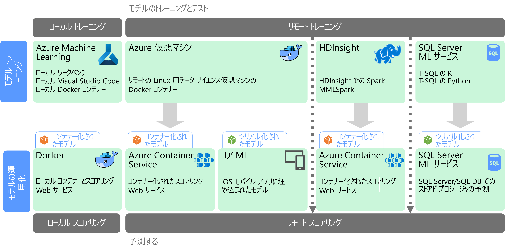

# 大規模な Machine Learning

Machine Learning (ML) は、数学的アルゴリズムに基づく予測モデルのトレーニングに使用される手法です。 Machine Learning では、不明な値を予測するデータ フィールド間のリレーションシップを分析します。

機械学習モデルの作成とデプロイは、次のような反復的プロセスです。

- データ サイエンティストが元データを調査し、*機能*と予測される*ラベル*間のリレーションシップを決定する。
- データ サイエンティストが、適切なアルゴリズムに基づくモデルをトレーニングして検証し、予測に最適なモデルを見つける。
- 最適なモデルが、Web サービスやその他のカプセル化された機能として、運用環境にデプロイされる。
- 新しいデータが収集されると、モデルが定期的に再トレーニングされて有効性を改善する。

大規模な Machine Learning では、2 つの異なるスケーラビリティ上の注意点に対応します。 1 つ目の注意点は、クラスターのスケールアウト機能をトレーニングする必要がある、大規模データ セットに対するモデルをトレーニングすることです。 2 つ目の注意点は、モデルを使用するアプリケーションの要件に合うように、スケーリング可能な方法で学習したモデルを操作化することです。 これは通常、スケールアウト可能な Web サービスとして予測機能をデプロイすることで、対応できます。

多くの場合、データが多いほどより優れたモデルが得られるため、大規模な Machine Learning では、強力な予測機能を生み出せるという利点があります。 モデルがトレーニングされると、ステートレスで高パフォーマンスのスケールアウト Web サービスとしてデプロイできます。

## モデルの準備およびトレーニング

モデルの準備とトレーニングの段階では、データ サイエンティストは Python や R などの言語を使用して対話的にデータを探索し、以下の作業を行います。

- 大量データ ストアからサンプルを抽出する。
- 外れ値、重複値、および欠損値を見つけて処理し、データを整理する。
- 統計分析および視覚化を通して、データの相関関係およびリレーションシップを決定する。
- 統計的リレーションシップの予測性を改善する、新しい集計機能を生成する。
- 予測アルゴリズムに基づいて ML モデルをトレーニングする。
- トレーニング時に留保したデータを使用して、トレーニング済みモデルを検証する。

この対話型の分析およびモデリングの段階をサポートするには、データ プラットフォームで、データ サイエンティストがさまざまなツールを使用してデータを探索できる必要があります。 さらに、複雑な機械学習モデルのトレーニングでは、大量データを集中処理する必要が生じる場合があるので、モデルのトレーニングをスケールアウトするための十分なリソースが不可欠です。

## モデルのデプロイと使用

モデルをデプロイする準備ができたら、Web サービスとしてカプセル化して、クラウド内に、エッジ デバイスに、または企業の ML 実行環境内にデプロイできます。 このデプロイ プロセスは、操作化と呼ばれます。

## 課題

大規模な Machine Learning では、以下のような課題が発生します。

- 通常、モデルのトレーニング、特に深層学習モデルのトレーニングには、大量のデータが必要になります。
- モデルのトレーニングを開始する前に、これらの大規模データ セットを準備する必要があります。
- モデルのトレーニングの段階では、ビッグ データ ストアにアクセスする必要があります。 一般的には、Spark など、データ準備に使用したときと同じビッグ データ クラスターを使用して、モデル トレーニングを実行します。
- 深層学習などのシナリオでは、CPU でのスケールアウトを可能にするクラスターが必要になるだけでなく、GPU が有効化されたノードでクラスターが構成されている必要があります。

## Azure での大規模 Machine Learning

どの ML サービスを使ってトレーニングおよび操作化を行うかを決定する前に、そもそもモデルのトレーニングが必要か、また、事前構築済みのモデルが要件に合うかどうかを検討してください。 多くの場合、事前構築済みモデルの使用とは、単に Web サービスの呼び出しまたは ML ライブラリの使用による既存モデルの読み込みのことです。 次に、いくつかの選択肢を示します。

- Microsoft Cognitive Services が提供する Web サービスを使用する。
- Cognitive Toolkit が提供する事前トレーニング済みのニューラル ネットワーク モデルを使用する。
- iOS アプリ対応の Core ML が提供するシリアル化モデルを埋め込む。

事前構築済みのモデルがお使いのデータやシナリオに適合しない場合、Azure での選択肢には、Azure Machine Learning、Spark MLlib および MMLSpark 搭載の HDInsight、Azure Databricks、Cognitive Toolkit、SQL Machine Learning Services が含まれます。 カスタム モデルを使用することに決めた場合、モデルのトレーニングと操作化を含むパイプラインを設計する必要があります。

Azure の ML で選択可能な技術の一覧については、以下のトピックをご覧ください。

- [認識サービス技術の選択](../technology-choices/cognitive-services.md)
- [機械学習技術の選択](../technology-choices/data-science-and-machine-learning.md)
- [自然言語処理技術の選択](../technology-choices/natural-language-processing.md)

## 次の手順

次の参照アーキテクチャは、Azure での機械学習のシナリオを示します。

- [ディープ ラーニング モデル用の Azure でのバッチ スコアリング](../../reference-architectures/ai/batch-scoring-deep-learning.md)
- [Azure での Python scikit-learn モデルおよびディープ ラーニング モデルのリアルタイム スコアリング](../../reference-architectures/ai/realtime-scoring-python.md)