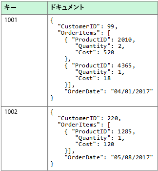
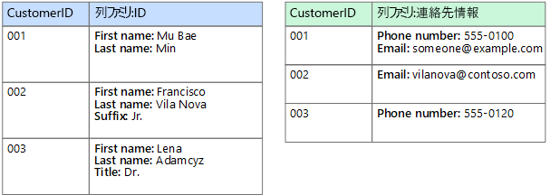
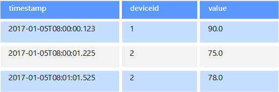
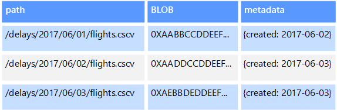
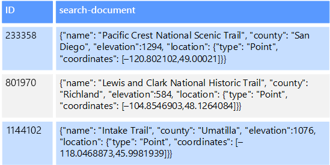

# 非リレーショナル データと NoSQLNon-relational data and NoSQL

*非リレーショナル データベース*とは、従来のほとんどのデータベース システムにある行と列のテーブル スキーマを使用しないデータベースです。A *non-relational database* is a database that does not use the tabular schema of rows and columns found in most traditional database systems. 代わりに、非リレーショナル データベースは、格納されているデータの種類に固有の要件に合わせて最適化されたストレージ モデルを使用します。Instead, non-relational databases use a storage model that is optimized for the specific requirements of the type of data being stored. たとえば、単純なキーと値のペア、JSON ドキュメント、またはエッジと頂点から構成されるグラフとしてデータを格納できます。For example, data may be stored as simple key/value pairs, as JSON documents, or as a graph consisting of edges and vertices.

これらのデータ ストアのすべてに共通する点は、[リレーショナル モデル](../relational-data/index.md)を使用していないことです。What all of these data stores have in common is that they don't use a [relational model](../relational-data/index.md). また、サポートするデータの種類やデータのクエリ方法がより具体的になる傾向があります。Also, they tend to be more specific in the type of data they support and how data can be queried. たとえば、時系列データ ストアは、時間ベースのデータ シーケンスに対するクエリに合わせて最適化されていますが、グラフ データ ストアは、エンティティ間の重み付けされたリレーションシップの探索に合わせて最適化されています。For example, time series data stores are optimized for queries over time-based sequences of data, while graph data stores are optimized for exploring weighted relationships between entities. どちらの形式も、トランザクション データの管理タスクに対しては適切に汎用化されません。Neither format would generalize well to the task of managing transactional data.

*NoSQL* という用語は、クエリに SQL を使用しないデータ ストアを指します。代わりに他のプログラミング言語とコンストラクトを使用してデータのクエリを実行します。The term *NoSQL* refers to data stores that do not use SQL for queries, and instead use other programming languages and constructs to query the data. 実際、NoSQL データベースの多くは SQL 互換のクエリをサポートしていますが、"NoSQL" は "非リレーショナル データベース" を意味します。In practice, "NoSQL" means "non-relational database," even though many of these databases do support SQL-compatible queries. ただし通常、基になるクエリ実行戦略は、同じ SQL クエリを実行する場合でも従来の RDBMS の方法とは大きく異なります。However, the underlying query execution strategy is usually very different from the way a traditional RDBMS would execute the same SQL query.

以下のセクションでは、非リレーショナル データベースまたは NoSQL データベースの主なカテゴリについて説明します。The following sections describe the major categories of non-relational or NoSQL database.

## ドキュメント データ ストアDocument data stores

ドキュメント データ ストアは、*ドキュメント*と呼ばれるエンティティ内の名前付き文字列フィールドとオブジェクト データ値のセットを管理します。A document data store manages a set of named string fields and object data values in an entity referred to as a *document*. 通常、これらのデータ ストアはデータを JSON ドキュメント形式で格納します。These data stores typically store data in the form of JSON documents. 各フィールド値は、スカラー項目 (数値など) または複合要素 (リストや親子コレクションなど) の場合があります。Each field value could be a scalar item, such as a number, or a compound element, such as a list or a parent-child collection. ドキュメントのフィールド内のデータは、XML、YAML、JSON、BSON などのさまざまな方法でエンコードしたり、またはプレーン テキストとして格納することもできます。The data in the fields of a document can be encoded in a variety of ways, including XML, YAML, JSON, BSON, or even stored as plain text. ドキュメント内のフィールドは、ストレージ管理システムに公開されるため、アプリケーションで、これらのフィールドの値を使用して データをクエリおよびフィルターできます。The fields within documents are exposed to the storage management system, enabling an application to query and filter data by using the values in these fields.

一般に、ドキュメントには、エンティティのデータ全体が含まれます。Typically, a document contains the entire data for an entity. エンティティを構成する項目は、アプリケーション固有です。What items constitute an entity are application specific. たとえば、エンティティに、顧客、注文、または両方の組み合わせの詳細を格納できます。For example, an entity could contain the details of a customer, an order, or a combination of both. リレーショナル データベース管理システム (RDBMS) 内の複数のリレーショナル テーブル間に分散されている情報を 1 つのドキュメントに格納できます。A single document might contain information that would be spread across several relational tables in a relational database management system (RDBMS). ドキュメント ストアでは、すべてのドキュメントが同じ構造をしている必要はありません。A document store does not require that all documents have the same structure. この自由形式のアプローチにより、大幅な柔軟性を提供します。This free-form approach provides a great deal of flexibility. たとえば、アプリケーションは、ビジネス要件の変更に応じて、さまざまなデータをドキュメントに格納できます。For example, applications can store different data in documents in response to a change in business requirements.

  

アプリケーションは、ドキュメント キーを使用してドキュメントを取得できます。The application can retrieve documents by using the document key. これはドキュメントの一意の識別子で、多くの場合にハッシュされ、データを均等に分散するのに役立ちます。This is a unique identifier for the document, which is often hashed, to help distribute data evenly. 一部のドキュメント データベースは、ドキュメント キーを自動的に作成します。Some document databases create the document key automatically. 他は、ユーザーがキーとして使用するドキュメントの属性を指定できます。Others enable you to specify an attribute of the document to use as the key. アプリケーションは、1 つまたは複数のフィールドの値に基づいて、ドキュメントをクエリすることもできます。The application can also query documents based on the value of one or more fields. 一部のドキュメント データベースでは、インデックスをサポートし、1 つまたは複数のインデックス付きフィールドに基づいたドキュメントの高速のルックアップを容易にします。Some document databases support indexing to facilitate fast lookup of documents based on one or more indexed fields.

多くのドキュメント データベースで、インプレース更新をサポートしているため、アプリケーションは、ドキュメント全体を書き直すことなく、ドキュメント内の特定のフィールドの値を変更できます。Many document databases support in-place updates, enabling an application to modify the values of specific fields in a document without rewriting the entire document. 1 つのドキュメントの複数のフィールドに対する読み取りおよび書き込み操作は、通常アトミックです。Read and write operations over multiple fields in a single document are usually atomic.

関連 Azure サービス:Relevant Azure service:  

- [Azure Cosmos DBAzure Cosmos DB](https://azure.microsoft.com/services/cosmos-db/)

## 単票形式データ ストアColumnar data stores

単票形式または列ファミリ データ ストアは、列と行にデータを編成します。A columnar or column-family data store organizes data into columns and rows. 列ファミリ データ ストアは、その最も単純な形式では、少なくとも概念的にはリレーショナル データベースによく似ています。In its simplest form, a column-family data store can appear very similar to a relational database, at least conceptually. 列ファミリ データベースの真の能力は、データを格納する列指向のアプローチに由来する、スパース データを構造化する非正規化アプローチにあります。The real power of a column-family database lies in its denormalized approach to structuring sparse data, which stems from the column-oriented approach to storing data.

列ファミリ データ ストアは、行と列を含む表形式データを保持するものと考えることができますが、列は列ファミリと呼ばれるグループに分類されます。You can think of a column-family data store as holding tabular data with rows and columns, but the columns are divided into groups known as column families. 各列ファミリは、論理的に関連し、通常はユニットとして取得または操作される一連の列を保持しています。Each column family holds a set of columns that are logically related and are typically retrieved or manipulated as a unit. 個別にアクセスされるその他のデータは、個別の列ファミリに格納できます。Other data that is accessed separately can be stored in separate column families. 列ファミリ内では、新しい列を動的に追加することができ、行をスパースにする (つまり、行のすべての列に値を持つ必要がない) ことができます。Within a column family, new columns can be added dynamically, and rows can be sparse (that is, a row doesn't need to have a value for every column).

次の図は、`Identity` と `Contact Info` の 2 つの列ファミリのある例を示しています。The following diagram shows an example with two column families, `Identity` and `Contact Info`. 単一のエンティティのデータは、各列ファミリに同じ行キーを持ちます。The data for a single entity has the same row key in each column family. 列ファミリ内にある任意のオブジェクトの行が動的に変化する構造は、列ファミリ アプローチの重要な利点です。列ファミリ データ ストアのこの構造は、さまざまなスキーマを持つデータを格納するために適しています。This structure, where the rows for any given object in a column family can vary dynamically, is an important benefit of the column-family approach, making this form of data store highly suited for storing data with varying schemas.

キー/値のストアまたはドキュメント データベースとは異なり、ほとんどの列ファミリのデータベースは、ハッシュを計算するのではなく、キー順序でデータを物理的に格納します。Unlike a key/value store or a document database, most column-family databases physically store data in key order, rather than by computing a hash. 行キーはプライマリ インデックスと見なされ、行キーによって、特定のキーまたは一連のキーを使用するキーベースのアクセスが可能になります。The row key is considered the primary index and enables key-based access via a specific key or a range of keys. 一部の実装では、列ファミリ内の特定の列に対してセカンダリ インデックスを作成できます。Some implementations allow you to create secondary indexes over specific columns in a column family. セカンダリ インデックスを使用すると、行キーではなく、列値によってデータを取得できます。Secondary indexes let you retrieve data by columns value, rather than row key.

ディスク上では、列ファミリ内のすべての列が同じファイルに格納され、各ファイルには特定の数の行が格納されます。On disk, all of the columns within a column family are stored together in the same file, with a certain number of rows in each file. 大規模なデータ セットにこのアプローチを利用すると、一度に少数の列に対してのみクエリを実行する場合に、ディスクから読み取る必要のあるデータ量を減らすことでパフォーマンス上のメリットがあります。With large data sets, this approach creates a performance benefit by reducing the amount of data that needs to be read from disk when only a few columns are queried together at a time.

一部の実装では、複数の列ファミリにまたがる行全体で原子性を提供するものもありますが、行の読み取りと書き込みの操作は通常、単一の列ファミリ内ではアトミックです。Read and write operations for a row are usually atomic within a single column family, although some implementations provide atomicity across the entire row, spanning multiple column families.

関連 Azure サービス:Relevant Azure service:  

- [HDInsight の HBaseHBase in HDInsight](/azure/hdinsight/hdinsight-hbase-overview)

## キー/値のデータ ストアKey/value data stores

キー/値のストアは、本質的に大規模なハッシュ テーブルです。A key/value store is essentially a large hash table. 各データ値を一意のキーに関連付けると、キー/値のストアがこのキーを使用し、適切なハッシュ関数を使用してデータを格納します。You associate each data value with a unique key, and the key/value store uses this key to store the data by using an appropriate hashing function. ハッシュ関数は、データ ストレージ間でハッシュされたキーを均等に分散するために選択されます。The hashing function is selected to provide an even distribution of hashed keys across the data storage.

ほとんどのキー/値のストアは、簡単なクエリ、挿入、および削除操作のみをサポートしています。Most key/value stores only support simple query, insert, and delete operations. (部分的または完全に) 値を変更するには、アプリケーションで値全体の既存のデータを上書きする必要があります。To modify a value (either partially or completely), an application must overwrite the existing data for the entire value. ほとんどの実装で、1 つの値の読み取りや書き込みは、アトミック操作です。In most implementations, reading or writing a single value is an atomic operation. 値が大きい場合、書き込みにいくらか時間がかかることがあります。If the value is large, writing may take some time.

一部のキー/値のストアでは値の最大サイズに制限を課すものがありますが、アプリケーションは、一連の値として任意のデータを格納できます。An application can store arbitrary data as a set of values, although some key/value stores impose limits on the maximum size of values. 格納された値は、ストレージ システム ソフトウェアに非透過的です。The stored values are opaque to the storage system software. すべてのスキーマ情報が提供され、アプリケーションによって解釈される必要があります。Any schema information must be provided and interpreted by the application. 基本的に、値は BLOB で、キー/値のストアは単純にキーによって、値を取得または格納します。Essentially, values are blobs and the key/value store simply retrieves or stores the value by key.

キー/値のストアは、キーの値を使用して、またはキーの範囲を指定して簡単な検索を実行するアプリケーションに合わせて高度に最適化されていますが、複数のテーブルにまたがるデータの結合など、キー/値の異なるテーブル間でデータをクエリする必要があるシステムには適していません。Key/value stores are highly optimized for applications performing simple lookups using the value of the key, or by a range of keys, but are less suitable for systems that need to query data across different tables of keys/values, such as joining data across multiple tables.

また、キー/値のストアは、キーのみに基づくルックアップを実行するのではなく、キー以外の値によるクエリやフィルター処理が重要なシナリオに合わせて最適化されていません。Key/value stores are also not optimized for scenarios where querying or filtering by non-key values is important, rather than performing lookups based only on keys. たとえば、リレーショナル データベースでは、WHERE 句を使用して非キー列をフィルター処理することでレコードを見つけることができますが、通常、キー/値ストアにはこのようなルックアップ機能がありません。ルックアップを実行した場合、すべての値のスキャンが遅くなります。For example, with a relational database, you can find a record by using a WHERE clause to filter the non-key columns, but key/values stores usually do not have this type of lookup capability for values, or if they do it requires a slow scan of all values.

1 つのキー/値のストアでは、個々のコンピューター上の複数のノード間でデータを簡単に分散できるため、きわめてスケーラブルにすることができます。A single key/value store can be extremely scalable, as the data store can easily distribute data across multiple nodes on separate machines.

関連 Azure サービス:Relevant Azure services:  

- [Azure Cosmos DB Table APIAzure Cosmos DB Table API](/azure/cosmos-db/table-introduction)
- [Azure Redis CacheAzure Redis Cache](https://azure.microsoft.com/services/cache/)  
- [Azure Table StorageAzure Table Storage](https://azure.microsoft.com/services/storage/tables/)

## グラフ データ ストアGraph data stores

グラフ データ ストアは、ノードとエッジの 2 種類の情報を管理します。A graph data store manages two types of information, nodes and edges. ノードはエンティティを表し、エッジはこれらのエンティティ間のリレーションシップを示します。Nodes represent entities, and edges specify the relationships between these entities. ノードもエッジも、そのノードやエッジに関する情報を提供するプロパティを持つことができ、テーブルの列に似ています。Both nodes and edges can have properties that provide information about that node or edge, similar to columns in a table. エッジは、リレーションシップの性質を示す方向を持つこともできます。Edges can also have a direction indicating the nature of the relationship.

グラフ データ ストアの目的は、アプリケーションが、ノードとエッジのネットワークを通過するクエリを効率的に実行して、エンティティ間のリレーションシップを分析できるようにすることです。The purpose of a graph data store is to allow an application to efficiently perform queries that traverse the network of nodes and edges, and to analyze the relationships between entities. 次のダイアグラムにグラフとして構築された組織の職員のデータを示します。The following diagram shows an organization's personnel data structured as a graph. エンティティは従業員や部門で、エッジは社内の直属の上下関係と従業員が勤務する部署を示しています。The entities are employees and departments, and the edges indicate reporting relationships and the department in which employees work. このグラフでは、エッジの矢印は、上下関係の方向を示しています。In this graph, the arrows on the edges show the direction of the relationships.

この構造により、"Sarah に直接または間接的に報告するすべての従業員を見つける" または "John と同じ部門で働いている人" などのクエリの実行が簡単になります。This structure makes it straightforward to perform queries such as "Find all employees who report directly or indirectly to Sarah" or "Who works in the same department as John?" 大量のエンティティとリレーションシップを含む大規模なグラフでは、きわめて複雑な分析をすばやく実行できます。For large graphs with lots of entities and relationships, you can perform very complex analyses very quickly. 多くのグラフ データベースは、リレーションシップのネットワークを効率的に走査するために使用できるクエリ言語を提供しています。Many graph databases provide a query language that you can use to traverse a network of relationships efficiently.

関連 Azure サービス:Relevant Azure service:  

- [Azure Cosmos DB Graph APIAzure Cosmos DB Graph API](/azure/cosmos-db/graph-introduction)  

## 時系列データ ストアTime series data stores

時系列データは時間によって編成された一連の値であり、時系列データ ストアはこの種類のデータに合わせて最適化されています。Time series data is a set of values organized by time, and a time series data store is optimized for this type of data. 時系列データ ストアは、通常多数のソースからリアルタイムで大量のデータを収集するため、きわめて大量の書き込みをサポートする必要があります。Time series data stores must support a very high number of writes, as they typically collect large amounts of data in real time from a large number of sources. 時系列データ ストアは、テレメトリ データの格納に合わせて最適化されています。Time series data stores are optimized for storing telemetry data. シナリオには、IoT センサーやアプリケーション/システム カウンターが含まれます。Scenarios include IoT sensors or application/system counters. 更新はまれであり、削除は多くの場合に一括操作として行われます。Updates are rare, and deletes are often done as bulk operations.

時系列データベースに書き込まれるレコードは通常小さいですが、多くの場合にレコード数が多く、合計データ サイズが急速に増大する可能性があります。Although the records written to a time series database are generally small, there are often a large number of records, and total data size can grow rapidly. また、時系列データ ストアは、順番どおりに到着しないデータ、遅れて到着するデータ、データ ポイントの自動インデックス付け、および時間枠の観点で記述されたクエリに合わせた最適化も処理します。Time series data stores also handle out-of-order and late-arriving data, automatic indexing of data points, and optimizations for queries described in terms of windows of time. この最後の機能を使用すると、時系列データを使用する一般的な方法である時系列の視覚化をサポートするために、何百万ものデータ ポイントと複数のデータ ストリームに対して高速にクエリを実行できます。This last feature enables queries to run across millions of data points and multiple data streams quickly, in order to support time series visualizations, which is a common way that time series data is consumed.

詳細については、「[Time series solutions](../scenarios/time-series.md)」(時系列ソリューション) を参照してください。For more information, see [Time series solutions](../scenarios/time-series.md)

関連 Azure サービス:Relevant Azure services:

- [Azure Time Series InsightsAzure Time Series Insights](https://azure.microsoft.com/services/time-series-insights/)  
- [HDInsight での HBase を使用する OpenTSDBOpenTSDB with HBase on HDInsight](/azure/hdinsight/hdinsight-hbase-overview)

## オブジェクト データ ストアObject data stores

オブジェクト データ ストアは、イメージ、テキスト ファイル、ビデオおよびオーディオ ストリーム、大規模アプリケーション データ オブジェクトとドキュメント、仮想マシン ディスク イメージなど、大規模なバイナリ オブジェクトまたは BLOB の格納と取得検索に合わせて最適化されています。Object data stores are optimized for storing and retrieving large binary objects or blobs such as images, text files, video and audio streams, large application data objects and documents, and virtual machine disk images. オブジェクトは、格納されているデータ、いくつかのメタデータ、およびオブジェクトにアクセスするための一意の ID で構成されます。An object consists of the stored data, some metadata, and a unique ID for accessing the object. オブジェクト ストアは、個々が非常に大きいファイルをサポートするために設計されています。また、すべてのファイルを管理するために合計サイズの大きなストレージも用意されています。Object stores are designed to support files that are individually very large, as well provide large amounts of total storage to manage all files.

一部のオブジェクト データ ストアは、複数のサーバー ノード全体で指定された BLOB をレプリケートすることで、高速な並列読み取りを実現しています。Some object data stores replicate a given blob across multiple server nodes, which enables fast parallel reads. これにより、大きなファイルに含まれるデータのスケールアウト クエリが可能になります。なぜなら、通常は異なるサーバーで実行される複数のプロセスが、それぞれ大きなデータ ファイルに対して同時にクエリを実行できるためです。This in turn enables the scale-out querying of data contained in large files, because multiple processes, typically running on different servers, can each query the large data file simultaneously.

オブジェクト データ ストアの特殊なケースの 1 つとして、ネットワーク ファイル共有があります。One special case of object data stores is the network file share. ファイル共有を使用すると、サーバー メッセージ ブロック (SMB) などの標準的なネットワーク プロトコルを使用してネットワーク経由でファイルにアクセスできます。Using file shares enables files to be accessed across a network using standard networking protocols like server message block (SMB). 適切なセキュリティと同時実行アクセス制御メカニズムがあれば、この方法でデータを共有することで、単純な読み取りおよび書き込み要求などの基本的な低レベルの操作に対して、分散型サービスが高度にスケーラブルなデータ アクセスを提供できるようになります。Given appropriate security and concurrent access control mechanisms, sharing data in this way can enable distributed services to provide highly scalable data access for basic, low level operations such as simple read and write requests.

関連 Azure サービス:Relevant Azure services:

- [Azure Blob StorageAzure Blob Storage](https://azure.microsoft.com/services/storage/blobs/)
- [Azure Data Lake StoreAzure Data Lake Store](https://azure.microsoft.com/services/data-lake-store/)  
- [Azure File StorageAzure File Storage](https://azure.microsoft.com/services/storage/files/)

## 外部インデックス データ ストアExternal index data stores

外部インデックス データ ストアには、他のデータ ストアおよびサービスで保持されている情報を検索する機能があります。External index data stores provide the ability to search for information held in other data stores and services. 外部インデックスは、任意のデータ ストアのセカンダリ インデックスとして機能し、膨大な量のデータにインデックスを付けることができます。また、それらのインデックスにほぼリアルタイムでアクセスできます。An external index acts as a secondary index for any data store, and can be used to index massive volumes of data and provide near real-time access to these indexes.

たとえば、テキスト ファイルをファイル システムに格納することができます。For example, you might have text files stored in a file system. ファイル パスを指定してファイルを見つけるのは簡単ですが、ファイルの内容に基づいて検索するには、すべてのファイルのスキャンが必要になりますが、その処理には時間がかかります。Finding a file by its file path is quick, but searching based on the contents of the file would require a scan of all of the files, which is slow. 外部インデックスを使用すると、セカンダリ検索インデックスを作成し、条件に一致するファイルのパスをすばやく見つけることができます。An external index lets you create secondary search indexes and then quickly find the path to the files that match your criteria. 外部インデックスのもう 1 つの応用例は、キーでのみインデックスを付けるキー/値のストアを使用する場合です。Another example application of an external index is with key/value stores that only index by the key. データの値に基づいてセカンダリ インデックスを作成し、一致する各項目を一意に識別するキーをすばやく検索できます。You can build a secondary index based on the values in the data, and quickly look up the key that uniquely identifies each matched item.

インデックスは、インデックス作成プロセスを実行して作成されます。The indexes are created by running an indexing process. インデックス作成は、データ ストアによってトリガーされるプル モデル、またはアプリケーション コードによって開始されるプッシュ モデルを使用して実行できます。This can be performed using a pull model, triggered by the data store, or using a push model, initiated by application code. インデックスは、多次元にすることができ、大量のテキスト データ間でフリーテキスト検索をサポートできます。Indexes can be multidimensional and may support free-text searches across large volumes of text data.

外部インデックス データ ストアは、フル テキストおよび Web ベースの検索をサポートするためによく使用されます。External index data stores are often used to support full text and web based search. このような場合、完全一致検索またはあいまい検索を使用できます。In these cases, searching can be exact or fuzzy. あいまい検索では、一連の用語に一致するドキュメントを検索し、それらがどの程度一致しているかを計算します。A fuzzy search finds documents that match a set of terms and calculates how closely they match. 一部の外部インデックスは、類義語、ジャンルの拡張 (たとえば、"犬" と "ペット" の一致など)、語幹検索 (たとえば、"run" を検索すると "ran" と "running" も一致するなど) に基づいて一致を返すことができる言語分析もサポートしています。Some external indexes also support linguistic analysis that can return matches based on synonyms, genre expansions (for example, matching "dogs" to "pets"), and stemming (for example, searching for "run" also matches "ran" and "running").

関連 Azure サービス:Relevant Azure service:  

- [Azure SearchAzure Search](https://azure.microsoft.com/services/search/)

## 一般的な要件Typical requirements

多くの場合、非リレーショナル データ ストアは、リレーショナル データベースで使用されるものとは異なるストレージ アーキテクチャを使用します。Non-relational data stores often use a different storage architecture from that used by relational databases. 具体的には、固定スキーマを持たない傾向があります。Specifically, they tend towards having no fixed schema. また、トランザクションをサポートしない傾向や、トランザクションの範囲を制限する傾向があり、スケーラビリティ上の理由からセカンダリ インデックスが含まれないことが一般的です。Also, they tend not to support transactions, or else restrict the scope of transactions, and they generally don't include secondary indexes for scalability reasons.

次の一覧は、各非リレーショナル データ ストアの要件を比較したものです。The following compares the requirements for each of the non-relational data stores:

| 要件Requirement | ドキュメント データDocument data | 列ファミリ データColumn-family data | キー/値データKey/value data | グラフ データGraph data |
| --- | --- | --- | --- | --- |
| 正規化Normalization | 非正規化Denormalized | 非正規化Denormalized | 非正規化Denormalized | 正規化Normalized |
| スキーマSchema | 読み取り時のスキーマSchema on read | 書き込み時に定義される列ファミリ、読み取り時の列スキーマColumn families defined on write, column schema on read | 読み取り時のスキーマSchema on read | 読み取り時のスキーマSchema on read |
| 一貫性 (同時実行トランザクション全体)Consistency (across concurrent transactions) | 調整可能な一貫性、ドキュメントレベルの保証Tunable consistency, document-level guarantees | 列ファミリレベルの保証Column-family&ndash;level guarantees | キーレベルの保証Key-level guarantees | グラフレベルの保証Graph-level guarantees |
| 原子性 (トランザクション スコープ)Atomicity (transaction scope) | コレクションCollection | テーブルTable | テーブルTable | GraphGraph |
| ロック戦略Locking Strategy | オプティミスティック (ロック フリー)Optimistic (lock free) | ペシミスティック (行ロック)Pessimistic (row locks) | オプティミスティック (ETag)Optimistic (ETag) |
| アクセス パターンAccess pattern | ランダム アクセスRandom access | トール/ワイド データの集計Aggregates on tall/wide data | ランダム アクセスRandom access | ランダム アクセスRandom access |
| インデックス作成Indexing | プライマリ インデックスとセカンダリ インデックスPrimary and secondary indexes | プライマリ インデックスとセカンダリ インデックスPrimary and secondary indexes | プライマリ インデックスのみPrimary index only | プライマリ インデックスとセカンダリ インデックスPrimary and secondary indexes |
| データ シェイプData shape | ドキュメントDocument | 列を含む列ファミリの表形式Tabular with column families containing columns | キーと値Key and value | エッジと頂点を含むグラフGraph containing edges and vertices |
| スパースSparse | [はい]Yes | はいYes | はいYes | いいえ No |
| ワイド (列/属性数が多数)Wide (lots of columns/attributes) | [はい]Yes | はいYes | いいえ No | いいえ No |  
| データ サイズDatum size | 小規模 (KB) から中規模 (低 MB)Small (KBs) to medium (low MBs) | 中規模 (MB) から大規模 (低 GB)Medium (MBs) to Large (low GBs) | 小規模 (KB)Small (KBs) | 小規模 (KB)Small (KBs) |
| 全体的な最大スケールOverall Maximum Scale | 非常に大規模 (PB)Very Large (PBs) | 非常に大規模 (PB)Very Large (PBs) | 非常に大規模 (PB)Very Large (PBs) | 大規模 (TB)Large (TBs) |

| 要件Requirement | 時系列データTime series data | オブジェクト データObject data | 外部インデックス データExternal index data |
| --- | --- | --- | --- |
| 正規化Normalization | 正規化Normalized | 非正規化Denormalized | 非正規化Denormalized |
| スキーマSchema | 読み取り時のスキーマSchema on read | 読み取り時のスキーマSchema on read | 書き込み時のスキーマSchema on write |
| 一貫性 (同時実行トランザクション全体)Consistency (across concurrent transactions) | 該当なしN/A | 該当なしN/A | 該当なしN/A |
| 原子性 (トランザクション スコープ)Atomicity (transaction scope) | 該当なしN/A | オブジェクトObject | 該当なしN/A |
| ロック戦略Locking Strategy | 該当なしN/A | ペシミスティック (BLOB ロック)Pessimistic (blob locks) | 該当なしN/A |
| アクセス パターンAccess pattern | ランダム アクセスと集計Random access and aggregation | 順次アクセスSequential access | ランダム アクセスRandom access |
| インデックス作成Indexing | プライマリ インデックスとセカンダリ インデックスPrimary and secondary indexes | プライマリ インデックスのみPrimary index only | 該当なしN/A |
| データ シェイプData shape | 表形式Tabular | BLOB とメタデータBlob and metadata | ドキュメントDocument |
| スパースSparse | いいえ No | 該当なしN/A | いいえ No |
| ワイド (列/属性数が多数)Wide (lots of columns/attributes) |  いいえ No | 可能 Yes | [はい]Yes |  
| データ サイズDatum size | 小規模 (KB)Small (KBs) | 大規模 (KB) から非常に大規模 (TB)Large (GBs) to Very Large (TBs) | 小規模 (KB)Small (KBs) |
| 全体的な最大スケールOverall Maximum Scale | 大規模 (低 TB)Large (low TBs)  | 非常に大規模 (PB)Very Large (PBs) | 大規模 (低 TB)Large (low TBs) |
