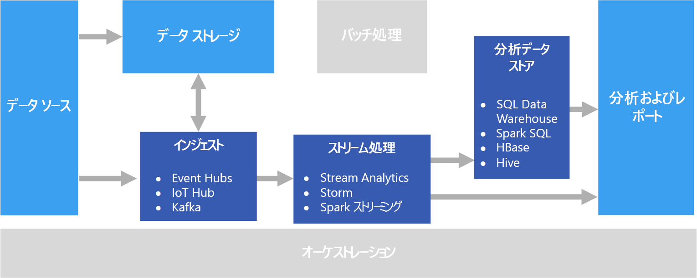

# リアルタイム処理

リアルタイム処理は、リアルタイムでキャプチャされるデータ ストリームを処理します。このデータは最小限の待機時間で処理されて、リアルタイム (または、ほぼリアルタイム) のレポートまたは自動化された応答が生成されます。 たとえば、リアルタイム交通監視ソリューションでは、センサー データを使用して高い交通量を検出する場合があります。 このデータを使用して、渋滞を表示する地図を動的に更新したり、相乗り車線やその他の交通管理システムを自動的に開始したりできます。

リアルタイム処理は、とても短い処理待機時間要件 (ミリ秒または秒単位で測定) がある入力データのアンバウンド ストリームの処理として定義されています。 一般にこの受信データは、JSON などの非構造化または半構造化形式で到着し、[バッチ処理](./batch-processing.md)と同じ処理要件を持ちますが、リアルタイムでの使用をサポートするためにターンアラウンド タイムは短くなります。

多くの場合、処理されたデータは分析と視覚化のために最適化された分析データ ストアに書き込まれます。 処理されたデータは、分析、ビジネス インテリジェンス、リアルタイム ダッシュボード視覚化のために分析およびレポート レイヤーに直接取り込むこともできます。

## 課題

リアルタイム処理ソリューションの大きな課題の 1 つは、メッセージの取り込み、処理、格納を (特に大量のメッセージにおいて) リアルタイムで行うことです。 処理は、取り込みパイプラインをブロックしないように行う必要があります。 データ ストアでは、大量の書き込みをサポートする必要があります。 もう 1 つの課題は、リアルタイムでのアラートの生成やリアルタイム (または、ほぼリアルタイム) のダッシュボードでのデータの表示など、データをすばやく操作できることです。

## アーキテクチャ

リアルタイム処理アーキテクチャには、次の論理コンポーネントがあります。

- **リアルタイム メッセージ取り込み。** アーキテクチャには、ストリーム処理コンシューマーが使用するリアルタイム メッセージをキャプチャして格納する方法が含まれている必要があります。 シンプルなケースでは、このサービスは、新しいメッセージがフォルダーに格納される単純なデータ ストアとして実装できます。 しかし多くの場合、ソリューションには、メッセージのバッファーとして機能する Azure Event Hubs などのメッセージ ブローカーが必要です。 メッセージ ブローカーでは、スケールアウト処理と信頼性の高い配信がサポートされる必要があります。

- **ストリーム処理。** このソリューションでは、リアルタイム メッセージを取得した後、分析用にデータをフィルターしたり、集計したり、その他の準備を行ったりして、それらのメッセージを処理する必要があります。

- **分析データ ストア。** 多くのビッグ データ ソリューションは、分析用にデータを準備した後、処理されたデータを分析ツールを使用してクエリを実行できる構造化された形式で提供するように設計されています。 

- **分析とレポート。** ほとんどのビッグ データ ソリューションの目的は、分析とレポートによってデータに関する実用的な情報を提供することにあります。 

## テクノロジの選択

次のテクノロジは、Azure でのリアルタイム処理に推奨される選択肢です。

### リアルタイム メッセージ取り込み

- **Azure Event Hubs**。 Azure Event Hubs は、1 秒あたり何百万ものイベント メッセージを取り込むメッセージ キュー ソリューションです。 キャプチャしたイベント データは、複数のコンシューマーによって並列に処理できます。
- **Azure IoT Hub**。 Azure IoT Hub は、インターネットに接続されたデバイス間の双方向通信と、何百万もの接続デバイスを同時に処理できるスケーラブルなメッセージ キューを提供します。
- **Apache Kafka**。 Kafka はオープン ソースのメッセージ キューおよびストリーム処理アプリケーションであり、複数のメッセージ プロデューサーからの 1 秒あたり数百万のメッセージを処理し、複数のコンシューマーにルーティングするようにスケーリングできます。 Kafka は Azure で HDInsight クラスターの種類として使用できます。

詳しくは、「[リアルタイム メッセージ取り込み](../technology-choices/real-time-ingestion.md)」をご覧ください。

### データ ストレージ

- **Azure Storage Blob コンテナー**または **Azure Data Lake Store**。 通常、受信リアルタイム データはメッセージ ブローカー (上記参照) でキャプチャされますが、シナリオによっては、新しいファイル用のフォルダーを監視し、作成または更新時にそれらを処理することに意味があります。 さらに、多くのリアルタイム処理ソリューションは、ストリーミング データを静的参照データと結合してファイル ストアに格納できます。 最後に、ファイル ストレージは、アーカイブのため、または[ラムダ アーキテクチャ](../big-data/index.md#lambda-architecture)でさらにバッチ処理するために、キャプチャされたリアルタイム データの出力先として使用できます。

詳しくは、[データ ストレージ](../technology-choices/data-storage.md)に関するページをご覧ください。

### ストリーム処理

- **Azure Stream Analytics**。 Azure Stream Analytics では、データのアンバウンド ストリームに対して永続クエリを実行できます。 これらのクエリでは、ストレージまたはメッセージ ブローカーからのデータ ストリームを使用し、テンポラル ウィンドウに基づいてデータをフィルター処理および集計して、結果をストレージなどのシンク、データベース、または直接 Power BI のレポートに書き込みます。
- **Storm**。 Apache Storm はストリーム処理のためのオープン ソース フレームワークであり、スパウトとボルトのトポロジを使用して、リアルタイム ストリーミング データ ソースからの結果を使用、処理、出力します。 Azure HDInsight クラスターで Storm をプロビジョニングし、Java や C# でトポロジを実装できます。
- **Spark Streaming**。 Apache Spark は、一般的なデータ処理のためのオープン ソースの分散プラットフォームです。 Spark は、Java、Scala、Python などのサポートされている Spark 言語でコードを記述できる Spark Streaming API を提供します。 Spark 2.0 では、よりシンプルで一貫性の高いプログラミング モデルを提供する Spark Structured Streaming API が導入されました。 Spark 2.0 は、Azure HDInsight クラスターで使用できます。

詳しくは、[ストリーム処理](../technology-choices/stream-processing.md)に関するページをご覧ください。

### 分析データ ストア

- **SQL Data Warehouse**、**HBase**、**Spark**、または **Hive**。 処理されたリアルタイム データは、Azure SQL Data Warehouse などのリレーショナル データベースまたは HBase などの NoSQL ストアに格納するか、Spark や Hive のテーブルを定義してクエリを実行できる分散ストレージ内のファイルとして格納できます。

詳しくは、[分析データ ストア](../technology-choices/analytical-data-stores.md)に関するページをご覧ください。

### 分析とレポート

- **Azure Analysis Services**、**Power BI**、**Microsoft Excel**。 分析データ ストアに格納されている処理済みのリアルタイム データは、バッチ処理されたデータと同じ方法で履歴のレポートと分析に使用できます。 さらに、Power BI を使用して、リアルタイム (または、ほぼリアルタイム) のレポートと視覚化を、待機時間が十分に短い分析データ ソースから、また場合によってはストリーム処理の出力から直接発行することができます。

詳しくは、[分析とレポート](../technology-choices/analysis-visualizations-reporting.md)に関するページをご覧ください。

純粋なリアルタイム ソリューションでは、処理オーケストレーションの大部分は、メッセージ取り込みコンポーネントとストリーム処理コンポーネントによって管理されます。 ただし、バッチ処理とリアルタイム処理を結合するラムダ アーキテクチャでは、Azure Data Factory や Apache Oozie および Sqoop などのオーケストレーション フレームワークを使用して、キャプチャされたリアルタイム データのバッチ ワークフローを管理する必要があります。

