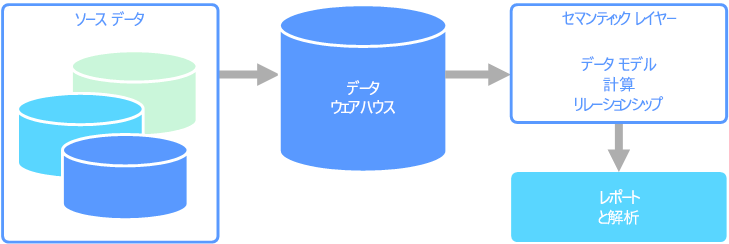

# セマンティック モデリング

セマンティック データ モデルは、含まれているデータ要素の意味を説明する概念モデルです。 組織には、しばしば独自の用語や同義語があり、同じ用語でも意味が異なっている場合もあります。 たとえば、在庫データベースでは、アセット ID とシリアル番号を使用して機器を追跡しますが、販売データベースでは、シリアル番号をアセット ID として参照することがあります。 リレーションシップを記述するモデルなしでは、これらの値を関連付ける簡単な方法はありません。 

セマンティック モデリングは、データベース スキーマに対してある程度の抽象化レベルを提供して、ユーザーが基になるデータ構造を知る必要がないようにします。 これにより、エンド ユーザーは、基になるスキーマに対する集計と結合なしで、データのクエリを実行できるようになります。 また、通常は、データのコンテキストと意味を明確にするために、列にわかりやすい名前が付けられます。

セマンティック モデリングは、書き込み量が多いトランザクション データ処理 (OLTP) とは対照的に、分析とビジネス インテリジェンス (OLAP) などの読み取り量が多いシナリオで主に使用されます。 これは、主に、一般的なセマンティック レイヤーの性質によるものです。

- 集計動作は、レポート作成ツールがそれらを正しく表示されるように設定されます。
- ビジネス ロジックと計算が定義されます。
- 時間指向の計算が含まれます。
- データは多くの場合、複数のソースから統合されます。 

伝統的に、セマンティック レイヤーは、これらの理由でデータ ウェアハウスの上に配置されます。

セマンティック モデルには 2 つの主な種類があります。

* **表形式**。 リレーショナル モデリング構造 (モデル、テーブル、列) を使用します。 内部的には、メタデータは、OLAP モデリング構造 (キューブ、ディメンション、メジャー) から継承されます。 コードとスクリプトは、OLAP メタデータを使用します。
* **多次元**。 従来の OLAP モデリング構造 (キューブ、ディメンション、メジャー) を使用します。

関連 Azure サービス:
- [Azure Analysis Services](https://azure.microsoft.com/services/analysis-services/)

## ユース ケースの例

組織には、大規模データベースに格納されたデータがあります。 組織は、ビジネス ユーザーや顧客がこのデータを利用して独自のレポートの作成や何らかの分析を実行できるようにすることを望んでいます。 1 つの選択肢は、これらのユーザーがデータベースに直接アクセスできるようにすることです。 ただし、これにはいくつかの欠点があり、セキュリティの管理とアクセスの制御の問題が含まれます。 また、テーブルと列の名前を含むデータベースの設計は、ユーザーが理解しにくい可能性があります。 ユーザーは、正しい結果を得るためには、クエリを実行するテーブル、それらのテーブルの結合方法、適用する必要があるビジネス ロジックを知っている必要があります。 さらに、作業を開始するには、SQL のようなクエリ言語も理解している必要があります。 通常、これは、複数のユーザーが同じメトリックを報告するが、結果が異なっていることに至ります。

別のオプションは、ユーザーが必要とするすべての情報を、セマンティック モデルにカプセル化することです。 セマンティック モデルは、ユーザーが任意のレポート作成ツールを使用して簡単にクエリを実行できます。 セマンティック モデルによって提供されるデータはデータ ウェアハウスから引き出され、すべてのユーザーが情報の単一のバージョンを見ていることが保証されます。 セマンティック モデルでは、わかりやすいテーブル名と列名、テーブル間のリレーションシップ、説明、計算、および行レベルのセキュリティも提供されます。

## セマンティック モデリングの一般的な特徴

セマンティック モデリングと分析処理は、次の特徴があります。

| 要件 | 説明 |
| --- | --- |
| 正規化 | 高度に正規化 |
| スキーマ | 書き込み時のスキーマ。厳密に適用|
| トランザクションの使用 | いいえ  |
| ロック戦略 | なし |
| 更新可能 | いいえ (通常はコンピューティング キューブが必要) |
| 追加可能 | いいえ (通常はコンピューティング キューブが必要) |
| ワークロード | 読み取り量が多い。読み取り専用 |
| インデックス作成 | 多次元インデックスの作成 |
| データ サイズ | 小～中のサイズ |
| モデル | 多次元 |
| データの形:| キューブまたはスター/スノーフレーク スキーマ |
| クエリの柔軟性 | 高い柔軟性 |
| スケール: | 大規模 (10 ～ 100 GB) |

## 関連項目

- [データ ウェアハウス](../scenarios/data-warehousing.md)
- [オンライン分析処理 (OLAP)](../scenarios/online-analytical-processing.md)