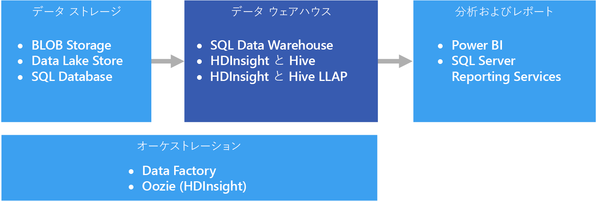

# データ ウェアハウスとデータ マート

データ ウェアハウスは、多数の主題領域またはすべての主題領域の 1 つ以上の異種ソースから統合されたデータの中心的で組織的なリレーショナル リポジトリです。 データ ウェアハウスには現在のデータと履歴データが格納され、さまざまな方法でデータのレポートと分析を行うために使用されます。

データ ウェアハウスにデータを移動するために、重要なビジネス情報が含まれているさまざまなソースから定期的にデータが抽出されます。 データを移動するときに、書式設定、クリーンアップ、検証、集計、および再構成を実行できます。 または、詳細の最下位レベルでデータを格納し、ウェアハウスに用意されている集計ビューを使用してレポートを作成できます。 どちらの場合でも、データ ウェアハウスは、レポート、分析、およびビジネス インテリジェンス (BI) ツールを使用した重要なビジネス上の意思決定の形成を行うために使用されるデータの永続的な記憶域スペースになります。

## データ マートと運用データ ストア

大規模なデータの管理は複雑であり、企業全体のすべてのデータを表す単一のデータ ウェアハウスを持つことは一般的ではなくなりつつあります。 代わりに、組織では、分析で必要なデータを公開する、"*データ マート*" と呼ばれる対象を絞った小規模のデータ ウェアハウスを作成します。 オーケストレーション プロセスによって、運用データ ストアに保持されているデータからデータ マートにデータを入力します。 運用データ ストアは、ソースのトランザクション システムとデータ マートの間の媒介として機能します。 運用データ ストアによって管理されるデータは、ソースのトランザクション システムに存在するデータのクリーンアップ バージョンであり、通常は、データ ウェアハウスまたはデータ マートによって保持されている履歴データのサブセットです。

## このソリューションを使用する状況

運用システムの大量のデータを、理解しやすい最新の適切な形式に変換する必要がある場合は、データ ウェアハウスを選択します。 データ ウェアハウスでは、運用/OLTP データベースで使用している可能性がある簡潔なデータ構造と同じにする必要はありません。 ビジネス ユーザーとアナリストにとって意味のある列名を使用でき、データのリレーションシップを単純化するようにスキーマを再構築でき、複数のテーブルを 1 つに統合できます。 次の手順では、アドホック レポートを作成したり、レポートを作成して BI システムで分析したりする必要があるユーザーが、データベース管理者 (DBA) またはデータ開発者の助けを借りずにそのような作業を実行できるようにします。

パフォーマンス上の理由で履歴データをソースのトランザクション システムから分離して保持する必要がある場合は、データ ウェアハウスの使用を検討してください。 データ ウェアハウスでは、共通の形式、共通のキー、共通のデータ モデル、および共通のアクセス方法を使用する一元的な場所を提供することによって、複数の場所から履歴データに簡単にアクセスできるようにします。

データ ウェアハウスは読み取りアクセス用に最適化されています。その結果、ソースのトランザクション システムよりもレポートが短時間で生成されます。 さらに、データ ウェアハウスには、次の利点があります。

- 複数のソースからのすべての履歴データをデータ ウェアハウスに格納し、1 つの正確な情報源としてアクセスできます。
- データ ウェアハウスにインポートされるときにデータをクリーンアップすることで、正確なデータ、一貫性のあるコード、および説明を提供することで、データの品質を向上させることができます。
- レポート ツールは、クエリの処理サイクルでトランザクションのソース システムと競合することはありません。 トランザクション システムは、データ ウェアハウスによって、書き込みの処理に集中でき、読み取り要求の大半はデータ ウェアハウスが対応します。
- データ ウェアハウスは、さまざまなソフトウェアからのデータを統合するために有用です。
- データ マイニング ツールでウェアハウスに格納されたデータに対して自動手法を使用して、隠れたパターンを検出できます。
- データ ウェアハウスを使用すると、許可されたユーザーにセキュリティで保護されたアクセスを簡単に提供でき、同時に許可されていないユーザーのアクセスを制限できます。 ソース データへのアクセスをビジネス ユーザーに付与する必要はないため、1 つまたは複数の実稼働トランザクション システムに対する潜在的な攻撃ベクトルが取り除かれます。
- データ ウェアハウスは、データの上にビジネス インテリジェンス ソリューションを簡単に作成できるようにします ([OLAP キューブ](online-analytical-processing.md) など)。

## 課題

ビジネス ニーズに合わせたデータ ウェアハウスの適切な構成には、次に示すいくつかの課題が伴う可能性があります。

- ビジネスの概念を正しくモデル化するために必要な時間を取ること。 データ ウェアハウスは情報駆動型であり、概念のマッピングがプロジェクトの残りの部分を推進するため、これは重要な手順です。 これには、ビジネスに関連する用語と一般的な形式 (通貨や日付など) の標準化と、ビジネス ユーザーにとって意味があるが、引き続きデータの集計とリレーションシップの正確さを保証する方法でのスキーマの再構築が含まれます。

- データのオーケストレーションの計画と設定。 考慮事項には、ソースのトランザクション システムからデータ ウェアハウスにデータをコピーする方法と、運用データ ストアからウェアハウスに履歴データを移動する時期が含まれます。

- ウェアハウスにインポートするときにデータをクリーンアップして、データの品質を維持または向上させること。

## Azure におけるデータ ウェアハウス

Azure では、1 つまたは複数のデータ ソースを使用できます。ソースは、顧客のトランザクションの場合も、さまざまな部門で使用される各種のビジネス アプリケーションの場合もあります。 このデータは、従来は 1 つまたは複数の [OLTP](online-transaction-processing.md) データベースに格納されます。 データは、ネットワーク共有、Azure Storage Blobs、Data Lake などの別の記憶域メディアに保存されることがあります。 データは、データ ウェアハウス自体や、Azure SQL Database などのリレーショナル データベース内に格納されることもあります。 分析データ ストア層の目的は、分析およびレポート ツールがデータ ウェアハウスまたはデータ マートに対して発行するクエリに対応することです。 Azure では、Azure SQL Data Warehouse、Hive または対話型クエリを使用する Azure HDInsight を使用して、この分析ストア機能に対応できます。 さらに、データ ストレージからデータ ウェアハウスに定期的にデータを移動またはコピーするレベルのオーケストレーションが必要になりますが、これは Azure HDInsight 上で Azure Data Factory または Oozie を使用して実行できます。

Azure にはデータ ウェアハウスを実装するためのオプションがいくつかあり、必要に応じて選択できます。 以下の一覧は、[対称型マルチプロセッシング](https://en.wikipedia.org/wiki/Symmetric_multiprocessing) (SMP) と[超並列処理](https://en.wikipedia.org/wiki/Massively_parallel) (MPP) という 2 つのカテゴリに分類されています。

SMP:

- [Azure SQL Database](/azure/sql-database/)
- [仮想マシンの SQL Server](/sql/sql-server/sql-server-technical-documentation)

MPP:

- [Azure データ ウェアハウス](/azure/sql-data-warehouse/sql-data-warehouse-overview-what-is)
- [HDInsight 上の Apache Hive](/azure/hdinsight/hadoop/hdinsight-use-hive)
- [HDInsight 上の対話型クエリ (Hive LLAP)](/azure/hdinsight/interactive-query/apache-interactive-query-get-started)

一般的な規則として、SMP ベースのウェアハウスは小規模から中規模のデータ セット (最大 4-100 TB) に最適であり、MPP は大規模なデータによく使用されます。 中小規模のデータとビッグ データの描写では、部分的に組織の定義とサポートするインフラストラクチャを扱う必要があります (「[Choosing an OLTP data store](online-transaction-processing.md#scalability-capabilities)」(OLTP データ ストアの選択) を参照してください)。

データ サイズ以外に、ワークロード パターンの種類がより大きな決定要因になる場合がよくあります。 たとえば、複雑なクエリの場合、SMP ソリューションでは遅すぎて、代わりに MPP ソリューションが必要になる可能性があります。 MPP ベースのシステムでは、ジョブがノード全体で分散および統合される方法によっては、データ サイズが小さくてもパフォーマンスが低下する可能性があります。 データ サイズが既に 1 TB を超えており、継続的に大きくなると予想される場合は、MPP ソリューションの選択を検討してください。 ただし、データ サイズが 1 TB 未満でも、ワークロードが SMP ソリューションに使用可能なリソースを超えている場合は、MPP が最適なオプションになる可能性があります。

データ ウェアハウスにアクセスまたは格納されるデータは、[Azure Data Lake Store](/azure/data-lake-store/) などの Data Lake を含む複数のデータ ソースに由来する可能性があります。 Azure Data Lake を使用できる MPP サービスのさまざまな長所を比較するビデオ セッションについては、「[Azure Data Lake and Azure Data Warehouse: Applying Modern Practices to Your App](https://azure.microsoft.com/resources/videos/build-2016-azure-data-lake-and-azure-data-warehouse-applying-modern-practices-to-your-app/)」 (Azure Data Lake と Azure Data Warehouse: 最新の手法をアプリケーションに適用する) をご覧ください。

SMP システムは、すべてのリソース (CPU/メモリ/ディスク) を共有するリレーショナル データベース管理システムの単一のインスタンスが特徴です。 SMP システムはスケールアップすることができます。 VM 上で実行されている SQL Server の場合、VM サイズをスケールアップすることができます。 Azure SQL Database の場合、別のサービス階層を選択してスケールアップすることができます。

MPP システムは、(固有の CPU、メモリ、I/O サブシステムを持つ) コンピューティング ノードを追加することでスケールアウトできます。 サーバーのスケールアップには物理的な制限があります。制限に達した場合、ワークロードによってはスケールアウトが望ましいことがあります。 ただし、MPP ソリューションでは、クエリ処理、モデリング、データのパーティション分割など、並列処理に固有の要因の違いに応じて、異なるスキルセットが必要です。

使用する SMP ソリューションを決定する場合は、「[Azure SQL Database と Azure VM 上の SQL Server の詳細](/azure/sql-database/sql-database-paas-vs-sql-server-iaas#a-closer-look-at-azure-sql-database-and-sql-server-on-azure-vms)」を参照してください。

Azure SQL Data Warehouse は、ワークロードがコンピューティングおよびメモリ集中型の中小規模のデータセットにも使用できます。 SQL Data Warehouse のパターンと一般的なシナリオについては、以下を参照してください。

- [SQL Data Warehouse のパターンとアンチパターン](https://blogs.msdn.microsoft.com/sqlcat/2017/09/05/azure-sql-data-warehouse-workload-patterns-and-anti-patterns/)

- [SQL Data Warehouse の読み込みパターンと戦略](https://blogs.msdn.microsoft.com/sqlcat/2017/05/17/azure-sql-data-warehouse-loading-patterns-and-strategies/)

- [Azure SQL Data Warehouse へのデータの移行](https://blogs.msdn.microsoft.com/sqlcat/2016/08/18/migrating-data-to-azure-sql-data-warehouse-in-practice/)

- [Azure SQL Data Warehouse を使用した一般的な ISV アプリケーション パターン](https://blogs.msdn.microsoft.com/sqlcat/2017/09/05/common-isv-application-patterns-using-azure-sql-data-warehouse/)

## 主要な選択条件

選択肢を絞り込むために、まず次の質問に答えてください。

- 独自のサーバーを管理するのではなく、マネージド サービスを使用しますか。

- 非常に大規模なデータ セットまたは非常に複雑で実行時間が長いクエリを使用しますか。 "はい" の場合、MPP のオプションを検討してください。

- 大規模なデータ セットの場合、データ ソースは構造化されていますか、それとも構造化されていませんか。 非構造化データの処理には、HDInsight 上の Spark、Azure Databricks、HDInsight 上の Hive LLAP、Azure Data Lake Analytics などのビッグ データ環境が必要になる場合があります。 これらはいずれも、ELT (抽出、読み込み、変換) および ETL (抽出、変換、読み込み) エンジンとして機能します。 処理されたデータは構造化データに出力できるため、SQL Data Warehouse などのオプションへの読み込みが簡単になります。 構造化データの場合、SQL Data Warehouse には、計算に最適化されたパフォーマンス階層があり、非常に高い性能が必要なコンピューティング集中型のワークロードに適しています。

- 履歴データを現在の運用データから分離しますか。 "はい" の場合、[オーケストレーション](../technology-choices/pipeline-orchestration-data-movement.md)が必須のオプションのいずれかを選択します。 大量の読み取りアクセスに合わせて最適化されたスタンドアロン ウェアハウスであり、個別の履歴データ ストアとして最適です。

- OLTP データ ストア以外に、複数のソースのデータを統合する必要はありますか。 "はい" の場合、複数のデータ ソースを簡単に統合できるオプションを検討してください。

- マルチテナントの要件はありますか。 "はい" の場合、SQL Data Warehouse はこの要件には適していません。 詳細については、「[SQL Data Warehouse Patterns and Anti-Patterns](https://blogs.msdn.microsoft.com/sqlcat/2017/09/05/azure-sql-data-warehouse-workload-patterns-and-anti-patterns/)」(SQL Data Warehouse のパターンとアンチパターン) を参照してください。

- リレーショナル データ ストアを使用したいですか。 "はい" の場合、リレーショナル データ ストアを使用するオプションに絞り込みます。また、必要に応じて、PolyBase などのツールを使用して非リレーショナル データ ストアに対してクエリを実行することもできます。 ただし、PolyBase を使用する場合は、ワークロードの非構造化データ セットに対してパフォーマンス テストを実行してください。

- リアルタイム レポートの要件はありますか。 大量のシングルトンの挿入に対するクエリの応答時間を短縮する必要がある場合は、リアルタイム レポートをサポートできるオプションに絞り込みます。

- 多数の同時ユーザーと接続をサポートする必要はありますか。 多数の同時ユーザー/接続をサポートする能力は、いくつかの要因によって変わります。

  - Azure SQL Database については、サービス階層に基づく[リソース制限のドキュメント](/azure/sql-database/sql-database-resource-limits)を参照してください。
  
  - SQL Server は、最大 32,767 ユーザーの接続に対応しています。 VM 上で実行する場合、パフォーマンスは VM のサイズやその他の要因によって変わります。

  - SQL Data Warehouse には、コンカレント クエリとコンカレント接続の制限があります。 詳細については、「[SQL Data Warehouse でのコンカレンシーとワークロード管理](/azure/sql-data-warehouse/sql-data-warehouse-develop-concurrency)」を参照してください。 SQL Data Warehouse の制限を克服するには、[Azure Analysis Services](/azure/analysis-services/analysis-services-overview) などの補完的なサービスを使用することを検討してください。

- どのような種類のワークロードがありますか。 一般に、MPP ベースのウェアハウス ソリューションは、分析のバッチ指向ワークロードに最適です。 ワークロードの性質がトランザクショナルで、小規模な読み取り/書き込み操作が多数ある場合、または行ごとの操作が複数ある場合は、SMP のオプションのいずれかを使用することを検討してください。 このガイドラインの 1 つの例外は、HDInsight クラスター上で Spark Streaming などのストリーム処理を使用し、Hive テーブルにデータを格納する場合です。

## 機能のマトリックス

次の表は、機能の主な相違点をまとめたものです。

### 一般的な機能

<!-- markdownlint-disable MD033 -->

| | Azure SQL Database | SQL Server (VM) | SQL Data Warehouse | HDInsight 上の Apache Hive | HDInsight 上の Hive LLAP |
| --- | --- | --- | --- | --- | --- | -- |
| マネージド サービスか | [はい] | いいえ  | [はい] | はい 1 | はい 1 |
| データのオーケストレーションが必要 (データのコピー/履歴データを保持) | いいえ  | いいえ  | 可能  | はい | [はい] |
| 複数のデータ ソースを簡単に統合 | いいえ  | いいえ  | 可能  | はい | [はい] |
| 計算の一時停止をサポート | いいえ  | いいえ  | [はい] | いいえ 2 | いいえ 2 |
| リレーショナル データ ストア | [はい] | はい |  はい | いいえ  | いいえ  |
| リアルタイムのレポート | [はい] | はい | いいえ  | いいえ  | [はい] |
| 柔軟なバックアップの復元ポイント | [はい] | [はい] | いいえ 3 | はい 4 | はい 4 |
| SMP/MPP | SMP | SMP | MPP | MPP | MPP |

<!-- markdownlint-enable MD033 -->

[1] 手動構成とスケーリング。

[2] HDInsight クラスターは、不要になった場合は削除し、再作成することができます。 クラスターを削除する場合は、外部データ ストアをクラスターに接続して、データが保持されるようにしてください。 Azure Data Factory を使用してクラスターのライフサイクルを自動化するには、オンデマンド HDInsight クラスターを作成してワークロードを処理し、処理が完了したら削除します。

[3] SQL Data Warehouse では、過去 7 日間の任意の復元ポイントにデータベースを復元できます。 スナップショットは 4 ～ 8 時間ごとに開始され、7 日間使用できます。 スナップショットが 7 日間以上経過した場合、期限切れとなり、復元ポイントは使用できなくなります。

[4] 必要に応じて、バックアップおよび復元が可能な[外部 Hive メタストア](/azure/hdinsight/hdinsight-hadoop-provision-linux-clusters#use-hiveoozie-metastore)の使用を検討してください。 BLOB Storage または Data Lake Store に適用される標準的なバックアップと復元のオプションをデータに使用できます。また、より柔軟で使いやすいソリューションが必要な場合は、[Imanis Data](https://azure.microsoft.com/blog/imanis-data-cloud-migration-backup-for-your-big-data-applications-on-azure-hdinsight/) などのサード パーティの HDInsight バックアップおよび復元ソリューションを使用できます。

### スケーラビリティ機能

<!-- markdownlint-disable MD033 -->

| | Azure SQL Database | SQL Server (VM) |  SQL Data Warehouse | HDInsight 上の Apache Hive | HDInsight 上の Hive LLAP |
| --- | --- | --- | --- | --- | --- | -- |
| 高可用性のための冗長リージョン サーバー  | [はい] | はい | はい | いいえ  | いいえ  |
| クエリのスケールアウト (分散クエリ) をサポート  | いいえ  | いいえ  | 可能  | はい | [はい] |
| 動的スケーラビリティ | [はい] | いいえ  | はい 1 | いいえ  | いいえ  |
| データのメモリ内キャッシュをサポート | [はい] |  はい | いいえ  | 可能  | [はい] |

[1] SQL Data Warehouse を使用すると、Data Warehouse ユニット (DWU) の数を調整してスケールアップまたはスケールダウンできます。 「[Azure SQL Data Warehouse のコンピューティング能力の管理](/azure/sql-data-warehouse/sql-data-warehouse-manage-compute-overview)」を参照してください。

<!-- markdownlint-enable MD033 -->

### セキュリティ機能

<!-- markdownlint-disable MD033 -->

|                         |           Azure SQL Database            |  仮想マシンの SQL Server  | SQL Data Warehouse |   HDInsight 上の Apache Hive    |    HDInsight 上の Hive LLAP     |
|-------------------------|-----------------------------------------|-----------------------------------|--------------------|-------------------------------|-------------------------------|
|     認証      | SQL / Azure Active Directory (Azure AD) | SQL / Azure AD / Active Directory |   SQL / Azure AD   | ローカル / Azure AD 1 | ローカル / Azure AD 1 |
|      承認      |                   [はい]                   |                はい                |        はい         |              [はい]              |       はい 1        |
|        監査         |                   [はい]                   |                はい                |        はい         |              [はい]              |       はい 1        |
| 保存データの暗号化 |            はい 2             |         はい 2          |  はい 2  |       はい 2        |       はい 1        |
|   行レベルのセキュリティ    |                   [はい]                   |                はい                |        はい         |              いいえ                |       はい 1        |
|   ファイアウォールをサポート    |                   [はい]                   |                はい                |        はい         |              [はい]              |       はい 3        |
|  動的データ マスク   |                   [はい]                   |                はい                |        はい         |              いいえ                |       はい 1        |

<!-- markdownlint-enable MD033 -->

[1] [ドメイン参加済み HDInsight クラスター](/azure/hdinsight/domain-joined/apache-domain-joined-introduction)を使用する必要があります。

[2] 保存データの暗号化と暗号化の解除には、Transparent Data Encryption (TDE) を使用する必要があります。

[3] [Azure Virtual Network 内で使用する](/azure/hdinsight/hdinsight-extend-hadoop-virtual-network)場合にサポートされます。

データ ウェアハウスのセキュリティ保護の詳細については、以下を参照してください。

- [SQL Database の保護](/azure/sql-database/sql-database-security-overview#connection-security)

- [SQL Data Warehouse でのデータベース保護](/azure/sql-data-warehouse/sql-data-warehouse-overview-manage-security)

- [Azure Virtual Network を使用した Azure HDInsight の拡張](/azure/hdinsight/hdinsight-extend-hadoop-virtual-network)

- [ドメイン参加済み HDInsight クラスターでの Hadoop セキュリティの概要](/azure/hdinsight/domain-joined/apache-domain-joined-introduction)
