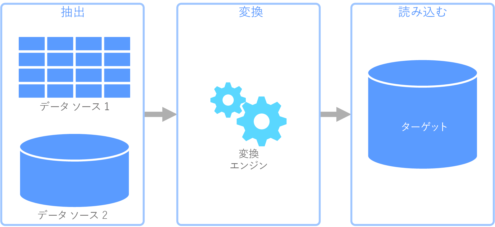
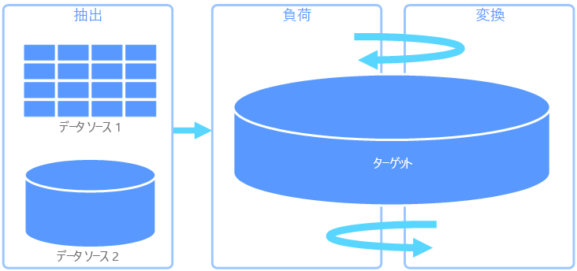
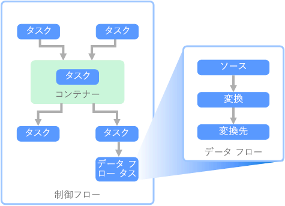

# 抽出、変換、読み込み (ETL)

組織が直面する一般的な問題は、複数のソースから複数の形式でデータを収集し、1 つまたは複数のデータ ストアに移動する方法です。 移動先がソースと同じ種類のデータ ストアではないことがあり、多くの場合、形式が異なったり、最終的な宛先に読み込む前にデータの成形やクリーニングが必要だったりします。

こうした課題に対処するために、長年にわたってさまざまなツール、サービス、プロセスが開発されてきました。 使用するプロセスに関係なく、データ パイプライン内で作業を調整し、一定レベルのデータ変換を適用するという共通のニーズがあります。 以下のセクションでは、これらのタスクを実行するために使用する一般的な手法に注目します。

## 抽出、変換、読み込み (ETL)

抽出、変換、読み込み (ETL) は、さまざまなソースからデータを収集し、ビジネス ルールに従ってデータを変換して、宛先データ ストアに読み込むために使用されるデータ パイプラインです。 ETL の変換作業は特殊なエンジンで行われ、多くの場合、変換されて最終的に宛先に読み込まれるデータの一時的な保持にステージング テーブルを使用します。

通常、実行されるデータ変換には、フィルター処理、並べ替え、集計、データの結合、データのクリーニング、重複除去、データの検証などのさまざまな操作が含まれます。

多くの場合、時間を節約するために 3 つの ETL フェーズが並列に実行されます。 たとえば、データが抽出されている間、変換プロセスは既に受信したデータを操作して読み込みの準備を行うことができ、読み込みプロセスは抽出プロセス全体が完了するまで待たずに準備されたデータの処理を開始できます。

関連 Azure サービス:
- [Azure Data Factory V2](https://azure.microsoft.com/services/data-factory/)

その他のツール:
- [SQL Server Integration Services (SSIS)](/sql/integration-services/sql-server-integration-services)

## 抽出、読み込み、変換 (ELT)

抽出、読み込み、変換 (ELT) は、変換が行われる場所だけが ETL と異なります。 ELT パイプラインでは、変換はターゲット データ ストアで行われます。 独立した変換エンジンを使用する代わりに、ターゲット データ ストアの処理機能がデータ変換に使用されます。 これにより、パイプラインから変換エンジンが除去されるためアーキテクチャがシンプルになります。 このアプローチのもう 1 つの利点は、ターゲット データ ストアをスケーリングすると ELT パイプラインのパフォーマンスもスケーリングされることです。 ただし、ELT が効果的に機能するのは、ターゲット システムが十分に強力でデータを効率的に変換できる場合だけです。

ELT の一般的なユース ケースは、ビッグ データ領域に分類されます。 たとえば、すべてのソース データを Hadoop 分散ファイル システム (HDFS) や Azure Data Lake Store などのスケーラブルなストレージのフラット ファイルに抽出することから開始できます。 Spark、Hive、PolyBase などのテクノロジを使用して、ソース データのクエリを実行できます。 ELT で重要な点は、変換を実行するために使用するデータ ストアと、データが最終的に使用されるデータ ストアが同じであることです。 このデータ ストアは、専用ストレージにデータを読み込むのではなく、スケーラブルなストレージから直接読み取ります。 このアプローチは、大規模なデータ セットでは時間がかかる操作である ETL のデータ コピー ステップをスキップします。

実際には、ターゲット データ ストアは、Hadoop クラスター (Hive または Spark を使用) または SQL Data Warehouse を使用した[データ ウェアハウス](./data-warehousing.md)です。 一般に、スキーマはクエリ時にフラット ファイル データにオーバーレイされ、テーブルとして格納されるので、データ ストア内の他のテーブルと同じようにデータのクエリを実行できます。 これらは、データがデータ ストア自体によって管理されるストレージに存在せず、外部のスケーラブルなストレージに存在するため、外部テーブルと呼ばれます。 

データ ストアでは、データのスキーマのみが管理され、読み取り時にスキーマが適用されます。 たとえば、Hive を使用した Hadoop クラスターでは、データ ソースが実質的に HDFS のファイル セットへのパスである Hive テーブルが記述されます。 SQL Data Warehouse では、PolyBase で同じ結果を得ることができます。つまり、データベース自体に外部的に格納されるデータに対してテーブルが作成されます。 ソース データが読み込まれると、データ ストアの機能を使用して外部テーブル内のデータを処理できます。 このため、ビッグ データのシナリオでは、データ ストアが超並列処理 (MPP) に対応している必要があります。超並列処理では、データが小さなチャンクに分割され、複数のマシン間でチャンクの処理が並列に分散されます。

通常、ELT パイプラインの最後のフェーズでは、サポートする必要があるクエリの種類に対してより効率的な最終形式にソース データを変換します。 たとえば、データがパーティション分割されることがあります。 また ELT では、行指向型データを列形式で格納してインデックス作成を最適化する Parquet などの最適化されたストレージ形式を使用できます。 

関連 Azure サービス:

- [Azure SQL Data Warehouse](/azure/sql-data-warehouse/sql-data-warehouse-overview-what-is)
- [Hive を使用する HDInsight](/azure/hdinsight/hadoop/hdinsight-use-hive)
- [Azure Data Factory V2](https://azure.microsoft.com/services/data-factory/)
- [HDInsight での Oozie](/azure/hdinsight/hdinsight-use-oozie-linux-mac)

その他のツール:

- [SQL Server Integration Services (SSIS)](/sql/integration-services/sql-server-integration-services)

## データ フローと制御フロー

データ パイプラインのコンテキストでは、制御フローは一連のタスクが適切な順序で処理されるようにします。 これらのタスクの適切な処理順序を適用するために、優先順位制約が使用されます。 次のイメージに示すように、これらの制約はワークフロー図のコネクタとして考えることができます。 各タスクには、成功、失敗、完了などの結果があります。 後続タスクは、先行タスクがこれらの結果のいずれかで完了するまで処理を開始しません。

制御フローは、データ フローをタスクとして実行します。 データ フロー タスクでは、データはソースから抽出、変換、またはデータ ストアに読み込まれます。 1 つのデータ フロー タスクの出力を次のデータ フロー タスクへの入力にすることができ、データ フローを並列で実行できます。 制御フローとは異なり、データ フロー内のタスク間に制約を追加することはできません。 ただし、データ ビューアーを追加して、各タスクによって処理されるデータを監視できます。

上の図では、制御フロー内に複数のタスクがあり、その 1 つはデータ フロー タスクです。 タスクの 1 つはコンテナー内で入れ子になっています。 コンテナーを使用してタスクに構造体を提供し、作業ユニットを提供できます。 このような例の 1 つは、フォルダー内のファイルやデータベース ステートメントなど、コレクション内の要素を繰り返す場合です。

関連 Azure サービス:
- [Azure Data Factory V2](https://azure.microsoft.com/services/data-factory/)

その他のツール:
- [SQL Server Integration Services (SSIS)](/sql/integration-services/sql-server-integration-services)

## テクノロジの選択

- [オンライン トランザクション処理 (OLTP) データ ストア](./online-transaction-processing.md#oltp-in-azure)
- [オンライン分析処理 (OLAP) データ ストア](./online-analytical-processing.md#olap-in-azure)
- [データ ウェアハウス](./data-warehousing.md)
- [パイプライン オーケストレーション](../technology-choices/pipeline-orchestration-data-movement.md)
