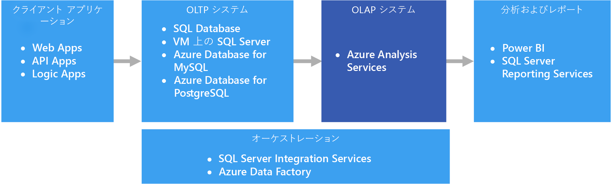
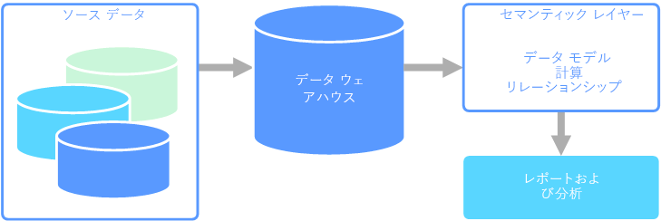

# オンライン分析処理 (OLAP)

オンライン分析処理 (OLAP) は、大規模なビジネス データベースを編成し、複雑な分析をサポートする技術です。 トランザクション システムに悪影響を及ぼさずに複雑な分析クエリを実行するために、OLAP を使用できます。

すべてのトランザクションとレコードの格納に企業が使用しているデータベースは、[オンライン トランザクション処理 (OLTP)](online-transaction-processing.md) データベースと呼ばれます。 これらのデータベースには、通常、一度に 1 つずつ入力されるレコードが含まれています。 多くの場合、組織にとって有益な大量の情報が格納されています。 しかし、OLTP で使用されるデータベースは、分析用に設計されていませんでした。 そのため、これらのデータベースから目的の情報を取得するには、時間と労力において高い負荷がかかります。 OLAP システムは、パフォーマンスの高い方法でデータからこのビジネス インテリジェンス情報を抽出できるように設計されました。 OLAP データベースは、大量の読み取りと少量の書き込みのワークロードに最適化されているからです。

 

## セマンティック モデリング

セマンティック データ モデルは、含まれているデータ要素の意味を説明する概念モデルです。 組織には、しばしば独自の用語や同義語があり、同じ用語でも意味が異なっている場合もあります。 たとえば、在庫データベースでは、アセット ID とシリアル番号を使用して機器を追跡しますが、販売データベースでは、シリアル番号をアセット ID として参照することがあります。 リレーションシップを記述するモデルなしでは、これらの値を関連付ける簡単な方法はありません。 

セマンティック モデリングは、データベース スキーマに対してある程度の抽象化レベルを提供して、ユーザーが基になるデータ構造を知る必要がないようにします。 これにより、エンド ユーザーは、基になるスキーマに対する集計と結合なしで、データのクエリを実行できるようになります。 また、通常は、データのコンテキストと意味を明確にするために、列にわかりやすい名前が付けられます。

セマンティック モデリングは、書き込み量が多いトランザクション データ処理 (OLTP) とは対照的に、分析とビジネス インテリジェンス (OLAP) などの読み取り量が多いシナリオで主に使用されます。 これは、主に、一般的なセマンティック レイヤーの性質によるものです。

- 集計動作は、レポート作成ツールがそれらを正しく表示されるように設定されます。
- ビジネス ロジックと計算が定義されます。
- 時間指向の計算が含まれます。
- データは多くの場合、複数のソースから統合されます。 

伝統的に、セマンティック レイヤーは、これらの理由でデータ ウェアハウスの上に配置されます。

セマンティック モデルには 2 つの主な種類があります。

* **表形式**。 リレーショナル モデリング構造 (モデル、テーブル、列) を使用します。 内部的には、メタデータは、OLAP モデリング構造 (キューブ、ディメンション、メジャー) から継承されます。 コードとスクリプトは、OLAP メタデータを使用します。
* **多次元**。 従来の OLAP モデリング構造 (キューブ、ディメンション、メジャー) を使用します。

関連 Azure サービス:
- [Azure Analysis Services](https://azure.microsoft.com/services/analysis-services/)

## ユース ケースの例

組織には、大規模データベースに格納されたデータがあります。 組織は、ビジネス ユーザーや顧客がこのデータを利用して独自のレポートの作成や何らかの分析を実行できるようにすることを望んでいます。 1 つの選択肢は、これらのユーザーがデータベースに直接アクセスできるようにすることです。 ただし、これにはいくつかの欠点があり、セキュリティの管理とアクセスの制御の問題が含まれます。 また、テーブルと列の名前を含むデータベースの設計は、ユーザーが理解しにくい可能性があります。 ユーザーは、正しい結果を得るためには、クエリを実行するテーブル、それらのテーブルの結合方法、適用する必要があるビジネス ロジックを知っている必要があります。 さらに、作業を開始するには、SQL のようなクエリ言語も理解している必要があります。 通常、これは、複数のユーザーが同じメトリックを報告するが、結果が異なっていることに至ります。

別のオプションは、ユーザーが必要とするすべての情報を、セマンティック モデルにカプセル化することです。 セマンティック モデルは、ユーザーが任意のレポート作成ツールを使用して簡単にクエリを実行できます。 セマンティック モデルによって提供されるデータはデータ ウェアハウスから引き出され、すべてのユーザーが情報の単一のバージョンを見ていることが保証されます。 セマンティック モデルでは、わかりやすいテーブル名と列名、テーブル間のリレーションシップ、説明、計算、および行レベルのセキュリティも提供されます。

## セマンティック モデリングの一般的な特徴

セマンティック モデリングと分析処理は、次の特徴があります。

| 要件 | [説明] |
| --- | --- |
| スキーマ | 書き込み時のスキーマ。厳密に適用|
| トランザクションの使用 | いいえ  |
| ロック戦略 | なし |
| 更新可能 | いいえ (通常はコンピューティング キューブが必要) |
| 追加可能 | いいえ (通常はコンピューティング キューブが必要) |
| ワークロード | 読み取り量が多い。読み取り専用 |
| インデックス作成 | 多次元インデックスの作成 |
| データ サイズ | 小～中のサイズ |
| モデル | 多次元 |
| データの形:| キューブまたはスター/スノーフレーク スキーマ |
| クエリの柔軟性 | 高い柔軟性 |
| スケール: | 大規模 (10 ～ 100 GB) |

## このソリューションを使用する状況

次のシナリオで OLAP を検討してください。

- OLTP システムに悪影響を与えずに、迅速に複雑な分析とアドホック クエリを実行する必要がある 
- データからレポートを生成する簡単な方法を業務ユーザーに提供したいと考えている
- ユーザーが迅速に一貫性のある結果を得られる、多数の集計機能を提供したいと考えている 

大量データに対して集計の計算を適用するには、OLAP は特に便利です。 OLAP システムは、分析やビジネス インテリジェンスなど、読み取り処理が多いシナリオに最適化されています。 OLAP を使用して、ユーザーは (ピボット テーブルなどの) 2 つのディメンションで表示できる、または特定の値によってデータをフィルター処理できるスライスに、多次元データをセグメント化できます。 このプロセスは、データの "スライスとダイス" と呼ばれる場合もあり、複数のデータ ソースにわたってデータがパーティション化されているかに関係なく、実行されます。 これにより、ユーザーは従来からのデータ分析の詳細を把握しなくても、傾向を見つけ、パターンを検出し、データを調査できます。

セマンティック モデルは、業務ユーザーがリレーションシップの複雑性を抽象化して、データの迅速な分析をより簡単に行うことを可能にします。

## 課題

OLAP システムが提供するすべての利点において、いくつかの課題が発生しています。

- OLTP システムのデータは、さまざまな配信元から送信されたトランザクションを通して絶えず更新されるのに対して、OLAP データ ストアは通常、業務ニーズに応じて、それよりもずっと低い頻度で更新されます。 これは、OLAP システムは、変化への迅速な対応よりも、戦略的な業務上の意思決定により適していることを意味します。 また、いずれかのレベルでのデータ クレンジングおよび調整では、OLAP データ ストアを最新の状態に保つように計画する必要があります。
- OLTP システムに見られる従来の正規化されたリレーショナル テーブルとは異なり、OLAP データ モデルは多次元になる傾向があります。 これにより、各属性が 1 つの列にマップされるエンティティ リレーションシップ モデルやオブジェクト指向モデルに直接マッピングすることが、困難または不可能になります。 代わりに、OLAP システムでは通常、従来の正規化に代わってスター スキーマやスノーフレーク スキーマを使用します。

## Azure での OLAP

Azure では、Azure SQL Database などの OLTP システムで保持されているデータは、[Azure Analysis Services](/azure/analysis-services/analysis-services-overview) などの OLAP システムにコピーされます。 [Power BI](https://powerbi.microsoft.com)、Excel、およびサードパーティ製のオプションなどの、データの探索と視覚化のツールは、Analysis Services サーバーに接続され、ユーザーは、モデル化されたデータに対して非常にインタラクティブかつ視覚的に優れた洞察を得ることができます。 OLTP データから OLAP へのデータ フローは通常、[Azure Data Factory](/azure/data-factory/concepts-integration-runtime) を使って実行できる SQL Server Integration Services を使用して調整されます。

Azure では、以下のすべてのデータ ストアが OLAP のコア要件を満たしています。

- [列ストア インデックスを使用する SQL Server](/sql/relational-databases/indexes/get-started-with-columnstore-for-real-time-operational-analytics)
- [Azure Analysis Services](/azure/analysis-services/analysis-services-overview)
- [SQL Server Analysis Services (SSAS)](/sql/analysis-services/analysis-services)

SQL Server Analysis Services (SSAS) は、ビジネス インテリジェンス アプリケーション向けに OLAP およびデータ マイニング機能を提供しています。 ローカル サーバーに SSAS をインストールするか、Azure の仮想マシン内でホストすることができます。 Azure Analysis Services は、SSAS と同じ主要機能を提供する完全管理のサービスです。 Azure Analysis Services では、組織のクラウドおよびオンプレミスにある[多様なデータ ソース](/azure/analysis-services/analysis-services-datasource)への接続がサポートされます。

クラスター化された列ストア インデックスは、SQL Server 2014 以降と Azure SQL Database で使用できます。OLAP ワークロードに最適です。 ただし、SQL Server 2016 (Azure SQL Database を含む) 以降は、更新可能な非クラスター化列ストア インデックスを使用して、ハイブリッド トランザクション/分析処理 (HTAP) を利用できます。 HTAP を使用すると、同じプラットフォーム上で OLTP と OLAP の処理を実行できます。そのため、データの複数のコピーを格納したり、OLTP システムと OLAP システムを別に用意したりする必要がなくなります。 詳細については、「[列ストアを使用したリアルタイム運用分析の概要](/sql/relational-databases/indexes/get-started-with-columnstore-for-real-time-operational-analytics)」を参照してください。

## 主要な選択条件

選択肢を絞り込むために、まず次の質問に答えてください。

- 独自のサーバーを管理するのではなく、マネージド サービスを使用しますか。

- Azure Active Directory (Azure AD) を使用するセキュリティで保護された認証は必要ですか。

- リアルタイム分析を実行したいですか。 "はい" の場合、リアルタイム分析をサポートするオプションに絞り込みます。 

    このコンテキストでの*リアルタイム分析*は、運用ワークロードと分析ワークロードの両方を実行するエンタープライズ リソース プランニング (ERP) アプリケーションなどの単一のデータ ソースに適用されます。 複数のソースのデータを統合する必要がある場合や、キューブなどの事前集計されたデータを使用する高度な分析パフォーマンスが必要な場合は、個別のデータ ウェアハウスが必要になる場合があります。

- ビジネス ユーザーに使いやすい分析にするセマンティック モデルを提供するなど、事前集計されたデータを使用する必要はありますか。 "はい" の場合、多次元キューブまたは表形式セマンティック モデルをサポートするオプションを選択します。 

    集計を提供すると、ユーザーがデータ集計を一貫した方法で計算するために役立ちます。 事前集計されたデータは、多数の行にわたる複数の列を処理する場合にもパフォーマンスが大幅に向上します。 データは、多次元キューブまたは表形式のセマンティック モデルで事前集計できます。

- OLTP データ ストア以外に、複数のソースのデータを統合する必要はありますか。 "はい" の場合、複数のデータ ソースを簡単に統合できるオプションを検討してください。

## 機能のマトリックス

次の表は、機能の主な相違点をまとめたものです。

### 一般的な機能

| | Azure Analysis Services | SQL Server Analysis Services | 列ストア インデックスを使用する SQL Server | 列ストア インデックスを使用する Azure SQL Database |
| --- | --- | --- | --- | --- |
| マネージド サービスか | [はい] | いいえ  | いいえ  | [はい] |
| 多次元キューブをサポート | いいえ  | [はい] | いいえ  | いいえ  |
| 表形式のセマンティック モデルをサポート | [はい] | [はい] | いいえ  | いいえ  |
| 複数のデータ ソースを簡単に統合 | [はい] | [はい] | なし 1 | なし 1 |
| リアルタイムの分析をサポート | いいえ  | いいえ  | 可能  | [はい] |
| ソースからデータをコピーするプロセスが必要 | [はい] | [はい] | いいえ  | いいえ  |
| Azure AD の統合 | [はい] | いいえ  | いいえ 2 | [はい] |

[1] SQL Server と Azure SQL Database を使用して複数の外部データ ソースからクエリを実行して統合することはできませんが、[SSIS](/sql/integration-services/sql-server-integration-services) または [Azure Data Factory](/azure/data-factory/) を使用してこの処理を実行するパイプラインを構築することはできます。 Azure VM でホストされている SQL Server には、リンク サーバーや [PolyBase](/sql/relational-databases/polybase/polybase-guide) など、その他のオプションがあります。 詳細については、[パイプラインのオーケストレーション、制御フロー、およびデータの移動](../technology-choices/pipeline-orchestration-data-movement.md)に関するページを参照してください。

[2] Azure AD アカウントを使用している場合、Azure Virtual Machine 上で実行されている SQL Server への接続はサポートされていません。 代わりにドメインの Active Directory アカウントを使用してください。

### スケーラビリティ機能

|                                                  | Azure Analysis Services | SQL Server Analysis Services | 列ストア インデックスを使用する SQL Server | 列ストア インデックスを使用する Azure SQL Database |
|--------------------------------------------------|-------------------------|------------------------------|-------------------------------------|---------------------------------------------|
| 高可用性のための冗長リージョン サーバー |           [はい]           |              いいえ               |                 可能                  |                     [はい]                     |
|             クエリのスケールアウトをサポート             |           [はい]           |              いいえ               |                 [はい]                 |                     いいえ                       |
|          動的スケーラビリティ (スケールアップ)          |           [はい]           |              いいえ               |                 [はい]                 |                     いいえ                       |

