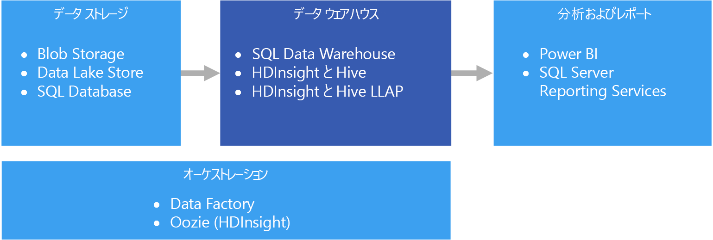

# データ ウェアハウスとデータ マートData warehousing and data marts

データ ウェアハウスは、複数の主題領域またはすべての主題領域の 1 つ以上の異種ソースから統合されたデータの中心的で組織的なリレーショナル リポジトリです。A data warehouse is a central, organizational, relational repository of integrated data from one or more disparate sources, across many or all subject areas. データ ウェアハウスには現在のデータと履歴データが格納され、さまざまな方法でデータのレポートと分析を行うために使用されます。Data warehouses store current and historical data and are used for reporting and analysis of the data in different ways.

データ ウェアハウスにデータを移動するために、重要なビジネス情報が含まれているさまざまなソースから定期的にデータが抽出されます。To move data into a data warehouse, it is extracted on a periodic basis from various sources that contain important business information. データを移動するときに、書式設定、クリーンアップ、検証、集計、および再構成を実行できます。As the data is moved, it can be formatted, cleaned, validated, summarized, and reorganized. または、詳細の最下位レベルでデータを格納し、ウェアハウスに用意されている集計ビューを使用してレポートを作成できます。Alternately, the data can be stored in the lowest level of detail, with aggregated views provided in the warehouse for reporting. どちらの場合でも、データ ウェアハウスは、レポート、分析、およびビジネス インテリジェンス (BI) ツールを使用した重要なビジネス上の意思決定の形成を行うために使用されるデータの永続的な記憶域スペースになります。In either case, the data warehouse becomes a permanent storage space for data used for reporting, analysis, and forming important business decisions using business intelligence (BI) tools.

## データ マートと運用データ ストアData marts and operational data stores

大規模なデータの管理は複雑であり、企業全体のすべてのデータを表す単一のデータ ウェアハウスを持つことは一般的ではなくなりつつあります。Managing data at scale is complex, and it is becoming less common to have a single data warehouse that represents all data across the entire enterprise. 代わりに、組織では、分析で必要なデータを公開する、"*データ マート*" と呼ばれる対象を絞った小規模のデータ ウェアハウスを作成します。Instead, organizations create smaller, more focused data warehouses, called *data marts*, that expose the desired data for analytics purposes. オーケストレーション プロセスによって、運用データ ストアに保持されているデータからデータ マートにデータを入力します。An orchestration process populates the data marts from data maintained in an operational data store. 運用データ ストアは、ソースのトランザクション システムとデータ マートの間の媒介として機能します。The operational data store acts as an intermediary between the source transactional system and the data mart. 運用データ ストアによって管理されるデータは、ソースのトランザクション システムに存在するデータのクリーンアップ バージョンであり、通常は、データ ウェアハウスまたはデータ マートによって保持されている履歴データのサブセットです。Data managed by the operational data store is a cleaned version of the data present in the source transactional system, and is typically a subset of the historical data that is maintained by the data warehouse or data mart. 

## このソリューションを使用する状況When to use this solution

運用システムの大量のデータを、理解しやすい最新の適切な形式に変換する必要がある場合は、データ ウェアハウスを選択します。Choose a data warehouse when you need to turn massive amounts of data from operational systems into a format that is easy to understand, current, and accurate. データ ウェアハウスでは、運用/OLTP データベースで使用している可能性がある簡潔なデータ構造と同じにする必要はありません。Data warehouses do not need to follow the same terse data structure you may be using in your operational/OLTP databases. ビジネス ユーザーとアナリストにとって意味のある列名を使用でき、データのリレーションシップを単純化するようにスキーマを再構築でき、複数のテーブルを 1 つに統合できます。You can use column names that make sense to business users and analysts, restructure the schema to simplify data relationships, and consolidate several tables into one. 次の手順では、アドホック レポートを作成したり、レポートを作成して BI システムで分析したりする必要があるユーザーが、データベース管理者 (DBA) またはデータ開発者の助けを借りずにそのような作業を実行できるようにします。These steps help guide users who need to create ad hoc reports, or create reports and analyze the data in BI systems, without the help of a database administrator (DBA) or data developer.

パフォーマンス上の理由で履歴データをソースのトランザクション システムから分離して保持する必要がある場合は、データ ウェアハウスの使用を検討してください。Consider using a data warehouse when you need to keep historical data separate from the source transaction systems for performance reasons. データ ウェアハウスでは、共通の形式、共通のキー、共通のデータ モデル、および共通のアクセス方法を使用する一元的な場所を提供することによって、複数の場所から履歴データに簡単にアクセスできるようにします。Data warehouses make it easy to access historical data from multiple locations, by providing a centralized location using common formats, common keys, common data models, and common access methods.

データ ウェアハウスは読み取りアクセス用に最適化されています。その結果、ソースのトランザクション システムよりもレポートが短時間で生成されます。Data warehouses are optimized for read access, resulting in faster report generation compared to running reports against the source transaction system. さらに、データ ウェアハウスには、次の利点があります。In addition, data warehouses provide the following benefits:

* 複数のソースからのすべての履歴データをデータ ウェアハウスに格納し、1 つの正確な情報源としてアクセスできます。All historical data from multiple sources can be stored and accessed from a data warehouse as the single source of truth.
* データ ウェアハウスにインポートされるときにデータをクリーンアップすることで、正確なデータ、一貫性のあるコード、および説明を提供することで、データの品質を向上させることができます。You can improve data quality by cleaning up data as it is imported into the data warehouse, providing more accurate data as well as providing consistent codes and descriptions.
* レポート ツールは、クエリの処理サイクルでトランザクションのソース システムと競合することはありません。Reporting tools do not compete with the transactional source systems for query processing cycles. トランザクション システムは、データ ウェアハウスによって、書き込みの処理に集中でき、読み取り要求の大半はデータ ウェアハウスが対応します。A data warehouse allows the transactional system to focus predominantly on handling writes, while the data warehouse satisfies the majority of read requests.
* データ ウェアハウスは、さまざまなソフトウェアからのデータを統合するために有用です。A data warehouse can help consolidate data from different software.
* データ マイニング ツールでウェアハウスに格納されたデータに対して自動手法を使用して、隠れたパターンを検出できます。Data mining tools can help you find hidden patterns using automatic methodologies against data stored in your warehouse.
* データ ウェアハウスを使用すると、許可されたユーザーにセキュリティで保護されたアクセスを簡単に提供でき、同時に許可されていないユーザーのアクセスを制限できます。Data warehouses make it easier to provide secure access to authorized users, while restricting access to others. ソース データへのアクセスをビジネス ユーザーに付与する必要はないため、1 つまたは複数の実稼働トランザクション システムに対する潜在的な攻撃ベクトルが取り除かれます。There is no need to grant business users access to the source data, thereby removing a potential attack vector against one or more production transaction systems.
* データ ウェアハウスは、データの上にビジネス インテリジェンス ソリューションを簡単に作成できるようにします ([OLAP キューブ](online-analytical-processing.md) など)。Data warehouses make it easier to create business intelligence solutions on top of the data, such as [OLAP cubes](online-analytical-processing.md).

## 課題Challenges

ビジネス ニーズに合わせたデータ ウェアハウスの適切な構成には、次に示すいくつかの課題が伴う可能性があります。Properly configuring a data warehouse to fit the needs of your business can bring some of the following challenges:

* ビジネスの概念を正しくモデル化するために必要な時間を取ること。Committing the time required to properly model your business concepts. データ ウェアハウスは情報駆動型であり、概念のマッピングがプロジェクトの残りの部分を推進するため、これは重要な手順です。This is an important step, as data warehouses are information driven, where concept mapping drives the rest of the project. これには、ビジネスに関連する用語と一般的な形式 (通貨や日付など) の標準化と、ビジネス ユーザーにとって意味があるが、引き続きデータの集計とリレーションシップの正確さを保証する方法でのスキーマの再構築が含まれます。This involves standardizing business-related terms and common formats (such as currency and dates), and restructuring the schema in a way that makes sense to business users but still ensures accuracy of data aggregates and relationships.
* データのオーケストレーションの計画と設定。Planning and setting up your data orchestration. 考慮事項には、ソースのトランザクション システムからデータ ウェアハウスにデータをコピーする方法と、運用データ ストアからウェアハウスに履歴データを移動する時期が含まれます。Consideration include how to copy data from the source transactional system to the data warehouse, and when to move historical data out of your operational data stores and into the warehouse.
* ウェアハウスにインポートするときにデータをクリーンアップして、データの品質を維持または向上させること。Maintaining or improving data quality by cleaning the data as it is imported into the warehouse.

## Azure におけるデータ ウェアハウスData warehousing in Azure

Azure では、1 つまたは複数のデータ ソースを使用できます。ソースは、顧客のトランザクションの場合も、さまざまな部門で使用される各種のビジネス アプリケーションの場合もあります。In Azure, you may have one or more sources of data, whether from customer transactions, or from various business applications used by various departments. このデータは、従来は 1 つまたは複数の [OLTP](online-transaction-processing.md) データベースに格納されます。This data is traditionally stored in one or more [OLTP](online-transaction-processing.md) databases. データは、ネットワーク共有、Azure Storage Blobs、Data Lake などの別の記憶域メディアに保存されることがあります。The data could be persisted in other storage mediums such as network shares, Azure Storage Blobs, or a data lake. データは、データ ウェアハウス自体や、Azure SQL Database などのリレーショナル データベース内に格納されることもあります。The data could also be stored by the data warehouse itself or in a relational database such as Azure SQL Database. 分析データ ストア層の目的は、分析およびレポート ツールがデータ ウェアハウスまたはデータ マートに対して発行するクエリに対応することです。The purpose of the analytical data store layer is to satisfy queries issued by analytics and reporting tools against the data warehouse or data mart. Azure では、Azure SQL Data Warehouse、Hive または対話型クエリを使用する Azure HDInsight を使用して、この分析ストア機能に対応できます。In Azure, this analytical store capability can be met with Azure SQL Data Warehouse, or with Azure HDInsight using Hive or Interactive Query. さらに、データ ストレージからデータ ウェアハウスに定期的にデータを移動またはコピーするレベルのオーケストレーションが必要になりますが、これは Azure HDInsight 上で Azure Data Factory または Oozie を使用して実行できます。In addition, you will need some level of orchestration to periodically move or copy data from data storage to the data warehouse, which can be done using Azure Data Factory or Oozie on Azure HDInsight.

関連サービス:Related services:

* [Azure SQL DatabaseAzure SQL Database](/azure/sql-database/)
* [VM 内の SQL Server SQL Server in a VM](/sql/sql-server/sql-server-technical-documentation)
* [Azure Data WarehouseAzure Data Warehouse](/azure/sql-data-warehouse/sql-data-warehouse-overview-what-is)
* [HDInsight 上の Apache HiveApache Hive on HDInsight](/azure/hdinsight/hadoop/hdinsight-use-hive)
* [HDInsight 上の対話型クエリ (Hive LLAP)Interactive Query (Hive LLAP) on HDInsight](/azure/hdinsight/interactive-query/apache-interactive-query-get-started)

## テクノロジの選択Technology choices

- [データ ウェアハウスData warehouses](../technology-choices/data-warehouses.md)
- [パイプライン オーケストレーションPipeline orchestration](../technology-choices/pipeline-orchestration-data-movement.md)

