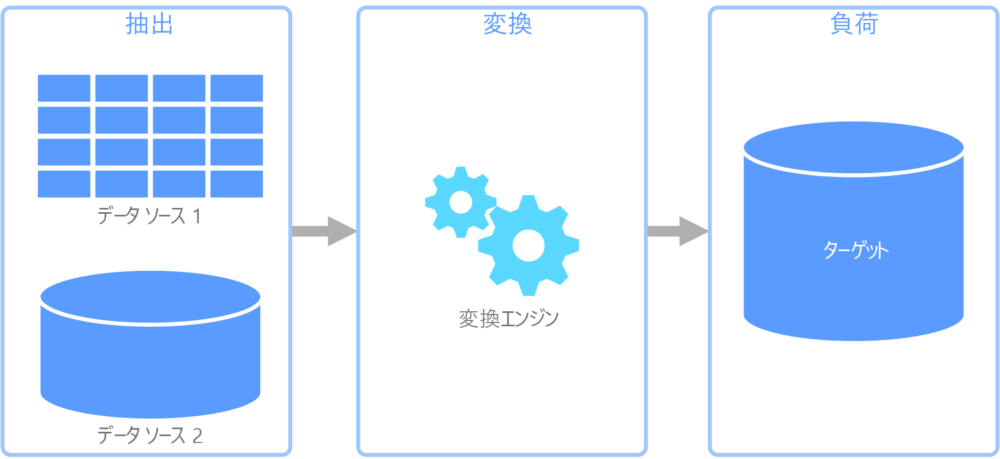
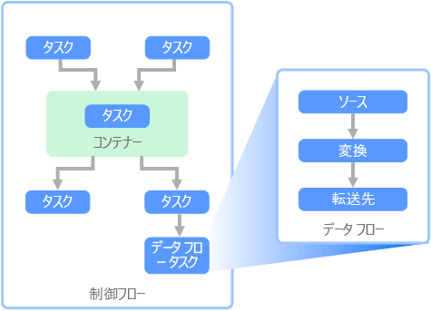

# 抽出、変換、読み込み (ETL)Extract, transform, and load (ETL)

組織が直面する一般的な問題は、複数のソースから複数の形式でデータを収集し、1 つまたは複数のデータ ストアに移動する方法です。A common problem that organizations face is how to gathering data from multiple sources, in multiple formats, and move it to one or more data stores. 移動先がソースと同じ種類のデータ ストアではないことがあり、多くの場合、形式が異なったり、最終的な宛先に読み込む前にデータの成形やクリーニングが必要だったりします。The destination may not be the same type of data store as the source, and often the format is different, or the data needs to be shaped or cleaned before loading it into its final destination.

こうした課題に対処するために、長年にわたってさまざまなツール、サービス、プロセスが開発されてきました。Various tools, services, and processes have been developed over the years to help address these challenges. 使用するプロセスに関係なく、データ パイプライン内で作業を調整し、一定レベルのデータ変換を適用するという共通のニーズがあります。No matter the process used, there is a common need to coordinate the work and apply some level of data transformation within the data pipeline. 以下のセクションでは、これらのタスクを実行するために使用する一般的な手法に注目します。The following sections highlight the common methods used to perform these tasks.

## 抽出、変換、読み込み (ETL)Extract, transform, and load (ETL)

抽出、変換、読み込み (ETL) は、さまざまなソースからデータを収集し、ビジネス ルールに従ってデータを変換して、宛先データ ストアに読み込むために使用されるデータ パイプラインです。Extract, transform, and load (ETL) is a data pipeline used to collect data from various sources, transform the data according to business rules, and load it into a destination data store. ETL の変換作業は特殊なエンジンで行われ、多くの場合、変換されて最終的に宛先に読み込まれるデータの一時的な保持にステージング テーブルを使用します。The transformation work in ETL takes place in a specialized engine, and often involves using staging tables to temporarily hold data as it is being transformed and ultimately loaded to its destination.

通常、実行されるデータ変換には、フィルター処理、並べ替え、集計、データの結合、データのクリーニング、重複除去、データの検証などのさまざまな操作が含まれます。The data transformation that takes place usually involves various operations, such as filtering, sorting, aggregating, joining data, cleaning data, deduplicating, and validating data.

多くの場合、時間を節約するために 3 つの ETL フェーズが並列に実行されます。Often, the three ETL phases are run in parallel to save time. たとえば、データが抽出されている間、変換プロセスは既に受信したデータを操作して読み込みの準備を行うことができ、読み込みプロセスは抽出プロセス全体が完了するまで待たずに準備されたデータの処理を開始できます。For example, while data is being extracted, a transformation process could be working on data already received and prepare it for loading, and a loading process can begin working on the prepared data, rather than waiting for the entire extraction process to complete.

関連 Azure サービス:Relevant Azure service:
- [Azure Data Factory V2Azure Data Factory v2](https://azure.microsoft.com/services/data-factory/)

その他のツール:Other tools:
- [SQL Server Integration Services (SSIS)SQL Server Integration Services (SSIS)](/sql/integration-services/sql-server-integration-services)

## 抽出、読み込み、変換 (ELT)Extract, load, and transform (ELT)

抽出、読み込み、変換 (ELT) は、変換が行われる場所だけが ETL と異なります。Extract, load, and transform (ELT) differs from ETL solely in where the transformation takes place. ELT パイプラインでは、変換はターゲット データ ストアで行われます。In the ELT pipeline, the transformation occurs in the target data store. 独立した変換エンジンを使用する代わりに、ターゲット データ ストアの処理機能がデータ変換に使用されます。Instead of using a separate transformation engine, the processing capabilities of the target data store are used to transform data. これにより、パイプラインから変換エンジンが除去されるためアーキテクチャがシンプルになります。This simplifies the architecture by removing the transformation engine from the pipeline. このアプローチのもう 1 つの利点は、ターゲット データ ストアをスケーリングすると ELT パイプラインのパフォーマンスもスケーリングされることです。Another benefit to this approach is that scaling the target data store also scales the ELT pipeline performance. ただし、ELT が効果的に機能するのは、ターゲット システムが十分に強力でデータを効率的に変換できる場合だけです。However, ELT only works well when the target system is powerful enough to transform the data efficiently.

ELT の一般的なユース ケースは、ビッグ データ領域に分類されます。Typical use cases for ELT fall within the big data realm. たとえば、すべてのソース データを Hadoop 分散ファイル システム (HDFS) や Azure Data Lake Store などのスケーラブルなストレージのフラット ファイルに抽出することから開始できます。For example, you might start by extracting all of the source data to flat files in scalable storage such as Hadoop distributed file system (HDFS) or Azure Data Lake Store. Spark、Hive、PolyBase などのテクノロジを使用して、ソース データのクエリを実行できます。Technologies such as Spark, Hive, or PolyBase can then be used to query the source data. ELT で重要な点は、変換を実行するために使用するデータ ストアと、データが最終的に使用されるデータ ストアが同じであることです。The key point with ELT is that the data store used to perform the transformation is the same data store where the data is ultimately consumed. このデータ ストアは、専用ストレージにデータを読み込むのではなく、スケーラブルなストレージから直接読み取ります。This data store reads directly from the scalable storage, instead of loading the data into its own proprietary storage. このアプローチは、大規模なデータ セットでは時間がかかる操作である ETL のデータ コピー ステップをスキップします。This approach skips the data copy step present in ETL, which can be a time consuming operation for large data sets.

実際には、ターゲット データ ストアは、Hadoop クラスター (Hive または Spark を使用) または SQL Data Warehouse を使用した[データ ウェアハウス](./data-warehousing.md)です。In practice, the target data store is a [data warehouse](./data-warehousing.md) using either a Hadoop cluster (using Hive or Spark) or a SQL Data Warehouse. 一般に、スキーマはクエリ時にフラット ファイル データにオーバーレイされ、テーブルとして格納されるので、データ ストア内の他のテーブルと同じようにデータのクエリを実行できます。In general, a schema is overlaid on the flat file data at query time and stored as a table, enabling the data to be queried like any other table in the data store. これらは、データがデータ ストア自体によって管理されるストレージに存在せず、外部のスケーラブルなストレージに存在するため、外部テーブルと呼ばれます。These are referred to as external tables because the data does not reside in storage managed by the data store itself, but on some external scalable storage. 

データ ストアでは、データのスキーマのみが管理され、読み取り時にスキーマが適用されます。The data store only manages the schema of the data and applies the schema on read. たとえば、Hive を使用した Hadoop クラスターでは、データ ソースが実質的に HDFS のファイル セットへのパスである Hive テーブルが記述されます。For example, a Hadoop cluster using Hive would describe a Hive table where the data source is effectively a path to a set of files in HDFS. SQL Data Warehouse では、PolyBase で同じ結果を得ることができます。つまり、データベース自体に外部的に格納されるデータに対してテーブルが作成されます。In SQL Data Warehouse, PolyBase can achieve the same result &mdash; creating a table against data stored externally to the database itself. ソース データが読み込まれると、データ ストアの機能を使用して外部テーブル内のデータを処理できます。Once the source data is loaded, the data present in the external tables can be processed using the capabilities of the data store. このため、ビッグ データのシナリオでは、データ ストアが超並列処理 (MPP) に対応している必要があります。超並列処理では、データが小さなチャンクに分割され、複数のマシン間でチャンクの処理が並列に分散されます。In big data scenarios, this means the data store must be capable of massively parallel processing (MPP), which breaks the data into smaller chunks and distributes processing of the chunks across multiple machines in parallel.

通常、ELT パイプラインの最後のフェーズでは、サポートする必要があるクエリの種類に対してより効率的な最終形式にソース データを変換します。The final phase of the ELT pipeline is typically to transform the source data into a final format that is more efficient for the types of queries that need to be supported. たとえば、データがパーティション分割されることがあります。For example, the data may be partitioned. また ELT では、行指向型データを列形式で格納してインデックス作成を最適化する Parquet などの最適化されたストレージ形式を使用できます。Also, ELT might use optimized storage formats like Parquet, which stores row-oriented data in a columnar fashion and providess optimized indexing. 

関連 Azure サービス:Relevant Azure service:

- [Azure SQL Data WarehouseAzure SQL Data Warehouse](/azure/sql-data-warehouse/sql-data-warehouse-overview-what-is)
- [HDInsight と HiveHDInsight with Hive](/azure/hdinsight/hadoop/hdinsight-use-hive)
- [Azure Data Factory V2Azure Data Factory v2](https://azure.microsoft.com/services/data-factory/)
- [HDInsight での OozieOozie on HDInsight](/azure/hdinsight/hdinsight-use-oozie-linux-mac)

その他のツール:Other tools:

- [SQL Server Integration Services (SSIS)SQL Server Integration Services (SSIS)](/sql/integration-services/sql-server-integration-services)

## データ フローと制御フローData flow and control flow

データ パイプラインのコンテキストでは、制御フローは一連のタスクが適切な順序で処理されるようにします。In the context of data pipelines, the control flow ensures orderly processing of a set of tasks. これらのタスクの適切な処理順序を適用するために、優先順位制約が使用されます。To enforce the correct processing order of these tasks, precedence constraints are used. 次のイメージに示すように、これらの制約はワークフロー図のコネクタとして考えることができます。You can think of these constraints as connectors in a workflow diagram, as shown in the image below. 各タスクには、成功、失敗、完了などの結果があります。Each task has an outcome, such as success, failure, or completion. 後続タスクは、先行タスクがこれらの結果のいずれかで完了するまで処理を開始しません。Any subsequent task does not initiate processing until its predecessor has completed with one of these outcomes.

制御フローは、データ フローをタスクとして実行します。Control flows execute data flows as a task. データ フロー タスクでは、データはソースから抽出、変換、またはデータ ストアに読み込まれます。In a data flow task, data is extracted from a source, transformed, or loaded into a data store. 1 つのデータ フロー タスクの出力を次のデータ フロー タスクへの入力にすることができ、データ フローを並列で実行できます。The output of one data flow task can be the input to the next data flow task, and data flowss can run in parallel. 制御フローとは異なり、データ フロー内のタスク間に制約を追加することはできません。Unlike control flows, you cannot add constraints between tasks in a data flow. ただし、データ ビューアーを追加して、各タスクによって処理されるデータを監視できます。You can, however, add a data viewer to observe the data as it is processed by each task.

上の図では、制御フロー内に複数のタスクがあり、その 1 つはデータ フロー タスクです。In the diagram above, there are several tasks within the control flow, one of which is a data flow task. タスクの 1 つはコンテナー内で入れ子になっています。One of the tasks is nested within a container. コンテナーを使用してタスクに構造体を提供し、作業ユニットを提供できます。Containers can be used to provide structure to tasks, providing a unit of work. このような例の 1 つは、フォルダー内のファイルやデータベース ステートメントなど、コレクション内の要素を繰り返す場合です。One such example is for repeating elements within a collection, such as files in a folder or database statements.

関連 Azure サービス:Relevant Azure service:
- [Azure Data Factory V2Azure Data Factory v2](https://azure.microsoft.com/services/data-factory/)

その他のツール:Other tools:
- [SQL Server Integration Services (SSIS)SQL Server Integration Services (SSIS)](/sql/integration-services/sql-server-integration-services)

## テクノロジの選択Technology choices

- [オンライン トランザクション処理 (OLTP) データ ストアOnline Transaction Processing (OLTP) data stores](../technology-choices/oltp-data-stores.md)
- [オンライン分析処理 (OLAP) データ ストアOnline Analytical Processing (OLAP) data stores](../technology-choices/olap-data-stores.md)
- [データ ウェアハウスData warehouses](../technology-choices/data-warehouses.md)
- [パイプライン オーケストレーションPipeline orchestration](../technology-choices/pipeline-orchestration-data-movement.md)
