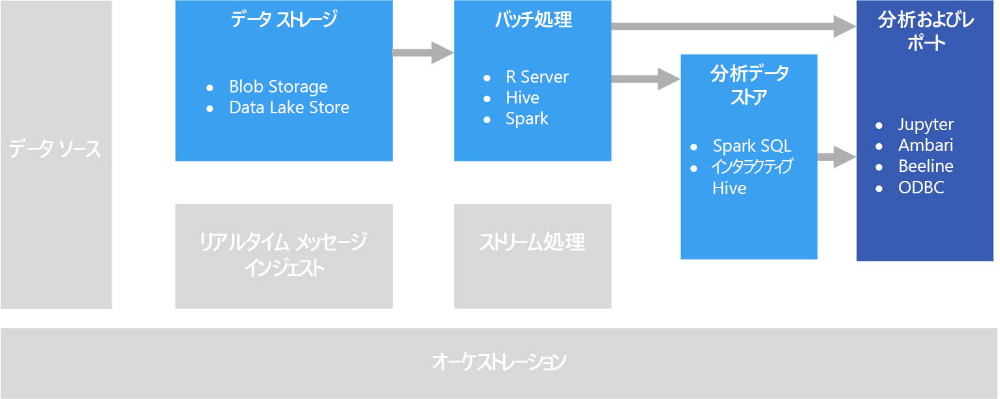

# 対話型データ探索Interactive data exploration

多くの企業のビジネス インテリジェンス (BI) ソリューションでは、レポートとセマンティック モデルは BI スペシャリストによって作成され、一元管理されます。In many corporate business intelligence (BI) solutions, reports and semantic models are created by BI specialists and managed centrally. しかし、データ ドリブンの意思決定をユーザーが行えるようにすることを望む組織が増えています。Increasingly, however, organizations want to enable users to make data-driven decisions. また、データを対話的に探索し、統計モデルと分析手法を適用してデータの傾向やパターンを見つけることを職務とする "*データ サイエンティスト*" や "*データ アナリスト*" を雇用する組織の数が増えています。Additionally, a growing number of organizations are hiring *data scientists* or *data analysts*, whose job is to explore data interactively and apply statistical models and analytical techniques to find trends and patterns in the data. 対話型データ探索では、アドホック クエリとデータ視覚化用に待機時間の短い処理を提供するツールやプラットフォームが必要です。Interactive data exploration requires tools and platforms that provide low-latency processing for ad-hoc queries and data visualizations.

## セルフサービス BISelf-service BI

セルフサービス BI とは、企業全体のデータから実用的な情報を検索、探索、共有する権限をユーザーに与えるビジネス上の意思決定の最新アプローチに付けられた名前です。Self-service BI is a name given to a modern approach to business decision making in which users are empowered to find, explore, and share insights from data across the enterprise. これを実現するには、データ ソリューションでいくつかの要件がサポートされている必要があります。To accomplish this, the data solution must support several requirements:

- データ カタログを通じたビジネス データ ソースの検出。Discovery of business data sources through a data catalog.
- データ エンティティの定義と値の一貫性を確保するマスター データ管理。Master data management to ensure consistency of data entity definitions and values.
- ビジネス ユーザー向けの対話型のデータ モデリングおよび視覚化ツール。Interactive data modeling and visualization tools for business users.

セルフサービス BI ソリューションでは、ビジネス ユーザーは一般に、ビジネスの特定の領域に関連するデータ ソースを検索して使用し、直感的なツールと生産性向上アプリケーションを使用して同僚と共有できる個人のデータ モデルとレポートを定義します。In a self-service BI solution, business users typically find and consume data sources that are relevant to their particular area of the business, and use intuitive tools and productivity applications to define personal data models and reports that they can share with their colleagues.

関連 Azure サービス:Relevant Azure services:

- [Azure Data CatalogAzure Data Catalog](/azure/data-catalog/data-catalog-what-is-data-catalog)
- [Microsoft Power BIMicrosoft Power BI](https://powerbi.microsoft.com/)

## データ サイエンス実験Data science experimentation

組織が高度な分析と予測モデリングを必要とする場合、通常、最初の準備作業はスペシャリスト データ サイエンティストによって実行されます。When an organization requires advanced analytics and predictive modeling, the initial preparation work is usually undertaken by specialist data scientists. データ サイエンティストは、データを探索し、データの "*特徴*" と目的の予測 "*ラベル*" の間に関係を見いだす統計的分析手法を適用します。A data scientist explores the data and applies statistical analytical techniques to find relationships between data *features* and the desired predicted *labels*. 一般にデータの探索は、統計モデリングと視覚化をネイティブにサポートする Python や R などのプログラミング言語を使用して行われます。Data exploration is typically done using programming languages such as Python or R that natively support statistical modeling and visualization. データの探索に使用されるスクリプトは、通常は Jupyter Notebook などの特殊な環境にホストされます。The scripts used to explore the data are typically hosted in specialized environments such as Jupyter Notebooks. これらのツールを使用して、データ サイエンティストはデータをプログラムで探索しながら、見つかった実用的な情報を文書化および共有できます。These tools enable data scientists to explore the data programmatically while documenting and sharing the insights they find.

関連 Azure サービス:Relevant Azure services:

- [Azure NotebooksAzure Notebooks](https://notebooks.azure.com/)
- [Azure Machine Learning StudioAzure Machine Learning Studio](/azure/machine-learning/studio/what-is-ml-studio)
- [Azure Machine Learning 実験サービスAzure Machine Learning Experimentation Services](/azure/machine-learning/preview/experimentation-service-configuration)
- [データ サイエンス仮想マシンThe Data Science Virtual Machine](/azure/machine-learning/data-science-virtual-machine/overview)

## 課題Challenges

- **データ プライバシー コンプライアンス**。**Data privacy compliance**. ユーザーがセルフサービスの分析とレポートに個人データを使用できるようにすることについて注意が必要です。You need to be careful about making personal data available to users for self-service analysis and reporting. 組織のポリシーと規制の問題のため、コンプライアンスの考慮事項がある可能性があります。There are likely to be compliance considerations, due to organizational policies and also regulatory issues.

- **データの量**。**Data volume**. ユーザーに完全なデータ ソースへのアクセス権を付与すると便利な場合がありますが、Excel または Power BI 操作がきわめて長時間にわたって実行されたり、多くのクラスター リソースを使用する Spark SQL クエリが実行されたりすることがあります。While it may be useful to give users access to the full data source, it can result in very long-running Excel or Power BI operations, or Spark SQL queries that use a lot of cluster resources.

- **ユーザーの知識**。**User knowledge**. ユーザーは、ビジネス上の意思決定を通知するために独自のクエリと集計を作成します。Users create their own queries and aggregations in order to inform business decisions. ユーザーが正確な結果を得るために必要な分析スキルとクエリのスキルを持っているという確信がありますか。Are you confident that users have the necessary analytical and querying skills to get accurate results?

- **結果の共有**。**Sharing results**. ユーザーがレポートまたはデータ視覚化を作成および共有できる場合は、セキュリティの考慮事項がある可能性があります。There may be security considerations if users can create and share reports or data visualizations.

## アーキテクチャArchitecture

このシナリオの目的は対話型データ分析をサポートすることですが、多くの場合、データ サイエンスに関連するデータ クレンジング、サンプリング、構造化のタスクには実行時間の長いプロセスが含まれます。Although the goal of this scenario is to support interactive data analysis, the data cleansing, sampling, and structuring tasks involved in data science often include long-running processes. このため、[バッチ処理](../big-data/batch-processing.md)アーキテクチャが適切になります。That makes a [batch processing](../big-data/batch-processing.md) architecture appropriate.

## テクノロジの選択Technology choices

以下のテクノロジは、Azure での対話型データ探索に推奨される選択肢です。The following technologies are recommended choices for interactive data exploration in Azure.

### データ ストレージData storage

- **Azure Storage Blob コンテナー**または **Azure Data Lake Store**。**Azure Storage Blob Containers** or **Azure Data Lake Store**. データ サイエンティストは、一般に生ソース データを処理して、データ内の考えられるすべての特徴、外れ値、エラーにアクセスできるようにします。Data scientists generally work with raw source data, to ensure they have access to all possible features, outliers, and errors in the data. ビッグ データのシナリオでは、このデータは通常、データ ストア内でファイルの形式をとります。In a big data scenario, this data usually takes the form of files in a data store.

詳しくは、[データ ストレージ](../technology-choices/data-storage.md)に関するページをご覧ください。For more information, see [Data storage](../technology-choices/data-storage.md).

### バッチ処理Batch processing

- **Microsoft R Server** または **Spark**。**R Server** or **Spark**. ほとんどのデータ サイエンティストは、R や Python など、数学および統計パッケージを強力にサポートするプログラミング言語を使用します。Most data scientists use programming languages with strong support for mathematical and statistical packages, such as R or Python. 大量のデータを操作する場合は、これらの言語で分散処理を使用できるプラットフォームを使用して待機時間を短縮できます。When working with large volumes of data, you can reduce latency by using platforms that enable these languages to use distributed processing. Microsoft R Server は、単独で使用することも、Spark と組み合わせて R 処理関数をスケールアウトすることもできます。Spark は Python をネイティブにサポートして、その言語の同様のスケールアウト機能に対応します。R Server can be used on its own or in conjunction with Spark to scale out R processing functions, and Spark natively supports Python for similar scale-out capabilities in that language.
- **Hive**。**Hive**. Hive は、SQL に似たセマンティクスを使用してデータを変換するのに適した選択肢です。Hive is a good choice for transforming data using SQL-like semantics. ユーザーは、セマンティックが SQL に似た HiveQL ステートメントを使用してテーブルの作成と読み込みを行うことができます。Users can create and load tables using HiveQL statements, which are semantically similar to SQL.

詳しくは、[バッチ処理](../technology-choices/batch-processing.md)に関するページをご覧ください。For more information, see [Batch processing](../technology-choices/batch-processing.md).

### 分析データ ストアAnalytical Data Store

- **Spark SQL**。**Spark SQL**. Spark SQL は Spark 上に構築された API で、SQL 構文を使用してクエリを実行できるデータフレームとテーブルの作成をサポートします。Spark SQL is an API built on Spark that supports the creation of dataframes and tables that can be queried using SQL syntax. 分析するデータ ファイルが生ソース ファイルであるかバッチ プロセスによってクリーニングおよび準備された新しいファイルであるかに関係なく、ユーザーはそれらに Spark SQL テーブルを定義して、分析に対してさらにクエリを実行できます。Regardless of whether the data files to be analyzed are raw source files or new files that have been cleaned and prepared by a batch process, users can define Spark SQL tables on them for further querying an analysis.

- **Hive**。**Hive**. Hive を使用した生データのバッチ処理に加えて、データが格納されているフォルダーに基づく Hive テーブルおよびビューを含む Hive データベースを作成して、分析とレポートに対して対話型クエリを実行できます。In addition to batch processing raw data by using Hive, you can create a Hive database that contains Hive tables and views based on the folders where the data is stored, enabling interactive queries for analysis and reporting. HDInsight には、インメモリ キャッシュを使用して Hive クエリの応答時間を短縮する対話型 Hive クラスターの種類が含まれています。HDInsight includes an Interactive Hive cluster type that uses in-memory caching to reduce Hive query response times. SQL に似た構文に慣れているユーザーは、対話型 Hive を使用してデータを探索できます。Users who are comfortable with SQL-like syntax can use Interactive Hive to explore data.

詳しくは、[分析データ ストア](../technology-choices/analytical-data-stores.md)に関するページをご覧ください。For more information, see [Analytical data stores](../technology-choices/analytical-data-stores.md).

### 分析とレポートAnalytics and reporting

- **Jupyter**。**Jupyter**. Jupyter Notebook は、R、Python、Scala などの言語でコードを実行するためのブラウザー ベースのインターフェイスを提供しています。Jupyter Notebooks provides a browser-based interface for running code in languages such as R, Python, or Scala. Microsoft R Server または Spark を使用してデータをバッチ処理する場合、または Spark SQL を使用してクエリを実行するテーブルのスキーマを定義する場合は、Jupyter がデータのクエリに適した選択肢である可能性があります。When using R Server or Spark to batch process data, or when using Spark SQL to define a schema of tables for querying, Jupyter can be a good choice for querying the data. Spark を使用する場合は、標準の Spark データフレーム API または Spark SQL API に加え、組み込みの SQL ステートメントを使用して、データのクエリと視覚化の生成を行うことができます。When using Spark, you can use the standard Spark dataframe API or the Spark SQL API as well as embedded SQL statements to query the data and produce visualizations.

- **Drill**。**Drill**. アドホック データ探索を実行したい場合は、スキーマ フリーの SQL クエリ エンジン、[Apache Drill](https://drill.apache.org/) があります。If you want to perform ad hoc data exploration, [Apache Drill](https://drill.apache.org/) is a schema-free SQL query engine. これはスキーマを必要としないため、ユーザーは、さまざまなデータ ソースからデータに対してクエリを実行できます。データの構造は、このエンジンによって自動的に解釈されます。Because it doesn't require a schema, you can query data from a variety of data sources, and the engine will automatically understand the structure of the data.  [Azure Blob Storage プラグイン](https://drill.apache.org/docs/azure-blob-storage-plugin/)を使って、Azure Blob Storage でドリルを使用できます。You can use Drill with Azure Blob Storage, by using the [Azure Blob Storage Plugin](https://drill.apache.org/docs/azure-blob-storage-plugin/). これにより、データを移動せずに、Blob Storage でデータに対してクエリを実行できます。This lets you run queries against data in Blob Storage without having to move the data.

- **対話型 Hive クライアント**。**Interactive Hive Clients**. 対話型 Hive クラスターを使用してデータのクエリを実行する場合は、Ambari クラスター ダッシュボード、Beeline コマンド ライン ツール、または Microsoft Excel や Power BI などの ODBC ベースのツール (Hive ODBC ドライバーを使用) で Hive ビューを使用することができます。If you use an Interactive Hive cluster to query the data, you can use the Hive view in the Ambari cluster dashboard, the Beeline command line tool, or any ODBC-based tool (using the Hive ODBC driver), such as Microsoft Excel or Power BI.

詳しくは、[データ分析とレポート テクノロジ](../technology-choices/analysis-visualizations-reporting.md)に関するページをご覧ください。For more information, see [Data analytics and reporting technology](../technology-choices/analysis-visualizations-reporting.md).
