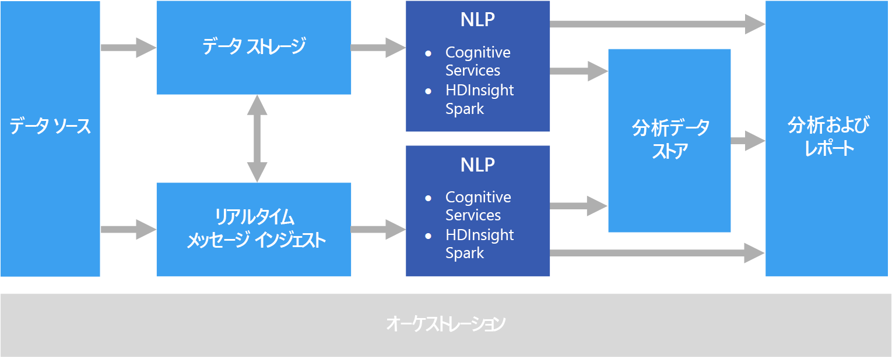

# 自然言語処理Natural language processing

自然言語処理 (NLP) は、感情分析、トピック検出、言語検出、キー フレーズ抽出、およびドキュメント分類などのタスクに使用されます。Natural language processing (NLP) is used for tasks such as sentiment analysis, topic detection, language detection, key phrase extraction, and document categorization.

## このソリューションを使用する状況When to use this solution

NLP は、"重要" や "迷惑" としてドキュメントをラベル付けするなど、ドキュメントの分類に使用できます。NLP can be use to classify documents, such as labeling documents as sensitive or spam. NLP の出力は、後続の処理や検索に使用できます。The output of NLP can be used for subsequent processing or search. NLP の別の用途として、ドキュメントに表示されたエンティティの識別によるテキストの集約があります。Another use for NLP is to summarize text by identifying the entities present in the document. また、これらのエンティティは、キーワードによるドキュメントのタグ付けに使用され、コンテンツに基づく検索や取得を可能にします。These entities can also be used to tag documents with keywords, which enables search and retrieval based on content. エンティティは、トピックに結び付けることができ、各ドキュメントに示された重要なトピックを説明する概要も使用できます。Entities might be combined into topics, with summaries that describe the important topics present in each document. 検出されたトピックは、ナビゲーションのためのドキュメントの分類や、選択されたトピックに関連するドキュメントの列挙に使用できます。The detected topics may be used to categorize the documents for navigation, or to enumerate related documents given a selected topic. NLP のもう 1 つの用途として、ドキュメントのポジティブまたはネガティブな文調を評価する、感情に関するテキストのスコア化があります。Another use for NLP is to score text for sentiment, to assess the positive or negative tone of a document. これらの手法では、次のような自然言語処理から多くの技術を活用しています。These approaches use many techniques from natural language processing, such as:

- **トークナイザー**。**Tokenizer**. テキストを語句に分割する。Splitting the text into words or phrases.
- **語幹検索および見出し語認定****Stemming and lemmatization**. さまざまな語形を同じ意味の一般的な単語にマッピングするために、単語を正規化する Normalizing words so that that different forms map to the canonical word with the same meaning. ("running" と "ran" を "run" にマップするなど)。For example, "running" and "ran" map to "run."
- **エンティティ抽出**。**Entity extraction**. テキストの主題を識別する。Identifying subjects in the text.
- **品詞検出**。**Part of speech detection**. 動詞、名詞、分詞、動詞句などにテキストを識別する。Identifying text as a verb, noun, participle, verb phrase, and so on.
- **文の境界検出**。**Sentence boundary detection**. 段落のテキスト内で完全な文を検出します。Detecting complete sentences within paragraphs of text.

NLP を使用して自由形式のテキストから情報および洞察を抽出する場合、通常は Azure Storage や Azure Data Lake Store などオブジェクト ストレージに格納された未処理のドキュメントから開始します。When using NLP to extract information and insight from free-form text, the starting point is typically the raw documents stored in object storage such as Azure Storage or Azure Data Lake Store.

## 課題Challenges

- 自由形式のテキスト ドキュメントのコレクションの処理は通常、時間がかかるだけでなく、コンピューティングにおけるリソース負荷も高くなります。Processing a collection of free-form text documents is typically computationally resource intensive, as well as being time intensive.
- 標準化されたドキュメント形式がなく、自由形式のテキスト処理を使用してドキュメントから特定のファクトを抽出して、常に正確な結果に到達することは、大変困難です。Without a standardized document format, it can be very difficult to achieve consistently accurate results using free-form text processing to extract specific facts from a document. たとえば、請求書のテキスト表現を考えてみてください。複数のベンダーの請求書から請求番号と請求日を正確に抽出する処理を構築することは、難しい可能性があります。For example, think of a text representation of an invoice&mdash;it can be difficult to build a process that correctly extracts the invoice number and invoice date for invoices across any number of vendors.

## アーキテクチャArchitecture

NLP ソリューションでは、自由形式のテキスト処理は、段落のテキストを含むドキュメントに対して実行されます。In an NLP solution, free-form text processing is performed against documents containing paragraphs of text. 全体のアーキテクチャは、[バッチ処理](../big-data/batch-processing.md)または[リアルタイムでのストリーム処理](../big-data/real-time-processing.md)のアーキテクチャになる場合があります。The overall architecture can be a [batch processing](../big-data/batch-processing.md) or [real-time stream processing](../big-data/real-time-processing.md) architecture.

実際の処理は、目的とする成果物によって異なりますが、パイプラインの観点では、バッチやリアルタイム方式で NLP を適用できます。The actual processing varies based on the desired outcome, but in terms of the pipeline, NLP may be applied in a batch or real-time fashion. たとえば、感情分析は、テキスト ブロックに対して使用して、感情スコアを生成できます。For example, sentiment analysis can be used against blocks of text to produce a sentiment score. この分析は、ストレージのデータに対してバッチ処理を実行したり、リアルタムでメッセージング サービス経由で送信されたより小さなデータチャンクを使用して、行うことができます。This can could be done by running a batch process against data in storage, or in real time using smaller chunks of data flowing through a messaging service.

## テクノロジの選択Technology choices

- [自然言語処理Natural language processing](../technology-choices/natural-language-processing.md)
