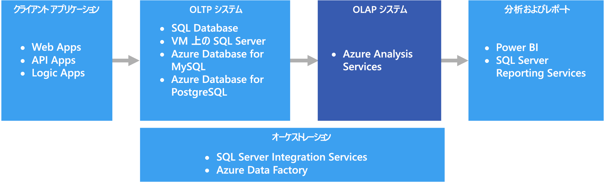

# オンライン分析処理 (OLAP)

オンライン分析処理 (OLAP) は、大規模なビジネス データベースを編成し、複雑な分析をサポートする技術です。 トランザクション システムに悪影響を及ぼさずに複雑な分析クエリを実行するために、OLAP を使用できます。

すべてのトランザクションとレコードの格納に企業が使用しているデータベースは、[オンライン トランザクション処理 (OLTP)](online-transaction-processing.md) データベースと呼ばれます。 これらのデータベースには、通常、一度に 1 つずつ入力されるレコードが含まれています。 多くの場合、組織にとって有益な大量の情報が格納されています。 しかし、OLTP で使用されるデータベースは、分析用に設計されていませんでした。 そのため、これらのデータベースから目的の情報を取得するには、時間と労力において高い負荷がかかります。 OLAP システムは、パフォーマンスの高い方法でデータからこのビジネス インテリジェンス情報を抽出できるように設計されました。 OLAP データベースは、大量の読み取りと少量の書き込みのワークロードに最適化されているからです。

 

## このソリューションを使用する状況

次のシナリオで OLAP を検討してください。

- OLTP システムに悪影響を与えずに、迅速に複雑な分析とアドホック クエリを実行する必要がある 
- データからレポートを生成する簡単な方法を業務ユーザーに提供したいと考えている
- ユーザーが迅速に一貫性のある結果を得られる、多数の集計機能を提供したいと考えている 

大量データに対して集計の計算を適用するには、OLAP は特に便利です。 OLAP システムは、分析やビジネス インテリジェンスなど、読み取り処理が多いシナリオに最適化されています。 OLAP を使用して、ユーザーは (ピボット テーブルなどの) 2 つのディメンションで表示できる、または特定の値によってデータをフィルター処理できるスライスに、多次元データをセグメント化できます。 このプロセスは、データの "スライスとダイス" と呼ばれる場合もあり、複数のデータ ソースにわたってデータがパーティション化されているかに関係なく、実行されます。 これにより、ユーザーは従来からのデータ分析の詳細を把握しなくても、傾向を見つけ、パターンを検出し、データを調査できます。

[セマンティック モデル](../concepts/semantic-modeling.md)は、業務ユーザーがリレーションシップの複雑性を抽象化して、データの迅速な分析をより簡単に行うことを可能にします。

## 課題

OLAP システムが提供するすべての利点において、いくつかの課題が発生しています。

- OLTP システムのデータは、さまざまな配信元から送信されたトランザクションを通して絶えず更新されるのに対して、OLAP データ ストアは通常、業務ニーズに応じて、それよりもずっと低い頻度で更新されます。 これは、OLAP システムは、変化への迅速な対応よりも、戦略的な業務上の意思決定により適していることを意味します。 また、いずれかのレベルでのデータ クレンジングおよび調整では、OLAP データ ストアを最新の状態に保つように計画する必要があります。
- OLTP システムに見られる従来の正規化されたリレーショナル テーブルとは異なり、OLAP データ モデルは多次元になる傾向があります。 これにより、各属性が 1 つの列にマップされるエンティティ リレーションシップ モデルやオブジェクト指向モデルに直接マッピングすることが、困難または不可能になります。 代わりに、OLAP システムでは通常、従来の正規化に代わってスター スキーマやスノーフレーク スキーマを使用します。

## Azure での OLAP

Azure では、Azure SQL Database などの OLTP システムで保持されているデータは、[Azure Analysis Services](/azure/analysis-services/analysis-services-overview) などの OLAP システムにコピーされます。 [Power BI](https://powerbi.microsoft.com)、Excel、およびサードパーティ製のオプションなどの、データの探索と視覚化のツールは、Analysis Services サーバーに接続され、ユーザーは、モデル化されたデータに対して非常にインタラクティブかつ視覚的に優れた洞察を得ることができます。 OLTP データから OLAP へのデータ フローは通常、[Azure Data Factory](/azure/data-factory/concepts-integration-runtime) を使って実行できる SQL Server Integration Services を使用して調整されます。

## テクノロジの選択

- [オンライン分析処理 (OLAP) データ ストア](../technology-choices/olap-data-stores.md)

