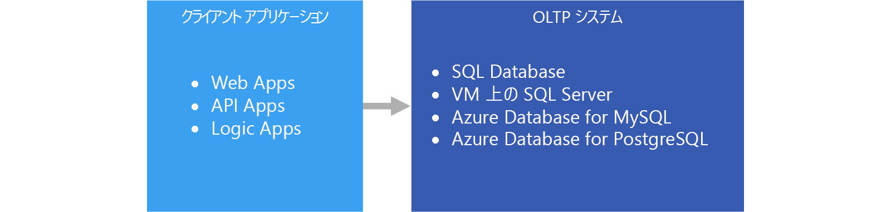

# オンライン トランザクション処理 (OLTP)

コンピューター システムを使用した[トランザクション データ](../concepts/transactional-data.md)の管理は、オンライン トランザクション処理 (OLTP) と呼ばれます。 OLTP システムは、組織の日常的な業務でビジネス インタラクションが発生したときに記録し、そのデータに対してクエリを実行して推論する処理をサポートします。

## このソリューションを使用する状況

ビジネス トランザクションを効率的に処理して保存し、一貫した方法でクライアント アプリケーションですぐに利用できるようにする必要がある場合は、OLTP を選択します。 処理が明らかに遅れた場合に日常業務に悪影響が及ぶ場合は、このアーキテクチャを使用します。

OLTP システムは、トランザクションを効率的に処理および格納し、トランザクション データに対してクエリを実行できるように設計されています。 OLTP システムで個々のトランザクションを効率的に処理して格納するという目標は、データの正規化 (つまり、データを冗長性があまりない小さなチャンクに分割する処理) によって部分的に達成されます。 OLTP システムを使用して大量のトランザクションを独立して処理できるようになり、冗長データが存在する場合は、データ整合性を維持するために必要な余計な処理が回避されるため、効率的でもあります。

## 課題
OLTP システムを実装して使用すると、いくつかの課題が生じる可能性があります。

- OLTP システムは、入念に計画された SQL Server ベースのソリューションなどの例外はありますが、大量のデータに対する集計の処理には必ずしも適していません。 データに対する分析は、数百万単位の個々のトランザクションを集計する計算に依存しており、OLTP システムにとっては非常にリソースを消費する処理です。 実行に時間がかかり、データベース内の他のトランザクションをブロックして速度の低下が発生する可能性があります。
- 高度に正規化されたデータの分析とレポート作成を行う場合、クエリは複雑になる傾向があります。なぜなら、ほとんどのクエリでは、結合を使用してデータを正規化する必要があるためです。 また、OLTP システムのデータベース オブジェクトの名前付け規則は簡潔な傾向があります。 正規化の増加と簡潔な名前付け規則の組み合わせにより、ビジネス ユーザーが DBA やデータの開発者から支援を受けずに OLTP システムでクエリを実行することは困難になっています。
- トランザクションの履歴を無期限に格納し、1 つのテーブルに格納されるデータ量が多くなりすぎると、格納されるトランザクション数に応じてクエリのパフォーマンスが低下する可能性があります。 一般的な解決策は、OLTP システムで関連する時間枠 (現在の会計年度など) を維持し、履歴データをデータ マートや[データ ウェアハウス](../technology-choices/data-warehouses.md)などの他のシステムにオフロードすることです。

## Azure の OLTP

[App Service Web Apps](/azure/app-service/app-service-web-overview) でホストされている Web サイト、App Service で実行されている REST API、モバイル アプリケーションやデスクトップ アプリケーションなどのアプリケーションは、通常、REST API の中継ぎを介して OLTP システムと通信します。

実際には、ほとんどのワークロードは純粋には OLTP ではありません。 [分析コンポーネント](../scenarios/online-analytical-processing.md)に近い傾向もあります。 さらに、運用システムに対してレポートを実行するなど、リアルタイム レポートの需要が高まっています。 これは、HTAP (ハイブリッド取引と分析処理) とも呼ばれます。 詳細については、[オンライン分析処理 (OLAP) データ ストア](../technology-choices/olap-data-stores.md)に関するページを参照してください。

## テクノロジの選択

データ ストレージ:

- [Azure SQL Database](/azure/sql-database/)
- [Azure VM の SQL Server](/azure/virtual-machines/windows/sql/virtual-machines-windows-sql-server-iaas-overview?toc=%2Fazure%2Fvirtual-machines%2Fwindows%2Ftoc.json)
- [Azure Database for MySQL](/azure/mysql/)
- [Azure Database for PostgreSQL](/azure/postgresql/)

詳細については、[OLTP データ ストアの選択](../technology-choices/oltp-data-stores.md)に関するページを参照してください。

データ ソース:

- [App Service](/azure/app-service/)
- [Mobile Apps](/azure/app-service-mobile/)

