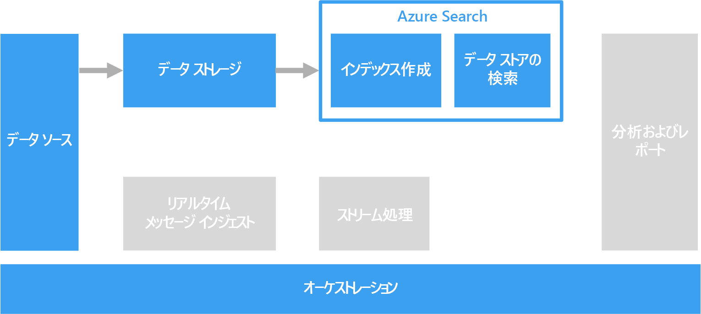

# 検索用の自由形式テキストの処理Processing free-form text for search

検索をサポートするため、テキストの段落を含むドキュメントに対して自由形式のテキスト処理を実行されます。To support search, free-form text processing can be performed against documents containing paragraphs of text.

テキスト検索は、ドキュメントのコレクションに対して事前に計算済みの特殊なインデックスを構築することによって機能します。Text search works by constructing a specialized index that is precomputed against a collection of documents. クライアント アプリケーションは、検索用語を含むクエリを送信します。A client application submits a query that contains the search terms. クエリでは、ドキュメントの一覧で構成される結果セットが返ります。一覧は、各ドキュメントが検索条件と一致する度合いに従って並べられます。The query returns a result set, consisting of a list of documents sorted by how well each document matches the search criteria. 結果セットには、ドキュメントが条件と一致するコンテキストも含まれる可能性があり、それによってアプリケーションは、ドキュメント内の一致する語句を強調表示できます。The result set may also include the context in which the document matches the criteria, which enables the application to highlight the matching phrase in the document.

自由形式テキストの処理では、大量のテキスト データから有用で実用的なデータを生成できます。Free-form text processing can produce useful, actionable data from large amounts of noisy text data. 結果は、構造化されていないドキュメントに対して、適切に定義され、クエリ可能な構造を与えることができます。The results can give unstructured documents a well-defined and queryable structure.

## 課題Challenges

- 自由形式テキストのドキュメントのコレクションを処理する操作は、通常は、時間がかかるだけでなく、コンピューティングにおけるリソース負荷も高くなります。Processing a collection of free-form text documents is typically computationally intensive, as well as time intensive.
- 自由形式テキストを効率的に検索するために、検索インデックスでは、構造が似ている用語に基づくあいまい検索をサポートする必要があります。In order to search free-form text effectively, the search index should support fuzzy search based on terms that have a similar construction. たとえば、見出し語解析と語幹抽出による検索インデックスを構築して、"run" のクエリを実行したときに、"ran" と "running" を含むドキュメントも検索されるようにします。For example, search indexes are built with lemmatization and linguistic stemming, so that queries for "run" will match documents that contain "ran" and "running."

## アーキテクチャArchitecture

ほとんどのシナリオでは、ソース テキスト ドキュメントは Azure Storage または Azure Data Lake Store などのオブジェクト ストレージに読み込まれます。In most scenarios, the source text documents are loaded into object storage such as Azure Storage or Azure Data Lake Store. 例外は、SQL Server または Azure SQL データベース内でのフルテキスト検索の使用です。An exception is using full text search within SQL Server or Azure SQL Database. この場合、ドキュメントのデータは、データベースによって管理されるテーブルに読み込まれます。In this case, the document data is loaded into tables managed by the database. 格納されると、ドキュメントがバッチ処理されてインデックスが作成されます。Once stored, the documents are processed in a batch to create the index.

## テクノロジの選択Technology choices

検索インデックスを作成するためのオプションには、Azure Search、Elasticsearch、および Solr を使用する HDInsight が含まれます。Options for creating a search index include Azure Search, Elasticsearch, and HDInsight with Solr. これらの各テクノロジは、ドキュメントのコレクションから検索インデックスを設定できます。Each of these technologies can populate a search index from a collection of documents. Azure Search には、プレーン テキストから Excel 形式と PDF 形式に至るまでのドキュメントのインデックスを自動的に設定できるインデクサーが用意されています。Azure Search provides indexers that can automatically populate the index for documents ranging from plain text to Excel and PDF formats. HDInsight では、Apache Solr で、プレーン テキスト、Word、PDF を含むさまざまな種類のバイナリ ファイルにインデックスを設定できます。On HDInsight, Apache Solr can index binary files of many types, including plain text, Word, and PDF. インデックスが構築されたら、クライアントは、REST API を使用して検索インターフェイスにアクセスできます。Once the index is constructed, clients can access the search interface by means of a REST API.

テキスト データが SQL Server または Azure SQL Database に格納されている場合は、データベースに組み込まれているフルテキスト検索を使用できます。If your text data is stored in SQL Server or Azure SQL Database, you can use the full-text search that is built into the database. データベースは、同じデータベース内に格納されたテキスト、バイナリ、または XML データからインデックスを設定します。The database populates the index from text, binary, or XML data stored within the same database. クライアントは、T-SQL クエリを使用して検索します。Clients search by using T-SQL queries.

詳細については、[検索データ ストア](../technology-choices/search-options.md)に関する記事を参照してください。For more information, see [Search data stores](../technology-choices/search-options.md).
