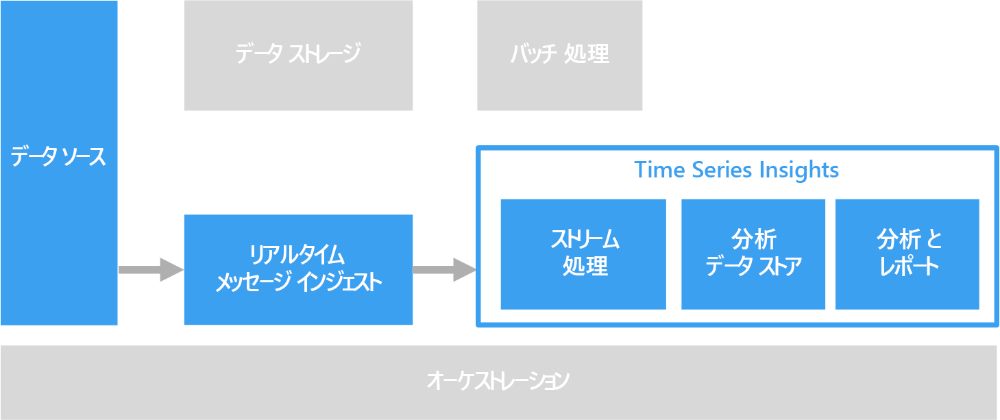

# 時系列ソリューション

時系列データは、時間別に整理された値のセットです。 時系列データの例として、センサー データ、株価、クリック ストリーム データ、アプリケーション テレメトリ データなどがあります。 時系列データを使用して、履歴による傾向、リアルタイムのアラート、または予測モデリングを分析できます。

 

時系列データは、資産やプロセスの経時的な変化を表します。 データにはタイムスタンプがありますが、さらに重要なのは、データを表示または分析するための最も意味のある軸が時間であるということです。 一般に、時系列データは時間順に到着し、通常はデータベースに対する更新ではなく挿入として扱われます。 このため、変更は時間に対して測定され、過去の変化を振り返ったり、今後の変化を予測したりできます。 そのため、時系列データのビジュアル化には、散布図または折れ線グラフが最も適しています。

時系列データのいくつかの例を示します。

- 傾向を検出するために一定時間キャプチャされた株価。
- CPU 使用率、I/O 負荷、メモリ使用量、およびネットワーク帯域幅の消費量などのサーバーのパフォーマンス。
- 産業機器のセンサーから送信されたテレメトリ。これを使用して、保留中の機器の障害を検出し、アラート通知をトリガーできます。
- 特定の時間枠でのスピード、ブレーキ、アクセルを含むリアルタイムの車両テレメトリ。ドライバーの集計されたリスク スコアを生成します。

これらの例のそれぞれで、軸としての時間が最も意味のあることがわかります。 時間的順序があるため、イベントを到着順で表示することは時系列データの重要な特性です。 これは、データを任意の順序で入力していつでも更新できる標準的な OLTP データ パイプライン用にキャプチャされたデータとは異なります。

## このソリューションを使用する状況

その戦略的価値が一定期間の変化に集中しているデータを取り込む必要があり、主に新しいデータの挿入が実行され、更新はめったに行なわれない場合は、時系列ソリューションを選択します。 この情報を使用して、異常の検出、傾向のビジュアル化、現在のデータと履歴データの比較などを実行できます。 このタイプのアーキテクチャは、経時変化の履歴レコードがあるため、予測モデリングと予測結果にも最適であり、任意の数の予測モデルに適用できます。 

時系列の使用には次の利点があります。

* 資産やプロセスの経時的な変化を明確に表します。
* 複数の関連するソースの変化を迅速に検出し、異常と顕在化しつつ傾向をはっきりと浮き上がらせるために役立ちます。
* 予測モデリングと予測に最も適しています。

### モノのインターネット(IoT)

IoT デバイスによって収集されるデータは、時系列での保存と分析に最適です。 受信データは挿入され、更新されることはめったにありません。 データにはタイム スタンプが付けられ、受信した順序で挿入されます。このデータは通常は時系列で表示され、ユーザーが傾向の検出、異常の見分け、予測分析での情報の使用を実行できるようにします。

詳細については、「[モノのインターネット](../big-data/index.md#internet-of-things-iot)」をご覧ください。

### リアルタイム分析

時系列データは、多くの場合、一刻を争うデータです。つまり、リアルタイムで傾向を見分けたり、アラートを生成したりするために迅速に対処する必要があります。 これらのシナリオでは、判断の遅れによってダウンタイムとビジネスへの影響が発生する可能性があります。 さらに、多くの場合、センサーなどのさまざまなソースのデータを関連付ける必要があります。

理想的なのは、受信したデータをリアルタイムで処理するストリーム処理レイヤーを用意し、そのすべてを高い精度と粒度で処理することです。 ストリーミング アーキテクチャ、ストリーミング バッファ、およびストリーミング処理レイヤーによっては、これは常に可能というわけではありません。 時系列データを減らすことで、その精度を犠牲にしなければならない場合があります。 これは、スライディング時間枠 (例: 数秒) を処理することで実行され、処理レイヤーが適切なタイミングで計算を実行できるようにします。 数か月の間キャプチャされたデータの詳細表示など、長期にわたるデータを表示する場合は、データのダウンサンプリングと集計が必要になる場合もあります。

## 課題

* 時系列データは、多くの場合、非常に容量が大きくなります。これは特に IoT シナリオに当てはまります。 時系列データの保存、インデックス作成、クエリ、分析、およびビジュアル化は困難である可能性があります。 
* 開発期間と全体的なコストの投資を最小限に抑えながら、リアルタイム分析を処理する高速ストレージと強力なコンピューティングの組み合わせを見つけることは困難である可能性があります。

## アーキテクチャ

IoT などの時系列データが関連する多くのシナリオでは、データはリアルタイムでキャプチャされます。 そのため、[リアルタイム処理](../big-data/real-time-processing.md)アーキテクチャが適しています。 

1 つ以上のデータ ソースからのデータは、[IoT Hub](/azure/iot-hub/)、[Event Hubs](/azure/event-hubs/)、または [HDInsight 上の Kafka](/azure/hdinsight/kafka/apache-kafka-introduction) によって、ストリーム バッファリング レイヤーに取り込まれます。 次に、データは、ストリーム処理レイヤーで処理されます。処理されたデータは、必要に応じて、予測分析を行うために機械学習サービスに渡すことができます。 処理されたデータは、[HBase](/azure/hdinsight/hbase/apache-hbase-overview)、[Azure Cosmos DB](/azure/cosmos-db/)、Azure Data Lake、Blob ストレージなどの分析データ ストアに格納されます。 Power BI や OpenTSDB (HBase に格納される場合) などの分析とレポート作成を行うアプリケーションまたはサービスを使用して、時系列データを表示して分析できます。

別のオプションとして、[Azure Time Series Insights](/azure/time-series-insights/) の使用があります。 Time Series Insights は、時系列データ用の完全に管理されたサービスです。 このアーキテクチャでは、Time Series Insights がストリーム処理、データ ストア、分析およびレポート作成のロールを実行します。 IoT Hub または Event Hubs ストアからストリーミング データを受け取り、ほぼリアルタイムでデータを処理、解析、および表示します。 データの事前集計は行いませんが、生のイベントを格納します。

Time Series Insights はスキーマ適用型です。つまり、洞察を開始するためにデータの準備を行う必要はありません。 これにより、さまざまなデータ ソースの調査、比較、および関連付けをシームレスに行うことができます。 SQL に似たフィルターと集計、さまざまな時系列パターンの構成、ビジュアル化、比較、およびオーバーレイを行う機能、ヒート マップ、クエリの保存と共有を行う機能も備えています。 

## テクノロジの選択

- [データ ストレージ](../technology-choices/data-storage.md)
- [分析、ビジュアル化、およびレポート](../technology-choices/analysis-visualizations-reporting.md)
- [分析データ ストア](../technology-choices/analytical-data-stores.md)
- [ストリーム処理](../technology-choices/stream-processing.md)