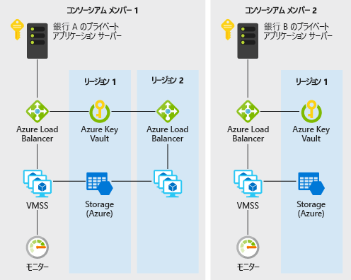

# Azure における銀行間での分散型信頼

このシナリオ例は、一元的なデータベースに頼らずに、情報共有のための信頼できる環境を確立したい銀行などの機関に役立ちます。 この例の目的として、銀行間のクレジット スコア情報を維持するという状況でシナリオを説明しますが、このアーキテクチャは、組織のコンソーシアムが、単一のパーティが運用する一元的なシステムを利用せずに、検証済みの情報を相互に共有する任意のシナリオに適用できます。

従来の金融システム内の銀行は、個人のクレジット スコアと履歴に関する情報を得るために、信用調査機関などの一元的なソースに依存しています。 一元的なアプローチは運用上のリスクが集中しまた。また、不要なサードパーティが介在することもあります。

DLT (分散型台帳テクノロジ) により、銀行のコンソーシアムは、より効率的で、攻撃の影響を受けづらい分散型システムを構築できます。このシステムは、プライバシー、スピード、コストの面で従来の課題を解決する画期的な構造を実装できる新しいプラットフォームとして機能します。

この例では、メンバーの銀行が固有のノードを構築できる効率的なプライベートな Ethereum PoA ブロックチェーンをデプロイするために、仮想マシン スケール セット、Virtual Network、Key Vault、Storage、Load Balancer、Monitor などの Azure サービスをすばやくプロビジョニングする方法を示します。

## 関連するユース ケース

その他の関連するユース ケース:

- 多国籍企業の異なる事業部門間での割り当て済み予算の移動
- 国境を越えた支払い
- 貿易金融のシナリオ
- 複数の企業が参加するロイヤルティ システム
- サプライ チェーンのエコシステム

## アーキテクチャ

このシナリオでは、複数のメンバーから構成されるコンソーシアム内に、スケーラブルで、セキュリティで保護され、監視されているプライベート エンタープライズ ブロックチェーン ネットワークを構築するために必要なバックエンド コンポーネントについて説明します。 このようなコンポーネント (つまり、さまざまなサブスクリプションとリソース グループ内のコンポーネント) をプロビジョニングする方法と、接続要件 (つまり、VPN または ExpressRoute) の詳細は、組織のポリシー要件に基づいてお客様が考慮する必要があります。 データ フローは次のとおりです。

1. 銀行 A は、JSON-RPC 経由でブロックチェーン ネットワークにトランザクションを送信することによって個人のクレジット記録を作成/更新します。
2. データは、銀行 A のプライベート アプリケーション サーバーから Azure ロード バランサーに流れ、次に仮想マシン スケール セット上の検証ノード VM へと流れます。
3. 事前に設定された時間 (このシナリオでは 2 秒) で、Ethereum PoA ネットワークによってブロックが作成されます。
4. トランザクションは、作成されたブロックにバンドルされ、ブロックチェーン ネットワーク全体で検証されます。
5. 銀行 B は、JSON-RPC を介して同様に自身のノードと通信することで、銀行 A によって作成されたクレジット記録を読み取ることができます。

### コンポーネント

- 仮想マシン スケール セット内の仮想マシンには、ブロックチェーン用の検証コントロール プロセスをホストするオンデマンドの計算機能があります
- Key Vault は、各検証コントロールの秘密キーのセキュリティで保護された記憶域として使用されます
- Load Balancer は、RPC、ピアリング、およびガバナンスの DApp 要求を分散します
- Storage は、永続的なネットワーク情報をホストし、リースを調整します
- Operations Management Suite (複数の Azure サービスのバンドル) では、使用できるノード、1 分あたりのトランザクション、およびコンソーシアムのメンバーを分析できます

### 代替手段

この例では、Ethereum PoA アプローチが選択されています。これは、信頼性が高く、分散型でわかりやすい方法で情報を簡単に交換または共有できる環境を作りたい組織のコンソーシアムのエントリ ポイントに適しているからです。 Ethereum PoA ブロックチェーンを開始するコンソーシアムリーダーだけでなく、コンソーシアム内のメンバー組織にとっても、自身のリソース グループとサブスクリプション内にある Azure リソースをスピン アップして既存のネットワークに参加する場合に、Azure ソリューション テンプレートも簡単で便利です。

その他の拡張されたシナリオや異なるシナリオでは、トランザクションのプライバシーなどの問題が発生する可能性があります。 たとえば、有価証券取引のシナリオでは、コンソーシアムのメンバーは、他のメンバーにも取引を見せたくない場合があります。 Ethereum PoA の他の代替手段には、このような懸案事項を独自の方法で解決するものがあります。

- Corda
- Quorum
- Hyperledger

## 考慮事項

### 可用性

[Azure Monitor][monitor] は、可用性を確保するために、問題のブロックチェーン ネットワークの継続的な監視に使用されます。 このシナリオで使用されているブロックチェーン ソリューション テンプレートのデプロイに成功すると、Azure Monitor に基づくカスタム監視ダッシュボードへのリンクが送信されます。 ダッシュボードには、過去 30 分間のハートビートと他の便利な統計情報を報告するノードが表示されます。

可用性に関する他のトピックについては、Azure アーキテクチャ センターの[可用性のチェックリスト][availability]を参照してください。

### スケーラビリティ

ブロックチェーンの一般的な考慮事項として、事前に設定した時間内にブロックチェーンに含めることができるトランザクションの数があります。 このシナリオでは、スケーラビリティとして Proof-of-Work よりも管理しやすい Proof-of-Authority を使用します。 Proof-of-Authority ベースのネットワークでは、合意の参加者が既知であり、管理されているため、相互に認識している組織のコンソーシアムのプライベート ブロックチェーンに適しています。 平均ブロック時間、1 分あたりのトランザクション数、コンピューティング リソースの消費量などのパラメーターは、カスタム ダッシュボードで簡単に監視できます。 リソースは、スケールの要件に基づいて調整することができます。

スケーラブルなソリューションの設計に関する一般的なガイダンスについては、Azure アーキテクチャ センターの[スケーラビリティのチェックリスト][scalability]を参照してください。

### セキュリティ

[Azure Key Vault][vault] は、検証コントロールの秘密キーを簡単に保存および管理するために使用されます。 この例の既定のデプロイでは、インターネット経由でアクセスできるブロックチェーン ネットワークが作成されます。 プライベート ネットワークが必要な運用シナリオでは、メンバーは VNet と VNet VPN 間のゲートウェイ接続を介して相互に接続できます。 VPN の構成手順については、以下の関連リソースのセクションを参照してください。

セキュリティで保護されたソリューションの設計に関する一般的なガイダンスについては、「[Azure のセキュリティのドキュメント][security]」をご覧ください。

### 回復性

Ethereum PoA ブロックチェーンでは、検証コントロール ノードを異なるリージョンにデプロイできるので、ある程度の回復性を実現することができます。 Azure には、世界中の 54 を超えるリージョンにデプロイするオプションがあります。 このようなシナリオのブロックチェーンで独自で斬新な協力を構築し、回復性を高めることができます。 ネットワークの回復性は、単一の一元化されたパーティだけでなく、コンソーシアムのすべてのメンバーによって実現されます。 Proof-of-Authority ベースのブロックチェーンで、ネットワークの回復性をさらに計画し、検討することができます。

回復性に優れたソリューションの設計に関する一般的なガイダンスについては、「[回復性に優れた Azure 用アプリケーションの設計][resiliency]」を参照してください。

## 価格

このシナリオの実行コストを調べることができるように、すべてのサービスがコスト計算ツールで事前構成されています。 特定のユース ケースについて価格の変化を確認するには、予想されるパフォーマンスと可用性の要件に合わせて該当する変数を変更します。

ご自身のアプリケーションを実行するスケール セット VM インスタンスの数に基づいて、3 つのサンプル コスト プロファイルが用意されています (インスタンスは異なるリージョンに存在する可能性があります)。

- [S][small-pricing]: この価格設定の例は、監視をオフにした月に 2 個の VM に対応しています
- [M][medium-pricing]: この価格設定の例は、監視をオンにした月に 7 個の VM に対応しています
- [L][large-pricing]: この価格設定の例は、監視をオンにした月に 15 個の VM に対応しています

これは、1 つのコンソーシアム メンバーがブロックチェーン ネットワークを開始または参加する場合の価格設定です。 通常、複数の企業や組織が参加しているコンソーシアムでは、各メンバーが独自の Azure サブスクリプションを取得します。

## 次の手順

このシナリオの例を確認するには、Azure 上に [Ethereum PoA ブロックチェーン デモ アプリケーション][deploy]をデプロイします。 次に、[シナリオ ソース コードの README][source] を確認します。

## 関連リソース

Azure 用の Ethereum Proof-Authority ソリューション テンプレートを使用する方法の詳細については、こちらの[使用ガイド][guide]を参照してください。

<!-- links -->
[small-pricing]: https://azure.com/e/4e429d721eb54adc9a1558fae3e67990
[medium-pricing]: https://azure.com/e/bb42cd77437744be8ed7064403bfe2ef
[large-pricing]: https://azure.com/e/e205b443de3e4adfadf4e09ffee30c56
[guide]: /azure/blockchain-workbench/ethereum-poa-deployment
[deploy]: https://portal.azure.com/?pub_source=email&pub_status=success#create/microsoft-azure-blockchain.azure-blockchain-ethereumethereum-poa-consortium
[source]: https://github.com/vitoc/creditscoreblockchain
[monitor]: /azure/monitoring-and-diagnostics/monitoring-overview-azure-monitor
[availability]: /azure/architecture/checklist/availability
[scalability]: /azure/architecture/checklist/scalability
[resiliency]: ../../resiliency/index.md
[security]: /azure/security/
[vault]: https://azure.microsoft.com/services/key-vault/
