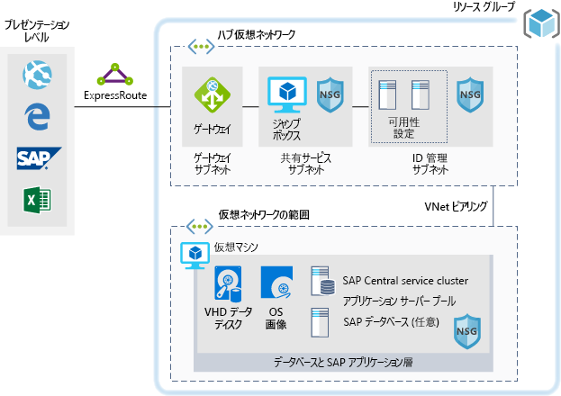

# Azure での SAP ワークロード向けの開発/テスト環境Dev/test environments for SAP workloads on Azure

この例は、Windows または Linux 環境の SAP NetWeaver の開発/テスト環境を Azure 上に構築する方法を示しています。This example shows how to establish a dev/test environment for SAP NetWeaver in a Windows or Linux environment on Azure. 使用するデータベースは AnyDB で、これはサポートされている任意の DBMS を表す SAP 用語 (SAP HANA 以外) です。The database used is AnyDB, the SAP term for any supported DBMS (that isn't SAP HANA). このアーキテクチャは、運用環境以外を対象に設計されているため、単一の仮想マシン (VM) のみでデプロイされ、サイズは組織のニーズに合わせて変更できます。Because this architecture is designed for non-production environments, it's deployed with just a single virtual machine (VM) and it's size can be changed to accommodate your organization's needs.

運用ユース ケースについては、以下で使用できる SAP リファレンス アーキテクチャを確認してください。For production use cases review the SAP reference architectures available below:

* [AnyDB 向けの SAP NetWeaver][sap-netweaver][SAP NetWeaver for AnyDB][sap-netweaver]
* [SAP S/4HANA][sap-hana][SAP S/4HANA][sap-hana]
* [SAP on Azure L インスタンス][sap-large][SAP on Azure large instances][sap-large]

## 関連するユース ケースRelevant use cases

次のユース ケースについて、このシナリオを検討してください。Consider this scenario for the following use cases:

* 重要度、生産性が低い SAP ワークロード (サンドボックス、開発、テスト、品質保証)Non-critical SAP non-productive workloads (sandbox, development, test, quality assurance)
* 重要度が低い SAP ビジネス ワークロードNon-critical SAP business workloads

## アーキテクチャArchitecture

このシナリオは、単一の仮想マシンに単一の SAP システム データベースと SAP アプリケーション サーバーをプロビジョニングする方法を示しています。This scenario demonstrates provisioning a single SAP system database and SAP application server on a single virtual machine. このシナリオのデータ フローは次のとおりです。The data flows through the scenario as follows:

1. お客様は、SAP ユーザー インターフェイスまたは他のクライアント ツール (Excel、Web ブラウザー、またはその他の Web アプリケーション) を使用して、Azure ベースの SAP システムにアクセスします。Customers use the SAP user interface or other client tools (Excel, a web browser, or other web application) to access the Azure-based SAP system.
2. 確立された ExpressRoute を使用して接続が提供されます。Connectivity is provided through the use of an established ExpressRoute. ExpressRoute 接続は、Azure の ExpressRoute ゲートウェイが終端です。The ExpressRoute connection is terminated in Azure at the ExpressRoute gateway. ネットワーク トラフィックが、ExpressRoute ゲートウェイを介してゲートウェイ サブネット、アプリケーション層スポーク サブネットの順にルーティングされ ([ハブスポーク][hub-spoke] パターンを参照)、さらにネットワーク セキュリティ ゲートウェイ経由で SAP アプリケーションの仮想マシンにルーティングされます。Network traffic routes through the ExpressRoute gateway to the gateway subnet, and from the gateway subnet to the application-tier spoke subnet (see the [hub-spoke][hub-spoke] pattern) and via a Network Security Gateway to the SAP application virtual machine.
3. ID 管理サーバーは、認証サービスを提供します。The identity management servers provide authentication services.
4. ジャンプ ボックスは、ローカル管理機能を提供します。The jump box provides local management capabilities.

### コンポーネントComponents

* [仮想ネットワーク](/azure/virtual-network/virtual-networks-overview)は、Azure 内のネットワーク通信の基盤です[Virtual Networks](/azure/virtual-network/virtual-networks-overview) are the basis of network communication within Azure.
* [仮想マシン](/azure/virtual-machines/windows/overview)である Azure Virtual Machines では、Windows または Linux サーバーを使用して、セキュリティで保護された高スケールな仮想化インフラストラクチャをオンデマンドで構築できます。[Virtual Machine](/azure/virtual-machines/windows/overview) Azure Virtual Machines provides on-demand, high-scale, secure, virtualized infrastructure using Windows or Linux Server.
* [ExpressRoute](/azure/expressroute/expressroute-introduction) を利用すると、接続プロバイダーが提供するプライベート接続を介して、オンプレミスのネットワークを Microsoft クラウドに拡張できます。[ExpressRoute](/azure/expressroute/expressroute-introduction) lets you extend your on-premises networks into the Microsoft cloud over a private connection facilitated by a connectivity provider.
* [ネットワーク セキュリティ グループ](/azure/virtual-network/security-overview)を使用すると、仮想ネットワーク内のリソースへのネットワーク トラフィックを制限できます。[Network Security Group](/azure/virtual-network/security-overview) lets you limit network traffic to resources in a virtual network. ネットワーク セキュリティ グループには、ソースまたはターゲット IP アドレス、ポート、およびプロトコルを基に、受信/送信ネットワーク トラフィックを許可または拒否するセキュリティ規則の一覧が含まれています。A network security group contains a list of security rules that allow or deny inbound or outbound network traffic based on source or destination IP address, port, and protocol. 
* [リソース グループ](/azure/azure-resource-manager/resource-group-overview#resource-groups)は、Azure リソースの論理コンテナーとして機能します。[Resource Groups](/azure/azure-resource-manager/resource-group-overview#resource-groups) act as logical containers for Azure resources.

## 考慮事項Considerations

### 可用性Availability

 Microsoft は 1 つの VM インスタンスに対してサービス レベル アグリーメント (SLA) を提供します。Microsoft offers a service level agreement (SLA) for single VM instances. Virtual Machines の Microsoft Azure サービス レベル アグリーメントの詳細については、「[Virtual Machines の SLA](https://azure.microsoft.com/support/legal/sla/virtual-machines)」を参照してくださいFor more information on Microsoft Azure Service Level Agreement for Virtual Machines [SLA For Virtual Machines](https://azure.microsoft.com/support/legal/sla/virtual-machines)

### スケーラビリティScalability

スケーラブルなソリューションの設計に関する一般的なガイダンスについては、Azure アーキテクチャ センターの[スケーラビリティのチェックリスト][scalability]を参照してください。For general guidance on designing scalable solutions, see the [scalability checklist][scalability] in the Azure Architecture Center.

### セキュリティSecurity

セキュリティで保護されたソリューションの設計に関する一般的なガイダンスについては、「[Azure のセキュリティのドキュメント][security]」をご覧ください。For general guidance on designing secure solutions, see the [Azure Security Documentation][security].

### 回復性Resiliency

回復性に優れたソリューションの設計に関する一般的なガイダンスについては、「[回復性に優れた Azure 用アプリケーションの設計][resiliency]」を参照してください。For general guidance on designing resilient solutions, see [Designing resilient applications for Azure][resiliency].

## 価格Pricing

このシナリオの実行コストを調べることができるよう、すべてのサービスが料金計算ツールで事前構成されています。以下に例を示します。To help you explore the cost of running this scenario, all of the services are pre-configured in the cost calculator examples below. 特定のユース ケースについて価格の変化を確認するには、予想されるトラフィックに合わせて該当する変数を変更します。To see how the pricing would change for your particular use case, change the appropriate variables to match your expected traffic.

受信するトラフィックの量に基づいて、次の 4 つのサンプル コスト プロファイルが用意されています。We have provided four sample cost profiles based on amount of traffic you expect to receive:

|サイズSize|SAPSAPs|VM の種類VM Type|StorageStorage|Azure 料金計算ツールAzure Pricing Calculator|
|----|----|-------|-------|---------------|
|SmallSmall|80008000|D8s_v3D8s_v3|P20 x 2、P10 x 12xP20, 1xP10|[SmallSmall](https://azure.com/e/9d26b9612da9466bb7a800eab56e71d1)|
|MediumMedium|1600016000|D16s_v3D16s_v3|P20 x 3、P10 x 13xP20, 1xP10|[MediumMedium](https://azure.com/e/465bd07047d148baab032b2f461550cd)|
LargeLarge|3200032000|E32s_v3E32s_v3|P20 x 3、P10 x 13xP20, 1xP10|[LargeLarge](https://azure.com/e/ada2e849d68b41c3839cc976000c6931)|
Extra LargeExtra Large|6400064000|M64sM64s|P20 x 4、P10 x 14xP20, 1xP10|[Extra LargeExtra Large](https://azure.com/e/975fb58a965c4fbbb54c5c9179c61cef)|

> [!NOTE]
> この価格は、単に VM とストレージの料金を示す目安です。This pricing is a guide that only indicates the VMs and storage costs. ネットワーク、バックアップ ストレージ、データ イングレス/エグレスの料金は含まれていません。It excludes networking, backup storage, and data ingress/egress charges.

* [Small](https://azure.com/e/9d26b9612da9466bb7a800eab56e71d1): 小規模なシステムは、VM の種類 D8s_v3 (8 個の vCPU)、32 GB の RAM、200 GB の一時ストレージ、および 2 つの 512 GB と 1 つの 128 GB Premium Storage ディスクで構成されています。[Small](https://azure.com/e/9d26b9612da9466bb7a800eab56e71d1): A small system consists of VM type D8s_v3 with 8x vCPUs, 32 GB RAM and 200 GB temp storage, additionally two 512 GB and one 128 GB premium storage disks.
* [Medium](https://azure.com/e/465bd07047d148baab032b2f461550cd): 中規模なシステムは、VM の種類 D16s_v3 (16 個の vCPU)、64 GB の RAM、400 GB の一時ストレージ、および 3 つの 512 GB と 1 つの 128 GB Premium Storage ディスクで構成されています。[Medium](https://azure.com/e/465bd07047d148baab032b2f461550cd): A medium system consists of VM type D16s_v3 with 16x vCPUs, 64 GB RAM and 400 GB temp storage, additionally three 512 GB and one 128 GB premium storage disks.
* [Large](https://azure.com/e/ada2e849d68b41c3839cc976000c6931): 大規模なシステムは、VM の種類 E32s_v3 (32 個の vCPU)、256 GB の RAM、512 GB の一時ストレージ、および 3 つの 512 GB と 1 つの 128 GB Premium Storage ディスクで構成されています。[Large](https://azure.com/e/ada2e849d68b41c3839cc976000c6931): A large system consists of VM type E32s_v3 with 32x vCPUs, 256 GB RAM and 512 GB temp storage, additionally three 512GB and one 128GB premium storage disks.
* [Extra Large](https://azure.com/e/975fb58a965c4fbbb54c5c9179c61cef): 超大規模なシステムは、VM の種類 M64s (64 個の vCPU)、1,024 GB の RAM、2,000 GB の一時ストレージ、および 4 つの 512 GB と 1 つの 128 GB Premium Storage ディスクで構成されています。[Extra Large](https://azure.com/e/975fb58a965c4fbbb54c5c9179c61cef): An extra large system consists of a VM type M64s with 64x vCPUs, 1024 GB RAM and 2000 GB temp storage, additionally four 512 GB and one 128 GB premium storage disks.

## DeploymentDeployment

次をクリックして、このシナリオの基盤となるインフラストラクチャをデプロイします。Click here to deploy the underlying infrastructure for this scenario.

> [!NOTE]
> このデプロイでは、SAP と Oracle はインストールされません。SAP and Oracle are not installed during this deployment. それらのコンポーネントは、個別にデプロイする必要があります。You will need to deploy these components separately.

<!-- links -->
[resiliency]: /azure/architecture/resiliency/
[security]: /azure/security/
[scalability]: /azure/architecture/checklist/scalability
[sap-netweaver]: /azure/architecture/reference-architectures/sap/sap-netweaver
[sap-hana]: /azure/architecture/reference-architectures/sap/sap-s4hana
[sap-large]: /azure/architecture/reference-architectures/sap/hana-large-instances
[hub-spoke]: /azure/architecture/reference-architectures/hybrid-networking/hub-spoke
