## AI シナリオ

<ul  class="panelContent cardsC">
<li style="display: flex; flex-direction: column;">
    <a href="./ai/commerce-chatbot.md" style="display: flex; flex-direction: column; flex: 1 0 auto;">
        

            

                

                    

                        

                            
                        

                    

                    

                        <h3>Azure でのホテル予約用の会話型チャットボット</h3>
                        
Azure Bot Service を使用して商取引アプリケーション用の会話型チャットボットを構築します。

                    

                

            

        

    </a>
</li>
<li style="display: flex; flex-direction: column;">
    <a href="./ai/intelligent-apps-image-processing.md" style="display: flex; flex-direction: column; flex: 1 0 auto;">
        

            

                

                    

                        

                            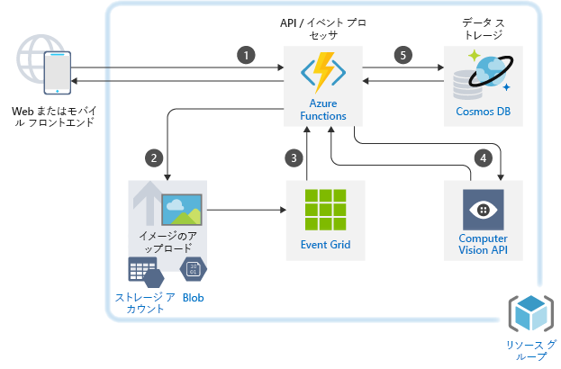
                        

                    

                    

                        <h3>Azure での保険金請求イメージの分類</h3>
                        
ご使用の Azure アプリケーションに画像処理を組み込みます。

                    

                

            

        

    </a>
</li>
</ul>

## アプリケーションのシナリオ

<ul  class="panelContent cardsC">
<li style="display: flex; flex-direction: column;">
    <a href="./apps/apim-api-scenario.md" style="display: flex; flex-direction: column; flex: 1 0 auto;">
        

            

                

                    

                        

                            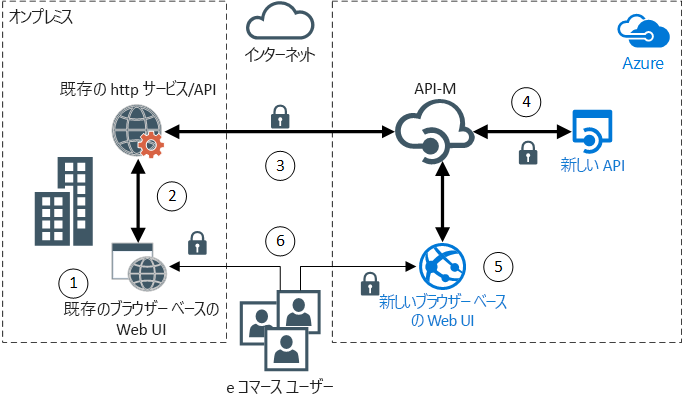
                        

                    

                    

                        <h3>Azure 上の API ベースのアーキテクチャへの、従来の Web アプリケーションの移行</h3>
                        
Azure API Management を使用して、従来の Web アプリケーションを最新化します。

                    

                

            

        

    </a>
</li>
<li style="display: flex; flex-direction: column;">
    <a href="./apps/app-monitoring.md" style="display: flex; flex-direction: column; flex: 1 0 auto;">
        

            

                

                    

                        

                            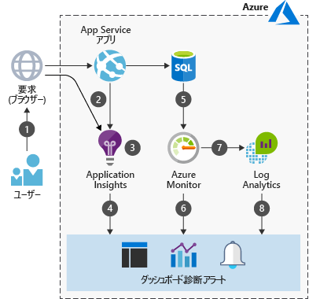
                        

                    

                    

                        <h3>Azure での Web アプリケーションの監視</h3>
                        
Azure App Service でホストされる Web アプリケーションを監視します。

                    

                

            

        

    </a>
</li>
<li style="display: flex; flex-direction: column;">
    <a href="./apps/decentralized-trust.md" style="display: flex; flex-direction: column; flex: 1 0 auto;">
        

            

                

                    

                        

                            
                        

                    

                    

                        <h3>Azure における銀行間での分散型信頼</h3>
                        
一元化されたデータベースを使用せずに、信頼できる環境を確立して、通信と情報共有を実現します。

                    

                

            

        

    </a>
</li>
<li style="display: flex; flex-direction: column;">
    <a href="./apps/devops-dotnet-webapp.md" style="display: flex; flex-direction: column; flex: 1 0 auto;">
        

            

                

                    

                        

                            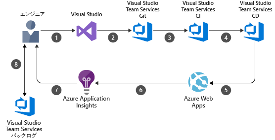
                        

                    

                    

                        <h3>Azure DevOps を使用した CI/CD パイプライン</h3>
                        
Azure DevOps を使用して .NET アプリを構築し、Azure Web Apps にリリースします。

                    

                

            

        

    </a>
</li>
<li style="display: flex; flex-direction: column;">
    <a href="./apps/devops-with-aks.md" style="display: flex; flex-direction: column; flex: 1 0 auto;">
        

            

                

                    

                        

                            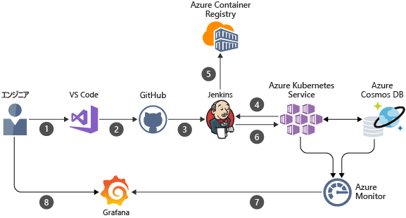
                        

                    

                    

                        <h3>コンテナー ベースのワークロード用の CI/CD パイプライン</h3>
                        
Jenkins、Azure Container Registry、Azure Kubernetes Service、Cosmos DB、Grafana を使用して Node.js Web アプリの DevOps パイプラインを構築します。

                    

                

            

        

    </a>
</li>
<li style="display: flex; flex-direction: column;">
    <a href="./apps/ecommerce-scenario.md" style="display: flex; flex-direction: column; flex: 1 0 auto;">
        

            

                

                    

                        

                            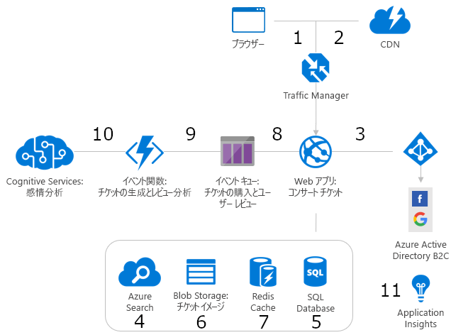
                        

                    

                    

                        <h3>Azure の eコマース フロントエンド</h3>
                        
Azure で eコマース サイトをホストします。

                    

                

            

        

    </a>
</li>
<li style="display: flex; flex-direction: column;">
    <a href="./apps/ecommerce-search.md" style="display: flex; flex-direction: column; flex: 1 0 auto;">
        

            

                

                    

                        

                            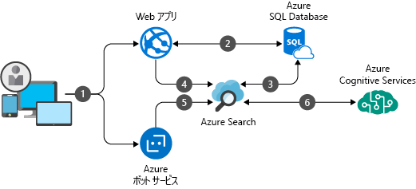
                        

                    

                    

                        <h3>eコマースのインテリジェントな製品検索エンジン</h3>
                        
eコマース アプリケーションに世界水準の検索エクスペリエンスを提供します。

                    

                

            

        

    </a>
</li>
<li style="display: flex; flex-direction: column;">
    <a href="./apps/hpc-saas.md" style="display: flex; flex-direction: column; flex: 1 0 auto;">
        

            

                

                    

                        

                            
                        

                    

                    

                        <h3>Azure でのコンピューター支援エンジニアリング サービス</h3>
                        
Azure で、コンピューター支援エンジニアリング (CAE) に、サービスとしてのソフトウェア (SaaS) プラットフォームを提供します。

                    

                

            

        

    </a>
</li>
<li style="display: flex; flex-direction: column;">
    <a href="./apps/sap-dev-test.md" style="display: flex; flex-direction: column; flex: 1 0 auto;">
        

            

                

                    

                        

                            
                        

                    

                    

                        <h3>Azure での SAP ワークロード向けの開発/テスト環境</h3>
                        
SAP ワークロード向けの開発/テスト環境を構築します。

                    

                

            

        

    </a>
</li>
<li style="display: flex; flex-direction: column;">
    <a href="./apps/sap-production.md" style="display: flex; flex-direction: column; flex: 1 0 auto;">
        

            

                

                    

                        

                            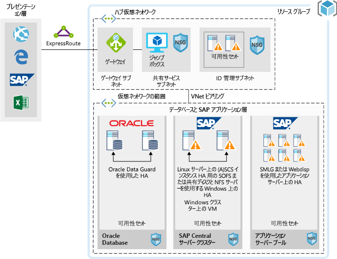
                        

                    

                    

                        <h3>Azure での Oracle データベースを使用した SAP 運用環境ワークロードの実行</h3>
                        
Oracle データベースを使用して Azure で SAP 運用環境デプロイを実行します。

                    

                

            

        

    </a>
</li>
</ul>

## データ シナリオ

<ul  class="panelContent cardsC">
<li style="display: flex; flex-direction: column;">
    <a href="./data/big-data-with-iot.md" style="display: flex; flex-direction: column; flex: 1 0 auto;">
        

            

                

                    

                        

                            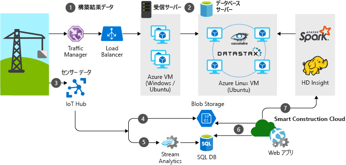
                        

                    

                    

                        <h3>建設業界での IoT とデータ分析</h3>
                        
IoT デバイスとデータ分析を使用して、建設プロジェクトを包括的に管理および運用します。

                    

                

            

        

    </a>
</li>
<li style="display: flex; flex-direction: column;">
    <a href="./data/data-warehouse.md" style="display: flex; flex-direction: column; flex: 1 0 auto;">
        

            

                

                    

                        

                            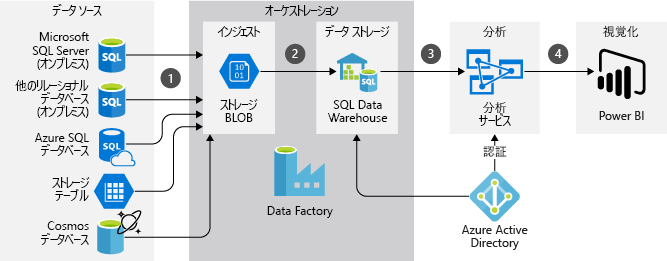
                        

                    

                    

                        <h3>販売およびマーケティング向けのデータ ウェアハウスと分析</h3>
                        
複数のソースのデータを統合し、データ分析を最適化します。

                    

                

            

        

    </a>
</li>
<li style="display: flex; flex-direction: column;">
    <a href="./data/ecommerce-order-processing.md" style="display: flex; flex-direction: column; flex: 1 0 auto;">
        

            

                

                    

                        

                            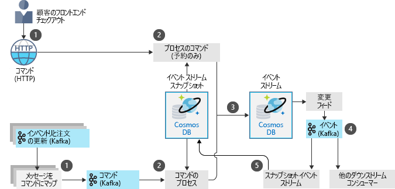
                        

                    

                    

                        <h3>Azure でのスケーラブルな注文処理</h3>
                        
Azure Cosmos DB を使用して高度にスケーラブルな注文処理パイプラインを構築します。

                    

                

            

        

    </a>
</li>
<li style="display: flex; flex-direction: column;">
    <a href="./data/fraud-detection.md" style="display: flex; flex-direction: column; flex: 1 0 auto;">
        

            

                

                    

                        

                            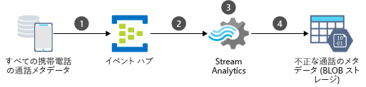
                        

                    

                    

                        <h3>Azure におけるリアルタイムでの不正検出</h3>
                        
Azure Event Hubs と Stream Analytics を使用して、リアルタイムで不正行為を検出します。

                    

                

            

        

    </a>
</li>
<li style="display: flex; flex-direction: column;">
    <a href="./data/realtime-analytics-vehicle-iot.md" style="display: flex; flex-direction: column; flex: 1 0 auto;">
        

            

                

                    

                        

                            
                        

                    

                    

                        <h3>自動車のリアルタイム IoT データのインジェストと処理</h3>
                        
IoT を使用して、リアルタイムの車両データを取り込んで処理します。

                    

                

            

        

    </a>
</li>
</ul>

## インフラストラクチャ シナリオ

<ul  class="panelContent cardsC">
<li style="display: flex; flex-direction: column;">
    <a href="./infrastructure/hpc-cfd.md" style="display: flex; flex-direction: column; flex: 1 0 auto;">
        

            

                

                    

                        

                            
                        

                    

                    

                        <h3>Azure での計算流体力学 (CFD) シミュレーションの実行</h3>
                        
Azure で計算流体力学 (CFD) シミュレーションを実行します。

                    

                

            

        

    </a>
</li>
<li style="display: flex; flex-direction: column;">
    <a href="./infrastructure/linux-vdi-citrix.md" style="display: flex; flex-direction: column; flex: 1 0 auto;">
        

            

                

                    

                        

                            
                        

                    

                    

                        <h3>Citrix を使用した Linux 仮想デスクトップ</h3>
                        
Azure で Citrix を使用して Linux デスクトップ向けの VDI 環境を構築します。

                    

                

            

        

    </a>
</li>
<li style="display: flex; flex-direction: column;">
    <a href="./infrastructure/regulated-multitier-app.md" style="display: flex; flex-direction: column; flex: 1 0 auto;">
        

            

                

                    

                        

                            
                        

                    

                    

                        <h3>規制対象業界向けのセキュリティで保護された Windows Web アプリケーション</h3>
                        
スケール セット、Application Gateway、ロード バランサーを使用して、セキュリティで保護された多層 Web アプリケーションを、Azure 上の Windows Server を使用して構築します。

                    

                

            

        

    </a>
</li>
<li style="display: flex; flex-direction: column;">
    <a href="./infrastructure/service-fabric-microservices.md" style="display: flex; flex-direction: column; flex: 1 0 auto;">
        

            

                

                    

                        

                            
                        

                    

                    

                        <h3>Service Fabric を使用したモノリシック アプリケーションの分解</h3>
                        
大規模なモノリシック アプリケーションをマイクロサービスに分解します。

                    

                

            

        

    </a>
</li>
<li style="display: flex; flex-direction: column;">
    <a href="./infrastructure/video-rendering.md" style="display: flex; flex-direction: column; flex: 1 0 auto;">
        

            

                

                    

                        

                            
                        

                    

                    

                        <h3>Azure での 3D ビデオのレンダリング</h3>
                        
Azure Batch サービスを使用して、Azure でネイティブ HPC ワークロードを実行します。

                    

                

            

        

    </a>
</li>
<li style="display: flex; flex-direction: column;">
    <a href="./infrastructure/wordpress.md" style="display: flex; flex-direction: column; flex: 1 0 auto;">
        

            

                

                    

                        

                            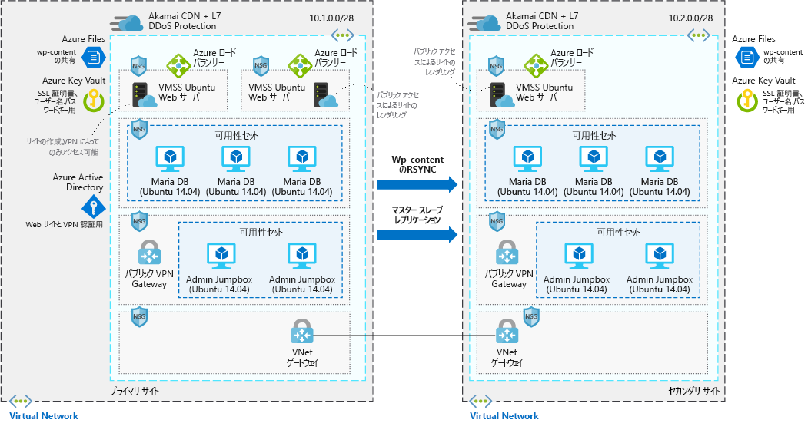
                        

                    

                    

                        <h3>Azure での高度にスケーラブルで安全な WordPress Web サイト</h3>
                        
メディア イベント用の高度にスケーラブルで安全な WordPress Web サイトを構築します。

                    

                

            

        

    </a>
</li>
</ul>

